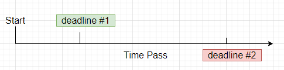

和 Context 相关的**疑惑**：

1. context 是什么？

2. context 在 Go 中有什么用途？为什么要引入 context？

3. WithCancel、WithDeadline、WithTimeout 的应用场景分别是什么？

4. 在使用时，有哪些特别需要注意的坑？

5. Context：上下文定义、可以 cancel 的上下文、带时间的上下文、带 KV 的上下文、多线程上下文控制、上下文树、关闭上下文

6. context 如何被取消？

7. cancelFunc 和 Done 之间是什么关系？

   cancelFunc 的调用或执行，会导致 Done channel 关闭。但这——cancelFunc 只是 Done channel 关闭的引发因素。针对不同的情况，还有其他因素。WithCancel：

8. context.Value 的查找过程是怎样的

Go 标准库的 context 包定义了 Context 类型，这个类型的变量会“携带”最后期限、取消 signal 和一些穿梭在 API 边界（似乎和 API 调用时的栈帧相关）和调用处理中的与“请求区间”（似乎和 request 网络请求相关）有关的值。

Server 接收到一个到来的 request 时（似乎和 HTTP 服务器相关），会创建一个 Context 类型值，紧接着的一系列调用都应该接受一个 Context 类型值。于此相关的**方法调用链**必需要能传递这个 Context 类型值，另外还可以**使用 WithCancel、WithDeadline、WithTimeout 或者是 WithValue 创建一个衍生出的 Context 作为可选项**替换原先的 Context 类型值。当一个 Context 值被取消，所有由该 Context 值衍生出的 Context 值都会被取消。

使用 WithCancel、WithDeadline 和 WithTimeout 函数能够在 Context（父辈）的基础上衍生出一个 Context 值（孩子），并携带一个 CancelFunc 类型值。<u>调用 CancelFunc 时，会**取消**其孩子以及子孙的**执行**，**移除**孩子和父辈之间的**引用关系**，并停止与之关联的任何**计时器**。如果没有调用 CancelFunc 会导致**泄漏**其孩子及其子孙，直到父辈的 Context 类型值被取消，或者**计时时间到**为止。</u>go vet 工具会检测 CancelFunc 类型值是否用在**控制流路径**上。

使用 Context 的程序需要遵循如下的规则在包之间保持**接口兼容**，同时让 go **静态分析工具**能有效检查 Context 的衍生关系：

* 不要在一个结构体类型中保有 Context 变量值，取而代之的是：显式地为每个需要 Context 类型值的函数传递一个参数，且应该是首个参数值。

~~~go
func DoSometing(ctx context.Context, arg Arg) error {
    // ... use ctx ...
}
~~~

* 不要传递一个 nil 值给 Context 类型变量，即使函数允许这样做。当不确定是否需要使用时，可传递 context.TODO 值。
* 仅仅是在和 HTTP 请求区域（范围）相关的处理和 API 调用中使用 Context Values，而不是在其他函数中为了传递额外的参数使用 Context 类型值。

相同的 Context 类型值可能会被传递到运行在不同 goroutine 的函数中，这种场景中，Context 的使用是并发安全的。

### Variables

Canceled 是一个 error 类型的值。当 Context 类型值被取消时，在 Context.Err 方法中返回该值。

~~~go
var Canceled = errors.New("context canceled")
~~~

与之对应，DeadlineExceeded 也是一个 error 类型的值，当 Context 类型值抵达期限时 deadline，可通过 Context.Err 方法获得：

~~~go
// DeadlineExceeded is the error returned by Context.Err when the context's
// deadline passes.
var DeadlineExceeded error = deadlineExceededError{}

type deadlineExceededError struct{}

func (deadlineExceededError) Error() string   { return "context deadline exceeded" }
func (deadlineExceededError) Timeout() bool   { return true }
func (deadlineExceededError) Temporary() bool { return true }
~~~

### func WithCancel

~~~go
func WithCancel(parent Context) (ctx Context, cancel CancelFunc)

// A CancelFunc tells an operation to abandon its work.
// A CancelFunc does not wait for the work to stop.
// A CancelFunc may be called by multiple goroutines simultaneously.
// After the first call, subsequent calls to a CancelFunc do nothing.
type CancelFunc func()

// A cancelCtx can be canceled. When canceled, it also cancels any children
// that implement canceler.
type cancelCtx struct {
	Context

	mu       sync.Mutex            // protects following fields
	done     chan struct{}         // created lazily, closed by first cancel call
	children map[canceler]struct{} // set to nil by the first cancel call
	err      error                 // set to non-nil by the first cancel call
}
~~~

函数 WithCancel 的返回值有 2 个，分别是一份对 parent 的拷贝，同时附带了一个新建的 Done Channel。这个返回的 Done Channle 会在如下情形会**关闭 Close**：

1. 调用了 cancel
2. parent 的 Context 类型值的 Done 关闭

上述无论哪个情况发生先发生，都会让这个 Done Channel 关闭。

**取消**（动词，表示调用这个 Context 的 cancel 函数）这个 Context 会**释放与之相关的系统资源**（否则会导致泄漏），因此，在程序中应该尽可能要在 Context 结束时调用 cancel 函数（避免资源泄漏）。

比如下述示例程序：

~~~go
package main

import (
	"context"
	"fmt"
)

func main() {
	gen := func(ctx context.Context) <-chan int {
		origin := make(chan int)
		n := 0

		go func() {
			for {
				select {
				case <-ctx.Done(): // 注意 context 不在同一个 goroutine
					return
				case origin <- n:
					n++
				}
			}
		}()

		return origin
	}

	ctx, cancel := context.WithCancel(context.Background())
	defer cancel()

	for val := range gen(ctx) { // 消费者：消费 gen(ctx) 中获取到的 <-chan int
		fmt.Println("val:", val)
		if val == 5 {
			break // trigger to call cancel()
		}
	}
}
~~~

gen 函数会返回一个 Channel，在另外的 goroutine 中产生数据，并将产生的数据发送到 Channel 中。该 Channel 作为数据源，相当于是**生产者**。

原先的 goroutine 中是一个数据的消费者，执行 cancel 表示的是不需要数据，相当于通知生产者退出。此时退出后，相当于是**不会让 goroutine 一直运行，从而导致资源泄漏**。

**关键内容**：gen 函数中不会让 goroutine 泄漏资源

### func WithDeadline

~~~go
func WithDeadline(parent Context, d time.Time) (Context, CancelFunc)

// A timerCtx carries a timer and a deadline. It embeds a cancelCtx to
// implement Done and Err. It implements cancel by stopping its timer then
// delegating to cancelCtx.cancel.
type timerCtx struct {
	cancelCtx
	timer *time.Timer // Under cancelCtx.mu.

	deadline time.Time
}
~~~

关键点：timerCtx 结构体类型**内嵌**了 cancelCtx 类型

WithDeadline 函数会返回返回一个 parent 的拷贝，同时会附带有一个已调整过的 deadline。如果 parent Context 的 deadline 早于参数 d 表示的时间，返回的结果就和 parent 相同。也就是说，d 必须早于 parent 对应的 deadline，才是会创建一个新的 timerCtx。

有 3 种情况能让 WithDeadline 的 timerCtx 的 Channel 关闭：

1. 截止时间已到
2. cancel 被调用
3. parent 的 Channel 被关闭

和 cancelCtx 类似，都是需要调用 cancel 的，否则会导致资源泄漏。

~~~go
const shortDuration = 1 * time.Second

func withDeadline() {
	d := time.Now().Add(shortDuration)

	ctx, cancel := context.WithDeadline(context.Background(), d)
	defer cancel()

	select {
	case <-time.After(2 * time.Second):
		fmt.Println("Overslept")
	case <-ctx.Done():
		fmt.Println(ctx.Err())
	}
}
~~~

在需要具备有倒计时功能（deadline）中使用 timeCtx，起到作用的是结构体中的 timer。

### func WithTimeout

~~~go
func WithTimeout(parent Context, timeout time.Duration) (Context, CancelFunc)
~~~

比较 WithTimeout 和 WithDeadline 的区别，前者的入参类型是 time.Duration（**时间段**），后者是 time.Time（确定的**时间点**）。

因此，本质上，WithTimeout 相当于是：`WithDeadline(parent, time.Now().Add(timeout))` 可以这样理解，在当前时间的基础上增加**时间段**。因此在使用上，其实没什么区别的。

~~~go
func withTimeout() error {
	delay, cancel := context.WithTimeout(context.Background(), 3*time.Second)
	defer cancel() // if slowOperation 在 timeout 之前完成，则释放资源
	return slowOperationWithTimeout(delay)
}

const duration = 2 * time.Second

func slowOperationWithTimeout(ctx context.Context) error {
	channel := make(chan int)
	go func() {
		// mock for slow operation
		time.Sleep(duration)
		channel <- 2
	}()

	select {
	case <-ctx.Done():
		fmt.Println("times up!")
		return errors.New(ctx.Err().Error())
	case <-channel:
		fmt.Println("nornal result return")
		return nil
	}
}
~~~

上面是一个**超时控制模型**，也就是说：必须在 delay 之前完成，否则返回超时 error。

### type CancelFunc

CancelFunc 类型的值表示的是一个舍弃功能，即让执行流程结束。

~~~go
// A CancelFunc tells an operation to abandon its work.
// A CancelFunc does not wait for the work to stop.
// A CancelFunc may be called by multiple goroutines simultaneously.
// After the first call, subsequent calls to a CancelFunc do nothing.
type CancelFunc func()
~~~

一个 CancelFunc 可能会并发执行，但这是安全的。首次执行 CancelFun 后，后续再次调用，不会做任何事。

比如：

~~~go
// cancel closes c.done, cancels each of c's children, and, if
// removeFromParent is true, removes c from its parent's children.
func (c *cancelCtx) cancel(removeFromParent bool, err error) {
	if err == nil {
		panic("context: internal error: missing cancel error")
	}
	c.mu.Lock()
	if c.err != nil {
		c.mu.Unlock()
		return // already canceled
	}
	c.err = err
	if c.done == nil {
		c.done = closedchan
	} else {
		close(c.done)
	}
	for child := range c.children {
		// NOTE: acquiring the child's lock while holding parent's lock.
		child.cancel(false, err)
	}
	c.children = nil
	c.mu.Unlock()

	if removeFromParent {
		removeChild(c.Context, c)
	}
}
~~~

并发安全，是因为在其中加了 `c.mu.Lock()`。

### type Context

一个 Context 类型的值装载了一个**截止时间**、**取消信号量**以及一些在 API 边界中传输的**值**。

Context 相关的方法**支持并发调用**。

~~~go
type Context interface {
    Deadline() (deadline time.Time, ok bool)
    
    Done() <-chan struct{}
    
    Err() error
    
    Value(key interface{}) interface{}
}
~~~

Context 是一个接口类型，下面来看看接口具备的功能及特点：

* Deadline()：方法返回 Context 类型的值表示的工作（完成时）可以**被取消的时间**，如果 Context 没有设置 deadline，返回的 ok 值是 false。连续调用 Deadline 获得**相同的结果**。
* Done()：调用 Done() 会返回**一个 channel 实例**，这个实例是指：Context 所表示的工作可以被取消时，channel 会**被关闭**。如果 Context 表示的工作不允许被取消，其返回值将是 nil；连续的调用 Done 获得**相同的结果**。关闭 channel 的操作可能会在 cancelFunc 返回后，**异步**发生。WithCancel 的**使用场景**是：cancelFunc 被调用时，Done() 表示的 channel 被关闭；WithDeadline 的**使用场景**是：deadline 已到达（到期），Done() 表示的 channel 被关闭；WithTimeout 的**使用场景**：超时时间已耗尽，Done() 表示的 channel 被关闭。Done() 被设计**用在 select 语句中**，比如下述的示例代码。

~~~go
func doneUsage() {
	ctx, cancel := context.WithDeadline(context.Background(), time.Now().Add(2*time.Second))
	defer cancel()

	channel := make(chan int)
	go stream(ctx, channel)

	for ele := range channel {
		fmt.Println(ele)
	}
}

func stream(ctx context.Context, out chan<- int) error {
	for {
		time.Sleep(500 * time.Millisecond)
		v, err := doSomething(ctx)
		if err != nil {
			return err // reason 2:
		}
		select {
		case out <- v:
			// nornal case
		case <-ctx.Done():
			close(out)
            return ctx.Err() // reason 1: WithDeadline 截止时间是运行 2*time.Second，并关闭 Done() 的 channel
		}
	}
}

func doSomething(ctx context.Context) (int, error) {
	return 1, nil
}
~~~

* Err()：如果 Done 还没有关闭，Err 返回 nil 值；如果 Done 已经关闭，Err 会返回一个 non-nil 值用于解释原因：Context 被取消了，或者是 deadline 到期。
* Value(key interface{}) interface{}：Value 方法返回在 Context 类型值中和 key 相关联的 value 值，如果在其中不存在和 key 相关联的值，返回 nil。仅仅当要在传输进程和 API 边界中使用 request-scoped 数据时，才是 WithValue 的使用场景，而不是为了传输可选的参数到函数中。Package 中定义 Context 使用的 key，需要确保**访问的类型安全（包级别的，未导出类型，避免冲突）**，比如下述的示例代码。Context 中的 Key 可以是任何类型，但必须是支持可比较（== 相等判断）

~~~go
package user // Package user defines a User type that's stored in Contexts.

import "context"

// User is the type of value stored in the Contexts.
type User struct {
	Name string
	Age  int
}

// key is an unexported type for keys defined in this package.
// This prevents collisions with keys defined in other packages.
type key int

// userKey is the key for user.User values in Contexts. It is
// unexported; clients use user.NewContext and user.FromContext
// instead of using this key directly.
var userKey key

// NewContext returns a new Context that carries value u.
func NewContext(ctx context.Context, u *User) context.Context {
	return context.WithValue(ctx, userKey, u)
}

// FromContext returns the User value stored in ctx, if any.
func FromContext(ctx context.Context) (*User, bool) {
	u, ok := ctx.Value(userKey).(*User)
	return u, ok
}
~~~

### func Background

~~~go
func Background() Context
~~~

Background 返回一个非 nil 的、空的 Context 值。该值不会被取消、没有任何 key-value 内容，也没有 deadline。一般情况下，使用在 main 函数中，为接收到的 Request 创建顶级的 Context 实例。

### func TODO

~~~go
func TODO() Context
~~~

TODO 返回一个非 nil 的、空的 Context 类型的实例。一般使用使用 TODO 的场景是这样的：代码还未确定使用什么 Context 类型的实例，或者是周围的函数还不确定是否需要使用 Context 类型的实例。

### func WithValue

~~~go
func WithValue(parent Context, key, val interface{}) Context

// A valueCtx carries a key-value pair. It implements Value for that key and
// delegates all other calls to the embedded Context.
type valueCtx struct {
	Context
	key, val interface{}
}
~~~

WithValue 返回一个 parent 的拷贝，同时携带了 key-val 的值。WithValue 的**使用场景**并不是为了传递一些可选的数据到函数中，而是**应用于 request-scoped 数据**。

为了避免在 package 之间使用 Context 可能产生的**冲突**，key 的类型必须是**可比较的**，而且不能是 string 等其他任何内置的基本类型。使用者一般会**自定义 key 的类型**。

~~~go
func withValueUsage() {
	type favContextKey string // 自定义的类型，虽然底层仍然是 string，但却不同
	f := func(ctx context.Context, k favContextKey) {
		if v := ctx.Value(k); v != nil {
			fmt.Println("found value:", v)
			return
		}
		fmt.Println("key not found:", k)
	}

	k := favContextKey("language")
	ctx := context.WithValue(context.Background(), k, "Go")

	f(ctx, k)
	f(ctx, favContextKey("color"))
}
~~~

如果直接使用 string 类型，IDE 会提示：`should not use built-in type string as key for value; define your own type to avoid collisions (SA1029)`
