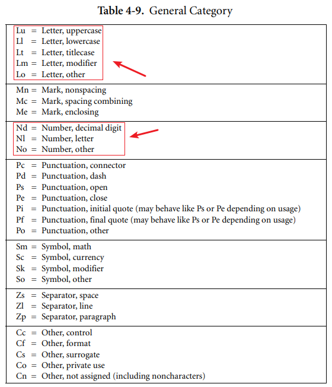

Go 中的**源代码**都是以 UTF-8 格式编码的 Unicode 文本。

文本没有规范化（canonicalized），因此单个重音码点与通过组合重音、字母而构成的同一个字符是不同的，它们被看作是两个码点。为简单起见，本文档将使用无条件（unqualified）的术语字符来指代源代码文本中的 Unicode 码点。

每个码点都是不同的，比如大小字母被看作是不同的字符。

实现约束：

* 为了保证和其他工具的兼容性，Go 编译器不允许在源代码文本中存在 NUL（U+0000）字符。
* 为了保证和其他工具的兼容性，Go 编译器将会忽略源代码文本中首个使用 UTF-8 编码格式的 (U+FEFF) Unicode 码点——字节顺序标记。在源中的任何地方，都不允许使用字节顺序标记。

Go 源代码中包含 2 个部分：

* Characters：字符
* Letters and digits：字母和数字

## Characters

用下面的分组来表达特定的 Unicode **字符**类型：

~~~go
newline        = /* the Unicode code point U+000A */ .
unicode_char   = /* an arbitrary Unicode code point except newline */ .
unicode_letter = /* a Unicode code point classified as "Letter" */ .
unicode_digit  = /* a Unicode code point classified as "Number, decimal digit" */ .
~~~

可认为 unicode_char 是包含 unicode_letter 和 unicode_digit 的。

在 `The Unicode Standard 8.0` 的 4.5 章节中定义了一系列的字符类型：

对于 Go 来说所有 Letter 类型中的 Lu/Ll/Lt/Lm/Lo 都看作是 Unicode 字母；对于数字分类中的 Nd/Nl/No 都看作是 Unicode 数字。

## Letters and digits

letter 字母和 digit 数字

下划线 `_` 看作是 letter 字母：

~~~go
letter        = unicode_letter | "_" .
decimal_digit = "0" … "9" .
binary_digit  = "0" | "1" .
octal_digit   = "0" … "7" .
hex_digit     = "0" … "9" | "A" … "F" | "a" … "f" .
~~~