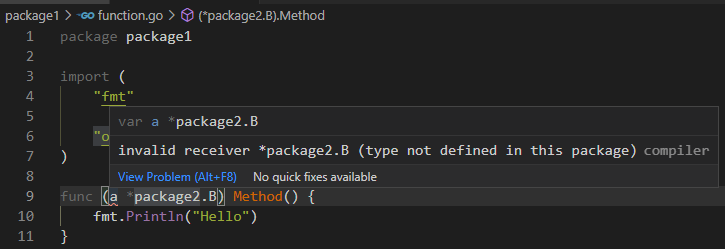

和**代码块**直接相关的是：**标识符的作用域**！

一个声明将一个非空标识符**绑定**到一个常量、类型、变量、函数、标记或者包上。在 Go 程序中使用到的标识符都应该被声明，只有在声明后才能被使用。在同一代码块中，标识符不能被重复声明。另外，标识符不能被同时声明在**文件代码块**和**包代码块**中。

* **文件代码块**：指代的就是某个具体的 .go 源代码文件；

* **包代码块**：指代的就是源代码 package 下的所有 .go 源代码文件。

比如同一个 lib 包下，存在 base.go 和 caller.go 源文件。其中 base.go 文件中定义了结构体：

~~~go
// RawReq 表示原生请求的结构。
type RawReq struct {
	ID  int64
	Req []byte
}
~~~

对应的，可以在 caller.go 源文件中定义如下结构体：

~~~go
// RawReq 表示原生请求的结构。
type rawReq struct {
	ID  int64
	Req []byte
}
~~~

那如果在 caller.go 源文件中定义 RawReq 结构体就会因为定义在了相同的 package 代码块中而提示错误。一旦标识符是可导出的（相对于 package 代码块而言），那就可以跨越文件代码块。

在一个声明中，空白标识符（在 Go 语言中使用下划线字符 `_` 代表空白标识符。）的使用方式和其他标识符一样。但空白标识符并**不会产生一个绑定关系**，因此不会被声明。

~~~go
package main

import "fmt"

func main() {
	_ := getValue() // no new variables on left side of :=
	fmt.Println(_) // cannot use _ as value or type
}

func getValue() int {
	return 0
}
~~~

从 IDE 的提示来看 `no new variables on left side of :=`，可以认为空白标识符是**声明在全局中的标识符**。而且 `cannot use _ as value or type` 可以看出，空白标识符没有产生和任何实体的绑定关系，也就不能当做一个值或类型使用。

在包代码块中，init 标识符仅仅只能被使用在 init 函数的声明，和空白标识符一样**不会产生一个绑定关系**。

~~~go
Declaration   = ConstDecl | TypeDecl | VarDecl .
TopLevelDecl  = Declaration | FunctionDecl | MethodDecl .
~~~

标识符作用域的含义是：**源代码的范围**，在这个范围中标识符可指代特定的常量、类型、变量、函数、标记或包。

在 Go 语言中，使用代码块（Block）来作为作用域：

* 预声明的标识符具有全局作用域，比如空白标识符、len、cap 等；
* 表示一个被声明在顶级范围（在任何一个函数外部）的常量、类型、变量、函数（非方法），其作用域是**包级作用域**；
* 一个被导入包的包名，其作用域是：该导入包的**文件（含有该导入声明语句）作用域**；
* 表示方法接收者、函数参数，或者结果变量的标识符作用域是其函数体；
* 在函数中声明的常量或变量的标识符，其作用域是：从常量声明或变量声明的结尾开始，到包含的代码块的最里面的部分。
* 在函数中声明的类型标识符，其作用域是：从类型声明的结尾开始，到包含的代码块的最里面的部分。

在一个代码块中声明的标识符，可能会在其内部的代码包中**被重复声明**。一旦被重复声明，在内部的作用域中，该标识符就会**“覆盖”**外部的标识符的含义。（两个完全不同的变量！）

包声明子句并不表示一个声明，包名不会出现在任何一个作用域中。包名或包名子句的作用是用来标识一个数据相同包的文件，并设置导入声明语句的默认包名。

~~~go
package main

import (
	"fmt"

	"opensource.com/loadgenerator/lib"
)
~~~

当前的 .go 文件属于 main 包，另外该文件导入了 `opensource.com/loadgenerator/lib` 包下的 .go 源文件。

# 1 标签作用域

标签使用标签语句声明，可以使用在 break、continue 和 goto 语句中。定义一个从未使用过的标签是非法的。与其他标识符相反，**标签不是块作用域的**，并且不会与不是标签的标识符冲突。标签的作用域是其所在的、被定义的函数体中，而不包括在该函数体内部定义的子函数体。

~~~go
package main

import "fmt"

func main() {
	var loopCount int

	if loopCount == 3 {
		goto Loop
	}
	fmt.Println("loopCount != 3")
Loop:
	for index := 0; index < 5; index++ {
		if index == 3 {
			loopCount = index
			break Loop
		}
	}

	fmt.Println("Loop over! loopCount:", loopCount)

	function := func(value int) {
		fmt.Println("nested function!")
		goto Loop // label Loop not declared
	}

	function(loopCount)
}

~~~

一定要注意：不要为 Loop 语句增加块作用域，也就是 `{}`。

# 2 空白标识符

在 Go 语言中使用下划线字符 `_` 代表空白标识符。

它用作匿名占位符，而不是常规（非空白）标识符，并且在**声明、操作符、赋值语句**中具有特殊含义。

# 3 预定义标识符

下面这些标识符被隐式定义在全局代码块中：

~~~go
Types:
	bool byte complex64 complex128 error float32 float64
	int int8 int16 int32 int64 rune string
	uint uint8 uint16 uint32 uint64 uintptr

Constants:
	true false iota

Zero value:
	nil

Functions:
	append cap close complex copy delete imag len
	make new panic print println real recover
~~~

可以分为 4 个部分：

1. 类型
2. 常量
3. 零值
4. 函数

# 4 可导出标识符

一个表示可被导出，其含义在于：授予了其他包可访问到该标识符的权限。定义一个可被导出的标识符必须同时具备如下属性：

1. 标识符的首字母大写；
2. 该标识符被定义在包级代码块中，或者是一个 struct 的字段名，或者是一个函数名。

# 5 标识符的唯一性

给定一组标识符集合，如果一个标识符和其他标识符不同，就称为标识符是唯一的。如果两个标识符的拼写不同，或者是它们出现在不同的包，或者是不可导出的，那这两个标识符就是不同的。反之，则是相同的标识符。

# 6 常量声明

一个常量声明语句，使用一系列的**常量表达式**将标识符和其对应的值绑定在一起。标识符的个数，一定是要和表达式的个数相同的。常量声明的构成如下：

~~~go
ConstDecl      = "const" ( ConstSpec | "(" { ConstSpec ";" } ")" ) .
ConstSpec      = IdentifierList [ [ Type ] "=" ExpressionList ] .

IdentifierList = identifier { "," identifier } .
ExpressionList = Expression { "," Expression } .
~~~

如果常量声明中明确写出了类型，那么常量会使用该指定的类型，并且表达式的值必须是可被赋值为该类型的。如果隐去了类型，常量则使用其对应表达的类型。如果表达式的值是无类型的常量，则该声明的常量仍然是该无类型，而且保持其相同的常量值。比如表达式是一个浮点字面值，常量标识符则代表的是一个浮点常量。

~~~go
const Pi float64 = 3.14159265358979323846
const zero = 0.0         // untyped floating-point constant
const (
	size int64 = 1024
	eof        = -1  // untyped integer constant
)
const a, b, c = 3, 4, "foo"  // a = 3, b = 4, c = "foo", untyped integer and string constants
const u, v float32 = 0, 3    // u = 0.0, v = 3.0
~~~

`untyped floating-point constant`、`untyped integer constant`，表示无类型的**浮点常量**、无类型的**整型常量**。

使用括弧括起来的 const 声明语句中，除了第一个常量必须要有值的表达式内容，其他可以省略。这样的空列表等效于第一个非空表达式列表及其类型的文本替换。被省略的表达式等价于是重复先前的列表值。联合 iota 常量生成器一起使用，提供了一种轻量级声明**顺序值**的机制：

~~~go
const (
	Sunday = iota
	Monday
	Tuesday
	Wednesday
	Thursday
	Friday
	Partyday
	numberOfDays  // this constant is not exported
)
~~~

其中 iota 是全局标识符：

~~~go
// iota is a predeclared identifier representing the untyped integer ordinal
// number of the current const specification in a (usually parenthesized)
// const declaration. It is zero-indexed.
const iota = 0 // Untyped int.
~~~

预定义  iota 类型是无类型的整型！

# 7 Itoa

在常量声明中，预定义的标识符 iota 代表的是顺序的无类型整型常量。iota 的值等于常量声明中 ConstSpec 的位置索引值，以 0 值作为起始值。可用于创建一系列相关的常量值：

~~~go
const (
	Sunday    = 1
	Monday    = 2
	Tuesday   = 3
	Wednesday = iota
	Thursday
	Friday
	Partyday
	numberOfDays // this constant is not exported
)

func main() {
	fmt.Println(numberOfDays)
}
PS G:\Go\go_developer_roadmap\OpenSource\LoadGenerator> go run main.go
7
~~~

实际得到的 numberOfDays 值是 7，也就是说，iota 的值是 const 常量声明中对应的行索引值。比如：如果 iota 在 Wednesday 这行，此行的值是 const 常量声明值的第 3 行，因此 iota 值就是 3。另外，此时 numberOfDays 其后并没有明确写出 iota 值，但实际上是**重复**了**先前的列表值**。

~~~go
const (
	c0 = iota // c0 == 0
	c1 = iota // c1 == 1
	c2 = iota // c2 == 2
)

const (
	a = 1 << iota // a == 1  (iota == 0)
	b = 1 << iota // b == 2  (iota == 1)
	c = 3         // c == 3  (iota == 2, unused)
	d = 1 << iota // d == 8  (iota == 3)
)

const (
	u         = iota * 42 // u == 0     (untyped integer constant)
	v float64 = iota * 42 // v == 42.0  (float64 constant)
	w         = iota * 42 // w == 84    (untyped integer constant)
)

const x = iota // x == 0
const y = iota // y == 0
~~~

根据定义，在相同的常量声明中，多次使用 iota 时，**具有相同的值**：

~~~go
const (
	bit0, mask0 = 1 << iota, 1<<iota - 1  // bit0 == 1, mask0 == 0  (iota == 0)
	bit1, mask1                           // bit1 == 2, mask1 == 1  (iota == 1)
	_, _                                  //                        (iota == 2, unused)
	bit3, mask3                           // bit3 == 8, mask3 == 7  (iota == 3)
)
~~~

这个例子说明的是：const 常量声明会隐式地重复上一个非空表达式！语法方面特别的是：

~~~go
const (
	u         = iota * 42 // u == 0     (untyped integer constant)
	v float64 = iota * 42 // v == 42.0  (float64 constant)
	w                     // w == 84    (untyped integer constant)
)
func main() {
	fmt.Printf("%T,%T,%T.\n", u, v, w)
}
PS G:\Go\go_developer_roadmap\OpenSource\LoadGenerator> go run main.go
int, float64, float64.
~~~

特别是 w 这个标识符的值、类型，都重复了 v 值的属性！不仅重复了，iota 的也随之改变了。

# 8 类型声明

一个类型声明，将一个标识符（类型名称）绑定到类型上。类型声明有 2 种不同的形态：**类型别名**和**类型重定义**。

~~~go
TypeDecl = "type" ( TypeSpec | "(" { TypeSpec ";" } ")" ) .
TypeSpec = AliasDecl | TypeDef .
~~~

一个别名的声明，将一个标识符绑定到一个已存在的类型上：

~~~go
AliasDecl = identifier "=" Type .
~~~

在标识符的作用域中，这个类型可看作是这个类型别名：

~~~go
type (
	nodeList = []*Node  // nodeList and []*Node are identical types
	Polar    = polar    // Polar and polar denote identical types
)
~~~

类型重定义使用与给定类型相同的基础类型和方法创建一个新的、独特的类型，并将标识符绑定到该类型上：

~~~go
TypeDef = identifier Type .
~~~

这个新的类型被称之为**重定义类型**：

~~~go
type (
	Point struct{ x, y float64 }  // Point and struct{ x, y float64 } are different types
	polar Point                   // polar and Point denote different types
)

type TreeNode struct {
	left, right *TreeNode
	value *Comparable
}

type Block interface {
	BlockSize() int
	Encrypt(src, dst []byte)
	Decrypt(src, dst []byte)
}
~~~

比如上述 TreeNode 可以看作是一个新类型，是一个和原先的 struct 不同的类型；同理，Block 接口类型也是和原先的 interface 类型不同的类型。

一个重定义类型可能有对应的方法，它并没有从给定的类型继承任何方法。但如果是一个接口或者是复合类型的元素类型（**嵌入字段**），其方法将不会有任何改变（相当于是从原始类型继承了方法）：

~~~go
// A Mutex is a data type with two methods, Lock and Unlock.
type Mutex struct         { /* Mutex fields */ }
func (m *Mutex) Lock()    { /* Lock implementation */ }
func (m *Mutex) Unlock()  { /* Unlock implementation */ }

// NewMutex has the same composition as Mutex but its method set is empty.
type NewMutex Mutex

// The method set of PtrMutex's underlying type *Mutex remains unchanged,
// but the method set of PtrMutex is empty.
type PtrMutex *Mutex

// The method set of *PrintableMutex contains the methods
// Lock and Unlock bound to its embedded field Mutex.
type PrintableMutex struct {
	Mutex
}

// MyBlock is an interface type that has the same method set as Block.
type MyBlock Block
~~~

作为示例，可看如下代码：

~~~go
package main

import (
	"fmt"
)

type A struct {
	a int
}

func (a A) function() {
	fmt.Println(a.a)
}

func main() {
	type B struct {
		A
	}

	var b B
	b = B{}
	b.A = A{
		a: 10,
	}

	b.function()
}
PS G:\Go\go_developer_roadmap\OpenSource\LoadGenerator> go run main.go
10
~~~

类型 B 具备也从 A 类型获得方法 function()。

如果是接口：

~~~go
package main

import "fmt"

type A interface {
	function()
}

type B A

type C struct {
	a int
}

func (c C) function() {
	fmt.Println(c.a)
}

func main() {
	var c C
	c = C{
		a: 10,
	}

	var b B
	b = c

	b.function()
}
PS G:\Go\go_developer_roadmap\OpenSource\LoadGenerator> go run main.go
10
~~~

使用类型重定义 B，接口类型 B 具有和接口类型 A 相同的方法！

类型重定义一般用来定义不同的布尔、整型、字符串类型，同时可以定义该类型相关的方法：

~~~go
type TimeZone int

const (
	EST TimeZone = -(5 + iota)
	CST
	MST
	PST
)

func (tz TimeZone) String() string {
	return fmt.Sprintf("GMT%+dh", tz)
}
~~~

一个变量声明创建了 1 个或多个变量，将对应的标识符绑定到对应的变量上，同时给定类型和初始值。

~~~go
VarDecl     = "var" ( VarSpec | "(" { VarSpec ";" } ")" ) .
VarSpec     = IdentifierList ( Type [ "=" ExpressionList ] | "=" ExpressionList ) .

IdentifierList = identifier { "," identifier } .

Type      = TypeName | TypeLit | "(" Type ")" .
TypeName  = identifier | QualifiedIdent .
TypeLit   = ArrayType | StructType | PointerType | FunctionType | InterfaceType |
	    SliceType | MapType | ChannelType .

ExpressionList = Expression { "," Expression } .
~~~

比如：

~~~go
var i int
var U, V, W float64
var k = 0
var x, y float32 = -1, -2
var (
	i       int
	u, v, s = 2.0, 3.0, "bar"
)
var re, im = complexSqrt(-1)
var _, found = entries[name]  // map lookup; only interested in "found"
~~~

如果变量的声明中给定了一系列的表达式，那么这些变量会被赋值为这些表达式的值（同时遵循赋值的规则，参考**赋值表达式**），否则会被赋予类型的零值。

如果在变量声明时，显式给定了类型，那么变量被赋予该类型，否则变量会被赋予赋值表达式的值类型。如果表达式中使用的是无类型的常量值，会被隐式转化为其默认类型。比如：如果使用的是无类型的布尔值，将会被转化为布尔类型。

~~~go
var d = math.Sin(0.5)  // d is float64
var i = 42             // i is int
var t, ok = x.(T)      // t is T, ok is bool
var n = nil            // illegal
~~~

实现约束：在一个函数体中，声明一个未使用的变量，这种情况编译器认为是非法的！

# 9 短变量声明

一个短变量声明使用如下语法：

~~~go
ShortVarDecl = IdentifierList ":=" ExpressionList .

IdentifierList = identifier { "," identifier } .

identifier = letter { letter | unicode_digit } .
~~~

文法格式中，identifier 的形式只能是一个**变量标识符的格式**，如下 IDE 就会报错：

~~~go
package main

import "fmt"

type A struct {
	a    int
	name string
}

type AInterface interface {
	function() (int, error)
}

func (obj *A) function() (int, error) {
	return 0, nil
}

func main() {
	ptr := &A{}
	ptr.a, b := ptr.function() // expected identifier on left side of :=
	fmt.Println(*ptr)

	c, d := ptr.function()
	c, e := ptr.function()
	fmt.Println(b, c, d, e)
}
~~~

上述示例程序在第 20 行会报出**文法错误**：`expected identifier on left side of :=`

这是一种针对常规变量声明的简短形式，同时使用了不带有类型的初始值：

~~~go
"var" IdentifierList = ExpressionList .
~~~

比如：

~~~go
i, j := 0, 10
f := func() int { return 7 }
ch := make(chan int)
r, w, _ := os.Pipe()  // os.Pipe() returns a connected pair of Files and an error, if any
_, y, _ := coord(p)   // coord() returns three values; only interested in y coordinate
~~~

和常规的变量声明不同的是，短变量声明可能会使用相同的类型重复声明变量（早些时候，这些变量已经在相同的代码块中声明过了；或者是在函数体中的参数列表中）。这种情况中，至少有一个是非空白的变量是新创建的。因此，这种重复声明只能出现在具有多个变量的短变量声明中。重复声明并不是引入了一个新的变量，而仅仅只是在原有变量的基础上赋值了新的值。

~~~go
field1, offset := nextField(str, 0)
field2, offset := nextField(str, offset)  // redeclares offset
a, a := 1, 2                   // illegal: double declaration of a or no new variable if a was declared elsewhere
~~~

短变量声明只能出现在函数体中。在 if、for 或者是 switch 语句的上下文环境中，短变量声明主要用来声明局部临时变量。

# 10 函数声明

函数声明将一个标识符（也就是函数名称）和函数绑定在一起：

~~~go
FunctionDecl = "func" FunctionName Signature [ FunctionBody ] .
FunctionName = identifier .
FunctionBody = Block .
~~~

在函数的签名部分，声明了函数的结果参数；函数体语句列表必须以 terminating statement 结尾！

~~~go
func IndexRune(s string, r rune) int {
	for i, c := range s {
		if c == r {
			return i
		}
	}
	// invalid: missing return statement
}
~~~

一个函数声明可能去掉了函数体。像这样的函数声明，是在 Go 外部实现的，比如一个汇编程序。

~~~go
func min(x int, y int) int {
	if x < y {
		return x
	}
	return y
}

func flushICache(begin, end uintptr)  // implemented externally
~~~

# 11 方法声明

一个方法和一个函数的区别在于：方法是具有接收者的。

一个方法的声明，和函数声明的不同之处是：**明确了方法的接收者的类型**。

~~~go
MethodDecl = "func" Receiver MethodName Signature [ FunctionBody ] .
Receiver   = Parameters .
~~~

Receiver 的类型必须是一个已定义的类型 T 或者是指向 T 的指针类型。其中，T 被称之为接收者的基本类型。方法的接收者的基本类型不能是一个指针或者接口类型，而且**方法声明和接收者的类型定义必须是在相同的包中**。通过方法声明，该方法已被绑定到接收者的基本类型上。方法名只对 T 或者 T 指针类型的选择器（selectors）可见。

一个非空白接收者标识符在方法签名中必须是唯一的。

对于基本类型，绑定在其上的非空白方法名必须是唯一的。如果基本类型是结构体，方法名还必须和字段名区别开来。

~~~go
func (p *Point) Length() float64 {
	return math.Sqrt(p.x * p.x + p.y * p.y)
}

func (p *Point) Scale(factor float64) {
	p.x *= factor
	p.y *= factor
}
~~~

上述方法声明中，将 Point 指针类型的方法 Length 和 Scale 绑定到基本类型 Point 上。

方法的类型，和函数的类型类似，但区别在于方法类型必须包含其接收者类型（作为其首个参数）。比如 Scale 方法类型：

~~~go
func(p *Point, factor float64)
~~~

