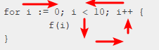

`Statements control execution.` 控制执行语句

~~~go
Statement =
	Declaration | LabeledStmt | SimpleStmt |
	GoStmt | ReturnStmt | BreakStmt | ContinueStmt | GotoStmt |
	FallthroughStmt | Block | IfStmt | SwitchStmt | SelectStmt | ForStmt |
	DeferStmt .

SimpleStmt = EmptyStmt | ExpressionStmt | SendStmt | IncDecStmt | Assignment | ShortVarDecl .
~~~

# 1 Terminating statements

# 2 Empty statements

# 3 Labeled statements

# 4 Expression statements

# 5 Send statements

# 6 IncDec statements

# 7 Assignments

# 8 If statements

# 9 Switch statements

# 10 For statements

For statements：意味着是重复执行的代码块。有 3 种形式：

* 有单一条件控制的循环
* for 子句（clause）
* range 子句

~~~go
ForStmt = "for" [ Condition | ForClause | RangeClause ] Block .
Condition = Expression .
~~~

分别对应 `[]` 中的 3 个部分：`Condition | ForClause | RangeClause`

## 10.1 Single condition

有单一条件控制的 for 语句，这是最简单的一种循环控制结构。

这种结构意味着：循环控制条件为 true 时，循环代码块会循环执行。条件会在每次迭代之前执行判断。如果没有任何条件判断，意味着相当于是布尔值 true。

~~~go
for a < b {
    a *= 2
}
~~~

## 10.2 For Clause

带有 for 子句的 `For Statements`，同样具有条件控制；除此之外，还会指定初始化语句和后执行语句（比如赋值语句，或者递增、递减语句）。初始化语句可能是一个短变量声明语句，但==后执行语句却不可以是短变量声明语句==！在初始化语句中声明的变量，会在每一次循环执行中都会被使用到。

~~~go
ForStmt = "for" [ Condition | ForClause | RangeClause ] Block .
Condition = Expression .

ForClause = [ InitStmt ] ";" [ Condition ] ";" [ PostStmt ] .
InitStmt = SimpleStmt .
PostStmt = SimpleStmt .
~~~

关于后执行语句的问题：

~~~go
func main() {
    for a := 1; a < 5; b := 1 { // compile error: cannot declare in post statement
		a += 1
		fmt.Println("a:", a)
		fmt.Println("b:", b)
	}
}
~~~

与之对应正确的是：

~~~go
for i := 0; i < 10; i++ {
    f(i)
}
~~~

`InitStmt` 在执行第一次 Condition 前执行一次，且仅执行一次；`PostStmt` 会在每次执行完循环语句块后都执行，且只有当 Block 执行完后才会再次执行 `PostStmt`。

`ForClause` 中的任一元素都可能是空的，但分号必须保留，除非仅存在条件控制语句 Condition。

如果缺少（absent）了条件控制语句 Condition，相当于是该部分是 true。这也就是和『有单一条件控制的循环』是相同的！

~~~go
for cond { S() } is the same as for ; cond; { S() }
for      { S() } is the same as for true    { S() }
~~~

比如下面这个示例：

~~~go
func main() {
	for a := 1; ; a += 1 {  // Condition为空，相当于是 true
		a += 1
		fmt.Println("a:", a)

		if a > 5 {
			break // 一旦此处 break，不再去执行 PostStmt
		}
	}
}
~~~

## 10.3 Range Clause

`RangeClause`—— range 子句就是包含有 range 的迭代语句，会依次迭代 array/slice/string/map/channel（允许 permitting 从 Channel 中获取到的）中的所有元素条目。对于每个元素条目，会赋值给迭代变量（如果存在的话），紧接着会执行 Block。

~~~go
RangeClause = [ ExpressionList "=" | IdentifierList ":=" ] "range" Expression .
~~~

上述代码中的 Expression 称之为 ==Range 表达式==，可以是 array/==array的指针==/slice/string/map/channel。

和赋值表达式一样，如果确实存在赋值，那么左侧的操作数（operand）一定是可寻址或映射索引表达式，意味（denote）着**迭代变量**。

如果 Expression 是一个 channel 变量，最多允许有一个**迭代变量**，但对于其他的 Expression 来说，可运行有多个。如果 `2nd value` 是 `_` 空标识符，该语句意味着和不包含该空标识符的语句有相同的含义。

`Expression`——range 表达式，会在循环开始前执行一次，但有一个例外：最多包含一个迭代变量，且 `len(x)` 值是常量的情况下， `Expression` 不会计算。

~~~go
func main() {
    var index int
	var ele int

	for index, ele = range getSlice() {  // 调用异常 getSlice()
		fmt.Println(index, ele)
	}
}

func getSlice() []int {
	return []int{1, 2, 3}
}
~~~

对于不同 Expression，产生的不同迭代变量如下：

~~~go
Range expression                          1st value          2nd value

array or slice  a  [n]E, *[n]E, or []E    index    i  int    a[i]       E
string          s  string type            index    i  int    see below  rune
map             m  map[K]V                key      k  K      m[k]       V
channel         c  chan E, <-chan E       element  e  E
~~~

* 第一种情况：若仅存在一个迭代变量的情况，其值的取值是 `[0, len(a) -1]`，并且不会索引到数组或切片本身；对于 nil 的切片来说，迭代次数为 0；
* 第二种情况：会从索引值是 0 的字节开始，依次迭代取到每一个 Unicode code 值。在连续的迭代中，索引值将会是字符串中连续 UTF-8 编码码点的第一个字节的索引，rune 类型的值是对应的 Unicode code 值。如果在迭代中遇到了非 UTF-8 的字符，rune 类型的值将会是 `0xFFFD`（Unicode 替代字符），并且下一次迭代将会前进 1 个字节；
* 第三种情况：map 的元素迭代遍历顺序是非固定的，也就是说连续两次的迭代顺序可能是不相同的。如果在迭代过程中删除了尚未到达的映射条目，则不会生成相应的迭代值；或者是在迭代过程中创建了条目，则该条目可能会产生（被遍历到）或者被跳过。如果 map 是 nil 空值，迭代次数是 0；
* 第四种情况：对于 channel 来说，迭代变量依次是被发送到 channel 的值，直到 channel 被关闭。如果 channel 是 nil 空值，Range 表达式会被持续阻塞。

**迭代值**会被赋予与之对应的**迭代变量**，可以将其看作是赋值表达式。

迭代变量可能会在 range 子句中使用短变量声明语句定义。这种情况下，迭代变量的类型会被设置为对应的迭代值，且其作用域是 for 语句的代码库，将会在每一次迭代中使用到。如果迭代变量在 for 语句之外声明了，其值将会是最后一次迭代计算的结果值。

比如：range 迭代的是 `*[3]int` 数组指针类型

~~~go
func main() {
	arrays := [3]int{1, 2, 3}

	ptr := &arrays
	fmt.Printf("%T\n", ptr) // ptr 类型是 *[3]int 类型
	for ele := range ptr {
		fmt.Println(ele)
	}
}
~~~

比如：range 迭代的是 string 类型

~~~go
func main() {
	unicodes := "中国"
	for index, value := range unicodes {
		fmt.Println(index, value)  // 0 20013 3 22269
	}
}
~~~

比如：range 迭代的是 `map[int]string` 类型

~~~go
func main() {
	var maps map[int]string
	maps = make(map[int]string)

	maps[1] = "1"
	maps[2] = "2"
	maps[3] = "3"

	for k, v := range maps {
		fmt.Println(k, v)  // maybe alse iterate 3 key! when the first is 3

		_, alreadythere := maps[3]  // delete k-v when k is 3
		if alreadythere {
			delete(maps, 3)
		}
	}
}
~~~

再比如：

~~~go
var testdata *struct {
	a *[7]int
}
for i, _ := range testdata.a {
	// testdata.a is never evaluated; len(testdata.a) is constant
	// i ranges from 0 to 6
	f(i)
}

var a [10]string
for i, s := range a {
	// type of i is int
	// type of s is string
	// s == a[i]
	g(i, s)
}

var key string
var val interface{}  // element type of m is assignable to val
m := map[string]int{"mon":0, "tue":1, "wed":2, "thu":3, "fri":4, "sat":5, "sun":6}
for key, val = range m {
	h(key, val)
}
// key == last map key encountered in iteration
// val == map[key]

var ch chan Work = producer()
for w := range ch {
	doWork(w)
}

// empty a channel
for range ch {}
~~~

# 11 Go statements

# 12 Select statements

select 语句和 break、return 关键字的联合使用：

~~~go
package main

import (
	"fmt"
	"time"
)

func main() {
	tick := time.NewTicker(time.Second)
	ch := tick.C

	index := 0
	for {
		select {
		case cur := <-ch:
			fmt.Println(cur)

			index++

			if index == 5 {
				break // 条件满足时，在 select 中调用 break
			}
		}
	}
}
~~~

在 select 中调用了 break，本意是跳出 for 循环，但此时并未奏效！需要将其置换为 return。

# 13 Return statements

# 14 Break statements

# 15 Continue statements

# 16  Goto statements

# 17 Fallthrough statements

# 18 Defer statements

