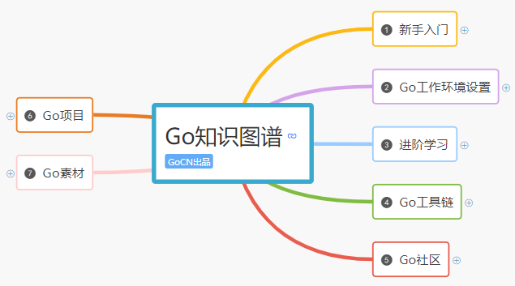
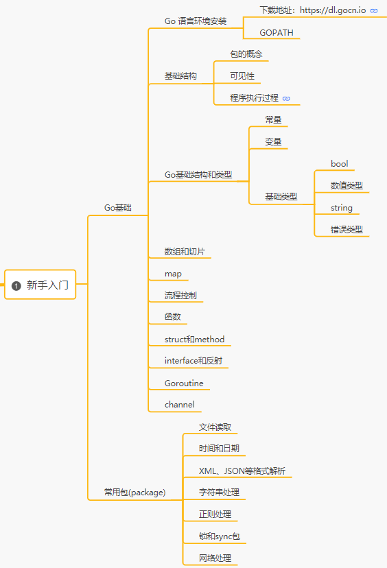
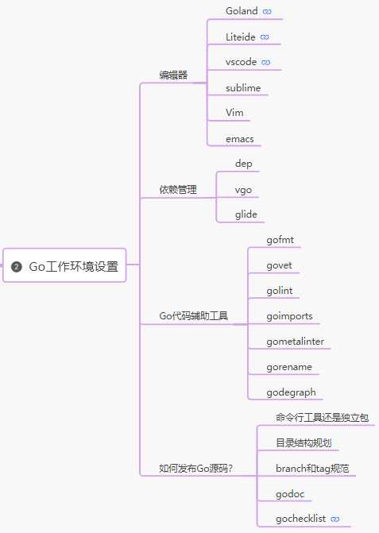
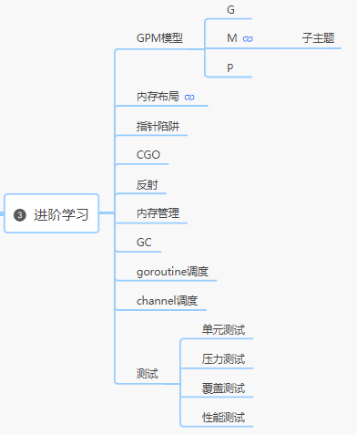
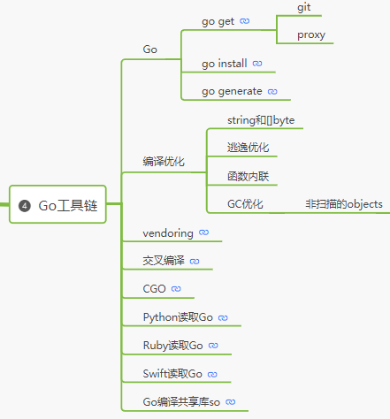
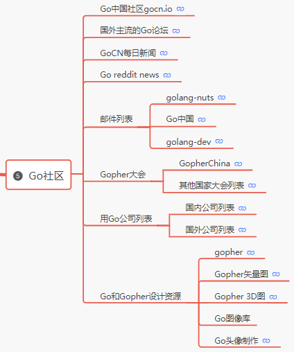
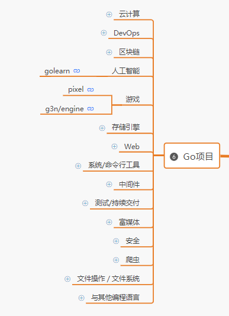
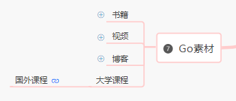

> 本知识图谱——[Go 知识图谱](https://www.processon.com/view/link/5a9ba4c8e4b0a9d22eb3bdf0#map)——由 [GopherChina社区](https://gocn.vip/) 出品！
>
> GopherChina专注于为 Go语言开发者的技术提升，用户数量、活跃度和内容热度均居国内首位。及时推送官方最新资讯、精选优质语言学习文档、传递**一手深工程实践经验**，并且会定期举办线下 meetup、峰会、培训及赛事，旨在打造**全方位权威的 Go 社区**。

聚焦高质量文章的**知识社区**包括：

1. 博客园
2. 知乎：[如何快速高效地学习 Go 语言](https://zhuanlan.zhihu.com/p/77999699)；[怎么学习 Golang？](https://www.zhihu.com/question/23486344/answer/787113240)
3. 掘金
4. 极客时间
5. V2EX
6. GitHub：[go-study-index Go 语言学习资料与社区索引](https://github.com/Unknwon/go-study-index)
7. ...

你想要的关于**产品、设计、研发、交互、运营等**都可以在上面找到对应文章内容。

把软件设计师、工程师的职业当做是：外科医生、花匠、修理工...你需要**打造自己的工具库**，做到心里**有“谱”（知识框架）**。你需要：**多学习:star::star:、即刻做项目（别把时间浪费在选择上 ）:star::star::star::star::star:、多总结:star::star::star:、多交友、拜访名师**... Coding 胜于一切！

（不推荐用看书的方式学习程序设计语言！）学外语最高效的办法，就是把你扔国外，为了生活，很快就学会。从实际项目开发（用技术产生效益）的角度来看：编程语言也可以看成一种外语，用着用着就会了（Coding 永远是最快速的学习方法）。不会用就搜，不会搜就瞎蒙，蒙对了是惊喜，蒙错了是经验。**多练习才会遇见问题，才会收获经验**。

> 在找路径、资源的过程中发现了一个初级学习者的痛点：**没有项目经验！**
>
> 预期可盈利项目：依次从初级、中级、高级、架构师的整个过程，找准每个阶段的关键点、目标、方法、途径、成果，整理成文，这个过程可以参考市面上相关的**在线课程**。后期可公布在微信公众号**打造个人 IP**，进一步可以**打造在线课程**（核心在于：**源代码、原理、功能模型的解读、项目实战等有门槛较高的知识**）。
>
> 所以，我的核心价值在于：项目实践！ :triangular_flag_on_post:

**2020年12月19日**，探索了 Go 进阶的 3 个方面工作，分别是**前后端项目应用方向、相关面试题（紧跟大厂开发路径）、实战项目**

『个人喜欢专注一种应用场景的语言，比如PHP专业做Web，C专门做系统，Go专门做网络服务，ASM负责调优性能...未来混合语言编程是主流。』项目开发成本，不在于项目复杂度，而在于你所用框架、语言的坑有多少。**语言的好坏是对应用场景来说的！**

* C 的优点：简单直接，特性少，功能强。历史悠久，社区资源丰富。C 的缺点：指针过于灵活，用户门槛高。手工管理内存心智负担高。对接口、闭包等高级特性表达上不够简洁。

* C++ 优点：表达力极强，功能强大。兼容 C。C++ 缺点：最复杂的语言，没有之一。指针过于灵活，用户门槛高。手工管理内存心智负担高。

* Java 优点：中规中矩。程序员多，社区资源丰富。内存管理基于 GC，心智负担低。基于 VM 字节码，天然提供了跨平台的插件机制。Java 缺点：语言 OO 流派痕迹明显，有些刻意。表达上有些死板，不够活泼（不是灵活）。

* Erlang 优点：语言特性简洁，且易于高并发程序的编写。内存管理基于 GC，心智负担低。Erlang 缺点：动态类型语言，工程质量保证的负担高。没有基础的int类型（只有bigInt），计算性能低。语言小众，社区资源少。

* Go优点：简单直接，特性少，表达力强（不只是功能强），心智负担低。低学习门槛，容易写出高质量代码，投入产出比最高。语言特性稳定，可以预期除了增加泛型不会再出现其他大的调整。工程支持程度高（尤其包的版本管理能力加上后）。兼容 C。内建高并发支持。创始团队能力强，迭代快。Go 缺点：还不支持泛型。兼容 C 在高并发的支持上做的还不够好。资源集中在服务端开发，桌面开发的社区资源少。

**3 个重点工作**：

1. 探索 Go 语言在前端和后端以及特定领域比如大数据、游戏领域的各种应用。早入坑，早就是优势，早一天就是一天的生产力！
2. Go 相关公司的面试题，这些面试题就是突破的门槛；
3. Go 实战项目，尽可能多做先实战项目。

**2020年12月18日**，**第一阶段**的目标是：成为初级工程师

* 打好语法基础，特别针对 Go 语言特性、特点进行深入理解；
* 此外，标准库和测试体系也是语言的关键基础组成部分。

参考资料重点推荐：
1. 《The Go Programming Language Specification》辅助以《Go 程序设计语言》
2. [《Go 语言实战》](https://book.douban.com/subject/27015617/) 参考 [【飞雪无情 】读书笔记](https://www.flysnow.org/archives/)

步骤是这样的：**在逐步推进《Go 语言实战》的过程中，遇到『语法问题』时参考《Go 程序设计语言》！**

（实践的过程，就是在不断修正理解）学习一门语言或者新东西的时候，想的和实践的是不一样。以前的一些理解，在真正地通过代码实践去验证的时候，发现和想的不一样。通过实践也不断地修正我以前错误的理解，让我对 Go 的理解更深入一些。

（基础很重要，框架只是工具）框架对我们来说，都是辅助我们工作的，是一套约定，是让我们可以更快速的开发项目，同事间协作也更容易。因为我们都有同样的基准规范，这就是框架的好处。

（看不如练，练不如讲）当你只是看的时候，会想当然的理解。有时候理解是对的，有时候又是错的，这个只能通过代码示例的练习可以发现。还有一些不理解的概念，如果你写几个程序，打印输出看结果，慢慢就理解了。这就是练的好处。读了，练了，自己学到了。但是如何给别人讲，让别人也能学到，甚至通过你的讲，让其他人更容易理解，甚至比书本更通俗易懂，这就是语言组织能力。通过给别人讲授，教别人也可以让自己理解地更深入，这就是“教是最好的学”。

（最重要的是，将看到、听到的知识，转化成自身的一部分，也有能力回答别人的疑问、困惑）通过上面阶段，需要形成自己的认知。将知识转化为自己知识体系、框架的一部分，最好是能够用自己的理解的语言描述出来。

『一路独自摸索，当然会遇到不少困难。然而，一旦把时间的刻度拉长，以十年为尺，这些算什么弯路？**以自己的方式坚持下去就是捷径**。失败了继续找书找资料，实在不行就算了嘛，那么多程序可以写，为什么非要死磕这个呢？所以当年虽然有很多尝试都是失败的，但是我觉得无所谓。尽管如此，有时候‘算了’之后的一段时间，偶然给我看到合适的资料，就又学了，还觉得挺惊喜的。我也经常通过 re-engineer（造轮子） 别人的东西来学习，看见一个什么东西就想自己写一遍。在这个过程中，不仅可以深刻地了解里面的道理，而且你经过亲自吃屎，你就能知道为什么作者要这么做而不要那么做，甚至你还可以发现可以改进的地方。当然这也需要大量的时间。』

「**一个人亲自开发一个复杂的东西，可以得到探索其他领域的动力**，我觉得这已经成为了我的习惯。」 最后，他总结说，自己学习编程只有一个**秘诀**。**学习编程，只要你能在过程中感到快乐，那所有的问题都是不存在的，你就会不断地把时间投入到学习编程中去，时间积累够了再怎样也熟能生巧了**。所以我一直都说，平均每天写 8 小时代码，从大一做到大四，不可能学不会的。有些人曾经提出反对意见，但归根结底都是因为他们不认为编程是这个世界上最有趣的事情。」

**2020年12月14日**：读[工程师应该怎么学习](https://xargin.com/how-to-learn/)有感，有感于工作、学习、生活的方法论、总结：

1. 建立自己的**测试代码库**；
2. 建立自己的 blog；
3. 建立自己的**笔记库**。

**2020年12月13日**：go 语言体系图——由张长志分享，将 go 语言知识粗略划分为如下部分

* 学习方法（方法论是永远不会过时的）：**多练习、多讨论、多找源码**
* 语言基础：语法、类型、变量、运算和语句、数组、切片、指针、结构题、Map、接口、类型转换、错误处理等。我最需要弄懂、实践的是 go 最重要的部分！找准**事物的核心**，找到对实体不理解的**主要矛盾**，暂时忽略次要矛盾。
* go 操作**数据库**部分，比如 MySql、Radius、mogodb 等
* 案例：博客系统、日志收集系统、秒杀、重写大数据 flume 收集等

**目标**：构建**面向实践的 go 语言实体系统**，比如《Go 语言实战》这本书提及的在 Go 中非常重要的各个实体，以这些实体作为分析、研究的对象，**把对这些实体的研究结果整理成文档**。

**2020年12月11日**：和 Java 比较起来，都是一门编程语言，都是要去应用这个语言去做项目，那问题在于**我的核心价值在哪？**为什么有的人就是能够到大公司去？那些大公司又创造了什么不一样的价值？我该怎么行动才能进去？

**拆分需要的技能**，问题转化为：为什么学？学什么？怎么学？这几个问题。使用**各个击破**的方式进行突破。

1.  Go 程序设计语言，当做是**工具书**；
2.  直接**转到项目实践**上去，遇到问题即查询上述工具书；
3.  收集实践项目，从单一功能软件，到大型工程项目逐步转变。**探索 Go 整个生态，以及应用的领域**；
4.  构建：**测试代码库、功能代码库、Blog、笔记库**，每周**总结项目经验**，让每一步都不白费，功不唐捐。

转变思路，从学习实践语言层面的角度转变到项目实践中去，**一切以项目实践为主要目标**！

# 0 指南

Golang 语言实践框架，基本可分为 4 个层次：

1. 第 1 层次（初级软件设计师）：**语法基础**，目标：熟练掌握语法；

2. 第 2 层次（中级软件设计师）：**实战和语言原理**，目标：以小项目为主，将第一层次的语法基础应用到项目功能实现中，**重点在于掌握原理**。逐步从项目的模块、功能，过渡到实际的大项目（整个后端）；

3. 第 3 层次（高级软件设计师）：**框架应用和进阶**，目标：以大项目和应用框架（前端和后端）为主，巩固语法和原理实践（呼应第一、二层次）。**以实际开源项目为主**。
4. 第 4 层次（架构师）：脱离语言框架，探索各种实际应用方向。

## 0.1 语法

**模块目标**：熟练掌握 Go 语言语法。

**参考资料**：

1. [《Go程序设计语言》](https://docs.hacknode.org/gopl-zh/)
2. [topgoer 电子书](http://www.topgoer.com/)
3. [Go 101](https://gfw.go101.org/article/101.html)
4. [Go 入门实战：从 0 到 1 开发一个抽奖系统](https://xiaozhuanlan.com/golang-from-zero-to-one/6537498120)

**能力构建模型**：

## 0.2 实战和语法原理

**模块目标**：以小项目为主，将第一层次的语法基础应用到项目功能实现中，**重点在于掌握原理**。逐步从（涉足项目的环境部署）项目的模块、功能，过渡到实际的大项目的整个实践（整个后端）。

**参考资料**：

1. 《Go语言实战》
2. 《Go语言学习笔记》
3. [《Go 语言编程之旅：一起用 Go 做项目》](https://github.com/go-programming-tour-book/tour)
4. [Go Web 编程](https://astaxie.gitbooks.io/build-web-application-with-golang/content/zh/)
5. Bilibili 模块源代码
6. Go 官方 package 源码库
7. [Go 语言高级编程](https://chai2010.gitbooks.io/advanced-go-programming-book/content/)

**能力构建模型**：

1. 搭建 Linux Server；
2. 熟悉前端、后端运行环境，能开发前后端功能模块；
3. 熟悉 Go 平台下的网络编程，熟悉 TCP/IP、HTTP 等网络协议，以及 gin、net、grpc、protobuf、echo 等网络组件；
4. 熟练使用 Go 相关的开发工具，快速定位线上问题；
5. 熟悉 MySQL/MongoDB/Redis 等基础存储组件的使用（关系型数据库和非关系型数据库）

字符串、切片的内存管理、面向并发的内存模型

## 0.3 框架和进阶

**模块目标**：以**完整的**项目和应用框架（前端和后端）为主，巩固语法和原理实践（呼应第一、二层次）。

**参考资料**：

1. Bilibili 网站源代码
2. Docker 源代码
3. [分布式缓存](https://github.com/cloudmzh/gocache)
4. [开源系统源码解读](https://xiaozhuanlan.com/opensource_go)

**能力构建模型**：

1. Web 端（前端）开发 和 服务端（后端）开发
2. RPC 框架
3. 服务端核心中间件：MQ/Cache/DB 等的研发与优化。对于存储组件的优化，一般涉及到：海量数据表涉及、维护、调优与调研
4. 熟悉 Go 下主流的开发框架：gin（Web 开发框架）、gorm（ORM 实体关系映射，对应数据存储） 、[Beego](https://mp.weixin.qq.com/s/qKwHsRkPPeqUvgEC4IswnQ) 最简单易用的企业级应用开发框架
5. Nginx 主流的服务端技术
6. 大流量 Web 应用架构

前端技术：

1. 七牛云，许式伟 《再谈 Go 语言在前端的应用前景》

后端技术：

1. 七牛云，许式伟 《七牛CEO许式伟：服务端开发那些事儿》

## 0.4 应用领域

容器化战略，Service mesh，服务治理，k8s 方向

分布式系统

SaaS/PaaS 系统开发

大数据仓库

Docker 容器技术

缓存、队列、存储、网络、代理、配置等各种服务端开源方案

高可用、高性能、高并发、高扩展系统设计

云原生技术，k8s、docker、微服务、服务网关和 devops 等

## 0.5 行业方向

即时通讯相关架构和开发

# 1 新手入门

# 2 工作环境

七牛：Goproxy 中国 https://goproxy.cn
阿里： mirrors.aliyun.com/goproxy/
官方： < 全球 CDN 加速 https://goproxy.io/>
其他：jfrog 维护 https://gocenter.io

# 3 进阶

# 4 工具链

# 5 社区

# 6 项目实践

写代码同写文章一样，既是技术活，又是艺术活。不是懂了语法就能够写出优秀的代码，也正如不是认识字就能够写出优美的文章一样。哪个作家不是饱读诗书，哪个架构师不是在代码堆里和 Bug 堆里泡出来的？因此，程序员刚入门除了读书外，**阅读好的代码**很重要。**阅读优秀的代码可以了解大牛开发的思路，软件架构和语言技巧等**。

程序开发无非：业务、数据结构和算法、网络和存储：

1. `Codis`：有 3 个方面的提升，网络编程、协程和数据结构。
2. `Etcd`：有 3 个方面的提升，网络编程、分布式算法和数据结构。
3. `Kubernetes`：Google 出品，必定经典。
4. `Caddy`：支持 HTTP/2 的 Web 服务端，一个显著的特性是默认启用 HTTPS，是第一个无需额外配置即可提供 HTTPS 特性的 Web 服务器。有 3 个方面的提升：高性能架构、网络编程和 HTTP 协议。
5. `Go-MySQL`：可以作为 MySQL 的从端。

# 7 素材

个人 IP 汇总：

1. [飞雪无情——专注于Android、Java、Go语言(golang)、移动互联网、项目管理、软件架构](https://www.flysnow.org/)
2. [鸟窝——大道至简](https://colobu.com/categories/Go/)
3. [mojotv](https://mojotv.cn/404#Golang)

