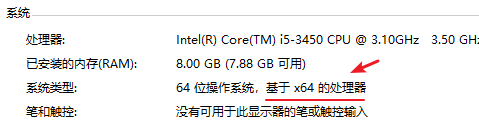
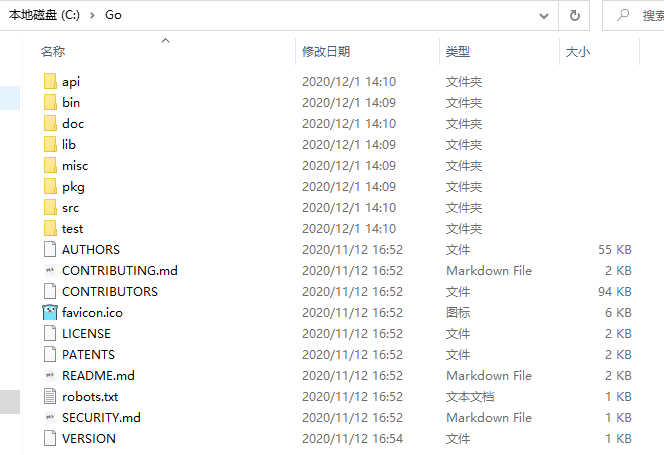
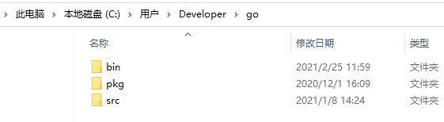
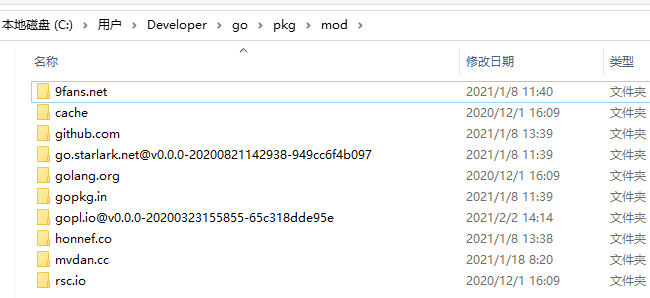

# 1 特定平台

首先从在 Windows 平台上搭建开发环境说起：

PC 端处理器型号：Intel(R) Core(TM) i5-3450 CPU @ 3.10GHz

安装 Go 的 Windows 版本后，得到的版本信息：go version go1.15.5 windows/amd64

默认安装的 Go 路径为：C:\Go，安装完毕后，会**修改系统环境变量或者用户变量**：

1. 用户变量增加：GOPATH —— %USERPROFILE%\go，在 C:\Users\Developer\go 目录下会创建 pkg 目录；
2. 用户变量 Path 增加：%USERPROFILE%\go\bin
3. 系统变量 Path 增加：C:\Go\bin

综合上述所有操作，我们搭建起了 Windows 平台下的 Go 开发环境！

现在来看看**为什么**是上述的这些步骤？

# 2 安装细节

要搭建 Go 语言开发环境，我们第一步要下载 Go 的开发工具包。Go 为我们所熟知的所有平台架构提供了开发工具包，比如我们熟知的 Linux、Mac、Windows 等。我们需要根据自己的机器操作系统选择相应的开发工具包。

在上述 Windows 平台下，我们解压缩获得了如下的内容文件：`c:\Go` 是 Go 开发环境的安装目录

紧接着是**环境变量**的配置：

1. **用户变量**：针对当前用户；
2. **系统变量**：针对所有用户。

首先明确告知 Windows 系统，`GOROOT` 所在的位置（在系统变量中新建变量 `GOROOT`，并设置值为 `C:\Go`）；在系统变量的 Path 中新增加值：`%GOROOT%\bin`，这样我们就可以直接在 cmd 控制台上输入 go 相关命令并执行。

另一个次重要环境变量是 `GOPATH`，在用户变量中（或者系统变量）新建变量 `GOPATH`，并设置值为 `C:\Users\Developer\go`。与此同时，将 `%GOPATH%\bin` 目录添加到 Path 中，就和 `GOROOT` 类似，可以直接在终端中使用我们 Go 开发生成的可执行程序。但需要指出的是：**当前 Go 采用了 Module 的方式管理项目后，GOPATH 目录已经不是那么重要了，其主要用来存放依赖的 Module 库、生成的可执行文件等**。

* bin 目录：存放 go install 命令生成的可执行文件；
* pkg 目录：存放 go 编译生产的文件；
* src 目录：存放非 Go Module 项目（存疑！）源代码。

比如我们在写测试程序时，直接在 `C:\Users\Developer` 目录下创建 `test.go` 目录，并在其下写 Go 工程代码，而**不再像以前一样局限**在 `%GOPATH%\src` 目录下。对于**创建的 `test.go` 项目**，需要执行 `go mod init test.go` 这个指令。对于创建的 `go.mod` 文件是 Go 语言工具链用于管理 Go 项目的一个配置文件，不用手动修改，Go 语言的工具链会帮我们自动更新，比如当我们的项目添加一个新的第三方库的时候。

（**功能程序的安装**）比如我们使用 `go install ...` 命令生成可执行程序，并供我们使用。比如我们在 `C:\Users\Developer\test.go` 目录中执行 `go install test.go` 即可将源代码编译成可执行文件，并将其放置到 GOPATH 目录下的 bin 目录中。如此这般，我们就可在 CMD 中直接输入 `test.go` 调用该可执行文件功能。

# 3 配置 go env 环境变量

我们以 Windows 平台下的开发环境作为例子：

~~~go
C:\Users\Developer>go env
set GO111MODULE=on
set GOARCH=amd64
set GOBIN=C:\Users\Developer\go\bin
set GOCACHE=C:\Users\Developer\AppData\Local\go-build
set GOENV=C:\Users\Developer\AppData\Roaming\go\env
set GOEXE=.exe
set GOFLAGS=
set GOHOSTARCH=amd64
set GOHOSTOS=windows
set GOINSECURE=
set GOMODCACHE=C:\Users\Developer\go\pkg\mod
set GONOPROXY=
set GONOSUMDB=
set GOOS=windows
set GOPATH=C:\Users\Developer\go
set GOPRIVATE=
set GOPROXY=https://goproxy.io,direct
set GOROOT=c:\go
set GOSUMDB=sum.golang.org
set GOTMPDIR=
set GOTOOLDIR=c:\go\pkg\tool\windows_amd64
set GCCGO=gccgo
set AR=ar
set CC=gcc
set CXX=g++
set CGO_ENABLED=1
set GOMOD=NUL
set CGO_CFLAGS=-g -O2
set CGO_CPPFLAGS=
set CGO_CXXFLAGS=-g -O2
set CGO_FFLAGS=-g -O2
set CGO_LDFLAGS=-g -O2
set PKG_CONFIG=pkg-config
set GOGCCFLAGS=-m64 -mthreads -fmessage-length=0 -fdebug-prefix-map=C:\Users\DEVELO~1\AppData\Local\Temp\go-build833344598=/tmp/go-build -gno-record-gcc-switches
~~~

下面对上述内容做详细说明：

|    名称     |                 功能说明                 |                            值                             |
| :---------: | :--------------------------------------: | :-------------------------------------------------------: |
|    GOOS     |      程序**构建环境**的目标操作系统      |                          windows                          |
|   GOARCH    |     程序**构建环境**的目标处理器架构     |                           amd64                           |
|  GOHOSTOS   |      程序**运行环境**的目标操作系统      |                          windows                          |
| GOHOSTARCH  |     程序**运行环境**的目标处理器架构     |                           amd64                           |
|    GOEXE    |              可执行文件后缀              |                           .exe                            |
|   GOROOT    |    Go 开发环境的安装目录（绝对路径）     |                           c:\go                           |
|   GOPATH    |          工作区目录（绝对路径）          |                   C:\Users\Developer\go                   |
|    GOBIN    |     存放可执行文件的目录（绝对路径）     |                 C:\Users\Developer\go\bin                 |
|   GOCHAR    | 程序构建环境的目标处理器架构的单字符标识 | C:\Users\Developer\AppData\Local\go-build（00 ~ ff 目录） |
| CGO_ENABLED |       指明 cgo 工具是否可用的标识        |                             1                             |
|  GOTOOLDIR  |          Go 工具目录的绝对路径           |               c:\go\pkg\tool\windows_amd64                |

我们在当前环境下执行运行和安装时，都是**默认根据我们当前的机器环境**编译、生成的可执行文件，比如我们当前就是 `windows` 平台下的 `amd64` 处理器架构。即：`GOOS` 和 `GOARCH` 的组合。如果我们要生成不同平台架构的可执行程序，只要改变 `GOOS` 和 `GOARCH` 这两个环境变量即可（实现**跨平台编译**的目的），比如：

~~~go
GOOS=linux GOARCH=amd64 go build ...
~~~

前面两个赋值，是更改环境变量，这样做的好处是只针对本次运行有效，不会更改默认的配置。

# 4 GO111MODULE 和包的导入

前面我们已经知道现阶段 Go 的项目管理使用 go Modules，但在此前的版本中，包管理器并不是 Modules 。

使用 go Modules 时，在 `go build` 期间使用的外部包存储在 `%GOPATH%\pkg\mod` 目录：

这种设置对于远程获取外部包是非常有用的。比如使用 go 提供的一个获取远程包的工具 `go get...` 来获取远程包：`go get -v github.com/spf13/cobra`，就可以下载这个库到我们的 `%GOPATH%\pkg\mod\github.com` 目录下，这样我们就可以像导入其他包一样 import 这个外部包。`go get` 的本质是**使用源代码控制工具下载这些库的源代码**。

Go 语言提供了 import 关键字来导入一个包，这个关键字告诉 Go 编译器到磁盘的哪里去找要想导入的包，所以导入的包必须是一个全路径的包，也就是包所在的位置，比如`net/http`。那 Go 编译器怎么找呢？和这个疑问关联的是环境变量 `GOROOT` 和 `GOPATH`。编译器会使用我们设置的这两个路径，再加上 import 导入的相对全路径来查找目标包，且优先在 GOROOT 里搜索。

另外需要指出的是：能够被导入的包，其在分布式的版本控制系统上，一定是 public 权限的，可以直接访问。

# 5 发布源代码

发布源代码的途径有 2 种：

1. GitHub 等其他源代码管理平台；
2. 私有 Git 仓库。

源代码发布后，是需要提供给用户使用的，这就是**源代码的下载**。下面着重说明私有 Git 仓库中源代码的下载：

比如使用 gitlab 搭建的 Git 仓库，**设置的都是 private 权限**。这种情况下，我们可以配置下 git，就可以实现下载。假如需要获取 `http://git.flysnow.org` 库代码，对应的 ssh 地址为：`git@git/flysnow.org`，那么要在终端执行如下命令：`git config --global url."git@git/flysnow.org" .insteadOf "http://git.flysnow.org"`。其含义就是当我们使用 `http://git.flysnow.org` 获取 git 库代码时，实际上使用的是 `git@git/flysnow.org` 这个 url 地址。然后，需要把 `git@git/flysnow.org` 加入 `GOPRIVATE` 环境变量中，因为它是私有仓库，不需要走 `GOPROXY` 代码：`go env -w GOPRIVATE=git.flysnow.org`。现在我们就可以使用 `go get -v -insecure git.flysnow.org/hello` 获取源代码了（使用的是不安全的 http 协议）。
