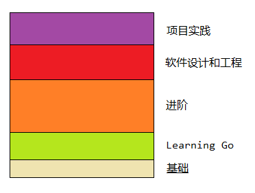

内容分为 3 个部分：

1. Go 项目介绍以及开发环境搭建；
2. Go 示例程序运行；
3. 如何在 Go 程序中引入外部功能包。

通过上述 3 个部分，让初学者对 Go 软件设计和开发有初步的感受。

# 1 项目介绍

Go 编程语言是一个==开发源代码项目==，==旨在提高程序员的生产力==。

Go **富有表现力，简洁，整洁且高效**。 它的**并发机制**使编写程序可以轻松地从多核和联网机器中获得最大收益，而其新颖的**类型系统**则可以实现灵活的**模块化程序构造**。 Go可以快速编译为机器代码，但具有**垃圾回收**的便利性和**运行时反射**的功能。 它是**一种快速的，静态类型的编译语言**，感觉就像是一种动态类型的解释语言。

`golang.google.cn/` 主页分为三个部分，**这些部分是掌握的方向**：

1. Documents：项目文档 https://golang.google.cn/doc/；
2. Packages：引用库文件，使用 pkg.go.dev 找到 package 相关信息；
3. The Project：关于 Go 的项目和发布版本信息；
4. Source Code：项目源代码 https://golang.google.cn/doc/install/source

PC 端处理器型号：Intel(R) Core(TM) i5-3450 CPU @ 3.10GHz

安装 Go 的 Windows 版本后，得到的版本信息：go version go1.15.5 windows/amd64

默认安装的 Go 路径为：C:\Go，安装完毕后，会**修改系统环境变量或者用户变量**：

1. 用户变量增加：GOPATH —— %USERPROFILE%\go，在 C:\Users\Developer\go 目录下会创建 pkg 目录；
2. 用户变量 Path 增加：%USERPROFILE%\go\bin
3. 系统变量 Path 增加：C:\Go\bin

综合上述所有操作，**我们搭建起了 Windows 平台下的 Go 开发环境**！

# 2 示例程序

最简单的**示例程序**，go run hello.go 运行如下程序

~~~go
package main

import "fmt"

func main(){
    fmt.Println("Hello, World!")
}
~~~

上述程序分为 3 个部分：

* main 包：一种管理函数的方法；
* fmt：一种标准库的包，包含关于文本格式化、打印输出等功能；
* main：go 程序默认执行的方法。

go 相关的**控制台指令**：

~~~go
Go is a tool for managing Go source code.

Usage:

        go <command> [arguments]

The commands are:

        bug         start a bug report
        build       compile packages and dependencies
        clean       remove object files and cached files
        doc         show documentation for package or symbol
        env         print Go environment information
        fix         update packages to use new APIs
        fmt         gofmt (reformat) package sources
        generate    generate Go files by processing source
        get         download and install packages and dependencies
        install     compile and install packages and dependencies
        list        list packages or modules
        mod         module maintenance
        run         compile and run Go program
        test        test packages
        tool        run specified go tool
        version     print Go version
        vet         report likely mistakes in packages

Use "go help <command>" for more information about a command.

Additional help topics:

        buildconstraint build constraints
        buildmode       build modes
        c               calling between Go and C
        cache           build and test caching
        environment     environment variables
        filetype        file types
        go.mod          the go.mod file
        gopath          GOPATH environment variable
        gopath-get      legacy GOPATH go get
        goproxy         module proxy protocol
        importpath      import path syntax
        modules         modules, module versions, and more
        module-get      module-aware go get
        module-auth     module authentication using go.sum
        module-private  module configuration for non-public modules
        packages        package lists and patterns
        testflag        testing flags
        testfunc        testing functions

Use "go help <topic>" for more information about that topic.
~~~

# 3 引入外部功能包

很多时候我们无需“造轮子”，可能其他人已经实现了。这种情况下，只需要引入已完成的功能包，就能使用。比如：`rsc.io/quote` ==模块==中，包含有 `quote` ==包==！下述程序为示例程序：

~~~go
package main

import "fmt"

import "rsc.io/quote"

func main(){
    fmt.Println(quote.Go())
}
~~~

很重要的步骤：将代码放置到模块中，用以**跟踪依赖关系**。go mod init 指令会在当前模块中创建 xxx.mod 文件，该文件列出了引入的模块、版本信息。**后面大型软件开发中，可以预览外部依赖内容**。

运行上述代码：在运行之前，go run 会定位外部引入的库，并下载 rsc.io/quote 模块。

~~~
C:\Users\Developer\hello>go run hello.go
go: finding module for package rsc.io/quote
hello.go:5:8: module rsc.io/quote: Get "https://proxy.golang.org/rsc.io/quote/@v/list": dial tcp 172.217.160.113:443: connectex: A connection attempt failed because the connected party did not properly respond after a period of time, or established connection failed because connected host has failed to respond.
~~~

显然，因为网络的缘故无法下载上述模块代码。下面是解决方案（来自：https://goproxy.io/zh/）：

~~~go
go env -w GO111MODULE=on
go env -w GOPROXY=https://goproxy.io,direct
~~~

重新运行的结果：

~~~go
C:\Users\Developer\hello>go run hello.go
go: finding module for package rsc.io/quote
go: downloading rsc.io/quote v1.5.2
go: found rsc.io/quote in rsc.io/quote v1.5.2
go: downloading rsc.io/sampler v1.3.0
go: downloading golang.org/x/text v0.0.0-20170915032832-14c0d48ead0c
Don't communicate by sharing memory, share memory by communicating.
~~~

实际上，上述整个过程由如下步骤完成：

1. 下载 rsc.io/quote，目标目录在：C:\Users\Developer\go\pkg\mod 中

2. 更新 go.mod 文件

   ~~~go
   module hello
   
   go 1.15
   
   require rsc.io/quote v1.5.2 // indirect
   
   ~~~

   更新了当前工程引用的外部模块及包信息。

3. 在当前 module 中创建了 go.sum 文件

   ~~~go
   golang.org/x/text v0.0.0-20170915032832-14c0d48ead0c h1:qgOY6WgZOaTkIIMiVjBQcw93ERBE4m30iBm00nkL0i8=
   golang.org/x/text v0.0.0-20170915032832-14c0d48ead0c/go.mod h1:NqM8EUOU14njkJ3fqMW+pc6Ldnwhi/IjpwHt7yyuwOQ=
   rsc.io/quote v1.5.2 h1:w5fcysjrx7yqtD/aO+QwRjYZOKnaM9Uh2b40tElTs3Y=
   rsc.io/quote v1.5.2/go.mod h1:LzX7hefJvL54yjefDEDHNONDjII0t9xZLPXsUe+TKr0=
   rsc.io/sampler v1.3.0 h1:7uVkIFmeBqHfdjD+gZwtXXI+RODJ2Wc4O7MPEh/QiW4=
   rsc.io/sampler v1.3.0/go.mod h1:T1hPZKmBbMNahiBKFy5HrXp6adAjACjK9JXDnKaTXpA=
   ~~~

4. 运行程序，输出结果。

Go 软件设计和开发，与之前的 Android 开发有很多想通的地方。不要焦虑和害怕，仅仅只是语言层面的门槛，在 Android 中理解的计算机基本原理、软件设计原理、计算机网络、操作系统等都是相通的。

P.S. 本文属于《基础》篇：

