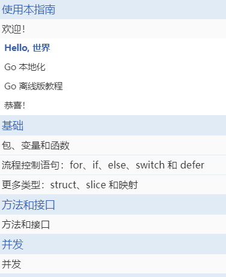
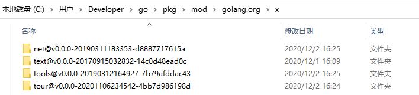
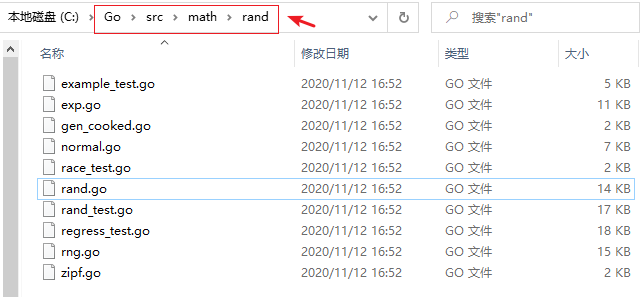

Learning Go 系列内容分为 3 个部分：**基础**、**方法和接口**、**并发**。

# 1 教程安装

可使用如下方式安装：

~~~go
C:\Users\Developer>go get golang.org/x/tour
go: downloading golang.org/x/tour v0.0.0-20201106234542-4bb7d986198d
go: golang.org/x/tour upgrade => v0.0.0-20201106234542-4bb7d986198d
go: downloading golang.org/x/tools v0.0.0-20190312164927-7b79afddac43
go: downloading golang.org/x/net v0.0.0-20190311183353-d8887717615a

C:\Users\Developer>tour
2020/12/02 16:27:00 Couldn't find tour files: could not find go-tour content; check $GOROOT and $GOPATH
~~~

出错原因：tour 程序会读取 `$GOPATH/src/golang.org/x/tour` 的内容进行渲染，而实际上下载的资源存在于 `$GOPATH/pkg/mod/golang.org/x/` 目录下：

查看 go 的所有**环境变量**：

~~~go
C:\Users\Developer>go env
set GO111MODULE=on
set GOARCH=amd64
set GOBIN=C:\Users\Developer\go\bin
set GOCACHE=C:\Users\Developer\AppData\Local\go-build
set GOENV=C:\Users\Developer\AppData\Roaming\go\env
set GOEXE=.exe
set GOFLAGS=
set GOHOSTARCH=amd64
set GOHOSTOS=windows
set GOINSECURE=
set GOMODCACHE=C:\Users\Developer\go\pkg\mod
set GONOPROXY=
set GONOSUMDB=
set GOOS=windows
set GOPATH=C:\Users\Developer\go
set GOPRIVATE=
set GOPROXY=https://goproxy.io,direct
set GOROOT=c:\go
set GOSUMDB=sum.golang.org
set GOTMPDIR=
set GOTOOLDIR=c:\go\pkg\tool\windows_amd64
set GCCGO=gccgo
set AR=ar
set CC=gcc
set CXX=g++
set CGO_ENABLED=1
set GOMOD=NUL
set CGO_CFLAGS=-g -O2
set CGO_CPPFLAGS=
set CGO_CXXFLAGS=-g -O2
set CGO_FFLAGS=-g -O2
set CGO_LDFLAGS=-g -O2
set PKG_CONFIG=pkg-config
set GOGCCFLAGS=-m64 -mthreads -fmessage-length=0 -fdebug-prefix-map=C:\Users\DEVELO~1\AppData\Local\Temp\go-build368287898=/tmp/go-build -gno-record-gcc-switches
~~~

创建指定目录并拷贝 `tour@v0.0.0-20201106234542-4bb7d986198d` 目录下内容，重命名文件为 tour 即可。再在控制台执行 tour 就能唤起浏览器：

~~~go
C:\Users\Developer\go\bin>tour
2020/12/02 16:49:06 Serving content from C:\Users\Developer\go\src\golang.org\x\tour
2020/12/02 16:49:08 A browser window should open. If not, please visit http://127.0.0.1:3999
2020/12/02 16:49:13 accepting connection from: 127.0.0.1:62673
~~~

tour 程序会打开一个浏览器并显示本地版本的教程。关于 Go 练习场的**内部机制**参考：https://blog.go-zh.org/playground

1. 如果访问的是离线版本（默认是英文的），开启服务后，在浏览器中键入 http://127.0.0.1:3999 就能访问。其时间是本地时间 `2020-12-02 17:41:04.6507643 +0800 CST m=+0.002997801`
2. 如果访问的是中文版本，相当于访问的是 https://tour.go-zh.org/ 远程服务。其时间始于 `2009-11-10 23:00:00 UTC`。

P.S. 对于 Mac 来说，`GOPATH="/Users/ant/go"`、`GOROOT="/usr/local/go"`，前者为工程目录，后者为 Go 的安装目录。与之类似，`tour` 加载的素材来源依旧是读取 `$GOPATH/src/golang.org/x/tour` 的内容进行渲染。必须进到指定的 `bin` 目录，才能正常启动 `tour`！

# 2 基础

**第 1 个概念**：包（Package）

每个 Go 程序都是由包（Package）构成的。

**应用程序从 main 包开始运行**。比如 greetings Module 来说，就包含了 main 包，以及对应的 main 函数。

> 对于 hello Module 来说，是一个被调用的 Module，则不存在 main 包。

~~~go
package greetings

import (
    "errors"
    "fmt"
    "math/rand"
    "time"
)

// Hello returns a greeting for the named person.
func Hello(name string) (string, error) {
    // If no name was given, return an error with a message.
    if name == "" {
        return name, errors.New("empty name")
    }
    // Create a message using a random format.
    message := fmt.Sprintf(randomFormat(), name)
    // message := fmt.Sprint(randomFormat())
    return message, nil
}

// Hellos returns a map that associates each of the named people
// with a greeting message.
func Hellos(names []string) (map[string]string, error) {
    // A map to associate names with messages.
    messages := make(map[string]string)
    // Loop through the received slice of names, calling
    // the Hello function to get a message for each name.
    for _, name := range names {
        message, err := Hello(name)
        if err != nil {
            return nil, err
        }
        // In the map, associate the retrieved message with 
        // the name.
        messages[name] = message
    }
    return messages, nil
}

// Init sets initial values for variables used in the function.
func init() {
    rand.Seed(time.Now().UnixNano())
}

// randomFormat returns one of a set of greeting messages. The returned
// message is selected at random.
func randomFormat() string {
    // A slice of message formats.
    formats := []string{
        "Hi, %v. Welcome!",
        "Great to see you, %v!",
        "Hail, %v! Well met!",
    }

    // Return one of the message formats selected at random.
    return formats[rand.Intn(len(formats))]
}
~~~

上述程序通过**导入路径**：fmt、rsc.io/quote、example.com/greetings 来使用这 3 个包。

按照约定，**包名**与**导入路径**的最后一个元素一致。比如 math/rand 包中的源码均以 package rand 语句开始。下图中的所有 .go 文件都是以 package rand 语句开始的。

再比如 /src/fmt 包下的源码，均是以 package fmt 语句开始的。

**第 2 个概念**：导入（Import）

想要使用某个包的功能，就需要使用导入语句，将对应的功能导入进来。

~~~go
package greetings

import (
    "errors"
    "fmt"
    "math/rand"
    "time"
)
...

import "fmt"
import "errors"
...
~~~

上述是分组形式的导入，也可以编写多个导入语句。

**第 3 个概念**：导出名

在 Go 中，以大写字母开头的名字，是**已导出的**。例如 Pi（来自 math 包）。

在导入一个包时，只能引用其中已导出的名字。任何“未导出”的名字在该包之外均无法访问到。

~~~go
package main

import (
	"fmt"
	"math"
)

func main() {
    // change to math.Pi
	fmt.Println(math.pi)
}
~~~

上述代码会报错：cannot refer to unexported name math.pi

**第 4 个概念**：函数

函数可以没有参数或接受多个参数：

~~~go
package main

import "fmt"

func add(x int, y int) int {
	return x + y
}

func main() {
	fmt.Println(add(42, 13))
}
~~~

注意：类型是跟在变量名之后的，解释该形式的由来：https://blog.go-zh.org/gos-declaration-syntax

当函数包含有 2 个或多个连续且相同类型的参数时，可以仅保留最后一个参数类型：

~~~go
package main

import "fmt"

// a bool, x int, y int change to a bool, x, y int
func add(a bool, x, y int) bool {
	return a
	//return x + y
}

func main() {
	fmt.Println(add(false, 42, 13))
}
~~~

**第 5 个概念**：多返回值

函数可以返回**任意数量**的返回值。

~~~go
package main

import "fmt"

func swap(x, y string) (string, string) {
	return y, x
}

func main() {
	a, b := swap("hello", "world")
	fmt.Println(a, b)
}
~~~

**第 6 个概念**：命名的返回值

Go 的**返回值可以被命名**，这些返回值会被当作是定义在函数顶部的变量。

函数返回值的名称应当具有一定含义，该含义可用做文档使用，增强代码可读性。

return 语句后不附加参数时，是直接返回形式，返回**已命名的返回值**。

~~~go
package main

import "fmt"

func split(sum int) (x, y int) {
	x = sum * 4 / 9
	y = sum - x
    // 返回 x 和 y
	return
}

func main() {
	fmt.Println(split(17))
}
~~~

**第 7 个概念**：变量

var 语句声明了一系列的变量，和函数参数列表一样，变量的类型在最后。

var 语句既可以在 package 层级也可以在函数层级。

~~~go
package main

import "fmt"

var c, python, java bool

func main() {
	var i int
    // 0 false false false
	fmt.Println(i, c, python, java)
}
~~~

变量的声明语句可以包含初始值，每个变量对应一个初始值。

如果初始值已存在，则可以省略变量类型。此时变量类型就是初始值类型。

~~~go
package main

import "fmt"

var i, j int = 1, 2

func main() {
	var c, python, java = true, false, "no!"
	fmt.Println(i, j, c, python, java)
}
~~~

**第 8 个概念**：短的变量声明语句

在函数内部，:= 可被用于代替 var 的隐式（类型）声明语句。

**在函数外部，每一个语句都是以关键词开头的**（比如：var、func 等），:= 是不可用的。

~~~go
package main

import "fmt"

func main() {
	var i, j int = 1, 2
	k := 3
	c, python, java := true, false, "no!"

	fmt.Println(i, j, k, c, python, java)
}
~~~

**第 9 个概念**：基本类型

Go 中有如下基本类型：

~~~go 
bool

string

int  int8  int16  int32  int64
uint uint8 uint16 uint32 uint64 uintptr

byte // alias for uint8

rune // alias for int32
     // represents a Unicode code point

float32 float64

complex64 complex128
~~~

int、uint 和 uintptr 在 32 位系统上通常为 32 位宽，在 64 位系统上则是 64 位宽。

~~~go
package main

import (
	"fmt"
	"math/cmplx"
)

var (
	ToBe   bool       = false
	MaxInt uint64     = 1<<64 - 1
	z      complex128 = cmplx.Sqrt(-5 + 12i)
)

func main() {
	fmt.Printf("Type: %T Value: %v\n", ToBe, ToBe)
	fmt.Printf("Type: %T Value: %v\n", MaxInt, MaxInt)
	fmt.Printf("Type: %T Value: %v\n", z, z)
}
~~~

**同 import 语句类似**，var 变量声明语句也可以“分组”成语法块。

**第 10 个概念**：初始值

没有显式赋予初始值的变量，会在声明时赋予**零值**。

* 数值类型为 0；
* 布尔类型为 false；
* 字符串为：“” （空字符串）。

~~~go
package main

import "fmt"

func main() {
	var i int
	var f float64
	var b bool
	var s string
    // 0 0 false ""
	fmt.Printf("%v %v %v %q\n", i, f, b, s)
}
~~~

**第 11 个概念**：类型转化

表达式 T(v) 将 v 值转化成类型 T。**与 C 不同的是，Go 在不同类型的项之间赋值时需要显式转化**。

~~~go
package main

import (
	"fmt"
	"math"
)

func main() {
	var x, y int = 3, 4
    // 必须显式转化
	var f float64 = math.Sqrt(float64(x*x + y*y))
    // z := uint(f)
	var z uint = uint(f)
	fmt.Println(x, y, z)
}
~~~

**第 12 个概念**：

在声明一个变量而不指定其类型时（即使用不带类型的 := 语法或者 var = 表达式语法），变量的类型由右值推导得出。

~~~go
package main

import "fmt"

func main() {
	i := 42
    // complex128
	g := 0.867 + 0.5i
    // .\compile59.go:6:2: i declared but not used
	_ = i
	fmt.Printf("g is of type %T\n", g)
	
    // (0 + 2i)
	var j = 2i
    // 126
    f := 3*i
	fmt.Printf("j: %v, f:%v\n", j, f)
}
~~~

当右值声明了类型时，新变量的类型与其相同。不过当右边包含未指明类型的数值常量时，新变量的类型就可能是 int、float64 或者 complex128，这取决于常量的精度：

~~~go
v := 42 // int
v := 42.0 // float64
v := 42.00000123123123123123123123001 // float64
~~~

**第 13 个概念**：常量

常量像变量一样声明，但使用的了 `const` 关键字。

常量可以是：**字符、字符串、布尔值、数值类型**。数值常量是高精度的值。

常量不能使用 := 语法声明。

~~~go
package main

import "fmt"

const Pi = 3.14

func main() {
	const World = "世界"
	fmt.Println("Hello", World)
	fmt.Println("Happy", Pi, "Day")

	const Truth = true
	fmt.Println("Go rules?", Truth)

	const ch = 'a'
	fmt.Println("ch:", ch)
}
~~~

对于常量的打印输出，不能使用类似 `fmt.Println("ch is %T \n", ch)` 的输出。

一个未指定类型的常量由上下文来决定其类型。即：**常量也有类型，使用指定的字节数来存储该常量值！**

~~~go
package main

import "fmt"

const (
	// Create a huge number by shifting a 1 bit left 100 places.
	// In other words, the binary number that is 1 followed by 100 zeroes.
	Big = 1 << 100
	// Shift it right again 99 places, so we end up with 1<<1, or 2.
	Small = Big >> 99
)

func needInt(x int) int { return x*10 + 1 }
func needFloat(x float64) float64 {
	return x * 0.1
}

func main() {
	fmt.Println(needInt(Small))
	fmt.Println(needFloat(Small))
	fmt.Println(needFloat(Big))
	
    // constant 1267650600228229401496703205376 overflows int
//	fmt.Println(needInt(Big))
}
~~~

int 类型可以存放最大 64 字节的整数，有时根据平台的不同会更少。

**第 14 个概念**：流程控制。流程控制就是：**顺序、选择和循环**控制。

Go 中只有一种循环结构：for 循环。

基本的 for 循环由 3 个 部分组成，并使用分号隔开：

1. **初始化语句**：在每一次迭代前执行；
2. 条件表达式（循环判断条件）：在每次迭代前求值；
3. **后置语句**：在每次迭代的结尾执行。

初始化语句通常为一句短变量声明，该变量声明仅在 for 语句的作用域中可见。一旦条件表达式的布尔值为 false，循环迭代就会终止。

注意：不像 C/Java/JavaScript 程序设计语言，Go 中的 for 语句 3 要素没有小括号包围，但大括号是必须的。

~~~go 
package main

import "fmt"

func main() {
	sum := 0
	for i := 0; i < 10; i++ {
		sum += i
	}
	fmt.Println(sum)
}
~~~

此外，for 语句中的**初始化语句和后置语句是可以省略的**：

~~~go
package main

import "fmt"

func main() {
	sum := 1
	for ; sum < 1000; {
		sum += sum
	}
	fmt.Println(sum)
}

~~~

此时，上述的代码可去掉分号，省略为：

~~~go
package main

import "fmt"

func main() {
	sum := 1
	for sum < 100 {
		sum += 1
	}
	fmt.Println(sum)
}
~~~

如果省略循环判断条件，将变成无限循环，因此可以写得很简洁：

~~~go
package main

func main() {
	for {
	}
}
~~~

Go 中的 if 表达式类似于 for 循环表达式，其中的小括号是可以省略的，大括号则是必须的：

~~~go
package main

import (
	"fmt"
	"math"
)

func sqrt(x float64) string {
	if x < 0 {
		return sqrt(-x) + "i"
	}
	return fmt.Sprint(math.Sqrt(x))
}

func main() {
    // 1.4142135623730951 2i
	fmt.Println(sqrt(2), sqrt(-4))
}
~~~

和 for 语句类似，if 语句可在判断条件之前执行一个简单的语句，该语句声明的变量作用域仅在 if 之内：

~~~go
package main

import (
	"fmt"
	"math"
)

func pow(x, n, lim float64) float64 {
	if v := math.Pow(x, n); v < lim {
		return v
	}
	return lim
}

func main() {
	fmt.Println(
		pow(3, 2, 10),
		pow(3, 3, 20),
	)
}
~~~

嗯，确实 if 语句的构造参考了 for 语句的格式：`if v := math.Pow(x, n); v < lim`，在 if 语句中使用了分号！而且在 if 的条件判断前执行的简单语句中，声明了变量 v，该变量的作用域仅是 if 语句。

如果上述 if 语句中存在 else，则变量的作用域可扩展到 else 语句中：

~~~go
package main

import (
	"fmt"
	"math"
)

func pow(x, n, lim float64) float64 {
	if v := math.Pow(x, n); v < lim {
		return v
	} else {
		fmt.Printf("%g >= %g\n", v, lim)
	}
	// can't use v here, though
	return lim
}

func main() {
	fmt.Println(
		pow(3, 2, 10),
		pow(3, 3, 20),
	)
}
~~~

for 语句和 if 语句的练习题： Sqrt(x float64) 的实现，求值：z^2^ = x

~~~go
package main

import (
	"fmt"
	"math"
)

func Sqrt(x float64) float64 {
	z := 1.0
	var i = 1
	for i < 10 {
        // 牛顿插值法
		z -= (z*z - x) / (2 * z)
		fmt.Printf("z value is %g\n", z)
		i += 1
	}
	return z
}

func Sqrt2(x float64) float64 {
	z := 1.0
	const delta = 0.000000001

	var before = z
	for {
		z -= (z*z - x) / (2 * z)
		fmt.Printf("z value is %g, and before is %g\n", z, before)
		if math.Abs(z-before) > delta {
			before = z
		} else {
			break
		}
	}
	return z
}

func main() {
	fmt.Println(Sqrt2(4))
}
~~~

其中 `Sqrt2()` 的计算结果如下：

~~~go
z value is 2.5, and before is 1
z value is 2.05, and before is 2.5
z value is 2.000609756097561, and before is 2.05
z value is 2.0000000929222947, and before is 2.000609756097561
z value is 2.000000000000002, and before is 2.0000000929222947
z value is 2, and before is 2.000000000000002
2
~~~

switch 是编写一连串 if-else 语句的简便方法，它允许第一个值定于条件表达式的 case 语句。而且，Go 自动提供了 case 子句后面所需的 break 语句。

~~~go
package main

import (
	"fmt"
	"runtime"
)

func main() {
	fmt.Print("Go runs on ")
	
	// os := "linux"
	
	switch os := runtime.GOOS; os {
	case "darwin":
		fmt.Println("OS X.")
	case "linux":
		fmt.Println("Linux.")
	default:
		// freebsd, openbsd,
		// plan9, windows...
		fmt.Printf("%s.\n", os)
	}
}
~~~

switch 语句和 if 语句类似，同样可以在 switch 之后执行一个简单的语句。上述代码会输出当前的运行平台：

另外，还可修改成另外的：

~~~go
package main

import (
	"fmt"
	_ "runtime"
)

func main() {
	fmt.Print("Go runs on ")
	
	os := "darwin"
	
	switch os {
	case "darwin":
		fmt.Println("OS X.")
		fallthrough
	case "linux":
		fmt.Println("Linux.")
		fallthrough
	default:
		// freebsd, openbsd,
		// plan9, windows...
		fmt.Printf("%s.\n", os)
	}
}
~~~

上述代码会输出：

~~~go
Go runs on OS X.
Linux.
darwin.
~~~

fallthrough 语句会持续运行接下来的 case 语句，而不是 break！

另外，**switch 的 case 无需为常量，且取值不必为整数**。将 case 常量值变更为变量，也能正常运行：

~~~go
package main

import (
	"fmt"
	_ "runtime"
)

func main() {
	fmt.Print("Go runs on ")
	
	os := "darwin"
	
	darwin := "darwin"
	linux := "linux"
	
	switch os {
	case darwin:
		fmt.Println("OS X.")
		fallthrough
	case linux:
		fmt.Println("Linux.")
		fallthrough
	default:
		// freebsd, openbsd,
		// plan9, windows...
		fmt.Printf("%s.\n", os)
	}
}
~~~

switch 的 case 语句从上到下顺次执行，直到匹配成功时停止：

~~~go
switch i {
    case 0:
    case f():
}
~~~

在 `i == 0` 时，f() 函数不会被调用。

不包含有条件的 switch 语句，和 switch true 相同。这种方式可以替代具有较长 if-else 链的代码：

~~~go
package main

import (
	"fmt"
	"time"
)

func main() {
	t := time.Now()
	switch {
	case t.Hour() < 12:
		fmt.Println("Good morning!")
	case t.Hour() < 17:
		fmt.Println("Good afternoon.")
	default:
		fmt.Println("Good evening.")
	}
}
~~~

defer 语句会将函数推迟到外层函数返回之后执行。推迟调用的函数其**参数**会立即求值，但直到外层函数返回前该函数都不会被调用。

~~~go
package main

import "fmt"

func fun(a, b int) int {
	fmt.Println("kkkk")
	return a + b
}

func main() {
	defer fmt.Println(fun(1, 2))

	fmt.Println("hello")
	fmt.Println()
}
~~~

其输出结果很有意思：

~~~go
kkkk
hello

3

Program exited.
~~~

main() 执行顺序：fun(1, 2) 执行，打印 kkk，并返回求值结果；执行 hello 打印，执行换行打印；最后执行被 defer 的打印结果。

被 defer 的函数调用会被压入一个栈中，当外层函数返回后时，被推迟的函数会按照后进先出的（LIFO）顺序调用。

~~~go
package main

import "fmt"

func main() {
	fmt.Println("counting")

	for i := 0; i < 10; i++ {
        // 9 8 7 6 5 4 3 2 1 0
		defer fmt.Println(i)
	}

	fmt.Println("done")
}
~~~

**第 15 个概念**：类型

Go 是有指针的，一个指针存放的是变量的**内存地址**。

~~~go
package main

import "fmt"

func main() {
	i, j := 42, 2701

	p := &i         // point to i
	fmt.Println(*p) // read i through the pointer
	*p = 21         // set i through the pointer
	fmt.Println(i)  // see the new value of i

	p = &j         // point to j
	*p = *p / 37   // divide j through the pointer
	fmt.Println(j) // see the new value of j
}
~~~

类型 `*T` 是指向 T 类型值的指针，其零值为：`nil`

和 C 中一样，`&` 操作符会生成一个指向其操作数的指针；`*` 操作符表示指针指向的**内存地址中存放的值**。

和 C 不一样的是：Go 没有指针运算。

Go 中的**结构体**，就是一组字段。

~~~go
package main

import "fmt"

type Vertex struct {
	X int
	Y int
}

func main() {
    // {1, 2}
	fmt.Println(Vertex{1, 2})
}
~~~

使用 `.` 操作符**访问结构体中的字段**：

~~~go
package main

import "fmt"

type Vertex struct {
	X int
	Y int
}

func main() {
	v := Vertex{1, 2}
	v.X = 4
	fmt.Println(v.X)
}
~~~

同样，结构体变量的字段内容，可通过**结构体指针**来访问：

~~~go
package main

import "fmt"

type Vertex struct {
	X int
	Y int
}

func main() {
	v := Vertex{1, 2}
	p := &v
	p.X = 1e9
	fmt.Println(v)
}
~~~

如果有一个指向结构体的指针 p，我们可以通过 `(*p).X` 来访问其字段 X。不过这么写台啰嗦了，所有语言也允许我们使用隐式间接引用，直接写 `p.X` 来访问。

结构体文法通过**直接列出字段的值**来新分配一个结构体，或者使用 `Name:` 语法可以仅列出部分字段（字段名的顺序无关）。`&` 返回一个指向结构体的指针。

~~~go
package main

import "fmt"

type Vertex struct {
	X, Y int
}

var (
	v1 = Vertex{1, 2}  // has type Vertex
	v2 = Vertex{X: 1}  // Y:0 is implicit
	v3 = Vertex{}      // X:0 and Y:0
	p  = &Vertex{1, 2} // has type *Vertex
)

func main() {
	fmt.Println(v1, p, v2, v3)
}
~~~

Go 的数组类型表示为：`[n]T`，其含义为 n 个类型为 T 的数组结构：

~~~go
package main

import "fmt"

func main() {
	var a [2]string
	a[0] = "Hello"
	a[1] = "World"
	fmt.Println(a[0], a[1])
	fmt.Println(a)

	primes := [6]int{2, 3, 5, 7, 11, 13}
	fmt.Println(primes)
}
~~~

数组的长度是其类型的一部分，因此**数组不能改变大小**。这看起来是个限制，不过没关系，Go 提供了更加便利的方式来使用数组。每个数组的大小都是固定的，而**切片**（Slice）则为数组元素提供**动态大小的、灵活的视角**。类型 `[]T` 表示一个元素类型为 T 切片。

切片通过两个下标来界定，即一个上界和一个下界（包括第一个元素，但排除最后一个元素），二者以冒号分隔：

~~~go
package main

import "fmt"

func main() {
	primes := [6]int{2, 3, 5, 7, 11, 13}

	var s []int = primes[0:4]
    // 2 3 5 7
	fmt.Println(s)
}
~~~

**切片就像数组的引用**。**切片并不存储任何数据**，它只是描述了底层数组中的一段。在实践中，**切片比数组更常用**。更改切片的元素会修改其底层数组中对应的元素，同样的，与它共享底层数组的切片都会观测到这些修改。

~~~go
package main

import "fmt"

func main() {
	names := [4]string{
		"John",
		"Paul",
		"George",
		"Ringo",
	}
	fmt.Println(names)

	a := names[0:2]
	b := names[1:3]
	fmt.Println(a, b)

    // 更改了底层数组的元素值
	b[0] = "XXX"
    // 所有切片都更改
	fmt.Println(a, b)
	fmt.Println(names)
}
~~~

**切片的语法**，更像是不带有**长度**的数组文法。

~~~go
[3]bool{true, true, false} // 定义数组

[]bool{true, true, false} // 创建一个和上面相同的数组，然后构建一个数组的切片
~~~

举例：

~~~go
package main

import "fmt"

func main() {
    // 定义切片
	q := []int{2, 3, 5, 7, 11, 13}
	fmt.Println(q)

    // 定义切片
	r := []bool{true, false, true, true, false, true}
	fmt.Println(r)

    // 定义切片
	s := []struct {
		i int
		b bool
	}{
		{2, true},
		{3, false},
		{5, true},
		{7, true},
		{11, false},
		{13, true},
	}
	fmt.Println(s)
}
~~~

在进行切片时，可以利用它的默认行为来忽略上下界。切片下界的默认值为：0，上界则是该切片的长度。

~~~go
package main

import "fmt"

func main() {
	s := []int{2, 3, 5, 7, 11, 13}

	s = s[1:4]
    // len=3 cap=5 [3 5 7]
	printSlice(s)

	s = s[:2]
    // len=2 cap=5 [3 5]
	printSlice(s)

	s = s[1:]
    // len=1 cap=4 [5]
	printSlice(s)

	// slice bounds out of range [:5] with capacity 4
	s = s[0:3]
    // len=3 cap=4 [5 7 11]
	printSlice(s)
}

func printSlice(s []int) {
	fmt.Printf("len=%d cap=%d %v\n", len(s), cap(s), s)
}
~~~

**切片让引用的数组区域越来越小**。下列切片的内容都是等价的：

~~~go
var a [10]int
a[0:10]
a[:10]
a[0:]
a[:]
~~~

对于切片来说，同样是有**长度**和**容量**属性。长度属性：表示当前切片包含的数组元素个数；容量属性：表示从切片第一个元素开始计算，到底层数组末尾元素的个数。

~~~go
package main

import "fmt"

func main() {
	s := []int{2, 3, 5, 7, 11, 13}
    // len=6 cap=6 [2 3 5 7 11 13]
	printSlice(s)

	// Slice the slice to give it zero length.
	s = s[:0]
    // len=0 cap=6 []
	printSlice(s)

	// Extend its length.
	s = s[:4]
    // len=4 cap=6 [2 3 5 7]
	printSlice(s)

	// Drop its first two values.
	s = s[2:]
    // len=2 cap=4 [5 7]
	printSlice(s)
    
	s = s[2:4]
    // len=2 cap=2 [11 13]
	printSlice(s)
}

func printSlice(s []int) {
	fmt.Printf("len=%d cap=%d %v\n", len(s), cap(s), s)
}
~~~

可以通过重新切片来扩展一个切片。比如上面的第 11 行代码，重写切片为 `[]`；同样的，在第 16 行，又重新切片了。

切片的零值是 nil。nil 切片的长度和容量为 0 且没有底层数组。

~~~go
package main

import "fmt"

func main() {
	var s []int
	fmt.Println(s, len(s), cap(s))
	if s == nil {
		fmt.Println("nil!")
	}
}
~~~

使用内置的 make 函数来创建切片，make 函数会分配一个元素为 0 值的数组并**返回一个引用了它的切片**。

~~~go
package main

import "fmt"

func main() {
	a := make([]int, 5)
    // a len=5 cap=5 [0 0 0 0 0]
	printSlice("a", a)

	b := make([]int, 0, 5)
    // b len=0 cap=5 []
	printSlice("b", b)

	c := b[:2]
    // c len=2 cap=5 [0 0]
	printSlice("c", c)

	d := c[2:5]
    // d len=3 cap=3 [0 0 0]
	printSlice("d", d)
}

func printSlice(s string, x []int) {
	fmt.Printf("%s len=%d cap=%d %v\n",
		s, len(x), cap(x), x)
}
~~~

特别注意第 18 行，d 是在切片 c 的基础上对数组重新切片。

切片可以包含任何类型，甚至包括其他切片：

~~~go
package main

import (
	"fmt"
	"strings"
)

func main() {
	// Create a tic-tac-toe board.
	board := [][]string{
		[]string{"_", "_", "_"},
		[]string{"_", "_", "_"},
		[]string{"_", "_", "_"},
	}

	// The players take turns.
	board[0][0] = "X"
	board[2][2] = "O"
	board[1][2] = "X"
	board[1][0] = "O"
	board[0][2] = "X"

	for i := 0; i < len(board); i++ {
		fmt.Printf("%s\n", strings.Join(board[i], " "))
	}
}
~~~

board 是切片的数组，也就是该 board 数组中的元素是一个切片。`[][]string` 可分为 2 个 部分：

1. `[]`：表示当前是一个切片；
2. `[]string`：表示切片底层数组中元素类型是切片。

为切片追加新的元素是一种常见的操作，为此 Go 提供了内建的 append 函数。

~~~go
package main

import "fmt"

func main() {
	var s []int
	printSlice(s)

	// append works on nil slices.
	s = append(s, 0)
	printSlice(s)

	// The slice grows as needed.
	s = append(s, 1)
	printSlice(s)

	// We can add more than one element at a time.
    // len=5 cap=6 [0 1 2 3 4]
	s = append(s, 2, 3, 4)
	printSlice(s)
}

func printSlice(s []int) {
	fmt.Printf("len=%d cap=%d %v\n", len(s), cap(s), s)
}
~~~

append 函数返回结果是一个包含原切片所有元素加上新添加元素的切片。当 s 的底层数组太小，不足以容纳所有给定的值时，就会**重新分配一个更大的数组**。返回的切片会指向这个新分配的数组。

for 循环的 range 形式可遍历切片或 Map。当使用 for 循环遍历切片时，每次循环都会返回 2 个值：第一个是当前元素的下标，第二个为该下标所对应元素的一份副本。

~~~go
package main

import "fmt"

var pow = []int{1, 2, 4, 8, 16, 32, 64, 128}

func main() {
	for i, v := range pow {
        // 2**0 = 1 ~ 2**7 = 128
		fmt.Printf("2**%d = %d\n", i, v)
	}
}
~~~

如果不需要 index 或者 value 值，可以用 `_` 替代：

~~~go
package main

import "fmt"

func main() {
	pow := make([]int, 10)
    // for i, _ :=range pow
	for i := range pow {
		pow[i] = 1 << uint(i) // == 2**i
	}
	for _, value := range pow {
		fmt.Printf("%d\n", value)
	}
}
~~~

切片的练习题：会将每个整数解释为灰度值，并显示对应的图像

~~~go
package main

import "golang.org/x/tour/pic"

func Pic(dx, dy int) [][]uint8 {
	// 返回切片 [] 元素类型为 []uint8
	var result [][]uint8
    // syntax error: var declaration not allowed in for initializer
	// for var index = 0; index < dy; index = index + 1{
    for index := 0; index < dy; index = index + 1{
		var tmp = make([]uint8, dx)
		result = append(result, tmp)
	}
	return result
}

func main() {
	pic.Show(Pic)
}
~~~

显示原始图像：

其他：

~~~go
package main

import "golang.org/x/tour/pic"

func Pic(dx, dy int) [][]uint8 {
	// 返回切片 [] 元素类型为 []uint8
	result := make([][]uint8, dy)
	for i := range result {
		result[i] = make([]uint8, dx)
		for j := range result[i] {
			// (i + j)/2
			result[i][j] = uint8(i * j)
		}
	}
	return result
}

func main() {
	pic.Show(Pic)
}
~~~

对应的图像为：

再比如：

~~~go
package main

import "golang.org/x/tour/pic"

func Pic(dx, dy int) [][]uint8 {
	// 返回切片 [] 元素类型为 []uint8
	result := make([][]uint8, dy)
	for i := range result {
		result[i] = make([]uint8, dx)
		for j := range result[i] {
			// (i + j)/2; i * j
			result[i][j] = uint8(i ^ j)
		}
	}
	return result
}

func main() {
	pic.Show(Pic)
}
~~~

对应显示效果：

Go 中的 Map 就是 key - value **键值对**。

Map 的零值为 nil。nil 映射既没有键，也不能添加键。`var m map[string]Vertex` 声明了 Map 变量 m，key 的类型为 string，value 的类型为 Vertex。

~~~go
package main

import "fmt"

type Vertex struct {
	Lat, Long float64
}

var m map[string]Vertex

func main() {
	m = make(map[string]Vertex)
	m["Bell Labs"] = Vertex{
		40.68433, -74.39967,
	}
	fmt.Println(m["Bell Labs"])
}
~~~

make 函数会返回给定类型的映射，并将其初始化备用。

Map 的文法和 struct 结构体类似，但 key 键是必须具备的：

~~~go
package main

import "fmt"

type Vertex struct {
	Lat, Long float64
}

var m = map[string]Vertex{
	"Bell Labs": Vertex{
		40.68433, -74.39967,
	},
	"Google": Vertex{
		37.42202, -122.08408,
	},
}

// 或者可省略 Vertex 类型名
var m = map[string]Vertex{
	"Bell Labs": {40.68433, -74.39967},
	"Google":    {37.42202, -122.08408},
}

func main() {
	fmt.Println(m)
}
~~~

Map 肯定会有元素的相关操作：增、删、改、查（**双赋值检测**）

~~~go
package main

import "fmt"

func main() {
	m := make(map[string]string)

	m["Answer"] = "42"
	fmt.Println("The value:", m["Answer"])

	m["Answer"] = "48"
	fmt.Println("The value:", m["Answer"])

	delete(m, "Answer")
	fmt.Println("The value:", m["Answer"])

    // if not, isContain is false and v is zero value
	v, isContain := m["Answer"]
	fmt.Println("The value:", v, "Present?", isContain)
}
~~~

Map 练习：返回一个映射，包含字符串中每个单词的个数

~~~go
package main

import (
	"fmt"
	"strings"
	"golang.org/x/tour/wc"
)

func WordCount(s string) map[string]int {
	array := strings.Fields(s)
	length := len(array)
	fmt.Printf("length:%d\n", length)

	result := make(map[string]int)
	for _, word := range array {
		v, isContain := result[word]
		if(isContain){
			result[word] = v + 1
		}else{
			result[word] = 1
		}
	}
	return result
}

func main() {
	wc.Test(WordCount)
}
~~~

函数也是值，它可以像其它值一样被传递。函数值可以被用作函数的参数或返回值。

~~~go
package main

import (
	"fmt"
	"math"
)

// 函数的参数是另一个函数
func compute(fn func(float64, float64) float64) float64 {
	return fn(3, 4)
}

func main() {
    // 定义函数变量
	hypot := func(x, y float64) float64 {
		return math.Sqrt(x*x + y*y)
	}
	fmt.Println(hypot(5, 12))

    // 把函数当做值传递
	fmt.Println(compute(hypot))
	fmt.Println(compute(math.Pow))
}
~~~

函数可能是一个闭包。闭包是一个**函数值（把函数当做一个值赋值给函数变量）**，它引用了函数体之外的变量（假设认为是变量 sum）。该函数可以访问并赋予其引用的变量（变量 sum）的值。换句话说，就是和变量 sum 绑定了。

~~~go
package main

import "fmt"

func adder() func(int) int {
	sum := 0
	return func(x int) int {
		sum += x
        // 函数引用了其外部的变量 sum，将变量 sum 和当前 func 绑定在一起
		return sum
	}
}

func main() {
	// adder() 函数返回的是 func(x int) int 函数地址
	// pos 是函数变量，用于接收函数
	pos, neg := adder(), adder()
	for i := 0; i < 10; i++ {
		fmt.Println(
			// 访问 pos 指向的函数，并赋予函数参数
			pos(i),
			neg(-2*i),
		)
	}
}
~~~

闭包练习：生成斐波那契数列

~~~go
package main

import "fmt"

// fibonacci is a function that returns
// a function that returns an int.
func fibonacci() func() int {
	// 调用次数索引，默认是第一次调用
	index :=1
	
	pre := 0
	prepre := 0
	
	return func() int{
		sum := 0
		switch index {
			// 确定第 1 个值：0
			case 1:
				prepre = 0	
				pre = 0
				sum = 0
			
			// 确定第 2 个值：1
			case 2:
				prepre = 0	
				pre = 0
				sum = 1
			
			// 确定第 3 个值：1
			case 3:
				prepre = 0
				pre = 1
				sum = prepre + pre
				// 更新数值
				prepre = pre
				pre = sum
			default:
				sum = prepre + pre
				// 更新数值
				prepre = pre
				pre = sum
		}
		
		index = index + 1
		return sum
	}
}

func main() {
	f := fibonacci()
	for i := 0; i < 10; i++ {
		// 注意 f() 是没有入参的，依据调用次数输出对应的斐波那契数列值
		fmt.Println(f())
	}
}
~~~

# 3 方法和接口

**第 1 个概念**：方法——（**第一层次理解**）Method 不同于 Function，但属于 Function 的一种。

Go 没有类，但是可以**为结构体类型定义方法**。

`A method is a function with a special receiver argument.`

Method 接收者（从属者）在它自己的参数列表内，位于 `func` 关键字和 Method 名之间。

~~~go
package main

import (
	"fmt"
	"math"
)

type Vertex struct {
	X, Y float64
}

func (v Vertex) Abs() float64 {
    // Abs() 是属于 Vertex 结构体类型的，自然可以访问 v 的字段
	return math.Sqrt(v.X*v.X + v.Y*v.Y)
}

func main() {
	v := Vertex{3, 4}
	fmt.Println(v.Abs())
}
~~~

上述代码定义了 `Abs()` Method，其**接收者（从属者）**是 Vertex 结构体类型。

（第二层次理解）Method 就是 Function，只是这个 Function 是带有接收器的。

~~~go
package main

import (
	"fmt"
	"math"
)

type Vertex struct {
	X, Y float64
}

// 定义了一个普通的函数
func Abs(v Vertex) float64 {
	return math.Sqrt(v.X*v.X + v.Y*v.Y)
}

func main() {
	v := Vertex{3, 4}
	fmt.Println(Abs(v))
}
~~~

也可以为非结构体类型声明方法：

~~~go
package main

import (
	"fmt"
	"math"
)

type MyFloat float64

func (f MyFloat) Abs() float64 {
	if f < 0 {
		return float64(-f)
	}
	return float64(f)
}

func main() {
    // 声明一个结构体变量，初始化结构体
	f := MyFloat(-math.Sqrt(9))
	fmt.Println(f.Abs())
}
~~~

上述示例是一个带 Abs 方法的数值类型 MyFloat。

只能为在**同一包内定义的类型**的接收者声明方法，而不能为其他包内定义的类型（包括 int 之类的 build-in 内置类型）的接收者声明方法。另外还可以为指针接收者声明方法，意味着接收者类型可以用 *T 这样的文法。指针接收者的方法可以修改接收者指向的值。由于方法经常需要修改它的接收者，**指针接收者**比**值接收者**更常用。

~~~go
package main

import (
	"fmt"
	"math"
)

type Vertex struct {
	X, Y float64
}

func (v Vertex) Abs() float64 {
	return math.Sqrt(v.X*v.X + v.Y*v.Y)
}

func (v *Vertex) Scale(f float64) {
    // 使用指针接收者，能够修改 v 指向的内存地址变量的值
	v.X = v.X * f
	v.Y = v.Y * f
}

func (v Vertex) Scale(f float64) {
    // 使用结构体类型的接收者，不会修改
	v.X = v.X * f
	v.Y = v.Y * f
}

func main() {
	v := Vertex{3, 4}
    // 不管是 Pointer Receiver 还是 Value Receiver 其调用方式都是一样的
	v.Scale(10)
	fmt.Println(v.Abs())
}
~~~

**如果是 `Pointer Receiver` 则能够修改该指针指向内存地址的值；如果是 `Value Receiver` 则不能！其作用的是原先类型的副本。**

将上述代码重新修改：

~~~go
package main

import (
	"fmt"
	"math"
)

type Vertex struct {
	X, Y float64
}

func Abs(v Vertex) float64 {
	return math.Sqrt(v.X*v.X + v.Y*v.Y)
}

func Scale(v *Vertex, f float64) {
	v.X = v.X * f
	v.Y = v.Y * f
}

func main() {
	v := Vertex{3, 4}
    // 一个普通函数，其参数类型是 *Vertex
	Scale(&v, 10)
	fmt.Println(Abs(v))
}
~~~

对于一个普通函数来说，如果其参数是 *Vertex 类型，那会有下述结果：

~~~go
var v Vertex
ScaleFunc(v, 5)  // Compile error!
ScaleFunc(&v, 5) // OK
~~~

那如果是附带有接收者的 Method，比如下述方法：

~~~go
func (v *Vertex) Scale(f float64) {
	v.X = v.X * f
	v.Y = v.Y * f
}
~~~

那对于下述调用都是可行的：

~~~go
var v Vertex
v.Scale(5)  // OK
p := &v
p.Scale(10) // OK
~~~

比如示例代码：

~~~go
package main

import "fmt"

type Vertex struct {
	X, Y float64
}

func (v *Vertex) Scale(f float64) {
	v.X = v.X * f
	v.Y = v.Y * f
}

func ScaleFunc(v *Vertex, f float64) {
	v.X = v.X * f
	v.Y = v.Y * f
}

func main() {
	v := Vertex{3, 4}
    // 会自动解释成 (&v).Scale(2)
	v.Scale(2)
	ScaleFunc(&v, 10)

	p := &Vertex{4, 3}
	p.Scale(3)
	ScaleFunc(p, 8)

	fmt.Println(v, p)
}
~~~

上述示例代码中，`v` 虽然是个值而非指针，带指针接收者的方法也能被直接调用。也就是说，在 Go 中，会将 `v.Scale(5)` 解释成 `(&v).Scale(5)`。

接受一个值作为参数的函数必须接收一个指定类型的值：

~~~go
var v Vertex
fmt.Println(AbsFunc(v))  // OK
fmt.Println(AbsFunc(&v)) // 编译错误
~~~

而以值为接收者的方法被调用，接收者既能为值又能为指针：

~~~go
var v Vertex
fmt.Println(v.Abs()) // OK
p := &v
fmt.Println(p.Abs()) // OK
~~~

这种情况下，方法调用 `p.Abs()` 会被解释为 `(*p).Abs()`

示例代码如下：

~~~go
package main

import (
	"fmt"
	"math"
)

type Vertex struct {
	X, Y float64
}

func (v Vertex) Abs() float64 {
	return math.Sqrt(v.X*v.X + v.Y*v.Y)
}

func AbsFunc(v Vertex) float64 {
	return math.Sqrt(v.X*v.X + v.Y*v.Y)
}

func main() {
	v := Vertex{3, 4}
	fmt.Println(v.Abs())
	fmt.Println(AbsFunc(v))

	p := &Vertex{4, 3}
    // 以值为接收者的方法被调用，接收者既能为值又能为指针
	fmt.Println(p.Abs())
    // 接受一个值作为参数的函数必须接收一个指定类型的值
	fmt.Println(AbsFunc(*p))
}
~~~

使用指针接收者的原因有 2 个：

1. 方法能够修改其接收者指向的值；
2. 可以避免在每次调用方法时复制该值。若值的类型为大型结构体时，这样做会更加高效。

通常情况下，所有给定类型的方法都应该有值或指针接收者，但并**不应该二者混用**。

**第 2 个概念：接口**

**接口类型是由一组方法签名定义的集合**。接口类型的变量可以保存任何实现了这些方法的值。

~~~go
package main

import (
	"fmt"
	"math"
)

type Abser interface {
	Abs() float64
}

func main() {
	var a Abser
	f := MyFloat(-math.Sqrt2)
	v := Vertex{3, 4}

	a = f  // a MyFloat implements Abser
	a = &v // a *Vertex implements Abser

	// In the following line, v is a Vertex (not *Vertex)
	// and does NOT implement Abser.
	a = v

	fmt.Println(a.Abs())
}

type MyFloat float64

func (f MyFloat) Abs() float64 {
	if f < 0 {
		return float64(-f)
	}
	return float64(f)
}

type Vertex struct {
	X, Y float64
}

func (v *Vertex) Abs() float64 {
	return math.Sqrt(v.X*v.X + v.Y*v.Y)
}
~~~

上述示例代码中，第 22 行存在一个错误。由于 `Abs` 方法只为 `*Vertex`（指针类型）定义，`Vertex`（值类型）并未实现 `Abser`。

**类型通过实现一个接口的所有方法来实现该接口**：既然无需专门显式声明，也就没有 `implements` 关键字。隐式接口从接口的实现中解耦了定义，这样接口的实现可以出现在任何包中，无需提前准备。

~~~go
package main

import "fmt"

type I interface {
	M()
}

type T struct {
	S string
}

// 此方法表示类型 T 实现了接口 I，但我们无需显式声明此事。
func (t T) M() {
	fmt.Println(t.S)
}

func main() {
    // 将初始化的 T 变量赋值给 I 接口类型
	var i I = T{"hello"}
	i.M()
}
~~~

接口也是值，可以像其他值一样被传递。接口值可以用作函数的参数或返回值，保存了一个具体底层类型的具体值。相应的，接口值调用方法时，会执行其底层类型的同名方法。

~~~go
package main

import (
	"fmt"
	"math"
)

type I interface {
	M()
}

type T struct {
	S string
}

func (t *T) M() {
	fmt.Println(t.S)
}

type F float64

func (f F) M() {
	fmt.Println(f)
}

func main() {
	var i I

	i = &T{"Hello"}
	describe(i)
    // 执行其底层类型的同名方法
	i.M()

	i = F(math.Pi)
	describe(i)
    // 执行其底层类型的同名方法
	i.M()
}

func describe(i I) {
	fmt.Printf("(%v, %T)\n", i, i)
}
~~~

即便接口内的具体值为 nil，方法仍然会被 nil 接收者调用，也就是说该接收者为 nil。

在一些语言中，这会触发空指针异常，但在 Go 中通常会写一些方法来优雅地处理它。**保存了 nil 具体值的接口其自身并不是 nil**。

~~~go
package main

import "fmt"

type I interface {
	M()
}

type T struct {
	S string
}

func (t *T) M() {
	if t == nil {
		fmt.Println("<nil>")
		return
	}
	fmt.Println(t.S)
}

func main() {
	var i I

	var t *T
	i = t
    // (<nil>, *main.T)
	describe(i)
    // <nil>
	i.M()

	i = &T{"hello"}
    // (&{hello}, *main.T)
	describe(i)
    // hello
	i.M()
}

func describe(i I) {
	fmt.Printf("(%v, %T)\n", i, i)
}
~~~

**nil 接口值既不保存值也不保存具体类型**，为 nil 接口调用方法会产生运行时错误，因为接口的元组内并未包含能够指明该调用哪个具体方法的类型。

~~~go
package main

import "fmt"

type I interface {
	M()
}

func main() {
    // nil 接口值
	var i I
	describe(i)
   
    // panic: runtime error: invalid memory address or nil pointer dereference
	i.M()
}

func describe(i I) {
    // (<nil>, <nil>) 没有值信息，也没有类型信息
	fmt.Printf("(%v, %T)\n", i, i)
}
~~~

空接口是指：指定了零个方法的接口值 `interface {}`

~~~go
package main

import "fmt"

func main() {
	var i interface{}
    // (<nil>, <nil>)
	describe(i)

	i = 42
    // (42, int)
	describe(i)

	i = "hello"
    // (hello, string)
	describe(i)
}

func describe(i interface{}) {
	fmt.Printf("(%v, %T)\n", i, i)
}
~~~

空接口可保存任何类型的值，因为每个类型都至少实现了零个方法。

空接口被用来处理未知类型的值，例如 `fmt.Print` 可接受类型为 `interface {}` 的任意数量的参数。

**第 3 个概念**：类型断言

类型断言提供了访问接其**底层具体值**的方式。

~~~go
t := i.(T)
~~~

该语句断言接口值 i 保存了具体类型 T，并将其底层类型为 T 的值赋予变量 t。若 i 并未保存 T 类型的值，会触发 Panic。为了判断一个接口值是否保存了一个特定的类型，类型断言可返回 2 个值：其底层值以及一个报告断言是否成功的布尔值。

~~~go
package main

import "fmt"

func main() {
	var i interface{} = "hello"

	s := i.(string)
	fmt.Println(s)

	s, ok := i.(string)
	fmt.Println(s, ok)

    // 不会产生 Panic
	f, ok := i.(float64)
	fmt.Println(f, ok)

	f = i.(float64) // 报错(panic)
	fmt.Println(f)
}
~~~

**第 4 个概念**：类型选择

**类型选择**是一种按顺序从几个类型断言中选择分支的结构。类型选择语句一般与 switch 语句相似，不过类型选择中的 case 为类型，它们针对给定接口值所存储的值的类型进行比较：

~~~go
package main

import "fmt"

func do(i interface{}) {
    // 类型选择
	switch v := i.(type) {
	case int:
		fmt.Printf("Twice %v is %v\n", v, v*2)
	case string:
		fmt.Printf("%q is %v bytes long\n", v, len(v))
	default:
		fmt.Printf("I don't know about type %T!\n", v)
	}
}

func main() {
	do(21)
	do("hello")
	do(true)
}
~~~

**第 5 个概念**：Stringer 接口

fmt 包中定义的 Stringer 是最普遍的接口之一。Stringer 是一个**可以用字符串描述自己**的类型。

~~~go
type Stringer interface {
    String() string
}
~~~

Stringer 接口中定义的 String() 方法类似于 Java 中的 toString()，使用字符串描述当前对象的内容。示例代码如下：

~~~go
package main

import "fmt"

type Person struct {
	Name string
	Age  int
}

func (p Person) String() string {
	return fmt.Sprintf("%v (%v years)", p.Name, p.Age)
}

func main() {
	a := Person{"Arthur Dent", 42}
	z := Person{"Zaphod Beeblebrox", 9001}
	fmt.Println(a, z)
}
~~~

练习题：让 `IPAddr` 类实现 `fmt.Stringer` 来打印点号分隔的地址

~~~go
package main

import "fmt"

type IPAddr [4]byte

// TODO: Add a "String() string" method to IPAddr.

func (addr IPAddr) String() string{
	return fmt.Sprintf("%v.%v.%v.%v", addr[0], addr[1], addr[2], addr[3])
}

func main() {
	hosts := map[string]IPAddr{
		"loopback":  {127, 0, 0, 1},
		"googleDNS": {8, 8, 8, 8},
	}
	
	for name, ip := range hosts {
		// 会自动调用 IPAddr 的 String()
		fmt.Printf("%v: %v\n", name, ip)
	}
	
	// 遍历 map 中的元素
	for _, ip := range hosts{
		// 主动调用 IPAddr 的 String()
		fmt.Println(ip)
	}
}
~~~

**第 6 个概念**：错误

Go 程序使用 error 值来表示错误状态。与 `fmt.Stringer` 接口类似，`error` 类型也是一个内建接口。

~~~go
type error interface{
    Error() string
}
~~~

`fmt` 包在打印值时也会满足 `error`。通常函数会返回一个 error 值，调用该函数的代码应当判断这个错误是否等于 nil 来进行错误处理。

~~~go
i, err := strconv.Atoi("42")
if err != nil {
    fmt.Printf("couldn't convert number: %v\n", err)
    return
}
fmt.Println("Converted integer:", i)
~~~

`error` 为 nil 时表示成功；非 nil 的 `error` 表示失败。

示例代码：

~~~go
package main

import (
	"fmt"
	"time"
)

type MyError struct {
	When time.Time
	What string
}

func (e *MyError) Error() string {
	return fmt.Sprintf("at %v, %s",
		e.When, e.What)
}

func run() error {
    // 返回 *MyError 的 Error()
	return &MyError{
		time.Now(),
		"it didn't work",
	}
}

func main() {
	if err := run(); err != nil {
        // at 2009-11-10 23:00:00 +0000 UTC m=+0.000000001, it didn't work
		fmt.Println(err)
	}
}
~~~

练习题：修改 `Sqrt` 函数，使其返回 error 值：

~~~go
package main

import (
	"fmt"
	"math"
)

type ErrNegativeSqrt float64

func (e ErrNegativeSqrt) Error() string {
	return fmt.Sprintf("cannot Sqrt negative number: %g\n", float64(e))
}

func Sqrt(x float64) (float64, error) {
	if(x < 0){
		return x, ErrNegativeSqrt(x)
	}
	
	z := 1.0
	const delta = 0.000000001

	var before = z
	for {
		z -= (z*z - x) / (2 * z)
		fmt.Printf("z value is %g, and before is %g\n", z, before)
		if math.Abs(z-before) > delta {
			before = z
		} else {
			break
		}
	}

	return z, nil
}

func main() {
	fmt.Println(Sqrt(-2))
}
~~~

**第 7 个概念**：Reader

io 包指定了 io.Reader 接口，表示从数据流的末尾进行读取。Go 标准库包含了该接口的许多实现，包括文件、网络连接、压缩和加密等。io.Reader 接口有一个 Read 方法：

~~~go
func (T) Read(b []byte)(n int, err error)
~~~

Read 用数据填充给定的字节切片并返回填充的字节数和错误值。在遇到数据流的结尾时，会返回 io.EOF 错误。

~~~go
package main

import (
	"fmt"
	"io"
	"strings"
)

func main() {
	r := strings.NewReader("Hello, Reader!")

	b := make([]byte, 4)
	for {
		n, err := r.Read(b)
		fmt.Printf("n = %v err = %v b = %v\n", n, err, b)
		fmt.Printf("b[:n] = %q\n", b[:n])
		if err == io.EOF {
			break
		}
	}
}
~~~

# 4 并发

**第 1 个概念**：Goroutine

Goroutine 是由 Go 运行时管理的**轻量级线程**。

~~~go
go f(x, y, z)
~~~

这种方式会启动一个新的 Goroutine，f 函数中 x、y 和 z 的求值发生在当前 Goroutine 中，而 f 的执行发生在新的 Goroutine。Goroutine 在**相同的地址空间**中运行，因此在访问共享的内存时必须进行同步。

~~~go
package main

import (
	"fmt"
	"time"
)

func say(s string) {
	for i := 0; i < 5; i++ {
		time.Sleep(100 * time.Millisecond)
		fmt.Println(s)
	}
}

func main() {
	go say("world")
	say("hello")
}
~~~

**第 2 个概念**：信道—— Channel

信道是**带有类型的管道**，可以通过信道使用信道操作符 `<-` 来发送或接收值。

~~~go
ch <- v    // Send v to channel ch.
v := <-ch  // Receive from ch, and assign value to v.
~~~

和映射与切片一样，信道在使用前必须创建。

默认情况下，发送和接收操作在另一端准备好之前都会**阻塞**。这使得 Goroutine 可以在没有显式的锁或竞态变量的情况下进行同步。

~~~go
package main

import "fmt"

func sum(s []int, c chan int) {
	sum := 0
	for _, v := range s {
		sum += v
	}
	c <- sum // 将和送入 c
}

func main() {
	s := []int{7, 2, 8, -9, 4, 0}

	c := make(chan int)
	go sum(s[:len(s)/2], c)
	go sum(s[len(s)/2:], c)
	x, y := <-c, <-c // 从 c 中接收

    // -5 17 12
	fmt.Println(x, y, x+y)
}
~~~

Channel 是可以带缓冲的，将缓冲长度作为第二个参数提供给 make 来初始化一个带缓冲的信道。

~~~go
ch := make(chan int, 100)
~~~

仅当 Channel 的缓冲区填满后，向其发送数据时才会阻塞；当缓冲区为空时，接收方才会阻塞。

~~~go
package main

import "fmt"

func main() {
	ch := make(chan int, 2)
	ch <- 1
	ch <- 2
    // cap value is 2
    fmt.Printf("cap value is %d\n", cap(ch))
	// ch <- 3
	fmt.Println(<-ch)
	fmt.Println(<-ch)
    // fatal error: all goroutines are asleep - deadlock!
	fmt.Println(<-ch)
}
~~~

**发送者**可通过 close 关闭一个 Channel 来表示没有需要发送的值。接收者可以通过威接收表达式分配第二个参数来测试信道是否被关闭。若没有值可以接收且信道已被关闭，那么在执行完：

~~~go
v, ok := <- ch
~~~

之后 ok 会被设置为 false。

~~~go
package main

import (
	"fmt"
)

func fibonacci(n int, c chan int) {
	x, y := 0, 1
	for i := 0; i < n; i++ {
		c <- x
		x, y = y, x+y
	}
    // 关闭 Channel，不再向 Channel 发送值
	close(c)
}

func main() {
	c := make(chan int, 10)
	go fibonacci(cap(c), c)
    // 不断从 Channel 接收值，直到 Channel 关闭
	for i := range c {
		fmt.Println(i)
	}
}
~~~

只有发送者才能关闭信道，而接收者不能。向一个已经关闭的信道发送数据会引发 Panic。

信道与文件不同，通常情况下无需关闭它们。只有在必须告诉接收者不再有需要发送的值时才有必要关闭。

**第 3 个概念**：Select

select 语句会使当前 Goroutine **阻塞**，直到某个分支可以继续执行为止，此时这时就会执行该分支。当多个分支都准备好时会随机选择一个执行。

~~~go
package main

import "fmt"

func fibonacci(c, quit chan int) {
	x, y := 0, 1
	for {
		select {
		case c <- x:
			x, y = y, x+y
		case <-quit:
			fmt.Println("quit")
			return
		}
	}
}

func main() {
	c := make(chan int)
	quit := make(chan int)
	go func() {
		for i := 0; i < 10; i++ {
			fmt.Println(<-c)
		}
		quit <- 0
	}()
	fibonacci(c, quit)
}
~~~

默认的 Selection 是当 Select 的其他分支都没有准备好时，default 分支就会执行。为了尝试发送或者接收时**不发生阻塞，可使用 default 分支**：

~~~go
package main

import (
	"fmt"
	"time"
)

func main() {
	tick := time.Tick(100 * time.Millisecond)
	boom := time.After(500 * time.Millisecond)
	for {
		select {
		case <-tick:
			fmt.Println("tick.")
		case <-boom:
			fmt.Println("BOOM!")
			return
		default:
            // 当从 tick 和 boom 接收会发送阻塞时，会执行 default 分支
			fmt.Println("    .")
			time.Sleep(50 * time.Millisecond)
		}
	}
}

~~~

**第 4 个概念**：`sync.Mutex`

Channel 非常适合在 Goroutine 间进行通信。

但如果我们并不需要通信，只是想保证每次只有一个 Goroutine 能够访问一个共享变量，从而**避免冲突**。该怎么办？此时可以涉及**互斥**这个概念，使用 **Mutex 互斥锁**这个数据结构来提供这种机制。

Go 标准库中提供了 sync.Mutex 互斥锁类型及其两个方法：

1. Lock
2. Unlock

可以通过在代码前调用 Lock 方法，在代码后调用 Unlock 方法来保证一段代码的互斥执行。
