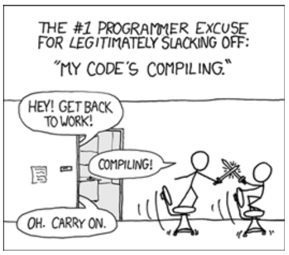
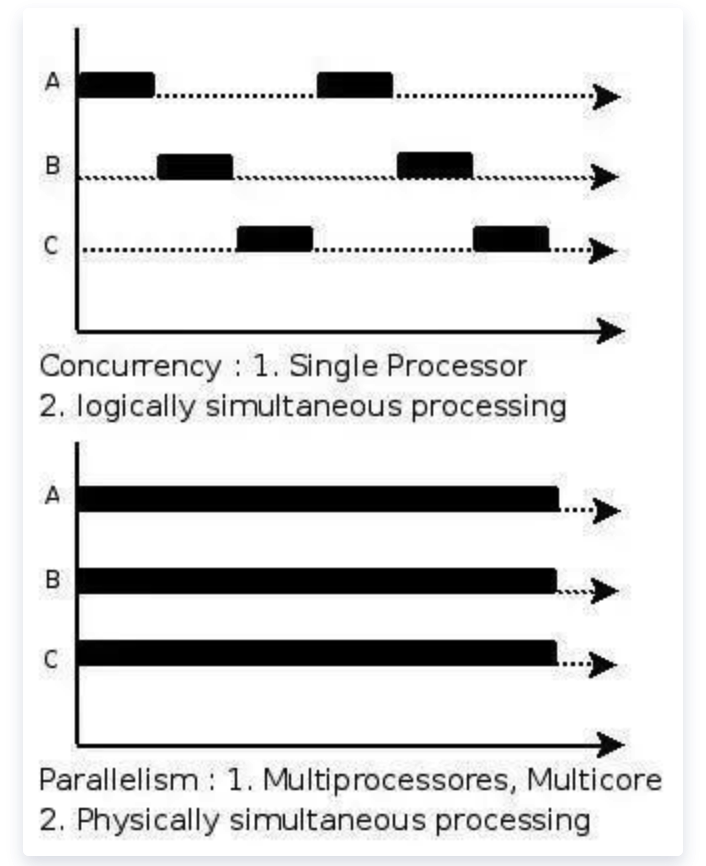
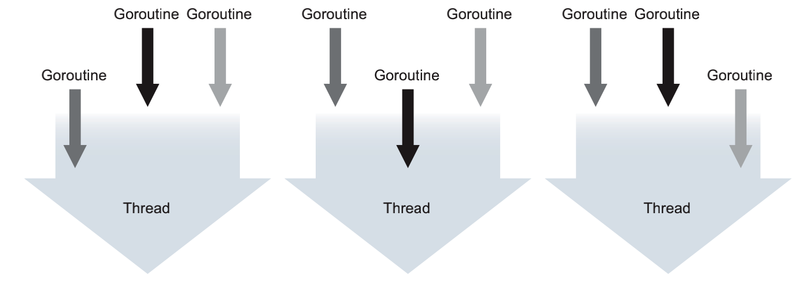
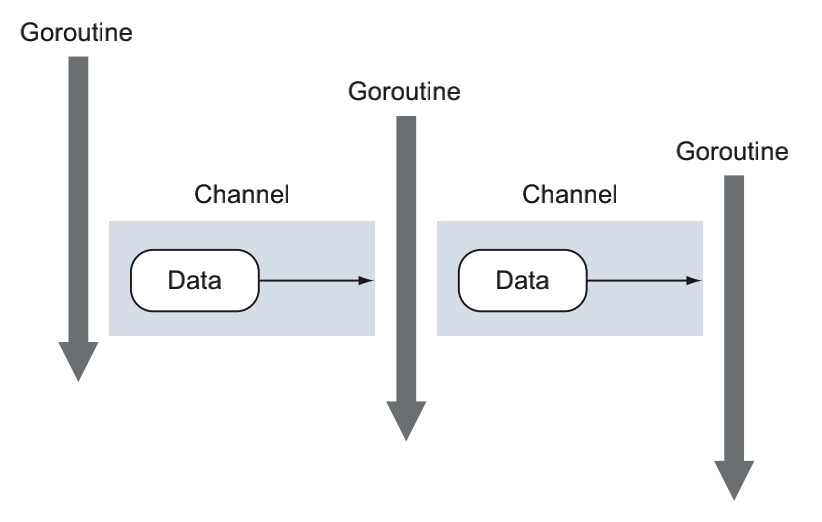

> 对语言进行评估时，明白设计者的动机以及语言要解决的问题很重要。
>
> 1. 语言面临什么问题？
> 2. 是怎么解决的？
>
> Go 语言的**设计目标**是“兼具 Python 等**动态语言**的开发速度和 C/C++ 等编译型语言的性能与安全性”。

Go 语言的特性：

1. 简单的语法
2. 接口——代码复用的基础模块
3. 并发和同步
4. 强大的标准库
5. 错误处理
6. 内存管理
7. ...

==感受一门语言最简单的方法就是实践！==

Go 平衡了**底层系统语言的能力**，以及在**现代语言**中所见到的**高级特性**。你可以依靠 Go 语言来构建一个**非常快捷、高性能且有足够控制力**的编程环境。使用 Go 语言，可以写得更少，做得更多。

**现代编程**会遇到的哪些**难题**？看看 Go 会怎么解决：

1. ==开发速度==

   开发人员在为项目选择语言时，不得不在**快速开发**和**性能**之间做选择。C 和 C++ 这类语言提供了很快的**执行速度**，而 Ruby 和 Python 这类语言则擅长**快速开发**。而 Go 在这两者之间架起了桥梁。编译一个大型的 C 或者 C++ 项目所花费的时间甚至比去喝杯咖啡的时间还长。

   

   > 有些编程语言要求必须提前将所有源代码一次性转换成二进制指令，也就是**生成一个可执行程序**，比如 C\C++\Go\Java\汇编语言等，这种编程语言称为**编译型语言**。而有的编程语言可以一边执行一边转换，需要哪些源代码就转换哪些源代码，**不会生成可执行程序**，比如 Python\JavaScript\PhP 等，这种编程语言称为**解释型语言**。
   >
   > 因为每次执行程序都需要重新转换源代码，所以==解释型语言的执行效率天生就低于编译型语言==，甚至存在数量级的差距。在运行解释型语言的时候，我们始终都需要源代码和解释器，所以说它无法脱离开发环境。

   Go 语言使用了更加智能的编译器，并简化了解决依赖的算法，最终提供了更快的编译速度。编译 Go 程序时，编译器只会关注那些直接被引用的库，而不会遍历依赖链中所有依赖的库。

   >**静态（强类型）语言**，是在**编译时**变量的数据类型即可确定的语言，多数静态类型语言要求在使用变量之前必须声明数据类型，例如：C++、Java、Delphi 等。**动态（弱类型）语言**，是在**运行时**确定数据类型的语言，变量使用之前不需要类型声明，通常变量的类型是被赋值的那个值的类型，例如：PHP、Python、JavaScript 等。

   对于**动态语言**来说，没有从编译代码到执行代码的中间过程，可以快速看到输出。其代价是，动态语言不提供静态语言提供的**类型安全特性**，不得不经常用大量的测试套件来避免在运行的时候出现类型这类 Bug。在 Go 语言中，完全不用为这件事操心，因为编译器能帮用户捕获这种类型错误（<u>更偏向于认为是静态语言！</u>）。

2. ==并发==

   何谓并发？何谓并行？**并发**是指在一个处理器上同时处理多个任务，而**并行**是指多个处理器或者多核的处理器同时处理多个不同的任务。**并发是逻辑上的同时发生，而并行是物理上的同时发生**。来一个确切的比喻：并发是一个人同时吃三个馒头，并行则是三个同时吃三个馒头（每人一个）。

   > 操作系统**时间片**的使用规则：某个作业在时间片结束之前，整个任务还没有完成，该作业就会被暂停下来，放弃 CPU 的使用权，等待下一轮循环继续进行。此时 CPU 被分配给了一个作业使用。这种时间片规则，让不同作业在不同时间使用 CPU 的“算力”，这种就叫做并发。
   >
   > 并行是指：当系统存在一个以上 CPU 时，当一个 CPU 执行一个进程时，另一个 CPU 可以执行了一个进程，两个进程互不抢占 CPU 资源，可以同时进行。

   

   开发出能**充分利用硬件资源**的应用程序时一件很难的事情，特别是现代计算机都拥有**多个核**，但是大部分编程语言都没有有效的工具让程序可以轻易利用这些资源。这些语言都需要编写大量的**线程同步代码**来利用多个核，这很容易导致错误。**这种能够有效利用多核资源的代码特性称之为并发**，Go 对并发的支持是这门语言的重要特性之一。==Go 对并发的支持包含 2 个元素：goroutine 和 channel==。

   **goroutine 是可以与其他 goroutine 并行执行的函数**，同时也会与主程序（程序的入口）并行执行。比如用户在写一个 Web 服务器，希望同时处理不同的 Web 请求，如果使用 Java，不得不写大量的额外代码来使用线程。在 Go 语言中，net/http 库直接使用了内置的 goroutine，每个接收到的请求都自动在其自己的 goroutine 里处理。**每一个 OS 线程都可以执行很多个 goroutine！**

   

   如果想在执行一段代码的同时，**并行**去做另外一些事情，goroutine 是很好的选择。

   ~~~go
   func log(msg string){
       // do some log
   }
   
   // 检测到了错误发生
   go log("发生了😨的事情")
   ~~~

   关键字 go 是唯一需要去编写的代码，调度 log 函数作为独立的 goroutine 去运行，以便与其他 goroutine 并行执行。这意味着应用程序的其余部分会**与记录日志并行执行**，通常这种并行能让最终用户觉得性能更好。

   channel 是一种**数据结构**，可以让 goroutine 之间进行**安全的数据通信**。channel 可以帮用户避免其他语言里常见的**共享内存访问**的问题。

   并发的最难的部分就是要确保其他并发运行的进程、线程或 goroutine 不会意外修改用户的数据。当不同的线程在没有**同步保护**的情况下修改同一个数据时，总会发生灾难。在其他语言中，如果使用**全局变量或者共享内存**，必须使用复杂的**锁规则**来防止对同一个变量的不同步修改。

   

   为了解决这个问题，通道提供了一种新模式，从而保证并发修改时的数据安全。**通道这一模式保证同一时刻只会有一个 goroutine 修改数据**。通道用于在几个运行的 goroutine 之间**发送数据**。

   需要强调的是，**通道并不提供跨 goroutine 的数据访问保护机制**。如果通过通道传输数据的一份副本，那么每个 goroutine 都持有一份副本，**各自对自己的副本做修改是安全的**。当传输的是指向数据的指针时，如果读和写是由不同的 goroutine 完成的，每个 goroutine 依旧需要额外的同步动作。

3. 类型系统

   Go 语言提供了**灵活的、无继承的类型系统**，无需降低运行性能就能最大程度上复用代码。这个类型系统依然支持面向对象开发，但避免了传统面向对象的问题。Go 开发者使用==组合（Composition）设计模式==，只需简单地将一个类型嵌入到了一个类型，就能复用所有的功能。在 Go 语言中，**一个类型由其他更微小的类型组合而成**，避免了传统的基于继承的模型。

   另外，Go 语言还具有独特的**接口实现机制**，允许用户**对行为进行建模**，而不是对类型进行建模。在 Go 语言中，不需要声明某个类型实现了某个接口，编译器会判断一个类型的实例是否符合正在使用的接口。

   Go 提供了**灵活的、无继承**的类型系统，**无需降低运行性能**就能**最大程度上复用代码**。这个类型系统依然**支持面向对象开发**，但避免了传统面向对象的问题。

   Go 具有的独特接口实现机制，允许用户对**行为建模**，而不是对类型建模。

   （类型简单）Go 语言不仅有类似 int 和 string 这样的内置类型，还支持**用户定义的类型**。用户定义的类型通常包含**一组带类型的字段**，用于存储数据。Go 语言的类型可以声明**操作该类型数据**的方法。Go 开发者**构建更小的类型，然后把这些小类型组合成更大的类型**。

   

   （接口简单）接口用于描述类型的行为。如果一个类型的实例实现了一个接口，意味着这个实例可以执行一组特定的行为。在 Go 中甚至不需要去声明这个实例实现某个接口，只需要实现这组行为就好了。==鸭子类型：如果它叫起来像鸭子，那它就可能是只鸭子==。在 Go 语言中，如果一个类型**实现了一个接口的所有方法**，那么**这个类型的实现**就可以存储在**这个接口类型的实例**中，不需要额外声明。

   Go 语言的接口一般只会描述一个**单一的动作**。比如 io.Reader 接口

   ~~~go
   type Reader interface{
       Read(p []byte) (n int, err error)
   }
   ~~~

   这和传统的面向对象编程语言的接口系统有本质的区别。Go 的接口更小，只倾向于定义一个单一的动作。实际使用中，这更**有利于使用组合来复用代码**。Go 语言的**整个网络库**都使用了 io.Reader 接口，这样可以将程序的功能和不同网络的实现分离。这样的接口用起来有趣、优雅且自由。文件、缓冲区、套接字以及其他的数据源都实现了 io.Reader 接口。**使用同一个接口，可以高效地操作数据，而不用考虑到底数据来自哪里**。

   Go 语言使用**接口**作为**代码复用**的基础模块。

4. 内存管理：

   **不当的内存管理会导致程序崩溃或者内存泄漏，甚至让整个操作系统崩溃**。Go 语言拥有现代化的垃圾回收机制，能帮你解决这个难题。Go 语言把无趣的内存管理交给专业的**编译器**去做，而让程序员专注于更有趣的事情。

Go 语言的特征：一种**静态强类型**、**编译型**、**并发的**，具有**垃圾回收功能**的编程语言。Go 语言的主要目标是将静态语言的安全性和高效性与动态语言的易开发性进行有机结合，达到完美平衡，从而使编程变得更加乐趣，而不是在艰难抉择中痛苦前行。

~~~go
package main

import (
	"net/http"
)

func main() {
    // HTTP 文件服务器是常见的 Web 服务之一，搭建简易的文件服务器
	http.Handle("/", http.FileServer(http.Dir(".")))
	http.ListenAndServe(":8080", nil)
}
~~~

在浏览器中键入 `http://127.0.0.1:8080/` 就能浏览当前程序根目录下的文件。

那既然 Go 具有这样的特征，可以按照特征点一一进行研究：

1. ==语法简单性==

   相关的问题有：

   * 基本语法有哪些？
   * 逻辑控制有哪些？
   * 关键性的数据结构模型有哪些？
   * 重点、核心语法有哪些？
   * 语法的底层是怎么实现的？
   * 和其他编程语言进行比较，有什么区别？

2. ==并发模型==

   搭配 Channel 实现 CSP 模型。

   早期 CPU 是以**单核**的形式**顺序执行机器指令**，顺序编程语言中的顺序是指：所有的指令都是以串行的方式执行，在**同一时刻有且仅有一个 CPU 在顺序执行程序的指令**。现代计算机都拥有多个核心，但是大部分编程语言都没有有效的工具让持续可以轻易利用这些资源。编程时需要写大量的线程同步代码来利用多个核，很容易导致错误。

   Go 语言的并发是基于 goroutine 的，goroutine 类似线程但并非线程，可将 goroutine 理解为一种虚拟线程。Go 语言运行时会参与调度 goroutine，并**将 goroutine 合理地分配到每个 CPU 中**，最大限度地使用 CPU 性能。多个 goroutine 中，Go 语言使用 Channel 进行通信。Channel 是一种内置的数据结构，可以让用户在不同的 goroutine 之间同步发送**具有类型的信息**。这让编程模型更倾向于**在 goroutine 之间发送消息**，而不是让多个 goroutine 争夺同一个数据的使用权。程序可以将并发设计为生产者模式和消费者模式，将数据放入通道。

   

3. ==内存分配==

   内存分配是核心组件！

4. ==垃圾回收==

   垃圾回收器是核心组件！

5. ==静态链接==

   **只须编译后的一个可执行文件，无需附加任何东西就能部署**。将运行时、依赖库直接打包到可执行文件内部，简化了部署和发布操作，无须事先安装运行环境和下载诸多第三方库。这种简单方式对于编写系统软件有着极大好处，因为库依赖一直都是个麻烦。

   Go 语言的 `buildmode` 功能——动态库。

6. ==标准库==

   功能完善、质量可靠的标准库威编程语言提供了充足的动力。在不借助第三方扩展的情况下，就可完成大部分基础功能开发，大大降低了学习和使用成本。最关键的是，标准库有升级和修复保障，还能从运行时获得深层次优化的便利，这是第三方库所不具备的。

7. ==工具链==

   完整的工具类对于日常开发极为重要，Go 在这方面做得相当不错，无论是**编译（Go 语言可以利用自己的特性实现并发编译，并发编译的最小元素是包）、格式化、错误检查、帮助文档、还是第三方包下载、更新**都有对应的工具。另外，还内置了==完整测试框架==，包括单元测试、性能测试、代码覆盖测试、数据竞争，以及用来调优的 `pprof`，这些都是保障代码能正确而稳定运行的必备利器。

   还可以通过环境变量输出运行时监控信息，尤其是==垃圾回收==和==并发调度跟踪==，可进一步帮助我们改进算法，获得更佳的运行期表现。