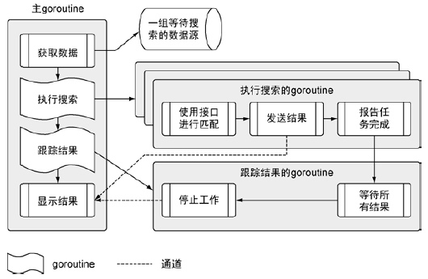
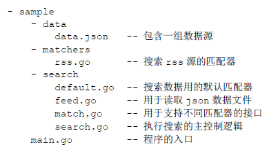
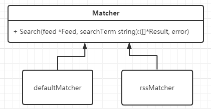

一个 Go 程序包含哪些组成部分？有什么样的编程哲学和习惯？

Go 语言的设计者们从**编程效率**出发设计了这门语言，但又不会丢掉**访问底层程序结构的能力**。设计者们通过一组最少的关键字、内置的方法和语法，最终平衡了这两方面。Go 语言也提供了完善的**标准库**，提供了构建实际的基于 Web 和基于网络的程序所需的所有核心库。

# 1 Go 工程目录结构

一个 Go 语言项目的目录一般包含以下三个子目录：

1. `src` 目录：包含项目和库的源文件；
2. `pkg` 目录：包含编译后生成的包/库的归档文件，归档文件是指那些名称以 `.a` 结尾的文件。
3. `bin` 目录：包含编译后生成的可执行文件。

下面以 Go 语言自身项目为例，其安装目录在 `GOROOT` 中：

~~~go
研发@PC-yanfa5 MINGW64 /c/Go
$ ls -al|sort
drwxr-xr-x 1 研发 197121     0 12月  1 14:09 bin/
drwxr-xr-x 1 研发 197121     0 12月  1 14:09 lib/
drwxr-xr-x 1 研发 197121     0 12月  1 14:09 misc/
drwxr-xr-x 1 研发 197121     0 12月  1 14:09 pkg/
drwxr-xr-x 1 研发 197121     0 12月  1 14:10 ./
drwxr-xr-x 1 研发 197121     0 12月  1 14:10 api/
drwxr-xr-x 1 研发 197121     0 12月  1 14:10 doc/
drwxr-xr-x 1 研发 197121     0 12月  1 14:10 src/
drwxr-xr-x 1 研发 197121     0 12月  1 14:10 test/
drwxr-xr-x 1 研发 197121     0 12月 29 08:55 ../
-rw-r--r-- 1 研发 197121     8 11月 12 16:54 VERSION
-rw-r--r-- 1 研发 197121    26 11月 12 16:52 robots.txt
-rw-r--r-- 1 研发 197121   397 11月 12 16:52 SECURITY.md
-rw-r--r-- 1 研发 197121  1303 11月 12 16:52 PATENTS
-rw-r--r-- 1 研发 197121  1339 11月 12 16:52 CONTRIBUTING.md
-rw-r--r-- 1 研发 197121  1479 11月 12 16:52 LICENSE
-rw-r--r-- 1 研发 197121  1607 11月 12 16:52 README.md
-rw-r--r-- 1 研发 197121  5686 11月 12 16:52 favicon.ico
-rw-r--r-- 1 研发 197121 55669 11月 12 16:52 AUTHORS
-rw-r--r-- 1 研发 197121 95475 11月 12 16:52 CONTRIBUTORS
total 287
~~~

再以 tour 项目为例，在 GOPATH 下有上述 3 个目录，其中 `src` 目录下有 `golang.org/x/tour/` 目录：

~~~go
研发@PC-yanfa5 MINGW64 ~/go/src/golang.org/x/tour
$ ls -al|sort
drwxr-xr-x 1 研发 197121    0 12月  2 16:39 ./
drwxr-xr-x 1 研发 197121    0 12月  2 16:39 content/
drwxr-xr-x 1 研发 197121    0 12月  2 16:39 gotour/
drwxr-xr-x 1 研发 197121    0 12月  2 16:39 pic/
drwxr-xr-x 1 研发 197121    0 12月  2 16:39 reader/
drwxr-xr-x 1 研发 197121    0 12月  2 16:39 solutions/
drwxr-xr-x 1 研发 197121    0 12月  2 16:39 static/
drwxr-xr-x 1 研发 197121    0 12月  2 16:39 template/
drwxr-xr-x 1 研发 197121    0 12月  2 16:39 tools/
drwxr-xr-x 1 研发 197121    0 12月  2 16:39 tree/
drwxr-xr-x 1 研发 197121    0 12月  2 16:39 wc/
drwxr-xr-x 1 研发 197121    0 12月  2 16:49 ../
-r--r--r-- 1 研发 197121   19 12月  2 16:24 .gcloudignore
-r--r--r-- 1 研发 197121   21 12月  2 16:24 codereview.cfg
-r--r--r-- 1 研发 197121   97 12月  2 16:24 go.mod
-r--r--r-- 1 研发 197121  171 12月  2 16:24 CONTRIBUTORS
-r--r--r-- 1 研发 197121  174 12月  2 16:24 AUTHORS
-r--r--r-- 1 研发 197121  715 12月  2 16:24 go.sum
-r--r--r-- 1 研发 197121  918 12月  2 16:24 app.yaml
-r--r--r-- 1 研发 197121 1257 12月  2 16:24 fmt.go
-r--r--r-- 1 研发 197121 1360 12月  2 16:24 TRANSLATE
-r--r--r-- 1 研发 197121 1479 12月  2 16:24 LICENSE
-r--r--r-- 1 研发 197121 1618 12月  2 16:24 CONTRIBUTING.md
-r--r--r-- 1 研发 197121 1827 12月  2 16:24 README.md
-r--r--r-- 1 研发 197121 2028 12月  2 16:24 TODO
-r--r--r-- 1 研发 197121 2095 12月  2 16:24 appengine.go
-r--r--r-- 1 研发 197121 5746 12月  2 16:24 local.go
-r--r--r-- 1 研发 197121 6753 12月  2 16:24 tour.go
total 70
~~~

**包是 Go 语言管理代码的重要机制**，其作用类似于 Java 中的 package 和 C/C++ 的头文件。Go 源文件中第一行有效代码必须是 `package <包名>` 的形式。另外，需要注意的是，Go 语言会把通过 `go get ...` 命令获取到的库源文件下载到 `src` 目录下对应的文件夹当中。

命令源文件和库源文件，它们到底有什么区别？

1. **命令源文件**：如果一个 Go 源文件被声明属于 main 包，并且该文件中包含 main 函数，则它就是命令源文件。命令源文件属于程序的入口，可以通过 `go run` 命令运行或者通过 `go build` 命令生成可执行文件。
2. **库源文件**：库源文件是指存在于某个包中的普通源文件，并且库源文件中不包含 main 函数。

不管是命令源文件还是库源文件，在同一个目录下的所有源文件，其所属包的名称必须一致的。

# 2 一个完整的 Go 项目

用一个**完整的 Go 语言程序**，来看看 Go 语言是**如何实现这些功能（上述特征）**的：从不同的数据源拉取数据，将数据内容与一组搜索项做对比，然后将匹配的内容显示在终端。这个程序会读取文本文件，进行网络调用，解码 XML 和 JSON 成为结构化类型数据，并且利用 Go 语言的并发机制保证这些操作的速度。

这个程序分为多个不同步骤，在多个不同的 goroutine 里运行。从主 goroutine 开始，一直到执行**搜索**的 goroutine 和**跟踪**结果的 goroutine，最后回到主 goroutine。代码清单如下：

文件夹 data 中有一个 JSON 文档，其内容是程序要拉取和处理的**数据源**。文件夹 matchers 中包含程序里用于**支持搜索不同数据源**的代码，目前程序只完成了**支持处理 RSS 类型的数据源**的**匹配器**。文件夹 search 中包含使用**不同匹配器进行搜索的业务逻辑**。程序 主入口是在 main.go 文件中。

~~~go
package main

import (
	"log"
	"os"

	_ "github.com/goinaction/code/chapter2/sample/matchers"
	"github.com/goinaction/code/chapter2/sample/search"
)

// init is called prior to main.
func init() {
	// Change the device for logging to stdout.
	log.SetOutput(os.Stdout)
}

// main is the entry point for the program.
func main() {
	// 使用特定的项（内容）做搜索
	search.Run("president")
}
~~~

构建程序在构建可执行文件时，需要找到这个已经声明的 main 函数，把它作为程序的入口。另外，==main== 函数保存在名为 main 的包里。如果 main 函数不在 main 包里，构建工具就不会生成可执行的文件。

Go 语言的每个代码文件都属于一个==包==，`main.go` 也不例外。包这个特性对于 Go 语言来说很重要：**一个包定义一组编译过的代码**，包的名字类似**命名空间**，可以用来**间接访问**包内声明的标识符。这个特性可以**把不同包中定义的同名标识符区别开**。

~~~go
import (
    // 导入标准库中的 log 和 os
	"log"
	"os"

	_ "github.com/goinaction/code/chapter2/sample/matchers"
	"github.com/goinaction/code/chapter2/sample/search"
)
~~~

关键字 import 就是导入一段代码，让用户可以访问其中的**标识符（Identifiers）**，如类型、函数、常量和接口。上述代码导入了 `search` 包，这样就刻意使用 `search` 包里的 `Run` 函数。

所有处于同一个文件夹里的代码文件，必须**使用同一个包名**。**按照惯例，包和文件夹同名**。**一个包定义一组编译后的代码**，每段代码都描述包的一部分。

在导入包时，使用了 `_` 技术，是为了**让 Go 语言对包做初始化操作，但是并不使用包里的标识符**。为了让程序的可读性更强，Go 编译器不允许什么导入某个包却不使用。下划线让编译器接受这类导入，并且**调用对应包内的所有代码文件里定义的 `init` 函数**，注册 RSS 匹配器，以便后用。

~~~go
// init is called prior to main.
func init() {
	// Change the device for logging to stdout.
	log.SetOutput(os.Stdout)
}
~~~

程序中每个代码文件里的 `init` 函数都会在 main 函数执行前调用。这个 `init` 函数将标准库里日志类的输出，从**默认的标准错误** stderr，设置为**标准输出** `stdout` **设备**。

~~~go
// main is the entry point for the program.
func main() {
	// 使用特定的项（内容）做搜索
	search.Run("president")
}
~~~

这一行调用了 search 包里的 Run 函数，这个函数包含程序的核心业务逻辑，需要传入一个字符串作为搜索项。一旦 Run 函数退出，程序就会终止。

这个程序使用的框架和业务逻辑都在 search 包里，这个包由 4 个不同的代码文件组成，每个文件对应一个独立的职责。整个程序都围绕**匹配器**来运作，匹配器是指**包含特定信息、用于处理某类数据源的实例**。框架本身实现了一个无法获取任何信息的默认匹配器，而在 matchers 包里实现了 RSS 匹配器，该匹配器知道如何**获取、读入并查找 RSS 数据源**。

~~~go
package search

import (
	"log"
	"sync"
)

// 注册用于搜索的匹配器的映射
var matchers = make(map[string]Matcher)
~~~

每个代码文件都以 package 关键字开头，随后跟着包的名字。文件夹 search 下的每个代码文件都使用 search 作为包名。与第三方包不同，从**标准库中导入代码**时，只需要给出要导入的包名。==编译器查找包的时候，总是会到 GOROOT 和 GOPATH 环境变量引用的位置取查找==。

~~~go
GOPATH=C:\Users\Developer\go
GOROOT=c:\go
~~~

程序的第 9 行的变量 matchers 没有定义在任何函数作用域内，会被当成**包级变量**。该变量是一个 map 类型，是以字符串 string 作为键，Matcher 类型值作为映射后的值。

在 Go 语言中，标识符要么从包里公开，要么不从包里公开。当代码导入了一个包时，程序可以直接访问这个包中任意一个**公开的标识符**（这些标识符以大写字母开头）。以小写字母开头的标识符是**不公开的**，不能被其他包中的代码直接访问。但是，==其他包可以间接访问不公开的标识符==。

`map[string]Matcher` 中的 `map` 是 Go 语言里的一个**引用类型**，需要使用 make 来构造。对于引用类型来说，所引用的底层数据结构会被初始化为对应的零值，但是被声明为其零值的引用类型的变量，会返回 nil 作为其值。

整体看看 `Run(searchTerm string)` 函数的实现：

~~~go
// Run performs the search logic.
func Run(searchTerm string) {
	// Retrieve the list of feeds to search through.
	feeds, err := RetrieveFeeds()
	if err != nil {
		log.Fatal(err)
	}

	// Create an unbuffered channel to receive match results to display.
	results := make(chan *Result)

	// Setup a wait group so we can process all the feeds.
	var waitGroup sync.WaitGroup

	// Set the number of goroutines we need to wait for while
	// they process the individual feeds.
	waitGroup.Add(len(feeds))

	// Launch a goroutine for each feed to find the results.
	for _, feed := range feeds {
		// Retrieve a matcher for the search.
		matcher, exists := matchers[feed.Type]
		if !exists {
			matcher = matchers["default"]
		}

		// Launch the goroutine to perform the search.
		go func(matcher Matcher, feed *Feed) {
			Match(matcher, feed, searchTerm, results)
			waitGroup.Done()
		}(matcher, feed)
	}

	// Launch a goroutine to monitor when all the work is done.
	go func() {
		// Wait for everything to be processed.
		waitGroup.Wait()

		// Close the channel to signal to the Display
		// function that we can exit the program.
		close(results)
	}()

	// Start displaying results as they are available and
	// return after the final result is displayed.
	Display(results)
}
~~~

Go 语言使用关键字 `func` 声明函数，关键字后面紧跟这函数名、参数以及返回值。对应 Run 这个函数来说，只有一个参数，是 string 类型的，名叫 `searchTerm`。这个参数是 Run 函数要搜索的搜索项。

Run 函数做的第一件事就是获取数据源 feeds 列表，这些数据源从互联网上抓取数据，之后对数据使用特定的搜索项进行匹配：

~~~go
// Retrieve the list of feeds to search through.
feeds, err := RetrieveFeeds()
if err != nil {
    log.Fatal(err)
}
~~~

不仅仅  Go 语言，很多语言都允许一个函数返回多个值。一般会像 RetrieveFeeds() 这样声明一个函数返回一个值和一个错误值。如果发生了错误，永远不要使用该函数返回的另一个值。这时必须忽略另一个值，否则程序会产生很多的错误，甚至崩溃。**编译器使用函数返回值的类型来确定每个变量的类型**。

~~~go
// Create an unbuffered channel to receive match results to display.
results := make(chan *Result)
~~~

使用内置的 make 函数创建了一个无缓冲的 Channel，使用**简化变量声明运算符**，在调用 make 的同时声明并初始化该通道变量。

> 如果需要声明初始值为零值的变量，应该使用 `var` 关键字声明变量；如果提供确切的非零值初始化变量或者使用函数返回值创建变量，应该使用**简化变量声明运算符**。
>
> `:=` Short variable declaration 简化变量声明运算符

通道 Channel 和 映射 map 与切片 slice 一样，都是引用类型。不过，通道本身实现的是一组带类型的值，这组值用于在 goroutine 之间传递数据。**通道内置同步机制，从而保证通信安全**。

~~~go
// Setup a wait group so we can process all the feeds.
var waitGroup sync.WaitGroup

// Set the number of goroutines we need to wait for while
// they process the individual feeds.
waitGroup.Add(len(feeds))
~~~

上述两行代码是为了防止程序在全部搜索执行完之前终止。在 Go 语言中，如果 main 函数返回，整个程序也就终止了。Go 程序终止时，还会关闭所有之前启动且还在运行的 goroutine。写并发程序的时候，最佳做法是，在 main 函数返回前，**清理并终止**所有之前启动的 goroutine。编写启动和终止时的状态都很清晰的持续，有助于减少 bug，防止资源异常。

这个程序使用 sync 包的 `WaitGroup` 跟踪所有启动的 goroutine。`WaitGroup` 是一个计数信号量，可以利用它来统计所有的 goroutine 是不是都完成了工作。每个 goroutine 完成其工作之后，就会递减 `WaitGroup` 变量的计数值，当这个值递减到 0 时，我们就知道所有的工作都做完了。

~~~go
// Launch a goroutine for each feed to find the results.
for _, feed := range feeds {
    // Retrieve a matcher for the search.
    matcher, exists := matchers[feed.Type]
    if !exists {
        matcher = matchers["default"]
    }

    // Launch the goroutine to perform the search.
    go func(matcher Matcher, feed *Feed) {
        Match(matcher, feed, searchTerm, results)
        waitGroup.Done()
    }(matcher, feed)
}
~~~

通过 map 查找到一个可用于处理特定数据源类型的数据的 Matcher 值，检测这个键是否存在于 map 里。如果不存在，使用默认匹配器。这样程序在不知道对应数据源的具体类型时，也可以执行，而不会中断。

一个 goroutine 是一个独立于其他函数运行的函数。使用关键字 go 启动一个 goroutine，并对这个 goroutine 做并发调度。上述代码使用 go 启动了一个匿名函数作为 goroutine。匿名函数是指没有明确声明名字的函数。

在 Go 语言中，**所有的变量都以值的方式传递**。因为**指针变量的值**是所指向的**内存地址**，在函数间传递指针变量，是在传递这个地址值，所以依旧被看作以值的方式在传递。

Match 函数会搜索数据源的数据，并将匹配结果输出到 results 通道。一旦 Match 函数调用完毕，就会执行 `waitGroup.Done()`，递减 `WaitGroup` 的计数。一旦每个 goroutine 都执行调用 Match 函数和 Done 方法，程序就知道每个数据源都处理完成。

特别注意的是：`WaitGroup` 的值没有作为参数传入匿名函数，但是匿名函数依旧访问到了这个值。Go 语言支持==闭包==，这里就应用了闭包。因为有了闭包，函数可以直接访问到那些没有作为参数传入的变量。匿名函数并没有拿到这些变量的副本，而是直接访问外层函数作用域中声明的这些变量本身。

随着每个 goroutine 搜索工作的运行，将结果发送到 results 通道，并递减 `waitGroup` 的计数，需要有一种方法来显示所有的结果，并让 main 函数持续工作，直到完成所有的操作：

~~~go
// Launch a goroutine to monitor when all the work is done.
go func() {
    // Wait for everything to be processed.
    waitGroup.Wait()

    // Close the channel to signal to the Display
    // function that we can exit the program.
    close(results)
}()

// Start displaying results as they are available and
// return after the final result is displayed.
Display(results)
~~~

`waitGroup.waite()` 方法导致 goroutine 阻塞，直到 `WaitGroup` 内部的计数到达 0。之后，goroutine 调用了内置的 close 函数，关闭了通道，最终导致程序终止。一旦 Display(results) 函数返回，程序就会终止！

再来整体看看 `feed.go` 程序文件代码：

~~~go
package search

import (
	"encoding/json"
	"os"
)

const dataFile = "data/data.json"

// Feed contains information we need to process a feed.
type Feed struct {
	Name string `json:"site"`
	URI  string `json:"link"`
	Type string `json:"type"`
}

// RetrieveFeeds reads and unmarshals the feed data file.
func RetrieveFeeds() ([]*Feed, error) {
	// Open the file.
	file, err := os.Open(dataFile)
	if err != nil {
		return nil, err
	}

	// Schedule the file to be closed once
	// the function returns.
	defer file.Close()

	// Decode the file into a slice of pointers
	// to Feed values.
	var feeds []*Feed
	err = json.NewDecoder(file).Decode(&feeds)

	// We don't need to check for errors, the caller can do this.
	return feeds, err
}
~~~

这个代码文件在 search 文件夹里，所以声明了包的名字为 search。另外程序导入了 2 个标准库的包：`json` 包提供编解码 JSON 的功能，`os` 包提供访问操作系统的功能，如读文件。

声明了一个叫做 `dataFile` 的常量，使用内容是磁盘上根据**相对路径指定的数据文件名**的字符串做初始化。来看看 `data.json` 数据文件的部分内容：

~~~json
[
{
	"site" : "npr",
	"link" : "http://www.npr.org/rss/rss.php?id=1001",
	"type" : "rss"
},
{
	"site" : "npr",
	"link" : "http://www.npr.org/rss/rss.php?id=1008",
	"type" : "rss"
},
{
	"site" : "npr",
	"link" : "http://www.npr.org/rss/rss.php?id=1006",
	"type" : "rss"
}
]
~~~

数据文件包含一个 JSON 文档数组，数组的每一项都是一个 JSON 文档，包含获取数据的网站名、数据的链接以及我们期望获得的数据类型。这些数据文档需要解码到一个结构组成的切片里，以便我们能在程序里使用这些数据。用于解码数据文档的结构类型：

~~~go
// Feed contains information we need to process a feed.
type Feed struct {
	Name string `json:"site"`
	URI  string `json:"link"`
	Type string `json:"type"`
}
~~~

声明了一个名叫 Feed 的结构类型，这个类型会对外暴露。这个类型里面声明了 3 个字段，每个字段的类型都是字符串，对应于数据文件中各个文档的不同字段。每个字段的声明最后 ‘’ 引号里的部分被称作标记。这个标记里描述了 JSON 解码的==元数据==，用于创建 Feed 类型值的切片。每个标记将结构类型里字段对应到 JSON 文档里指定名字的字段。

关键字 defer 会安排随后的函数调用在函数返回时才执行。在使用完文件后，需要主动关闭文件。使用关键字 defer 来安排调用 close 方法，可以保证这个函数一定会被调用。哪怕函数意外崩溃终止，也能保证关键字 defer 安排调用的函数会被执行。关键字 defer 可以缩短打开文件和关闭文件之间间隔的代码行数，有助提高代码可读性，减少错误。

`match.go` 代码文件包含创建不同类型匹配器的代码，这些匹配器用于在 Run 函数里对数据进行搜索。在 `main.go` 中，调用 `Match(matcher, feed, searchTerm, results)` 是最为关键的。让这段代码起作用的关键是这个架构使用**一个接口类型**来匹配并执行具有**特定实现的匹配器**。这样，就能使用这段代码，以一致且通用的方法，来处理不同类型的匹配器值。

~~~go
package search

import (
	"log"
)

// Result contains the result of a search.
type Result struct {
	Field   string
	Content string
}

// Matcher defines the behavior required by types that want
// to implement a new search type.
type Matcher interface {
	Search(feed *Feed, searchTerm string) ([]*Result, error)
}
~~~

声明了一个名为 Matcher 的接口类型，这个接口声明了结构类型或者具名类型需要实现的行为。一个接口的行为最终由在这个接口类型中声明的方法决定。

命名接口的时候，也需要==遵守 Go 语言的命名惯例==。如果接口类型只包含一个方法，那么这个类型的名字以 er 结尾。如果接口类型内部声明了多个方法，其名字需要与其行为关联。如果要让一个用户定义的类型实现一个接口，这个用户定义的类型要实现接口类型里声明的所有方法：

~~~go
package search

// defaultMatcher implements the default matcher.
type defaultMatcher struct{}

// init registers the default matcher with the program.
func init() {
	var matcher defaultMatcher
	Register("default", matcher)
}

// Search implements the behavior for the default matcher.
func (m defaultMatcher) Search(feed *Feed, searchTerm string) ([]*Result, error) {
	return nil, nil
}
~~~

使用一个空结构声明了一个名叫 `defaultMatcher` 的结构类型。**空结构在创建实例时，不会分配任何内存**。这种结构很适合创建没有任何状态的类型，对于默认匹配器来说，不需要维护任何状态，只要实现对应的接口就行。

`defaultMatcher` 类型实现 Matcher 接口，实现接口的方法 Search 只返回两个 nil 值。其他的实现，如 RSS 匹配器的实现，会在这个方法里使用特定的业务逻辑规则来处理搜索。

Search 方法的声明也声明了 `defaultMatcher` 类型的值的**接收者**。如果声明函数的时候带有接收者，则意味着声明了一个**方法**。这个方法会**和指定的接收者的类型绑定在一起**。意味着可以使用 `defaultMatcher` 类型的值或者指向这个类型值的指针来调用 Search 方法，上述 2 种方法的调用对于编译器而言都会正确地引用或者解引用对应的值，作为接收者传递给 Search 方法。

~~~go
// 方法声明为使用 defaultMatcher 类型的值作为接收者
func (m defaultMatcher) Search(feed *Feed, searchTerm string)
// 声明一个指向 defaultMatcher 类型值的指针
dm := new(defaultMatcher)
dm.Search(feed, "test")

// 方法声明为使用指向 defaultMatcher 类型值的指针作为接收者
func (m *defaultMatcher) Search(feed *Feed, searchTerm string)
var dm defaultMatcher
// 编译器会自动生成指针引用 dm 值，使用指针调用方法
dm.Search(feed, "test")
~~~

因为大部分方法在被调用后都需要维护接收者的值的状态，所以，**一个最佳实践是，将方法的接收者声明为指针**。与直接通过值或者指针调用方法不同，如果**通过接口类型的值调用方法**，规则由很大不同：

~~~go
// 方法声明为使用指向 defaultMatcher 类型值的指针作为接收者
func (m *defaultMatcher) Search(feed *Feed, searchTerm string)
var dm defaultMatcher
var matcher Matcher = dm

// 编译器会自动生成指针引用 dm 值，使用指针调用方法
matcher.Search(feed, "test")
~~~

上述编译会报错！使用指针作为接收者声明的方法，只能在接口类型的值是一个指针的时候被调用。

/search 包下的 `match.go` 中的方法：

~~~go
// Match 函数，为每个数据源单独启动 goroutine 来执行这个函数，并发执行搜索
func Match(matcher Matcher, feed *Feed, searchTerm string, results chan<- *Result) {
	// 对特定的匹配器执行搜索
	searchResults, err := matcher.Search(feed, searchTerm)
	if err != nil {
		log.Println(err)
		return
	}

	// Write the results to the channel.
	for _, result := range searchResults {
		results <- result
	}
}
~~~

该方法由 `search.go` 中的 Run() 方法调用。这个函数接受 Matcher 类型的值作为第一个参数。只有**实现了 Matcher 接口**的值或者指针能被接受。在第 4 行中执行了 Matcher 变量中**特定的** Search 方法。

`match.go` 中的最后一部分代码就是在 `search.go` 的第 56 行调用的 Display 函数：

~~~go
// Display writes results to the console window as they
// are received by the individual goroutines.
func Display(results chan *Result) {
	// The channel blocks until a result is written to the channel.
	// Once the channel is closed the for loop terminates.
	for result := range results {
		log.Printf("%s:\n%s\n\n", result.Field, result.Content)
	}
}
~~~

当通道被关闭时，通道和关键字 range 的行为，使这个函数在处理完所有结果后才会返回。

与之对应的就是 `search.go` 中的关闭：

~~~go
// Launch a goroutine to monitor when all the work is done.
go func() {
    // Wait for everything to be processed.
    waitGroup.Wait()

    // Close the channel to signal to the Display
    // function that we can exit the program.
    close(results)
}()

// Start displaying results as they are available and
// return after the final result is displayed.
Display(results)
~~~

一旦最后一个搜索 goroutine 调用了 Done，Wait 方法会返回并关闭通道。

那现在大概就能梳理出整个程序中**接口、类型的相互关系**：

另外，再从 `default.go` 入手，看看其他还未分析的代码：

~~~go
// init registers the default matcher with the program.
func init() {
	var matcher defaultMatcher
	Register("default", matcher)
}
~~~

在 `default.go` 代码中，还有一个特殊的函数，名叫 `init`。**程序里所有的 `init` 方法都会在 main 函数启动前被调用**。

~~~go
package main

import (
	"log"
	"os"

	_ "github.com/goinaction/code/chapter2/sample/matchers"
	"github.com/goinaction/code/chapter2/sample/search"
)
...
~~~

main 中导入了 matchers 和 search 包，这让编译器可以找到 `default.go` 代码文件里的 init 函数。一旦编译器发现 `init` 函数，它就会给这个函数优先执行的权利，保证其在 main 函数之前被调用。

~~~go
// Register is called to register a matcher for use by the program.
func Register(feedType string, matcher Matcher) {
	if _, exists := matchers[feedType]; exists {
		log.Fatalln(feedType, "Matcher already registered")
	}

	log.Println("Register", feedType, "matcher")
	matchers[feedType] = matcher
}
~~~

这个函数的职责是，将一个 Matcher 值加入到保存注册匹配器的映射中。所有这种注册都应该在 main 函数被调用前完成。使用 `init` 函数可以完美地完成这种初始化时注册的任务。

上述所有的代码搭建了一个框架，以便能够实现不同的匹配器来搜索内容。RSSS 匹配器的结构与默认匹配器的结构很类似。每个匹配器为了匹配接口，Search 方法的实现都不同，因此匹配器之间无法互相替换。

比如 `http://www.npr.org/rss/rss.php?id=1001` 这个类型是 RSS 类型，期望的 RSS 数据源文档：

RSS 匹配器的实现会**下载**这些 RSS 文档，使用搜索项来搜索标题和描述域，并将结果发送给 results 通道。

为了让持续可以使用文档里的数据，解码 RSS 文档的时候需要用到 4 个结构类型：

~~~go
type (
	// item defines the fields associated with the item tag in the rss document.
	item struct {
		XMLName     xml.Name `xml:"item"`
		PubDate     string   `xml:"pubDate"`
		Title       string   `xml:"title"`
		Description string   `xml:"description"`
		Link        string   `xml:"link"`
		GUID        string   `xml:"guid"`
		GeoRssPoint string   `xml:"georss:point"`
	}

	// image defines the fields associated with the image tag in the rss document.
	image struct {
		XMLName xml.Name `xml:"image"`
		URL     string   `xml:"url"`
		Title   string   `xml:"title"`
		Link    string   `xml:"link"`
	}

	// channel defines the fields associated with the channel tag
	// in the rss document.
	channel struct {
		XMLName        xml.Name `xml:"channel"`
		Title          string   `xml:"title"`
		Description    string   `xml:"description"`
		Link           string   `xml:"link"`
		PubDate        string   `xml:"pubDate"`
		LastBuildDate  string   `xml:"lastBuildDate"`
		TTL            string   `xml:"ttl"`
		Language       string   `xml:"language"`
		ManagingEditor string   `xml:"managingEditor"`
		WebMaster      string   `xml:"webMaster"`
		Image          image    `xml:"image"`
		Item           []item   `xml:"item"`
	}

	// rssDocument defines the fields associated with the rss document.
	rssDocument struct {
		XMLName xml.Name `xml:"rss"`
		Channel channel  `xml:"channel"`
	}
)
~~~

把这些结构与任意一个数据源的 RSS 文档对比，就能发现对应关系。

~~~go
// rssMatcher implements the Matcher interface.
type rssMatcher struct{}

// init registers the matcher with the program.
func init() {
	var matcher rssMatcher
	search.Register("rss", matcher)
}
~~~

因为不需要维护任何状态，我们使用一个空结构来实现 Matcher 接口。就像在默认匹配器里看到的一样，`init` 函数将 `rssMatcher` 类型的值注册到程序里，以备后用。

~~~go
package main

import (
	"log"
	"os"

	_ "github.com/goinaction/code/chapter2/sample/matchers"
	"github.com/goinaction/code/chapter2/sample/search"
)
...
~~~

`main.go` 代码文件里的代码并没有直接使用任何 matchers 包里的标识符。不过，我们依旧需要编译器安排调用 `rss.go` 代码文件里的 `init` 函数。使用下划线标识符作为别名导入 matchers 包，完成了这个调用。这种方法可以让编译器在导入未被引用的包时不报错，而且依旧会定位到包内的 `init` 函数。

~~~go
// retrieve performs a HTTP Get request for the rss feed and decodes the results.
func (m rssMatcher) retrieve(feed *search.Feed) (*rssDocument, error) {
	if feed.URI == "" {
		return nil, errors.New("No rss feed uri provided")
	}

	// Retrieve the rss feed document from the web.
	resp, err := http.Get(feed.URI)
	if err != nil {
		return nil, err
	}

	// Close the response once we return from the function.
	defer resp.Body.Close()

	// Check the status code for a 200 so we know we have received a
	// proper response.
	if resp.StatusCode != 200 {
		return nil, fmt.Errorf("HTTP Response Error %d\n", resp.StatusCode)
	}

	// Decode the rss feed document into our struct type.
	// We don't need to check for errors, the caller can do this.
	var document rssDocument
	err = xml.NewDecoder(resp.Body).Decode(&document)
	return &document, err
}
~~~

方法 retrieve 并没有对外暴露，其执行的逻辑是从 RSS 数据源的链接拉取 RSS 文档。

~~~go
// Search looks at the document for the specified search term.
func (m rssMatcher) Search(feed *search.Feed, searchTerm string) ([]*search.Result, error) {
	var results []*search.Result

	log.Printf("Search Feed Type[%s] Site[%s] For URI[%s]\n", feed.Type, feed.Name, feed.URI)

	// Retrieve the data to search.
	document, err := m.retrieve(feed)
	if err != nil {
		return nil, err
	}

	for _, channelItem := range document.Channel.Item {
		// Check the title for the search term.
		matched, err := regexp.MatchString(searchTerm, channelItem.Title)
		if err != nil {
			return nil, err
		}

		// If we found a match save the result.
		if matched {
			results = append(results, &search.Result{
				Field:   "Title",
				Content: channelItem.Title,
			})
		}

		// Check the description for the search term.
		matched, err = regexp.MatchString(searchTerm, channelItem.Description)
		if err != nil {
			return nil, err
		}

		// If we found a match save the result.
		if matched {
			results = append(results, &search.Result{
				Field:   "Description",
				Content: channelItem.Description,
			})
		}
	}

	return results, nil
}
~~~

上述程序运行结果：

~~~go
C:\Users\Developer\sample>sample.exe
2020/12/21 11:22:14 Register default matcher
2020/12/21 11:22:14 Register rss matcher
2020/12/21 11:22:14 Search Feed Type[rss] Site[npr] For URI[http://www.npr.org/rss/rss.php?id=1006]
2020/12/21 11:22:14 Search Feed Type[rss] Site[npr] For URI[http://www.npr.org/rss/rss.php?id=1001]
2020/12/21 11:22:14 Search Feed Type[rss] Site[npr] For URI[http://www.npr.org/rss/rss.php?id=1012]
2020/12/21 11:22:14 Search Feed Type[rss] Site[npr] For URI[http://www.npr.org/rss/rss.php?id=1007]
...
2020/12/21 11:22:15 Description:
The history of presidential pardons is often surprising — and revealing.
...
~~~

