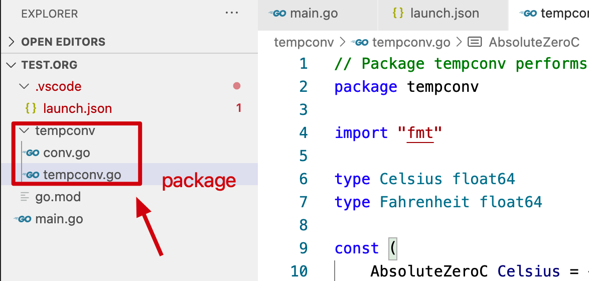

与其他编程语言一样，Go 语言中的大程序都从**小的基本组件**构建而来（相当于是“基础”）。

（**Go 工程代码是如何组织起来的**）变量保存值，简单的加法和减法运算被组合成较复杂的**表达式**。基础类型被聚合为数组或结构体等更复杂的数据结构，然后使用 if 和 for 之类的控制语句来组织和控制表达式的执行流程。然后多个语句被组织到一个个函数中，以便代码的隔离和复用。函数则以源文件和包的方式被组织起来！

下面将更加细致地讨论 Go 程序中的**基本结构元素**：==掰开了，揉碎了==来看看一个 Go 程序由哪些部分组成？

# 1 命名

Go 中的**函数、变量、常量、类型、语句标签和包**的**名称**遵循一个简单的规则：名称的开头是一个字母（Unicode 中的字符即可）或下划线，后面可以跟任意数量的字符、数字和下划线，并区分大小写。（此处的名称，也可称之为==标识符==）heapSort 和 Heapsort 是两个不同的名字。

Go 有 25 个像 if 和 switch 这样的==关键字==，只能用在语法允许的地方，**不能用做自定义名称（标识符）**：

~~~go
break default func interface select 
case defer go map struct 
chan else goto package switch 
const fallthrough if range type 
continue for import return var
~~~

另外，还有三十几个内置的==预声明的常量、类型和函数==：

~~~go
// 常量
true false iota nil

// 类型
int int8 int16 int32 int64 
uint uint8 uint16 uint32 uint64 uintptr
float32 float64 complex128 complex64
bool byte rune string error

// 函数
make len cap new append copy close delete 
complex real imag 
panic recover
~~~

这些内部预先定义的名字**并不是关键字，我们可以在定义中重新使用它们**。在很多地方可看到对其中的名称进行重定义，但是也要注意避免过度而引起语义混乱。

如果一个实体在函数中定义，它只在函数局部（内部）有效。如果在函数外部定义，它将**在当前包里面的所有源文件**可见。实体第一个字母的大小写决定其**可见性是否跨包**。如果名称以大写字母的开头，它是导出的，意味着它对包外是可见和可访问的，可以被自己包之外的其他程序所引用。**包名本身总是由小写字母组成**。例如 fmt 包的 Printf 函数就是导出的，可以在 fmt 包外部访问。

名称本身没有长度限制，但是习惯以及 Go 的编程风格**倾向于使用短名称**，特别是作用域较小的局部变量。我们通常会看到 i 之类的短名字，而不是冗长的 theLoopIndex 命名。通常来说，如果一个名称的作用域比较大，生命周期也比较长，就使用越长且更有意义的名称。

风格上，当遇到由单词组合的名称时，Go 程序员**使用“驼峰式”的风格**——更喜欢使用大写字母而不是下划线。因此，在标准库有 QuoteRuneToASCII 和 parseRequestLine 这样的函数命名，但是一般不会用 quote_rune_to_ASCII 和 parse_request_line 这样的命名。而**像 ASCII 和 HTML 这样的缩略词则避免使用大小写混合的写法**，它们可能被称为 htmlEscape、HTMLEscape 或 escapeHTML，但不会是 escapeHtml。

# 2 声明

==声明语句==定义了程序的各种==实体对象==以及部分或全部的==属性==（声明**给一个程序实体命名**，并且**设定其部分或全部属性**）。Go 语言主要有 4 种声明语句：**变量、常量、类型和函数实体对象**的声明，分别使用 var、const、type 和 func。

Go 程序存储在一个或多个以 .go 为后缀的文件里。每一个文件以 package ==声明==开头，表明文件属于哪个包。package 声明后面是 import ==声明==，然后是包级别（包一级）的类型、变量、常量、函数的==声明==。包级别的各种类型的声明语句的顺序无关紧要；而函数内部的名字则必须先声明之后才能使用。

~~~go
package main

import "fmt"

const boilingF = 212.0

func main() {
	var f = boilingF
	var c = (f - 32) * 5 / 9
	fmt.Printf("boiling point = %g°F or %g°C\n", f, c)
}
~~~

常量 boilingF 是一个**包级别的声明**（main 包），f 和 c 是属于 main **函数的局部变量**。在包一级声明语句声明的实体名字不仅对于包含其声明的源文件可见，而且对于==同一个包==里面的所有源文件都可见。相比之下，局部声明的名字仅仅是在声明所在的函数内部可见，并且可能对于函数中的一小块区域可见。

**函数的声明**包含一个函数名字、一个参数列表（由函数的调用者提供参数变量的具体值）、一个==可选的==返回值列表，以及函数体（其中包含具体逻辑语句）。如果函数不返回任何内容，返回值列表可以省略。函数的执行从第一个语句开始顺序执行，直到遇到一个返回语句，或者执行到无返回结果的函数的结尾。然后**程序控制**和返回值（如果有的话）都返回给调用者。

我们已经看到过很多函数声明和函数调用的例子。下面的 `fToC` 函数封装了温度转换的处理逻辑，这样它只需要被定义一次，就可以在多个地方多次被使用：

~~~go
package main

import "fmt"

const boilingF = 212.0

func main() {
	const freezingF, boilingF = 32.0, 212.0

	fmt.Printf("%g°F = %g°C\n", freezingF, fToC(freezingF))
	fmt.Printf("%g°F = %g°C\n", boilingF, fToC(boilingF))
}

func fToC(f float64) float64 {
	return (f - 32) * 5 / 9
}
~~~

`fToC` 被调用了两次，分别使用了在局部定义的两个常量作为调用函数的参数。

# 3 变量

var 声明语句可以**创建一个特定类型的变量（变量在编程语言中是一个具体的概念）**，然后给变量附加一个名字，并且**设置它的初始值**。**每个声明有一个通用的形式**：

~~~go
var name type = expression // var 变量名字 类型 = 表达式
~~~

类型和表达式部分可以省略一个，但是不能都省略。如果类型省略，它的类型将由初始化表达式来推导变量的类型信息；如果表达式省略，其初始值对应于==类型的零值==初始化该变量：

1. 数字是 0；
2. 布尔值是 false；
3. 字符串是 ""；
4. 接口和引用类型（slice、指针、map、chan、函数）是 nil；
5. 数组或结构体这样的**复合类型**，其零值是其所有元素或成员的零值。

> 从上面也可以看出：数组和 slice 在 Go 语言中是不同的类型！

**零值初始化机制**保障所有的变量是良好定义的，==Go 里面不存在未初始化变量==。这个特性可以简化很多代码，而且可以在没有增加额外工作的前提下确保**边界条件下的合理行为**。例如：

~~~go
package main

import "fmt"

func main() {
	var s string
	fmt.Println(s) // ""
}
~~~

这段代码将打印一个空字符串，**而不是导致错误或产生不可预知的行为**！Go 语言程序猿应该让一些聚合类型的零值也具有意义，这样可以保证不管任何类型的变量总是有**一个合理有效的零值状态**。

也可以在一个声明语句中**同时声明一组变量**，或用一组初始化表达式声明并初始化一组变量。如果省略每个变量的类型，将可以声明多个类型不同的变量（那必定存在初始化表达式，变量的类型由初始化表达式推导）：

~~~go 
var i, j, k int // int, int, int
var b, f, s = true, 2.3, "four" // bool, float64, string
~~~

初始值设定可以是**字面量值**或者任意的表达式。**包级别的初始化在 main 开始之前进行**，局部变量将在声明语句被执行到的时候完成初始化。

一组变量也可以通过调用一个函数，由函数返回的**多个返回值**初始化：

~~~go
var f, err = os.Open(name) // os.Open returns a file and an err
~~~

==在函数内部中==，有一种称作==简短变量声明语句==的形式可以用来==声明和初始化局部变量==。

~~~go
name := expression
~~~

name 的类型由 expression 的类型来自动推导。下面是 lissajous 函数中的三个简短变量声明语句：

~~~go
anim := gif.GIF{LoopCount: nframes}
freq := rand.Float64() * 3.0
t := 0.0
~~~

因其短小、灵活，故而在**局部变量**的声明和初始化中主要是用短声明。var 形式的声明语句往往是用于需要显式指定变量类型的地方，或者因为变量稍后会被重新赋值而初始值无关紧要的地方。

~~~go
i := 100
var boiling float64 = 100
var names []string
var err error
var p Point
~~~

与 var 声明一样，简短变量声明语句也可以用来声明和初始化一组变量：

~~~go
i, j := 0, 1
~~~

只有当它们对于可读性有帮助的时候才使用多个初始化表达式来进行变量声明。比如 for 语句的循环的初始化语句部分。

记住：`:=` 是一个变量声明语句，`=` 是一个变量赋值操作。一个**多变量的声明**不能和**多重赋值**搞混淆，后者将右边的值赋给左边的对应变量。

~~~go
i, j = j, i // 交换 i 和 j 的值
~~~

与普通的 var 声明类似，短变量声明也可以用来调用像 os.Open 那样返回两个或多个值的函数来声明和初始化变量，像下面的 os.Open 函数调用将返回两个值：

~~~go
f, err := os.Open(name)
if err != nil {
    return err
}

// ...使用 f...
f.Close()
~~~

这里有一个比较微妙的地方：简短变量声明左边的变量可能并不是全部都是刚刚声明的。如果有一些已经==在相同的词法域==声明过了，那么简短变量声明语句对这些已经声明过的变量就只有赋值行为了。短变量声明不需要声明所有在左边的变量。如果一些变量==在同一个词法块中声明==，那么对于那些变量，短声明的行为等同于==赋值==。

~~~go
package main

import (
	"fmt"
	"os"
)

func main() {
	var err error // 声明语句，声明了 err
	f, err := os.Open("") // 简短变量声明并赋值
	fmt.Println(f, err)
}
~~~

再比如：

~~~go
in, err := os.Open(infile)
// ...
out, err := os.Create(outfile)
~~~

**短变量声明最少声明一个新变量**，否则，代码编译将无法通过：

~~~go
f, err := os.Open(infile)
// ...
f, err := os.Create(outfile) // 编译错误：没有新的变量

f, err = os.Create(outfile)
~~~

第二个语句使用普通的赋值语句来修复这个错误。

**简短变量声明语句只有对已经在同级词法域声明过的变量才和赋值操作语句等价**，如果变量是在外部词法域声明的，那么简短变量声明语句将会在当前词法域**重新声明一个新的变量**。

~~~go
package main

import (
	"fmt"
)

func main() {
	var i = 1.0
	var flag = true
	if flag {
		i := 2.0
		i++
		fmt.Println("i:", i) // 3
	}
	fmt.Println("i:", i) // 1
}
~~~

原先定义的局部变量 `i` 起初是值是 1.0，在 `if` 语句块中，使用简短变量声明语句声明和初始化局部变量 `i`，实际上两个同名的局部变量是不同的！

谈到变量，必定会提及==指针==。**一个变量**对应一个保存了变量对应类型值的**内存空间**。**变量是存储值的地方**。普通变量在声明语句创建时被绑定到一个变量名，比如叫 x 的变量，但是还有很多变量始终以**表达式方式**引入，**例如 `x[i]` 或 `x.f` 变量**。所有这些表达式一般都是**读取一个变量的值**，除非它们是出现在赋值语句的左边，这种时候是给对应变量赋予一个新的值。

**一个指针的值是另一个变量的地址**，换种方式说明：一个指针对应变量在内存中的存储位置。**并不是每一个==值==都会有一个内存地址**，但是对于每一个==变量==必然有对应的内存地址。通过指针，我们可以直接读取或更新对应变量的值，而不需要知道该变量的名字（如果变量有名字的话）。

如果一个变量声明为 var x int，表达式 &x（x 的地址）获取**一个指向整型变量的指针**，它的类型是**整型指针**(*int)。==指针被称之为“指向 int 类型的指针”==。如果指针名字为 p（指针类型的变量，该变量名为 p），我们说指针 p 指向变量 x，或者 p 指针保存了变量 x 变量的内存地址。p 指向的变量写成 *p（相当于是在指针变量的基础上，做了一次 * 操作）。表达式 *p 获取变量的值，这里为一个整型类型的值，因为 *p 代表一个变量，所有它也可以出现在赋值操作符左边，用于更新变量的值。

~~~go
x := 1
p := &x
fmt.Println(*p)
*p = 2
fmt.Println(x)
~~~

每一个聚合类型变量的组成部分（结构体的成员或数组中的元素）都是变量，所以也有一个地址。

变量有时候被称为**可寻址的值**。即使变量由表达式临时生成，那么表达式也必须能接受 & 取地址操作。

**指针类型的零值是 nil**。测试 p != nil，结果是 true 说明 p 指向一个变量。指针之间也是可以进行**相等测试**的，两个指针当且仅当指向同一个变量或者两者都是 nil 的情况下才相等。但在 Go 中，==指针是不能用于计算的==。

~~~go
var x, y int
fmt.Println(&x == &x, &x == &y, &x == nil) // true, false, false
~~~

声明 `x` 和 `y` 2 个局部变量，并为其初始化为零值（0）。本质上 `&x`和 `&y` 指向 2 个不同的变量。var 声明语句会**为变量设置初始值**，此时变量的指针 &x 自然就不是 nil。

**函数返回局部变量的地址是非常安全的**。下述代码中，通过调用 f 产生的局部变量 v 即使在调用返回后依然存在，指针 p 依然引用该局部变量：

~~~go
var p = f() // p 变量的类型 *int
func f() *int {
    v :=1
    return &v
}
~~~

每次调用 f 都会**返回一个不同的值**。问题在于：**为什么这种方式是正确的？函数返回时，局部变量被释放了，`&v` 返回其局部变量的指针还有意义吗？**在**局部变量**地址被返回之后依然有效，因为指针依然引用这个变量。

因为一个指针包含变量的地址，所以传递一个指针参数给函数，能够让函数更新间接传递的变量值：

~~~go
func incr(p *int) int {
    *p++ // 只是增加 p 指向的变量的值，并不改变 p 指针
    return *p
}

v := 1
incr(&v)
fmt.Println(incr(&v)) // v 值现在是 3
~~~

每次我们对一个变量取地址，或者复制指针，**我们就为原变量创建了新的==别名==或者方式来标记同一变量**。例如 *p 是 v 的别名。指针特别有价值的地方在于：我们可以不用变量的名字来访问变量，但是这种特征是双刃剑：为了找到所有访问变量的语句，需要知道所有的别名（这是 Go 语言的垃圾回收器所做的工作）。不仅指针会==创建别名==，很多其他引用类型也会创建别名，例如 slice、map 和 chan，甚至结构体、数组和接口都会创建所引用变量的别名。

指针是实现标准库中 flag 包的关键技术，它使用**命令行参数**来设置对应变量的值，而这些对应命令行标志参数的变量可能会零散分布在整个程序中。为了说明这一点，在早期的 echo 版本中，就包含了两个可选的==命令行参数==：`-n` 用于**忽略行尾的换行符**，`-s sep` 用于指定分隔字符（默认是空格）。

~~~go
package main

import (
	"flag"
	"fmt"
	"strings"
)

var n = flag.Bool("n", false, "omit trailing newline")
var sep = flag.String("s", "", "separator")

func main() {
	// 触发解析命令行标志参数，为 *n 和 *sep 设置值
	flag.Parse()
	
	fmt.Print(strings.Join(flag.Args(), *sep))
	if !*n {
		fmt.Println()
	}
}
~~~

调用 `flag.Bool` 函数会创建一个新的对应布尔型标志参数的变量。它有三个属性：第一个是==命令行标志参数==的名字 “n”，然后是该标志参数的默认值（这里是 false），最后是该标志参数对应的描述信息。如果用户在命令行输入了无效的标志参数，或者输入 `-h` 或 `-help` 参数，那么将打印所有标志参数的名字、默认值和描述信息。程序中的 `sep` 和 `n` 变量分别是指向对应命令行标志参数变量的指针，因此必须用 `*sep` 和 `*n` 形式的指针语法间接引用它们。对于**非标志参数的普通命令行参数**可以通过调用 `flag.Args()	` 函数来访问，返回值对应一个字符串类型的 slice。下述的 `a bc def` 就是非标志参数的普通命令行参数：

~~~go
$ go build gopl.io/ch2/echo4
$ ./echo4 a bc def
a bc def
$ ./echo4 -s / a bc def
a/bc/def
$ ./echo4 -n a bc def
a bc def$
$ ./echo4 -help
Usage of ./echo4:
  -n    omit trailing newline
  -s string
        separator (default " ")
~~~

**另外一种创建变量的方式**是使用==内置的 new 函数==。表达式 new(T) 创建一个 T 类型的**匿名变量**，初始化为 T 类型的零值，然后返回变量地址，返回的指针类型为 *T。也就是说 new(T) 返回的结果是一个 T 类型的指针！

~~~go
p := new(int)
fmt.Println(*p) // 输出 0 值
*p = 2
fmt.Println(*p)
~~~

使用 new 创建的变量和取其地址的普通局部变量没有什么不同，只是不需要引入（和声明）一个虚拟的名字，通过 new(T) 就可以直接在表达式中使用。换言之，new 函数类似是一种语法糖，而不是一个新的基本概念。下面的两个 `newInt` 函数有着相同的行为：

~~~go
func newInt() *int {
    return new(int)
}
~~~

与之对应的是：

~~~go
func newInt() *int {
    var dummy int
    return &dummy
}
~~~

两个不同的 newInt 函数有相同的行为！

~~~go
package main

import "fmt"

func main() {
	for index := 0; index < 10; index++ {
		fmt.Printf("%d\n", newInt())
	}
}

func newInt() *int {
	var dummy int
	return &dummy
}
~~~

每一次调用 `newInt()` 返回的都是一个新的变量的地址，因此每次返回的地址都不同。

每一次调用 new 返回的是一个具有**唯一地址的不同变量**：

~~~go
p := new(int)
q := new(int)
fmt.Println(p == q) // false
~~~

当然也可能有特殊情况：如果两个类型都是空的，也就是类型的大小是0，例如 `struct{}` 和 `[0]int`，有可能有相同的地址（依赖具体的语言实现）（请谨慎使用大小为0的类型，因为如果类型的大小为0的话，可能导致 Go 语言的自动垃圾回收器有不同的行为）。

new 函数使用通常相对比较少，因为对于结构体来说，直接用字面量语法创建新变量的方法会更灵活。

**new 是一个预声明的函数，不是一个关键字，所以 new 可以重定义为另外的其他类型**，例如：

~~~go
func delta(old, new int) int {
    return new - old
}
~~~

由于 new 被定义为 int 类型的变量名，因此在 delta 函数内，内置的 new 函数是不可用的。

~~~go
package main

import "fmt"

func main() {
	fmt.Println(delta(2, 1))
}

func delta(old, int int) int {
	return old - int
}
~~~

同样的，可将 int 声明为一个变量的名字，上述 `delta` 函数也是可以正常运行的。

变量的==生命周期==指**在程序执行过程中变量有效存在的时间段**。**包级别变量**的生命周期是整个程序执行时间。相反，**局部变量**有一个动态的生命周期：每次执行声明语句时创建一个新的实体开始，变量一直生存到它变得不可访问，这时它**占用的存储空间**被♻️。

函数的参数和返回值也是局部变量，它们在函数每次被调用的时候创建：

~~~go
for t := 0.0; t < cycles * 2 * math.Pi; t += res{
    x := math.Sin(t)
    y := math.Sin(t*freq + phase)
    img.SetColorIndex(size + int(x * size + 0.5), size + int(y * size + 0.5), blackIndex)
}

for t := 0.0; t < cycles*2*math.Pi; t += res {
    x := math.Sin(t)
    y := math.Sin(t*freq + phase)
    img.SetColorIndex(
        size+int(x*size+0.5), size+int(y*size+0.5),
        blackIndex, // 最后插入的逗号不会导致编译错误，这是Go编译器的一个特性
    )               // 小括弧另起一行缩进，和大括弧的风格保存一致
}
~~~

> 函数的右小括弧也可以另起一行缩进，同时为了防止编译器在行尾自动插入分号而导致的编译错误，可以在末尾的参数变量后面显式插入逗号。

变量 t 在每次 for 循环的开始创建，然后在每次循环迭代中创建临时变量 x 和 y。

（==变量的可达性==）垃圾回收器如何知道一个变量是否应该被回收？基本思路是每一个包级别的变量，以及每一个当前执行函数的局部变量，可以作为追溯变量的路径的源头，通过指针和其他方式的引用可以找到变量。如果变量的路径不存在，那么变量变得不可访问，因此它不会影响任何其他的计算过程。因为**一个变量的有效周期只取决于是否可达**，因此一个循环迭代内部的局部变量的生命周期可能超出其局部作用域。同时，==局部变量可能在函数返回之后依然存在==，这也就解释了下述代码是正常的：

~~~go
var p = f() // p 变量的类型 *int
func f() *int {
    v :=1
    return &v
}
~~~

函数 f() 在返回时，返回了局部变量 v 的指针。让包级别的指针变量 p 指向了函数内部的局部变量 v。

编译器会==自动选择==使用堆或栈上分配局部变量的存储空间，**这个选择不是基于使用 var 或 new 关键字来声明变量**。

~~~go
var global *int

func f() {
    var x int
    x = 1
    global = &x
}

func g() {
    y := new(int)
    *y = 1
}
~~~

上述代码中 x 一定使用堆空间，因为它在 f 函数返回以后还可以从 global 变量访问，尽管它被声明为一个局部变量。用 Go 语言的术语说，这个 x 局部变量从函数 f 中==逃逸==。相反，当函数 g 返回时，变量 *y 将是不可达的，也就是说可以马上被回收的。因此，`*y` 并没有从函数 g 中逃逸，编译器可以安全地在栈上分配 *y，**即便使用 new 函数创建它**。编译器也可以选择在堆上分配，然后由 Go 语言的 GC 回收这个变量的内存空间。

任何情况下，逃逸的概念让我们不需要额外费心来写正确的代码，但要逃逸在性能优化的时候是有好处的，因为**每一次变量逃逸都需要一次额外的内存分配过程**。

Go 语言的自动垃圾回收器对编写正确的代码是一个巨大的帮助，但也并不是说你完全不用考虑内存了。你虽然不需要显式分配和释放内存，但是==变量的生命周期是写出高效程序所必需清楚的==。例如，如果将指向短生命周期对象的指针保存到具有长生命周期的对象中，特别是保存到全局变量时，会阻止垃圾回收器回收短生命周期的对象空间（从而可能影响程序的性能）。

# 4 赋值

使用==赋值语句==可以更新一个变量的值，最简单的==赋值语句==是将要被赋值的变量放在 = 的左边，新值的表达式放在 = 的右边：

~~~go
x = 1                         // 命名变量的赋值
*p = true                     // 通过指针间接赋值
person.name = "bob"           // 结构体字段赋值
count[x] = count[x] * scale   // 数组、slice 或 map 的元素赋值
~~~

特定的二元算数运算符和赋值语句的复合操作有一个简洁形式，例如上面最后的语句可重写为：

~~~go
count[x] *= scale
~~~

数字变量也可以通过 ++ 和 -- 语句进行递增和递减。自增和自减是==语句==，而不是==表达式==，因此 `x = i++` 之类的语句是错误的。

~~~go
v := 1
v++
v--
~~~

特别注意：在 Go 语言中，没有 ++v 和 --v 这样的语法！

==元组赋值==是**另一种形式的赋值语句**，**它允许同时更新多个变量的值**。在实际更新变量前，右边所有的表达式被推演，然后再统一更新左边对应变量的值。当变量同时出现在赋值符两侧的时候这种形式特别有用，例如我们可以这样交换两个变量的值：

~~~go
x, y = y, x
a[i], a[j] = a[j], a[i]
~~~

或者计算斐波那契数列的第 n 个数：

~~~go
func fib(n int) int {
    x, y = 0, 1
    for i := 0; i < n; i++ {
        x, y = y, x + y
    }
    return x
}
~~~

元组赋值也可以使一个普通的赋值序列变得紧凑，特别是在 for 循环的初始化部分：“

~~~go
i, j, k = 2, 3, 5
~~~

从风格上考虑，如果表达式比较复杂，则避免使用多重赋值形式；一系列独立的语句更易读。

有些表达式会产生多个值，比如调用一个有多个返回值的函数。当这样一个函数调用出现在元组赋值右边的表达式中时，左边的变量个数需要和函数的返回值一样多。

~~~go
f, err = os.Open("foo.txt") // 函数调用返回两个值
~~~

通常函数使用额外的返回值来指示一些错误情况，例如上述代码的 err 类型，或者一个通常叫 ok 的 bool 类型变量。如果 map 查找、类型断言或通道接收出现在赋值语句的右边，它们都可能会产生两个结果，有一个额外的布尔结果表示操作是否成功：

~~~go
v, ok = m[key]
v, ok = x.(T)
v, ok = <-ch
~~~

注意：**map 查找、类型断言或通道接收出现在赋值语句的右边时，并不一定是产生两个结果，也可能只产生一个结果**。对于只产生一个结果的情形，map 查找失败时会返回零值，类型断言失败时会发生运行时 panic 异常，通道接收失败时会返回零值（阻塞不算是失败）：

~~~go
v = m[key] // map 查找，失败时返回零值
v = x.(T)  // type 断言，失败时 panic 异常
v = <-ch   // 管道接收，失败时返回零值（阻塞不算是失败）

_, ok = m[key] // map 返回 2 个值
_, ok = mm[""], false // map 返回 1 个值
_ = mm[""]  // map 返回 1 个值
~~~

和变量声明一样，我们可以用下划线空白标识符 `_` 来丢弃不需要的值。

赋值语句是==显式的赋值==，但是程序中很多地方的==赋值是隐式的==：一个函数调用，隐式地将参数的值赋给对应参数的变量；一个 return 语句隐式地将 return 操作数赋值给结果变量，一个复合类型的字面量也会产生赋值结果。例如 slice 变量：

~~~go
medals := []string{"gold", "silver", "bronze"}

// 隐式地对 slice 的每个元素进行赋值操作，类似这样写的行为：
medals[0] = "gold"
medals[1] = "silver"
medals[2] = "bronze"
~~~

map 和 chan 的元素尽管不是普通变量，但它们也遵循相似的隐式赋值行为。

不管隐式还是显式赋值，如果左边的变量和右边的值类型相同，这种操作就是合法的。更直白地说，赋值只有在**值对于变量类型是可赋值的**时侯才合法。

可赋值性的规则对于不同类型有着不同要求，对每个新类型特殊的地方我们会专门解释。对于目前我们已经讨论过的类型，它的规则是简单的：

1. 类型必须精准匹配；
2. nil 可以被赋给任何**接口变量**或**引用变量**；
3. 常量则有更灵活的赋值规则，因为这样可以避免不必要的显式的类型转换。

（==可比较性==）两个值使用 == 和 != 进行比较与可赋值性相关：任何比较中，第一个操作数相对于第二个操作数的类型必须是可赋值的，或者可以反过来赋值。

# 5 类型声明

**变量或表达式的==类型==定义这些值应有的特性，例如==大小==（占用多少位或多少个元素等）、在内部==如何表达==、可以对其进行何种==操作==以及它们所关联的==方法==**。

==任何程序中，都有一些变量使用相同的表示方式，但是却表示完全不同的概念==。比如，int 类型可以用于表示循环的索引、时间戳、文件描述符或月份；一个 float64 类型的变量可以用来表示每秒移动几米的速度、或是不同温度单位下的温度；一个字符串可以用来表示一个密码或者一个颜色的名称。

**一个类型声明语句创建了一个新的类型名称，和现有类型具有相同的底层结构**。新命名的类型提供了一个方法，用来**分隔不同概念的类型**，==这样即使它们底层类型相同也是不兼容的==。

~~~go
type name（类型名称） underlying-type（底层类型）
~~~

**类型的声明通常出现在包级别**，这里命名的类型在整个包中可见，如果名字是导出的（开头使用大写字母），其他的包也可以访问它。（对于中文汉字，Unicode 标志都作为小写字母处理，因此中文的命名默认不能导出。根据 RobPike 的恢复，在 Go2 中有可能会将中日韩等字符当作大写字母处理）

为了说明类型声明，我们将不同温度单位分别定义为不同的类型：

~~~go
package main

import "fmt"

type Celsius float64     // 摄氏温度
type Fahrenheit float64  // 华氏温度

const (
	AbsoluteZero Celsius = -273.15
	FreezingC    Celsius = 0
	BoilingC     Celsius = 100
)

func main() {
	var value = BoilingC
	fmt.Println(CToF(value))
}

func CToF(c Celsius) Fahrenheit {
	return Fahrenheit(c*9/5 + 32)
}

func FToC(f Fahrenheit) Celsius {
	return Celsius((f - 32) * 5 / 9)
}

~~~

我们在这个包声明了两种类型：`Celsius` 和 `Fahrenheit` 分别对应不同的温度单位。它们虽然有这相同的底层类型 float64，但是==它们是不同的数据类型，因此它们不可以被相互比较或混在一个表达式运算==。刻意区分类型，刻意避免一些像无意中使用不同单位的温度混合计算导致的错误。因此需要一个类似 `Celsius(t)` 或 `Fahrenheit(t)` 形式的显式转型操作才能将 float64 转为对应的类型。

从 float64 转换为 Celsius(t) 或者 Fahrenheit(t) 需要显式类型转换，它们并不是函数调用：

~~~go
fmt.Println(CToF(Celsius(100)))
~~~

这种显式类型转换不会改变值和表达方式，但是会使它们的语义发生变化。

对于每个类型 T，都有一个对应的类型转换操作 T(x) 将 x 值转换为类型 T（如果 T 是指针类型，可能会需要用小括弧包装 T，比如 `(*int)(0)`）。如果两个类型具有**相同的底层类型**或二者都是**指向相同底层类型变量的未命名指针类型**，则二者是可以相互转换的。这些转换只改变类型而不会影响值本身。如果 x 是可以赋值给 T 类型的值，那么 x 必然也可以被转为 T 类型，但是一般没有这个必要。

数值类型之间的转型也是允许的，并且在字符串和一些特定类型的 slice 之间也是可以转换的。这类转换可能改变值的表现。例如，将一个浮点数转为整数将丢弃小数部分，将一个字符串转为 `[]byte` 类型的 slice 将拷贝一个字符串数据的副本。**在任何情况下，运行时不会发生转换失败的错误（错误只会发生在编译阶段）**。

**底层数据类型决定了内部结构和表达方式，也决定是否可以像底层类型一样对内置运算符的支持**。这意味着，Celsius 和 Fahrenheit 类型的算数运算行为和底层的 float64 类型是一样的：

~~~go
func main() {
	var value = BoilingC
	fmt.Println(CToF(value))

	fmt.Println(BoilingC - FreezingC)

	boilingF := CToF(BoilingC)
	fmt.Printf("%g\n", boilingF-CToF(FreezingC))
	// invalid operation: mismatched types Fahrenheit and Celsiuscompiler
	fmt.Println(boilingF - FreezingC)
}
~~~

比较运算符 `==` 和 `<` 也可以用来**比较一个命名类型的变量和另一个有相同类型的变量**，或有着相同底层类型的**未命名类型**的值之间做比较（比如：2 个 Celsius 类型的值进行比较）。但是如果两个值有着不同的类型，则不能直接比较：

~~~go
var c Celsius
var f Fahrenheit
fmt.Println(c == 0)  // 是否可以将 0 值看作是「未命名类型」的值
fmt.Println(f >= 0)
fmt.Println(c == f) // 编译错误
fmt.Println(c == Celsius(f))
~~~

无论名字如何，类型转换 Celsius(f) 没有改变参数的值，只改变其类型。

命名类型提供了概念上的便利，避免一遍遍地重复写复杂的类型。当底层类型是像 float64 这样简单的类型时，好处就不大了，但是**对于复杂的结构体类型**，好处很大。

命名类型还可以为该类型的值**定义新的行为**。这些行为表示为**一组关联到该类型的函数集合**，我们称为==类型的方法集==。

Celsius 参数 c 出现在函数名字前，名字叫 String 的方法关联到 Celsius 类型，该方法返回该类型对象 c 带着 °C 温度单位的字符串：

~~~go
func (c Celsius) String() string {
    return fmt.Sprintf("%g°C", c)
}
~~~

很多类型都声明这样的 String 方法，在变量通过 fmt 包作为字符串输出时，可以控制类型值的显示方式，==相当于是 Java 中的 toString()==。

~~~go
fmt.Printf("%v\n", c)
fmt.Printf("%s\n", c)
fmt.Println(c)
fmt.Printf("%g\n", c) // 不调用字符串
fmt.Println(float64(c)) // 不调用字符串

package main

import "fmt"

type Celsius float64    // 摄氏温度
type Fahrenheit float64 // 华氏温度

const (
	AbsoluteZero Celsius = -273.15
	FreezingC    Celsius = 0
	BoilingC     Celsius = 100
)

func main() {
	fmt.Println(BoilingC - FreezingC)
}

func (c Celsius) String() string {
	return fmt.Sprintf("%g°C", c)
}
~~~

# 6 包和文件

在 Go 语言中包的作用和其他语言中的**库或模块**作用类似，目的都是为了**支持模块化、封装、编译隔离和重用**。一个包的源代码保存在一个或多个以 .go 结尾的文件中。通常一个包所在目录路径的后缀就是==包的导入路径==，例如 `gopl.io/ch1/helloworld` ==包==的文件存储在目录 `$GOPATH/src/gopl.io/ch1/helloworld` 中。

**每一个包给它的声明提供独立的命名空间**。在 image 包中，Decode 标识符 和 unicode/utf16 包中的标识符一样，但是关联了不同的函数。为了从包外部引用一个函数，必须显式使用 image.Decode 或 utf16.Decode 形式访问。

包可以通过控制变量在包外面的==可见性或导出情况==来隐藏信息。在 Go 里，通过一条简单的规则来管理标识符是否对外可见：**导出的标识符以大写字母开头**。

为了演示包基本的用法，先假设我们的温度转换软件已经很流行，我们希望到 Go 语言社区也能使用这个包，我们该如何做呢？

让我们创建一个名为 `tempconv` 的包。包代码存储在两个源文件中用来演示如何在一个源文件声明然后在其他的源文件访问。虽然在现实中，这样小的包一般只需要一个文件。

我们把变量的声明、对应的常量，还有方法都放到 `tempconv.go` 源文件中：

~~~go
// Package tempconv performs Celsius and Fahrenheit conversions.
package tempconv

import "fmt"

type Celsius float64
type Fahrenheit float64

const (
	AbsoluteZeroC Celsius = -273.15
	FreezingC     Celsius = 0
	BoilingC      Celsius = 100
)

func (c Celsius) String() string    { return fmt.Sprintf("%g°C", c) }
func (f Fahrenheit) String() string { return fmt.Sprintf("%g°F", f) }
~~~

转换函数则放在另一个 `conv.go` 源文件中：

~~~go
package tempconv

// CToF converts a Celsius temperature to Fahrenheit.
func CToF(c Celsius) Fahrenheit { return Fahrenheit(c*9/5 + 32) }

// FToC converts a Fahrenheit temperature to Celsius.
func FToC(f Fahrenheit) Celsius { return Celsius((f - 32) * 5 / 9) }
~~~

每个源文件都是以包的声明语句开始，用来指明包的名字。当包被导入的时候，包内的成员将通过类似 `tempconv.CToF` 的形式访问。而**包级别的名字，例如在一个文件声明的类型和变量，在同一个包的其他源文件也是可以直接访问的，就好像所有代码都在一个文件一样**。要注意的是 `tempconv.go` 源文件导入了 `fmt` 包，但是 `conv.go` 源文件并没有，因为这个源文件中的代码并没有用到 `fmt` 包。

因为包级别的常量名都是以大写字母开头，它们可以像 `tempconv.AbsoluteZeroC` 这样被外部代码访问：

~~~go
package main

import (
	"fmt"

	"test.org/tempconv"
)

func main() {
	fmt.Printf("Brrrr! %v\n", tempconv.AbsoluteZeroC)
	fmt.Println(tempconv.CToF(tempconv.BoilingC)) // 212°F
}
~~~

在每个源文件的包声明前紧跟着的注释是包注释。通常，包注释的第一句应该先是包的功能该要说明。一个包通常只有一个源文件有包注释（如果有多个包注释，目前的文档工具会根据源文件名的先后顺序将它们链接为一个包注释）。如果包注释很大，通常会放到一个独立的 `doc.go` 文件中。

Go 中的每一个包，都有 2 个关键因素：其一是**导入路径**；其二是**包名**。

在 Go 程序中，每一个包通过称为==导入路径==的唯一字符串来标识。导入路径出现在诸如 `gopl.io/ch2/tempconv` 之类的 import 声明中。Go 语言规范并没有定义这些字符串的具体含义或包来自哪里，这**依赖于工具来解释**。当使用 Go 语言自带的 go 工具箱时，一个导入路径代表一个目录中的一个或多个 Go 源文件。除了导入路径之外，每个包还有一个==包名==，它以短名字的形式（且不必是唯一的）出现在包的声明中。按约定，一个包的名字和包的导入路径的最后一个字段相同。比如`gopl.io/ch2/tempconv` 包的名字一般为 `tempconv`。

要使用 `test.org/tempconv` 包，==需要先导入==：

~~~go
package main

import (
	"fmt"
	"os"
	"strconv"

	"test.org/tempconv"
)

func main() {
	for _, arg := range os.Args[1:] {
		t, err := strconv.ParseFloat(arg, 64)
		if err != nil {
			fmt.Fprintf(os.Stderr, "cf: %v\n", err)
			os.Exit(1)
		}
		f := tempconv.Fahrenheit(t)
		c := tempconv.Celsius(t)
		fmt.Printf("%s = %s, %s = %s\n",
			f, tempconv.FToC(f), c, tempconv.CToF(c))
	}
}
~~~

**导入声明**可以给导入的包绑定一个短名字，用来在整个文件中引用包的内容。上面的导入声明将允许我们以 `tempconv.CToF` 的形式来访问 `tempconv` 包中的内容。在默认情况下，导入的包绑定到 `tempconv` 名字（指包声明语句指定的名字），但是我们**也可以绑定到了一个名称，以避免名字冲突**。

使用 `VSCode` 作为集成开发环境，需要使用控制台输入参数可以在 `launch.json` 中配置：

~~~json
{
    // Use IntelliSense to learn about possible attributes.
    // Hover to view descriptions of existing attributes.
    // For more information, visit: https://go.microsoft.com/fwlink/?linkid=830387
    "version": "0.2.0",
    "configurations": [
        {
            "name": "Launch Package",
            "type": "go",
            "request": "launch",
            "mode": "debug",
            "program": "${workspaceFolder}"
            "args": ["100", "212", "-40"] // 配置输入参数
        }
    ]
}
~~~

==包的初始化==从初始化包级别的变量开始，**这些变量按照声明顺序初始化**，在依赖已解析完毕的情况下，**根据依赖的顺序进行**。

~~~go
var a = b + c  // a 第三个初始化，为 
var b = f()    // b 第二个初始化，为 2，通过调用 f() 依赖 c
var c = 1      // c 第一个初始化，为 1

func f() int {
    return c + 1
}
~~~

如果包由多个 .go 文件组成，初始化**按照编译器收到文件的顺序**进行：==go 工具==会在调用编译器前将 .go 文件根据文件名排序，然后依次调用编译器编译。

对于**包级别的每一个变量**，如果有初始化表达式则用表达式初始化，还有一些没有初始化表达式的，例如某些表格数据初始化并不是一个简单的赋值过程。这种情况下，我们可以用一个==特殊的 init 初始化函数==来简化初始化工作。**每一个文件都可以包含多个 init 初始化函数**：

~~~go
func init() {/* ... */}
~~~

这个 ==init 函数==**不能被调用和被引用**，其他行为和普通函数类似。在每一个文件里，当程序启动的时候，init 函数按照它们**声明的顺序（有多个 init 函数时）自动执行**。

**每个包在解决依赖的前提下，以导入声明的顺序初始化，每个包只会被初始化一次**（包的初始化按照在程序中导入的顺序来进行，**依赖顺序优先**，每次初始化一个包）。因此，如果一个 p 包导入了 q 包，那么在 p 包初始化的时候可以认为 q 包必然已经初始化过了。==初始化工作是自下（基础）而上（宏观）进行的，main 包最后被初始化==。以这种方式，可以确保在 main 函数执行之前，所有依赖的包都已经完成初始化工作了。

下面的代码定义了一个 PopCount 函数，用于返回一个数字中含二进制 1bit 的个数。它使用 init 初始化函数来生成辅助表格 pc，pc 表格用于处理每个 8bit 宽度的数字含二进制的 1bit 的 bit 个数，这样的话在处理 64bit 宽度的数字时就没有必要循环 64 次，只需要 8 次查表就可以了。

~~~go
package popcount

// pc[i] is the population count of i.
var pc [256]byte

func init() {
	for i := range pc {
		pc[i] = pc[i/2] + byte(i&1)
	}
}

// PopCount returns the population count (number of set bits) of x.
func PopCount(x uint64) int {
	return int(pc[byte(x>>(0*8))] +
		pc[byte(x>>(1*8))] +
		pc[byte(x>>(2*8))] +
		pc[byte(x>>(3*8))] +
		pc[byte(x>>(4*8))] +
		pc[byte(x>>(5*8))] +
		pc[byte(x>>(6*8))] +
		pc[byte(x>>(7*8))])
}
~~~

对于 `PopCount(x uint64)` 函数的调用引出了一个问题：

~~~go
package main

import (
	"fmt"

	"test.org/popcount"
)

func main() {
	value := 7
    // cannot use value (variable of type int) as uint64 value in argument to popcount.PopCountcompiler
	fmt.Println(popcount.PopCount(value))
    // 需要做一次类型转化
    fmt.Println(popcount.PopCount(uint64(value)))
}
~~~

也就是说，如果单纯写 `value := 7` 时，定义的 value 类型是 int 类型，而不是 uint64。

# 7 作用域

> 在计算机编程中，一个**变量**是一个**内存区域**，它由一个**符号名字**（标识符），并存储了一个**值**。
>
> 一个变量的属性是一个三元组：**内存位置、名字、内存值**。
>
> 变量的==作用域==描述了**在编写程序代码时以及编译时**，变量在**何处（空间维度）**可被使用；而==生命周期==表述的是**在程序的运行中**，变量在**何时（时间维度）**拥有有效的值（GC 垃圾回收相关）。
>
> 作用域是**变量名字**的属性，生命周期是**变量本身**的属性。

声明**将名字和程序实体关联起来**，如一个函数或一个变量。声明的作用域是指用到声明时所声明名字的源代码段（何处可被使用）。

不要将作用域和生命周期混淆。==声明的作用域==是声明在程序文本中出现的区域，它是一个**编译时属性**。==变量的生命周期==是变量在程序执行期间能被程序的其他部分所引用的起止时间，它是一个**运行时属性**。

==句法块==是**由花括号围起来的一个语句序列**，比如一个循环体或函数体。**在句法块内部声明的名字是无法被外部块访问的**。这个块决定了内部声明的名字的作用域范围。

（由**句法块**引申到**词法块**）把块的概念推广到其他没有显式包含在花括号中的声明代码，将其统称为**词法块**。包含了全部源代码的词法块，叫做**全局块**。每一个包，每一个文件，每一个 for、if 和 switch 语句，以及 switch 和 select 语句中的每一个条件，都是写在一个词法块里的。**声明语句对应的词法域决定了作用域范围的大小**。==作用域遵循==如下规则：

* 对于 int、len 和 true 等内置类型、函数或常量在全局块中声明并且对整个程序可见，因此可以在整个程序中直接使用。

* 在**包级别（在任何函数外）**的声明，可以被同一个包里的任何文件引用。
* 导入的包是文件级别的，所以它们可以在同一个文件内引用，但是不能在没有另一个 import 语句的前提下被同一个包中其他文件中的语句引用。
* 许多声明是局部的，比如 `tempconv.CToF` 函数中的变量 c，则是局部作用域的，仅可在同一个函数中或者仅仅是函数的一部分所引用。

控制流标号，就是 break、continue 或 goto 语句后面跟着的那种标号，则是函数级的作用域。

一个程序可以包含多个同名的声明，前提是他们在不同词法块中。例如可以声明一个和包级别变量同名的局部变量。但不要滥用，重声明所涉及的作用域越广，越可能影响其他的代码。当编译器遇到一个名字的引用时，将**从最内层的封闭词法块到全局块寻找其声明**。如果没有找到，会报出错误。如果在内部和外部块都存在这个声明，内部的将先被找到。这种情况下，内部声明将==覆盖外部声明==，使它不可访问。

~~~go
func f() {}
var g = "g"

func main() {
    f := "f"
    fmt.Println(f)
    fmt.Println(g)
    fmt.Println(h) // compile error: undefined h
}
~~~

**在函数中词法域可以深度嵌套**，因此内部的一个声明可能屏蔽外部的声明。还有许多语法块是 if 或 for 等控制流语句构造的。下面的代码有三个不同的变量 x，因为它们是定义在不同的词法域：

~~~go
func main() {
    x := "hello!"
    for i := 0; i < len(x); i++ {
        x := x[i]
        if x != '!'{
            x := x + 'A' - 'a'
            fmt.Printf("%c", x)
        }
    }
}
~~~

在 `x[i]` 和 `x + 'A' - 'a'` 声明语句的初始化的表达式中都引用了外部作用域声明的 x 变量。

**不是所有的词法块都显式地对应到由花括号包围的语句序列，==有一些词法块是隐式的==**。**for 循环**创建了 2 个词法块：一个是循环体本身的显式块，以及一个隐式块，它包含了一个闭合结构，其中就有初始化语句中声明的变量。for 语句中的**隐式块中声明的变量的作用域包括条件、后置语句，以及 for 语句体本身**。

下面的例子同样有三个不同的 x 变量，每个声明在不同的词法域，一个在函数体词法域，一个在 for 隐式的初始化词法域，一个在 for 循环体词法域。只有 2 个块是显式创建的：

~~~go
func main() {
    x := "hello"
    for _, x := range x {
        x := x + 'A' - 'a'
        fmt.Printf("%c", x)
    }
}
~~~

和 for 循环类似，if 和 switch 语句也会在条件部分创建**隐式词法域**，还有它们对应的**执行体词法域**。下面的 if-else 链展示 x 和 y 的作用域：

~~~go
package main

import (
	"fmt"
)

func main() {
	if x := f(); x == 0 {
		fmt.Println(x)
	} else if y := g(x); x == y {
		fmt.Println(x, y)
	} else {
		fmt.Println(x, y)
	}

	// fmt.Println(x, y)
}

func f() int {
	return 1
}

func g(x int) int {
	return 0
}
~~~

第二个 if 语句嵌套在第一个内部，因此第一个 if 语句条件初始化词法域声明的变量在第二个 if 中也可以访问。

同样的规则可以应用于 switch 语句：条件部分为一个隐式词法域，然后是每一个分支的词法域。

**在包级别，声明的顺序和他们的作用域没有关系**，所以一个声明可以引用它自己或者跟在它后面的其他声明，使我们可以声明递归或者相互递归的类型和函数。但是**如果常量或变量声明引用它自己，则编译器会报错**。

在这个程序中：

~~~go
if f, err := os.Open(fname); err != nil { // compile error: unused: f
    return err
}
f.ReadByte()  // compile error: undefined f
f.Close()     // compile error: undefined f
~~~

变量 f 的作用域只在 if 语句内，因此后面的语句将无法引入它，这将导致编译错误。你可能会收到一个局部变量 f 没有声明的错误提示，具体错误信息依赖编译器的实现。

通常需要在 if 之前声明变量，这样可以确保后面的语句依然可以访问变量：

~~~go
f, err := os.Open(fname)
if err != nil { 
    return err
}
f.ReadByte()
f.Close()
~~~

你可能会考虑通过将 `ReadByte` 和 Close 移动到 if 的 else 块来解决这个问题：

~~~go
if f, err := os.Open(fname); err != nil {
    return err
} else {
    f.ReadByte()
	f.Close()
} 
~~~

但这不是 Go 语言推荐的做法，Go 语言的习惯是在 if 中处理错误然后直接返回，这样可以确保正常执行的语句不需要代码缩进。

要特别注意短变量声明语句的作用域范围，考虑下面的程序，它的目的是获取当前工作目录然后保存到一个包级的变量中。这本来可以通过直接调用 os.Getwd 完成，但是将这个从主逻辑中分离出来可能会更好，特别是在需要处理错误的时候。函数 log.Fatalf 用于打印日志信息，然后调用 os.Exit(1) 终止程序：

~~~go
package main

import (
	"log"
	"os"
)

var cwd string

func main() {
    // cwd declared but not usedcompiler
	cwd, err := os.Getwd()
	if err != nil {
		log.Fatalf("os.Getwd() failed: %v\n", err)
	}
}
~~~

上述代码编译时会得到一个错误信息：`cwd declared but not usedcompiler`。虽然 cwd 在外部已经声明过，==但是 `:=` 语句还是将 cwd 和 err 重新声明为新的局部变量（本质上两个 cwd 在不同的词法块）==。因为内部声明的 cwd 将屏蔽外部的声明，因此上面的代码并不会正确更新包级声明的 cwd 变量。

由于当前的编译器会检测到局部声明的 cwd 并没有使用，然后报告这可能是一个错误，但是这种检测并不可靠。因为一些小的代码变更，例如增加一个局部 cwd 的打印语句，就可能导致这种检测失效：

~~~go
package main

import (
	"fmt"
	"log"
	"os"
)

var cwd string

func main() {
	cwd, err := os.Getwd()
	if err != nil {
		log.Fatalf("os.Getwd() failed: %v\n", err)
	}
	fmt.Println(cwd)
}
~~~

全局的 cwd 变量依然是没有被正确初始化的，而且看似正常的日志输出更是让这个 bug 更加隐晦。

有许多方式可以避免出现类似潜在的问题。最直接的方法是通过单独声明 err 变量，来避免使用 `:=` 的简短声明方式：

~~~go
package main

import (
	"fmt"
	"log"
	"os"
)

var cwd string

func main() {
	var err error
	cwd, err = os.Getwd()
	if err != nil {
		log.Fatalf("os.Getwd() failed: %v\n", err)
	}
	fmt.Println(cwd)
}
~~~

至此，我们就已经看到包、文件、声明和语句如何来表达一个程序！