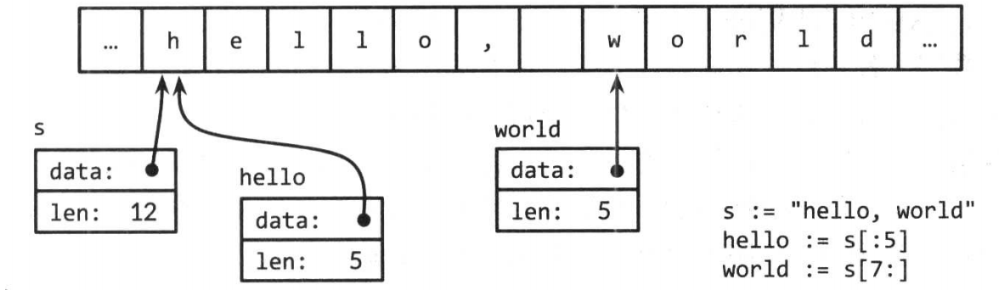
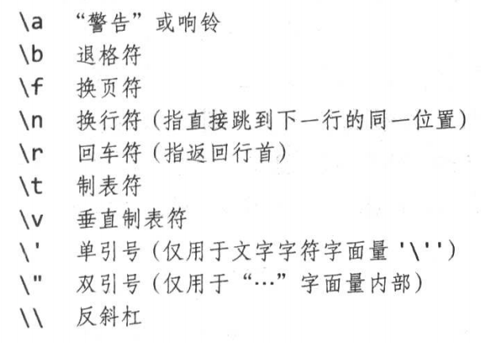
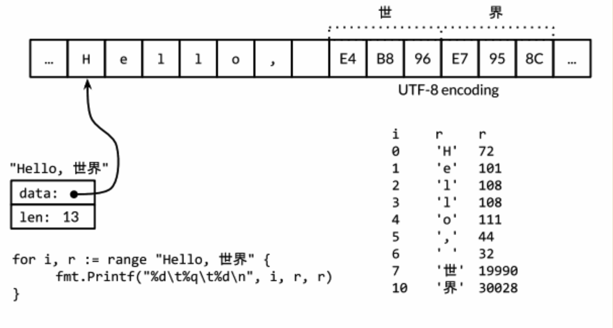

Go 语言是一种**静态类型**的编程语言。这意味着，编译器需要==在编译时==知晓程序里每个值的类型。如果提前知道类型信息，**编译器**就可以确保程序**合理地使用值**。这有助于减少潜在的内存溢出和 bug，并且使编译器有机会对代码进行一些性能优化，提高执行效率。

虽然**从底层而言**，所有的数据都是由**比特**组成，但**计算机一般操作的是固定大小的数**，如整数、浮点数、比特数组、内存地址等。进一步将这些数组织在一起，就可以表达更多的对象，例如数据包、像素点、诗歌，甚至其他任何对象。Go 语言提供了丰富的**数据组织形式**，这依赖于 Go 语言内置的数据结构。这些内置的数据类型，兼顾了硬件的特性和表达复杂数据结构的便捷性。

值的类型==给编译器提供两部分信息==：其一、需要分配多少内存给这个值（值的规模）；其二、这段内存表示什么。**对于许多内置类型的情况来说，规模和表示是类型名的一部分**。int64 类型的值需要 8 个字节（64位），表示一个整数值；float32 类型的值需要 4 个字节（32 位），表示一个 IEEE-754 定义的二进制浮点数；**bool 类型的值需要 1 个字节（8位）**，表示布尔值 true 和 false。

有些类型的内部表示**与编译代码的机器的体系结构有关**。例如，根据编译所在的机器的体系结构，一个 `int` 值的大小可能是 8 字节（64位），也可能是 4 字节（32）位。还有一些**与体系结构相关的类型**，如 Go 里的**所有引用类型**。好在创建和使用这些类型的值的时候，不需要了解这些与体系结构相关信息。但是，如果编译器不知道这些信息，就无法阻止用户做一些**导致程序受阻甚至机器故障的事情**。

Go 的数据类型宽泛，并有多种组织方式，向下匹配硬件特性，向上满足程序员所需，从而可以方便地==表示复杂数据结构==。Go 语言将数据类型分为 4 大类：**基础类型、聚合（复合）类型、引用类型和接口类型**

1. ==基础类型==：**数字、字符串和布尔类型**；
2. ==聚合类型==：**数组、结构体**，通过**组合**各种简单类型得到的更复杂的数据类型；
3. ==引用类型==：**指针、slice、map、func 以及 chan**，都是对程序中一个变量或状态的间接引用。这意味着对任何一个引用类型数据的修改都会影响所有该应用的拷贝；==引用类型和指针的关系是什么？==
4. ==接口类型==。

对于引用类型 slice 有如下疑惑，解释如下程序的运行结果：

~~~go
package main

import "fmt"

func main() {
	slice := []int{1, 2}
	// [1 2] 2 2
	fmt.Println(slice, len(slice), cap(slice))

	test(slice, 3)
	// [1 2]
	fmt.Println(slice)
}

func test(slice []int, value int) {
	slice = append(slice, value)
	// [1 2 3]
	fmt.Println(slice)
}
~~~

以及如何理解「**指针、slice、map、func 以及 chan**，都是对程序中一个变量或状态的间接引用。这意味着对任何一个引用类型数据的修改都会影响所有该应用的拷贝」的含义？其本质涉及到的是：**在函数调用中，形参是 slice 类型时，Go 语言编译器是怎么处理的？执行的是哪种拷贝？**

相反，如果上述程序变更为下述时，能够得到预期结果：

~~~go
package main

import "fmt"

func main() {
	slice := []int{1, 2}
	// [1 2] 2 2
	fmt.Println(slice, len(slice), cap(slice))

	test(&slice, 3)
	// [1 2 3]
	fmt.Println(slice)
}

func test(slice *[]int, value int) {
	*slice = append(*slice, value)
	// [1 2 3]
	fmt.Println(*slice)
}
~~~

Go 的**数值类型**包括了几种不同大小的**整数、浮点数和复数**。各种数值类型分别有自己的大小，对正负号支持也各异。

# 1 整数

Go 语言的**数值类型**包括几种不同大小的**整数、浮点数和复数**。美中数值类型都决定了对应的大小范围和是否支持正负符号。

Go 同时具备**有符号整数**和**无符号整数**，有符号整数分 4 种大小：8 位、16 位、32 位、64 位表示，对应的无符号整数是 int8、int16、int32、int64 表示，对应的无符号整数是 uint8、uint16、uint32、uint64。

此外还有 2 种类型：int 和 uint（对应特定 CPU 平台机器字大小的）。在==特定平台==上，其大小与原生的有符号整数\无符号整数相同，或等于该平台上的运算效率最高的值。int 是目前使用最广泛的数值类型。**这 2 种类型大小相等，都是 32 位或 64 位**，但不能认为它们一定就是 32 位，或一定是 64 位。**即使在同样的硬件平台上，不同的编译器可能选用不同的大小**。

Unicode 字符 **rune 类型**上是 int32 类型的同义词，常常用于指明一个值是 **Unicode 码点**。这两个名称可互换使用。同样，**byte 类型是 uint8 类型的同义词**，强调一个值是原始数据，而不是一个小的整数。

还有一种**无符号整数 uintptr**，没有指定具体的 bit 大小但足以完整**存放指针**。uintptr 类型仅仅用于底层编程，特别是 Go 程序与 C 语言函数库或操作系统的接口相交互的地方。

int、uint 和 uintptr 都有别于其大小明确的相似类型的类型。其中 int 和 int32 也是不同的类型，即使 int 的大小也是 32bit，在需要将 int 当作 int32 类型的地方也需要一个显式的类型转换操作，反之亦然。

有符号整数以补码表示，保留最高位 bit 作为符号位，n 位数字的取值范围是 -2^n-1^ ~ 2^n-1^ - 1。无符号整数由全部位构成其非负值，范围是 0 ~ 2^n^ - 1。

Go 的**二元操作符**涵盖了==算术、逻辑和比较==等**运算**。按优先级的降序排列如下：

~~~go
* / % << >> & &^
+ - | ^
== != < <= > >=
&&
||
~~~

**二元运算符**分五大优先级，同级别的运算符满足左结合律，为求清晰，可能需要元括号，或为使表达式内的运算符按指定次序计算。

**算术运算符** + - * / 可应用于**整数、浮点数和复数**，而取模运算符 % 仅能用于整数间的运算。就 Go 而言，**取模**余数的正负号总是与被除数一致。**除法运算**的行为取决于操作数是否都为整数，比如 `5.0/4.0` 的结果是 1.25，但是 `5/4` 的结果是1，因为整数除法会向着 0 方向截断余数。

不论是有符号数还是无符号数，若表示算术运算结果所需的位超出该类型的范围，就称为==溢出==。溢出的高位部分会无条件地丢弃。如果原始的数值是有符号类型，而且最左边的 bit 位是 1 的话，那么最终结果可能是负的：

~~~go
package main

import "fmt"

func main() {
	fmt.Println("Hello, 世界")

	var value int8 = 127
    // 溢出 -128
	fmt.Println(value + 1)
}
~~~

二元比较运算符用于比较两个类型相同的整数，比较表达式本身的类型是布尔型：

~~~go
==
!=
<
<=
>
>=
~~~

实际上，**全部基本类型的值（布尔值、数值、字符串）**都可以比较，这意味着两个相同类型的值可用 == 和 != 运算符比较。**整数、浮点数和字符串还能根据比较运算符排序**。许多其他类型的值是不可比较的，因此也就可能是不可排序。对于我们遇到的每种类型，我们需要保证规则的一致性！

下列是 Go 语言中的**位运算**，前 4 个对操作数的运算逐位独立进行，不涉及算术进位或正负号：

~~~go
& 与
| 或
^ 异或
&^
<< 左移
>> 右移
~~~

如果作为**二元运算符**，运算符 ^ 表示按位“异或”；若作为**一元前缀运算符**，则它表示按位取反或按位取补，运算结果就是操作数逐位取反。

在移位运算 x << n 和 x >> n 中，操作数 n 决定位移量，而且 n 必须为无符号型；操作数 x 可以是有符号型也可以是无符号型。左移以 0 填补右边空位，无符号整数右移同样以 0 填补左边空位，但**有符号数的右移操作是按符号位的值填补空位**。因此，请注意，如果将整数以位模式处理，须使用无符号整型。

~~~go
package main

import "fmt"

func main() {
	var x uint8 = 1<<1 | 1<<5
	var y uint8 = 1<<1 | 1<<2

	fmt.Printf("%08b\n", x)
	fmt.Printf("%08b\n", y)

	fmt.Printf("%08b\n", x&y)
	fmt.Printf("%08b\n", x|y)
	fmt.Printf("%08b\n", x^y)
	fmt.Printf("%08b\n", x&^y)

	for i := uint(0); i < 8; i++ {
		if x&(1<<i) != 0 {
			fmt.Println(i)
		}
	}

	fmt.Printf("%08b\n", x<<1)
	fmt.Printf("%08b\n", x>>1)
}
~~~

尽管 Go 具备无符号整型数和相关算术运算，也尽管某些量值不可能为负，但是我们往往还采用有符号整型数，如数组的长度。

~~~go
medals := []string{"gold", "silver", "bronze"}
for i := len(medals) - 1; i >= 0; i--{ 
    // len() 函数的返回值是一个 int 类型值
    fmt.Println(medals[i])
}
~~~

但是如果 `len(medals)` 返回的是一个无符号数，那么 i 也将是无符号的 uint 类型，然后条件 `i >= 0` 则永远为真。在三次迭代之后，也就是 `i == 0` 时，`i--` 语句将不会产生 -1，而是变成一个 `uint` 类型的最大值，然后 `medals[i]` 表达式运行时将发生 panic 异常。

因此，无符号整数往往只用于位运算符和特定算术运算符，如实现位集时，解析二进制格式的文件，或散列和加密。==一般而言，无符号整数极少用于表示非负值==。

通常，将某种类型的值转换成另一种，需要**显示转换**。对于算术和逻辑（不含移位）的二元运算符，其操作数的类型必须相同。虽然这有时会导致表达式相对冗长，但是这种做法消除了所有和类型相关的问题，而且也使得程序容易理解。

~~~go
package main

import "fmt"

func main() {
	var apples int32 = 1
	var oranges int16 = 2
    // invalid operation: apples + oranges (mismatched types int32 and int16)
	var compote int = apples + oranges

	fmt.Println(compote)
}
~~~

类型不匹配（+ 的问题）有几种方法改正，最直接地，将全部操作数转换成同一类型：

~~~go
var compote = int(apples) + int(oranges)
~~~

对于每种类型 T，==若允许转换==，操作 T(x) 会将 x 的值转换成类型 T。**很多整型-整型转换不会引起值的变化，仅告知编译器应如何解读该值**。不过，缩减大小的整型转换，以及整型与浮点型的相互转换，可能改变值或损失精度：

~~~go
package main

import "fmt"

func main() {
	f := 3.141
	i := int(f)
	fmt.Println(f, i) // 3.141 3

	f = 1.99

	fmt.Println(int(f)) // 1
}
~~~

浮点型转成整型数值，会舍弃小数部分，==趋零截尾==（正值向下取整，负值向上取整）。如果有些转换的操作数的值超出了目标类型的取值范围，就应当避免这种转换，因为其行为依赖具体实现：

~~~go
package main

import "fmt"

func main() {
	f := 1e100
	i := int(f) // 依赖具体实现啊
	fmt.Println(f, i)
}
~~~

任何大小的整数字面值都能写成常见的**十进制数**（一般都是十进制）；也能写成**八进制数**，以 0 开头，如 0666；还能写成**十六进制数**，以 0x 或 0X 开头，如 0xdeadbeef。十六进制的数字（或字母）大小写皆可。当前，八进制数似乎仅有一种用途——表示 POSIX 文件访问权限标志；十六进制数字则更强调数字值的 bit 位模式。

~~~go
package main

import "fmt"

func main() {
	o := 0666 // 八进制表示的数值
	fmt.Printf("%d %[1]o %#[1]o\n", o) // 438 666 0666

	x := int64(0xdeadbeef)
	// 3735928559 deadbeef 0xdeadbeef 0XDEADBEEF
	fmt.Printf("%d %[1]x %#[1]x %#[1]X\n", x)

}
~~~

`fmt` 输出格式化有这样的技巧：通常 Printf 的格式化字符串含有多个 % 谓词，这要求提供相同数目的操作数，而 % 后的副词 [1] 告知 Printf **重复使用第一个操作数**。其次，%o、%x 或 %X 之间的副词 # 告知 Printf **输出想要的前缀** 0、0x 或 0X。**`%d`、`%o`、`%x` 分别表示值用十进制、八进制和十六进制显示**。

字符字面值通过一对单引号直接包含对应字符。最简单的例子就是 ASCII 码，如 'a'，但也可以通过转义的数值来表示任意的 Unicode 码点对应的字符：

~~~go
package main

import "fmt"

func main() {
	ascii := 'a'

	unicode := '国'

	newline := '\n'

	fmt.Printf("%d %[1]c %[1]q \n", ascii)
	fmt.Printf("%d %[1]c %[1]q \n", unicode)
	fmt.Printf("%d %[1]q \n", newline)
}
~~~

**用 %c 输出文字符号**，如果希望输出带有单引号则用 %q。

# 2 浮点数

Go 具有两种精度的浮点数 float32 和 float64，其==算术特性==遵从 IEEE 754 浮点数国际标准，该浮点数规范被所有现代的 CPU 支持。

这两个类型的值可**从极细微到超宏大**。math 包给出了浮点值的极限：

~~~go
package main

import (
	"fmt"
	"math"
)

func main() {
	// 3.4028234663852886e+38
	fmt.Println("math.MaxFloat32:", math.MaxFloat32)
	// 1.7976931348623157e+308
	fmt.Println("math.MaxFloat64:", math.MaxFloat64)
}
~~~

**十进制下，float32 的有效数字大约是 6 位，float64 的有效数字大约是 15 位**。绝大多数情况下，应优先选用 float64，因为除非格外小心，否则 float32 的运算会迅速==累积误差==。此外，float32 **能精确表示的正整数范围有限**：

~~~go
package main

import (
	"fmt"
)

func main() {
	var f float32 = 16777216 // 1 << 24
	fmt.Println(f == f+1) // true
}
~~~

因为 float32 的**（精确表示数值的）有效 bit 位只有 23 个**，其他的 bit 位用于指数和符号。当整数大于 23 bit 能表达的范围时，float32 的表示将出现误差。

浮点数的字面值可写成小数，如：

~~~go
const e = 2.71828
const e = 2.
const e = .71818
~~~

小数点前面或后面的数字都可能被省略（例如：.707 或 1.）。非常小或非常大的数字最好使用科学记数法表示，此方法在数量级指数前写字母 e 或 E：

~~~go
package main

import (
	"fmt"
)

func main() {
	const e = 1.
	fmt.Println(e)

	const Avogadro = 6.02214129e23
    // 6.02214129e+23
	fmt.Println(Avogadro)
}
~~~

**浮点值能方便地通过 Printf 的谓词 %g 输出**，该谓词会自动保持足够的精度，并选择最简洁的表示方式，但是对于数据表，%e（有指数）或 %f（无指数）的形式可能更合适。这 3 个谓词都能掌控输出宽度和数值精度。

~~~go
for x := 0; x < 8; x++ {
    // 结果保留 3 位小数
    fmt.Printf("x = %d e^x^ = %8.3f\n", x, math.Exp(float64(x)))
}
~~~

math 包中除了提供大量常用的数学函数之外，还提供了**创建和判断** IEEE 754 标准定义的特殊值：+∞ 和 -∞，它表示超出最大许可值的数及除以零的结果；以及 NaN（not a number）

math.NaN 函数则**返回非数值**。在数字运算中，我们倾向于将 NaN 当作==信号值==，但直接判断具体的计算结果是否为 NaN 可能导致潜在错误，因为与 NaN 的比较总不成立。

~~~go
package main

import (
	"fmt"
	"math"
)

func main() {
	nan := math.NaN()
	// false false false
	fmt.Println(nan == nan, nan < nan, nan > nan)
}

~~~

一个函数的返回值是浮点型且它有可能出错，那么最好单独报错：

~~~go
func compute() (value float64, ok bool){
    if failed{
        return 0, false
    }
    return result, true
}
~~~

上述对于返回浮点数结果失败的情况时，附加了另外的 bool 结果，表示程序是否运行正常。

# 3 复数

Go 提供了两种精度的复数类型：complex64 和 complex128，二者分别对应的是 float32 和 float64 两种浮点数精度。内置的 complex 函数根据给定的实部和虚部创建复数，而内置的 real 函数和 imag 函数则分别提取复数的实部和虚部：

~~~go
package main

import "fmt"

func main() {
	var x complex128 = complex(1, 2)
	var y complex128 = complex(3, 4)
	// (1+2i)
	fmt.Println(x)
	// (3+4i)
	fmt.Println(y)
	// (-5+10i)
	fmt.Println(x * y)
	// -5
	fmt.Println(real(x * y))
	// -10
	fmt.Println(imag(x * y))
}
~~~

源码中，如果在浮点数或十进制整数后面紧接着写字母 i，如 3.141592i 或 2i，它就变成了一个虚数，表示一个实部为 0 的复数。

根据常量运算规则，复数常量可以和其他常量相加（整型或浮点型，实数和虚数皆可）：

~~~go
package main

import "fmt"

func main() {
	var x = 1.0
	var y = 2
    // invalid operation: x + y (mismatched types float64 and int)
	fmt.Println(x + y)
}
~~~

但是对于常量则能运算：

~~~go
package main

import "fmt"

func main() {
	const x = 1.0
	const y = 2
	fmt.Println(x + y) // 3
}
~~~

再比如关于复数常量的计算：

~~~go
package main

import "fmt"

func main() {
	const x complex128 = 1 + 2i
	const y = 2
	fmt.Println(x +y)
}
~~~

可以用 == 或 != 判断复数是否等值。若两个复数的实部和虚部都想的能，则它们相等。

# 4 布尔值

bool 型的值或布尔值只有两种可能：true 和 false。

布尔值可以由运算符 && 以及 || 组合运算，这可能引起==短路行为==：如果运算符左边的操作数已经能直接确定总体结果，则右边的操作数不会计算在内。比如：

~~~go
s != "" && s[0] == 'x' // 表达式是安全的！
~~~

其中，如果作用于空字符串，`s[0]` 会触发**宕机异常**。

==&& 较 || 优先级更高==，前者表示**逻辑乘法**，后者表示**逻辑加法**。因此，下述逻辑判断表达式无须加括号：

~~~go
if 'a' <= c && c <= 'z' || 'A' <= c && c <= 'Z' || '0' <= c && c <= '9' {
    // ASCII 字母或数字
}
~~~

==布尔值无法隐式转换成数值==（如 0 或 1），反之也不行。假设转换操作常常用到，就值得专门为此写个函数：

~~~go
package main

import "fmt"

func main() {
	fmt.Println(btoi(true))
	fmt.Println(itob(0))
}

// bool 转化为 int
func btoi(b bool) int {
	if b {
		return 1
	}

	return 0
}

// int 转化为 bool
func itob(i int) bool {
	return i != 0
}
~~~

# 5 字符串

一个字符串是一个==不可改变的字节序列==。字符串可以包含任意的数据，包括 byte 值是 0，但是通常是用来表示人类可读的文本。习惯上，文本字符串被解读成**按 UTF-8 编码的 Unicode 码点（rune 文字符号）序列**。

内置的 `len` 函数==返回字符串的字节数（并非 rune 字符数目）==，下标访问操作 `s[i]` 则取得第 `i` 个字符，其中 `0 <= i < len(s)`。

~~~go
package main

import "fmt"

func main() {
	var tmp = "中国"
	fmt.Println(len(tmp)) // 6

	s := "hello china!"
	fmt.Println(len(s)) // 12

	fmt.Printf("%c, %c", s[4], s[11]) // o, !
}
~~~

如果试图访问许可范围以外的字节会触发**宕机异常**！比如上述 `s[len(s)]`。

字符串的第 `i` 个字节不一定就是第 `i` 个字符，因为**非 ASCII 字符的 UTF-8 码点**需要两个字节或多个字节。比如上述的「中国」，每一个字符就需要 3 个字节表示。

子串生成操作 `s[i:j]` ==产生一个新字符串==，内容取自**原字符串的字节**，下标从 `i` 开始，直到 j（并不包含 j 本身）。结果的大小是 `j - i` 个字节。操作数 `i` 与 `j` 的默认值分别是 0 和 `len(s)`，若省略 `i` 或 j，或两者，则取默认值。

~~~go
package main

import "fmt"

func main() {
	s := "hello china!"
	fmt.Println(len(s)) // 12

	fmt.Printf("%c, %c \n", s[4], s[11]) // o, !
	fmt.Println(s[0:5]) // hello
	fmt.Println(s[:]) // hello china!
}
~~~

==加号（+）运算符==连接两个字符串而==生成一个新字符串==：和 Java 字符串连接类似。字符串可以通过比较运算符做比较，如 == 和 <。**比较通过逐个字节比较完成的**，因此比较的结果是字符串自然编码的顺序。

字符串的值是不可变的：一个字符串包含的字节序列永远不会被改变，当然我们也可以给一个字符串变量分配一个新字符串值。要在一个字符串后面添加另一个字符串，可以这样编写代码：

~~~go
package main

import "fmt"

func main() {
	s := "left foot"
	t := s
	s += ", right foot"

	// left foot, right foot left foot
	fmt.Println(s, t)
}
~~~

这并不改变 s 原有的字符串值，只是将 += 语句生成的新字符串赋予 s。同时，t 仍然持有旧的字符串值。因为字符串不可改变，所以字符串内部的数据不允许修改：

~~~go
package main

import "fmt"

func main() {
	s := "left foot"
	t := s
	s += ", right foot"

	// left foot, right foot left foot
	fmt.Println(s, t)
	// cannot assign to s[0]
	s[0] = 'L'
}
~~~

出现编译错误，`s[0]` 无法赋值！

不可变意味着两个字符串能**安全地共用同一段底层内存**，使得复制任何长度字符串的开销都低廉。类似的，字符串 s 及其子串可以安全地共享相同的内存，因此字符串切片操作代价也是低廉的。这两种情况下**都没有分配新内存**。

下图是**一个字符串和两个子串共享相同的底层数据**：

字符串的值可以直接写成字符串字面量，形式上就是带==双引号==的字符序列：`"Hello, World"`。因为 Go 的源文件总是按 UTF-8 编码，并且习惯上 Go 的字符串会按 UTF-8 解读，所以在源码中我们可以将 **Unicode 码点**写入字符串字面量中。

在带==双引号==的字符串字面量中，可以用==以反斜杠开始的转义序列==插入任意的数据。下面是一组转义符，表示 ASCII 控制码，如换行符、回车符和制表符：

可以通过**十六进制或八进制转义**在字符串字面量中**包含任意的字节**。一个十六进制的转义形式是 `\xhh`，其中两个 h 表示十六进制数字。一个八进制转义形式是 `\ooo`，包含三个八进制的 o 数字（0到7），但是不能超过 `\377`（对应一个字节的范围，十进制为 255）。**每一个单一的字节表达一个特定的值**。

~~~go
package main

import "fmt"

func main() {
	var value = "\x48\x45\x4C\x4C\x4F"
    // HELLO
	fmt.Println(value)
}
~~~

==原生的字符串字面量==的书写形式是 '...'，使用反引号而不是双引号。在原生的字符串字面值中，没有转义操作；全部的内容都是字面的意思，包含退格和换行，因此一个程序中的原生字符串面值可能跨越多行。在原生字符串字面值内部是无法直接写 反引号 字符的，可以用八进制或十六进制转义或 + “`”连接字符串常量完成。唯一的特殊处理是会删除回车以保证在所有平台上的值是一样的，包括那些把回车也放入文本文件的系统（Windows 系统会把回车和换行一起放入文本文件中）。

原生字符串字面值用于编写正则表达式会很方便，因为正则表达式往往会包含很多反斜杠。原生字符串字面值同时被广泛应用于 HTML 模板、JSON 面值、命令行提示信息以及那些需要扩展到多行的场景：

~~~go
const GoUsage = `Go is a tool for managing Go source code.

Usage:
	go command [arguments]

`
~~~

早前世界还是比较简单的（需要处理、兼容的信息不是那么丰富多彩），软件只须处理一个字符集：**ASCII（美国信息交换标准码）**。该标准码使用 7 位表示 128 个“字符”：**大小写英文字母、数字、各种标点和设备控制符**。这对早起的计算机行业已经足够了，但是让世界上众多使用其他语言的人无法在计算机上使用自己的==符号系统==。随着互联网的发展，混合多种语言的数据变得很常见。那问题来了：到底怎样才能应付语言的繁杂多样，还能兼顾高效率？——Unicode，囊括了世界上所有符号系统的全部字符，还有重音符和其他变音符，控制码以及许多特有文字，对它们各自赋予一个叫 **Unicode 码点**的标准数字。**在 Go 的术语中，Unicode 码点是 rune 整数类型**。

Unicode 第 8 版定义了超过一百种语言文字的 12 万个字符的码点。int32 天然适合保存单个文字符号（在计算机中表示），正因为如此，**rune 类型作为 int32 类型的别名**。我们可以将文字符号的序列表示称 int32 值序列，这种表示方法称作：UTF-32，每个 Unicode 码点的编码长度相同，都是 32 位。问题在于：大多数面向计算机的可读文本是 ASCII 码，每个字符只需 8 位，也就是 1 字节，==导致了不必要的存储空间消耗==。

UTF-8 以字节为单位对 Unicode 码点**作变长编码**，是现行的一种 Unicode 标准。每个文字符号用 1 ～ 4 个字节表示，ASCII 字符的编码仅占 1 个字节，而其他常用的文书字符的编码只是 2 或 3 个字节。**一个文字符号编码的首字节的高位指明了后面还有多少字节**。更大的 Unicode 码点也是采用类似的策略处理：

~~~go
0xxxxxxx                             runes 0-127    (ASCII)
110xxxxx 10xxxxxx                    128-2047       (values <128 unused)
1110xxxx 10xxxxxx 10xxxxxx           2048-65535     (values <2048 unused)
11110xxx 10xxxxxx 10xxxxxx 10xxxxxx  65536-0x10ffff (other values unused)
~~~

变长的编码无法直接通过索引来访问第 n 个字符，但是 UTF8 编码获得了很多额外的优点。首先 UTF8 编码比较紧凑，完全兼容 ASCII 码，并且可以自动同步：它可以通过向前回溯最多 3 个字节就能确定当前字符编码的开始字节的位置。它也是一个前缀编码，所以当从左向右解码时不会有任何歧义也并不需要向前查看。没有任何字符的编码是其他字符编码的子串，或是其他编码序列的字串，因此搜索一个**字符**时之搜索它的**字节编码序列**即可，不同担心前后的上下文会对搜索结果产生干扰。同时 UTF8 编码的顺序和 Unicode 码点的顺序一致，由此可以直接排序 UTF8 编码序列。同时因为没有嵌入的 NUL 字节，可以很好地兼容那些使用 NUL 作为字符结尾的编程语言。

Go 的源文件总是以 UTF-8 编码，同时，需要用 Go 程序操作的文本字符串也优先采用 UTF-8 编码。unicode 包具备针对单个文字符号的函数（例如区分字母和数字，转换大小写），而 unicode/utf8 包则提供了按 UTF-8 编码和解码文字符号的函数。

有很多 Unicode 字符很难直接从键盘输入，并且还有很多字符有着相似的结构；有一些是不可见的字符（中文和日文有着很多相似但不同的字）。Go 语言字符串字面值中的 Unicode 转义字符让我们可以**通过 Unicode 码点输入特殊的字符**。有==两种形式==：`\uhhhh` 对应 16bit 的码点值，`\Uhhhhhhhh` 对应 32bit 的码点值，其中 h 是一个十六进制数字；一般很少需要使用 32 bit 的形式。每一个对应码点的 UTF8 编码：

~~~go
package main

import "fmt"

func main() {
	var value = "\xe4\xb8\x96\xe7\x95\x8c"
	fmt.Println(value) // 世界
    
    // "\u4e16\u754c"
	// "\U00004e16\U0000754c"
}
~~~

上面三个转义序列都为第一个字符串提供替代写法，但是它们的值都是相同的。

Unicode 转义也可以使用在 rune 字符中，下面 3 个字符是等价的：

~~~go
'世' '\u4e16' '\U00004e16'
~~~

对于小于 256 的码点值可以写在一个十六进制转义字节中，例如 `\x41` 对应字符 `A`，但是对于更大的码点则必须使用 `\u` 或 `\U` 转义形式。由此， `\xe4\xb8\x96` 并不是一个合法的 rune 字符，虽然这 3 个字节对应一个有效的 UTF8 编码的码点。下面我们具体分析==字符的 Unicode 码和底层字节数组的组成原理==：

~~~go
package main

import "fmt"

func main() {
	s := "麻" // 9EBB --> 麻
	bytes := []byte(s)
	fmt.Printf("% x\n", bytes) // e9 ba bb

	s = "麦驰"
	fmt.Println(s, len(s)) // 麦驰 6

	// Unicode 编码：9EA6 9A70
	bytes = []byte(s)
	fmt.Printf("% x\n", bytes) // e9 ba a6 e9 a9 b0
	bytes[2] = 0xbb

	fmt.Println(string(bytes)) // 麻驰
}
~~~

通过修改 bytes （说明 bytes 和 s 不同，是可修改的），相当于是改变了 Unicode 编码结果。对应的 Unicode 字符也是不同的。

（==根据 UTF8 编码的原理==）每个符号编码后第一个字节的高端 bit 位用于表示编码总共有多少个字节。如果第一个字节的高端 bit 为 0，则表示对应 7 bit 的 ASCII 字符，ASCII 字符每个字符依然是一个字节。如果第一个字节的高端 bit 是 110，则说明需要 2 个字节；后续的每个高端 bit 都以 10 开头。更大的 Unicode 码点也是采用类似的策略处理：

~~~go
0xxxxxxx                             runes 0-127    (ASCII)
110xxxxx 10xxxxxx                    128-2047       (values <128 unused)
1110xxxx 10xxxxxx 10xxxxxx           2048-65535     (values <2048 unused)
11110xxx 10xxxxxx 10xxxxxx 10xxxxxx  65536-0x10ffff (other values unused)
~~~

用 `[]byte` 格式输出结果为：`11101001 10111010 10100110 11101001 10101001 10110000`，这就是『麦驰』的 UTF-8 编码的字节数组内容。单独来看“麦”这个字的编码内容：`11101001 10111010 10100110` 使用 3 个字节进行编码。

那问题来了：为什么对于码点值是 `\u9EA6` 的内容，底层字节数组存储的是 `e9 ba a6`？我们来看看相邻的两个汉字的 Unicode 编码：

1. 麦，对应的编码值是 `\u9EA6`，底层二进制内容为：`11101001 10111010 10100110`
2. 麧，对应的编码值是 `\u9EA7`，底层二进制内容为：`11101001 10111010 10100111`

对于“麦”而言，可以得到如下结论：

* 过程原理和顺序：**==通过底层存储的字节数组的剥离，按照 Unicode 编码的编码原则，解析出 Unicode code point 值==**；
* 使用 3 个字节编码，符合 `1110xxxx 10xxxxxx 10xxxxxx` 模式；
* 根据 UTF-8 的编码规则，也就是 `1110xxxx 10xxxxxx 10xxxxxx` 规则，上述确定的位值是固定的，剩下的 `x` 是需要填充的。**==把这些需要填充的 x “剥离”出来，就得到了 Unicode code point 值==**；
* 对于二进制结果的第一个字节：`11101001`，剩余部分恰好是十六进制 `9` 的二进制表示结果；对于二进制结果的第二和第三个字节：`10111010`，`10100110`，将符合模板的值去除，余下结果为：`1110 1010 0110` 恰好就是和 `EA6` 的二进制相匹配了。

通过上述内容就可以得到 Unicode 字符集中 UTF-8 编码结果和其二进制存储之间的关系（==就说两种的值怎么这么相似==）。

得益于 UTF8 编码优良的设计，诸多字符串操作都不需要解码操作。我们可以不同解码直接测试一个字符串是否是另一个字符串的前缀：

~~~go
func HasPrefix(s, prefix string) bool {
    return len(s) >= len(prefix) && s[:len(prefix)] == prefix
}
~~~

或者是后缀测试：

~~~go
func HasSuffix(s, suffix string) bool {
    return len(s) >= len(suffix) && s[len(s)-len(suffix):] == suffix
}
~~~

或者是包含子串测试：

~~~go
func Contains(s, substr string) bool {
    for i := 0; i < len(s); i++ {
        if HasPrefix(s[i:], substr){
            return true
        }
    }
    return false
}
~~~

对于 UTF8 编码后文本的处理和原始的字节处理逻辑是一样的。但是对应很多其他编码则并不是这样的。（上面的函数都来自 strings 字符串处理包，真实的代码包含了一个用哈希技术优化的 Contains 实现）

另一方面，如果我们真的关心每个 Unicode 字符，我们可以使用其他方式处理。考虑前面的第一个例子中的字符串，它混合了中西两种字符。下图展示了它的内存表示形式：**字符串包含 13 个字节，以 UTF8 形式编码，但是只对应 9 个 Unicode 字符**

~~~go
package main

import (
	"fmt"
	"unicode/utf8"
)

func main() {
	var value = "hello, 世界"
	fmt.Println(value)

	fmt.Println(len(value))                    // 13
	fmt.Println(utf8.RuneCountInString(value)) // 9
}
~~~

为了处理这些真实的字符，我们需要一个 UTF8 解码器。`unicode/utf8` 包提供了该功能，我们可以这样使用：

~~~go
package main

import (
	"fmt"
	"unicode/utf8"
)

func main() {
	var value = "hello, 世界"
	fmt.Println(value)

	fmt.Println(len(value))                    // 13
	fmt.Println(utf8.RuneCountInString(value)) // 9

	for i := 0; i < len(value); {
		r, size := utf8.DecodeRuneInString(value[i:])
		fmt.Printf("%d\t%c\n", i, r)
		i += size
	}
}
~~~

每一次调用 `DecodeRuneInString` 函数都返回一个 r 和长度，r 对应字符本身，长度对应 r 采用 UTF-8 编码后的编码字节数目。长度可以用于更新第 i 个字符在字符串中的字节索引位置。但是这种编码方式是笨拙的，我们需要更简洁的写法。幸运的是，Go 语言的 range 循环在处理字符串的时候，会自动隐式解码 UTF8 字符串。

~~~go
for i, r := range value {
	fmt.Printf("%d\t%q\t%c\n", i, r, r)
}
...
7	'世'	世
10	'界'	界
~~~

我们可以使用一个简单的循环来统计字符串中字符的数目，像这样：

~~~go
n := 0
for _, _ = range s {
    n++
}
~~~

像其他形式的循环那样，我们也可以忽略不需要的变量：

~~~go
n := 0
for range s {
    n++
}
~~~

或者我们可以直接调用 `utf8.RuneCountInString(s)` 函数。

正如我们前面提到的，文本字符串采用 UTF8 编码只是一种惯例，但是对于循环的真正字符串并不是一个惯例，这是正确的。如果用于循环的字符串只是一个普通的二进制字符串，或者是含有错误编码的 UTF8 数据，将会发生什么呢？

每一个 UTF8 字符解码，不管是显式地调用 utf8.DecodeRuneInString 解码或是在 range 循环中隐式地解码，如果遇到一个错误的 UTF8 编码输入，将生成一个特别的 Unicode 字符 `\uFFD`，在印刷中这个字符通常是一个黑色六角或💎形状，里面包含一个白色的问号。当程序遇到这样的一个字符，通常是一个危险信号，说明输入并不是一个完美没有错误的 UTF8 字符串。

UTF8 字符串作为交换格式是非常方便的，但是在程序内部采用 rune 序列可能更方便，因为 rune 大小一致，支持数组索引和方便切割。将 rune[] 类型转换应用到 UTF8 编码的字符串，将返回字符串编码的 Unicode 码点序列：

~~~go
package main

import (
	"fmt"
	"unicode/utf8"
)

func main() {
	s := "プログラム"
    // "e3 83 97 e3 83 ad e3 82 b0 e3 83 a9 e3 83 a0"
	fmt.Printf("% x\n", s) 
	r := []rune(s)
    // [30d7 30ed 30b0 30e9 30e0]
	fmt.Printf("%x\n", r)
}
~~~

如果是将一个 []rune 类型的 Unicode 字符 slice 或数组转为 string，则对它们进行 UTF8 编码：`fmt.Println(string(r))`

将一个整数转型为字符串意思是生成以只包含对应 Unicode 码点字符的 UTF8 字符串：

~~~go
fmt.Println(string(65)) // "A"
fmt.Println(string(0x4eac)) // 京
~~~

如果对应码点的字符是无效的，则用 `\uFFD` 无效字符作为替换：

~~~go
fmt.Println(string(1234567)) // "?"
~~~

4 个标准包对字符串操作特别重要：bytes、strings、strconv 和 unicode：

1. bytes：用于操作字节 slice（和字符串有着相同结构的 []byte 类型）。由于字符串不可变，因此按增量方式构建字符串会导致多次内存分配和复制。这种情况下，使用 bytes.Buffer 类型会更高效；
2. strings：用于搜索、替换、比较、修整、切分与连接字符串
3. strconv：转换布尔值、整数、浮点数为与之对应的字符串形式，或者把字符串转换为布尔值、整数、浮点数，另外还有为字符串添加、去除引号的函数
4. unicode：判别文字符号值特性的函数，每个函数以单个文字符号作为参数，并返回布尔值。每个函数有一个单一的 rune 类型的参数，然后返回一个布尔值。而像 ToUpper 和 ToLower 之类的转换函数将用于 rune 字符的大小写转换。所有的这些函数都是遵循 Unicode 标准定义的字母、数字等分类规范。strings 包也有类似的函数，它们是 ToUper 和 ToLower，将原始字符串的每个字符都做相应的转换，然后返回新的字符串。

下面例子的 basename 函数灵感源于 Unix shell 的同名工具。在我们现实的版本中，basename(s) 将看起来像是系统路径的前缀删除，同时将看似文件类型的后缀名部分删除：

~~~go
fmt.Println(basename("a/b/c.go")) // c
fmt.Println(basename("c.d.go")) // c.d
fmt.Println(basename("abc")) // abc
~~~

第一个版本并没有使用任何库，全部手工硬编码实现：

~~~go
// basename removes directory components and a .suffix.
// e.g., a => a, a.go => a, a/b/c.go => c, a/b.c.go => b.c
func basename(s string) string {
    // Discard last '/' and everything before.
    for i := len(s) - 1; i >= 0; i-- {
        if s[i] == '/' {
            s = s[i+1:]
            break
        }
    }
    // Preserve everything before last '.'.
    for i := len(s) - 1; i >= 0; i-- {
        if s[i] == '.' {
            s = s[:i]
            break
        }
    }
    return s
}
~~~

这个简化版本使用了 strings.LastIndex 库函数：

~~~go
func basename(s string) string {
    slash := strings.LastIndex(s, "/")
    s = s[slash+1:]
    if dot := strings.LastIndex(s, "."); dot >= 0 {
        s = s[:dot]
    }
    return s
}
~~~

path 和 path/filepath 包提供了关于文件路径名更一般的函数操作。使用斜杠分隔路径可以在任何操作系统上工作。斜杠本身不应该用于文件名，但是在其他一些领域可能会用于文件名，例如 URL 路径组件。相比之下，path/filepath 包则使用操作系统本身的路径规则，例如 POSIX 系统使用 /foo/bar，而 Microsoft Windows 使用 `c:\foo\bar` 等。

继续另一个字符串的例子：函数的功能是将一个表示整数值的字符串，每隔三个字符插入一个逗号分隔符，例如“12345”处理后成为“12,345”。这个版本只适用于整数：

~~~go
func comma(s string) string {
    n := len(s)
    if n < 3 {
        return s
    }
    return comma(s[:n-3]) + "," + s[n-3:]
}
~~~

==一个字符串是包含只读字节的数组，一旦创建，是不可变的。相比之下，一个字节 slice 的元素则可以自由地修改==。字符串可以和字节 slice 相互转换：

~~~go
package main

import "fmt"

func main() {

	s := "麦驰"
	fmt.Println(s, len(s)) // 麦驰 6

	bytes := []byte(s)
	fmt.Printf("% x\n", bytes) // e9 ba a6 e9 a9 b0
    
    tmp := "\u9EA6\u9A70"
	fmt.Println(tmp) // // Unicode 编码：9EA6 9A70

	s2 := string(bytes)
	fmt.Println(s2) // 麦驰
}
~~~

若字符串包含一个字节数组，创建后它就无法改变。相反地，**字节 slice 的元素允许随意修改**。

~~~go
package main

import "fmt"

func main() {
	s := "abc"
	b := []byte(s)
	s2 := string(b)
	fmt.Println(s, b, s2)
	
	// 3 8 [98]
	fmt.Println(len(b), cap(b), b[1:2])
}
~~~

从概念上将，一个 []byte(s) 转换是**分配了一个新的字节数组**用于保存字符串数据的**拷贝**，然后引用这个底层的字节数组。编译器的优化可以避免在一些场景下分配和复制字符串数据，但**总的来说需要确保在变量 bytes 被修改的情况下，原始的 s 字符串也不会改变**。将一个字节 slice 转换到字符串的 string(bytes) 操作则是**构造一个字符串拷贝**，以确保 s2 字符串是只读的。

**为了避免转换中不必要的内存分配**，bytes 包和 strings 同时提供了许多实用函数。下面是 strings 包中的六个函数：

~~~go
func Contains(s, substr string) bool
func Count(s, sep string) int
func Fields(s string) []string
func HasPrefix(s, prefix string) bool
func Index(s, sep string) int
func Join(a []string, sep string) string
~~~

bytes 包中也对应的六个函数：

~~~go
func Contains(s, substr []byte) bool
func Count(s, sep []byte) int
func Fields(s []byte) [][]byte
func HasPrefix(s, prefix []byte) bool
func Index(s, sep []byte) int
func Join(a [][]byte, sep []byte) []byte
~~~

它们之间唯一的区别是字符串类型参数被替换成了字节 slice 类型的参数。

bytes 包为高效处理字节 slice 提供了 Buffer 类型。一个 Buffer 开始是空的，但是随着 string、byte 或 []byte 等类型数据的写入可以动态增长。一个 bytes.Buffer 变量并不需要初始化，因为零值也是有效的：

~~~go
// intsToString is like fmt.Sprint(values) but adds commas.
func intsToString(values []int) string {
    var buf bytes.Buffer // 初始值是 nil
    buf.WriteByte('[')
    for i, v := range values {
        if i > 0 {
            buf.WriteString(", ")
        }
        fmt.Fprintf(&bf, "%d", v)
    }
    buf.WriteByte(']')
    return buf.String()
}

func main(){
    fmt.Println(intsToString([]int{1, 2, 3}))
}
~~~

若要在 bytes.Buffer 变量后面添加任意文字符号的 UTF-8 编码，最好使用 bytes.Buffer 的 WriteRune 方法，而==追加 ASCII 字符==，如 '[' 和 ']'，则使用 WriteByte。

除了字符串、文字符号和字节之间的转换，也常常需要相互**转换数值及其字符串表示形式**。要将整数转换成字符串，一种选择是使用 fmt.Sprintf，另一种做法是用函数 strconv.Itoa（integer to ascii）

~~~go
x := 123
y := fmt.Sprintf("%d", x)
fmt.Println(y, strconv.Itoa(x))
~~~

`FormatInt` 和 `FormatUint` 函数可以用不同的进制来格式化数字：

~~~go
fmt.Println(strconv.FormatInt(int64(x), 2)) // 1111011
~~~

fmt.Printf 函数的 %b、%d、%o 和 %x 等参数提供功能往往比 strconv 包的 Format 函数方便很多，特别是在需要包含有附加额外信息的时候：

~~~go
s := fmt.Sprintf("x=%b", x) // x=1111011
~~~

如果要将一个==字符串==解析为整数，可以使用 strconv 包内的 Atoi 函数或 ParseInt 函数，还有用于解析无符号整数的 ParseUint：

~~~go
x, err := strconv.Atoi("123")
y, err := strconv.ParseInt("123", 10, 64)
~~~

ParseInt 函数的第三个参数是用于指定整型数的大小。例如 16 表示 int16，0 表示 int。在任何情况下，返回的结果 y 总是 int64 类型，你可以通过强制类型转换将它转为更小的整数类型。

有时候也会使用 fmt.Scanf 来解析输入的字符串和数字，特别是当字符串和数字混合在一行的时候，它可以灵活处理不完整或不规则的输入。

# 6 常量

==常量是一种表达式==，其可以保证==在编译阶段就计算出表达式的值==，并不需要等到运行时，从而使编译器得以知晓其值。每种常量的潜在类型都属于基本类型：**布尔型、字符串或数字**。

一个常量的声明语句定义了常量的名字，和变量的声明语法类似，常量的值不可修改，这防止了程序运行过程中的意外（或恶意）修改。例如，要表示数学常量，像圆周率，在 Go 程序中用常量比变量更适合，因其值恒定不变：

~~~go
const pi = 3.14159
~~~

和变量声明一样，可以批量声明多个常量。这比较适合声明一组相关的常量：

~~~go
const(
	e = 2.71828...
	pi = 3.14159...
)
~~~

所有针对常量的计算都可以在编译时就完成，以减免运行时的工作量并让其他编译器优化得以实现。某些错误通常要在运行时才能检测到，但如果操作数是常量，编译时就会报错。例如整数除以 0，字符串下标越界，以及任何产生无限大值的浮点数运算。

常量间的所有算术运算、逻辑运算和比较运算的结果依然是常量，对常量的类型转换操作或以下函数调用都是返回常量结果：len/cap/real/imag/complex 和 unsafe.Sizeof。

因为它们的值是在编译期就确定了，由此==常量可以是构成类型的一部分==，例如用于指定数组类型的长度：

~~~go
const IPv4Len = 4
// parseIPv4 parses an IPv4 address
func parseIPv4(s string) IP {
    var p [IPv4Len]byte // 变量 p 的类型是 [IPv4Len]byte 4个字节的数组
}
~~~

一个常量的声明也可以包含一个类型和一个值，但是如果没有显式指明类型，那么将从右边的表达式推断类型。在下面的代码中，time.Duration 是一个命名类型，底层类型是 int64，time.Minute 是对应类型的常量。下面声明的两个常量都是 time.Duration 类型，可以通过 %T 参数打印类型信息：

~~~go
const noDelay time.Duration = 0
const timeout = 5 * time.Minute
fmt.Printf("%T %[1]v\n", noDelay) // time.Duration 0
fmt.Printf("%T %[1]v\n", timeout) // time.Duration 5m0s
fmt.Printf("%T %[1]v\n", time.Minute) // time.Duration 1m0s
~~~

若同时声明一组常量，除了第一项之外，其他项在等号右侧的表达式都可以省略，这意味着会**使用常量的初始化表达式写法**，对应的常量类型也是一样的：

~~~go
const (
	a = 1
    b
    c = 2
    d
)
fmt.Println(a, b, c, d) // 1 1 2 2
~~~

常量的声明可以使用常量生成器 iota，它创建**一系列相关值**，而不是逐个值显式写出。在一个 const 声明语句中，在第一个声明的常量所在的行，iota 从 0 开始取值，逐项加 1：

~~~go
type Weekday int
const (
	Sunday Weekday = iota // 对应 0
    Monday // 对应 1，依此类推
    Tuesday
    Wendesday
    Thursday
    Friday
    Saturday
)
~~~

这种类型通常称为==枚举型==（enum）！

我们也可以在复杂的常量表达式中使用 iota，下面是来自 net 包的例子，用于给一个无符号整数的最低 5bit 的每个 bit 指定一个名字：

~~~go
type Flags uint
const (
	FlagUp Flags = 1 << iota // 2 的 0 次方
    FlagBroadcast // 2 的 1 次方，依此类推
    FlagLoopback
    FlagPointToPoint
    FlagMulticast
)
~~~

随着 iota 的递增，每个常量对应表达式 1 << iota，是连续的 2 的幂，分别对应一个 bit 位置。使用这些常量可以用于测试、设置或清除对应的 bit 位的值：

~~~go
func IsUp(v Flags) bool {
    return v&FlagUp == FlagUp
}

func TurnDown(v *Flags) {
    *v &^ = FlagUp
}

func SetBroadcast(v *Flags) {
    *v |= FlagBroadcast
}

func IsCast(v Flags) bool {
    return v&(FlagBroadcast | FlagMulticast) != 0
}

func main() {
    var v Flags = FlagMulticast | FlagUp
    ...
}
~~~

下面是一个更复杂的例子，每个常量都是 1024 的幂：

~~~go
const (
    _ = 1 << (10 * iota)
    KiB // 1024
    MiB
    GiB
    TiB
    PiB
    EiB
    ZiB
    YiB
)
~~~

不过 iota 常量生成规则也有局限性。例如，它并不能用于产生 1000 的幂，因为 Go 语言并没有计算幂的运算符。

~~~go
package main

import "fmt"

const (
	_ = 3 << (1 * iota)
	A // 6 = 3 * 2
	B // 12 = 3 * 4
)

func main() {
	fmt.Println(A, B)
}
~~~

Go 语言的常量有个不同寻常之处。虽然一个常量可以有任意一个确定的基础类型，如 int 或 float64，或者是类似 time.Duration 这样命名的基本类型，但是**许多常量并不从属某一具体的基础类型**。编译器为这些没有明确基础类型的数字常量提供比基础类型更高精度的算术运算。你可以认为至少有 256bit 的运算精度。

这里有 6 种未明确类型的常量类型：==无类型布尔、无类型整数、无类型文字符号、无类型浮点数、无类型复数、无类型字符串==。

通过延迟明确常量的具体类型，无类型的常量不仅可以提供更高的运算精度，而且可以直接用于更多的表达式而不需要显式的类型转换。例如，例子中的 ZiB 和 YiB 的值已经超出任何 Go 语言中整数类型能表达的范围，但是它们依然是合法的常量，而且像下面的常量表达式依然有效。

~~~go
fmt.Println(YiB/ZiB) // 1024
~~~

对于常量字面值，不同的写法可能会对应不同的类型。0、0.0、0i 和 '\u0000' 全都表示相同的常量值，**但类型相异**，分别是：无类型整数、无类型浮点数、无类型复数和无类型文字符号。类似的，true 和 false 是无类型布尔值，而字符串字面量则是无类型字符串。

前面说过除法运算符 / 会根据操作数的类型生成对应类型的结果。由此，不同写法的常量除法表达式可能对应不同的结果：

~~~go
var f float64 = 212
fmt.Println((f - 32) * 5 / 9) // 100
fmt.Println(5 / 9 *(f - 32)) // 0
fmt.Println(5.0 / 9.0 * (f - 32)) // 100 5.0/9.0 是一个无类型浮点数
~~~

==只有常量才可以是无类型的==。若将无类型常量声明为变量，或在类型明确的变量赋值的右方出现无类型常量，则常量会被隐式转换成该变量的类型，如果转换合法的话。

~~~go
var f float64 = 3 + 0i // untyped complex --> float64
f = 2 // untyped integer --> float64
f = 1e123 // untyped floatint-point --> float64
f = 'a' // untyped rune --> float64
~~~

上面语句相当于都做了一次强制类型转换。不论隐式或显式，常量从一种类型转换成另一种，都要求目标类型能够表示原值。对于浮点数和复数，可能会有舍入处理：

~~~go
const (
	deadbeef = 0xdeadbeef // untyped int with value 3735928559
    a = uint32(deadbeef)
    b = float32(deadbeef)
    c = float64(deadbeef)
    d = int32(deadbeef) // compile error: constant overflows int32
    e = float64(deadbeef)
    f = uint(-1)
)
~~~

对于一个没有显式类型的变量声明（包括简短变量声明），常量的形式将隐式决定变量的默认类型，就像下面的例子：

~~~go
i := 0 // untyped integer; implicit int(0)
r := '\000' // untyped rune
f := 0.0 // untyped floatint-point
c := 0i // untyped complex
~~~

注意有一点不同：**无类型整数常量转换为 int，它的内存大小是不确定的**，但是**无类型浮点数和复数常量则转换为内存大小明确的 float64 和 complex128**。如果不知道浮点数类型的内存大小是很难写出正确的数值算法的，因此 Go 语言不存在整型类似的不确定内存大小的浮点数和复数类型。

如果要给变量一个不同的类型，我们必须显式地将无类型的常量转化为所需的类型，或给声明的变量指定明确的类型，像下面例子这样：

~~~go
var i = int8(0)
var i int8 = 0
~~~

当尝试将这些无类型的常量转为一个接口值时，==这些默认类型将显得尤为重要==，因为要靠它们==明确接口对应的动态类型==。