前面我们讨论了基本数据结构，它们可以用于构建程序中数据的结构，是 Go 语言世界的原子。在接下来的内容中，我们将讨论复合数据类型，它们是**以不同的方式**组合基本类型而构造出来的**复合数据类型**。

很多程序都需要存储和读取集合数据的功能。如果使用数据库或者文件，或者访问网络，总需要一种方法来处理接收和发送的数据。Go 语言有 3 种数据结构可以让用户管理**集合数据**：Array、Slice 和 Map。==这 3 种数据结构是语言核心的一部分，在标准库里被广泛使用==。另外一种特别的**复合数据类型**是：Struct。

数组和结构体都是**聚合类型**，它们的值由内存中的**一组变量**构成：

1. （集合元素的类型）数组的元素具有相同的类型，而结构体中元素的类型可以不同；
2. （集合中元素的个数）Array 和 Struct 的==长度都是固定==的。反之，Slice 和 Map 都是**动态数据结构**，它们的长度在元素添加到结构中时可以==动态增长==。

# 1 Array

一般是先从数组开始，因为 Array 是 Slice 和 Map 的**基础数据结构**。理解了 Array，有助于理解 Slice 和 Map 提供的**优雅和强大功能**。

在 Go 语言中，==数组==是一个**长度固定**的**数据类型**（拥有零个或者多个元素），用于存储**一段**具有**相同类型**的元素的==连续块==。数组存储的类型可以是内置类型，如整型或者字符串，也可以是**某种结构类型**。

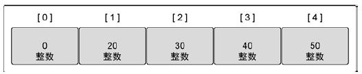

数组是一种非常有用的数据结构，其主要原因在于**占用的内存是连续分配的**。由于内存连续，CPU 能把正在使用的数据缓存更久的时间（有利于 CPU 缓存机制）。数组这种数据结构便于元素的随机访问，**数组的类型信息可以提供每次访问一个元素时需要在内存中移动的距离**。由于数组的长度固定，在 Go 里面**很少直接使用**。Slice 的长度可以增长和缩短，**在很多场合下使用得更多**。

（数组类型的 2 个元素）==声明数组==时需要指定元素的数据类型以及元素的个数，这个数量也就是**数组的长度**。

数组的每个元素可以通过索引下标来访问，索引下标的范围是从 0 开始到数组长度减1的位置。内置的 `len` 函数将返回数组中元素的个数。

~~~go
// 知识点：声明（定义）数组变量
var a [3]int
a[0] = 0
a[1] = 1
a[2] = 2

// 使用字面值初始化定义数组
var array = [3]int{1, 2, 3}

var m [3]int = [3]int{0: 1, 1: 2}

tmp := [3]int{2, 3, 4}

arr := [...]int{3, 4, 5}

// invalid argument: cannot make [3]int; type must be slice, map, or channel
// arr := make([3]int)

fmt.Println(a, array, m, tmp, arr)
~~~

==一旦声明，数组里存储的数据类型和数组长度就都不能改变了==。如果需要存储更多的元素，就需要先创建一个更长的数组，再把原来数组里的值复制到新数组里。

在 Go 语言中声明变量时，总会使用对应类型的零值来对变量进行初始化。数组也不例外，当数组初始化时，**数组内每个元素都初始为对应类型的零值**，对于数字类型来说就是0。

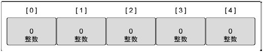

一种**快速创建数组并初始化**的方式是使用==数组字面量==。数组字面量允许声明数组里元素的数量同时指定每个元素的值。这种创建数组并初始化的方式使用的是“短变量声明符” `:=`

~~~go
// 声明数组并初始化，[5]int{10, 20, 30, 40} 是表达式
value := [5]int{10, 20, 30, 40}
fmt.Println(value) // [10 20 30 40 0]
~~~

对于未给定数组元素字面量的，会使用元素类型的默认值初始化。比如上述 value[4] 这个元素的初始值是 0。

~~~go
var array = [...]int{1: 10, 2: 20} // [0 10 20]
fmt.Println(array)
~~~

如果使用 ... 替代数组的长度，Go 语言会根据初始化时数组元素的数量来确定该数组的长度（相当于是默认的）：

~~~go
// 声明数组并初始化
value := [...]int{10, 20, 30, 40}
fmt.Println(value) // [10 20 30 40]
~~~

如果知道数组的长度而且准备给每个值都指定具体值，就可以这样：

~~~go
array := [5]int{1: 10, 2: 20} // [0 10 20 0 0]
fmt.Println(array)
~~~

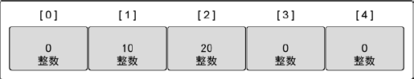

在初始化数组时，也可以指定**一个索引和对应值列表的方式**初始化：

~~~go
type Currency int

const (
	USD Currency = iota
	EUR
	GBP
	RMB
)

symbol := [...]string{USD: "$", EUR: "€", GBP: "￡", RMB: "¥"}
fmt.Println(symbol)
~~~

在这种形式的数组字面值形式中，初始化索引的顺序是无关紧要的，而且没用到的索引可以参略，未指定初始值的元素将用零值初始化。

~~~go
r := [...]int{9: -1}
fmt.Println(r)
~~~

变量声明有 2 种方式：`var` 和 `:=`

~~~go
package main

import "fmt"

func main() {
	var value // syntax error（语法错误）: unexpected newline, expecting type
	value = 1
	fmt.Println(value)
    
    // 声明变量并初始化
    var value1 = 20
	var value2 int = value1
	fmt.Println(value2)
}
~~~

`var` 变量的声明语法，**必须给定类型**！从最简单的变量声明来看：声明了一个 `int` 类型的变量

~~~go
package main

import "fmt"

func main() {
	var value int // 声明变量，同时使用 int 类型的默认值为其初始化
    value := 1.0 // ERROR:no new variables on left side of :=
    
    var value := 1.0 // expected ';', found ':=' (and 1 more errors)
    
	fmt.Println(value)
}
~~~

此外，还有声明变量的简短方式，俗称为：**短变量声明**。上述代码编译出现异常，原因是声明了同名的变量。`var` 和 `:=` 都是用于==变量声明==的。因此，也就不存在 `var value := 1.0` 类似的语句！**对于短变量声明语句来说，左侧的变量至少有一个未被声明的变量**。

下面是几种==出错情况==：`:=` 和 `=` 的区别是什么？同时，与 `var` 的区别？使用场景又是什么？

~~~go
package main

import "fmt"

func main() {
	var value := [5]int // expected ';', found ':='
    var value = [5]int // type [5]int is not an expression
	fmt.Println(value)
}
~~~

上述第一种错误，如同 `int` 变量声明，不存在 `var` 和 `:=` 同时使用的情况。第二种错误：`[5]int` 是**类型**，而不是表达式，不能用于 `=` 赋值表达式中。

`:=` 这种**短变量声明语法**，是更加简短的变量定义和初始化语法。其格式如 **名字 := 表达式**。有如下==使用限制==：

1. 定义变量，同时==显式初始化==；
2. 不能提供数据类型；
3. 只能用在函数内部。

因为内存布局是连续的，所以数组是效率很高的数据结构。在==访问数据==例任意元素的时候，这种高效都是数组的优势。要访问数组里某个单独元素，使用 `[]` 运算符：

~~~go
var value [5]int
for i := 0; i < len(value); i++ {
    value[i] = i * 10
}
fmt.Println(value) // [0 10 20 30 40]

// 知识点：遍历数组元素
fmt.Println(arr[0], arr[1], arr[len(arr)-1])

for i, v := range arr {
	fmt.Printf("arr[%d] = %d\n", i, v)
}

for _, v := range arr {
	fmt.Printf("value: %d\n", v)
}
fmt.Println(len(arr), cap(arr))
~~~

声明一个所有元素都是指针的数组，使用 * 运算符就可以访问元素指针所指向的值：

~~~go
package main

import "fmt"

func main() {
    // new(int) 返回的是 *int 类型值
	value := [5]*int{0: new(int), 1: new(int)}

	*value[0] = 10
	*value[1] = 20

	fmt.Println(value) // [0xc000014090 0xc000014098 <nil>]
	fmt.Println(*value[1]) // 20
}
~~~

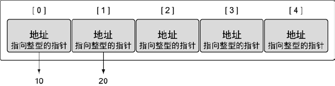

在 Go 语言里，数组是一个值。这意味着数组可以用在赋值操作中。变量名代表整个数组，因此==相同类型的数组值，可以相互赋值==。

~~~go
package main

import "fmt"

func main() {
    // 声明第一个包含 5 个元素的字符串数组
	var value1 [5]string
    // 声明第二个包含 5 个元素的字符串数组，同时用颜色字符串初始化
	var value2 = [5]string{"red", "red", "red", "red", "red"}
	
    // 把 value2 的值复制到 value1
	value1 = value2

	fmt.Println(value1, value2) // [red red red red red] [red red red red red]
}
~~~

==复制==之后，两个数组的值完全一样。上述的赋值操作符的表达式，实际就是数组的复制操作。==数组变量的类型==包括**数组长度**和每个**元素的类型**。只有这两部分都相同的数组，才是类型相同的数组，才能相互赋值。所以，`[3]int` 和 `[4]int` 是两种不同的数组类型。

数组的长度必须是==常量表达式==，也就是说，这个表达式的值**在程序编译时就可以确定**。

~~~go
var value1 [3]string
var value2 = [5]string{"red", "blue", "green", "yellow", "pink"}

// cannot use value2 (type [5]string) as type [3]string in assignment
value1 = value2

fmt.Println(value1, value2)
~~~

上述代码在复制数组值时，出现编译错误：**编译器阻止类型不同的数组相互赋值！**

但是对于 Java 语言中就不会有这样的问题：

~~~java
public static void main(String[] args) {
    int[] value = {1,2,3};
    System.out.println(Arrays.toString(value));

    value = new int[]{2,3,4,5,0};
    System.out.println(Arrays.toString(value));
}
~~~

在 Java 中数组类型中，类型的元素包括 2 个部分：元素类型和数组属性。在给变量 value 赋予另一个数组值时，实际上赋予的是另一个数组的首元素地址，让 value 重新指向了新数组。但是在 Go 中，==数组变量的类型==包括**数组长度**和每个**元素的类型**，类型不同时，是不允许赋值的。

复制指针数组，只会**复制指针的值**，而不会复制指针所指向的值：

~~~go
package main

import "fmt"

func main() {
	value1 := [3]*string{0: new(string), 1: new(string), 2: new(string)}

	*value1[0] = "red"
	*value1[1] = "blue"
	*value1[2] = "green"

	var value2 [3]*string

	value2 = value1
	fmt.Println(value2, *value2[2]) // [0xc0000321f0 0xc000032200 0xc000032210] green
}
~~~

如果一个数组的元素类型是**可比较**的，那么这个数组也是可比较的，这样我们就可以直接使用 `==` 操作符来比较两个数组，比较的结果是两边元素的值是否完全相同。使用 `!=` 来比较两个数组是否不同。

~~~go
package main

import "fmt"

func main() {
	var a = [2]int{1, 2}
	b := [...]int{1, 2}
	c := [2]int{1, 3}
	// true false false
	fmt.Println(a == b, a == c, b == c)

	d := [3]int{1, 2}
	// 编译错误：invalid operation: a == d (mismatched types [2]int and [3]int)
	fmt.Println(a == d)
}
~~~

数组本身只有一个维度，不过可以组合多个数组创建多维数组。==多维数组==很容易管理具有父子关系的数据或者与坐标系相关联的数据。

~~~go
// 声明一个二维整型数组，两个维度分别存储 4 个元素和 2 个元素
var array [4][2]int
// 使用数组字面量来声明并初始化一个二维整型数组
array := [4][2]int{{10, 11}, {20, 31}, {40, 41}, {30, 31}}
// 声明并初始化外层数组中索引为 1  和 3 的元素
array := [4][2]int{1:{20, 21}, 3:{40, 41}} // [[0 0] [20 21] [0 0] [40 41]]
// 声明并初始化外层数组和内层数组的单个元素
array := [4][2]int{1: {0: 20}, 3: {1: 40}} // [[0 0] [20 0] [0 0] [0 40]]
~~~

为了访问单个元素，需要反复组合使用 `[]` 运算符。只要类型一致，就可以将多维数组互相赋值。

~~~go
package main

import "fmt"

func main() {
	var array1 [2][2]int
	var array2 [2][2]int

	array2[0][0] = 10
	array2[0][1] = 20
	array2[1][0] = 30
	array2[1][1] = 40

	array1 = array2

	fmt.Println(array1)
}
~~~

**多维数组的类型**包括每一维度的长度以及最终存储在元素中的数据的类型。

~~~go
package main

import "fmt"

func main() {
	var array2 [2][2]int

	array2[0][0] = 10
	array2[0][1] = 20
	array2[1][0] = 30
	array2[1][1] = 40

    // 将 array2 的索引为 1 的维度赋值到一个同类型的新数组里
	var array3 [2]int = array2[1]

	fmt.Println(array3)
}
~~~

当调用一个函数的时候，函数的每个调用参数将会被赋值给函数内部的参数变量，所以函数参数变量接收的是**一个复制的副本，并不是原始调用的变量**。因为函数参数传递的机制导致传递大的数组类型将是低效的，并且对数组参数的任何的修改都是发生在复制的数组上，并不能直接修改调用时原始的数组变量。在这个方面，Go 语言对待数组的方式和其他很多编程语言不同，其他编程语言可能会隐式地==将数组作为引用或指针对象==传入被调用的函数，比如 Java。

当然，我们可以显式地传入一个数组指针，那样的话函数通过指针对数组的任何修改都可以直接反馈到调用者。下面的函数用于给 `[32]byte` 类型的数组清零：

~~~go
func zero(ptr *[]32byte) {
    for i := range ptr {
        ptr[i] = 0
    }
}
~~~

其实数字字面值 `[32]byte{}` 就可以生成一个 32 字节的数组。而且每个数组的元素都是零值初始化，也就是 0。由此，我们可以将上面的 zero 函数写得更简洁一点：

~~~go
func zero(ptr *[32]byte) {
    *ptr = [32]byte{}
}
~~~

虽然通过指针来传递数组参数是高效的，而且也允许在函数内部修改数组的值，但是数组依然是**僵化的类型**，因为数组的类型包含了**僵化的长度信息**。上面的 zero 函数并不能接收指向 `[16]byte` 类型数组的指针，而且也没有任何添加或删除数组元素的方法。由于这些原因，Array 依然很少用做函数参数；相反，我们一般使用 Slice。

~~~go
fmt.Println("修改前:", array) // [1 2 3]
// 传入的是数组类型
passArrValue(array)
fmt.Println("修改后:", array) // [1 2 3]

func passArrValue(arr [3]int) {
	//（数组内容的拷贝）修改arr内容，并不会对原passArrValue的值造成影响
	fmt.Printf("%T\n", arr[0])
	arr[0] = 0x00
	fmt.Println("passArrValue:", arr) // [0 2 3]
}
~~~

根据内存和性能来看，==在函数间传递数组是一个开销很大的操作==。**在函数之间传递变量时，总是以值的方式传递的**。如果这个变量是一个数组，意味着整个数组，不管多长，都会**完整复制**，并传递给函数。

~~~go
package main

import "fmt"

func main() {
	var a = [5]int{1, 2, 3, 4, 5}
	fun(a)
    // [1 2 3 4 5], [5]int
	fmt.Printf("%d, %T\n", a, a)
}

func fun(tmp [5]int) {
	for index, value := range tmp {
		tmp[index] = value + 1
	}
	// [2 3 4 5 6]
	fmt.Printf("%d\n", tmp)
}
~~~

当调用一个函数的时候，每个传入的参数都会**创建一个副本**，然后赋值给对应的函数变量，所以==函数接受的是一个副本，而不是原始的参数==。如上所示，在函数内部对数组的任何修改都仅影响副本，而不是原始数组。这种情况下，Go 把数组和其他的类型都看成==值传递==。而在其他的语言中，数组是隐式地使用==引用传递==。

> 此时，也反映出了 Array 和 Slice 确实是有区别的！

比如创建一个包含 100 万个 `int` 类型元素的数组。在 64 位架构上，这将需要 800 万字节，也就是 8MB 内存：

~~~go
package main

import (
	"fmt"
)

func main() {
	var array = [1e6]int{1, 2, 3, 4}

	sum := fun(array)
	fmt.Println(sum)
}

//  cannot use array (type [1000000]int) as type []int in argument to fun
// func fun(value []int) int {
func fun(value [1e6]int) int {
	var sum int

	for index := 0; index < len(value); index++ {
		sum += value[index]
	}

	return sum
}
~~~

上述 `fun` 的定义会在编译阶段报错：`cannot use array (type [1000000]int) as type []int in argument to fun` 也就是函数声明的参数类型和实际传递的参数类型不一致（**Array 类型信息包括：元素类型和元素数目**）。

==每次函数被调用时，必须在栈上分配 8MB 的内存==。之后，整个数组的值**被复制**到刚分配的内存里。虽然 Go 语言会自己处理这个复制操作，不过还有一种更好且更有效的方法来处理这个操作：可以==只传入指向数组的指针==

~~~go
package main

import (
	"fmt"
)

func main() {
	var array = [1e6]int{1, 2, 3, 4}
	sum := fun(&array)
	fmt.Println(sum)
}

func fun(value *[1e6]int) int {
	var sum int
	for index := 0; index < len(value); index++ {
		sum += value[index]
	}
	return sum
}
~~~

使用数组指针是高效的，同时允许被调函数修改调用方数组中的元素，但是因为数组长度是固定的，所以数组本身是不可变的。例如上面的 fun 函数不能接受一个 `[16]int` 这样的数组指针，同样，也无法为数组添加或删除元素。由于数组的长度不可变的特性，**除了在特殊的情况下之外，我们很少使用数组**。

# 2 Slice

slice 类似 Java 中的 `ArrayList`，是 Go 语言中的一种**数据结构**！Slice 代表==变长==的序列，序列中每个元素都是==相同的类型==。

Slice 是围绕**动态数组**的概念构建的，可以**按需自动增长和缩小**。切片的**动态增长**是通过内置函数 append 来实现的，这个函数可以快速且高效地增长切片。还可以通过切片再次切片来缩小一个切片的大小。因为**切片的底层内存也是在连续块中分配的**，所以切片还能获得索引、迭代以及垃圾回收优化的好处。

slice 通常写成 []T，其中元素的类型都是 T；==它看上去像没有长度的数组类型==。

==Slice 的底层确实引用了一个数组对象！== 但==底层==具体是怎么实现的呢？

切片是一个很小的==对象==，==对底层数组进行了抽象==，并提供相关的操作方法。切片**有 3 个字段的数据结构**，这些数据结构包括 Go 语言需要操作底层数组的**元数据**。

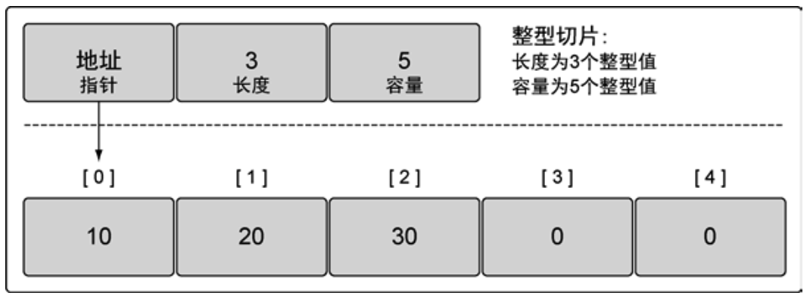

这 3 个字段分别是：底层数组的**指针**、切片访问的元素个数（**长度**）和切片允许增长到的元素个数（**容量**）。

* ==指针==指向底层数组的第一个可以从 slice 中访问的元素，这个元素并不一定是数组的第一个元素；
* ==长度==是指**当前 slice 中的元素个数**，或者是**当前 Slice 能够访问的元素个数**，它不能超过 slice 的容量；
* ==容量==的大小==通常==是从 slice 的起始元素到底层数组的最后一个元素间元素的个数。

是否能提前知道**切片需要的容量**通常会决定要如何创建切片。

（创建切片的方法）==一种创建切片的方法是使用内置的 make 函数==，当使用 make 时，需要传入一个参数，指定切片的长度。创建一个字符串切片，其长度和容量都是 5 个元素：

~~~go
slice := make([]string, 5)

// 创建 slice 时，其语法和数组类似
init := []int{0, 1, 2, 3}
// SIGN slice 底层到底是怎么实现的？
fmt.Printf("init slice:%d, %T\n", init, init)

r := make([]int, 4)
fmt.Printf("init slice:%d, %T\n", r, r)
~~~

如果只指定长度，那么切片的容量和长度相等。也可以分别指定长度和容量：

~~~go
slice := make([]int, 3, 5)
~~~

当然可以使用类似声明数组的方式，比如 `[]int{0:1, 1:2}`，==需要指出的是 `make` 不能用在数组变量上==！

创建一个整型切片，其长度为 3 个元素，容量为 5 个元素。分别指定长度和容量时，创建的切片，底层数组的长度是指定的容量，但是初始化后**并不能访问所有的数组元素**。==额外的元素是留给未来的增长用的==。

上述切片**可以访问 3 个元素**，**而底层数组拥有 5 个元素**。剩余的 2 个元素可以在后期操作中合并到切片，可以通过切片访问这些元素。

多个 Slice 之间可以共享底层的数组数据，并且引用的数组部分区间可能重叠。

~~~go
// [N]T --> []T slice 下述定义的是包含有 13 个元素的数组对象
months := [...]string{
    1: "Jan", 2: "Feb", 3: "Mar", 4: "Apr",
    5: "May", 6: "Jun", 7: "Jul", 8: "Aug",
    9: "Sep", 10: "Oct", 11: "Nov", 12: "December",
    }

fmt.Println(len(months), cap(months))
fmt.Println(months)

// 定义 Slice，其底层的数组内容是 months
slice := months[1:2]
// unneeded: len(months)simplifyslice --> months[1:]
fmt.Println(slice, months[1:len(months)]) // Jan
// 引用超出 cap 的元素，会导致 panic
// slice[2] = "zzz" panic
// 对 slice 进行扩展
fmt.Println(slice[:4]) // [Jan Feb Mar Apr]

// months[:] --> []string 也是 slice 类型
t := months[:]
fmt.Printf("all element:%s, %T\n", t, t)

Q2 := months[4:7]
summer := months[6:9]
fmt.Printf("Q2:%s, len:%d, cap:%d\n", Q2, len(Q2), cap(Q2))
// [Jun Jul Aug]
fmt.Printf("summer:%s, len:%d, cap:%d\n", summer, len(summer), cap(summer))
~~~

`slice := months[1:2]` 作用在数组对象上，用于创建一个 Slice，引用 months 的从第 1 个元素开始到第 (2-1)=1 个元素的子序列。

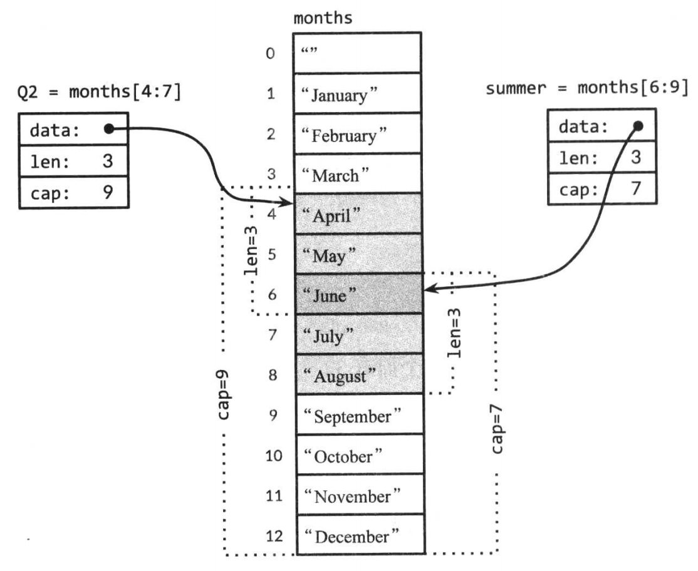

Q2 和 summer 都包含了六月份，下面的代码是一个包含相同月份的测试（性能较低）：

~~~go
for _, s := range summer {
    for _, q := range Q2 {
        if s == q {
            fmt.Printf("%s appears in both\n", s)
        }
    }
}
~~~

如果切片操作超出 cap(s) 的上限将导致一个 panic 异常，但是超出 `len(s)` 则意味着**扩展**了 slice，因为新 slice 的长度会变大：

~~~go
// 对 slice 进行扩展
endlessSummer := summer[:5] // [Jun Jul Aug Sep Oct]
fmt.Println(endlessSummer)
// SIGN 怎么判断 summer 和 endlessSummer 共用底层数据？修改其中的 endlessSummer，看看 summer 是否有改变
endlessSummer[0] = "Err"
fmt.Println("修改后：", endlessSummer) // [Err Jul Aug Sep Oct]
fmt.Println("校验：", summer)         // [Err Jul Aug] 由此证明了：endlessSummer 和 summer 确实共用了底层数组数据
~~~

另外，字符串的切片操作和 `[]byte` 字节类型切片的切片操作是类似的，都是写作 `x[m:n]`，并且都是返回一个原始字节系列的子序列，底层都是共享之前的底层数组，因此这种操作都是常量时间复杂度。`x[m:n]` 切片操作对于字符串则生成一个新字符串，如果 x 是 `[]byte` 的话则生成一个新的 `[]byte`：

~~~go
byt := []byte{0xFF, 0xFE, 0xFD}
fmt.Printf("bytes: % X\n", byt) // FF FE FD
b := byt[1:]
fmt.Printf("bytes: % X\n", b) // FE FD
b[0] = 0x00
fmt.Printf("校验: % X\n", byt) // FF 00 FD 由此证明了 bytes 和 b 共用了底层数组数据

// 字符串的切片操作
s := "hello, world!"
fmt.Println(s, len(s), &s) // hello, world! 13 0xc000032450

// 子字符串操作s[i:j]基于原始的 s 字符串的 [i, j) 生成一个新字符串
sp := s[0:5] // sp 是 string 类型
fmt.Println(sp, len(sp), &sp) // hello 5 0xc000032470 只能说明 s 和 sp 是两个不同的变量
// SIGN 如何判断是否“共享”之前的底层数组数据？
~~~

如果基于这个切片创建新的切片，**新切片会和原有切片共享底层数组**，也能通过后期操作来访问多余容量的元素。

不允许创建容量小于长度的切片：

~~~go
slize := make([]int, 5, 3) // Compiler Error!
~~~

==如果在 [] 运算符里指定了一个值（也就是数组的长度），那么创建的就是数组而不是切片。只有不指定值的时候，才会创建切片==。

~~~go
var slice []int8
fmt.Printf("%T\n", slice) // []int8

tmp := []int8{1,2,3}
fmt.Printf("%T\n", tmp) // []int8

slice = tmp
fmt.Println(slice) // [1 2 3]

array := [3]int8{1, 2, 3}
tmp = array // cannot use array (variable of type [3]int8) as []int8 value in assignment
fmt.Println(array)
~~~

相同类型 `[]int8` 的切片可以直接复制，但对于不同类型则会编译报错：`cannot use tmp (type []int) as type []int8 in assignment`。因此，可以得出这样的结论：**不同类型的切片是以切片元素作为区分的！**

程序有时可能需要声明==一个值为 nil 的切片（也称为 nil 切片）==。**只要在声明时不做任何初始化，就会创建一个 nil 切片**：

~~~go
slice := []int{10, 20, 30}
fmt.Println(slice) // [10 20 30]

var slice1 []int
fmt.Println(len(slice1), slice1) // 0 []

slice2 := make([]int, 0)
fmt.Println(len(slice2), slice2) // 0 []

slice3 := []int{}
fmt.Println(len(slice3), slice3) // 0 []
~~~

slice 类型的零值是 nil。值为 nil 的 slice 没有对应的底层数组。值为 nil 的 slice 长度和容量都是零，但是也有非 nil 的 slice 长度和容量是零，例如 `[]int{}` 或 `make([]int,3)[3:]`。

对于任何类型，如果它们的值可以是 nil，那么这个类型的 nil 值可以使用一种转换表达式，例如 `[]int(nil)`。

~~~go
var s []int // len(s) == 0, s == nil
s = nil     // len(s) == 0, s == nil
s = []int(nil) // len(s) == 0, s == nil
s = []int{} // len(s) == 0, s != nil
~~~

如果想检查一个 slice 是否是空，那么使用 `len(s) == 0`，而不是 `s == nil`，因为 `s != nil` 的情况下，slice 也有可能是空。

**nil 切片和空切片到底有什么区别？使用场景分别是什么？**

* 在需要描述一个不存在的切片时，nil 切片会很好用。**底层数组的指针是 nil**；
* 想要表示空集合时空切片很有用。那空切片底层数组指针是什么？

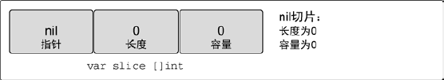

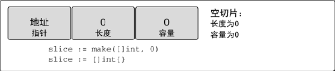

用上述方式示例代码，可得到显而易见的道理：

~~~go
package main

import "fmt"

func main() {
	slice := make([]int, 0)
	var nilSlice []int
	fmt.Println(slice, nilSlice)

	// 0xcea4f8, 0x0 输出得到的是底层数组地址
	fmt.Printf("%p, %p\n", slice, nilSlice)

	// 0xc0000044e0, 0xc0000044c0
	fmt.Printf("%p, %p\n", &slice, &nilSlice)
}
~~~

`slice` 是一个空的切片但不是 `nil`，而 `nilSlice` 是 `nil`。

对切片里某个索引指向的元素赋值和对数组里某个索引指向的元素赋值的方法完全一样。使用 `[]` 操作符就可以改变某个元素的值。

~~~go
package main

import "fmt"

func main() {
	fmt.Println("Hello, 世界")

	slice := []int{10, 20, 30}
	slice[0] = 40
	fmt.Println(slice) // [40 20 30]

	slice3 := []int{}
	slice3[0] = 1 // panic: runtime error: index out of range [0] with length 0
	fmt.Println(len(slice3), slice3) 
}
~~~

切片之所以被称为切片，是因为**创建一个新的切片就是把底层数组切出一部分**。

~~~go
package main

import "fmt"

func main() {
	fmt.Println("Hello, 世界")

	slice := []int{10, 20, 30, 40, 50}
	fmt.Println(slice) // [10 20 30 40 50]

	newSlice := slice[1:3]
	fmt.Println(newSlice) // [20 30]
}
~~~

创建一个新切片，其长度为 2 个长度，容量为 4 个元素。上述 2 个切片==共享一段底层数据==，但**通过不同的切片会看到底层数据的不同部分**。

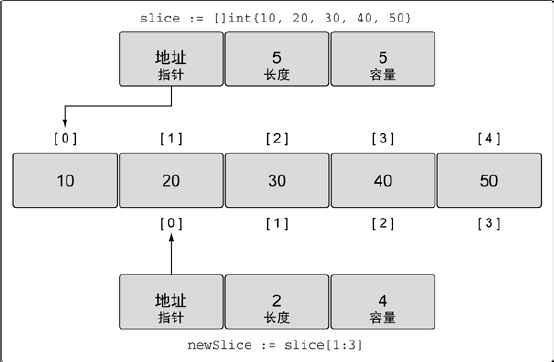

第一个切片 slice 能够看到底层数据全部 5 个元素的容量，不过之后的 `newSlice` 就**看不到**。对于 `newSlice`，底层数组的容量只有 4 个元素。`newSlice` 无法访问到它所指向的底层数组的第一个元素之前的部分。所以，对于 `newSlice` 来说，之前的那些元素就是**不存在的**。

通过下述公式，可以计算出任意切片的长度和容量：对于**底层数组容量是 k 切片**的 `slice[i:j]`，其中 `0 <= i <= j <= k` 有下述属性成立

~~~go
长度：j - i // 长度由 i 和 j 值共同决定
容量：k - i // 容量由 i 决定

// 新切片的起始元素位置索引从 i 开始，终止位置索引为 j - 1。即『包含头而不包含尾』
~~~

slice 操作符 s[i:j] 其中 `0 <= i <= j <= k` 创建了一个新的 slice，这个新的 slice 引用了序列 s 中从 `i` 到 j-1 索引位置的所有元素，这里的 s **既可以是数组或者指向数组的指针**，也可以是 slice。新 slice 的元素个数是 `j - i` 个。如果上面的表达式中省略了 `i`，那么新 slice 的起始索引位置就是 0，也就是 `i = 0`；如果省略了 j，那么新 slice 的结束索引位置是 `len(s) - 1`，即 `j = len(s)`。

==现在两个切片共享同一个底层数组，如果一个切片修改了该底层数组的共享部分，另一个切片也能感知到==。

~~~go
package main

import "fmt"

func main() {
	fmt.Println("Hello, 世界")

	slice := []int{10, 20, 30, 40, 50}
	fmt.Println(slice) // [10 20 30 40 50]

	newSlice := slice[1:3]
	fmt.Println(newSlice) // [20 30]

	newSlice[0] = 60
	fmt.Println(newSlice) // [60 30]

	fmt.Println(slice) // [10 60 30 40 50]
}
~~~

**切片只能访问到其长度内的元素**，试图==访问==超出其长度的元素将会导致语言运行时异常。如果 slice 的引用超过了**被引用对象**的容量，即 cap(s)，那么会导致程序宕机；但是如果 slice 的引用超出了**被引用对象**的长度，即 `len(s)`，那么最终 slice 会比原 slice 长。

~~~go
package main

import "fmt"

func main() {
	tmp := []int8{1, 2, 3, 4, 5}
	fmt.Printf("%T\n", tmp)

	slice := tmp[:1]
	fmt.Println(tmp, slice) // [1, 2, 3, 4, 5] [1]
    
    // 会引发 panic，表明不能通过 slice 的 [] 操作获取超出 length 的元素值
    fmt.Println(slice[1]) // panic: runtime error: index out of range [1] with length 1
    
	// slice 的引用超出了被引用对象的长度，实际上是对 slice 再一次做了切片操作
	fmt.Println(slice[:3])
}
~~~

初始化 slice s 的表达式和初始化数组 a 的表达式的区别：slice 字面量看上去和数组字面量很像，都是用逗号分隔并用花括号括起来的一个元素序列，但是 slice 没有指定长度。这种隐式区别的结果分别是创建由固定长度的数组和创建指向数组的 slice。和数组一样，slice 也按照顺序指定元素，也可以通过索引来指定元素，或者两者结合。

因为 Slice 值包含指向第一个 Slice 元素的指针，因此==向函数传递 Slice 将允许在函数内部修改底层数组的元素==。换句话说，复制一个 Slice 只是对底层的数组创建了一个新的 Slice 别名（==引用==）：

~~~go
fmt.Println("Q2:", Q2) // [Apr May Err]
passSliceValue(Q2)
fmt.Println("Q2 later:", Q2) // [Apr May Jun]
// slice 值包含指向第一个 slice 元素的指针，passSliceValue 允许在函数中修改底层数据

func passSliceValue(slice []string) {
	// slice 传入函数时，对底层的数组创建了一个新的 slice 别名（指针赋值）
	slice[len(slice)-1] = "Jun"
	fmt.Printf("%T\n", slice) // []string --> 是一种 slice 类型
}
~~~

Slice 确实和 Array 是不一样的，Slice 更像是一个具有“引用”属性的对象！

和数组不同的是，slice 无法做比较，因此**不能用 == 来测试两个 slice 是否拥有相同的元素**。标准库里面提供了高度优化的函数 `bytes.Equal` 来比较两个字节 slice。但是对其他类型的 slice，我们必须自己写函数比较：

~~~go
func equal(x, y []string) bool {
    if len(x) != len(y) {
        return false
    }
    
    for i: = range x {
        if x[i] != y[i] {
            return false
        }
    }
    return true
}
~~~

上面关于两个 Slice 的深度相等测试，运行的时间并不比支持 == 操作的数组或字符串更多，但是为何 Slice 不直接支持比较运算符呢？这方面有两个原因。第一个原因，一个 Slice 的元素是间接引用的，一个 Slice 甚至可以包含自身。第二个原因，因为 Slice 的元素是间接引用的，一个固定的 Slice 值（指 Slice 本身的值，不是元素的值）在不同的时刻可能包含不同的元素，因为底层数组的元素可能会被修改。

与切片的**容量**相关联的元素只能**用于增长切片**。在使用这部分元素前，必须将其合并到切片的长度里。切片有额外的容量是很好的，但是如果不能把这些容量合并到切片的长度里，这些容量就没有用处。

相对于数组而言，==使用切片的一个好处是==，可以**按需增加切片的容量**。Go 语言内置的 append 函数会处理增加长度时的所有操作细节。

要使用 append，需要一个被操作的切片和一个要追加的值。当 append 调用返回时，会返回一个包含修改结果的新切片。函数 append ==总是==会增加新切片的长度，而容量==可能==会改变，取决于**被操作的切片的可用容量**。

内置的 `apend` 函数用于向 Slice 追加元素：

~~~go
var runes []rune
for _, r := range "Hello, 世界" {
    runes = append(runes, r)
}
fmt.Printf("%q\n", runes)
~~~

在循环中使用 append 函数构建一个由 9 个 rune 字符构成的 Slice，当然对应这个特俗的问题，我们通过 Go 语言内置的 `[]rune("Hello, 世界")` 转换操作完成。

`append` 函数对于理解 Slice 底层是如何工作的非常重要，所以让我们仔细查看究竟是发生了什么：

~~~go
package main

import "fmt"

func main() {
	slice := []int{1, 2, 3}
	fmt.Println(slice, len(slice), cap(slice)) // [1 2 3] 3 3

	appendInt(slice, 4)
}

func appendInt(x []int, y int) []int {
	var z []int
	zlen := len(x) + 1
	if zlen <= cap(x) {
		z = x[:zlen]
	} else {
		zcap := zlen
		if zcap < 2*len(x) {
			zcap = 2 * len(x)
		}
		z = make([]int, zlen, zcap)
		copy(z, x)

		x[0] = 0

        // 下述代码说明的是：通过扩容，z 和 x 是不共享底层数组数据的
		fmt.Println(x, len(x), cap(x)) // [0 2 3] 3 3
		fmt.Println(z, len(z), cap(z)) // [1 2 3 0] 4 6
	}
	z[len(x)] = y
	return z
}
~~~

每次调用 `appendInt` 函数，必须显检测 slice 底层数组是否有足够的容量来保存新添加的元素。如果有足够空间的话，直接扩展 slice（依然在原有的底层数组之上），将新添加的 y 元素复制到新扩展的空间，并返回 slice。由此，==输入的 x 和输出的 z 共享相同的底层数组==。

如果没有足够的增长空间的话，`appendInt` 函数则会先分配一个足够大的 slice 用于保存新的结果，先将输入的 x 复制到新的空间，然后添加 y 元素。==结果 z 和输入的 x 引用的将是不同的底层数组==。

虽然通过循环复制元素更直接，不过==内置的 copy 函数==可以方便地将一个 slice 复制到了一个相同类型的 slice。copy 函数的第一个参数是要复制的目标 slice，第二个参数是源 slice，目标和源的位置顺序和 `dst = src` 赋值语句是一致的。两个 slice 可以共享同一个底层数组，甚至有重叠也没有关系。copy 函数将返回成功复制的元素的个数，等于两个 slice 中较小的长度，所以我们不同担心覆盖会超出目标 slice 的范围。

内置的 append 函数可能使用比 `appendInt` 更复杂的内存扩展策略。由此，通常我们并不知道 append 调用是否导致了内存的重新分配，由此我们也不能确认新的 slice 和原始的 slice 是否引用的是相同的底层数组空间。同样，我们不能确认在原先的 slice 上的操作是否会影响到新的 slice。由此，通常是将 append 返回的结果直接赋值给输入的 slice 变量。

~~~go
runes = append(runes, r)
~~~

更新 slice 变量不仅对调用 append 函数是必要的，实际上对应任何可能导致长度、容量或底层数组变化的操作都是必要的。要正确地使用 slice，需要记住尽管底层数组的元素是间接访问的，但是 slice 对应结构体本身的指针、长度和容量部分是直接访问的。slice 实际上是一个类似下面结构体的聚合类型：

~~~go
type IntSlice struct {
    ptr      *int
    len, cap int
}
~~~

我们的 `appendInt` 函数每次只能向 slice 追加一个元素，但是内置的 append 函数则可以追加多个元素，甚至追加一个 slice：

~~~go
var x []int
x = append(x, 1)
x = append(x, 2, 3)
x = append(x, x...) // append the slice x
~~~

比如下面的使用：

~~~go
package main

import "fmt"

func main() {
	fmt.Println("Hello, 世界")

	slice := []int{10, 20, 30, 40, 50}
	fmt.Println(slice) // [10 20 30 40 50]

	newSlice := slice[1:3]
	fmt.Println(newSlice) // [20 30]

	newSlice = append(newSlice, 60)
	fmt.Println(newSlice) // [20 30 60]
	
	fmt.Println(slice) // [10 20 30 60 50]
}
~~~

`newSlice` 在底层数组里还有额外的容量可用，append 操作将可用的元素合并到切片的长度，并对其进行赋值。

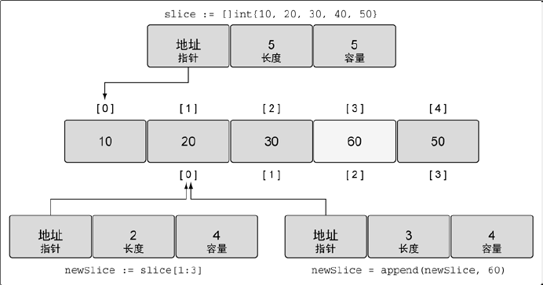

如果切片的底层数组**没有足够的可用容量**，append 函数会==创建一个新的底层数据==，将被引用的现有的值复制到新数组里，再追加新的值。

~~~go
package main

import "fmt"

func main() {
	slice := []int{10, 20, 30, 40}
	fmt.Println(slice) // [10 20 30 40]

	newSlice := append(slice, 50)
	fmt.Println(newSlice) // [10 20 30 40 50]

	slice[0] = 0
	fmt.Println(slice) // [0 20 30 40]
	fmt.Println(newSlice) // [10 20 30 40 50]
    
    // newSlice length:5, capacity:8 
	fmt.Println(len(newSlice), cap(newSlice))

	fmt.Println(slice) // [10 20 30 40]
    // slice length:4, capacity:4 
    fmt.Printf("slice length:%d, capacity:%d \n", len(slice), cap(slice))
}
~~~

当这个 append 操作完成后，`newSlice` 拥有一个全新的底层数组，这个数组的容量是原来的 2 倍。上述的 slice 和 `newSlice` 已经==不共用底层数组数据==了。

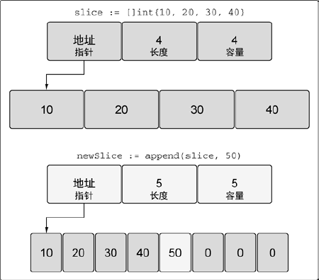

函数 append 会智能地处理底层数组的**容量增长**。随着语言的演化，这种增长算法可能会有所改变。

在创建切片时，还可以使用**第三个索引选项**。第三个索引可以用来**控制新切片的容量**。其目的并不是要增加容量，而是要限制容量。可以看到，允许限制新切片的容量为底层数组提供了一定的保护，可以更好地控制追加操作。

~~~go
package main

import "fmt"

func main() {
	source := []string{"Apple", "Orange", "Plum", "Banana", "Grape"}

	slice := source[2:3:4]
	fmt.Printf("slice len:%d, cap:%d, %s\n", len(slice), cap(slice), slice)
}
~~~

将第三个元素切片，并限制容量。其长度为 1 个元素，容量为 2 个元素。

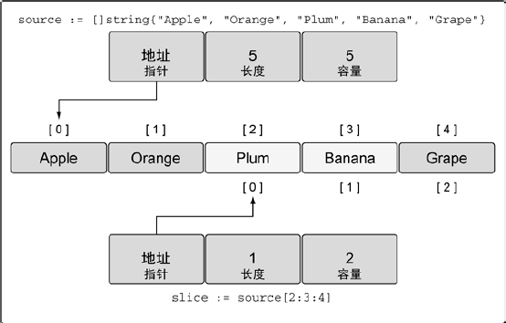

对于 slice[i:j:k] 其长度和容量

~~~go
长度：j - i
容量：k - i
~~~

如果试图设置的容量比可用的容量还大，就会得到一个语言运行时的错误：

~~~go
package main

import "fmt"

func main() {
	source := []string{"Apple", "Orange", "Plum", "Banana", "Grape"}

	slice := source[2:3:4]
	fmt.Printf("slice len:%d, cap:%d, %s\n", len(slice), cap(slice), slice)

	// slice bounds out of range [::6] with capacity 5
	newSlice := source[2:3:6]
	fmt.Printf("len:%d, cap:%d, %s\n", len(newSlice), cap(newSlice), newSlice)
}
~~~

内置函数 append 会首先使用可用容量，**一旦没有可用容量，会分配一个新的底层数组**。比如下述 `newSlice`

~~~go
package main

import "fmt"

func main() {
	slice := []int{10, 20, 30, 40}
	fmt.Println(slice)        // [10 20 30 40]
	fmt.Printf("%p\n", slice) // xc000018120

	newSlice := append(slice, 50)
	fmt.Println(newSlice)        // [10 20 30 40 50]
	fmt.Printf("%p\n", newSlice) // xc00001e040
    
    // 实际上说的是，append 后 newSlice 和 slice 不共享底层数组数据
    slice[0] = 0
	fmt.Println(newSlice) // [0 10 20 30 40 50] 

	lowSlice := slice[:2]
	fmt.Println(lowSlice)        // [10 20 30 40 50]
	fmt.Printf("%p\n", lowSlice) // xc000018120

	fmt.Println(len(newSlice), cap(newSlice))
}
~~~

在 slice 没有可用容量时，append 会分配一个新的底层数组，其==底层数组指针发生了改变==！

> 通过上面的代码，其实已经证明了 slice 对应输出的 %p 就是底层数组的内存地址。

上述这种情况很容易忘记切片间正在共享同一个底层数组，一旦发生这种情况，对切片进行修改，很可能会导致随机且奇怪的问题。对切片内容的修改会影响多个切片，却很难找到问题的原因。

如果在创建切片时设置切片的容量和长度一样。就可以强制让新切片的第一个 append 操作创建新的底层数组，==与原有的底层数组分离==。新切片与原有的底层数组分离后，**可以安全地进行后续修改**。

~~~go
package main

import "fmt"

func main() {
	source := []string{"Apple", "Orange", "Plum", "Banana", "Grape"}
	fmt.Printf("source: %p\n", source) // source: 0xc000040050
	slice := source[2:3:3]
	fmt.Printf("slice: %p\n", slice) // slice: 0xc000040070
	
	slice = append(slice, "Kiwi")
	fmt.Printf("slice: %p\n", slice) // slice: 0xc000004500
}
~~~

如果不加第三个索引，由于剩余的所有容量都属于 slice，向 slice 追加会改变原有底层数组的内容。加上第三个索引后，新的 slice 拥有了自己的底层数组，所以杜绝了可能发生的问题，也保持了为切片申请新的底层数组的简洁。

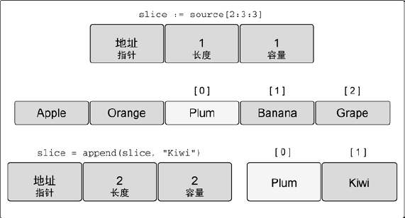

内置函数 append 也是一个可变参数的函数，意味着可以在一次调用传递多个追加的值。如果使用 `...` 运算符，可以将一个切片的所有元素追加到另一个切片里：

~~~go
package main

import "fmt"

func main() {
	slice1 := []int{1, 2}
	fmt.Printf("slice1:%p\n", slice1) // slice1:0xc000014090
	slice2 := []int{3, 4}
	fmt.Printf("slice2:%p\n", slice2) // slice2:0xc0000140c0

	slice3 := append(slice1, slice2...)
	fmt.Printf("%v, %p\n", slice3, slice3) // [1 2 3 4], 0xc00000a3c0
}
~~~

==既然切片是一个集合，那么就可以迭代其中的元素==。Go 语言有个特殊的关键字 range，它可以配合关键字 for 来迭代切片里的元素：

~~~go
package main

import "fmt"

func main() {
	slice := []int{1, 2, 3, 4}

	for index, value := range slice {
		fmt.Printf("Index: %d Value: %d \n", index, value)
	}
}
~~~

当迭代切片时，关键字 range 会返回两个值：当前索引位置和该位置对应元素值的==一份副本==。

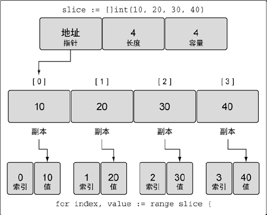

~~~go
package main

import "fmt"

func main() {
	slice := []int{1, 2, 3, 4}

	for index, value := range slice {
		fmt.Printf("Index: %d Value: %d \n", index, value)
		value = 1
		// Value: 1 Value-Addr: C000014090 ElemAddr: C00000A3A0
		fmt.Printf("Value: %d Value-Addr: %X ElemAddr: %X\n", 
                   value, &value, &slice[index])
	}

	fmt.Println(slice) // [1 2 3 4]
}
~~~

range 创建了每个元素的副本，而**不是直接返回对该元素的引用**！

关键字 range 总是会**从切片头部开始迭代**。如果想对迭代做更多控制，依旧可以使用传统 for 循环。

内置函数 `len` 和 `cap`，可以用于处理数组、切片和通道。 和数组一样，切片是一维的，可以**组合多个切片**形成多维切片。下述定义了一个包含两个元素的外层切片，**每个元素包含一个内层的整型切片**：

~~~go
slice := [][]int{{10}, {100, 200}}
~~~

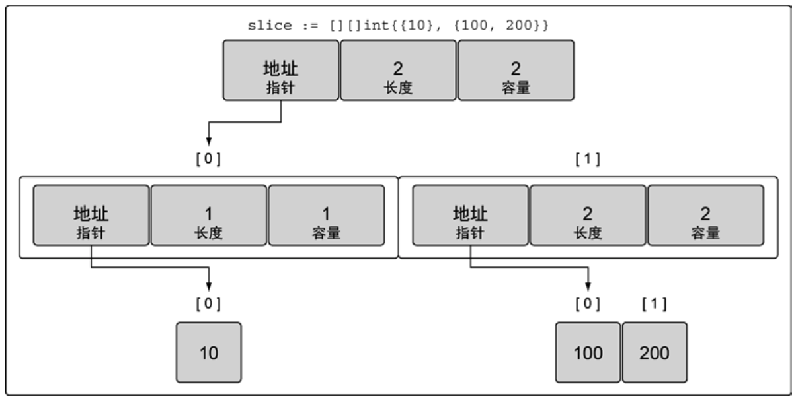

外层的切片包含 2 个元素，每个元素都是一个切片。第一个元素中的切片使用单个整数来初始化，第二个元素中的切片包括两个整数。

~~~go
package main

import "fmt"

func main() {
	fmt.Println("Hello, 世界")

	slice := [][]int{{10}, {100, 200}}
	fmt.Println(len(slice), cap(slice))

	fmt.Println(len(slice[0]), cap(slice[0]))
	fmt.Printf("%p\n", slice[0]) // 0xc000016090
	fmt.Println(len(slice[1]), cap(slice[1]))

	slice[0] = append(slice[0], 20)
	fmt.Println(len(slice[0]), cap(slice[0]))
	fmt.Printf("%p\n", slice[0]) // 0xc0000160b0
}
~~~

使用 append 函数处理追加的方式很简明：先增长切片，再将新的整型切片赋值给外层切片的第一个元素。

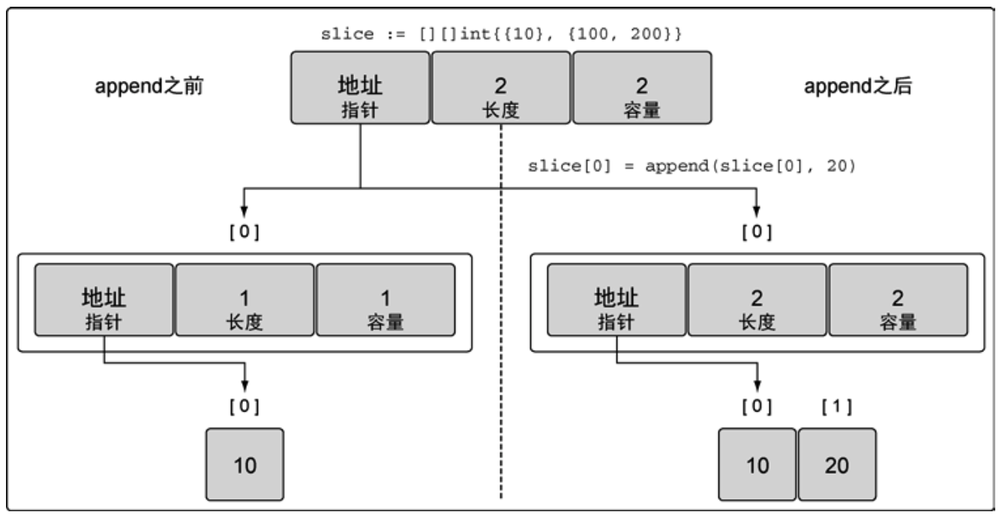

注意**求字符串子串操作和对字节 slice （[]byte） 做 slice 操作**这两者的相似性。它们都写作 `x[m:n]`，并且都返回原始字节的一个子序列，同时它们的底层引用方式也是相同的，所以，这两个操作都消耗常量时间。区别在于：如果 x 是字符串，那么 `x[m:n]` 返回的是一个字符串；如果是切片，返回的是字节 slice。

**在函数间传递切片就是要在函数间以值的方式传递切片**。由于切片的尺寸很小，在函数间复制和传递切片成本也很低。

~~~go
package main

import "fmt"

func main() {
	fmt.Println("Hello, 世界")

	slice := make([]int, 1e6)
	fmt.Printf("%p, %d\n", slice, slice)
	slice = foo(slice)
	fmt.Printf("%p, %d\n", slice, slice)
}

func foo(slice []int) []int {
	return append(slice, 9)
}
~~~

因为 slice 包含了指向数组元素的指针，所以将一个 slice 传递给函数的时候，可以在函数内部修改底层数组的元素。换言之，创建一个数组的 slice 等于为数组创建了一个==别名==。

~~~go
package main

import "fmt"

func main() {
	a := [...]int{0, 1, 2, 3, 4, 5}
	reverse(a[:])
	fmt.Println(a) // [5,4,3,2,1,0]
}

func reverse(s []int) {
	for i, j := 0, len(s)-1; i < j; i, j = i+1, j-1 {
		s[i], s[j] = s[j], s[i]
	}
}
~~~

在 64 位架构的机器上，一个切片需要 24 字节的内存：指针字节需要 8 字节，长度和容量分别需要 8 字节。由于与切片关联的数据包含在底层数组里，不属于切片本身，所以将切片复制到任意函数的时候，对底层数组大小都不会有影响。复制时只会复制切片本身，不会涉及底层数组。

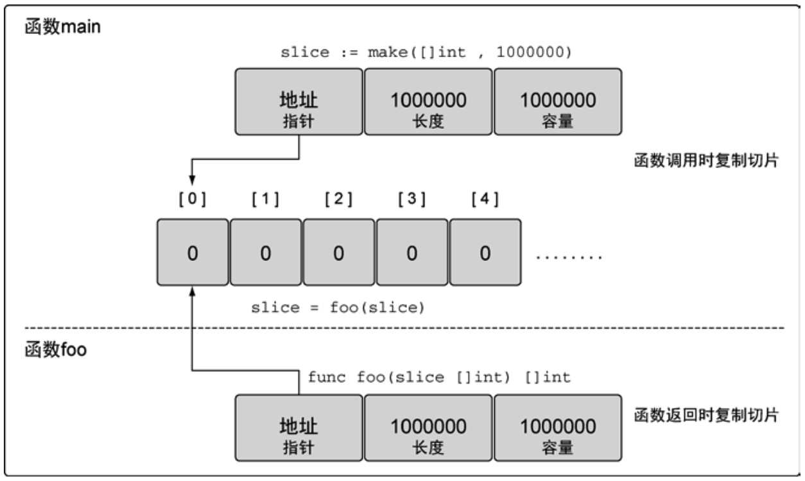

使用切片时，在函数间传递 24 字节的数据会非常快速、简单。这也是切片效率高的地方。必须要传递指针和处理复杂的语法，只需要复制切片，按想要的方式修改数据，然后传递回一份新的切片副本。

这也许就是当初介绍 Slice 时这样定义：是==数组的封装==，是围绕**动态数组**的概念构建的，可以按需自动增长和缩小。

# 3 Map

哈希表是一种巧妙且实用的数据结构，用于存储一系列==无序的== key-value 对的集合。其中，所有的 key 都是不同的，然后通过给定的 key 可以在常数时间复杂度内检索、更新或删除对应的 value。**键就像索引一样，指向与该键关联的值**。

在 Go 语言中，**一个 map 就是一个哈希表的引用**，map 类型可以写为 map[K]V，其中 K 和 V 分别对应 key 和 value。map 中所有的 key 都有相同的类型，所有的 value 也有着相同的类型，但是 key 和 value 之间可以是不同的数据类型。**其中 K 对应的 key 必须是支持 == 比较运算符的数据类型**，所以 map 可以通过测试 key 是否相等来判断是否已经存在。==虽然浮点数类型也是支持相等运算符比较的，但是将浮点数用做 key 类型则是一个坏的想法==。最坏的情况可能是出现 `NaN` 和任何浮点数都不相等。对于 V 对应的 value 数据类型则没有任何的限制。

Go 语言中有很多种方法可以创建并初始化映射，可以使用内置 make 函数，也可以使用映射字面量：

~~~go
package main

import "fmt"

func main() {
	tmp := make(map[string]int) // 用 make 内置函数创建 map
	fmt.Println(tmp) // map[]

	tmp["bj"] = 1
	fmt.Println(tmp) // map[bj:1]

	dict := map[string]string{ // 用字面量创建 map
		"Red":    "#da1337",
		"Orange": "#e95a22",
	}
	fmt.Println(dict) // map[Orange:#e95a22 Red:#da1337]

	fmt.Println(len(dict)) // 2

	value := map[string]int{}
	fmt.Println(value) // map[]
}
~~~

`map[string]int` 创建一个映射，键的类型是 string，值的类型是 `int`。

Map 中的元素通过 key 对应的下标语法访问：

~~~go
tmp["bj"] = 1
fmt.Println(tmp) // map[bj:1]
// 访问 map 中 key 值是 bi 的 value
fmt.Println(tmp["bi"])
~~~

使用内置的 delete 函数可以删除 map 中的元素（key-value对）：

~~~go
tmp["bj"] = 1
fmt.Println(tmp) // map[bj:1]

fmt.Println(tmp["bi"]) // 0

delete(tmp, "bj")
fmt.Println(tmp) // map[]
~~~

所有这些操作是安全的，即使这些元素不在 map 中也没关系；==如果一个查找失败将返回 value 类型对应的零值==。例如，即使 map 中不存在“bi” 下面的代码也能正常工作，因为 `tmp["bi"]` 失败时将返回 0。

而且 x += y 和 x++ 等简短赋值语法也可以用在 map 上，所以上面的代码可以改写成：

~~~go
tmp["bj"] = 1
fmt.Println(tmp) // map[bj:1]

// should replace tmp["bj"] += 1 with tmp["bj"]++
tmp["bj"] += 1

tmp["bj"]++
fmt.Println(tmp)
~~~

综上，使用 map 类型做增、删、改、查：

~~~go
type Person struct {
	name string
	age  int
}

func main() {
	// id --> Person
	var employees map[int]Person
	employees = make(map[int]Person)

	// add
	employees[1] = Person{
		name: "a",
		age:  18,
	}
	fmt.Println(employees)

	// update
	employees[1] = Person{
		name: "b",
		age:  18,
	}
	fmt.Println(employees)

	// search
	value, ok := employees[1]
	if ok {
		fmt.Println(value)
	}

	// delete
	delete(employees, 1)
	length := len(employees)
	fmt.Println("length:", length)
}
~~~

但是 map 中的元素并不是一个变量，由此我们不能对 map 的元素进行取地址操作：

~~~go
package main

import "fmt"

func main() {
	tmp := make(map[string]int)
	fmt.Println(tmp) // map[]

	tmp["bj"] = 1
	fmt.Println(tmp) // map[bj:1]

	var slice = []int{1, 2, 3}
	fmt.Println(slice)

	var array = [3]int{1, 2, 3}
	fmt.Println(array)

	fmt.Printf("%p\n", &slice[1]) // 0xc000018128
	fmt.Printf("%p\n", &array[1]) // 0xc000018148

	slice = append(slice, 4)
	fmt.Printf("%p\n", &slice[1]) // 0xc000016158
	fmt.Println(slice)

	// invalid operation: cannot take address of tmp["bj"]
	// fmt.Printf("%p\n", &tmp["bj"])
}
~~~

禁止对 map 元素取地址的原因是：map 可能随着元素数量的增长而重新分配更大的内存空间，从而可能导致之前用于存储 key-value pair 的地址无效。另外一个很显然实证是：

~~~go

type Person struct {
	name string
	age  int
}

func main() {
	// id --> Person
	var employees map[int]Person
	employees = make(map[int]Person)

	// add
	employees[1] = Person{
		name: "a",
		age:  18,
	}
	fmt.Println(employees)

	// update
	employees[1] = Person{
		name: "b",
		age:  18,
	}
	fmt.Println(employees)

	// search
	value, ok := employees[1]
	if ok {
		fmt.Println(value)

		var ptr *Person = &value // 取出 value 的地址，也就是 key-value pair 中的 value 指针
		fmt.Printf("%p.\n", ptr)

		ptr.age = 20
		fmt.Println(*ptr) // {b 20}

		fmt.Println(employees) // map[1:{b 18}]
	}

	// delete
	delete(employees, 1)
	length := len(employees)
	fmt.Println("length:", length)
}

map[1:{a 18}]
map[1:{b 18}]
{b 18}
0xc0000045c0.
{b 20}
map[1:{b 18}]
length: 0
~~~

这里有一个==**很容易理解错误的地方**==：`value, ok := employees[1]` value 取到了 key 对应的元素值（==**发生了一次值拷贝**==）， `ptr` 获取到了 value 的地址，也即是 value 的指针。根据这个指针指向关系，实际上 `ptr` 并没有直接指向 map 中的元素值。因此 `ptr.age = 20` 并不会导致 map 中 key-value pair 的更改。用一个很简便的方法做猜想验证：

~~~go
type Person struct {
	name string
	age  int
}

func main() {
	// id --> Person
	var employees map[int]Person
	employees = make(map[int]Person)

	// add
	employees[1] = Person{
		name: "a",
		age:  18,
	}

	onePersonPtr := &Person{
		name: "b",
		age:  18,
	}
	onePerson := *onePersonPtr
	// update
	employees[1] = onePerson
	fmt.Printf("%p.\n", onePersonPtr)

	// search
	value, ok := employees[1]
	if ok {
		fmt.Println(value)

		var ptr *Person = &value
		fmt.Printf("%p, %p.\n", &ptr, ptr) // ptr 变量自身的内存地址，ptr 指向的内存地址

		ptr.age = 20
		fmt.Println(*ptr)

		fmt.Println(employees)
		value = employees[1]
		fmt.Println(value)
	}
}

0xc0000044a0.
{b 18}
0xc000006030, 0xc0000044e0.
{b 20}
map[1:{b 18}]
{b 18}
~~~

问题就在于：`onePersonPtr` 的所指的 Person 地址和 `ptr` 指向的内存地址分别是：`0xc0000044a0` 和 `0xc0000044e0` 也就是不同的区域。==**实际上，本质上是做了一次值的拷贝**==，发生在 `value, ok := employees[1]` 中，从 map 取出了元素值，并将其赋值给了变量 value。

如果将其修改为：`var employees map[int]*Person` 就会达到预期效果！修改为 `var employees map[int]*Person` 得到的结果是：

~~~go
type Person struct {
	name string
	age  int
}

func main() {
	// id --> Person
	var employees map[int]*Person
	employees = make(map[int]*Person)

	// add
	employees[1] = &Person{
		name: "a",
		age:  18,
	}

	onePerson := &Person{
		name: "b",
		age:  18,
	}
	// update
	employees[1] = onePerson
	fmt.Printf("%p.\n", onePerson)
	fmt.Println(employees)

	// search
	value, ok := employees[1]
	if ok {
		fmt.Println(value)

		var ptr *Person = value
		fmt.Printf("%p, %p.\n", &ptr, ptr) // ptr 变量自身的内存地址，ptr 指向的内存地址

		ptr.age = 20
		fmt.Println(*ptr)

		fmt.Println(employees)
		value = employees[1]
		fmt.Println(value)
	}
}

0xc0000044c0.
map[1:0xc0000044c0]
&{b 18}
0xc000006030, 0xc0000044c0.
{b 20}
map[1:0xc0000044c0]
&{b 20}
~~~

那上述 map 的这个特征是怎么实现的？难道是做了一次结构体值的拷贝？！结构体值的拷贝，相当于是重新创建了 Person 这个结构体变量的值，并重新开辟内存空间用于存放该 Person 结构体。那如果是指针，则相当于指向的是原来相同的内存空间，也就是源 Person 结构体。

**映射散列表包含一组桶**。在存储、删除或者查找键值对的时候，所有操作都要**先选择一个桶**。把操作映射时指定的**键**传给映射的==散列函数==，就能选中对应的桶。这个散列函数的目的是生成**一个索引**，这个索引最终将键值对分布到所有可用的桶里。

==随着映射存储的增加，索引分布越均匀，访问键值对的速度就越快==。对于有 10000 个元素的映射，每次查找只需要查找 8 个键值对才是一个分布得比较好的映射。**映射通过合理数量的桶来平衡键值对的分布**。

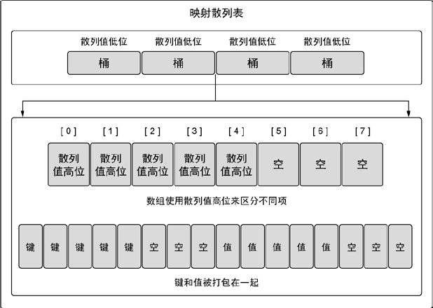

（==映射底层实现原理==）映射用两个数据结构来存储数据。第一个数据结构是一个数组，内部存储的是用于选择桶的散列键的高八位值。这个数组用于区分每个键值对要存在哪个桶里。第二个数据结构是一个字节数组，用于存储键值对。该字节数组先依次存储了这个桶里所有的键，之后一次存储了这个桶里所有的值。**实现这种键值对的存储方式目的在于减少每个桶所需的内存**。

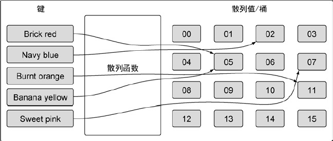

映射的初始长度会根据初始化时指定的键值对的数量来确定。

映射的**键类型**可以是内置的类型，也可以是结构类型，只要这个值可以使用 `==` 运算符做比较。**切片、函数以及包含切片的结构类型、map 类型**这些由于具有==引用语义==，不能作为映射的键，使用这些类型会造成编译错误。

~~~go
package main

import "fmt"

func main() {	
	dict := map[[]string]string{} // invalid map key type []string，编译错误
	fmt.Println(dict)
    
    var maps map[interface{}]string

	maps = map[interface{}]string{
		make([]int, 3): "sss", // panic: runtime error: hash of unhashable type []int，不会编译出错
	}

	fmt.Println(maps)
}
~~~

使用切片作为映射的值，在使用一个映射键对应一组数据时，会非常有用。

~~~go
package main

import "fmt"

func main() {
    // 创建一个空映射，用来存储 int - []string 的映射关系
	dict := map[int][]string{}
	fmt.Println(dict)
	
	fmt.Println(len(dict))
	
	dict[0] = []string{"0", "1"}
	fmt.Println(dict) // map[0:[0 1]]
}
~~~

键值对赋值给映射，是通过**指定适当类型的键**并给这个键赋一个值来完成的。

新的空 map 的另外一种表达式是：`map[string]int{}`。

可以通过**声明一个未初始化的映射**来创建一个**值为 nil 的映射（nil 映射）**。**nil 映射不能用于存储键值对**，否则会产生一个语言运行时的错误：

~~~go
package main

func main() {
    // 相当于 Java 中的局部变量声明，而没有默认初始
	var colors map[string]string
    // 正确写法：var colors = map[string]string{}
    
	// panic: assignment to entry in nil map
	colors["Red"] = "#da1337"
    
    var tmp = make(map[string]string)
	fmt.Println(tmp)
	tmp["Red"] = "#da1337"
	fmt.Println(tmp)
    
    maps := make(map[int]string)  // 初始化方式1：获得的 maps 不是 nil
	if maps == nil {
		fmt.Println("maps is nil!")
	}

	dict := map[int]string{} // 初始方式2：获得的 dict 也不是 nil，而是空的 map，即 length 为 0
	if dict == nil {
		fmt.Println("dict is nil!")
	}
}
~~~

map 类型的零值是 nil，也就是没有任何哈希表。与之形成对比的是使用 `make` 声明的 map 变量，可以直接添加 key-value。

~~~go
var ages map[string]int
fmt.Println(ages == nil) // true
fmt.Println(len(ages) == 0) // true
~~~

map 上的大部分操作，包括查找、删除、len 和 range 循环都可以安全工作在 nil 值的 map 上，它们的行为和一个空的 map 类似。但是向一个 nil 值的 map 存入元素将导致一个 panic 异常。也就是：在向 map 存数据前必须先创建 map。

测试**映射里是否存在某个键**是映射的一个重要操作。这个操作允许用户写一些逻辑来确定是否完成了某个操作或者是否在映射里缓存了特定数据。这个操作也可以用来比较两个映射，来确定哪些键值对互相匹配，哪些键值对不匹配。==从映射取值时==有两个选择，第一个选择是可以同时获得值，以及一个表示这个键是否存在的标志：

~~~go
package main

import (
	"fmt"
)

func main() {
	var colors = map[string]string{}
	colors["Red"] = "#da1337"

	fmt.Println(colors)
	// 获取键 Blue 对应的值
	value, exists := colors["Blue"]
	if exists {
		fmt.Println(value)
	}
}
~~~

另一个是，只返回键对应的值，然后通过判断这个值是否是==零值==来确定键是否存在（**这种方法只能用在映射存储的值都是非零值的情况**）：

~~~go
package main

import (
	"fmt"
)

func main() {
	var colors = map[string]string{}
	colors["Red"] = "#da1337"

	fmt.Println(colors)

    // Blue
	value := colors["Red"]
	if value != "" {
		fmt.Println(value)
	}
}
~~~

在 Go 语言里，通过键来索引映射时，**即便这个键不存在也总会返回一个值**。在这种情况下，**返回的是该值对应的类型的零值**。

你会经常看到将这两个结合起来的使用，像这样：

~~~go
if colorValue, ok := colors["Red"]; !ok {
    // do something
}
~~~

在这种场景下，map 的下标语法将产生两个值；第二个是一个布尔值，用于报告元素是否真的存在。布尔变量一般命名为 ok，特别适合马上用于 if 条件判断其是否真实存在 key-value 对。

要像遍历 map 中全部的 key/value 对的话，可以使用 range 风格的 for 循环实现，和之前的 slice 遍历语法类似。下面的迭代语句将在每次迭代时设置 key 和 value 变量，它们==对应下一个键/值对==：

~~~go
package main

import (
	"fmt"
)

func main() {
    // 使用 var 关键字声明变量，并初始化
	var colors = map[string]string{
		"AliceBlue":   "#f0f8",
		"Coral":       "#ff7f",
		"DarkGray":    "a9a9",
		"ForestGreen": "#228b",
	}

	fmt.Println(colors)
	value := colors["Red"]
	if value != "" {
		fmt.Println(value)
	}
    
    _, exist := colors["Red"]
    fmt.Println(exist)
	
	for key, value := range colors{ // range 风格的 for 循环格式，依次输出 key, value 值
		fmt.Printf("Key: %s Value: %s\n", key, value)
	}
}
~~~

特别注意：上述代码中，初始化值的最后一个元素末尾必须加上 `,`，否则会报错：`syntax error: unexpected newline, expecting comma or }`，或者将最后的 `}` 写在末尾。

如果想把一个键值对从映射里删除，就使用内置的 delete 函数：

~~~go
package main

import (
	"fmt"
)

func main() {
	var colors = map[string]string{
		"AliceBlue":   "#f0f8",
		"Coral":       "#ff7f",
		"DarkGray":    "a9a9",
		"ForestGreen": "#228b",
	}

	delete(colors, "Coral")

	for key, value := range colors {
		fmt.Printf("Key: %s Value: %s\n", key, value)
	}
}
~~~

**==Map 的迭代顺序是不确定的==**，并且不同的哈希函数实现可能导致不同的遍历顺序。**==在实践中，遍历的顺序是随机的，每一次遍历的顺序都不相同==**。这是故意的，每次都使用随机的遍历顺序可以强制要求程序不会依赖具体的哈希函数实现。如果要按顺序便利 key/value 对，我们必须显式地对 key 进行排序，可以使用 sort 包的 Strings 函数对字符串 slice 进行排序。下面是常见的处理方式：

~~~go
package main

import (
	"fmt"
	"log"
	"sort"
)

func main() {
	maps := make(map[string]int)
	fmt.Printf("%p\n", maps)

	maps["4"] = 1
	maps["3"] = 2
	maps["2"] = 3
	maps["1"] = 4

	delete(maps, "4")
	fmt.Println("len(maps):", len(maps))

	names := make([]string, 0, len(maps)) // 创建切片时，给定 len 和 cap 值
	for key, value := range maps {
		fmt.Printf("%s, %d\n", key, value)
		names = append(names, key)
	}

	sort.Strings(names) // 使用 sort 包对 string 类型切片排序

	for _, name := range names {
		fmt.Printf("name: %s, value: %d\n", name, maps[name])
	}
}
~~~

因为我们一开始就知道 names 的最终大小，因此给 slice 分配一个合适的大小将会更有效。下面的代码创建了一个空的 slice，但是 slice 的容量刚好可以放下 map 中全部的 key：

~~~go
names := make([]string, 0, len(ages)
~~~

如果使用 range 遍历 map，遍历操作符左侧仅有 1 个变量：

~~~go
func main() {
	maps := make(map[string]int)
	fmt.Printf("%p\n", maps)

	maps["4"]++
	maps["3"]++
	maps["2"] = 3
	maps["1"] = 4

	for key := range maps {
		fmt.Printf("%s\n", key)
	}
}
~~~

此时**得到的结果仅仅是 key，而没有 value**！

**和 slice 一样，map 之间也不能进行相等比较**；唯一的例外是和 nil 进行比较。要判断两个 map 是否包含相同的 key 和 value，我们通过循环来实现：

~~~go
func equal(x, y map[string]int) bool {
    if len(x) != len(y) {
        return false
    }
    for k, xv := range x {
        if yv, ok := y[k]; !ok || yv != xv {
            return false
        }
    }
    return true
}
~~~

从例子中可以看到如何用 !ok 来区分元素不存在，与元素存在但为零值的。我们不能简单地用 `xv != y[k]` 判断，那样会导致在判断下面两个 map 时产生错误的结果：

~~~go
equal(map[string]int{"A":0}, map[string]int{"B":42})
~~~

Go 语言中并没有提供一个 set 类型，但是 map 中的 key 也是不相同的，可以用 map 实现类似 set 的功能。为了说明这一点，下面的 `dedup` 程序读取多行输入，但是只打印第一次出现的行：

~~~go
func main() {
    seen := make(map[string]bool)
    input := bufio.NewScanner(os.Stdin)
    for input.Scan() {
        line := input.Text()
        if !seen[line] {
            seen[line] = true
            fmt.Println(line)
        }
    }
    if err := input.Err(); err != nil {
        fmt.Fprintf(os.Stderr, "dudup: %v\n", err)
        os.Exit(1)
    }
}
~~~

Go 程序猿将这种忽略 value 的 map 当作一个字符串集合，并非所有 `map[string]bool` 类型 value 都是无关紧要的；有一些则可能会同时包含 true 和 false 的值。

有时候我们需要一个 map 或 set 的 key 是 slice 类型，**但是 map 的 key 必须是可比较的类型**，但是 slice 并不满足这个条件。不过，我们可以通过两个步骤绕过这个限制：

1. 定义一个辅助函数 k，将 slice 转为 map 对应的 string 类型的 key，确保只有 x 和 y 相等时 `k(x) == k(y)` 才成立；
2. 创建一个 key 为 string 类型的 map，在每次对 map 操作时先用 k 辅助函数将 slice 转化为 string 类型。

下面的例子演示了如何使用 map 来记录提交相同的**字符串列表**的次数。它使用了 `fmt.Sprintf` 函数将字符串列表转换为一个字符串以用于 map 的 key，通过 %q 参数忠实地记录每个字符串元素的信息：

~~~go
var m = make(map[string]int)

func k(list []string) string {
    return fmt.Sprintf("%q", list) // []string 转成 string，用于 map 的 key 值。意义在于将不可比较的 []string 转化为可比较的 string
}

func Add(list []string) {
    m[k(list)]++
}

func Count(list []string) int {
    return m[k(list)]
}
~~~

使用相同的技术可以处理任何不可比较的 key 类型，而不仅仅是 slice 类型。这种技术对于想使用==自定义 key 比较函数==的时候也很有用，例如在比较字符串的时候忽略大小写。同时辅助函数 k(x) 也不一定是字符串类型，它可以返回任何可比较的类型，例如整数、数组或结构体等。

下面是 map 的另一个例子，程序用于统计输入中每个 Unicode 码点出现的次数。虽然 Unicode 全部码点的数量巨大，但是出现在特定文档中的字符种类并没有多少，使用 map 可以用比较自然的方式来跟踪那些出现过的字符的次数：

~~~go
package main

import (
	"bufio"
    "fmt"
    "io"
    "os"
    "unicode"
    "unicode/utf8"
)

func mian() {
    counts := make(map[rune]int) // rune - int
    var utflen [utf8.UTFMax + 1]int
    invalid := 0
    
    in := bufio.NewReader(os.Stdin)
    
    for {
        // r rune, size int, err error
        r, n, err := in.ReadRune()
        if err == io.EOF {
            break
        }
        if err != nil {
            fmt.Fprintf(os.Stderr, "charcount: %v\n", err)
            os.Exit(1)
        }
        if r == unicode.ReplacementChar && n == 1 {
            invalid++
            continue
        }
        counts[r]++
        utflen(n)++
    }
    fmt.Printf("rune\t\count\n")
    for c, n := range counts {
        fmt.Printf("%q\t%d\n", c, n)
    }
    fmt.Print("\nlen\tcount\n")
    for i, n := range utflen {
        if i > 0 {
            fmt.Printf("%d\t%d\n", i, n)
        }
    }
    if invalid > 0 {
        fmt.Printf("\n%d invalid UTF-8 characters\n", invalid)
    }
}
~~~

`ReadRune` 方法执行 UTF-8 解码并返回三个值：解码的 rune 字符的值，字符 UTF-8 编码后的长度，和一个错误值。我可预期的错误只只有对应文件结尾的 `io.EOF`。如果输入的是无效的 UTF-8 编码的字符，返回的将是 `unicode.ReplacementChar` 表示无效字符，并且编码长度是 1。

在函数间传递映射并**不会制造出该映射的一个副本**。实际上，当传递映射给一个函数，并对这个映射做了修改，所有对这个映射的引用都会察觉到这个修改：

~~~go
package main

import (
	"fmt"
)

func main() {
	var colors = map[string]string{
		"AliceBlue":   "#f0f8",
		"Coral":       "#ff7f",
		"DarkGray":    "a9a9",
		"ForestGreen": "#228b",
	}
	
	removeColor(colors, "Coral")

	for key, value := range colors {
		fmt.Printf("Key: %s Value: %s\n", key, value)
	}
}

func removeColor(colors map[string]string, key string){
	delete(colors, key)
}
~~~

这个特性和切片类似，保证可以用很小的成本来复制映射。

我们无法获取 map 元素的地址的一个原因是 map 的增长可能会导致==**已有元素被重新散列到新的存储位置**==，这样就可能使得获取的地址无效。

# 4 Struct

结构体是一种==聚合的数据类型==，是由零个或者多个任意类型的命名变量组合在一起的实体。每个变量都叫作**结构体的成员**。**聚合类型，可以和基本数据类型等价，又是和引用类型不同的一种类型**。

用结构体的经典案例是处理公司的员工信息，每个员工信息包含一个唯一的员工编号、员工名字、家庭住宅、出生日期、工作岗位、薪资、上级领导等。**所有这些信息都需要绑定到一个实体中，可以作为整体单元被复制，作为函数的参数或返回值，或者是被存储到数组中**，等等。

下面的语句定义了一个叫 Employee 的结构体和一个结构体变量 `dilbert`：

~~~go
package main

import (
	"fmt"
	"time"
)

type Employee struct {
	ID        int
	Name      string
	Address   string
	DoB       time.Time
	Position  string
	Salary    int
	ManagerID int
}

var dilbert Employee

func main() {
	var employee Employee
	employee.ID = 10
	fmt.Println(employee.ID) // 10

	modifyEmployee(employee)
	fmt.Println(employee.ID) // 10
}

func modifyEmployee(employee Employee) {
	employee.ID = 20 // modify ID 成员
}
~~~

在调用修改 ID 的函数后，并没有达到修改原结构体实体的目的，也就是证明了 `struct` 变量作为形参时，是传值的。==**也就是说 `struct` 不是引用类型**==。

`dilbert` 结构体变量的每一个成员都通过**点号**操作符访问，比如 `dilbert.Name` 等。**因为 `dilbert` 是一个变量**，**它所有的成员也同样是变量**，我们可以直接对每个成员赋值：

~~~go
dilbert.Salary -= 5000
~~~

或者是对成员取地址，然后通过指针访问：

~~~go
position := &dilbert.Position
*position = "Senior " + *position
~~~

==点操作符也可以和指向结构体的指针一起工作==：

~~~go
var employOfTheMonth *Employee = &dilbert
employeeOfTheMonth.Position += " (proactive team player)"
~~~

相当于下面的语句：

~~~go
(*employeeOfTheMonth).Position += " (proactive team player)"
~~~

下面的 `EmployeeByID` 函数将根据给定的员工 ID 返回对应的员工信息结构体的指针，我们可以使用点操作符来访问它里面的成员：

~~~go
func EmployeeByID(id int) *Employee {
    // do something
}

fmt.Println(EmployeeByID(dilbert.ManagerID).Position)

id := dilbert.ID
EmployeeByID(id).Salary = 0
~~~

而如果将 `EmployeeByID` 函数的返回值从 *Employee 指针类型改为 Employee 值类型，那么更新语句将不能编译通过：

~~~go
package main

import (
	"fmt"
	"time"
)

type Employee struct {
	ID        int
	Name      string
	Address   string
	DoB       time.Time
	Position  string
	Salary    int
	ManagerID int
}

func main() {
	var employee = EmployeeByID(10)
	fmt.Println(employee)

	employee.Salary = 0 // 成功更新
	fmt.Println(employee)

    // 编译失败！并不能确定 EmployeeByID(1) 函数返回的就是一个变量
	EmployeeByID(1).Salary = 0
}

func EmployeeByID(id int) Employee {
	// do something
	var dilbert Employee

	// ...

	return dilbert
}
~~~

为什么会失败？但是为什么返回的是指针却可以？因为在赋值语句的左边==**并不确定是一个变量**==。==调用函数返回的是值，并不是一个可取地址的变量==。那如果返回的是指针，相当于是已经告知是 Employee 类型的变量。

结构体的成员变量通常一行写一个，变量的名称在类型的前面，但是相同类型的连续成员变量可以写在一行上，就像这里的 Name 和 Address：

~~~go
type Employee struct {
    ID int
    Name, Address string
    ...
}
~~~

**==成员变量的顺序对于结构体同一性很重要==**。如果我们将也是字符串类型的 Position 和 Name、Address 组合在一起或者互换了 Name 和 Address 的顺序，那么我们就在==定义一个不同的结构体类型==。

如果一个结构体的成员变量名称是首字母大写的，那么这个变量是可导出的，这个是 Go 最主要的访问控制机制。**一个结构体可以同时包含可导出和不可导出的成员变量**。

> Go 语言中“可导出的”，其含义是在包外部也是可以访问的，当然在包内部是可以访问的。

结构体类型往往是冗长的，因为它的每个成员可能都会占一行。虽然我们每次都可以重写整个结构体成员，但是重复会令人厌烦。因此，完整的结构体写法通常只在类型声明语句的地方出现，就像 Employee 类型声明语句那样。

一个命名为 S 的结构体类型将不能再包含 S 类型的成员：**==因为一个聚合的值不能包含它自身==**。该限制同样适用于数组！**==但是 S 类型的结构体可以包含 `*S` 指针类型的成员==**，这可以让我们创建递归的数据结构，比如链表和树结构：

~~~go
type tree struct {
    value int
    left, right *tree // 创建递归的数据结构，本质原因是指针类型所占内存空间是确定的
}
~~~

结构体类型的零值是每个成员都是零值。通常会将零值作为最合理的默认值。例如，对于 `bytes.Buffer` 类型，结构体初始值就是一个随时可用的空缓存，还有 `sync.Mutex` 的零值也是有效的未锁定状态。有时候这种零值可用的特性是自然获得的，但是也有些类型需要一些额外的工作。

如果结构体没有任何成员的话就是**空结构体**，写作 `struct{}`。**它的大小为0，也不包含任何信息，但是有时候依然是有价值的**。有些 Go 语言程序猿用 map 来模拟 set 数据结构时，用它来代替 map 中布尔类型的 value，只是强调 key 的重要性，但是因为节约的空间有限，而且语法比较复杂，所有我们通常会避免这样的用法：

~~~go
seen := make(map[string]struct{})

if _, ok := seen[s]; !ok {
    seen[s] = struct{}{}
}
~~~

注意：`struct{}` 是一种**结构体类型**。

结构体值也可以用**结构体字面值**表示，结构体字面值可以指定每个成员的值：

~~~go
type Point struct {
    X, Y int
}

p := Point{1, 2}
~~~

这里有两种形式的结构体字面值语法，上面是第一种写法，要求以结构体成员定义的顺序为每个结构体成员指定一个字面值。它**要求写代码和读代码的人要记住结构体的每个成员的类型和顺序**，不过结构体成员有细微的调整就可能导致上述代码不能编译。由此，**上述的语法一般只在定义结构体的包内部使用**，或者是在较小的结构体中使用，这些结构体的成员排列比较规则，比如 `image.Point{x, y}` 或者 `color.RGBA{red, gree, blue, alpha}`。

其实更常见的是第二种写法，以成员名字和相应的值来初始化，可以**包含部分或全部**的成员：

~~~go
anim := gif.GIF{LoopCount: nframes}
~~~

在这种形式的结构体字面值写法中，如果成员被忽略的话将默认用零值。因为提供了成员的名字，所有成员出现的顺序并不重要。

两种不同形式的写法不能混合使用。而且，你不能企图在外部包中用第一种顺序复制的技巧来偷偷地初始化结构体中未导入的成员：

~~~go
package p
type T struct {a, b int} // a and b are not exported

package q

import "p"
var _ = p.T{a:1, b:2} // compile error
var _ = p.T{1, 2} // compile error
~~~

也是说==**结构体类型 T 和其成员的导出属性是分开的**==。虽然看最后一行代码的编译错误信息中并没有显式提到未导出的成员，但是这样企图隐式使用未导出成员的行为也是不允许的。

结构体可以作为函数的参数和返回值，例如这个 Scale 函数将 Point 类型的值缩放后返回：

~~~go
package main

import (
	"fmt"
)

type Point struct {
	X, Y int
}

func main() {
	var point = Point{1, 2}
	fmt.Printf("%p\n", &point) // 0xc000014090

	scalePoint := Scale(point, 5)
	fmt.Println(scalePoint)
	fmt.Printf("%p\n", &scalePoint) // 0xc0000140b0
}

func Scale(p Point, factor int) Point {
	return Point{p.X * factor, p.Y * factor}
}
~~~

如果考虑效率的话，较大的结构体通常会用指针的方式传入和返回：

~~~go
package main

import (
	"fmt"
)

type Point struct {
	X, Y int
}

func main() {
	var point = Point{1, 2}
	fmt.Printf("1 %p\n", &point) // 0xc0000140a0
	ScalePoint(&point, 5)
}

func ScalePoint(pptr *Point, factor int) {
	fmt.Printf("2 %p\n", pptr) // 0xc0000140a0，修改的是原先定义的 point 变量
	pptr.X *= factor
	pptr.Y *= factor
}
~~~

**如果要在函数内部修改结构体成员的话，用指针传入是必须的**；因为在 Go 语言中，==所有的函数参数都是值拷贝传入的==，函数参数将不再是函数调用时的原始变量。从上面的 `ScalePoint` 的例子可看出，该函数确实修改的是原先的 `point` 变量。

因为结构体通常通过指针处理，可用下面的写法来创建并初始化一个结构体变量，并返回结构体的地址：

~~~go
pp := &Point{1,2}
~~~

它和下面的语句是等价的：

~~~go
pp := new(Point) // 创建的是 *Point 类型变量
*pp = Point{1, 2}
~~~

不过，`&Point{1,2}` 写法可以直接在表达式中使用，比如一个函数调用。

如果结构体的全部成员都是可以比较的，那么结构体也是可以比较的，那样的话两个结构体将可以使用 == 或 != 运算符进比较。相等比较运算符 == 将比较两个结构体的每一个成员，由此下面两个比较的表达式是等价的：

~~~go
type Point struct{ X, Y int }

p := Point{1, 2}
q := Point{2, 1}
fmt.Println(p.X == q.X && p.Y == q.Y) // "false"
fmt.Println(p == q)                   // "false"
~~~

可比较的结构体类型和其他可比较的类型一样，可以用于 map 的 key 类型：

~~~go
type address struct {
    hostname string
    port int
}
hits := make(map[address]int)
hits[addrss{"golang.org", 443}]++
~~~

在下面的内容中，我们将看能到如何使用 Go 语言提供的==不同寻常的结构体嵌入机制==让一个命名的结构体包含了==**一个结构体类型的匿名成员**==，这样就可以通过简单的点运算符 `x.f` 来访问匿名成员链中嵌套的 `x.d.e.f` 成员。

考虑一个二维的绘图程序，提供了一个各种图形的库，例如矩形、椭圆形、星形和轮形等几何形状。这里是其中两个的定义：

~~~go
type Circle struct {
    X, Y, Radius int 
}

type While struct {
    X, Y, Radius, Spokes int
}
~~~

一个 Circle 代表的圆形类型包含了标准圆心的 X 和 Y 坐标信息，和一个 Radius 表示的半径信息。一个 Wheel 轮形除了包含 Circle 类型所有的全部成员外，还增加了 Spokes 表示径向辐条的数量。我们可以这样创建一个 wheel 变量：

~~~go
var w Wheel
w.X = 8
w.Y = 8
w.Radius = 5
w.Spokes = 20
~~~

随着库中几何形状数量的增多，我们一定会注意到它们之间的相似和重复之处，所以我们可能为了便于维护而将相同的属性独立出来：

~~~go
type Point struct {
    X, Y int
}

type Circle struct {
    Center Point
    Radius int
}

type Wheel struct {
    Circle Circle
    Spokes int
}
~~~

这样改动之后结构体类型变得清晰了，但是这种修改同时也导致了访问每个成员变得繁琐：

~~~go
var w Wheel
w.Circle.Center.X = 8
w.Circle.Center.Y = 8
w.Spokes = 20
~~~

Go 语言有一个特性让我们**只声明一个成员对应的数据类型而不指明成员的名字**，这类成员就叫==匿名成员==。**匿名成员的数据类型必须是==命名的类型==或==指向一个命名类型的指针==**。下面的代码中，Circle 和 Wheel 各自都有一个匿名成员。我们可以说 Point 类型被嵌入到了 Circle 结构体，同时 Circle 类型被嵌入到了 Wheel 结构体中：

~~~go
type Circle struct {
    Point
    Radius int
}

type Wheel struct {
    Circle
    Spokes int
}
~~~

得益于**匿名嵌入的类型**，我们可以直接访问叶子属性而不需要给出完整的路径：

~~~go
var w Wheel
w.X = 8  // equivalent to w.Circle.Point.X = 8
w.Y = 8
w.Radius = 5
w.Spokes = 20
~~~

在右边的注释中给出的显式形式访问这些叶子成员的语法依然有效，因此匿名成员并不是真的无法访问了。其中匿名成员 Circle 和 Point 都有自己的名字——就是命名的类型名字——但是这些名字在点操作符中是可选的。**我们在访问子成员的时候可以忽略任何匿名成员部分**。

不幸的是，==**结构体字面值**==并没有简短表示匿名成员的语法，因此**下面的语法都不能编译通过**：

~~~go
w = Wheel{8, 8, 5, 20}
w = Wheel{X:8, Y:8, Radius:5, Spokes:20}
~~~

结构体字面值必须遵循形状类型声明时的结构，所以**==我们只能用下面的两种语法==**，它们彼此时等价的：

~~~go
w = Wheel{Circle{Point{8, 8}, 5}, 20}

w = Wheel{
    Circle: Circle{
        Point:  Point{X: 8, Y: 8},
        Radius: 5,
    },
    Spokes: 20, // NOTE: trailing comma necessary here (and at Radius)
}

fmt.Printf("%#v\n", w)

w.X = 42

fmt.Printf("%#v\n", w)
~~~

因为匿名成员也有一个隐式的名字，因此==**不能同时包含两个类型相同的匿名成员**==，这会导致名字冲突。同时，因为成员的名字是由其类型隐式地决定的，所以匿名成员也有可见性的规则约束。在上面的例子中，Point 和 Circle 匿名成员都是导出的。即使它们不导出，我们依然可以用简短形式访问匿名成员嵌套的成员。

但是在包外部，因为 circle 和 point 没有导出，不能访问它们的成员，由此简短的匿名成员访问语法也是禁止的。

当目前为止，我们看到匿名成员特性只是对访问嵌套成员的点运算符提供了简短的语法糖。稍后，我们将会看到**匿名成员并不要求是结构体类型（比如上面的 Circle 和 Point）**；其实==任何命名的类型都可以作为结构体的匿名成员==。但是为什么要潜入一个没有任何子成员类型的匿名成员类型呢？

答案是匿名类型的方法集。简短的点运算符语法可以用于选择匿名成员嵌套的成员，也可以用于访问它们的方法。实际上，外层的结构体不仅仅是获得了匿名成员类型的所有成员，而且也获得了该类型导出的全部方法。==**这个机制可以用于将一些有简单行为的对象组合成有复杂行为的对象**==。

组合是 Go 语言中面向对象编程的核心！
