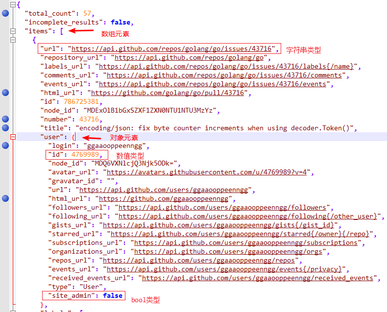
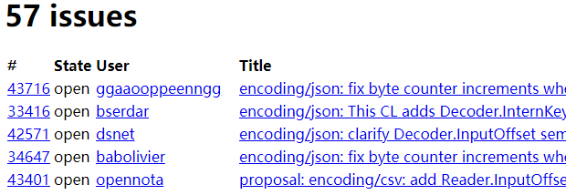

# 1 自定义类型

Go 语言==允许用户定义类型==。当用户声明一个==新类型==时，这个声明就**给编译器提供了一个框架**，告知必要的**内存大小**和**表示信息**。声明后的类型与内置类型的运作方式类似。

==Go 语言里声明用户定义的类型**有 2 种方式**==。最常用的方法是使用关键字 struct，可以让用户**创建一个结构体类型**。==结构类型==通过**组合一系列固定且唯一的字段来声明**。结构里每个字段都会用一个已知类型声明。这个已知类型可以是内置类型，也可以是用户定义的其他类型。

~~~go
type user struct {
	name       string
	email      string
	ext        int
	privileged bool
}
~~~

声明一个名为 user 的结构类型。这个声明以关键字 type 开始，之后是新类型的名字，最后是关键字 struct。一旦声明了类型，就可以使用这个类型创建值。

~~~go
var user1 user // 声明 user 类型的变量
~~~

关键字 `var` 创建了类型为 user 且名为 `user1` 的变量。当声明变量时，这个变量对应的值总是会被初始化。**这个值要么用指定的值初始化，要么用零值（即变量类型的默认值）做初始化**。

==任何时候，创建一个变量并初始化为其零值，习惯是使用关键字 `var`。==这种做法是为了更明确地表示一个变量被设置为零值。==如果变量被初始化为某个非零值，就配合结构字面量和短变量声明操作符来创建变量==。

~~~go
lisa := user{
    name:       "Lisa",
    email:      "lisa@email.com",
    ext:        123,
    privileged: true,
}
fmt.Println(lisa)
~~~

上述代码展示了一个 `user` 类型的变量，并使用某个非零值作为初始值。在首行代码中，首先给出了一个变量名，之后是==短变量声明操作符==。这个操作符是冒号加一个等号（`:=`）。一个短变量声明操作符在一次操作中完成两件事情：==声明一个变量，并初始化==。短变量声明操作符会使用**右侧给出的类型信息作为声明变量的类型**。

结构字面量使用一对大括号括住内部字段的初始值，来完成这个结构变量的初始化。结构字面量可以对结构类型采用两种形式，如上所述，这种形式在不同行声明每个字段的名字以及对应的值（**字段名与值用冒号分离，每一行以逗号结尾**）。这种形式对字段声明顺序没有要求。第二种形式没有字段名，只声明对应的值：

~~~go
json := user{"json", "json@email.com", 234, false}
fmt.Println(json)
~~~

每个值也可以分别占一行，不过习惯上这种形式会写在一行里，**结尾不需要逗号**。这种形式下，值的顺序很重要，必须要和结构声明中字段的顺序一致。但声明结构类型时，字段的类型并不限制在内置类型，也可以使用其他用户定义的类型。

~~~go
type user struct {
	name       string
	email      string
	ext        int
	privileged bool
}

type admin struct {
	person user
	level  string
}

fred := admin{
    person: user{
        name:       "Lisa",
        email:      "lisa@email.com",
        ext:        123,
        privileged: true,
    },
    level: "super",
}
fmt.Println(fred)
~~~

为了初始化 person 字段，我们需要创建一个 `user` 类型的值。

另一种声明用户定义的类型的方法是，**基于一个已有的类型，将其作为新类型的类型说明**。

**当需要一个可以用已有类型表示的新类型的时候，这种方法会非常好用**。标准库使用这种声明类型的方法，从内置类型创建出很多更多明确的类型，并==赋予更高级的功能==：

~~~go
type Duration int64
~~~

上述代码展示的是标准库 time 包里的一个类型声明。Duration 是一种描述时间间隔的类型，单位是纳秒。这个类型使用内置的 int64 类型作为其表示。在 Duration 类型的声明中，把 int64 类型叫做 Duration 的基础类型。不过，虽然 int64 是基础类型，**Go 并不认为 Duration 和 int64 是同一种类型**。==这两个类型是完全不同的有区别的类型==。

~~~go
package main

import (
	"fmt"
)

type Duration int64

func main() {
	fmt.Println("Hello")

	var dur Duration
    // cannot use int64(1000) (type int64) as type Duration in assignment
	dur = int64(1000)
}
~~~

在第 12 行声明了一个类型为 `Duration` 的变量 `dur`，并使用零值作为初值。但在第 13 行产生了编译错误。即：类型 `int64` 的值不能作为类型 Duration 的值来用，Duration 类型依然是一个独立的类型。两种不同类型的值即便相互兼容，也不能互相赋值。**编译器不会对不同类型的值做隐式转换**。

上面提到了，既然已经有了 `int64` 类型，为什么还定义 `Duration` 类型？

1. `Duration` 类型和 `int64` 是不同的类型，Go 不会做强制类型转化，Go 是一种强类型语言；
2. 这个类型特征体现了 Go 语言的灵活性，**==可以为 `Duration` 定义很多方法，更加明确表示业务的含义==**等等。

# 2 JSON

内容导读：

- 理解编码和解码在 JSON 协议中的含义；
- 结构体成员的 Tag；
- JSON 文本内容转 Go 对象的实现，以及 Go 对象转 JSON 文本的实现。

JavaScript **对象表示法**（JSON）是一种用于发送和接收**结构化信息**的标准协议。在类似的协议中，JSON 并不是唯一的一个标准协议。**XML、ASN.1 和 Google 的 Protocol Buffers 都是类似的协议**，并且有各自的特色，但是由于简洁性、可读性和流行程度等原因，JSON 是应用**最广泛**的一个。

Go 语言**对于这些标准格式**的编码和解码都有良好的支持，由标准库中的 encoding/json、encoding/xml、encoding/asn1 等包提供支持（Protocol Buffers 的支持由 github.com/golang/protobuf 包提供），并且这类包都有着相似的 API 接口。

> 1. **编码**：Go 语言中的基本数据类型、聚合数据类型，转化为 JSON 内容。
> 2. **解码**：JSON 文本内容，转化为 Go 语言中的基本数据类型、聚合数据类型。

**JSON 是对 JavaScript 中各种类型的值——字符串、数字、布尔值和对象——的 Unicode 文本编码**，它可以用有效可读的方式表示 Go 中的基本数据类型，以及表示数组、slice、结构体和 map 等聚合数据类型。JSON 中的数据类型有：

1. 基本的 JSON 类型有**数字（十进制或科学记数法）、布尔值（true 或 false）、字符串**，其中字符串是以双引号包含的 Unicode 字符序列，支持和 Go 语言类似的反斜杠转义特性，不过 JSON 使用的是 `\Uhhhh` 转义数字来表示一个 UTF-16 编码（UTF-16 和 UTF-8 一样是一种变长的编码，有些 Unicode 码点较大的字符需要用 4 个字节表示；而且 UTF-16 还有大端和小端的问题），而不是 Go 语言的 rune 类型。
2. 这些基础类型可以通过 JSON 的数组和对象类型进行递归组合。**一个 JSON 数组**是一个有序的值序列，写在一个方括号中并以逗号分隔；一个 JSON 数组可以用于编码 Go 语言的数组和 slice。**一个 JSON 对象**是一个字符串到值的映射，写成一系列的 name:value 对形式，用花括号包含并以逗号分隔；JSON 的对象类型可以用于编码 Go 语言的 map 类型（key 类型是字符串）和结构体。

例如：

~~~go
boolean     true
number      -273.15
string      "She said \"Hello, BF\""
array       ["gold", "silver". "bronze"]
object      {"year": 1980,
			 "event": "archery"
			 "medals": ["gold", "silver", "bronze"]}
~~~

一个实际的 JSON 文本内容如下：



考虑一个应用程序，该程序负责收集各种电源评论并提供反馈功能。它的 Movie 数据类型和一个典型的表示电影的值列表如下所示：

~~~go
type Movie struct {
    Title string
    Year   int `json:"released"`
    Color  bool `json:"color,omitempty"`
    Actors []string
}

var movies = []Movie{
    {Title: "Casablanca", Year: 1942, Color: false,
        Actors: []string{"Humphrey Bogart", "Ingrid Bergman"}},
    {Title: "Cool Hand Luke", Year: 1967, Color: true,
        Actors: []string{"Paul Newman"}},
    {Title: "Bullitt", Year: 1968, Color: true,
        Actors: []string{"Steve McQueen", "Jacqueline Bisset"}},
    // ...
}
~~~

这样数据结构特别适合 JSON 格式，并且在两者之间相互转换也很容易。**将一个 Go 语言中类似 movies 的结构体 slice 转为 JSON 的过程叫编组**。编组通过调用 `json.Marshall` 函数完成：

~~~go
data, err := json.Marshal(movies)
if err != nil {
    log.Fatalf("JSON marshaliing failed: %s", err)
}
fmt.Printf("%s\n", data)
~~~

Marshal 函数**返回一个编码后的字节 slice，包含很长的字符串**，并且没有空白缩进；我们将它折行以便于显示：

~~~go
[{"Title":"Casablanca","released":1942,"Actors":["Humphrey Bogart","Ingrid Bergman"]},{"Title":"Cool Hand Luke","released":1967,"color":true,"Actors":["Paul Newman"]},{"Title":"Bullitt","released":1968,"color":true,"Actors":["Steve McQueen","Jacqueline Bisset"]}]
~~~

这种紧凑的表示形式虽然包含了全部的信息，但是很难阅读。为了生存便于阅读的格式，另一个 `json.MarshalIndent` 函数将产生整齐缩进的输出。该函数有两个额外的字符串参数用于表示每一行输出的前缀和每一层级的缩进：

~~~go
data, err := json.MarshalIndent(movies, "", "    ")
if err != nil {
    log.Fatalf("JSON marshaling failed: %s", err)
}
fmt.Printf("%s\n", data)
~~~

上述的代码将产生这样的输出：**在最后一个成员或元素后面并没有逗号分隔符**

~~~json
[
    {
        "Title": "Casablanca",
        "released": 1942,
        "Actors": [
            "Humphrey Bogart",
            "Ingrid Bergman"
        ]
    },
    {
        "Title": "Cool Hand Luke",
        "released": 1967,
        "color": true,
        "Actors": [
            "Paul Newman"
        ]
    },
    {
        "Title": "Bullitt",
        "released": 1968,
        "color": true,
        "Actors": [
            "Steve McQueen",
            "Jacqueline Bisset"
        ]
    }
]
~~~

在编码时，默认使用 Go 语言结构体的成员名字作为 JSON 的对象（通过 reflect 反射技术）。**只有导出的结构体成员才会被编码，这也就是我们为什么选择用大写字母开头的成员变量**。

细心的读者可能已经注意到，其中 Year 名字的成员在编码后变成了 released，还有 Color 成员编码后变成了小写字母 color。这是**因为结构体成员 Tag 所导致**。

一个结构体成员 Tag 是和==编译阶段==关联到该成员的元信息字符串：

~~~go
Year int `json:"released"`
Color bool `json:"color,omitempty"`
~~~

**结构体的成员 Tag** 可以是**任意的字符串字面值**，但是**通常是一系列用空格分隔的 `key:value` 键值对序列**；因为值中含有双引号字符，因此==成员 Tag 一般用原生字符串字面值的形式书写==。json 开头键名对应的值用于控制 encoding/json 包的编码和解码的行为，并且 encoding/... 下面其它的包也遵循这个约定。成员 Tag 中 json 对应值的第一部分用于指定 JSON 对象的名字，比如将 Go 语言中的 TotalCount 成员对应到 JSON 中的 total_count 对象。Color 成员的 Tag 还带了一个额外的 omitempty 选项，表示当 Go 语言结构体成员为空或零值时不生成该 JSON 对象（这里 false 为零值）。果然，Casablanca 是一个黑白电影，并没有输出 Color 成员。

**编码的逆操作是解码，对应将 JSON 数据解码为 Go 语言的数据结构**。Go 语言中一般叫 unmarshaling，通过 json.Unmarshal 函数完成的。下面的代码将 JSON 格式的电影数据解码为一个结构体 slice，结构体中只有 Title 成员。通过定义合适的 Go 语言数据结构，我们可以==选择性地解码 JSON 中感兴趣的成员==。当 Unmarshal 函数调用返回，slice 将被只含有 Title 信息的值填充，其他 JSON 成员被忽略。

~~~go
var titles []struct{
    Title string
}

if err := json.Unmarshal(data, &titles); err != nil {
    log.Fatalf("JSON unmarshaliing failed: %s", err)
}
fmt.Println(titles) // "[{Casablanca} {Cool Hand Luke} {Bullitt}]"
~~~

需要注意的是：上述代码中将 `titles` 类型的结构体成员名从 `Title` 修改为 `title` 时，会得不到预期的结果。

许多 Web 服务器都提供 JSON 接口，通过 HTTP 接口发送 JSON 格式请求并返回 JSON 格式的信息。为了说明这一点，我们通过 Github 的 issue 查询服务来演示类似的用法。首先，我们要定义合适的类型和常量：

```
package github

import "time"

const IssuesURL = "https://api.github.com/search/issues"

type IssuesSearchResult struct {
    TotalCount int `json:"total_count"`
    Items      []*Issue
}

type Issue struct {
    Number int
    HTMLURL string `json:"html_url"`
    Title string
    State string
    User *User
    CreatedAt time.Time `json:"created_at"`
    Body string
}

type User struct {
    Login string
    HTMLURL string `json:"html_url"`
}
```

和前面一样，**即使对应的 JSON 对象名是小写字母，每个结构体的成员名也是声明为大写字母开头的**。因为有些 JSON 成员名字和 Go 结构体成员名字并不相同，因此需要 Go 语言结构体成员 Tag 来指定对应的 JSON 名字。同样，在解码的时候也需要做同样的处理，GitHub 服务返回的信息比我们定义的要多很多。

`searchIssues` 函数发出一个 HTTP 请求，然后解码返回的 JSON 格式的结果。因为用户提供的查询条件可能包含类似 `?` 和 `&` 之类的特殊字符，为了避免对 URL 造成的冲突，我们用 `url.QueryEscape` 来对查询中的特殊字符进行转义操作：

```go
package github

import (
	"encoding/json"
	"fmt"
	"net/http"
	"net/url"
	"strings"
)

func SearchIssues(terms []string) (*IssuesSearchResult, error) {
    q := url.QueryEscape(strings.Join(terms, " "))
    resp, err := http.Get(IssuesURL + "?q="+q)
    if err != nil {
        return nil, err
    }
    if resp.StatusCode != http.StatusOK {
        resp.Body.Close()
        return nil, fmt.Errorf("search query failed: %s", resp.Status)
    }
    
    var result IssuesSearchResult
    if err := json.NewDecoder(resp.Body).Decode(&result); err != nil {
        resp.Body.Close()
        return nil, err
    }
    resp.Body.Close()
    return &result, nil
}
```

在早些的例子中，我们使用了 json.Unmarshal 函数来将 JSON 格式的**字符串**解码为字节 slice。但是这个例子中，我们使用了基于流式的解码器 json.Decoder，它可以从一个**输入流**解码 JSON 数据，尽管这不是必须的。与之对应的，还有一个针对输出流的 json.Encoder 编码对象。

我们调用 Decode 方法来填充变量。这里有多种方法可以格式化结构。下面是最简单的一种，以一个固定宽度打印每个 issue，但是下一节我们将看到如何利用模板来输出复杂的格式：

```go
func main() {
	result, err := SearchIssues(os.Args[1:])
	if err != nil {
		log.Fatal(err)
	}

	fmt.Printf("%d issues:\n", result.TotalCount)
	for _, item := range result.Items {
		fmt.Printf("#%-5d %9.9s %.955s\n", item.Number, item.User.Login, item.Title)
	}
}
```

通过 VSCode 重写 launch.json 文件，配置输入参数：

```json
{
    // Use IntelliSense to learn about possible attributes.
    // Hover to view descriptions of existing attributes.
    // For more information, visit: https://go.microsoft.com/fwlink/?linkid=830387
    "version": "0.2.0",
    "configurations": [
        {
            "name": "Launch Package",
            "type": "go",
            "request": "launch",
            "mode": "debug",
            "program": "${workspaceFolder}",
            "args": [
                "repo:golang/go", 
                "is:open", 
                "json", 
                "decoder",
            ]
        }
    ]
}
```

查询 Go 项目中和 JSON 解码相关的问题，还有查询返回的结果：

```go
API server listening at: 127.0.0.1:33451
repo%3Agolang%2Fgo+is%3Aopen+json+decoder
57 issues:
#43716 ggaaooppe encoding/json: fix byte counter increments when using d
#33416   bserdar encoding/json: This CL adds Decoder.InternKeys
#42571     dsnet encoding/json: clarify Decoder.InputOffset semantics
#34647 babolivie encoding/json: fix byte counter increments when using d
#43401  opennota proposal: encoding/csv: add Reader.InputOffset method
#34543  maxatome encoding/json: Unmarshal & json.(*Decoder).Token report
#43513 Alexander encoding/json: add line number to SyntaxError
#32779       rsc encoding/json: memoize strings during decode
#36225     dsnet encoding/json: the Decoder.Decode API lends itself to m
#11046     kurin encoding/json: Decoder internally buffers full input
#5901        rsc encoding/json: allow per-Encoder/per-Decoder registrati
#40128  rogpeppe proposal: encoding/json: garbage-free reading of tokens
#31701    lr1980 encoding/json: second decode after error impossible
#40982   Segflow encoding/json: use different error type for unknown fie
#29035    jaswdr proposal: encoding/json: add error var to compare  the 
#40127  rogpeppe encoding/json: add Encoder.EncodeToken method
#40983   Segflow encoding/json: return a different error type for unknow
#41144 alvaroale encoding/json: Unmarshaler breaks DisallowUnknownFields
#29750  jacoelho cmd/vet: stdmethods check gets confused if run on a pac
#28923     mvdan encoding/json: speed up the decoding scanner
#33835     Qhesz encoding/json: unmarshalling null into non-nullable gol
#16212 josharian encoding/json: do all reflect work before decoding
#6647    btracey x/tools/cmd/godoc: display type kind of each named type
#28189     adnsv encoding/json: confusing errors when unmarshaling custo
#34564  mdempsky go/internal/gcimporter: single source of truth for deco
#14750 cyberphon encoding/json: parser ignores the case of member names
#33854     Qhesz encoding/json: unmarshal option to treat omitted fields
#30301     zelch encoding/xml: option to treat unknown fields as an erro
#26946    deuill encoding/json: clarify what happens when unmarshaling i
#28143    arp242 proposal: encoding/json: add "readonly" tag
```

# 3 文本和 HTML 模板

内容导读：

- 复杂的格式化输出需求；
- Go 中的模板语言；
- action，用 `templ` 作为示例分析 action 的作用
- 创建模板，注册函数，分析和检测文本；

前面的例子，只是最简单的格式化，使用 Printf 是完全足够的。但是有时候会**需要复杂的打印格式**，这时候一般需要将格式化代码分离出来以便更安全地修改。这个功能是由 `text/template` 和 `html/template` 等**模板包**提供的，它们提供了一个将变量值填充到一个文本或 HTML 格式的模板的机制。

一个模板是一个字符串或一个文件，里面包含了一个或多个由双花括号包含的 `{{action}}` 对象。大部分的字符串只是按字面值打印的，但是**对于 actions 部分将触发其它的行为**。每个 actions 都包含了一个**用模板语言书写的表达式**，一个 action 虽然简短但是可以输出复杂的打印值，**模板语言**包含通过选择结构体的成员、调用函数或方法、表达式控制流 if-else 语句和 range 循环语句，还有其他实例化模板等诸多特性。下面是一个简单的模板字符串：

```go
const templ = `{{.TotalCount}} issues:
{{range .Items}}----------------------------------------
Number: {{.Number}}
User:   {{.User.Login}}
Title:  {{.Title | printf "%.64s"}}
Age:    {{.CreatedAt | daysAgo}} days
{{end}}`
```

这个模板先打印匹配到的 issue 总数，然后打印每个 issue 的编号、创建用户、标题还有存在的时间。对于每个 action，都有一个**当前值**的概念，对应点操作符，写作 `.`。

1. **当前值 `.` 最初被初始化为调用模板的参数**，在当前例子中对应 github.IssuesSearchResult 类型的变量。
2. 模板中 `{{.TotalCount}}` 对应 action 将展开为结构体中 TotalCount 成员以默认的方式打印的值。
3. 模板中 `{{range .Items}}` 和 `{{end}}` 对应一个循环 action，因此它们直接的内容可能会被展开多次，循环每次迭代的当前值对应当前的 Items 元素的值。

在一个 action 中，`|` 操作符表示将前一个表达式的结果作为后一个函数的输入，类似于 UNIX 中管道的概念。在 Title 这一行的 action 中，第二个操作是一个 printf 函数，是一个基于 fmt.Sprintf 实现的内置函数，所有模板都可以直接使用。对于 Age 部分，第二个动作是一个叫 daysAgo 的函数，通过 time.Since 函数将 CreatedAt 成员转换为过去的时间长度。

```go
func daysAgo(t time.Time) int {
    return int(time.Since(t).Hours() / 24)
}
```

需要注意的是 `CreatedAt` 的参数类型是 `time.Time`，并不是字符串。以同样的方式，我们可以通过定义一些方法来控制字符串的格式化，一个类型同样可以定制自己的 JSON 编码和解码行为。`time.Time` 类型对应的 JSON 值是一个标准时间格式的字符串。

生成模板的输出需要两个处理步骤。第一步是要分析模板并转为内部表示，然后基于指定的输入执行模板。分析模板部分一般只需要执行一次。下面的代码创建并分析上面定义的模板 `templ`。注意方法调用链的顺序：`templage.New` 先创建并返回一个模板；`Funcs` 方法将 `daysAgo` 等自定义函数注册到模板中，并返回模板；最后调用 `Parse` 函数分析模板

```go
report, err := template.New("report").Funcs(template.FuncMap{"daysAgo": daysAgo}).Parse(templ)
if err != nil {
    log.Fatal(err)
}
```

因为模板通常在编译时就测试好了，如果模板解析失败将是一个致命的错误。

`template.Must` 辅助函数可简化这个致命错误的处理：它接受一个模板和一个 error 类型的参数，检测 error 是否为 nil（如果不是 nil 则发出 panic 异常），然后返回传入的模板。

一旦模板已经创建、注册了 `daysAgo` 函数、并通过分析和检测，我们就可以使用 `github.IssuesSearchResult` 作为输入源、os.Stdout 作为输出源来执行模板：

```go
var report = template.Must(template.New("report").
	Funcs(template.FuncMap{"daysAgo": daysAgo}).
	Parse(templ))

func main() {
    // 获取输入文本
	result, err := SearchIssues(os.Args[1:])
	if err != nil {
		log.Fatal(err)
	}

	fmt.Printf("%d issues:\n", result.TotalCount)
	for _, item := range result.Items {
		fmt.Printf("#%-5d %9.9s %.955s\n", item.Number, item.User.Login, item.Title)
	}

    // 用 HTTP 请求的输出结果，作为模板解析的输入文本，执行格式化操作
	if err = report.Execute(os.Stdout, result); err != nil {
		log.Fatal(err)
	}
}
```

程序输出一个纯文本报告：

```go
57 issues:
----------------------------------------
Number: 43716
User:   ggaaooppeenngg
Title:  encoding/json: fix byte counter increments when using decoder.To
Age:    10 days
----------------------------------------
Number: 33416
User:   bserdar
Title:  encoding/json: This CL adds Decoder.InternKeys
Age:    542 days
----------------------------------------
...
```

现在我们转到 `html/template` 模板包。它使用和 `text/template` 包相同的 API 和模板语言，但是增加了一个字符串自动转移特性，这可以避免输入字符串和 HTML、JavaScript、CSS 或 URL 语法产生冲突的问题。这个特性还可以避免一些长期存在的安全问题，比如通过生成 HTML 注入攻击，通过构造一个含有恶意代码的问题标题，这些都可能让模板输出错误的输出，从而让他们控制页面。

下面的模板以 HTML 格式输出 issue 列表。注意 import 语句的不同：

```go
var issueList = template.Must(template.New("issuelist").Parse(`
<h1>{{.TotalCount}} issues</h1>
<table>
<tr style='text-align: left'>
  <th>#</th>
  <th>State</th>
  <th>User</th>
  <th>Title</th>
</tr>
{{range .Items}}
<tr>
  <td><a href='{{.HTMLURL}}'>{{.Number}}</a></td>
  <td>{{.State}}</td>
  <td><a href='{{.User.HTMLURL}}'>{{.User.Login}}</a></td>
  <td><a href='{{.HTMLURL}}'>{{.Title}}</a></td>
</tr>
{{end}}
</table>
`))
```

使用 `issueList` 替换 `report` 这个模板解析器，可以得到一个 `.html` 内容，用这个内容显示的浏览器页面：



issue 没有包含会对 HTML 格式产生冲突的特殊字符，但是我们马上将看到标题中含有 `&` 和 `<` 字符的 issue。

我们这里只讲述模板系统中最基本的特性。一如既往，如果想了解更多的信息，请自己查看包文档：

```go
$ go doc text/template
$ go doc html/template
```