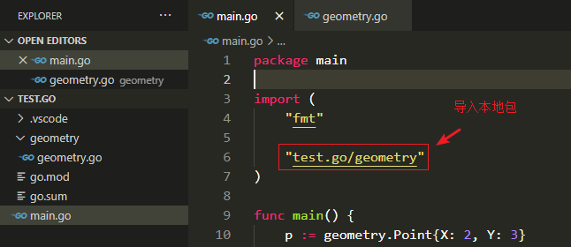

==**面向对象编程（OOP）的编程思想**==在工业领域和教学领域占据了主导位置，而且几乎所有广泛应用的编程语言都支持了这种思想。Go 语言也不例外！尽管没有统一的面向对象编程的定义，对我们来说，**对象就是简单的一个值或者变量，并且拥有其方法**，而==方法是某种特定类型的函数==。面向对象编程就是**使用方法来描述每个数据结构的属性和操作**，于是，使用者不需要了解对象本身的实现。

> 方法是某种特定类型的函数。也就是说方法是和函数有一定天然关系的，函数是不面向特定类型，而方法却是面向特定类型的。

从 90 年代早期开始，面向对象 OOP 就成为了称霸工程界和教育界的编程范式，所以之后几乎所有大规模被应用的语言都包含了对 OOP 的支持，Go 语言也不例外。

从 90 年代早期开始，面向对象 OOP 就成为了称霸工程界和教育界的**编程范式**，所以之后几乎所有大规模被应用的语言都包含了对 OOP 的支持，Go 语言也不例外。

尽管没有被大众所接受的明确的 OOP 的定义，从我们的理解来讲，一个**对象**其实也就是一**个简单的值或者一个变量**，在这个对象中会包含**一些方法**，而**一个方法则是一个个和特殊类型关联的函数**。一个面向对象的程序会**用方法来表达其属性和对应的操作**，这样使用这个对象的用户就不需要直接去操作对象，而是**借助方法来做这些事情**。既然说到面向对象编程，那肯定要谈到==『对象』==的概念。

> 方法也是一个普通的函数，而只是这个函数是和类型相关联在一起的。
>
> 为什么将方法和 OOP 编程思想说到一块？**Go 语言中的面向对象就是通过“方法”实现的**。

在早些的章节，我们已经使用了标准库提供的一些方法，比如 `time.Duration` 这个类型的 Seconds 方法：

~~~go
const day = 24 * time.Hour
fmt.Println(day.Seconds())
~~~

并且在『程序结构』章节，我们定义了一个自己的方法，`Celsius` 类型的 String 方法：

~~~go
func (c Celsius) String() string {
    return fmt.Sprintf("%g°C", c)
}
~~~

在本章中，OOP 编程的第一方面，我们会向你展示如何有效地定义和使用方法，我们会==覆盖到 OOP 编程的两个关键点：封装和组合==。

# 方法声明

内容导读：

* 方法和函数的区别；
* 方法的接收器 Receiver；

**在函数声明时，在其名字之前放上一个变量，即是一个方法**。这个**附加**的参数会将该函数附加到这种类型上，即相当于**为这种类型**定义了一个**独占的**方法。

在方法里面，和方法相关联的对象，叫做==方法的接收器==（Receiver）。用这种声明方式，**让函数和对象绑定在一起**，我们称之为方法的声明。下面来写我们第一个方法的例子，这个例子在 package geometry 下：

~~~go
package geometry

import "math"

type Point struct { X, Y float64}

func Distance(p, q Point) float64 {
    // 调用的是 math 包下的 Hypot 方法
    return math.Hypot(q.X - p.X, q.Y - p.Y)
}

func (p Point) Distance(q Point) float64 {
    return math.Hypot(q.X - p.X, q.Y - p.Y)
}
~~~

上面的代码里那个附加的参数 p，叫做**方法的接收器（Receiver）**，早期的面向对象语言留下的遗产将调用一个方法**称为“向一个对象发送消息”**。

在 Go 语言中，我们并不会向其他语言那样用 this 或者 self 作为接收器；我们可以任意地选择接收器的名字。由于接收器的名字经常会被使用到，所以**保持其在方法间传递时的一致性和简短性是不错的主意**。这里的建议是可以使用其类型的第一个字母，比如这里使用了 Point 首字母 p。

在**方法调用过程中，接收器参数一般会在方法名之前出现**。这和方法声明是一样的，都是接收参数在方法名字之前。下面是例子：

~~~go
p := Point(1, 2)
q := Point(4, 6)
fmt.Println(Distance(p, q))
fmt.Println(p.Distance(q))
~~~

可以看到，上面的两个函数调用都是 Distance，但是却没有发生冲突。第一个 Distance 的调用实际上用的是包级别的函数 `geometry.Distance`，而第二个则是使用刚刚声明的 Point，调用的是 ==Point 类==下声明的 `Point.Distance` 方法。

> 第一次出现『Point 类』这样的表述！
>
> `type Point struct { X, Y float64}` 声明了 Point 类，但是并没有出现类似 class 的关键词！

这种 `p.Distance` 的表达式叫做==选择器==，因为它会**选择合适的对应 p 这个对象的 Distance 方法来执行**。选择器也会被用来**选择 struct 类型的字段**，比如 `p.X`。==**由于方法和字段都是在同一命名空间，所以如果我们在这里声明一个 X 方法的话，编译器会报错**==。因为在调用 `p.X` 时**会有歧义**。如下述代码：

~~~go
package main

import "fmt"

type Point struct {
	X float64
	Y float64
}

func (p Point) X() {
    fmt.Println(p.X) // compiler error: field and method with the same name X
}

func main() {
    p := Point{2, 3} // 注意：结构体的初始化赋值用的是 {}
	fmt.Println(p.X, p.Y)
}
~~~

因为每种类型都有其方法的命名空间，我们在用 Distance 这个名字的时候，**不同的 Distance 调用指向了不同类型里的 Distance 方法**。让我们来定义一个 Path 类型，这个 Path 代表一个线段的集合，并且也给这个 Path 定义一个叫 Distance 方法：

~~~go
type Path []Point // 新定义的类型，其底层数据结构就是 []Point 切片类型

func (path Path) Distance() float64 {
    sum := 0.0
    for i := range path {
        if i > 0 {
            sum += path[i - 1].Distance(path[i])
        }
    }
    return sum
}
~~~

Path 是**一个命名的 slice 类型**，而不是 Point 那样的 struct 类型，然而我们依然可以为它定义方法。在**能够给任意类型定义方法**这一点上，Go 和很多其他的面向对象的语言不太一样。因此==在 Go 语言里，我们为一些简单的数值、字符串、slice、map 来定义一些附加行为很方便==。我们可以给同一个包内的任意类型定义方法，只要==这个命名类型==的底层类型（这个例子中，Path 底层类型是指 []Point 这个 slice，Path 就是命名类型）**不是指针或者 interface**。

~~~go
type Ptype *int8

func (pt Ptype) fun() { // compile error: invalid receiver Ptype (pointer or interface type)
    // do something
}
~~~

两个 Distance 方法有不同的类型，他们两个方法之间没有任何关系，尽管 Path 的 Distance 方法会在内部调用 `Point.Distance` 方法来计算每个连接邻接点的线段的长度。

让我们来调用一个新方法，**计算三角形的周长**：

~~~go
package main

import (
	"fmt"
	"math"
)

type point struct {
	X float64
	Y float64
}

func (p point) distance(q point) float64 {
	return math.Hypot(q.X-p.X, q.Y-p.Y)
}

func distance(p, q point) float64 {
	return math.Hypot(q.X-p.X, q.Y-p.Y)
}

type path []point

func (path path) distance() float64 {
	sum := 0.0
	for i := range path {
		if i > 0 {
			sum += path[i-1].distance(path[i])
		}
	}
	return sum
}

func main() {
	p := point{2, 3}
	q := point{2, 5}
	fmt.Println(p.X, p.Y)

	fmt.Println("distance:", distance(p, q))
	fmt.Println("distance:", p.distance(q))

	perim := path{
		{1, 1},
		{5, 1},
		{5, 4},
		{1, 1},
	}
	fmt.Println("distance:", perim.distance())
}
~~~

上面两个对 distance 名字的方法的调用中，**编译器会根据方法的名字以及接收器（的类型）来决定具体调用的是哪一个函数**。第一个例子中 `path[i - 1]` 数组中的类型是 point，因此 `point.distance` 这个方法被调用；在第二个例子中 `perim` 的类型是 path（也即是 `[]point`），因此 distance 调用的是 `path.distance`。

**对于一个给定的类型，其内部的方法都必须有唯一的方法名，但是不同的类型却可以有相同的方法名**，比如我们这里的 point 和 path 都有 distance 这个名字的方法：

~~~go
func (p Point) f(x int) (err error) {
	defer func() {
		if p := recover(); p != nil {
			err = fmt.Errorf("internal error: %v", p)
		}
	}()

	fmt.Printf("f(%d)\n", x+0/x)

	return err
}

func (p Path) f(x int) (err error) {
	defer func() {
		if p := recover(); p != nil {
			err = fmt.Errorf("internal error: %v", p)
		}
	}()

	fmt.Printf("f(%d)\n", x+0/x)

	return err
}
~~~

所以我们**==没有必要非在方法名之前加类型名来消除歧义==**，比如 `pathDistance`。这里我们已经看到了方法相对函数的一些好处：方法名可以简短。当我们**在包外调用的时候这种好处就会被放大**。因为我们可以使用这个短名字，而可以省略掉包的名字。**在执行方法调用时，根据选择器的类型调用对应的方法**。

~~~go
package main

import (
	"fmt"

	"test.go/geometry"
)

func main() {
	p := geometry.Point{X: 2, Y: 3}
	q := geometry.Point{X: 2, Y: 5}
	fmt.Println(p.X, p.Y)

	fmt.Println("distance:", geometry.Distance(p, q))
    // 跨包（在 main 包中调用 geometry 包中）调用方法时，该方法必须是可导出的
	fmt.Println("distance:", p.Distance(q))

	perim := geometry.Path{
		{X: 1, Y: 1},
		{X: 5, Y: 1},
		{X: 5, Y: 4},
		{X: 1, Y: 1},
	}
	fmt.Println("distance:", perim.Distance())
}
~~~

如果我们要用方法去计算 `perim` 的 distance，还需要去写全 geometry 的包名，和其函数名，但是因为 Path 这个类型定义了一个可以直接用的 Distance 方法，所以我们可以直接写 `perim.Distance()`（**直接通过 `perim` 变量调用方法实现**）。相当于可以少打很多字。因为在 Go 里保外调用函数需要带上包名，还是挺麻烦的。

对应 geometry 目录下的 `geometry.go`：

~~~go
package geometry

import (
	"math"
)

type Point struct {
	X float64
	Y float64
}

func (p Point) Distance(q Point) float64 {
	return math.Hypot(q.X-p.X, q.Y-p.Y)
}

func Distance(p, q Point) float64 {
	return math.Hypot(q.X-p.X, q.Y-p.Y)
}

type Path []Point

func (path Path) Distance() float64 {
	sum := 0.0
	for i := range path {
		if i > 0 {
			sum += path[i-1].Distance(path[i])
		}
	}
	return sum
}
~~~

# 基于指针对象的方法

内容导读：

* 用指针而不是对象作为接收器的区别；
* 编译器的隐式调用实现；
* Go 语言中的引用类型和非引用类型在函数调用中的区别。

当**调用一个函数**时，会**对其每一个参数值进行拷贝**。如果一个函数需要更新一个变量，或者函数的其中一个参数实在太大我们希望能够避免进行**这种默认的拷贝**，这种情况下我们就需要**用到指针**了。==对应到我们这里用来更新**接收器的对象**的方法，当这个接收者变量本身比较大时，我们就可以用其指针而不是对象来声明方法==，如下：

~~~go
func (p *Point) ScaleBy(factor float64) {
    p.X *= factor
    p.Y *= factor
}

func main() {
    var p = Point{1, 1}
    var q = Point{5, 4}
    fmt.Println(p.Distance(q)) // 5
    
    p.ScaleBy(2) // {2 2}
	q.ScaleBy(2) // {10 8}

	fmt.Println(p.Distance(q)) // 10
}
~~~

这个方法的名字是 `(*Point).ScaleBy`。这里的括号是必须的，没有括号的话这个表达式可能会被理解为：`*(Point.ScaleBy)`。对于上述声明的方法，方法==接收器==类型为 `*Point`，实际调用者称为是==接收器实参==。

> `(*Point).ScaleBy` 类型的方法，为什么在调用该方法时可直接使用 Point 对象？这个疑问在后文有解释。

与上面形成鲜明对比的是下述程序实现：方法接收器类型是 `Point` 时，调用它的这个方法也就会==产生一个值的拷贝==。==而对这个拷贝的修改，不会影响到原对象==。

~~~go
func (p Point) ScaleBy(factor float64) {
	p.X *= factor
	p.Y *= factor
}

func main() {
    var p = Point{1, 1}
    var q = Point{5, 4}
    fmt.Println(p.Distance(q)) // 5
    
    p.ScaleBy(2) // {1 1}
	q.ScaleBy(2) // {5 4}

	fmt.Println(p.Distance(q)) // 5
}
~~~

在现实的程序里，一般会约定如果 Point 这个类有**一个指针作为接收器**的方法，那么所有 Point 的方法都必须有一个指针接收器，即使是那些并不需要这个指针接收器的函数。我们在这里打破了这个约定只是为了展示一下两个方法的异同而已。

**只有类型（Point）和指向他们的指针`(*Point)`，才可能是出现在接收器声明里的==两种接收器==**。此外，为了避免歧义，在声明方法时，如果一个类型名本身是一个指针的话，是不允许其出现在接收器中的，比如下面的例子：

~~~go
type P *int
func (P) f() { /* ... */ } // 不允许出现
~~~

想要调用指针类型方法 `(*Point).ScaleBy`，只要**提供一个 Point 类型的指针**即可，像下面这样：

~~~go
r := &Point{1, 2} // r 默认是 Point 的指针变量
r.ScaleBy(2)
fmt.Println(*r) // {2, 4}
~~~

或者这样：

~~~go
p := Point{1, 2}
pptr := &p
pptr.ScaleBy(2)
fmt.Println(p) // {2, 4}
~~~

或者这样：

~~~go
p := Point{1, 2}
(&p).ScaleBy(2)
fmt.Println(p) // {2, 4}
~~~

不过后面两种方法有些笨拙。幸运的是，Go 语言本身在这种地方会帮到我们。如果 **p 是一个 Point 类型的变量**，并且**其方法需要一个 Point 指针作为接收器**，我们可以用下面这种简短的写法：

~~~go
package main

import "fmt"

type Point struct {
	X float64
	Y float64
}

// ScaleBy 方法需要一个 Point 指针作为接收器
func (p *Point) ScaleBy(factor float64) {
	p.X *= factor
	p.Y *= factor
}

func main() {
	r := &Point{1, 2}

	r.ScaleBy(2)
	fmt.Println(*r)

    // 简短写法
	x := Point{2, 3}
	x.ScaleBy(3)
	fmt.Println(x)
}
~~~

**编译器会隐式地帮我们用 `&p` 去调用 `ScaleBy` 这个方法**。这种简写方法只适用于“变量”，包括 struct 里的字段比如 `p.X`，以及 array 和 slice 内的元素比如 `perim[0]`。我们不能通过**一个无法取到地址的接收器**来调用指针方法，比如**临时变量**的内存地址就无法获取得到：

~~~go
Point{1, 2}.ScaleBy(2) // compile error: can't take address of Point literal
~~~

但是我们可以**用一个 `*Point` 这样的接收器**来**调用 Point 方法**，因为我们可以通过地址来找到这个变量，只要用解引用符号 `*` 来取到该变量即可。编译器在这里也会给我们**隐式地**插入 `*` 这个操作符，所以下面这两种写法等价：

~~~go
package main

import (
	"fmt"

	"test.go/geometry"
)

func main() {
	p := geometry.Point{X: 2, Y: 3}
	q := geometry.Point{X: 2, Y: 5}
	fmt.Println(p.X, p.Y)

	fmt.Println("distance:", geometry.Distance(p, q))
	fmt.Println("distance:", p.Distance(q))

    // ...

	pptr := &p
    // 调用 Distance 方法时，给的接收器是 *Pointer 类型
	fmt.Println("pptr.Distance(q):", pptr.Distance(q))
	fmt.Println("(*pptr).Distance(q):", (*pptr).Distance(q))
}
~~~

其中 `Distance` 方法定义如下：

~~~go
func (p Point) Distance(q Point) float64 {
	return math.Hypot(q.X-p.X, q.Y-p.Y)
}
~~~

这里的几个例子可能让你有些困惑，所以我们总结一下：在每一个合法的方法调用表达式中，也就是下面三种情况里的任意一种情况都是可以的：

不论**接收器的实际参数和其形式参数是相同**，比如两者都是类型 T 或者都是类型 `*T`：

~~~go
Point{1, 2}.Distance(q)
pptr.ScaleBy(2)
~~~

或者（不同）**接收器实参**是类型 T，但**接收器形**参是类型 `*T`，这种情况下**编译器会隐式地为我们取变量的地址**：

~~~go
p.ScaleBy(2) // implicit (&p)
~~~

或者（不同）**接收器实参**是类型 `*T`，但**接收器形参**是类型 T，这种情况下**编译器会隐式地为我们解引用并取到指针指向的实际变量**：

~~~go
pptr.Distance(q) // implicit (*pptr)
~~~

总结如下：如果是 `func (p *Point) ScaleBy(factor float64)` 这种方式，两种调用方式都行；如果是 `func (p Point) ScaleBy(factor float64)`，两种调用方法会也都是可行的。

如果命名类型 T（用 type xxx 定义的类型）的所有方法都是用 T 类型自己来做接收器（而不是 `*T`），那么==拷贝这种类型的实例==就是安全的；==调用它的任何一个方法也就会产生一个值的拷贝==。比如 `time.Duration` 的这个类型，在调用其方法时就会被全部拷贝一份，包括在**作为参数传入其他函数的时候**。

> ==这里有一个疑问==：为什么调用命名类型 T 的任何一个方法就会产生一个值的拷贝？

~~~go
// A Duration represents the elapsed time between two instants
// as an int64 nanosecond count. The representation limits the
// largest representable duration to approximately 290 years.
type Duration int64

// Seconds returns the duration as a floating point number of seconds.
func (d Duration) Seconds() float64 {
	sec := d / Second
	nsec := d % Second
	return float64(sec) + float64(nsec)/1e9
}
~~~

但是**如果一个方法使用指针作为接收器**，你需要避免对其进行拷贝，因为这样可能会破坏掉该类型内部的不变性。比如你的 `bytes.Buffer` 对象进行了拷贝，那么**可能会引起原始对象和拷贝对象只是别名而已，实际上它们指向的对象是一样的**。紧接着对拷贝后的变量进行修改可能会有让你意外的结果。

~~~go
// A Buffer is a variable-sized buffer of bytes with Read and Write methods.
// The zero value for Buffer is an empty buffer ready to use.
type Buffer struct {
	buf      []byte // contents are the bytes buf[off : len(buf)]
	off      int    // read at &buf[off], write at &buf[len(buf)]
	lastRead readOp // last read operation, so that Unread* can work correctly.
}

// Write appends the contents of p to the buffer, growing the buffer as
// needed. The return value n is the length of p; err is always nil. If the
// buffer becomes too large, Write will panic with ErrTooLarge.
func (b *Buffer) Write(p []byte) (n int, err error) {
	b.lastRead = opInvalid
	m, ok := b.tryGrowByReslice(len(p))
	if !ok {
		m = b.grow(len(p))
	}
	return copy(b.buf[m:], p), nil
}
~~~

作者这里说得比较绕，其实有 2 点：

1. 不管你的 method 的 Receiver 是指针类型还是非指针类型，都是可以通过指针/非指针类型进行调用的，编译器会帮你做类型转换；
2. 在声明一个 method 的 Receiver 该是指针还是非指针类型时，你需要考虑两方面的因素。第一方面是这个对象本身是不是特别大，如果声明为非指针变量时，调用会产生一次==拷贝==。第二方面是如果你用指针类型作为 Receiver，那么你一定要注意，这种指针类型指向的始终是一块内存地址，就算你对其进行了拷贝。

来看下面的例子：

~~~go
package main

import (
	"fmt"
	"math"
)

type Point struct {
	X float64
	Y float64
}

func (p Point) ScaleBy(factor float64) {
	p.X *= factor
	p.Y *= factor
}

func main() {
	var q = Point{5, 4}
    
	var pptr = &q
	pptr.ScaleBy(2)
    // [5 4]
	fmt.Println(*pptr)
}
~~~

`ScaleBy` 方法的接收器是 Point 类型，如果使用 `*Point` 类型的变量去调用 `ScaleBy` 方法，则**编译器会隐式地为我们解引用并取到指针指向的实际变量**，也就是会执行 `*pptr` 取到指针指向的变量 `q` 并执行方法。因此，==不会改变原对象==。

就像一些函数允许 nil 指针作为参数一样，方法理论上也可以用 nil 指针作为其接收器，尤其当 nil 对于对象来说是合法的零值时，比如 map 或者 slice。在下面的简单 `int` 链表的例子里，nil 代表的是空链表：

~~~go
// An IntList is a linked list of integers.
// A nil *IntList represents the empty list.
type IntList struct {
    Value int
    Tail *IntList
}

func (list *IntList) Sum() int {
    if list == nil {
        return 0
    }
    return list.Value + list.Tail.Sum()
}
~~~

当你定义一个允许 nil 作为接收器值的方法的类型时，在类型前面的注释中指出 nil 变量代表的意义是很有必要的，就像我们上面例子里做的这样。

下面是 `net/url` 包里 Values 类型定义的一部分：

~~~go
package url

// Values maps a string key to a list of values.
type Values map[string][]string
// Get returns the first value associated with the given key,
// or "" if there are none.
func (v Values) Get(key string) string {
    if vs := v[key]; len(vs) > 0 {
        return vs[0]
    }
    return ""
}
// Add adds the value to key.
// It appends to any existing values associated with key.
func (v Values) Add(key, value string) {
    v[key] = append(v[key], value)
}
~~~

这个定义向外暴露了一个 map 的命令类型，并且提供了一些能够简单操作这个 map 的方法。这个 map 的 value 字段是一个 string 的 slice，所以这个 Values 是一个多维 map。客户端使用这个变量的时候可以使用 map 固有的一些操作（make、切片、m[key]等等），也可以使用这里提供的操作方法，或者两者并用，都是可以的：

~~~go
package main

import (
	"fmt"
	"net/url"
)

func main() {
    // m 变量是 Values:map[string][]string 类型
	m := url.Values{"lang": {"en"}} // direct construction
	m.Add("item", "1")
	m.Add("item", "2")

	fmt.Println(m.Get("lang")) // "en"
	fmt.Println(m.Get("q"))    // ""
	fmt.Println(m.Get("item")) // "1"      (first value)
	fmt.Println(m["item"])     // "[1 2]"  (direct map access)

	m = nil
	fmt.Println(m.Get("item")) // ""
	m.Add("item", "3")         // panic: assignment to entry in nil map
}
~~~

对 Get 的最后一次调用中，nil 接收器的行为即是一个空 map 的行为。我们可以等价地将这个操作写成 `Value(nil).Get("item")`，但是如果你直接写 `nil.Get("item")` 的话是无法通过编译的。因为 nil 的字面量编译器无法判断其准确类型。所以相比之下，最后的 `m.Add` 的调用就会产生一个 panic，因为它尝试更新一个空 map。

由于 `url.Values` 是**一个 map 类型**，并且间接引用了其 key/value 对，因此 `url.Values.Add` 对这个 map 里的元素做任何的更新、删除操作对调用方都是可见的。实际上，就像在普通函数中一样，虽然可以通过引用来操作内部值，但在方法想要修改引用本身时是不会影响原始值的，比如把他置换为 nil，或者让这个引用指向了其他的对象，调用方都不会受影响。因为传入的是存储了内存地址的变量，改变了这个变量本身是影响不了原始的变量的。

==关于【方法】的内容，有如下两种程序写法需要区分==：

~~~go
package main

import "fmt"

type Point struct {
	X float64
	Y float64
}

func (p Point) ScaleBy(factor float64) {
	p.X *= factor
	p.Y *= factor
}

func main() {
	r := &Point{1, 2}

	r.ScaleBy(2)
	fmt.Println(*r)

	// 简短写法
	x := Point{2, 3}
	x.ScaleBy(3)
	fmt.Println(x)
}
~~~

`func (p Point) ScaleBy(factor float64)` 如上所示，方法接收器是 `Point` 类型，在 main 中调用该方法默认使用了 2 种不同方式：`&Point{1, 2}` 和 `Point{2, 3}`。对于前者，编译器会默认插入 `*` 运算符，对 `&Point{1, 2}` 执行解引用操作，获得对应的 `Point` 类型对象，紧接着和 `Point{2, 3}` 的调用相类似。上述方法在调用 `func (p Point) ScaleBy(factor float64)` 后，**均不会修改原对象**。

与之类似的是，声明方法为：`func (p *Point) ScaleBy(factor float64)`

~~~go
package main

import "fmt"

type Point struct {
	X float64
	Y float64
}

// ScaleBy 方法需要一个 Point 指针作为接收器
func (p *Point) ScaleBy(factor float64) {
	p.X *= factor
	p.Y *= factor
}

func main() {
	r := &Point{1, 2}

	r.ScaleBy(2)
	fmt.Println(*r)

	// 简短写法
	x := Point{2, 3}
	x.ScaleBy(3)
	fmt.Println(x)
}
~~~

**上述 2 种调用方法均能够修改原对象**！其本质在于 `ScaleBy` 方法中，使用的是 `*Point` （对象的指针），指针指向的是内存地址，该地址存储的是对象值。因此，使用 `*Point` 类型会修改原对象内容。

和 Java 进行比较：

~~~go
public static class Point{
    private int x;
    private int y;

    public Point(int x, int y){
        this.x = x;
        this.y = y;
    }

    public void setX(int x){
        this.x = x;
    }

    public void setY(int y){
        this.y = y;
    }

    @Override
    public String toString() {
        return "Point{" +
                "x=" + x +
                ", y=" + y +
                '}';
    }
}

public static void changePoint(Point point, int x, int y){
    if(point != null){
        point.setX(x);
        point.setY(y);
    }
}

public static void main(String[] args) {
    Point point = new Point(1, 2);
    // before change:Point{x=1, y=2}
    System.out.println("before change:" + point.toString());

    changePoint(point, 3, 4);
    // after change:Point{x=3, y=4}
    System.out.println("after change:"+point.toString());

}
~~~

**在 Java 中，是不存在指针的，但有“对象引用”的概念**。方法在封装时，如果参数包含了对象，则方法体中对该对象的修改，默认都会修改原对象内容。Java 是值传递，但是 `Point point = new Point(1, 2);` 中 point 引用创建的对象。

Java 中数据类型分为两大类：**基本类型**和**对象类型**。相应的，变量也有两种类型：基本类型和引用类型。基本类型的变量保存原始值，即代表该变量的值就是数值本身；引用类型的变量保存了变量的引用值，“引用值”值向内存空间的地址，代表了某个对象的引用，而不是对象本身。对象本身存放在这个引用值所表示的地址的位置。

比如上述 `void changePoint(Point point, int x, int y)` 方法调用时，实际参数的引用被传递给方法中相对应的形式参数，形参接收的是原始值的内存地址。在方法执行时，形参和实参内容相同，指向同一块内存地址，方法执行中对引用的操作将会影响到实际对象。

下面对数组、切片、map 做进一步的测试：

~~~go
package main

import "fmt"

// Values maps a string key to a list of values.
type Values map[string][]string

// Get returns the first value associated with the given key,
// or "" if there are none.
func (v Values) Get(key string) string {
	if vs := v[key]; len(vs) > 0 {
		return vs[0]
	}
	return ""
}

// Add adds the value to key.
// It appends to any existing values associated with key.
func (v Values) Add(key, value string) {
	v[key] = append(v[key], value)
	fmt.Printf("%p\n", v) // 0xc00006e330
}

func main() {
	// Values 类型本质上是 map[string][]string，具有引用属性
	m := Values{"lang": {"en"}}
	fmt.Println(m)
	fmt.Printf("%p\n", m) // 0xc00006e330

	m.Add("item", "1")
	m.Add("item", "2")
	fmt.Println(m)
}

~~~

具有引用属性的变量，可以使用 `fmt.Printf("%p\n", v)` 直接输出对应的内存地址。我们实际可以看出 Values 引用类型的值作为接收器时，实际 Add 方法是对该引用做操作的，其会影响所有的引用。

数组变量声明时，是否其值可为 nil？数组变量值不可为 nil。与之相关的 slice 其值则可以是 nil！

~~~go
package main

import "fmt"

// Values maps a string key to a list of values.
type Values [3]string

// Add adds the value to key.
// It appends to any existing values associated with key.
func (v Values) Change(value string) {
	fmt.Printf("%p\n", &v)
	v[0] = value
}

func main() {
	// Values 类型本质上是 [3]string，具有引用属性
	m := Values{"lang", "en", "ch"}
	fmt.Println(m) // [lang en ch]
	fmt.Printf("%p\n", &m)

	m.Change("cher")
	fmt.Println(m) // [lang en ch]
}
~~~

不具有引用属性的变量，则需要使用 `fmt.Printf("%p\n", &v)` 才能得到对应的内存地址。如果是数组（非引用类型），在其上的改动并不会影响原来的数组，仅仅是做了内容的拷贝。

那现在稍微变动一下，从 `[3]string` 变化到 `[]string`：

~~~go
package main

import "fmt"

// Values maps a string key to a list of values.
type Values []string

// Add adds the value to key.
// It appends to any existing values associated with key.
func (v Values) Change(value string) {
	fmt.Printf("%p\n", v) // 0xc0000b8330
	v[0] = value
}

func main() {
	// Values 类型本质上是 [3]string，具有引用属性
	m := Values{"lang", "en", "ch"}
	fmt.Println(m) // [lang en ch]
	fmt.Printf("%p\n", m) // 0xc0000b8330

	m.Change("cher")
	fmt.Println(m) // [cher en ch]
}
~~~

从 `[3]string` 变化到 `[]string`，前者不具有引用属性，而后者则具有引用属性。而 `[]string` 具有引用属性，从 `Change(value string)` 方法的调用中，我们打印出了 `v Values` 方法接收器的内存地址，从结果可以看到出：实际上，修改的是相同内存地址的变量！

# 通过嵌入结构体来扩展类型

内容导读：

* 结构体中包含有匿名的字段；
* 匿名字段是命名类型的指针；

来看看 `ColoredPoint` 这个类型：

~~~go
import "image/color"

type Point struct{ X, Y float64 }
type ColoredPoint struct {
    Point
    Color color.RGBA
}
~~~

我们完全可以将 `ColoredPoint` 定义为一个有三个字段的 struct，但是我们却将 Point 这个类型==嵌入==到 `ColoredPoint` 来提供 X 和 Y 这两个字段（==内嵌的匿名字段==）。==内嵌==可以使我们在定义 `ColoredPoint` 时得到一种句法上的简写形式，并**使其包含 Point 类型所具有的一切字段**，然后再定义一些自己的。如果我们想要的话，**我们可以直接认为通过嵌入的字段就是 `ColoredPoint` 自身的字段**，而**完全不需要在调用时指出 Point**，比如下面这样：

~~~go
func main() {
    var cp ColoredPoint
    cp.X = 1
    fmt.Println(cp.Point.X) // 1
    cp.Point.Y = 2
    fmt.Println(cp.Y) // 2
}
~~~

对于 Point 中的方法我们也有类似的用法，**我们可以把 `ColoredPoint` 类型当作接收器来调用 Point 里的方法，即使 `ColoredPoint` 里没有声明这些方法**：

~~~go
package main

import (
	"fmt"
	"image/color"
	"math"
)

type Point struct{ X, Y float64 }

func (p Point) Distance(q Point) float64 {
	return math.Hypot(p.X-q.X, p.Y-q.Y)
}

func (p *Point) ScaleBy(factor float64) {
	p.X *= factor
	p.Y *= factor
}

type ColoredPoint struct {
	Point
	Color color.RGBA
}

func main() {
	red := color.RGBA{255, 0, 0, 255}
	blue := color.RGBA{0, 0, 255, 255}

	var p = ColoredPoint{Point{1, 1}, red}
	var q = ColoredPoint{Point{5, 4}, blue}
	fmt.Println(p.Distance(q.Point))

	// ScaleBy 是 Point 命名类型的方法，现在 ColoredPoint 可以直接调用该方法
	p.ScaleBy(2)
	q.ScaleBy(2)
	// Distance 参数是 Point 类型，必须显示给定实参为 Point 类型
	fmt.Println(p.Distance(q.Point))
}
~~~

Point 类的方法也被引入了 `ColoredPoint`。用这种方式，==**内嵌可以使我们定义字段特别多的复杂类型**==，我们可以将字段先按小类型分组，然后定义小类型的方法，之后再把它们==**组合**==起来。

读者如果对基于类来实现面向对象的语言比较熟悉的话，可能会倾向于将 ==Point== 看作一个基类，而 `ColoredPoint ` 看作其子类或者继承类，或者将 `ColoredPoint` 看作 `is a ` Point 类型。但这是错误的理解。请注意上面例子中对 Distance 方法的调用。Distance 有一个==参数==是 Point 类型，但 q 并不是一个 Point 类，所以尽管 q 有着 Point 这个**内嵌类型**，我们也==必须要显式地选择它==。尝试直接传 q 的话会看到下面这样的错误：`cannot use q (variable of type ColoredPoint) as Point value in argument to p.Distance`

一个 `ColoredPoint` 并不是一个 Point，但它 `has a Point`，并且它有从 Point 类里引入的 Distance 和 `ScaleBy` 方法。如果你喜欢**==从实现的角度来考虑==**问题，**内嵌字段会指导编译器去生成额外的包装方法来委托已经声明要的方法**，和下面的形式是等价的：

~~~go
func (p ColoredPoint) Distance(q Point) float64 {
    // 包装方法，将 ColoredPoint 委托给 p.Point
    return p.Point.Distance(q)
}

func (p *ColoredPoint) ScaleBy(factor float64) {
    // 包装方法，将 ColoredPoint 委托给 p.Point
    p.Point.ScaleBy(factor)
}
~~~

当 `Point.Distance` 被第一个包装方法调用时，它的接收器值是 `p.Point`，而不是 p。当然了，在 Point 类的方法里，你是访问不到 `ColoredPoint` 的任何字段的。

在类型中**内嵌的匿名字段**也可能是一个**命名类型的指针**，这种情况下字段和方法会被间接地引入到当前的类型中（访问需要通过该指针指向的对象去取）。添加这一层**间接关系**让我们可以共享通用的结构并动态地改变对象之间的关系。下面这个 `ColoredPoint` 的声明内嵌了一个 `*Point` 的指针：

~~~go
...

type ColoredPoint struct {
	*Point                          // 是一个匿名字段，也就是没有名称
	Color color.RGBA
}

func main() {
	red := color.RGBA{255, 0, 0, 255}
	blue := color.RGBA{0, 0, 255, 255}

	var p = ColoredPoint{&Point{1, 1}, red}
	var q = ColoredPoint{&Point{5, 4}, blue}
    // 等价于：*(q.Point)
	fmt.Println(p.Distance(*q.Point)) // 5

	q.Point = p.Point // p and q now share the same Point
	p.ScaleBy(2)
	// 等价于：*(p.Point) *(q.Point)
	fmt.Println(*p.Point, *q.Point) // {2, 2} {2, 2}
}
~~~

> Go 语言运算符优先级：`.` 操作符的优先级高于 `*`

一个 struct 类型也可能会有多个匿名字段，我们将 `ColoredPoint` 定义为下面这样：

~~~go
type ColoredPoint struct {
    Point
    color.RGBA
}
~~~

然后这种类型的值便会拥有 Point 和 RGBA 类型的所有方法，以及直接定义在 `ColoredPoint` 中的方法。当编译器解析一个选择器的方法时，比如 `p.ScaleBy`，它会首先去找直接定义在这个类型里的 `ScaleBy` 方法，然后找被 `ColoredPoint` 的内嵌字段们引入的方法（Point 和 RGB 中定义的方法），然后去找 `Point` 和 `RGB` 的内嵌字段引入的方法，然后一直递归向下找。如果选择器有二义性的话编译器会报错。

# 方法值和方法表达式

内容导读：

* 方法值
* 方法表达式
* 两种不同绑定接收者的方式

我们经常选择一个方法，并且在同一个表达式里执行，比如常见的 `p.Distance()` 形式，实际上将其分为两步来执行也是可能的。`p.Distance` 叫做“选择器”，**选择器会返回一个方法“值”**——**一个将方法（`Point.Distance`）绑定到特定接收器变量的函数**。这个函数可以不通过指定其接收器即可被调用；即调用时不需要指定接收器，只要传入函数的参数即可：

~~~go
func main() {
	p := Point{1, 2}
	q := Point{4, 6}

	distanceFromP := p.Distance
	fmt.Println(distanceFromP(q)) // 可直接调用

	var origin Point
	fmt.Println(distanceFromP(origin)) // 可直接调用

	scaleP := p.ScaleBy
	scaleP(2) // 可直接调用
	fmt.Println(p)
}
~~~

在一个包的 API 需要一个函数值且调用方希望操作的是某一个绑定了对象的方法的话，方法“值”会非常实用。举例来说，下面例子中的 `time.AfterFunc` 这个函数的功能是在指定的延迟时间之后来执行另外一个函数，且这个函数操作的是一个 `Rocket` 对象：

~~~go
package main

import (
	"fmt"
	"time"
)

type Rocket struct {
}

func (r *Rocket) Launch() {
	fmt.Println("Launch!")
}

func main() {
	fmt.Println("Start!")
	var rocket = new(Rocket)
	go time.AfterFunc(5*time.Second, rocket.Launch)  // Launch 方法和 rocket 绑定在一起

	time.Sleep(10 * time.Second)
}
~~~

和方法“值”相关的还有==方法表达式==。当调用一个方法时，与调用一个普通的函数相比，我们必须要用选择器（`p.Distance`）语法来指定方法的接收器。

当 T 是一个类型时，方法表达式可能会写作 `T.f` 或者 `(*T).f`，会返回一个函数“值”，==**这种函数会将其第一个参数用作接收器**==，所有可以用通常（不写选择器）的方式来对其进行调用：

~~~go
package main

import (
	"fmt"
	"math"
)

type Point struct{ X, Y float64 }

func (p Point) Distance(q Point) float64 {
	return math.Hypot(p.X-q.X, p.Y-q.Y)
}

func (p *Point) ScaleBy(factor float64) {
	p.X *= factor
	p.Y *= factor
}

func main() {
	p := Point{1, 2}
	q := Point{4, 6}

	distance := Point.Distance 
    fmt.Println(distance(p, q))               // 方法表达式 distance(p, q) 将接收者 p 作为第一个参数
    // func(main.Point, main.Point) float64
	fmt.Printf("%T\n", distance)

	scaleBy := (*Point).ScaleBy
	scaleBy(&p, 2)
	fmt.Println(p) // {2 4}

	// func(*main.Point, float64)
	fmt.Printf("%T\n", scaleBy)
}
~~~

当你根据一个变量来决定调用同一个类型的哪个函数时，方法表达式就显得很有用了。你可以根据选择来调用接收器各不相同的方法。下面的例子，变量 op 代表 Point 类型的 addition 或者 subtraction 方法，`Path.TranslateBy` 方法会为其 Path 数组中的每个 Point 来调用对应的方法：

~~~go
package main

import (
	"fmt"
)

type Point struct {
	X, Y float64
}

func (p Point) Add(q Point) Point {
	fmt.Printf("%p, %p\n", &p, &q)
	return Point{p.X + q.X, p.Y + q.Y}
}

func (p Point) Sub(q Point) Point {
	return Point{p.X - q.X, p.Y - q.Y}
}

type Path []Point

func (path Path) TranslateBy(offset Point, add bool) {
	var op func(p, q Point) Point

	if add {
		op = Point.Add
	} else {
		op = Point.Sub
	}

	for index, point := range path {
		path[index] = op(point, offset)
	}

	fmt.Println(path)
}

func main() {
	fmt.Println("Hello")

	p := Point{1, 2}
	fmt.Printf("%f, %p\n", p, &p)
	q := Point{3, 4}
	fmt.Printf("%f, %p\n", q, &q)

	var op func(p, q Point) Point
	op = Point.Add                      // func 变量可以这样赋值！
	op(p, q)

	path := Path{Point{1, 1}, Point{1, 2}, Point{1, 3}}
	path.TranslateBy(p, true)
}
~~~

# 示例程序：Bit 数组

内容导读：

* 使用 `[]uint64` 实现数组

Go 语言里的集合一般会用 `map[T]bool` 这种形式来表示，T 代表元素类型。集合用 `map` 类型来表示虽然非常灵活，但我们可以以一种更好的形式来表示它。例如在数据流分析领域，集合元素通常是一个非负整数，集合会包含很多元素，并且集合会经常进行并集、交集操作，这种情况下，bit 数组会比 map 表现更加理想。例如：我们执行一个 http 下载任务，把文件按照 16KB 一块划分为很多块，需要有一个全局变量来标识哪些块下载完成了，这种时候也需要用到 bit 数组。

一个 bit 数组通常会用一个无符号数或者称之为“字”的 slice 来表示，每一个元素的每一位都表示集合里的一个值。**当集合的第 i 位被设置时，我们才说这个集合包含元素 i**。下面的这个程序展示了一个简单的 bit 数组类型，并实现了三个函数来对这个 bit 数组来进行操作：

~~~go
package main

import (
	"bytes"
	"fmt"
)

type IntSet struct {
	words []uint64
}

func (s *IntSet) Has(x int) bool {
	word, bit := x/64, uint(x%64)
	return word < len(s.words) && s.words[word]&(1<<bit) != 0
}

func (s *IntSet) Add(x int) {
	word, bit := x/64, uint(x%64)
	for word >= len(s.words) {
		s.words = append(s.words, 0)
	}
	s.words[word] |= 1 << bit
}

func (s *IntSet) UnionWith(t *IntSet) {
	for i, tword := range t.words {
		if i < len(s.words) {
			s.words[i] |= tword
		} else {
			s.words = append(s.words, tword)
		}
	}
}

func (s *IntSet) String() string {
	var buf bytes.Buffer
	buf.WriteByte('{')
	for i, word := range s.words {
		if word == 0 {
			continue
		}
		for j := 0; j < 64; j++ {
			if word&(1<<uint(j)) != 0 {
				if buf.Len() > len("{") {
					buf.WriteByte(' ')
				}
				fmt.Fprintf(&buf, "%d", 64*i+j)
			}
		}
	}
	buf.WriteByte('}')
	return buf.String()
}

func main() {
	var x IntSet

	x.Add(1) // 0010
	x.Add(2) // 0110
	x.Add(3) // 1110
	x.Add(4) // 0001 1110

	x.Add(9)

	x.Add(144)

	fmt.Println(len(x.words), cap(x.words))

    fmt.Println(&x)
	fmt.Println(x.String())
	fmt.Println(x)
}
~~~

因为每一个字都是 64 个二进制位，所以为了定位 x 的 bit 位，我们用了 x/64 的商作为字的下标，并且用 x%64 得到的值作为这个字内的 bit 的所在位置。

当你位一个复杂的类型定义了一个 String 方法时，fmt 包就会特殊对待这种类型的值，这样可以让这些类型在打印的时候看起来更加友好，而不是直接打印其原始的值。fmt 会直接调用用户定义的 String 方法。这种机制以来接口和类型断言！

我们声明的 String 和 Has 两个方法都是以指针类型 `*IntSet` 来作为接收器的，但实际上对于这两个类型来说，把接收器声明为指针类型也没什么必要。不过另外两个函数就不是这样了——`Add` 和 `UnionWith`。因为这两个函数操作的是 `s.words` 对象，如果你不把接收器声明为指针对象，那么实际操作的是拷贝对象，而不是原来的对象。

# 封装

内容导读：

* `IntSet` 的例子异常“封装”概念；
* 封装提供的 3 个优点；

一个对象的变量或者方法如果对调用方是不可见的话，一般就被定义为“封装”。封装有时候也被叫做**信息隐藏**，同时也==是面向对象编程最关键的一个方面==。

Go 语言只有一种控制可见性的手段：大写首字母的标识符会从定义它们的包中被导出，小写字母的则不会。这种限制包内成员的方式同样适用于 struct 或者一个类型的方法。因而如果我们想要**封装一个对象**，我们必须将其定义为一个 struct。

这也就是前面的小节中 `IntSet` 被定义为 struct 类型的原因，尽管它只有一个字段：

~~~go
type IntSet struct {
    words []uint64
}
~~~

当然，我们也可以把 IntSet 定义为 slice 类型，这样我们就需要把代码中所有方法里用到的 s.words 用 `*s` 替换掉了：

~~~go
type IntSet []uint64
~~~

尽管这个版本的 `IntSet` 在本质上是一样的，但它也允许其它包中可以直接读取并编辑这个 slice。换句话说：相当于 `*s` 这个表达式会出现在所有的包中，`s.words` 只需要在定义 `IntSet` 的包中出现！由此还是推荐使用后者。

这种基于名字的手段使得在语言中最小的封装单元是 package，而不是像其他语言一样的类型。**一个 struct 类型的字段对同一个包的所有代码都有可见性**，无论你的代码是写在一个函数还是一个方法里。

封装提供了 3 方面的优点：

1. 因为调用方不能直接修改对象的变量值，其只需要关注少量的语句并且只要弄懂少量变量的可能的值即可。
2. 隐藏实现的细节，可以防止调用方依赖那些可能变化的具体实现，这样使设计包的程序员在不破坏对外的 API 情况下能得到更大的自由。
3. 最重要的优点：阻止了外部调用方对对象内部的值任意地进行修改。因为对象内部变量只可以被同一个包内的函数修改，所以包的作者可以让这些函数确保对象内部的一些值的不变性。

关于第二点，用 byte.Buffer 这个类型作为例子来考虑。这个类型在做短字符串叠加的时候很常用，所以在设计的时候可以做一些预先的优化，比如提前预留一部分空间，来避免反复的内存分配。又因为 Buffer 是一个 struct 类型，这些额外的空间可以用附加的字节数组来保存，且放在一个小写字母开头的字段中。这样在外部的调用方只能看到性能的提升，但并不会得到这个附加变量。Buffer 和其增长算法如下：

~~~go
type Bffer struct {
    buf     []byte
    initial [64]byte
    // ...
}

~~~

关于第三点，下面的 `Counter` 类型允许调用方来增加 `counter` 变量的值，并且允许将这个值 reset 为 0，但是不允许随便设置这个值：

~~~go
type Counter struct {
    n int // 在外部，根本访问不到
}

func (c *Counter) N() int {
    return c.n
}

func (c *Counter) Increment() {
    c.n++
}

func (c *Counter) Reset() {
    c.n = 0
}
~~~

只用来访问或修改内部变量的函数被称为 setter 或者 getter，比如 log 包里的 Logger 类型对应的一些函数。在命名一个 getter 方法时，我们通常会省略掉前面的 Get 前缀。这种简洁上的偏好也可以推广到各种类型的前缀比如 `Fetch`，`Find` 或者 Lookup：

~~~go
package log

type Logger struct {
    flags int
    prefix string
    // ...
}

func (l *Logger) Flags() int
func (l *Logger) SetFlags(flag int)
func (l *Logger) Prefix() string
func (l *Logger) SetPrefix(prefix string)
~~~

Go 的编码风格不禁止直接导出字段。当然，一旦进行了导出，就没有办法在保证 API 兼容的情况下去除对其的导出，所以在一开始的选择一定要经过深思熟虑并且要考虑到包内部的一些不变量（未来可能的变化），以及调用方的代码质量是否会因为包的一点修改而变差。

封装并不总是理想的。虽然封装在有些情况是必要的，但有时候我们也需要暴露一些内部内容，比如：time.Duration 将其表现暴露为一个 int64 数字的纳秒，使得我们可以用一般的数值操作来对时间进行对比，甚至可以定义这种类型的常量：

~~~go
const day = 24 * time.Hour
fmt.Println(day.Seconds) // 86400
~~~

在这章中，我们学到了如何将方法与命名类型进行组合，并且知道了如何调用这些方法。尽管方法对于 OOP 编程来说至关重要，但它们只是 OOP 编程里的半边天。为了完成 OOP，我们还需要接口！