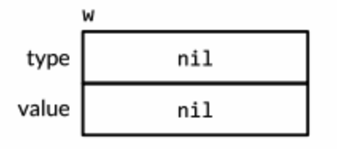
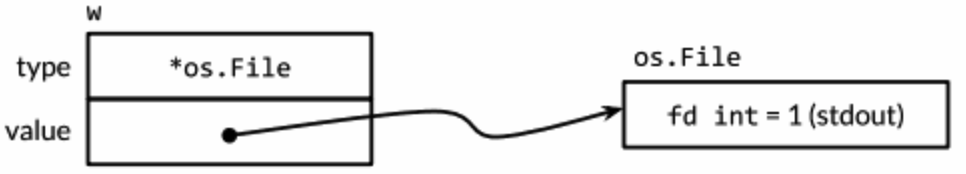
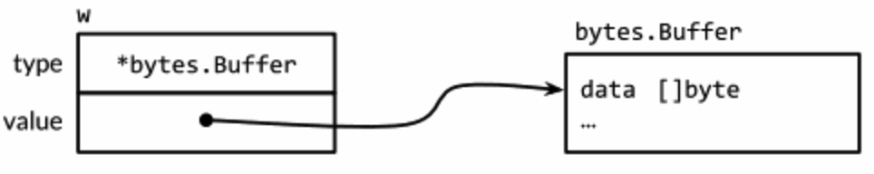
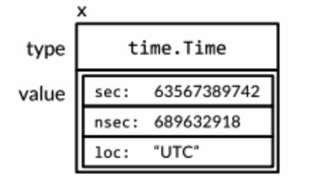
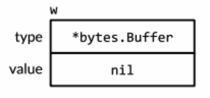
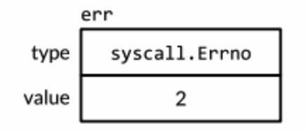

（接口这部分是一定要弄懂的！用独立的一章来研究）Go 语言中**没有类和继承的概念**，和 Java、C++ 看起来并不相同，它是**==使用接口来实现多态的==**。**Go 语言有一个清晰易懂的轻量级类型系统，在类型之间也没有层级之说**。

**接口类型**是**对其他类型行为的抽象和概括**。因为接口类型不会和特定的实现细节绑定在一起，通过这种**抽象的方式**我们可以让我们的函数更加灵活和更具有适应能力。

很多面向对象的语言都有相似的接口概念，但 Go 语言中接口类型的独特之处在于它**是满足隐式实现的**。也就是说，我们没有必要对于给定的具体类型定义所有满足的接口类型；**简单地拥有一些必需的方法就足够了**。这种设计可以让你创建一个新的类型满足已经存在的具体类型却不会去改变这些类型的定义；当我们使用的类型来自于不受我们控制的包时这种设计尤其有用。

在本章，我们会开始看到**==接口类型和值==**的一些基本技巧。顺着这种方式我们将学习几个来自标准库的重要接口。**很多 Go 程序中都尽可能多的去使用标准库中的接口**。最后，我们会在最后看到类型断言的知识，并看到类型开关的使用并且学到它们是怎样让不同的类型的概括成为可能。

# 接口约定

内容导读：

* 具体的类型和抽象类型，**接口就是一种抽象类型**；
* 使用示例 `os.Stdout` 和 `bytes.Buffer` 实现了 `io.Writer` 接口，并同时作为 `Fprintf` 函数的参数；
* 自定义 `ByteCounter` 命名类型，并实现 `io.Writer` 接口，实现写入字节计数功能。

目前为止，我们看到的类型都是==具体的类型==。一个具体的类型可以**准确地**描述它所代表的值，并且展示出对类型本身的一些操作方式：就像数字类型的算术操作，切片类型的取下标、添加元素和范围获取操作。具体的类型还可以通过它的内置方法提供额外的行为操作。总的来说，当你拿到一个具体的类型时你就知道它的本身是什么和你可以用它来做什么。

在 Go 语言中还存在着另外一种类型：接口类型。==接口类型是一种抽象的类型==。它不会暴露出所代表的对象的内部值的结构和这个对象支持的基础操作的集合；==它们只会表现出它们自己的方法==。也就是说**当你看到一个接口类型的值时，你不知道它是什么，唯一知道的就是可以通过它的方法来做什么**。

在本书中，我们一直使用两个相似的函数来进行字符串的格式化：`fmt.Printf`（它会把结果写到标准输出）和 `fmt.Sprintf`（会把结果以字符串的形式返回）。得益于使用接口，我们不必可悲地因为返回结果在使用方式上的一些浅显不同就必需把格式化这个最困难的过程复制一份。实际上，这两个函数**都使用了另一个函数 `fmt.Fprintf` 来进行封装**。`fmt.Fprintf` 这个函数对它的计算结果会被怎么使用是完全不知道的。

~~~go
package fmt

// These routines end in 'f' and take a format string.

// Fprintf formats according to a format specifier and writes to w.
// It returns the number of bytes written and any write error encountered.
func Fprintf(w io.Writer, format string, a ...interface{}) (n int, err error) {
	p := newPrinter()
	p.doPrintf(format, a)
	n, err = w.Write(p.buf)
	p.free()
	return
}

// Printf formats according to a format specifier and writes to standard output.
// It returns the number of bytes written and any write error encountered.
func Printf(format string, a ...interface{}) (n int, err error) {
	return Fprintf(os.Stdout, format, a...)
}

// Sprintf formats according to a format specifier and returns the resulting string.
func Sprintf(format string, a ...interface{}) string {
    // 并不会把格式化的部分复制一遍，而是使用接口实现灵活编码 bytes.Buffer 实现了 io.Writer 
	var buf bytes.Buffer
    Fprintf(&buf, format, args...)
    return buf.String()
}

// newPrinter allocates a new pp struct or grabs a cached one.
func newPrinter() *pp {
	p := ppFree.Get().(*pp)
	p.panicking = false
	p.erroring = false
	p.wrapErrs = false
	p.fmt.init(&p.buf)
	return p
}
~~~

此处引出的疑问是：为什么一处使用的是 `os.Stdout`，另一处使用的是 `&buf`？

~~~go
// Stdin, Stdout, and Stderr are open Files pointing to the standard input,
// standard output, and standard error file descriptors.
//
// Note that the Go runtime writes to standard error for panics and crashes;
// closing Stderr may cause those messages to go elsewhere, perhaps
// to a file opened later.
var (
	Stdin  = NewFile(uintptr(syscall.Stdin), "/dev/stdin")
    // Stdout 是 *File 类型
	Stdout = NewFile(uintptr(syscall.Stdout), "/dev/stdout")
	Stderr = NewFile(uintptr(syscall.Stderr), "/dev/stderr")
)

// NewFile returns a new File with the given file descriptor and
// name. The returned value will be nil if fd is not a valid file
// descriptor. On Unix systems, if the file descriptor is in
// non-blocking mode, NewFile will attempt to return a pollable File
// (one for which the SetDeadline methods work).
func NewFile(fd uintptr, name string) *File {
	kind := kindNewFile
	if nb, err := unix.IsNonblock(int(fd)); err == nil && nb {
		kind = kindNonBlock
	}
	return newFile(fd, name, kind)
}

// Write writes len(b) bytes to the File.
// It returns the number of bytes written and an error, if any.
// Write returns a non-nil error when n != len(b).
func (f *File) Write(b []byte) (n int, err error) {
	if err := f.checkValid("write"); err != nil {
		return 0, err
	}
	n, e := f.write(b)
	if n < 0 {
		n = 0
	}
	if n != len(b) {
		err = io.ErrShortWrite
	}

	epipecheck(f, e)

	if e != nil {
		err = f.wrapErr("write", e)
	}

	return n, err
}
~~~

我们从上述源代码中可以看到：`os.Stdout` 是 `*File` 类型，是一种指针类型；此外，以 `*File` 作为接收者定义了 `Write(b []byte)` 方法，该方法也就是 `io.Writer` 接口中声明的方法 `Write(b []byte) (n int, err error)`。

~~~go
// A Buffer is a variable-sized buffer of bytes with Read and Write methods.
// The zero value for Buffer is an empty buffer ready to use.
type Buffer struct {
	buf      []byte // contents are the bytes buf[off : len(buf)]
	off      int    // read at &buf[off], write at &buf[len(buf)]
	lastRead readOp // last read operation, so that Unread* can work correctly.
}

// Write appends the contents of p to the buffer, growing the buffer as
// needed. The return value n is the length of p; err is always nil. If the
// buffer becomes too large, Write will panic with ErrTooLarge.
func (b *Buffer) Write(p []byte) (n int, err error) {
	b.lastRead = opInvalid
	m, ok := b.tryGrowByReslice(len(p))
	if !ok {
		m = b.grow(len(p))
	}
	return copy(b.buf[m:], p), nil
}
~~~

从上述源代码我们可看出：`bytes.Buffer` 是一种**结构体类型**；此外，**使用 `*bytes.Buffer` 指针类型作为接收者**定义了 `Write(b []byte) (n int, err error)` 方法，也就是 `io.Writer` 接口中声明的方法。

因此，上述 `os.Stdout` 和 `bytes.Buffer` 最大的不同就是自身类型的不同，前缀是指针类型，后者是结构体；但两者同时都是使用其指针类型定义的方法，因此==在使用上确实是不同的==！

`Fprintf` 的前缀 `F` 表示文件（File）也表明格式化输出结果应该被写入第一个参数提供的文件中。在 `Printf` 函数中的**第一个参数 `os.Stdout` 是 `*os.File` 类型**；在 `Sprintf` 函数中的第一个参数 `&buf` 是一个指向可以写入字节的内存缓冲区，然而它并不是一个文件类型尽管它在某种意义上和文件类型相似。

即使 `Fprintf` 函数中的第一个参数是 `io.Writer` 类型，这是一个接口类型定义如下：

~~~go
// Writer is the interface that wraps the basic Write method.
//
// Write writes len(p) bytes from p to the underlying data stream.
// It returns the number of bytes written from p (0 <= n <= len(p))
// and any error encountered that caused the write to stop early.
// Write must return a non-nil error if it returns n < len(p).
// Write must not modify the slice data, even temporarily.
//
// Implementations must not retain p.
type Writer interface {
	Write(p []byte) (n int, err error)
}
~~~

`io.Writer` 类型定义了函数 `Fprintf` 和这个函数调用者之间的约定：

1. 一方面==这个约定需要调用者提供就像 `*os.File` 和 `*bytes.Buffer`，这些类型都有一个特定签名和行为的 Writer 的函数==。特别注意此处：`*os.File` 和 `*bytes.Buffer`！
2. ==这个约定保证了 `Fprintf` 接受任何满足 `io.Writer` 接口的值都可以工作==。`Fprintf` 函数可能没有假定写入的是一个文件或是一段内存，而是**写入一个可以调用 Write 函数的值**。

因为 `fmt.Fprintf` 函数没有对具体操作的值做任何假设，而是**仅仅通过 `io.Writer` 接口的约定来保证行为**，所以第一个参数可以安全地传入一个只需要满足 `io.Writer` 接口的**任意具体类型的值**。==**一个类型可以自由地被另一个满足相同接口的类型替换，被称作可替换性（LSP里氏替换）**==。**这是一个面向对象的特征**。

让我们通过一个新的类型来进行校验，下面 `*ByteCounter` 类型里的 Writer 方法，仅仅在丢弃写向它的字节前统计它们的长度：

~~~go
package main

import "fmt"

type ByteCounter int

func (c *ByteCounter) Write(p []byte) (int, error) {
	*c += ByteCounter(len(p))
	return len(p), nil
}

func main() {
	var c ByteCounter
	c.Write([]byte("hello"))
	fmt.Println(c) // 5 = len("hello")

	c = 0

	var name = "麦驰"
	fmt.Fprintf(&c, "hello, %s", name)
	fmt.Println(c) // 13 = len("hello, 麦驰")
}
~~~

==因为 `*ByteCounter` 满足 `io.Writer` 的约定==，我们可以把它传入 `Fprintf` 函数中；`Fprintf` 函数执行字符串格式化的过程不会去关注 `ByteCounter` 正确的累加结果的长度。

> 其实我们可以这样理解：既然定义了 `func (c *ByteCounter) Write(p []byte) (int, error)` 那也就是说明 `*ByteCounter` 实现了 `io.Writer` 接口，也就是该接口的实例。特别说明的是，此处是 `*ByteCounter`，而不是 `ByteCounter`！
>

除了 `io.Writer` 这个接口类型，还有另外一个对 `fmt` 包很重要的接口类型。`Fprintf` 和 `Fprintln` 函数向类型提供了一种控制他们值输出的途径。我们为 `Celsius` 类型提供了一个 String 方法以便于可以打印这样100°C，我们给 `*IntSet` 添加了一个 String 方法，这样集合可以用传统的符号来进行表示。给一个类型定义 String 方法，可以让它满足最广泛使用之一的接口类型 `fmt.Stringer`：

~~~go
// Stringer is implemented by any value that has a String method,
// which defines the ``native'' format for that value.
// The String method is used to print values passed as an operand
// to any format that accepts a string or to an unformatted printer
// such as Print.
type Stringer interface {
	String() string
}
~~~

我们会在后续解释 `fmt` 包怎么发现哪些值满足这个接口类型的。

# 接口类型

内容导读：

* 接口类型：描述了一系列方法的集合；
* 接口类型也可以像结构体内嵌一样，包含多个其他接口类型。

接口类型具体描述了一系列方法的集合，**一个实现了这些方法的具体类型是这个接口类型的实例**。

`io.Writer` 类型是用得**最广泛的接口之一**，因为它提供了所有类型的写入 bytes 的**抽象**，包括（具体实例）文件、内存缓冲区、网络连接、HTTP 客户端、压缩工具、哈希等等。`io` 包中定义了很多其它有用的接口类型。`Reader` 可以代表任意可以读取 bytes 的类型，`Closer` 可以是任意可以关闭的值，例如一个文件或是网络连接。

到现在你可能注意到了很多 Go 语言中**单方法接口**（接口中仅声明了一个方法的接口）的命名习惯：

~~~go
package io

type Reader interface {
    Read(p []byte) (n int, err error)
}

type Closer interface {
    Close() error
}
~~~

再往下看，我们发现有些新的**==接口类型==**通过组合已有的接口来定义，下面是两个例子：

~~~go
type ReadWriter interface {
    Reader
    Writer
}

type ReadWriterCloser interface {
    Reader
    Writer
    Closer
}
~~~

上面用到的语法**和结构体内嵌相似**，我们可以用这种方式以一个简写命名一个接口，而不用声明它所有的方法。这种方式称为==接口内嵌==。尽管略失简洁，我们可以像下面这样，不使用内嵌来声明 `io.ReadWriter` 接口：

~~~go
type ReadWriter interface {
    Read(p []byte) (n int, err error)
    Write(p []byte) (n int, err error)
}
~~~

或者甚至可以使用一种混合的风格：

~~~go
type ReadWriter interface {
    Read(p []byte) (n int, err error)
    Writer
}
~~~

上面 3 种定义方式都是一样的效果。方法顺序的变化也没有影响，**唯一重要的就是这个集合里面的方法**。

# 实现接口的条件

内容导读：

* 我们说“一个类型没有**实现**某个接口”，潜在的含义就是：该类型**不具有**该接口对应的方法；
* 空接口类型；
* 指针类型作为方法的接收者，并应用于实现接口中定义的方法。

一个类型如果拥有一个接口需要的==所有方法==，那么这个类型就实现了这个接口。

例如 `*os.File` 类型实现了 `io.Reader`、`Writer`、`Closer` 和 `ReadWriter` 接口。`*bytes.Buffer` 实现了 `Reader`、`Writer` 和 `ReadWriter` 这些接口，但是它没有实现 `Closer` 接口因为它不具有 `Close` 方法。

Go 的程序员经常会简要地**把一个具体的类型描述成一个特定的接口类型**。举个例子，`*bytes.Buffer` 是 `io.Writer`；`*os.Files` 是 `io.ReadWriter`。

接口指定的规则非常简单**：表达一个类型属于某个接口只要这个类型实现这个接口**。所以：

~~~go
var w io.Writer
w = os.Stdout
w = new(bytes.Buffer)
w = time.Second // compile error: *bytes.Buffer lacks Close method

var rwc io.ReadWriteCloser
rwc = os.Stdout
rwc = new(bytes.Buffer) // compile error: *bytes.Buffer lacks Close method
~~~

这个规则甚至适用于等式右边本身也是一个接口类型：

~~~go
w = rwc
rwc = w // compile error: io.Writer lacks Close method
~~~

因为 `ReadWriter` 和 `ReadWriteCloser` 包含所有 `Writer` 的方法，所以任何实现了 `ReadWriter` 和 `ReadWriteCloser` 的类型必定也实现了 `Writer` 接口。

在进一步学习前，必须先解释==一个类型持有一个方法的表示==当中的细节：对于每一个命名类型 T，它的一些方法的接收者是类型 T 本身，然而另一些则是一个 `*T` 。还记得==在 T 类型的参数上调用一个 `*T` 的方法是合法的==，只要这个参数是一个变量。**编译器隐式的获取了它的地址**。但这**仅仅是一个语法糖**：==T 类型的值不拥有所有 `*T` 指针的方法==，这样它就可能只实现了更少的接口。

> 怎么理解这句话？也就是说，虽然是可以如此这般地调用，但是并不意味着实现了该方法，因为这仅仅只是一个语法糖。

`IntSet` 类型的 String 方法的接收者是一个指针类型，所以我们不能在一个**不能寻址**的 `IntSet` 值上调用这个方法：

~~~go
type IntSet struct {}

func (*IntSet) String() string {}

var _ = IntSet{}.String() // compile error: String requires *IntSet receiver
~~~

但是我们可以在一个 `IntSet` 值上调用这个方法：

~~~go
var s IntSet
var _ = s.String() // OK: s is a variable and &s has a String method
~~~

然而，==由于只有 `*IntSet` 类型有 String 方法，所以也只有 `*IntSet` 类型实现了 `fmt.Stringer` 接口==：

~~~go
package main

import "fmt"

type IntSet struct {
	tmp int
}

func (*IntSet) String() string {
	return ""
}

func main() {
	var s IntSet
	s.tmp = 2
	fmt.Println(s)

	var _ fmt.Stringer = &s
    var _ fmt.Stringer = s // compile error: io.Writer lacks Close method IDE 会提示编译错误
}
~~~

上述代码也就证明了：如果定义了 `func (intSet *IntSet) String() string` 方法，其接收者是 `*IntSet` 类型，也就说明其是 `fmt.Stringer` 接口的实例！另一方面：`IntSet` 类型的 String 方法的接收者是其本身类型，**其指针类型却可以赋值给其实现的接口**：

~~~go
package main

import "fmt"

type IntSet struct {
	tmp int
}

func (inset IntSet) String() string {
	return "2"
}

func main() {
	var s IntSet
	s.tmp = 2
	fmt.Println(s)

	var _ fmt.Stringer = &s
	var _ fmt.Stringer = s // 接口的实例赋值给接口变量
}
~~~

就像信封封装和隐藏起信件来一样，接口类型封装和隐藏具体类型和它的值。即使具体类型有其它的方法，也**只有接口类型暴露出来的方法会被调用到**：

~~~go
package main

import (
	"os"
)

func main() {
	os.Stdout.Write([]byte("hello"))
	os.Stdout.Close()
    
    var w io.Writer
    w = os.Stdout
    w.Write([]byte("hello"))
    w.Close() // compile error: io.Writer lacks Close method
}
~~~

一个有更多方法的接口类型，比如 `io.ReadWriter`，和少一些方法的接口类型如 `io.Reader`，进行对比；更多方法的接口类型会告诉我们更多关于它的值持有的信息，并且对实现它的类型要求更加严格。那么关于 `interface{}` 类型，它没有任何方法，请讲出哪些具体的类型实现了它？

这看上去好像没有用，但实际上 `interface{}` 被称为==空接口类型==是不可或缺的。因为**空接口类型对实现它的类型没有要求，所以我们可以将任意一个值赋给空接口类型**：

~~~go
var any interface{} // <nil>
any = true
any = 12.34
any = "hello"
any = map[string]int{"one":1}
any = new(bytes.Buffer)
~~~

对于创建的一个 `interface{}` 值持有一个 `boolean`、`float`、`string`、`map`、`pointer`，或者任意其他的类型；我们当然**不能直接对它持有的值做操作**，因为 `interface{}` 没有任何方法。

因为接口与实现只依赖于判断两个类型的方法，所以没有必要定义一个具体类型和它实现的接口之间的关系。也就是说，尝试文档化和断言这种关系几乎没有用，所以并没有通过程序强制定义。

非空的接口类型比如 `io.Writer` 经常==被指针类型实现==，尤其当一个或多个接口像 `Writer` 方法那样==隐式地给接收者带来变化==的时候。==一个结构体的指针是非常常见的承载（接收）方法的类型==。

但是**并不意味着只有指针类型满足接口类型**，甚至连一些有设置方法的接口类型也可能会被 Go 语言中其他的引用类型实现。我们**已经看过 slice 类型、map 类型的方法，后面还会看到函数类型的方法**，甚至基本的类型也可能会实现一些接口。

一个具体的类型可能实现了很多不相关的接口。考虑在一个组织出售数字文化产品比如音乐、电影和书籍的程序中**可能定义了下列的具体类型**：

~~~go
Album
Book
Movie
Magazine
Podcast
TVEpisode
Track
~~~

我们可以**把每个抽象的特点用接口来表示**。一些特性对于所有的这些文化产品都是==共通的==，例如标题、创作日期和作者列表：

~~~go
type Artifact interface {
    Title() string
    Creators() []string
    Created() time.Time
}
~~~

其它的一些特性只对特定类型的文化产品才有。和文字排版特性相关的只有 Books 和 Magazine，还有只有 movies 和 TV 剧集和屏幕分辨率相关：

~~~go
type Text interface {
    Pages() int
    Words() int
    PageSize() int
}

type Audio interface {
    Stream() (io.ReadCloser, error)
    RunningTime() time.Duration
    Format() string // e.g., "MP3", "WAV"
}

type Video interface {
    Stream() (io.ReadCloser, error)
    RunningTime time.Duration
    Format() string // e.g., "MP4", "WMV"
    Resolution() (x, y int)
}
~~~

这些接口不止是一种有用的方式来分组相关的具体类型和表示它们之间的共同特点。我们后面可能会发现其他的分组。举例，如果我们发现我们需要以同样的方式处理 Audio 和 Video，我们可以定义一个 Streamer 接口来代表它们之间相同的部分而不必对已经存在的类型做改变。

~~~go
type Streamer interface {
    Stream() (io.ReadCloser, error)
    RunningTime() time.Duration
    Format() string
}
~~~

**每一个具体类型的组基于它们相同的行为可以表示成一个接口类型**。不像基于类的语言，它们一个类实现的接口集合需要进行显式的定义，在 Go 语言中我们可以在需要的时候定义一个新的抽象或者特定特点的组，而不需要修改具体类型的定义。当具体的类型来自不同的作者时这种方式会特别有用。当然也确实没有必要在具体的类型中指出这些共性。

# flag.Value 接口

内容导读：

* `flag.Value` 接口，应用于解析命令行参数；

在本节中，我们会学到另一个标准的接口类型 `flag.Value` 是怎么**帮助命令行标记定义新的符号**的。

~~~go
package main

import (
	"flag"
	"fmt"
	"time"
)

var period = flag.Duration("period", 1*time.Second, "sleep period")

func main() {
	flag.Parse()
    
	fmt.Printf("Sleeping for %v...", *period)
	
    time.Sleep(*period)
	fmt.Println()
}
~~~

与之相关的 `launch.json` 内容：

~~~json
{
    // Use IntelliSense to learn about possible attributes.
    // Hover to view descriptions of existing attributes.
    // For more information, visit: https://go.microsoft.com/fwlink/?linkid=830387
    "version": "0.2.0",
    "configurations": [
        {
            "name": "Launch Package",
            "type": "go",
            "request": "launch",
            "mode": "debug",
            "program": "${workspaceFolder}",
            "args": [
                "-period", "2m" // 命令行参数
            ]
        }
    ]
}
~~~

在它休眠前会打印出休眠的时间周期。`fmt` 包调用 `time.Duration` 的 String 方法打印这个时间周期是以**用户友好的注解方式**，而不是一个纳秒数字：

~~~go
API server listening at: 127.0.0.1:36845
Sleeping for 2m0s...
Process exiting with code: 0
~~~

其具体实现：

~~~go
// String returns a string representing the duration in the form "72h3m0.5s".
// Leading zero units are omitted. As a special case, durations less than one
// second format use a smaller unit (milli-, micro-, or nanoseconds) to ensure
// that the leading digit is non-zero. The zero duration formats as 0s.
func (d Duration) String() string {
	// Largest time is 2540400h10m10.000000000s
	var buf [32]byte
	w := len(buf)

	u := uint64(d)
	neg := d < 0
	if neg {
		u = -u
	}

	if u < uint64(Second) {
		// Special case: if duration is smaller than a second,
		// use smaller units, like 1.2ms
		var prec int
		w--
		buf[w] = 's'
		w--
		switch {
		case u == 0:
			return "0s"
		case u < uint64(Microsecond):
			// print nanoseconds
			prec = 0
			buf[w] = 'n'
		case u < uint64(Millisecond):
			// print microseconds
			prec = 3
			// U+00B5 'µ' micro sign == 0xC2 0xB5
			w-- // Need room for two bytes.
			copy(buf[w:], "µ")
		default:
			// print milliseconds
			prec = 6
			buf[w] = 'm'
		}
		w, u = fmtFrac(buf[:w], u, prec)
		w = fmtInt(buf[:w], u)
	} else {
		w--
		buf[w] = 's'

		w, u = fmtFrac(buf[:w], u, 9)

		// u is now integer seconds
		w = fmtInt(buf[:w], u%60)
		u /= 60

		// u is now integer minutes
		if u > 0 {
			w--
			buf[w] = 'm'
			w = fmtInt(buf[:w], u%60)
			u /= 60

			// u is now integer hours
			// Stop at hours because days can be different lengths.
			if u > 0 {
				w--
				buf[w] = 'h'
				w = fmtInt(buf[:w], u)
			}
		}
	}

	if neg {
		w--
		buf[w] = '-'
	}

	return string(buf[w:])
}
~~~

默认情况下，休眠周期是一秒，但是可以通过 `-period` 这个命令行标记来控制。`flag.Duration` 函数创建一个 `time.Duration` 类型的标记变量并且允许用户通过多种用户友好的方式来设置这个变量的大小，这种方式还包括和 String 方法相同的符号排版形式。这种对称设计使得用户交互良好。

因为时间周期标记值非常的有用，所以这个特性被构建到了 flag 包中；但是我们==为我们自己的数据类型定义新的标记符号==是简单容易的。我们只需要定义一个实现 `flag.Value` 接口的类型，如下：

~~~go
package flag

type Value interface {
    String() string
    Set(string) error
}
~~~

String 方法格式化标记的值用在命令行帮助消息中，这样每一个 `flag.Value` 也是一个 `fmt.Stringer`。Set 方法解析它的字符串参数并且更新标记变量的值。实际上，Set 方法和 String 是两个相反的操作，所以最好的办法就是对他们使用相同的注解方式。

让我们定义一个允许通过摄氏度或者华氏温度变换的形式指定温度的 `celsiusFlag` 类型。注意 `celsiusFlag` 内嵌了一个 `Celsius` 类型，因此不同实现本身就已经有的 String 方法了。为了实现 `flag.Value`，我们只需要定义 `Set` 方法：

~~~go
package main

import (
	"flag"
	"fmt"
)

type Celsius float64

type Fahrenheit float64

type celsiusFlag struct {
	Celsius
}

func FToC(f Fahrenheit) Celsius {
	return Celsius((f - 32.0) * 5.0 / 9.0)
}

func (f *celsiusFlag) Set(s string) error {
	var unit string
	var value float64
	fmt.Sscanf(s, "%f%s", &value, &unit)
	switch unit {
	case "C", "°C":
		f.Celsius = Celsius(value)
		return nil
	case "F", "°F":
		f.Celsius = FToC(Fahrenheit(value))
		return nil
	}
	return fmt.Errorf("invalid temperature %q", s)
}

func (c Celsius) String() string {
	return fmt.Sprintf("%g°C", c)
}
~~~

调用 `fmt.Sscanf` 函数从输入 s 中解析一个浮点数和一个字符串。虽然通常必须检查 `Sscanf` 的错误返回，但是在这个例子中我们不需要因为如果有错误发生，就没有 switch case 会匹配到。

下面的 `CelsiusFlag` 函数将所有逻辑封装到一起。它返回一个内嵌在 `celsiusFlag` 变量 f 中的 `Celsius` 指针给调用者。`Celsius` 字段是一个会**通过 Set 方法在标记处理的过程中更新的变量**。调用 `Var` 方法**将标记加入应用的命令行标记集合中**，有异常复杂命令行接口的全局变量 `flag.CommandLine.Programs` 可能有几个这个类型的变量。==调用 `Var` 方法将一个 `*celsiusFlag` 参数赋值给一个 `flag.Value` 参数，导致编译器器去检查 `*celsiusFlag` 是否有必须的方法==：

~~~go
func CelsiusFlag(name string, value Celsius, usage string) *Celsius {
	f := celsiusFlag{value}
	
    // SIGN 此处为什么传递 *main.celsiusFlag
	flag.CommandLine.Var(&f, name, usage) // 将标记加入 App 的命令行标记集合
    
	return &f.Celsius
}
~~~

现在我们可以在开始的程序中使用新的标记：

~~~go
var temp = CelsiusFlag("temp", 20.0, "the temperature")

func main() {
	flag.Parse() // 触发调用 flag.CommandLine.Var 的 Set 方法
	fmt.Println(*temp)
}
~~~

如果 `flag.CommandLine.Var(f, name, usage)` 会导致编译出错：`cannot use f (variable of type celsiusFlag) as flag.Value value in argument to flag.CommandLine.Var: missing method Set (Set has pointer receiver)` ，编译器提示 `celsiusFalg` 不具备 `Set` 方法。

# 接口值

概念上讲一个接口的值——==接口值==——由==两个部分组成==：

1. 一个具体的类型：接口的动态类型
2. 那个类型的值：动态值

它们被称为**接口的动态类型**和**动态值**。==**对于像 Go 语言这种静态类型的语言，类型是编译器的概念**==。因此一个类型不是一个值。在我们的概念模型中，一些提供每个类型信息的值被称为类型描述符，比如类型的名称和方法。在一个接口值中，类型部分代表与之相关类型的描述符。

下面 4 个语句中，变量 w 得到了 3 个不同的值：

~~~go
var w io.Writer
w = os.Stdout
w = new(bytes.Buffer)
w = nil
~~~

让我们进一步观察在每一个语句后的 w 变量的值和动态行为。第一个语句定义了变量 w：

~~~go
var w io.Writer // 声明一个变量，该变量的类型是接口
~~~

**在 Go 语言中，变量总是被一个定义明确的值初始化**，即使接口类型也不例外。对于**一个接口的零值**就是它的**类型**和**值**的部分都是 nil。

~~~go
var container = []string{"zero", "one", "two"}

func main() {
	printTypeAndValue(container) // []string, [zero one two]

	intValue := 1
	printTypeAndValue(intValue) // int, 1
}

func printTypeAndValue(value interface{}) {
	// 输出变量的类型和值
	fmt.Printf("%T, %v.\n", value, value)
}
~~~

比如上述代码，**Go 中的每一个变量都有类型和值这两个属性**！`intValue` 这个变量的类型是 `int`，其值是整数 1。

一个接口值基于它的动态类型被描述为空或非空，所以这是一个空的接口值。你可以通过使用 `w == nil` 或者 `w != nil` 来判断接口值是否为空。调用一个空接口值上的任意方法都会产生 panic：

~~~go
w.Write([]byte("hello")) // panic: nil pointer dereference
~~~

第二个语句将一个 `*os.File` 类型的值赋给变量 w：

~~~go
w = os.Stdout
~~~

这个赋值过程调用了**一个具体类型到接口类型的隐式转换**，这和显式地使用 `io.Writer(os.Stdout)` 是等价的。这类转换不管是显式的还是隐式的，都会刻画出操作到的类型和值。这个接口值的==动态类型==被设为 `*os.File` 指针的类型描述符，它的==动态值==持有 `os.Stdout` 的拷贝。这是一个代表处理标准输出的 `os.File` 类型变量的指针：

调用一个包含 `*os.File` 类型指针的接口值的 Write 方法，使得 `(*os.File).Write` 方法被调用，这个调用输出 `hello`：

~~~go
w.Write([]byte("hello"))
~~~

通常==在编译期，我们不知道接口值的动态类型是什么==，所以**一个接口上的调用必须使用动态分配**。因为不是直接进行调用，所以编译器必须把代码生成在类型描述符的方法 Write 上，然后间接调用那个地址。这个调用的接收值是一个接口动态值的拷贝：`os.Stdout`，效果和下面这个直接调用一样：

~~~go
os.Stdout.Write([]byte("hello"))
~~~

第三个语句给接口值赋了一个 `*bytes.Buffer` 类型的值：

~~~go
w = new(bytes.Buffer)
~~~

现在==动态类型==是 `*bytes.Buffer` 并且==动态值==是一个指向新分配的缓冲区的指针：

~~~go
func main() {
	var w io.Writer
    
	w = new(bytes.Buffer) // *bytes.Buffer, .
	fmt.Printf("%p\n", w) // 0xc000066330
	printTypeAndValue(w)
}

func printTypeAndValue(value interface{}) {
	// 输出变量的类型和值
	fmt.Printf("%T, %v.\n", value, value)
	if nil == value {
		fmt.Println("value is nil!")
	}
}

// A Buffer is a variable-sized buffer of bytes with Read and Write methods.
// The zero value for Buffer is an empty buffer ready to use.
type Buffer struct {
	buf      []byte // contents are the bytes buf[off : len(buf)]
	off      int    // read at &buf[off], write at &buf[len(buf)]
	lastRead readOp // last read operation, so that Unread* can work correctly.
}
~~~

Write 方法的调用也使用了和之前一样的机制：

~~~go
w.Write([]byte("hello"))
~~~

这次类型描述符是 `*bytes.Buffer`，所以调用了 `(*bytes.Buffer).Write` 方法，并且接收者是该缓冲区的地址。这个调用把字符串 hello 添加到缓冲区中。

最后，第 4 个语句将 nil 赋值给了接口值：

~~~go
w = nil
~~~

这个重置将它所有的部分都设为 nil 值，把变量 w 恢复到和它之前定义时相同的状态。

一个接口值可以持有任意大的动态值。例如，表示时间实例的 `time.Time` 类型，这个类型有几个对外不公开的字段。我们从它上面创建一个接口值：

~~~go
var x interface{} = time.Now()
~~~

从概念上讲，不论接口值多大，动态值总是可以容下它。但这只是一个概念上的模型，具体的实现可能会非常不同。

接口值可以使用 `==` 和 `!=` 来进行比较。两个接口值相等仅当它们都是 nil 值，或者它们的动态类型相同并且动态值也根据这个动态类型的 == 操作相等。因为接口值是可比较的，所以它们可以用在 map 的键或者作为 switch 语句的操作数。

然而，如果两个接口值的动态类型相同，但是这个动态类型是不可比较的（比如切片），将它们进行比较就会失败并且 panic：

~~~go
var x interface{} = []int{1, 2, 3}
fmt.Println(x == x) // panic
~~~

考虑到这点，接口类型是非常与众不同的。其他类型要么是安全的可比较类型（如基本类型和指针）要么是完全不可比较的类型（如切片、映射类型、函数），但是在比较接口值或者包含了接口值的聚合类型时，我们必须要意识到潜在的 panic。同样的风险也存在于使用接口作为 map 的键或者 switch 的操作数。==只能比较你非常确定它们的动态值是可比较类型的接口值==。

当我们处理错误或者调试的过程中，得知接口值的动态类型是非常有帮助的。所以我们使用 fmt 包的 %T 动作：

~~~go
var w io.Writer
fmt.Printf("%T\n", w) // <nil>
w = os.Stdout
fmt.Printf("%T\n", w) // *os.File
w = new(bytes.Buffer)
fmt.Printf("%T\n", w) // *bytes.Buffer
~~~

在 fmt 包内部，**使用反射来获取接口动态类型的名称**。

**一个不包含任何值的 nil 接口值**和**一个刚好包含 nil 指针的接口值**是不同的。这个细微区别产生了一个容易绊倒每个 Go 程序猿的陷阱。

思考下面的程序：当 debug 变量设置为 true 时，main 函数会将 f 函数的输出收集到一个 `bytes.Buffer` 类型中：

~~~go
const debug = true

func main() {
    var buf *bytes.Buffer
    if debug {
        buf = new(bytes.Buffer)
    }
    f(buf)
    if debug {
        // ...use buf...
    }
}

func f(out io.Writer) {
    // ...do something...
    if out != nil {
        out.Write([]byte("done!\n"))
    }
}
~~~

我们可能会预计当把变量 debug 设置为 false 时可以禁止对输出的收集，但是实际上在 `out.Write` 方法调用时程序发生了 panic：

~~~go
if out != nil {
    out.Write([]byte("done!\n")) // panic
}
~~~

当 main 函数调用函数 f 时，它给 f 函数的 out 参数赋了一个 `*bytes.Buffer` 的空指针，所以 out 的==动态值==是 nil。然而，它的==动态类型==是 `*bytes.Buffer`，意思就是 out 变量是**一个包含空指针值的非空接口**，所以防御性检查 `out != nil` 的结果依然是 true。

这部分内容确实很有迷惑性：out 变量是一个包含空指针值的非空接口！即 `out != nil` 结果是 true。

**==由此引申出来的问题是：`value == nil` 到底应该怎么判断？==**

动态分配机制依然决定 `(*bytes.Buffer).Write` 的方法会被调用，但是这次的接收者的值是 nil。对于一些如 `*os.File` 的类型，nil 是一个有效的接收者，但是 `*bytes.Buffer` 类型不在这些种类中。这个方法会被调用，但是当它尝试去获取缓冲区时会发生 panic：

~~~go
// Write writes len(b) bytes to the File.
// It returns the number of bytes written and an error, if any.
// Write returns a non-nil error when n != len(b).
func (f *File) Write(b []byte) (n int, err error) {
	if err := f.checkValid("write"); err != nil {
		return 0, err
	}
	n, e := f.write(b)
	if n < 0 {
		n = 0
	}
	if n != len(b) {
		err = io.ErrShortWrite
	}

	epipecheck(f, e)

	if e != nil {
		err = f.wrapErr("write", e)
	}

	return n, err
}

// checkValid checks whether f is valid for use.
// If not, it returns an appropriate error, perhaps incorporating the operation name op.
func (f *File) checkValid(op string) error {
	if f == nil {
		return ErrInvalid
	}
	return nil
}

// Write appends the contents of p to the buffer, growing the buffer as
// needed. The return value n is the length of p; err is always nil. If the
// buffer becomes too large, Write will panic with ErrTooLarge.
func (b *Buffer) Write(p []byte) (n int, err error) {
	b.lastRead = opInvalid
	m, ok := b.tryGrowByReslice(len(p))
	if !ok {
		m = b.grow(len(p))
	}
	return copy(b.buf[m:], p), nil
}
~~~

问题在于尽管一个 nil 的 `*bytes.Buffer` 指针有实现这个接口的方法，它也不满足这个接口具体的行为上的要求。特别是这个调用违反了 `(*bytes.Buffer).Write` 方法的接收者非空的隐含先觉条件，所以将 nil 指针赋给这个接口是错误的。解决方案就是将 main 函数中的变量 buf 的类型改为 `io.Writer`，因此可以避免一开始就将一个不完整的值赋值给这个接口：

~~~go
var buf io.Writer
if debug {
    buf = new(bytes.Buffer)
}
~~~

考虑了下面的测试输出结果：

~~~go
func test1() {
    var tmp io.Writer
	if tmp == nil {
		fmt.Println("tmp == nil") // true
	}
	fmt.Printf("%T, %v\n", tmp, tmp) // <nil>, <nil>
}

func test2() {
    var tmp *bytes.Buffer
    // *byte.Buffer, 0x0, <nil>
	fmt.Printf("%T, %p, %v\n", tmp, tmp) 
}

func test3() {
    var tmp *bytes.Buffer
	tmp = new(bytes.Buffer)
    // *byte.Buffer, 0xc00010e060
	fmt.Printf("%T, %p\n", tmp, tmp) 
}
~~~

现在我们已经把接口值的技巧都讲完了，让我们来看更多的一些在 Go 标准库中的重要接口类型。

# sort.Interface 接口

内容导读：

* `sort.Interface` 接口封装了排序功能的约定；

排序操作和字符串格式化一样是很多程序经常使用的操作。尽管一个最短的快排程序只要 15 行就可以搞定，但是==一个健壮的实现需要更多的代码==，并且我们**不希望每次在需要的时候都重写或者拷贝这些代码**。

幸运的是，sort 包==内置==的提供了一些排序函数来**对任何序列排序**的功能。它的设计非常独到。在很多语言中，排序算法都是和序列数据类型关联，同时排序函数和具体类型元素关联。相比之下，Go 语言的 `sort.Sort` 函数**不会对具体的序列和它的元素做任何假设**。相反，它使用了一个接口类型 `sort.Interface` 来指定通用的排序算法和可能被排序到的序列类型之间的约定。**这个接口的实现由序列的具体表示和它希望排序的元素决定，序列的表示经常是一个切片**。

一个内置的排序算法需要知道 3 个东西：**序列长度；表示两个元素比较的结果；一种交换两个元素的方式**。这就是 `sort.Interface` 的三个方法：

~~~go
package sort
type Interface interface {
    Len() int
    Less(i, j int) bool // i, j are indices of sequence elements
    Swap(i, j int)
}
~~~

 为了对序列进行排序，我们需要定义一个实现了这三个方法的类型，然后对这个类型的一个实例应用 `sort.Sort` 函数。思考对一个字符串切片进行排序，这可能是最简单的例子了。下面是这个新的类型 `StringSlice` 和它的 `Len`、`Less`、`Swap` 方法实现：

~~~go
type StringSlice []string
func (p StringSlice) Len() int {
    return len(p)
}
func (p StringSlice) Less(i, j int) bool {
    return p[i] < p[j] // compare!
}
func (p StringSlice) Swap(i, j int) {
    p[i], p[j] = p[j], p[i]
}
~~~

现在我们可以通过像下面这样将一个切片转换威一个 `StringSlice` 类型来进行排序：

~~~go
package main

import (
	"fmt"
	"sort"
)

type StringSlice []string

func (numbers StringSlice) Len() int {
	fmt.Printf("Len():%p\n", numbers)
	return len(numbers)
}
func (numbers StringSlice) Less(i, j int) bool {
	fmt.Printf("Less():%p\n", numbers)
	return numbers[i] < numbers[j]
}
func (numbers StringSlice) Swap(i, j int) {
	fmt.Printf("Swap():%p\n", numbers)
	numbers[i], numbers[j] = numbers[j], numbers[i]
}

func main() {
	numbers := StringSlice{"4", "1", "5", "2"}
	fmt.Printf("%p\n", numbers)

	sort.Sort(numbers)
	fmt.Println(numbers)
}
~~~

这个转换得到一个相同长度、容量和基于 numbers 数组的切片值，并且这个切片值的类型有三个排序需要的方法。上述代码的输出结果：

~~~go
API server listening at: 127.0.0.1:7913
0xc00003c080
Len():0xc00003c080
Less():0xc00003c080
Swap():0xc00003c080
Less():0xc00003c080
Less():0xc00003c080
Swap():0xc00003c080
Less():0xc00003c080
Swap():0xc00003c080
Less():0xc00003c080
[1 2 4 5]
Process exiting with code: 0
~~~

从运算结果来看，`StringSlice` 的 `Len`、`Less`、`Swap` 方法中操作的都是 slice 自身，也就是能够对原始数据进行修改。下面来分析 `sort.Sort()` 方法的实现：

~~~go
// Sort sorts data.
// It makes one call to data.Len to determine n, and O(n*log(n)) calls to
// data.Less and data.Swap. The sort is not guaranteed to be stable.
func Sort(data Interface) {
	n := data.Len()
	quickSort(data, 0, n, maxDepth(n))
}

// maxDepth returns a threshold at which quicksort should switch
// to heapsort. It returns 2*ceil(lg(n+1)).
func maxDepth(n int) int {
	var depth int
	for i := n; i > 0; i >>= 1 {
		depth++
	}
	return depth * 2
}

func quickSort(data Interface, a, b, maxDepth int) {
	for b-a > 12 { // Use ShellSort for slices <= 12 elements
		if maxDepth == 0 {
			heapSort(data, a, b)
			return
		}
		maxDepth--
		mlo, mhi := doPivot(data, a, b)
		// Avoiding recursion on the larger subproblem guarantees
		// a stack depth of at most lg(b-a).
		if mlo-a < b-mhi {
			quickSort(data, a, mlo, maxDepth)
			a = mhi // i.e., quickSort(data, mhi, b)
		} else {
			quickSort(data, mhi, b, maxDepth)
			b = mlo // i.e., quickSort(data, a, mlo)
		}
	}
	if b-a > 1 {
		// Do ShellSort pass with gap 6
		// It could be written in this simplified form cause b-a <= 12
		for i := a + 6; i < b; i++ {
			if data.Less(i, i-6) {
				data.Swap(i, i-6)
			}
		}
		insertionSort(data, a, b)
	}
}
~~~

对字符串切片的排序是很常用的需要，所以 sort 包提供了 `StringSlice` 类型，也提供了 `Strings` 函数能让上面这些调用简化成 `sort.Strings(names)`。

这里用到的技术很容易适用到其它排序序列中（**技术的适应性**），例如我们可以忽略大小写或者含有的特殊字符。对于更复杂的排序，我们使用相同的方法，但是会用更复杂的数据结构和更复杂的实现 `sort.Interface` 的方法。

我们会运行上面的例子来对一个表格中的音乐播放列表进行排序。每个 Track 都是单独的一行，每一列都是这个 Track 的属性像艺术家、标题、运行时间。想象一个图形用户界面来呈现这个表格，并且点击一个属性的顶部会使这个列表按照这个属性进行**排序**；再一次点击相同属性的顶部会进行**逆向排序**。让我们看下每个点击会发生什么响应。

下面的变量 `tracks` 包含了一个播放类表：**每个元素都不是 Track 本身而是指向它的指针**。尽管我们在下面的代码中直接存储 Tracks 也可以工作，sort 函数会交换很多对元素，所以如果每个元素都是指针而不是 Track 类型会更快。指针是一个机器字码长度而 Track 类型可能是八个或更多。

~~~go
type Track struct {
    Title string
    Artist string
    Album string
    Year int
    Length time.Duration
}

// 结构体指针的切片
var tracks = []*Track{
    {"Go", "Delilah", "From the Roots Up", 2012, length("3m38s")},
    {"Go", "Moby", "Moby", 1992, length("3m37s")},
    {"Go Ahead", "Alicia Keys", "As I Am", 2007, length("4m36s")},
    {"Ready 2 Go", "Martin Solveig", "Smash", 2011, length("4m24s")},
}
// 如果是定义结构体指针
var track *Track = &Track{"Go", "Delilah", "From the Roots Up", 2012, length("3m38s")}
~~~

`printTracks` 函数将播放列表打印成一个表格。一个图形化的展示可能会更好点，但是这个小程序使用 `text/tabwriter` 包来生成一个列整齐对齐和隔开的表格，像下面展示的这样。注意到 `*tabwriter.Writer` 是满足 `io.Writer` 接口的。它会收集每一片写向它的数据。它的 `Flush` 方法会格式化整个表格并且将它写向 `os.Stdout`。

~~~go
func printTracks(tracks []*Track) {
    const forma = "%v\t%v\t%v\t%v\t%v\t\n"
    tw := new(tabwriter.Writer).Init(os.Stdout, 0, 8, 2, ' ', 0)
    fmt.Fprintf(tw, format, "Title", "Artist", "Album", "Year", "Length")
    fmt.Fprintf(tw, format, "-----", "------", "-----", "----", "------")
    for _, t := range tracks {
        fmt.Fprintf(tw, format, t.Title, t.Artist, t.Album, t.Year, t.Length)
    }
    tw.Flush()
}
~~~

为了能按照 Artist 字段对播放列表进行排序，我们会向对 `StringSlice` 那样定义一个新的带有必须的 `Len`，`Less` 和 `Swap` 方法的切片类型：

~~~go
type byArtist []*Track
func (x byArtist) Len() int {
    return len(x)
}
func (x byArtist) Less(i, j int) bool {
    return x[i].Artist < x[j].Artist
}
func (x byArtist) Swap(i, j int) {
    // 结构体赋值的便利性！
    x[i], x[j] = x[j], x[i]
}

func test() {
	var p *Track = &Track{"Go_p", "Delilah", "From the Roots Up",
		2012, length("3m38s")}
    // p
	fmt.Println(*p)
	
	var q *Track = &Track{"Go_q", "Delilah", "From the Roots Up",
		2012, length("3m38s")}
    // q
	fmt.Println(*q)

	*p, *q = *q, *p
    // q
	fmt.Println(*p)
    // p
	fmt.Println(*q)
}
~~~

为了调用通用的排序程序，我们必须先将 tracks 转换威新的 `byArtist` 类型，它定义了具体的排序：

~~~go
func main() {
	tracks := byArtist(tracks)
	printTracks(tracks)
    
	sort.Sort(tracks)
	printTracks(tracks)
	// fmt.Printf("%v\n", tracks)
}
~~~

在按照 `artist` 对这个切片进行排序后，`printTrack` 的输出如下：

~~~go
API server listening at: 127.0.0.1:42037
Title       Artist          Album              Year  Length  
-----       ------          -----              ----  ------  
Go          Delilah         From the Roots Up  2012  3m38s   
Go          Moby            Moby               1992  3m37s   
Go Ahead    Alicia Keys     As I Am            2007  4m36s   
Ready 2 Go  Martin Solveig  Smash              2011  4m24s  

Title       Artist          Album              Year  Length  
-----       ------          -----              ----  ------  
Go Ahead    Alicia Keys     As I Am            2007  4m36s   
Go          Delilah         From the Roots Up  2012  3m38s   
Ready 2 Go  Martin Solveig  Smash              2011  4m24s   
Go          Moby            Moby               1992  3m37s
Process exiting with code: 0
~~~

如果用户第二次请求“按照 artist 排序”，我们会对 tracks 进行逆向排序。然而我们不需要定义一个有颠倒 Less 方法的新类型 `byReverseArtist`，因为 sort 包中提供了 Reverse 函数将排序顺序转换成逆序：

~~~go
func main() {
	tracks := byArtist(tracks)
	printTracks(tracks)

	sort.Sort(sort.Reverse(tracks))
	printTracks(tracks)
}
~~~

在按照 artist 对这个切片进行逆向排序后，`printTrack` 的输出如下：

~~~
API server listening at: 127.0.0.1:48293
Title       Artist          Album              Year  Length  
-----       ------          -----              ----  ------  
Go          Delilah         From the Roots Up  2012  3m38s   
Go          Moby            Moby               1992  3m37s   
Go Ahead    Alicia Keys     As I Am            2007  4m36s   
Ready 2 Go  Martin Solveig  Smash              2011  4m24s   
Title       Artist          Album              Year  Length  
-----       ------          -----              ----  ------  
Go          Moby            Moby               1992  3m37s   
Ready 2 Go  Martin Solveig  Smash              2011  4m24s   
Go          Delilah         From the Roots Up  2012  3m38s   
Go Ahead    Alicia Keys     As I Am            2007  4m36s
Process exiting with code: 0
~~~

`sort.Reverse` 函数值得进行更进一步的学习，因为它使用了==『组合』==，这是一个重要的思路。sort 包定义了一个不公开的 struct 类型 reverse，它嵌入了一个 `sort.Interface`。reverse 的 Less 方法调用了内嵌的 `sort.Interface` 值的 Less 方法，但是**通过交换索引的方式使排序结构变成逆序**。

~~~go
package sort

// A type, typically a collection, that satisfies sort.Interface can be
// sorted by the routines in this package. The methods require that the
// elements of the collection be enumerated by an integer index.
type Interface interface {
	// Len is the number of elements in the collection.
	Len() int
	// Less reports whether the element with
	// index i should sort before the element with index j.
	Less(i, j int) bool
	// Swap swaps the elements with indexes i and j.
	Swap(i, j int)
}

type reverse struct {
    Interface
}

// Less returns the opposite of the embedded implementation's Less method.
func (r reverse) Less(i, j int) bool {
    return r.Interface.Less(j, i)
}

func Reverse(data Interface) Interface {
    return reverse{data}
}
~~~

reverse 的**另外两个方法 Len 和 Swap 隐式地**由原有内嵌的 `sort.Interface` 提供。因为 reverse 是一个==不公开的类型==，所以导出函数 Reverse 返回一个包含原有 `sort.Interface` 值的 reverse 类型实例。

> 可以抽象出模型！

为了可以按照不同的列进行排序，我们必须定义一个新的额类型例如 `byYear`：

~~~go
type byYear []*Track
func (x byYear) Len() int           { return len(x) }
func (x byYear) Less(i, j int) bool { return x[i].Year < x[j].Year }
func (x byYear) Swap(i, j int)      { x[i], x[j] = x[j], x[i] }
~~~

在使用 `sort.Sort(byYear(tracks))` 按照年对 tracks 进行排序后，`printTrack` 展示了一个按时间**先后顺序（先打印小值，再打印大值）**的列表：

~~~go
API server listening at: 127.0.0.1:11098
Title       Artist          Album              Year  Length  
-----       ------          -----              ----  ------  
Go          Delilah         From the Roots Up  2012  3m38s   
Go          Moby            Moby               1992  3m37s   
Go Ahead    Alicia Keys     As I Am            2007  4m36s   
Ready 2 Go  Martin Solveig  Smash              2011  4m24s   
Title       Artist          Album              Year  Length  
-----       ------          -----              ----  ------  
Go          Moby            Moby               1992  3m37s   
Go Ahead    Alicia Keys     As I Am            2007  4m36s   
Ready 2 Go  Martin Solveig  Smash              2011  4m24s   
Go          Delilah         From the Roots Up  2012  3m38s
Process exiting with code: 0
~~~

对于我们需要的每个切片元素类型和每个排序函数，我们需要定义一个新的 `sort.Interface` 实现。如你所见，Len 和 Swap 方法对于所有的切片类型都有相同的定义。下个例子，具体的类型 `customSort` 会将一个切片和函数结合，使我们只需要写比较函数就可以定义一个新的排序。顺便说下，实现了 `sort.Interface` 的具体类型不一定是切片类型，`customSort` 是一个结构体类型：

~~~go
type customSort struct {
    t    []*Track
    // 结构体中包含一个函数值（函数名为 less），函数类型如下
    less func(x, y *Track) bool 
}

func (x customSort) Len() int {
    return len(x.t)
}

func (x customSort) Less(i, j int) bool {
    return x.less(x.t[i], x.t[j])
}

func (x customSort) Swap(i, j int) {
    x.t[i], x.t[j] = x.t[j], x.t[i]
}

~~~

让我们定义一个多层的排序函数，它主要的排序键是标题，第二个键是年，第三个键是运行时间 Length。下面是该排序的调用，其中这个排序使用了**匿名排序函数**：

~~~GO
sort.Sort(customSort{tracks, func(x, y *Track) bool {
    if x.Title != y.Title {
        return x.Title < y.Title
    }
    if y.Year != y.Year {
        return x.Year < y.Year
    }
    if x.Length != y.Length {
        return x.Length < y.Length
    }
    return false
}})
~~~

这下面是排序的结果，注意到两个标题是 Go 的 track 按照标题排序是相同的顺序，但是按照 year 排序上更久的那个 track 优先：

~~~go
API server listening at: 127.0.0.1:39707
Title       Artist          Album              Year  Length  
-----       ------          -----              ----  ------  
Go          Delilah         From the Roots Up  2012  3m38s   
Go          Moby            Moby               1992  3m37s   
Go Ahead    Alicia Keys     As I Am            2007  4m36s   
Ready 2 Go  Martin Solveig  Smash              2011  4m24s   

Title       Artist          Album              Year  Length  
-----       ------          -----              ----  ------  
Go          Moby            Moby               1992  3m37s   
Go          Delilah         From the Roots Up  2012  3m38s   
Go Ahead    Alicia Keys     As I Am            2007  4m36s   
Ready 2 Go  Martin Solveig  Smash              2011  4m24s
Process exiting with code: 0
~~~

尽管对长度为 n 的序列排序需要 `O(nlogn)` 次比较，检查一个序列是否已经有序至少需要 n - 1 比较。sort 包中的 `IsSorted` 函数帮我们做这样的监察。==像 `sort.Sort` 一样，它也使用 `sort.Interface` 对这个序列和它的排序函数进行抽象，但是它从不会调用 Swap 方法==：这段代码示范了 `IntsAreSorted` 和 `Ints` 函数在 `IntSlice` 类型上的使用：

~~~go
func main() {
	values := []int{3, 1, 4, 1}
	fmt.Println(sort.IntsAreSorted(values)) // "false"
	sort.Ints(values)
	fmt.Println(values)                     // "[1 1 3 4]"
	fmt.Println(sort.IntsAreSorted(values)) // "true"
	sort.Sort(sort.Reverse(sort.IntSlice(values)))
	fmt.Println(values)                     // "[4 3 1 1]"
	fmt.Println(sort.IntsAreSorted(values)) // "false"
}
~~~

为了方便，sort 包为 `[]int`、`[]string` 和 `[]float64` 的正常排序提供了特定版本的函数和类型，对于其他类型，例如 `[]int64` 或者 `[]uint`，尽管路径也很简单，还是依赖我们自己实现。

> 特别奇怪的是**最后的** `sort.IntsAreaSorted(values)` 的结果为 false！

# http.Handler 接口

* `http.Handler` 接口封装的是用于网络服务器处理接口请求的功能。

在第一章，我们粗略地了解了怎么用 `net/http` 包去实现**网络客户端**和**服务器**。在这一节，我们会对那些**基于 `http.Handler` 接口的服务器** API 做更进一步的学习：

~~~go
package http

type Handler interface {
    ServeHTTP(w ResponseWriter, r *Request)
}

func ListenAndServer(address string, h Handler) error
~~~

`ListenAddServer` 函数需要一个例如 `localhost:8080` 的服务器地址，和一个所有请求都可以分派的 `Handler` 接口实例。它会一直运行，直到这个服务因为一个错误而失败（或者启动失败），它的返回值一定是一个非空错误。

想象一个电子商务网站，为了销售，将数据库中物品的价格映射成美元。下面这个程序可能是能想到的最简单的实现了。它将库存清单模型化为一个命名为 database 的 map 类型，我们给这个类型一个 `ServeHttp` 方法，这样它可以满足 `http.Handler` 接口。这个 handler 会遍历整个 map 并输出物品信息：

~~~go
func main() {
    db := database{"shoes":50, "socks":5}
    log.Fatal(http.ListenAndServe("localhost:8000", db))
}

type dollars float32

func (d dollars) String() string {
    returm fmt.Sprintf("$%.2f", d)
}

type database map[string]dollars

fumc (db database) ServeHTTP(w http.ResponseWriter, req *http.Request){
    for item, price := range db {
        fmt.Fprintf(w, "%s: %s\n", item, price)
    }
}
~~~

如果我们启动这个服务，用 Web 浏览器来连接服务器，我们得到下面的输出：

~~~GO
shoes: $50.00
socks: $5.00
~~~

目前为止，这个服务器不考虑 URL，只能威每个请求列出它全部的库存清单。更真实的服务器会定义多个不同的 URL，每一个都会触发一个不同的行为。让我们使用 /list 来调用已经存在的这个行为并且增加另一个 /price 调用表明单个货品的价格，像这样 /price?item=socks 来指定一个请求参数：

~~~go
func (db database) ServeHTTP(w http.ResponseWriter, req *http.Request) {
	// http.Request 是结构体类型，即可使用 (*req).URL 也可直接用 req.URL
	switch req.URL.Path {
	case "/list":
		for item, price := range db {
			fmt.Fprintf(w, "%s: %s\n", item, price)
		}
	case "/price":
		item := req.URL.Query().Get("item")
		price, ok := db[item]
		if !ok {
			w.WriteHeader(http.StatusNotFound)
			fmt.Fprintf(w, "no such item: %q\n", item)
			return
		}
		fmt.Fprintf(w, "%s\n", price)
	default:
		w.WriteHeader(http.StatusNotFound)
		fmt.Fprintf(w, "no such page: %q\n", req.URL)
	}
}
~~~

现在 handler 基于 URL 的路径部分（`req.URL.Path`）来决定执行什么逻辑。如果这个 handler 不能识别这个路径，它会通过调用 `w.WriteHeader(http.StatusNotFound)` 返回客户端一个 HTTP 错误；这个检查应该在向 w 写入任何值前完成。`http.ResponseWriter` 是另一个接口，它在 `io.Writer` 上增加了发送 HTTP 相应头的方法。等效地，我们可以使用实用的 `http.Error` 函数：

~~~go
msg := fmt.Sprintf("no such page: %s\n", req.URL)
http.Error(w, msg, http.StatusNotFound) // 404
~~~

`/price` 的 case 会调用 URL 的 Query 方法来将 HTTP 请求参数解析为一个 map，或者更准确地说一个 `net/url` 包中 `url.Values` 类型的多重映射。然后找到第一个 item 参数并查找它的价格。如果这个货品不存在会返回一个错误。

显然我们可以继续向 `ServeHTTP` 方法中添加 case，但在一个实际的应用中，**将每个 case 中的逻辑定义到一个分开的方法或函数中会很使用**。此外，**相近的 URL 可能需要相似的逻辑**。例如几个图片文件可能有形如 `/images/*.png` 的 URL。因为这些原因，`net/http` 包提供了一个==请求多路器 `ServeMux` 来简化 URL 和 handlers 的联系==。一个 `ServeMux` 将一批 `http.Handler` 聚集到一个单一的 `http.Handler` 中。再一次，我们可以看到满足同一接口的不同类型是可替换的：web 服务器将请求指派给任意的 `http.Handler` 而不需要考虑它后面的具体类型。

对于更复杂的应用，一些 `ServeMux` 可以通过组合来处理更加错综复杂的路由需求。Go 语言目前没有一个权威的 Web 框架，就像 Ruby 语言有 Rails 和 Python 有 Django。这并不是说这样的框架不存在，而是 Go 语言标准库中的构建模型就已经非常灵活以至于这些框架都是不必要的。此外，尽管在一个项目早期使用框架是非常方便的，但是它们带来额外的复杂度会使长期的维护更加困难。

在下面的程序中，我们创建一个 `ServeMux` 并且使用它将 URL 和相应处理 `/list` 和 `/price` 操作的 handler 联系起来，这些操作逻辑都已经被分到不同的方法中。然后我们在调用 `ListenAndServe` 函数中使用 `ServeMux` 为主要的 handler：

~~~go
package main

import (
	"fmt"
	"log"
	"net/http"
)

type dollars float32

func (d dollars) String() string {
	return fmt.Sprintf("$%.2f", d)
}

func main() {
	db := database{"shoes": 50, "socks": 5}
	mux := http.NewServeMux()
	mux.Handle("/list", http.HandlerFunc(db.list))
	mux.Handle("/price", http.HandlerFunc(db.price))
	log.Fatal(http.ListenAndServe("localhost:8000", mux))
}

type database map[string]dollars

func (db database) list(w http.ResponseWriter, req *http.Request) {
	for item, price := range db {
		fmt.Fprintf(w, "%s: %s\n", item, price)
	}
}

func (db database) price(w http.ResponseWriter, req *http.Request) {
	item := req.URL.Query().Get("item")
	price, ok := db[item]
	if !ok {
		w.WriteHeader(http.StatusNotFound)
		fmt.Fprintf(w, "no such item: %q\n", item)
		return
	}
	fmt.Fprintf(w, "%s\n", price)
}
~~~

让我们关注这两个注册到 handlers 上的调用。第一个 `db.list` 是一个==方法值==，它是下面这个类型的值：

~~~go
func(w http.ResponseWriter, req *http.Request)
~~~

也就是说 `db.list` 的调用会援引一个接收者是 `db` 的 `database.list` 方法。所以 `db.list` 是一个实现了 handler 类似行为的函数，但是因为它没有方法（该方法没有它自己的方法），所以它不满足 `http.Handler` 接口并且不能直接传给 `mux.Handler`。

语句 `http.HandlerFunc(db.list)` 是一个转换而非一个函数调用，因为 `http.HandlerFunc` 是一个类型。它有如下的定义：

~~~go
package http

type HandlerFunc func(w ResponseWriter, r *Request)

func (f HandlerFunc) ServeHTTP(w ResponseWriter, r *Request) {
    f(w, r)
}
~~~

`HandlerFunc` 显示了在 Go 语言接口机制中一些不同寻常的特点。这是一个实现了接口 `http.Handler` 的方法函数类型。`ServeHTTP` 方法的行为是调用了它的函数本身。因此 `HandlerFunc` 是一个让函数值满足一个接口的适配器，这里函数和这个接口仅有的方法有相同的函数签名。实际上，这个技巧让一个单一的类型例如 database 以多种方式满足 `http.Handler` 接口：一种通过它的 list 方法，一种通过它的 price 方法等等。

因为 handler 通过这种方式注册非常普遍，`ServeMux` 有一个方便的 `HandleFunc` 方法，它帮我们简化 handler 注册代码成这样：

~~~go
mux.HandleFunc("/list", db.list)
mux.HandleFunc("/price", db.list)
~~~

从上面的代码很容易看出应该怎么构建一个程序：由两个不同的 Web 服务器监听不同的端口，并且定义不同的 URL 将它们指派到不同的 handler。我们只要构建另外一个 `ServeMux` 并且再调用一次 `ListenAndServe`。但是在大多数程序中，一个 Web 服务器就足够了。此外，在一个应用程序的多个文件中定义 HTTP handler 也是非常典型的，如果它们必须全部都显式地注册到这个应用的 `ServeMux` 实例上会比较麻烦。

# error 接口

内容导读：

* `error` 接口用于封装错误信息。

从本书的开始，我们就已经创建和使用过神秘的预定义 error 类型，而且没有解释它究竟是什么。实际上它就是 interface 类型，这个类型有一个返回错误信息的单一方法：

~~~go
type error interface {
    Error() string
}
~~~

创建一个 error 最简单的方法就是调用 errors.New 函数，它会根据传入的错误信息返回一个新的 error。整个 errors 包仅有 4 行：

~~~go
package errors

func New(text string) error {
    // *errorString 作为接收者，实现了 error 接口的方法
    // errorString{text} 创建了结构体变量
    return &errorString{text}
}

type errorString struct {
    text string
}

func (e *errorString) Error() string {
    return e.text
}
~~~

承载 errorString 的类型是一个结构体而非一个字符串，这是为了保护它表示的错误避免粗心（或有意）的更新。并且因为是指针类型 `*errorString` 满足 error 接口而非 `errorString` 类型，所以**每个 New 函数的调用都分配了一个独特的和其他错误不同的实例**。我们也不想重要的 error 例如 `io.EOF` 和一个刚好有相同错误消息的 error 比较后相等。

其实上述原理涉及到的就是==结构体 struct 变量的比较==，可**抽象出模型**：

~~~go
package main

import "fmt"

func main() {
    // false
	fmt.Println(New("EOF") == New("EOF"))
}

type face interface {
	Error() string
}

type errorString struct {
	text string
}

func (e *errorString) Error() string {
	return e.text
}

func New(text string) face {
	return &errorString{text}
}
~~~

调用 `error.New` 函数是非常稀少的，因为有一个方法的封装函数 `fmt.Errorf`，它还会**处理字符串格式化**。我们曾多次在第5章中应用它：

~~~go
package fmt
import "errors"

func Errorf(format string, args ...interface{}) error {
    return errors.New(Sprintf(format, args...))
}
~~~

虽然 `*errorString` 可能是最简单的错误处理类型，但远非只有它一个。例如，`syscall` 包提供了 Go 语言底层系统调用 API。在多个平台上，它定义一个实现 error 接口的数字类型 `Errno`，并且在 Unix 平台上，`Errno` 的 Error 方法会从一个字符串表中查找错误信息，如下面展示的这样：

~~~go
package syscall

type Errno uintptr // operating system error code

var errors = [...]string{
    1:   "operation not permitted",   // EPERM
    2:   "no such file or directory", // ENOENT
    3:   "no such process",           // ESRCH
    // ...
}

func (e Errno) Error() string {
    if 0 <= int(e) && int(e) < len(errors) {
        return errors[e]
    }
    return fmt.Sprintf("errno %d", e)
}
~~~

下面的语句创建了一个持有 `Errno` 值为 2 的接口值，表示 POSIX ENOENT 状况：

~~~go
var err error = syscall.Errno(2)
fmt.Println(err.Error())
fmt.Println(err)
~~~

`Errno` 是一个系统调用错误的高效表示方式，它通过一个有限的集合进行描述，并且它满足标准的错误接口。

# 示例程序设计：表达式求值

# 类型断言

类型断言是一个==**使用在接口值上的操作**==。

语法上它看起来像 `x.(T)` 被称为**断言类型**，这里 x 表示一个接口的类型和 T 表示一个类型。一个类型断言检查它操作对象的**动态类型**是否和断言的类型匹配。这里需要注意 x 必须是一个接口类型，否则编译会无法通过；此外，判断的是 x 的动态类型。==**这里有 2 种可能**==：

如果断言的类型 T 是一个==具体类型==，然后类型断言检查 x 的动态类型是否和 T 相同。如果这个检查成功了，**类型断言的结果是 x 的动态值，当然它的类型是 T**。换句话说，**具体类型的类型断言从它的操作对象中获得具体的值**，也就是说包含一次强制类型转换。如果检查失败，接下来的操作会抛出 panic：

~~~go
package main

import (
	"bytes"
	"fmt"
	"io"
	"os"
)

func main() {
	var w io.Writer
	
    w = os.Stdout
	
    f := w.(*os.File)
	printTypeAndValue(f) // *os.File, &{0xc0000ce280}.
    
	c := w.(*bytes.Buffer)
    // panic: interface conversion: io.Writer is *os.File, not *bytes.Buffer
	fmt.Println(c)
}

func printTypeAndValue(value interface{}) {
	// 输出变量的类型和值
	fmt.Printf("%T, %v.\n", value, value)
	if value == nil {
		fmt.Println("value is nil!")
	}
}
~~~

第二种，如果相反地断言的类型 T 是一个==接口类型==，然后类型断言检查是否 x 的动态类型满足 T。如果这个检查成功了，动态值没有获取到；这个结果仍然是一个有相同动态类型和值部分的接口值，但是结果为类型 T。换句话说，对一个接口类型断言改变了类型的表述方式，改变了可以获取的方法集合，但是它保留了接口值内部的动态类型和值的部分。

在下面的第一个类型断言后，w 和 rw 都持有 os.Stdout，因此它们都有一个动态类型 `*os.File`，但是变量 w 是一个 `io.Writer` 类型，只对外公开了文件的 Write 方法，而 rw 变量还公开了它的 Read 方法：

~~~go
var w io.Writer
w = os.Stdout
rw := w.(io.ReadWriter)
w = new(ByteCounter)
rw = w.(io.ReadWriter) // panic
~~~

经常地，**对一个接口值的动态类型我们是不确定的，并且我们更愿意去检验它是否是一些特定的类型**。如果类型断言出现在一个预期有两个结果的赋值操作中，例如如下的定义，==这个操作不会在失败的时候发生 panic==，但是替代地返回一个额外的第二个结果，这个结果是一个标识成功与否的布尔值：

~~~go
var w io.Writer = os.Stdout
f, ok := w.(*os.File) // success: ok, f == os.Stdout
b, ok := w.(*bytes.Buffer)  // failure: !ok, b == nil
~~~

第二个结果通常赋值给一个命名为 ok 的变量。如果这个操作失败了，那么 ok 就是 false 值，第一个结果等于被断言类型的零值，在这个例子中就是一个 nil 的 `*bytes.Buffer` 类型（变量 b 的类型是 `*bytes.Buffer`，其动态值是 nil）。

这个 ok 结果经常立即用于决定程序下面做什么，if 语句的扩展格式让这个变得很简洁：

~~~go
if f, ok := w.(*os.File); ok {
    // ...use f...
}
~~~

当类型断言的操作对象是一个变量，你有时会看见原来的变量名重用而不是声明一个新的本地变量名，这个重用的变量原来的值会被覆盖（其实是声明了一个同名的新的本地变量，外层原来的 w 不会被改变），如下面这样：

~~~go
if w, ok := w.(*os.File); ok {
    // ...use w...
}
~~~

# 基于类型断言区别错误类型

思考在 os 包中文件操作返回的错误集合。I/O 可以因为任何数量的原因失败，但是有三种经常的错误必须进行不同的处理：文件已经存在（对于创建操作），找不到文件（对于读取操作），和权限拒绝。os 包中提供了三个帮助函数来对给定的错误值表示的失败进行分类：

~~~go
package os

func IsExist(err error) bool
func IsNotExist(err error) bool
func IsPermission(err error) bool
~~~

对这些判断的一个缺乏经验的实现可能会去检查错误消息是否包含了特定的子字符串：

~~~go
func IsNotExist(err error) bool {
    // NOTE: not robust!
    return string.Contains(err.Error(), "file does not exist")
}
~~~

但是处理 I/O 错误的逻辑可能==一个和另一个平台非常的不同==，所以这种方案并不健壮，并且对相同的失败可能会报出各种不同的错误消息。在测试的过程中，通过检查错误消息的子字符串来保证特定的函数以期望的方式失败是非常有用的，但对于线上的代码是不够的。

一个更可靠的方式是使用一个专门的类型来描述结构化的错误。os 包中定义了一个 PathError 类型来描述在文件路径操作中涉及到的失败，像 Open 或者 Delete 操作；并且定义了一个 LinkError 的变量来描述涉及到两个文件路径的操作，像 Symlink 和 Rename。这下面是 `os.PathError`：

~~~go
package os

type PathError struct {
    Op   string
    Path string
    Err  error
}

func (e *PathError) Error() string {
    return e.Op + " " + e.Path + ": " + e.Err.Error()
}
~~~

大多数调用方都不知道 PathError 并且通过调用错误本身的 Error 方法来统一处理所有的错误。尽管 `PathError` 的 `Error` 方法简单地把这些字段连接起来生成错误消息，`PathError` 的结构保护了内部的错误组件。调用方需要使用类型断言来检测错误的具体类型以便将一种失败和另一种区分开；具体的类型可以比字符串提供更多的细节。

~~~go
_, err := os.Open("/no/such/file")
// "open /no/such/file: No such file or directory"
fmt.Println(err) 
// &os.PathError{Op:"open", Path:"/no/such/file", Err:0x2}
fmt.Printf("%#v\n", err)
~~~

这就是三个帮助函数是怎么工作的。例如下面展示的 `IsNotExist`，它会报出是否一个错误和 `syscall.ENOENT` 或者和有名的错误 `os.ErrNotExist` 相等；或者是一个 `*PathError`，它内部的错误是 `syscall.ENOENT` 和 `os.ErrNotExist` 其中之一。

~~~go
import (
    "errors"
    "syscall"
)

var ErrNotExist = errors.New("file does not exist")

// IsNotExist returns a boolean indicating whether the error is known to
// report that a file or directory does not exist. It is satisfied by
// ErrNotExist as well as some syscall errors.
func IsNotExist(err error) bool {
    if pe, ok := err.(*PathError); ok {
        err = pe.Err
    }
    return err == syscall.ENOENT || err == ErrNotExist
}
~~~

下面这里是它的实际使用：

~~~go
_, err := os.Open("/no/such/file")
fmt.Println(os.IsNotExist(err)) // true
~~~

如果错误消息结合成一个更大的字符串，当然 `PathError` 的结构就不再为人所知，例如通过一个对 `fmt.Errorf` 函数的调用。

==区别错误通常必须在失败操作后，错误传回调用者前进行==。

# 通过类型断言询问行为

下面这段逻辑和 `net/http` 包中 Web 服务器负责写入 HTTP 头字段（例如：`Content-type:text/html`）的部分相似。`io.Writer` 接口类型的变量 w 代表 HTTP 响应；写入它的字节最终被发送到某个人的 Web 浏览器上：

~~~go
func writeHeader(w io.Writer, contentType string) error {
    if _, err := w.Write([]byte("Content-Type: ")); err != nil {
        return err
    }
    if _, err := w.Write([]byte(contentType)); err != nil {
        return err
    }
    // ...
}
~~~

因为 Write 方法需要串如一个 byte 切片而我们希望写入的值是一个字符串，所以我们需要使用 []byte(...) 进行转换。**这个转换分配内存并且做一个拷贝**，但是这个拷贝在转换后几乎立马被丢弃了。让我们假装这是一个 Web 服务器的核心部分并且我们的性能分析表示这个内存分配使服务器的速度变慢。==这里我们可以避免掉内存分配吗？==

这个 `io.Writer` 接口告诉我们关于 w 持有的具体类型的唯一东西：就是可以向它写入字节切片。如果我们回顾 `net/http` 包中的内幕，我们知道在这个程序中的 w 变量持有的动态类型也有一个允许字符串高效写入的 `WriteString` 方法；这个方法会避免去分配一个临时的拷贝。（这可能像在黑夜中射击一样，但是许多满足 `io.Writer` 接口的重要类型同事也有 `WriteString` 方法，包括 `*bytes.Buffer`、`*os.File`、`*bufio.Writer`）

我们不能对任意 `io.Writer` 类型的变量 w，假设它也拥有 `WriteString` 方法。但是我们可以定义一个只有这个方法的新接口并且使用类型断言来检测是否 w 的动态类型满足这个新接口。

~~~go
// writeString writes s to w
// If w has a WriteString method, it is invoked instead of w.Write
func writeString(w io.Writer, s string) (n int, err error) {
    type stringWrite interface {
        WriteString(string) (n int, err error)
    }
    if sw, ok := w.(stringWrite); ok {
        return sw.WriteString(s) // avoid a copy
    }
    return w.Write([]byte(s)) // allocate temporary copy
}

func writeHeader(w io.Writer, contentType string) error {
    if _, err := writeString(w, "Content-Type:"); err != nil {
        return err
    }
    if _, err := writeString(w, contentType); error != nil {
        return err
    }
    // ...
}
~~~

为了避免重复定义，我们将这个检查移入到一个实用工具函数 writeString 中，但是它太有用了以致于标准库将它作为 io.WriteString 函数提供。这是向一个 io.Writer 接口写入字符串的推荐方法。

这个例子的神奇之处在于，没有定义 WriteString 方法的标准接口，也没有指定它是一个所需行为的标准接口。一个具体类型值会通过它的方法决定它是否满足 `stringWriter` 接口，而不是任何它和这个接口类型所表达的关系。它的意思就是上面的技术依赖于一个假设，这个假设就是：如果一个类型满足下面的这个接口，然后 `WriteString(s)` 方法就必须和 `Write([]byte(s))` 有相同的效果。

~~~go
interface {
    io.Writer
    Writestring(s string) (n int, err error)
}
~~~

上面的 `writeString` 函数使用一个类型断言来获知一个普遍接口类型的值是否满足一个更加具体的接口类型；并且如果满足，它会使用这个更具体接口的行为。这个技术可以被很好地使用，不论这个被询问的接口是一个标准如 `io.ReadWriter`，或者用户定义的如 `stringWriter`  接口。

这也是 `fmt.Fprintf` 函数怎么从其他所有值中区分满足 error 或者 fmt.Stringer 接口的值。在 fmt.Fprintf 内部，有一个将单个操作对喜庆转换成一个字符串的步骤，像下面这样：

~~~go
package fmt

func formatOneValue(x interface{}) string {
    if err, ok := x.(error); ok {
        return err.Error()
    }
    if str, ok := x.(String); ok {
        return str.String()
    }
    // ...all other types...
}
~~~

如果 x 满足这两个接口类型中的一个，具体满足的接口决定对值的格式化方式。如果都不满足，默认的 case 或多或少会统一地使用反射来处理所有的其他类型。

再一次，它假设任何有 String 方法的类型都满足 `fmt.Stringer` 中约定的行为，这个行为会返回一个适合打印的字符串。

# 类型分支

接口被以两种不同的方式使用：

1. 以 `io.Reader`、`io.Writer`、`fmt.Stringer`、`sort.Interface`、`http.Handler` 和 `error` 为典型，一个接口的方法表达了实现这个接口的具体类型间的相似性，但是隐藏了代码的细节和这些具体类型本身的操作。重点在于方法上，而不是具体的类型上。
2. 利用一个接口值可以持有各种具体类型值的能力，将这个接口认为是这些类型的联合。类型断言用来动态地区别这些类型，使得对每一种情况都不一样。在这个方式中，重点在于具体的类型满足这个接口，而不在于接口的方法（如果它确实有一些的话），并且没有任何的信息隐藏。我们将以这种方式使用的接口描述为 `discriminated unions` 可辨识联合。

如果你熟悉面向对象编程，你可能会将这两种方式当作是子类型多态和非参数多态，但是你不需要去记住这些术语。

和其他那些语言一样，Go 语言查询一个 SQL 数据库的 API 会干净地将查询中固定的部分和变化的部分分开。一个调用的例子可能看起来像这样：

~~~go
import "database/sql"
func listTracks(db sql.DB, artist string, minYear, maxYear int) {
    result, err := db.Exec(
    	"SELECT * FROM tracks WHERE artist = ? AND ? <=year AND year <= ?", artist, minYear, maxYear
    )
    // ...
}
~~~

Exec 方法使用 SQL 字面量替换在查询字符串中的每个 `?`；SQL 字面量表示相应参数的值，它有可能是一个布尔值，一个数字，一个字符串，或者 nil 空值。用这种方式构造查询可以帮助避免 SQL 注入攻击；这种攻击就是对手可以通过利用输入内容中不正确的引号来控制查询语句。在 Exec 函数内部，我们可能会找到像下面这样的一个函数，它会将每一个参数值转换成它的 SQL 字面量符号：

~~~go
func sqlQuote(x interface{}) string {
    if x == nil {
        return "NULL"
    } else if _, ok := x.(int); ok {
        return fmt.Sprintf("%d", x)
    } else if _, ok := x.(uint); ok {
        return fmt.Sprintf("%d", x)
    } else if b, ok := x.(bool); ok {
        if b {
            return "TRUE"
        }
        return "FALSE"
    } else if s, ok := x.(string); ok {
        return sqlQuoteString(s)
    } else {
        panic(fmt.Sprintf("unexpected type %T: %v", x, x))
    }
}
~~~

switch 语句可以简化 if-else 链，如果这个 if-else 链对一连串值做相等测试。一个相似的 type switch（类型分支）可以简化类型断言的 if-else 链。

在最简单的形式中，一个类型分支像普通的 switch 语句一样，它的运算对象是 x.(type)——它使用了关键词字面量 type——并且每个 case 有一到多个类型。一个类型分支给予这个接口值的动态类型使一个多路分支有效。这个 nil 的 case 和 if x == nil 匹配，并且这个 default 的 case 和如果其他 case 都不匹配的情况匹配。一个对 sqlQuote 的类型分支可能会有这些 case：

~~~go
switch x.(type) {
    case nil:
    case int, uint:
    case bool:
    case string:
    defalut:
}
~~~
