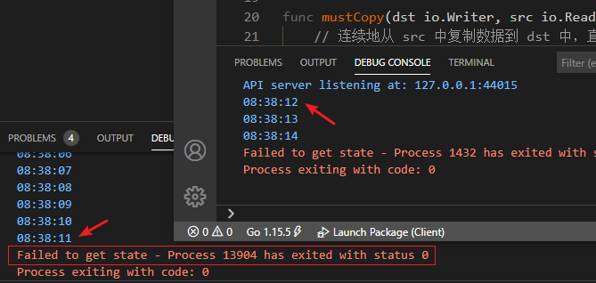
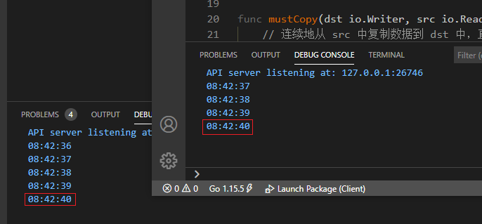
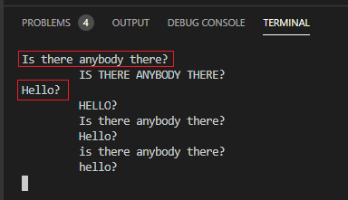
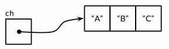
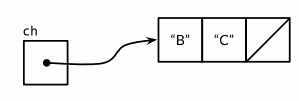
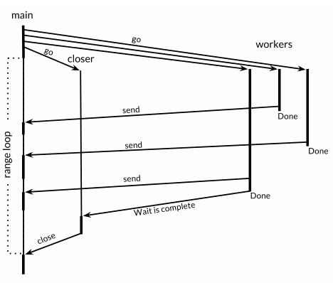

并发编程表现为程序由若干个自主的活动单元组成，比如 Web 服务器可以一次（同时）处理数千个请求。

平板电脑和手机应用在渲染用户界面的同时，后端还同步进行着计算和处理网络请求。甚至传统的批处理任务——读取、计算、将结果输出——也使用并发来隐藏 I/O 操作的延迟，**充分利用现代的多核计算机**。计算机的性能每年都在以非线性的速度增长。

**并发**是指在一个处理器上同时处理多个任务，而**并行**是指多个处理器或者多核的处理器同时处理多个不同的任务。==**并发是逻辑上的同时发生（也就是仍然需要操作系统做时间片的划分），而并行是物理上的同时发生**==。来一个确切的比喻：并发是一个人同时吃三个馒头，并行则是三个人同时吃三个馒头（每人一个）。

> 『平板电脑和手机应用在**渲染用户界面**的同时，**后端**还同步进行着计算和处理网络请求。』上面描述的场景就是经常在 Android 平台上这样操作的，Main 线程执行界面渲染，Work 线程在后台执行数据加载、网络请求、计算等任务...
>

Go 有**两种并发编程**的风格：

1. **goroutine 和 channel**：支持==顺序通信进程== Communicating Sequential Process，CSP 是**一种现代的并发编程模型**，**在不同的执行体 goroutine 之间传递值，但是变量本身局限于单一的执行体**。Go 语言关于并发编程的思想精髓：`Do not communicate by share memory, share memory by communicating.`
2. **多线程共享内存**：一种==传统的并发模型==。

即使 Go 对并发的支持是其很大的长处，并发编程在本质上也比顺序编程要困难一些，跟踪调试并发程序还是很困难的，**在线性程序（顺序程序）中形成的直觉往往还会使我们误入歧途**。如果这是读者第一次接触并发，推荐稍微多花一些时间来思考这两个章节的样例。

# 1 Goroutines

内容导读：

* 在 main 中创建 goroutine 执行多个任务；
* main 返回时，会直接结束掉所有的 goroutine；

在 Go 语言中，**每一个并发的执行单元**叫作一个 goroutine。

考虑一个程序，它有两个函数，一个做一些计算工作，另一个将结果输出，假设它们不互相调用。顺序程序可能调用一个函数，然后调用另一个，但是在有**多个 goroutine 的并发程序**中，对两个函数的调用则可能发生在**同一时刻**。马上就会看到这样的一个程序。

如果你使用过操作系统或者其他语言中的**线程**，可以==假设 goroutine 类似于线程==，然后写出正确的程序！goroutine 和线程的本质区别会在后面章节阐述。

> 当然，在 Android 中可以使用 Thread + Handler 很快就能实现，其中 Thread 用于后台计算子任务，Handler 用于线程间通信。一旦 Thread 计算完成后，通过 Main 的 Handler 让其知道 Thread 已经计算完毕了，可以更新 UI 了。

当一个程序启动时，**只有一个 goroutine 来调用 main 函数**，称它为 `main goroutine`。新的 goroutine 通过 go 语句进行创建。语法上，一个 go 语句是在普通的函数或者方法调用前加上 go 关键字前缀。go 语句==使函数在一个新创建的 goroutine 中运行==。go 语句本身会迅速地完成：

~~~go
f()    // 调用 f() 并等待返回，意味着可能会阻塞后面的程序代码执行
go f() // 新建一个调用 f() 的 goroutine，不用等待！
~~~

下面的实例展示的是：主 goroutine 中计算第 45 个斐波那契数，因为其使用非常低效的递归算法，需要大量的时间来执行，在此期间提供了一个可见的提示，显示一个字符串 spinner 来指示程序依然在运行：

~~~go
package main

import "fmt"
import "time"

func main() {
	go spinner(100 * time.Millisecond)
	const n = 45
	fibN := fib(n)
	fmt.Printf("\rFibonacci(%d) = %d\n", n, fibN)
}

func spinner(delay time.Duration) {
	for {
        // 特别注意，此处使用的是 `` 常量！
		for _, r := range `-\|/` {
			fmt.Printf("\r%c", r)
			time.Sleep(delay)
		}
	}
}

func fib(x int) int {
	if x < 2 {
		return x
	}
	return fib(x-1) + fib(x-2)
}

~~~

程序运行若干秒后，fib(45) 执行完毕并返回，main 函数输出结果。==main 函数返回时，所有的 goroutine 都暴力地直接终结==，然后程序退出。

除了==从 main 返回或者退出程序==之外，==没有程序化的方法让一个 goroutine 来停止另一个==，但是，有办法和 goroutine 通信来要求它**自己停止**。

留意一下这里的 2 个独立的单元是如何进行组合的，spinning 和斐波那契的计算。**2 个单元分别在独立的函数中，但却会同时执行**。

# 2 示例：并发的 Clock 服务

**网络编程是并发大显身手的一个领域**！

由于服务器是最典型的需要同时处理很多连接的程序，这些连接一般来自于彼此独立的客户端。在 Go 的 net 包中，提供了构建客户端和服务器程序的组件，这些程序通过 TCP、UDP 或者 UNIX Socket 进行通行。

下面的例子是顺序时钟服务器，它以每秒钟一次的频率**向客户端发送当前时间**，即**一个定期报告时间的 TCP 服务器**或者称为“并发时钟服务器”

~~~go
package main

import (
	"io"
	"log"
	"net"
	"time"
)

func main() {
	listener, err := net.Listen("tcp", "localhost:8000")
	if err != nil {
		log.Fatal(err)
	}

	for {
        // 允许连接
		conn, err := listener.Accept()
		if err != nil {
			log.Print(err) // 例如，连接中断
			continue
		}
         // 响应连接，顺序地响应连接，一次处理一个连接（不支持并发处理多个连接）
		handleConn(conn)
	}
}

func handleConn(c net.Conn) {
	defer c.Close()
	for {
        // SING time.Now() 函数返回的 Time 对象的方法 Format 有特定的 layout 格式
		_, err := io.WriteString(c, time.Now().Format("15:04:05\n"))
		if err != nil {
			return // 例如，连接断开
		}
		time.Sleep(1 * time.Second)
	}
}
~~~

Listen 函数创建一个 `net.Listener` 对象，它在一个网络端口上监听进来的连接，这里是 TCP 端口 localhost:8080。**监听器的 Accept 方法被阻塞**，直到有连接请求进来，然后返回 `net.Conn` 对象来代表一个连接。

`handleConn` 函数处理一个完整的客户**连接**。在循环里，它将 `time.Now()` 获取的当前时间发送给客户端。因为 `net.Conn` 满足 `io.Writer` 接口，所以可以直接向它进行**写入**。当写入失败时循环结束，很多时候是客户端断开连接，这时 `handleConn` 函数使用**延迟**的 Close 调用关闭自己这边的连接，然后继续等待下一个连接请求。time 包定义了许多标准时间格式的模板。

此处可以使用多个 Client 连接服务端，看看从上述服务端获得的输出是怎样的？让我们同时运行两个客户端来进行一个测试，这里可以**打开两个终端窗口**，下面左边的是其中的一个输出，右边的是另一个的输出：

`killall` 是一个 Unix 命令行工具，可以用给定的进程名来杀掉所有名字匹配的进程。==第二个客户端必须等待第一个客户端完成工作，这样服务端才能继续向后执行==。因为我们这里的服务器程序**同一时间只能处理一个客户端连接**。因为服务器是==顺序的==，一次只能处理一个客户请求。**让服务器支持并发**只需要一个很小的改变：

~~~go
func main() {
	...
	for {
		conn, err := listener.Accept()
		if err != nil {
			log.Print(err) // 例如，连接中断
			continue
		}
		go handleConn(conn) // 一次处理一个连接
	}
}
~~~

在调用 `handleConn` 的地方添加一个 go 关键字，使它在自己的 goroutine 中执行。

多个 Client 同时连接 Server 时，会在“相差无几”的时间间隔之内获得服务端的时间响应，实现了并发处理多个连接的功能！

如果系统上没有安装 `nc` 或 `netcat`，可以使用 telnet 或者一个使用 `net.Dial` 实现的 Go 版的 `netcat` 来**连接 TCP 服务器**，相当于是**客户端程序**：

~~~go
package main

import (
	"io"
    "log"
    "net"
    "os"
)

func main() {
    conn, err := net.Dial("tcp", "localhost:8000")
    if err != nil {
        log.Fatal(err)
    }
    
    defer conn.Close()
    mustCopy(os.Stdout, conn)
}

func mustCopy(dst io.Writer, src io.Reader) {
    if _, err := io.Copy(dst, src); err != nil { // 连续地从 src 中复制数据到 dst 中，直到 EOF 或出错
        log.Fatal(err)
    }
}
~~~

这个程序从网络连接中读取，然后写到标准输出，**直到到达 EOF 或者出错**。

# 3 示例：并发的 Echo 服务

下面的部分我们构建一个**回声服务器**，每个连接使用多个 goroutine 处理。大多数的回声服务器仅仅**将读到的内容写回去**，它可以使用下面简单的 `handleConn` 版本完成：

~~~go
func handleConn(c net.Conn) {
    io.Copy(c, c)
    c.Close()
}
~~~

更有意思的**回声服务器**可以模拟真实的回声，第一次大的回声（“HELLO!”），在一定延迟后中等音量的回声（“Hello!”），然后安静的回声（“hello!”），最后什么都没有了：

~~~go
func echo(c net.Conn, shout string, delay time.Duration) {
    fmt.Fprintln(c, "\t", strings.ToUpper(shout))
    time.Sleep(delay)
    fmt.Fprintln(c, "\t", shout)
    time.Sleep(delay)
    fmt.Fprintln(c, "\t", strings.ToLower(shout))
}

func handleConn(c net.Conn) {
    input := bufio.NewScanner(c)
    // 响应每次 Client --> Server 的输入
    for input.Scan() {
        // 当 go 语句执行时，计算 echo 函数所对应的参数，input.Text() 是在主 goroutine 中推演
        go echo(c, input.Text(), 1*time.Second)
    }
    // 注意：忽略 input.Err() 中可能的错误
    c.Close()
}
~~~

**升级客户端程序**，使它可以在终端上向服务器输入，还可以将服务器的回复复制到输出：

~~~go
func main() {
    conn, err := net.Dial("tcp", "localhost:8000")
    if err != nil {
        log.Fatal(err)
    }
    defer conn.Close()
    // conn --> os.Stdout
    go mustCopy(os.Stdout, conn)
    // os.Stdin --> conn
    mustCopy(conn, os.Stdin)
}

func mustCopy(dst io.Writer, src io.Reader) {
    // 连续地从 src 中复制数据到 dst 中，直到 EOF 或出错
    if _, err := io.Copy(dst, src); err != nil {
        log.Fatal(err)
    }
}
~~~

当主 goroutine 从标准输入读取并发送到服务器的时候，第二个 goroutine 读取服务器的回复并且输出。当主 goroutine 的输入结束时，例如用户在终端按入 Control + D 组合键（在 Windows 中，是按下 Ctrl + Z 组合键）时，这个程序停止，即使其他的 goroutine 还在运行（相当于 main 函数返回了，“暴力”地让所有 goroutine 都停止运行）。

回响是并发并且会按时间来覆盖掉其它响应：

此时，服务器变成并发所要做的，不仅处理来自多个客户端的链接，**还包括在一个连接处理中，使用多个 go 关键字**。然而，在添加这些 go 关键字的同时，必须要仔细考虑方法 `net.Conn` 的并发调用是不是安全的，对大多数类型来说，这都是不安全的。

# 4 channel

内容导读：

* channel 和 goroutine 的关系；

如果说 goroutine 是 Go 程序并发的==执行体==，channel 就是==它们之间的连接==。

==通道==是可以让一个 goroutine 发送特定值到一个 goroutine 的==通信机制==。**每一个通道是一个具体类型的导管，叫作通道的元素类型**。一个有 `int` 类型元素的通道写为 `chan int`。

使用内置的 make 函数来**创建一个通道**：

~~~go
package main

import "fmt"

func main() {
	chnl := make(chan int)
	fmt.Printf("%p, %p.\n", chnl, &chnl) // 0xc00001a120, 0xc000006028.
}
~~~

像 map 一样，通道是一个使用 make 创建的数据结构的**引用**。当复制或者作为参数传递到一个函数时，**复制的是引用**，这样调用者和被调用者都引用同一份数据结构。和其他引用类型一样，**通道的零值**是 nil。

**同种类型的通道**可以使用 == 符号进行比较。当二者都是**同一通道**数据的引用时，比较值为 true。通道也可以和 nil 进行比较。

通道有两个主要操作：**发送（send）和接收（receive）**（站在程序本地的角度，发送数据是指向 channel 发送数据，接收数据是指从 channel 获取数据），两者统称为==通信==。send 语句从一个 goroutine 传输一个值到另一个**在执行接收表达式**的 goroutine。**两个操作都使用 `<-` 操作符书写**。发送语句中，通道和值分别在 `<-` 的左右两边。在接收表达式中，`<-` 放在通道操作数前面。在接收表达式中，其结果未被使用也是合法的。

~~~go
ch <- x // 发送语句
x = <-ch // 赋值语句中的接收表达式
<-ch // 接收语句，丢弃结果
~~~

通道支持第三个操作：关闭（close），它设置一个标志位来**指示值当前已经发送完毕**，这个通道后面没有值了，随后对基于该 Channel 的任何发送操作都将导致 panic 异常。在一个**已经关闭的通道上进行接收操作**，依然可以接收到之前已经成功发送的数据；如果 Channel 中已经没有数据的话将产生一个零值的数据。调用内置的 `close(ch)` 来关闭通道。

使用简单的 make 调用创建的通道叫**无缓存（unbuffered）通道**，make 还可以接受第二个可选参数，一个表示通道容量的整数。如果容量是 0，make 创建一个无缓存道；如果 Channel 的**容量大于零**，那么该 Channel **就是带缓存的**：

~~~go
ch = make(chan int)
ch = make(chan int, 0)
ch = make(chan int, 3) // 容量为 3 的缓存通道

func main() {
	chnl := make(chan int, 3)
	fmt.Printf("%p, %p, %d.\n", chnl, &chnl, cap(chnl)) // 0xc00001a120, 0xc000006028, 3.

	chnl2 := chnl
	if chnl == chnl2 {
		fmt.Println("==")
	}
}
~~~

对 channel 变量来说，只能对其调用 cap 函数，获取容量，而不能调用 `len`。

## 4.1 无缓存通道

内容导读：

无缓存通道上的发送操作将会==阻塞==，直到另一个 goroutine 在对应的通道上执行接收操作，这时值传送完成，两个 goroutine 都可以继续执行。相反，如果接收操作先执行，接收方 goroutine 将==阻塞==，直到另一个 goroutine 在同一个通道上发送一个值。即：**对于无缓存的 Channel 来说，先执行的 goroutine 会直接阻塞，直到另一个 goroutine 执行对应的动作执行了才会被唤醒**。

~~~go
func main() {
	chnl := make(chan int)
	fmt.Printf("%p, %p, %d.\n", chnl, &chnl, cap(chnl)) // 0xc00001a120, 0xc000006028.

	go func() {
		fmt.Println("value:", <-chnl)
	}()

	chnl <- 4
	fmt.Println("chnl <- 4")

	time.Sleep(5 * time.Second)
}
~~~

goroutine 首先会执行，但是会在读取 channel 时会阻塞，直到 main goroutine 执行了 `chnl<-4`，才会继续执行。

使用无缓存通道进行通信将导致==**发送和接收 goroutine 做一次同步操作**==。因此，无缓存通道也称为**同步通道**。当通过一个无缓存的 Channels 发送数据时，==接收者收到数据发生在唤醒发送者 goroutine 之前==。

> happens before 这是 Go 语言并发内存模型的一个关键术语
>
> 当讨论并发编程时，当我们说 x 事件在 y 事件之前发生（happens before），我们并不是说 x 事件在时间上比 y 时间更早；我们要表达的意思是要保证在此之前的时间都已经完成了。例如在此之前的更新某些变量的操作已经完成，你可以放心依赖这些已经完成的事件了。
>
> 当我们说 x 事件既不是在 y 事件之前发生也不是在 y 事件之后发生，我们就说 x 事件和 y 事件是并发的。这并不意味着 x 事件和 y 事件就一定是同时发生的，==我们只是不能确定这两个时间发生的先后顺序==。
>
> 在后面章节中，我们将看到：当两个 goroutine 并发访问了相同的变量时，我们有必要保证某些事件的执行顺序，以避免出现某些并发问题。

在讨论并发的时候，当我们说 x 早于 y 发生时，不仅仅是说 x 发生的时间早于 y，而是说保证它是这样，并且是**可预期的**，比如更新变量，我们可以依赖这个机制。**当 x 既不比 y 早也不比 y 晚时**，我们说 x 和 y ==并发==，这不意味着，x 和 y 一定同时发生，只说明==我们不能假设它们的顺序==。

在之前的 Echo 客户端中，主 goroutine 中将输入复制到服务器中，这样客户端在输入接收后立即退出，即使后台 goroutine 还在继续：

~~~go
...

func main() {
	conn, err := net.Dial("tcp", "localhost:8000")
	if err != nil {
		log.Fatal(err)
	}
	defer conn.Close()
	go mustCopy(os.Stdout, conn)
	mustCopy(conn, os.Stdin)
}

func mustCopy(dst io.Writer, src io.Reader) {
	// 连续地从 src 中复制数据到 dst 中，直到 EOF 或出错
	if _, err := io.Copy(dst, src); err != nil {
		log.Fatal(err)
	}
}

~~~

`mustCopy(conn, os.Stdin)` 在执行时，一旦键入结束字符，会导致该方法返回，此时 main goroutine 结束，让其他 goroutine 也“暴力”结束。那现在可能的问题在于：`go mustCopy(os.Stdout, conn)` 有可能还需要接收 `Echo`！

为了能让程序等待后台的 goroutine 在完成后再退出，使用一个通道来同步两个 goroutine：

~~~go
func main() {
    conn, err := net.Dial("tcp", "localhost:8000")
    if err != nil {
        log.Fatal(err)
    }
    done := make(chan struct{})
    go func() {
        // 后台 goroutine 接收到服务端反馈，将内容输出到控制台
		_, err := io.Copy(os.Stdout, conn)
		if err != nil {
			log.Fatal(err)
		}
        
        log.Println("done")
        // 等待 Echo 完毕（发送Action）
        done <- struct{}{}
    }()
    // 客户端输入通过 TCP 传送到服务端
    mustCopy(conn, os.Stdin)
    conn.Close()
    <-done // 持续阻塞，直到（等待）后台 goroutine 完成（接收 Action）
}

func mustCopy(dst io.Writer, src io.Reader) {
	// 连续地（阻塞地）从 src 中复制数据到 dst 中，直到 EOF 或出错
	num, err := io.Copy(dst, src)
    // 直到 EOF 时，才会打印所有加入的字节数
	fmt.Println("num:", num)

	if err != nil {
		log.Fatal(err)
	}
}
~~~

特别注意：当用户关闭标准输入流时（Control + D），`mustCopy` 返回（否则持续阻塞）。对于 `Ctrl+D` 指令来说，意味着 `os.Stdin` 的 EOF 标志，也就是说，输入结束！紧接着，Client 的主 goroutine 调用 `conn.Close()` 来关闭写方向的网络连接，关闭写==半边==的连接会导致服务器收到文件 EOF 标志。Server 在接收到 EOF 后，紧接着会调用 `c.Close()`，用以关闭读==半边==的连接。关闭读==半边==的连接导致 Client 后台 goroutine 调用 `io.Copy` 返回 `2021/02/02 11:09:59 read tcp 127.0.0.1:46828->127.0.0.1:8000: use of closed network connection` 错误。

~~~go
func handleConn(c net.Conn) {
	input := bufio.NewScanner(c)
	for input.Scan() { // Client 关闭写半边连接时，Server 收到 EOF
		// 当 go 语句执行时，计算 echo 函数所对应的参数，input.Text() 是在主 goroutine 中推演
		go echo(c, input.Text(), 1*time.Second)
	}
	// 注意：忽略 input.Err() 中可能的错误
	c.Close()
    fmt.Println("c.Close()")
}

func echo(c net.Conn, shout string, delay time.Duration) {
	fmt.Fprintln(c, "\t", strings.ToUpper(shout))
	time.Sleep(delay)
	fmt.Fprintln(c, "\t", shout)
	time.Sleep(delay)
	fmt.Fprintln(c, "\t", strings.ToLower(shout))
}
~~~

Server 端在调用了 `c.Close()` 后，Client 端会在 `io.Copy(os.Stdout, conn)` 处有所响应。此处是返回错误！

在它返回前，后台 goroutine 记录一条消息，然后发送一个值到 done 通道。主 goroutine 在退出前一直等待，直到它接收到这个值。最终效果是程序总是在退出前记录 done 消息！

通过通道发送消息有两个重要的方面需要考虑。每一条消息有一个值，但有时候通信本身以及通信发生的时间也很重要。当我们强调这方面的时候，把消息叫作**事件**（Event）。**当事件没有携带额外的信息时，它单纯的目的是进行同步**。我们通过使用一个 `struct{}` 元素类型的通道来强调它，尽管通常使用 bool 或 `int` 类型的通道来做相同的事情，因为 `done <- -1` 比 `done <- struct{}{}` 要更短。

## 4.2 管道

通道可以用来连接 goroutine，这样**一个的输出是另一个的输入**，这个叫管道（pipeline）。也就是说，管道是一种特殊情况存在的 Channel！

~~~go
func main() {
    naturals := make(chan int)
    squares := make(chan int)
    
    // counter goroutine
    go func() {
        for x := 0;;x++ {
            naturals <- x
            // 控制了 naturals 也就控制了整个打印节奏
            time.Sleep(1 * time.Second)
        }
    }()
    
    // squarer
    go func() {
        for {
            x := <- naturals
            squares <- x * x
        }
    }()
    
    // printer
    for {
        fmt.Println(<-squares)
    }
}
~~~

上述程序会输出无限的平方序列：0，1，4，9，···。像**这样的管道出现在长期运行的服务器程序中**，其中通道用于在包含无限循环的 goroutine 之间整个生命周期中的通信。如果要通过管道发送有限的数字怎么办？

如果发送方知道没有更多的数据要发送，告诉接收者所在 goroutine 可以**停止等待**是很有用的，因为接收者可以停止不必要的接收等待。这可以通过调用内置的 close 函数来关闭通道：`close(naturals)`。

在 Channel 关闭后，任何后续的**发送操作**将会的导致应用**崩溃**。当关闭的通道被读完（就是最后一个发送的值被接收）后，所有后续的接收操作顺畅进行，它们**会立即返回一个零值**。关闭 naturals 通道并不能终止循环，会导致计算平方的循环==快速运转==，并将结果 0 传递给 printer goroutine（只能从 `naturals` 中读取到 `int` 的零值）。

没有一个直接的方式来==判断是否通道已经关闭==，但是这里有接收操作的一个变种，它产生两个结果：接收到的通道的元素，以及一个布尔值（通常称为 ok），它为 true 的时候代表接收成功，false 表示**当前的接收操作在一个关闭的并且里面没有值可接收的 Channel 上**。修改上述代码：

~~~go
go func() {
    for {
        x, ok := <- naturals
        if !ok {
            break // 通道关闭并且读完
        }
        squares <- x*x
    }
    close(squares)
}()
~~~

上面的语法显得比较笨拙，而模式又比较通用，**所以 Go 语言也提供了 range 循环语法以在通道上迭代**。这个语法更方便接收在通道上所有发送的值，接收完最后一个值后关闭循环：

~~~go
func main() {
    naturals := make(chan int)
    squares := make(chan int)
    
    // counter
    go func() {
        for x := 0; x < 100; x++ {
            naturals <- x
        }
        close(naturals)
    }()
    // squarer
    go func() {
        for x := range naturals {
            squares <- x*x
        }
        close(squares)
    }()
    // printer
    for x := range squares {
        fmt.Println(x)
    }
}
~~~

**结束时，关闭每一个通道不是必需的**。只有在通知接收方 goroutine 所有的数据都发送完毕的时候才需要关闭通道。通道也是可以通过垃圾回收器根据它是否可以访问来决定是否回收它，而不是根据它是否关闭。（不要将这个 close 操作和对于文件的 close 操作混淆。当结束的时候对每一个文件调用 close 方法是非常重要的。）

试图重复关闭一个 Channel 将导致 panic 异常，试图关闭一个 nil 值的 Channel 也将导致 panic 异常。

关闭一个 Channel 还会触发一个**广播机制**，这点在后续会阐述。

## 4.3 单方向 Channel

内容导读：

当程序演进时，将大的函数拆分为多个更小的是很自然的。上面的实例使用了三个 goroutine，两个通道用来通信，它们（naturals 和 squares）都是 main 的局部变量，程序自然划分为三个函数：

~~~go
func counter(out chan int)
func squarer(out, in chan int)
func printer(in chan int)
~~~

squarer 函数处于管道的中间，使用两个参数：输入通道和输出通道。它们有相同的类型，但是用途是相反的：in 仅仅用来接收，out 仅仅用来发送，in 和 out 两个名字是特意使用的，但是没有什么东西阻碍 squarer 函数通过 in 来发送或者通过 out 来接收。

这种场景是典型的：==当一个通道用做函数的形参时，它几乎总是被专门用于只发送或者只接收！==

为了表明这种意图并防止被滥用，Go 语言的类型系统提供了**单方向的 Channel 类型**，分别用于**只发送或只接收的 Channel**。类型 `chan<- int` 表示一个**只发送** `int` 的 Channel，只能发送不能接收。相反，类型 `<-chan int` 表示一个只接收 `int ` 的 Channel，只能接收不能发送。箭头 `<-` 和关键字 `chan` 的相对位置表明了 Channel 的方向。**这种限制将在编译期检测**。

因为关闭操作只用于断言不再向 Channel 发送新的数据，所以只有在发送者所在的 goroutine 才会调用 close 函数，因此对一个只接收的 Channel 调用 close 将是一个编译错误。

~~~go
package main

import "fmt"

func main() {
	naturals := make(chan int)
	squares := make(chan int)

	go counter(naturals)
	go squarer(squares, naturals)

	printer(squares)
}

func counter(out chan<- int) {
	for x := 0; x < 100; x++ {
		out <- x
	}
	// 关闭发送的 Channel
	close(out)
}

func squarer(out chan<- int, in <-chan int) {
    // chan<- int, <-chan int
    fmt.Printf("%T, %T\n", out, in)
	// in 引用的是 naturals Channel，在此处作为输入数据的通道
	for v := range in {
		out <- v * v
	}
	// 关闭发送的 Channel
	close(out)
}

func printer(in <-chan int) {
	// in 引用的是 squares Channel，在此处作为输入数据的通道
	for v := range in {
		fmt.Println(v)
	}
}
~~~

调用 `counter(naturals)` 时，`naturals` 的类型将**隐式**地从 `chan int` **转换**成 `chan<- int`。调用 `printer(squares)` 也会导致相似的隐式转换，这一次是转换为 `<-chan int` 类型只接收型的 Channel。任何双向 Channel 向单向 Channel 变量的赋值操作都将导致该隐式转换。但并没有反向转换的说法！

如果在上述程序中，对 `printer` 中的 `in` 通道的读取数据过程做延时处理，==整个程序会怎么样？==

~~~go
func printer(in <-chan int) {
	// in 引用的是 squares Channel，在此处作为输入数据的通道
	for v := range in {
		fmt.Println(v)
        // goroutine 休眠
		time.Sleep(time.Duration(1) * time.Second)
	}
}
~~~

确实，如果在最终的 `printer(in <-chan int)` 中对 `squares` 通道的读取数据做延迟处理，则会让“整个数据产出链条”变慢！也就是每 1 秒打印一个数值。

## 4.4 带缓存的 Channel

内容导读：

带缓存的 Channel 内部持有一个元素队列，队列的最大容量是在调用 make 函数创建 Channel 时通过第二个参数指定的。下面的语句创建了**一个可以持有 3 个字符串元素的带缓存 Channel**。

~~~go
ch = make(chan string, 3)
~~~

向缓存 Channel 的==发送==操作就是**向内部缓存队列的尾部插入元素**，==接收==操作则是**从队列的头部删除元素**。如果内部缓存队列是满的，那么发送操作将阻塞直到因**另一个 goroutine** 执行接收操作而释放了新的队列空间。相反，如果 Channel 是空的，接收操作将阻塞直到**另一个 goroutine** 执行发送操作而向队列插入元素。

我们可以在**无阻塞的情况下**连续向新创建的 Channel 发送三个值：

~~~go
ch <- "A"
ch <- "B"
ch <- "C"
~~~

此刻，Channel 的内部缓存队列将是满的，如果有第四个发送操作将发生阻塞：

~~~go
package main

import (
	"fmt"
	"time"
)

func main() {
	naturals := make(chan string, 3)

	go func() {
		time.Sleep(time.Duration(5) * time.Second)
		fmt.Println(<-naturals)
	}()

	for i := 0; i < 4; i++ {
        // 第四次 send 时会阻塞，一直等到 5 秒后另外的 goroutine recv 后才会继续执行
		naturals <- "A"
	}

	time.Sleep(time.Duration(1) * time.Second)
	close(naturals)
}
~~~

如果我们接收一个值：

~~~go
fmt.Println(<-ch)
~~~

那么 Channel 的缓存队列将**不是满的也不是空的**，因此对该 Channel 执行的发送或接收操作都不会发生阻塞。通过这种方式，Channel 的缓存队列解耦了接收和发送的 goroutine。

在某些特殊情况下，程序可能需要知道 Channel 内部缓存的容量，可以用内置的 cap 函数获取：

~~~go
fmt.Println(cap(ch))
~~~

同样，对于内置的 `len` 函数，如果传入的是 Channel，那么将返回 Channel 内部缓存队列中有效元素的个数。因为==在并发程序中该信息会随着接收操作而失效==，但是它对某些故障诊断和性能优化会有帮助。

~~~go
fmt.Println(len(ch))
~~~

在继续执行两次接收操作后 Channel 内部的缓存队列将又成为空的，如果有第四个接收操作将发生阻塞。

在这个例子中，发送和接收操作都发生在同一个 goroutine 中，但是在真实的程序中它们一般由不同的 goroutine 执行。Go 语言新手有时候会将一个带有缓存的 Channel 当作同一个 goroutine 中的队列使用，虽然语法看似简单，但实际上这是一个错误。**Channel 和 goroutine 的调度器机制是紧密相连的**，如果没有其他 goroutine 从 Channel 接收，==发送者——或许是整个程序——将会面临永远阻塞的风险==。如果你只是需要一个简单的队列，使用 Slice 就可以了。

下面的例子展示了一个使用带缓存 Channel 的应用，它并发地向三个镜像站点发出请求，三个镜像站点分散在不同的地理位置。它们分别将收到的响应发送到带缓存 Channel，最后**接收者只接收第一个收到的响应**，也就是==最快的那个响应==。顺便说一下：多个 goroutine 并发地向同一个 Channel 发送数据，或从同一个 Channel 接收数据都是常见的用法。

~~~go
package main

import (
	"fmt"
	"time"
)

func main() {
	naturals := make(chan string, 3)

	go requestSlow(naturals)
	go requestNormal(naturals)
	go requestFast(naturals)
	// Fast
	fmt.Println("request fast name:", <-naturals)
}

func requestSlow(in chan<- string) {
	time.Sleep(time.Duration(3) * time.Second)
	in <- "Slow"
}

func requestNormal(in chan<- string) {
	time.Sleep(time.Duration(2) * time.Second)
	in <- "Normal"
}

func requestFast(in chan<- string) {
	time.Sleep(time.Duration(1) * time.Second)
	in <- "Fast"
}
~~~

如果我们使用了无缓存的 Channel，那么两个慢的 goroutine 将会因为没有人接收而被永远卡住。这种情况，称为 **goroutine 泄漏**，这将是一个 ==bug==！和垃圾变量不同，**泄漏的 goroutine 并不会被自动回收**，因此==确保每个不再需要的 goroutine 能正常退出是重要的==。

关于无缓存或带有缓存的 Channel  之间选择，或者是带缓存 Channel 的容量大小的选择，都可能影响程序的正确性。无缓存 Channel **更强地保证了每个发送操作与相应的同步接收操作**。但是对于带缓存 Channel，这些操作是**解耦的**。同样，即使我们知道将要发送到一个 Channel 的信息的数量上限，创建一个对应容量大小的带缓存 Channel 也是不现实的，因为这要求在执行任何接收操作之前缓存所有已经发送的值。如果未能分配足够的缓存将导致==程序死锁==。

Channel 的缓存也可能影响程序的性能。想象一家蛋糕店有 3 个厨师，一个烘焙，一个上糖衣，还有一个将每个蛋糕传递到它下一个厨师的生产线。在狭小的厨房空间环境，每个厨师在完成蛋糕后必须等待下一个厨师已经准备好接受它（传输工作受阻）。这类似于**在一个无缓存的 Channel 上进行沟通**。

如果在每个厨师之间有一个放置一个蛋糕的额外空间，那么每个厨师就可以将一个完成的蛋糕临时放在那里而马上进入下一个蛋糕的制作中。这类似于将 Channel 的缓存队列的容量设置为 1。只要每个厨师的平均工作效率相近，那么其中**大部分的传输工作将是迅速的**，**个体之间细小的效率差异**将在交接过程中弥补。如果厨师之间有更大的额外空间——也就是更大容量的缓存队列——将可以在不停止生产线的前提下**消除更大的效率波动**，例如一个厨师可以短暂地休息，然后再加快赶上进度而不影响其他人。

另一方面，如果生产线的前期阶段一直快于后续阶段，那么它们之间的缓存在大部分时间都将是满的。相反，如果后续阶段比前阶段更快，那么它们之间的缓存在大部分时间都将是空的。对于这类场景，额外的缓存并没有带来任何好处。

生产线的隐喻对于理解 Channel 和 goroutine 的工作机制是很有帮助的。例如，如果第二阶段是需要精心制作的复杂操作，一个厨师可能无法跟上第一个厨师的进度，或者是无法满足第三阶段厨师的需求。要解决这个问题，我们可以再雇佣另一个厨师来完成第二阶段的工作，他执行相同的任务但是独立工作。这类似基于相同的 Channel 创建另一个独立的 goroutine。

# 5 并发循环

下面是一些用来在**并行时循环迭代**的**常见并发模型**：

我们会探究从全尺寸图片生成一些缩略图的问题，对于这个功能可以这样转换：

~~~go
func imageFile(infile string) (string, error) {
	time.Sleep(time.Duration(2) * time.Second)
	return infile + ".thumb.jpg", nil
}
~~~

下面的程序会**循环迭代**一些图片文件名，并**为每一张图片生成一个缩略图**：

~~~go
func makeThumbnails(filenames []string) {
	for _, f := range filenames {
		if _, err := imageFile(f); err != nil {
			log.Println(err)
		}
	}
}
~~~

显然我们处理文件的顺序无关紧要（这就是上述使用的就是顺序执行逻辑），因为每个图片的拉伸操作和其他图片的处理操作都是彼此独立的。像这种**子问题都是完全独立的**问题称作为**易并行问题**。易并行问题是最容易被实现成并行的一类问题，并且最能够享受到并发带来的好处，能够随着并行的规模线性地扩展。

下面让我们并行地执行这些操作，从而将文件 IO 的延迟隐藏掉，并且用上多核 CPU 的计算能力来拉伸图像。我们的第一个并发程序只是使用了一个 go 关键字。这里我们先忽略掉错误，之后再进行处理。

~~~go
package main

import (
	"time"
)

func main() {
	var filenames = []string{"A", "B", "C"}
	makeThumbnails(filenames)
}

func makeThumbnails(filenames []string) {
	for _, f := range filenames {
		// 忽略 Error
		go imageFile(f)
	}
}

func imageFile(infile string) (string, error) {
	time.Sleep(time.Duration(2) * time.Second)
	return infile + ".thumb.jpg", nil
}

~~~

这个版本运行得实在有点太快，实际上，由于它比最早的版本使用的时间要短得多，即使当文件名的 Slice 中只包含一个元素。出现这种现象的原因是：`makeThumbnails` **在它还没有完成工作之前就已经返回了**。它启动了所有的 goroutine，每一个文件名对应一个，==但没有等待它们一直到执行完毕==。

**没有什么直接的办法能够等待 goroutine 完成**，但是我们可以改变 goroutine 里的代码让其能够将完成情况报告给外部的 goroutine 知晓，使用的方式是**向一个共享的 Channel 中发送事件**。因为我们已经确切地知道有 `len(filenames)` 个内部 goroutine，所以外部的 goroutine 只需要在返回之前对这个事件计算。

~~~go
package main

import (
	"fmt"
	"time"
)

func main() {
	var filenames = []string{"A", "B", "C"}
	makeThumbnails(filenames)
}

func makeThumbnails(filenames []string) {
	ch := make(chan struct{})
	for _, f := range filenames {
		// 忽略 Error，定义匿名的 func 其中函数形参为 f string
		go func(f string) {
			imageFile(f)
			ch <- struct{}{}
		}(f) // 为 func 传递实参 f
	}

	// 循环执行 filenames 次 <-ch 语句
	for range filenames {
		<-ch
	}
}

func imageFile(infile string) (string, error) {
	// 根本没有运行，直接在 main() 返回之后被强制停止
	fmt.Println("run imageFile:", infile, " start!")
    
	time.Sleep(time.Duration(5) * time.Second)
    
	fmt.Println("run imageFile:", infile, " end!")
	return infile + ".thumb.jpg", nil
}
~~~

注意，我们将 f 的值作为一个显式的变量传递给**匿名函数**，而不是：

~~~go
func makeThumbnails(filenames []string) {
	ch := make(chan struct{})
	for _, f := range filenames {
		// 忽略 Error
		go func() {
            // 已经在 goroutine 中执行了 imageFile(f)
            imageFile(f) // NOTE: incorrect
			ch <- struct{}{}
		}() 
	}

    // 循环执行 filenames 次 <-ch 语句，程序在在此处阻塞，并等待 go func() 结束！
	for range filenames {
		<-ch
	}
}
~~~

这个区别本质是：==匿名函数中循环变量快照问题==。上述**这个单独的变量 f 是被所有的匿名函数值所共享**，且**会被连续的循环迭代所更新**。当新的 goroutine 开始执行字面函数时，for 循环可能已经更新了 f 并且开始了另一轮的迭代或者（更有可能的）已经结束了整个循环，所以当这些 goroutine 开始读取 f 的值时，它们所看到的值已经是 slice 的最后一个元素了。显式地添加这个参数，我们能够确保使用的 f 是当 go 语句执行时的“当前”的那个 f。

> 此处有一个疑问，待验证：匿名函数中循环变量快照问题！

如果我们想要从每一个 worker goroutine 往主 goroutine 中返回值该怎么办？当我们调用 `imageFile` 创建文件失败的时候，它会返回一个错误：

~~~go
func makeThumbnails(filenames []string) error {
	errors := make(chan error)
	for _, f := range filenames {
		go func(f string) {
			_, error := imageFile(f)
			errors <- error
			fmt.Println(f, "运行结束，<- error")
		}(f)
	}

	// 循环执行 filenames 次 <-errors 语句
	for range filenames {
		if err := <-errors; err != nil {
			fmt.Println("遇到了 !nil 错误，从函数中退出")
			return err // NOTE: incorrect, goroutine leak!
		}
	}

	return nil
}
~~~

这个程序有一个微妙的 bug。当它遇到第一个非 nil 的 error 时会直接将 error 返回到调用方，使得没有一个 goroutine 去排空 errors Channel。这样剩下的 worker goroutine 在向这个 Channel 中发送值的时候，**都会永远阻塞下去，并且永远都不会退出**。这种情况叫做 goroutine 泄漏，可能会==导致整个程序卡住或者跑出 out of memory 错误==！在上述代码中，在执行 `A` 任务时，程序出错 `makeThumbnails` 函数退出。在后续的 `B` 和 `C` 任务中，将不再执行 `fmt.Println(f, "运行结束，<- error")`，**程序阻塞**！

~~~go
func imageFile(infile string) (string, error) {
	// 根本没有运行，直接在 main() 返回之后被强制停止
	fmt.Println("run imageFile:", infile, " start!")

	switch infile {
	case "A":
		time.Sleep(time.Duration(1) * time.Second)
		fmt.Println("run imageFile:", infile, " end!")
         // return error
		return infile + ".thumb.jpg", errors.New(infile)
	case "B":
		time.Sleep(time.Duration(5) * time.Second)
	case "C":
		time.Sleep(time.Duration(15) * time.Second)
	default:
		break
	}

	fmt.Println("run imageFile:", infile, " end!")
	return infile + ".thumb.jpg", nil
}
~~~

最简单的解决办法就是用一个具有合适大小的 buffered Channel，这样这些 worker goroutine 向 Channel 中发送错误时就不会被阻塞（一个可选的解决办法是：创建另一个 goroutine，当 main goroutine 返回第一个错误的同时去排空 Channel）。

~~~go
package main

import (
	"errors"
	"fmt"
	"time"
)

func main() {
	var filenames = []string{"A", "B", "C"}
	thumbfiles, err := makeThumbnails(filenames)
	fmt.Println(thumbfiles, err)

	time.Sleep(50 * time.Second)
}

func makeThumbnails(filenames []string) (thumbfiles []string, err error) {
	type item struct {
		thumbfile string
		err       error
	}

	ch := make(chan item, len(filenames))
	for _, f := range filenames {
		// 忽略 Error
		go func(f string) {
			var it item
			it.thumbfile, it.err = imageFile(f) // NOTE: incorrect
			ch <- it
			fmt.Println(f, "运行结束，<- error")
		}(f)
	}

	// 循环执行 filenames 次 <-ch 语句
	for range filenames {
		it := <-ch
		if it.err != nil {
			fmt.Println("makeThumbnails 函数返回！")
			return nil, it.err
		}

		thumbfiles = append(thumbfiles, it.thumbfile)
	}

	return thumbfiles, nil
}

func imageFile(infile string) (string, error) {
	// 根本没有运行，直接在 main() 返回之后被强制停止
	fmt.Println("run imageFile:", infile, " start!")

	switch infile {
	case "A":
		time.Sleep(time.Duration(1) * time.Second)
		fmt.Println("run imageFile:", infile, " end!")
		// return error
		return infile + ".thumb.jpg", errors.New(infile)
	case "B":
		time.Sleep(time.Duration(5) * time.Second)
	case "C":
		time.Sleep(time.Duration(15) * time.Second)
	default:
		break
	}

	fmt.Println("run imageFile:", infile, " end!")
	return infile + ".thumb.jpg", nil
}
~~~

`makeThumbnails` 会返回随机的顺序的切片，比如：`[C.thumb.jpg A.thumb.jpg B.thumb.jpg] <nil> `。此版本和上一版本最大的区别是 `ch := make(chan item, len(filenames))`，创建的是一个缓冲区 Channel，即便是遇到了第一个 非 nil 错误，goroutine 也不会出现泄漏情况。

最后一个版本的 `makeThumbnails` 返回了新文件们的大小总计数（bytes）。和前面的版本都不一样的一点是我们在这个版本里没有把文件名放在 Slice 里，而是通过一个 string 的 Channel 传过来，所以**无法对循环的次数进行预测**。为了知道最后一个 goroutine 什么时候结束（**最后一个结束并不一定是最后一个开始**），我们需要一个递增的计数器，在每一个 goroutine 启动时加一，在 goroutine 退出时减一。这需要一种特殊的计数器，这个计数器需要**在多个 goroutine 操作时做到安全并且提供在其减为零之前一直等待的一种方法**。这种计数类型被称为 `sync.WaitGroup`：

~~~go
package main

import (
	"fmt"
	"math/rand"
	"sync"
	"time"
)

func main() {
	filenames := make(chan string, 3)
	for i := 0; i < 3; i++ {
		go func(i int) {
			switch i {
			case 0:
				filenames <- "A"
			case 1:
				filenames <- "B"
			case 2:
				filenames <- "C"
			}
		}(i)
	}

	time.Sleep(1 * time.Second)
	close(filenames)

	total := makeThumbnails(filenames)
	fmt.Println("All file size:", total)
}

func makeThumbnails(filenames <-chan string) int64 {
	sizes := make(chan int64)
	var wg sync.WaitGroup

	for {
		f, ok := <-filenames
		if !ok {
			// 如果 filenames 一直得不到关闭，则 for 循环一直执行
			break
		}
		wg.Add(1)

		// worker
		go func(f string) {
			fmt.Println(f)
			defer wg.Done()

			imageFile(f)

			length := rand.Int63n(100)
			sizes <- length
		}(f)
	}

	// closer
	go func() {
		// 持续等待，直到 watchdog 减为 0，并关闭 sizes
		wg.Wait()
		close(sizes)
	}()

	var total int64
	// 若 sizes 未关闭，则持续阻塞
	for tmp := range sizes {
		total += tmp
	}

	return total
}

func imageFile(infile string) (string, error) {
	// 根本没有运行，直接在 main() 返回之后被强制停止
	fmt.Println("run imageFile:", infile)
	time.Sleep(time.Duration(2) * time.Second)
	return infile + ".thumb.jpg", nil
}

~~~

Add 是为计数器加一，必须在 worker goroutine 开始之前调用，而不是在 goroutine 中；否则的话我们没办法确定 Add 是在 closer goroutine 调用 Wait 之前被调用。并且 Add 还有一个参数，但 Done 却没有任何参数，其实它和 Add(-1) 是等价的。我们使用 defer 来确保计数器即使是在出错的情况下依然能够正确地被减掉。上面的程序代码结构是当我们使用并发循环，但又不知道迭代计数时很平常而且很地道的写法。**但问题在于 `filenames <-chan string` 如果得不到关闭，则 for 循环会成为“死循环”！**

`sizes` Channel 携带了每一个文件的大小到 main goroutine，在 main goroutine 中使用了 range loop 来计算总和。观察一下我们是怎样创建一个 closer goroutine，并让其在所有 worker goroutine 们结束之后再关闭 `sizes` Channel 的。两步操作：wait 和 close，必须是基于 `sizes` 的循环的并发。

下图表明了 `makeThumbnails` 函数中事件的序列。纵列表示 goroutine，窄线段表示 sleep，粗线段代表活动。斜线箭头代表用来同步两个 goroutine 的事件。时间向下流动。注意 main goroutine 是如何大部分的时间被唤醒执行其 range 循环，等待 worker 发送值或者 closer 来关闭 Channel 的。

# 6 基于 select 的多路复用

下面的程序会进行火箭发射的倒计时，`time.Tick` 函数会返回一个 Channel，程序会周期性地像一个节拍器一样向这个 Channel 发送事件，每一个时间的值是一个时间戳：

~~~go
package main

import (
	"fmt"
	"time"
)

func main() {
	fmt.Println("Commencing countdown")

	tick := time.Tick(1 * time.Second)

	for countdown := 10; countdown > 0; countdown-- {
		fmt.Println(countdown)
		// 2021-01-11 17:08:54.5135725 +0800 CST m=+6.0046236014
		fmt.Println("value:", <-tick)
	}

	fmt.Println("Launch")
}
~~~

`<-tick` 从 Channel 中读取一次数据，耗时 `1*time.Second` 时长！

现在我们让这个程序支持在倒计时中，用户按下 return 按键（也可以是任意按键）时直接中断发射流程。首先我们启动一个 goroutine，这个 goroutine 会尝试从标准输入中读取一个单独 byte 并且如果成功了，会向名为 abort 的 Channel 发送一个值

~~~go
abort := make(chan struct{})
go func {
    os.Stdin.Read(make([]byte, 1))
    abort <- struct{}{}
}
~~~

**现在每一次计数循环的迭代都需要等待两个 Channel 中的其中一个返回事件**：当一切正常时的 Ticker Channel 或者异常时返回的 abort 事件。**我们无法做到从每一个 Channel 中接收信息**（abort Channel 和 `time.After` Channel），如果我们这么做的话，如果第一个 Channel 中没有时间发送过来那么程序就会立刻被阻塞，这样我们就无法接收第二个 Channel 中发过来的事件。这个时候我们需要==多路复用==（multiplex），为了能够多路复用，我们使用 select 语句：

~~~go
select {
    case <-ch1:
    // ...
	case x := <-ch2:
    // ... use x ...
    default:
    // ...
}
~~~

上面是 select 语句的一般形式，和 switch 语句稍微有点相似，也会有几个 case 和最后的 default 选择分支。**每一个 case 代表一个通信操作**（**在某个 Channel 上进行发送或者接收**），并且会包含一些语句组成的一个语句块。一个接收表达式可能只包含接收表达式自身（不把接收到的值赋值给变量什么的），就像上面的第一个 case，或者包含在一个简短的变量声明中，像第二个 case 里一样。第二种形式让你能够引用接收到的值。

select 会==等待 case 中有能够执行的 case 时去执行==，当条件满足时，select 才会去通信并执行 case 之后的语句。这时候其它通信是不会执行的。一个没有任何 case 的 select 语句写作 select{}，会永远等待下去。

那回到火箭发射程序，`time.After` 函数会立即**返回一个 Channel，并发起一个新的 goroutine 在经过特定的时间后向该 Channel 发送一个独立的值**。下面的 select 语句会一直等待直到两个事件中的一个到达，无论是 abort 事件或者一个经过 10 秒的事件。如果 10 秒经过了还没有 abort 事件进入，那么火箭就会发射：

~~~go
package main

import (
	"fmt"
	"os"
	"time"
)

func main() {
	abort := make(chan struct{})
	go func() {
        // read a single byte
		os.Stdin.Read(make([]byte, 1))
		abort <- struct{}{}
	}()
	fmt.Println("Commencing countdown. Press return to abort.")

	select {
	case <-time.After(10 * time.Second):
		// do nothing
	case <-abort:
		fmt.Println("Launch aborted!")
		return
	}

	launch()
}

func launch() {
	fmt.Println("Lift off!")
}
~~~

此处有一个疑问：select 中的 case 语句会直接执行？`time.After(10 * time.Second)` 是会返回一个 Channel 的。

下面这个例子更微妙：

~~~go
func main() {
	ch := make(chan int, 1)
	for i := 0; i < 10; i++ {
		select {
		case x := <-ch:
			fmt.Println(x)
		case ch <- i:
		}
	}
}
~~~

`ch` 这个 Channel 的 buffer 大小是 1，所以会交替地为空或者为满，所以只有一个 case 可以进行下去。无论 `i` 是奇数或者偶数，它都会打印 0/2/4/6/8。

如果多个 case 同时就绪时，select 会随机地选择一个执行，这样来保证每个 Channel 都有平等地被 select 的机会。增加前一个例子的 buffer 大小会使其输出变得不确定，因为当 buffer 既不为满也不为空时，select 语句的执行情况就像是抛硬币的行为一样随机的。

~~~go
func main() {
	ch := make(chan int, 2)
	for i := 0; i < 10; i++ {
		select {
		case x := <-ch:
			fmt.Println(x)
		case ch <- i:
		}
	}
}
~~~

上述程序的输出结果是不确定的：0/1/4/5/7，0/1/3/5，0/2/3/5...

下面让我们的发射程序打印倒计时，这里的 select 语句会使每次循环迭代等待一秒来执行退出操作：

~~~go
package main

import (
	"fmt"
	"os"
	"time"
)

func main() {
	abort := make(chan struct{})
	go func() {
		// read a single byte，在控制台上键入内容，同时 Enter 才能起到输入的效果
		os.Stdin.Read(make([]byte, 1))
		abort <- struct{}{}
	}()

	fmt.Println("Commencing countdown. Press return to abort.")
	tick := time.Tick(1 * time.Second)
	for countdown := 10; countdown > 0; countdown-- {
		fmt.Println(countdown)
		select {
		case <-tick:
		// do nothing
		case <-abort:
			fmt.Println("Launch aborted!")
			return
		}
	}
	launch()
}

func launch() {
	fmt.Println("Lift off!")
}

~~~

time.Tick 函数表现得好像它创建了一个在循环中调用 time.Sleep 的 goroutine，每次被唤醒时发送一个时间。当 countdown 函数返回时，它会停止从 tick 中接收事件，但是 ticker 这个 goroutine 还依然存活，继续徒劳地尝试向 Channel 中发送值，然而这时候已经没有其他的 goroutine 会从该 Channel 中接收值了，这被称为是 goroutine 泄漏！

Tick 函数挺方便，但是只有当程序整个生命周期都需要这个时间时我们使用它才比较合适。否则的话，我们应该使用下面的这种模式：

~~~go
ticker := time.NewTicker(1 * time.Second)
<- ticker.C // receive from the ticker's channel
ticker.Stop() // cause the ticker's goroutine to terminate
~~~

有时候我们希望能够从 Channel 中发送或者接收值，并避免因为发送或者接收到值的阻塞，尤其是当 Channel 没有准备好写或者读时。select 语句就可以实现这样的功能。select 会有一个 default 来设置当其他的操作都不能够马上被处理时程序需要执行哪些逻辑。

下面的 select 语句会在 abort channel 中有值时，从其中接收值；无值时什么都不做。这是一个非阻塞的接收操作；反复地做这样的操作叫做“轮询”Channel：

~~~go
select {
case <-abort:
    fmt.Printf("Launch aborted!\n")
    return
default:
    // do nothing
}
~~~

Channel 的零值是 nil。也许会让你觉得比较奇怪，nil 的 Channel 有时候也是有一些用处的。因为==对一个 nil 的 Channel 发送和接收操作会永远阻塞==，在 select 语句中操作 nil 的 Channel 永远都不会被 select 到。

这使得我们可以用 nil 来激活或者禁用 case，来达到处理其他输入或输出事件时超时和取消的逻辑。

# 7 示例：并发的目录遍历

在本节中，我们会创建一个程序来生成指定目录的硬盘使用情况报告，这个程和 Unix 里的 du 工具比较相似。大多数工作用下面这个 `walkDir` 函数来完成，这个函数使用 `dirents` 函数来枚举一个目录下的所有入口：

~~~go
package main

import (
	"flag"
	"fmt"
	"io/ioutil"
	"os"
	"path/filepath"
)

func main() {
	// Determine the initial directories.
	flag.Parse()
	roots := flag.Args()
	if len(roots) == 0 {
		roots = []string{"."}
	}
	// roots 可包含多个目录路径，比如：.\main.exe f:\ g:\
	fmt.Println(roots)

	fileSizes := make(chan int64)
	// (run in other goroutine) Traverse the file tree.
	go func() {
		for _, root := range roots {
			walkDir(root, fileSizes)
		}
		// 必须 close! 否则 main goroutine deadlock
		close(fileSizes)
	}()

	// (run in main goroutine) Print the results. 持续阻塞！
	var nfiles, nbytes int64
	for size := range fileSizes {
		nfiles++
		nbytes += size
	}
	printDiskUsage(nfiles, nbytes)
}

func printDiskUsage(nfiles, nbytes int64) {
	fmt.Printf("%d files  %.1f GB\n", nfiles, float64(nbytes)/1e9)
}

// walkDir recursively walks the file tree rooted at dir
// and sends the size of each found file on fileSizes.
func walkDir(dir string, fileSizes chan<- int64) {
	for _, entry := range dirents(dir) {
		if entry.IsDir() {
			// 重新构造 dir，并递归调用
			subdir := filepath.Join(dir, entry.Name())
			walkDir(subdir, fileSizes)
		} else {
			fileSizes <- entry.Size()
		}
	}
}

// dirents returns the entries of directory dir.
func dirents(dir string) []os.FileInfo {
	entries, err := ioutil.ReadDir(dir)
	if err != nil {
		fmt.Fprintf(os.Stderr, "du1: %v\n", err)
		return nil
	}
	return entries
}
~~~

`ioutil.ReadDir` 函数会返回一个 `os.FileInfo` 类型的 slice，`os.FileInfo` 类型也是 `os.Stat` 这个函数的返回值。对每一个子目录而言，`walkDir` 会递归地调用其自身，同时也在递归里获取每一个文件的信息。`walkDir` 函数会向 `fileSizes` 这个 channel 发送一条消息。这条消息包含了文件的字节大小。

主函数，用了两个 goroutine。后台的 goroutine 调用 walkDir 来遍历命令行给出的每一个路径并最终关闭 fileSizes 这个 Channel。主 goroutine 会对其从 Channel 中接收到的文件大小进行累加，并输出其和。

`roots` 可包含多个目录路径，比如：`.\main.exe f:\ g:\`。上述程序会在打印其结果之前卡住很长时间！

~~~go
ant@MacBook-Pro test.org % ./main /Users/ant/Documents/无名之辈
27778 files 2.3 GB
~~~

如果在运行的时候能够让我们知道处理进度的话想必更好。但是，如果简单地把 `printDiskUsage` 函数调用移动到循环里会导致其打印出成百上千的输出。

下面这个 du 的变种会间歇打印内容，不过只有在调用时提供了 -v 的 flag 才会显示程序进度信息。在 roots 目录上循环的后台 goroutine 在这里保持不变。主 goroutine 现在使用了计时器来每 500 ms 生成事件，然后用 select 语句来等待文件大小的消息来更新总大小数据，或者一个计时器的事件来打印当前的总大小数据。如果 -v 的 flag 在 运行时没有传入的话，tick 这个 channel 会保持 nil，这样在 select 也就相当于被禁用了：

~~~go
package main

import (
	"flag"
	"fmt"
	"io/ioutil"
	"os"
	"path/filepath"
	"time"
)

var verbose = flag.Bool("v", false, "show verbose progress messages")

func main() {
	// Determine the initial directories.
	flag.Parse()
	roots := flag.Args()
	if len(roots) == 0 {
		roots = []string{"."}
	}
	// roots 可包含多个目录路径，比如：.\main.exe f:\ g:\
	fmt.Println(roots)

	fileSizes := make(chan int64)
	// (run in other goroutine) Traverse the file tree.
	go func() {
		for _, root := range roots {
			walkDir(root, fileSizes)
		}
		// 必须 close! 否则 main goroutine deadlock
		close(fileSizes)
	}()

	var tick <-chan time.Time
	if *verbose {
		tick = time.Tick(500 * time.Millisecond)
	}

	// (run in main goroutine) Print the results. 持续阻塞！
	var nfiles, nbytes int64
loop:
	for {
		select {
		case size, ok := <-fileSizes:
			if !ok {
				// ok is false, and break
				break loop
			}
			// calc all size
			nfiles++
			nbytes += size
		case <-tick:
			// 每 500ms 输出一次文件系统信息
			printDiskUsage(nfiles, nbytes)
		}
	}

	printDiskUsage(nfiles, nbytes)
}

func printDiskUsage(nfiles, nbytes int64) {
	fmt.Printf("%d files  %.1f GB\n", nfiles, float64(nbytes)/1e9)
}

// walkDir recursively walks the file tree rooted at dir
// and sends the size of each found file on fileSizes.
func walkDir(dir string, fileSizes chan<- int64) {
	for _, entry := range dirents(dir) {
		if entry.IsDir() {
			// 重新构造 dir，并递归调用
			subdir := filepath.Join(dir, entry.Name())
			walkDir(subdir, fileSizes)
		} else {
			fileSizes <- entry.Size()
		}
	}
}

// dirents returns the entries of directory dir.
func dirents(dir string) []os.FileInfo {
	entries, err := ioutil.ReadDir(dir)
	if err != nil {
		fmt.Fprintf(os.Stderr, "du1: %v\n", err)
		return nil
	}
	return entries
}
~~~

由于我们的程序不再使用 range 循环，第一个 select 的 case 必须显式地判断 fileSizes 的 Channel 是不是已经被关闭了，这里可以用到 Channel 接收的二值形式。如果 Channel 已经被关闭了的话，程序会直接推出循环。这里的 break 语句用到了标签 break，这样可以同时终结 select 和 for 两个循环。如果没有用标签就 break 的话值会推出内层的 select 循环，而外层的 for 循环会使之进入下一轮 select 循环。现在程序会悠闲地为我们打印更新流：

~~~go
ant@MacBook-Pro test.org % ./main -v /Users/ant/Documents/        
true
9668 files 1.1 GB
19494 files 2.0 GB
39306 files 2.6 GB
52902 files 4.6 GB
~~~

上述程序会每间隔 500ms 输出文件系统的容量信息，程序平均耗时：`5.1259196s`

然而这个程序还是会花很长时间才会结束。完全可以并发调用 `walkDir`，从而发挥磁盘系统的并行性能。下面这个第三个版本，会对每一个 `walkDir` 的调用创建一个新的 goroutine。它使用 `sync.WaitGroup` 来对仍旧活跃的 `walkDir` 调用进行计数，另一个 goroutine 会在计数器减为零的时候将 `fileSizes` 这个 Channel 关闭：

~~~go
package main

import (
	"flag"
	"fmt"
	"io/ioutil"
	"os"
	"path/filepath"
	"sync"
	"time"
)

var verbose = flag.Bool("v", false, "show verbose progress messages")

func main() {
	start := time.Now()

	// Determine the initial directories.
	flag.Parse()
	roots := flag.Args()
	if len(roots) == 0 {
		roots = []string{"."}
	}
	// roots 可包含多个目录路径，比如：.\main.exe f:\ g:\
	fmt.Println(roots)

	fileSizes := make(chan int64)

	var wg sync.WaitGroup

	// Traverse the file tree.
	for _, root := range roots {
		wg.Add(1)
		go walkDir(root, &wg, fileSizes)
	}

	go func() {
		wg.Wait()
		// 必须 close! 否则 main goroutine deadlock
		close(fileSizes)
	}()

	var tick <-chan time.Time
	if *verbose {
		tick = time.Tick(500 * time.Millisecond)
	}

	// (run in main goroutine) Print the results. 持续阻塞！
	var nfiles, nbytes int64
loop:
	for {
		select {
		case size, ok := <-fileSizes:
			if !ok {
				// ok is false, and break
				break loop
			}
			// calc all size
			nfiles++
			nbytes += size
		case <-tick:
			// 每 500ms 输出一次文件系统信息
			printDiskUsage(nfiles, nbytes)
		}
	}

	printDiskUsage(nfiles, nbytes)

	cost := time.Since(start)
    fmt.Println("Programm used:", cost)
}

func printDiskUsage(nfiles, nbytes int64) {
	fmt.Printf("%d files  %.1f GB\n", nfiles, float64(nbytes)/1e9)
}

// walkDir recursively walks the file tree rooted at dir
// and sends the size of each found file on fileSizes.
func walkDir(dir string, n *sync.WaitGroup, fileSizes chan<- int64) {
	defer n.Done()

	for _, entry := range dirents(dir) {
		if entry.IsDir() {
			n.Add(1)
			// 重新构造 dir，并递归调用
			subdir := filepath.Join(dir, entry.Name())
			go walkDir(subdir, n, fileSizes)
		} else {
			fileSizes <- entry.Size()
		}
	}
}

// dirents returns the entries of directory dir.
func dirents(dir string) []os.FileInfo {
	entries, err := ioutil.ReadDir(dir)
	if err != nil {
		fmt.Fprintf(os.Stderr, "du1: %v\n", err)
		return nil
	}
	return entries
}
~~~

程序的平均耗时是：`2.0267526s`，从程序运行时长来看，计算效率提高了 59%！

由于这个程序在高峰期会创建成百上千的 goroutine，我们需要修改 `dirents` 函数，用计数信号量来阻止它打开太多的文件：

~~~go
var sema = make(chan struct{}, 20)

func dirents(dir string) []os.FIleInfo {
    sema <- struct{}{}
    defer func() {
        <-sema
    }()
    // ...
}
~~~

这个版本比之前那个快了好几倍，尽管其具体效率还是和你的运行环境、机器配置相关。

# 8 并发的退出

这个模型可以这样设计：

1. 创建 N 多个 goroutine，并倒计时不同的数值；
2. 问题来了：如何统一让所有的 goroutine 都退出？

有时候我们需要通知 goroutine 停止它正在干的事情，比如一个正在执行计算的 web 服务，然而它的客户端已经断开了和服务端的连接。

Go 语言并没有提供在一个 goroutine 中终止了一个 goroutine 的方法，由于这样会导致 goroutine 之间的共享变量落在为定义的状态上。在前面的 Rocket Launch 程序中，我们往名字叫 abort 的 Channel 里发送了一个简单的值，在 countdown 的 goroutine 中会把这个值理解为自己的退出信号。但是**如果我们想要退出两个或者任意多个 goroutine 怎么办呢？**

一种可能的手段是向 abort 的 Channel 里发送和 goroutine 数目一样多的事件来退出它们。如果这些 goroutine 中已经有一些自己退出了，那么会导致我们的 Channel 里的事件数比 goroutine 还多，这样导致我们的发送直接被阻塞。另一方面，如果这些 goroutine 又生成了其他的 goroutine，我们的 Channel 里的数目又太少了，所以有些 goroutine 可能会无法接收到退出消息。==一般情况下我们是很难知道在某一个时刻具体有多少个 goroutine 在运行着的==。另外，当一个 goroutine 从 abort Channel 中接收到一个值的时候，它会消费掉这个值，这样其他的 goroutine 就没法看到这条信息。为了能够达到我们退出 goroutine 的目的，我们需要更靠谱的策略，来通过一个 channel **把消息广播出去**，这样 ==goroutine 们==能够看到这条事件消息，并且在事件完成之后，可以知道这件事已经发生过了。

回忆一下我们关闭了一个 Channel 并且被消费掉了所有已发送的值，操作 Channel 之后的代码可以立即被执行，并且会产生零值。我们可以将这个机制扩展一下，来作为我们的广播机制：不要向 Channel 发送值，而是用关闭一个 Channel 来进行广播。

只要一些小修改，我们就可以把退出逻辑加入到前一节的程序中。首先，我们创建一个退出的 Channel，不需要向这个 Channel 发送任何值，但其所在的闭包内要写明程序需要退出。我们同时还定义了一个工具函数：cancelled，这个函数在被调用的时候会轮询退出状态：

~~~go
var done = make(chan struct{})
func cancelled() bool {
    select {
        case <- done:
        return true
        defalut:
        return false
    }
}
~~~

下面我们创建一个从标准输入流中读取内容的 goroutine，这是一个比较典型的连接到终端的程序。每当有输入被读到（比如用户按下回车键），这个 goroutine 就会把取消消息通过关闭 done 的 channel 广播出去：

~~~go
go func() {
    os.Stdin.Read(make([]byte, 1))
    close(done)
}
~~~

现在我们需要使我们的 goroutine 来对取消进行响应。在 main goroutine 中，我们添加了 select 的第三个 case 语句，尝试从 done channel 中接收内容。如果这个 case 被满足的话，在 select 到的时候即会返回，但在结束之前我们==需要把 fileSizes channel 中的内容“排”空==，在 channel 被关闭之后，舍弃掉所有值。这样可以保证对 `walkDir` 的调用不要被向 `fileSizes` 发送消息阻塞住，可以正确地完成：

~~~go
for {
    select {
        case <-done:
        for range fileSizes {
            // do nothing
        }
        return
        case size, ok := <- fileSizes:
        // ...
    }
}
~~~

walkDir 这个 goroutine 一旦启动就会轮询取消消息，如果取消状态被设置的话会直接返回，并且不做额外的事情。这样我们将所有在取消事件之后创建的 goroutine 改变为无操作：

~~~go
func walkDir(dir string, n *sync.WaitGroup, fileSizes chan<- int64) {
    defer n.Done()
    if cancelled() {
        return
    }
    for _, entry := range dirents(dir) {
        // ...
    }
}
~~~

在 `walkDir` 函数的循环中我们对取消状态进行轮询可以带来明显的益处，可以避免在取消事件发生时还去创建 goroutine。==取消本身是有一些代价的==；想要快速地响应需要对程序逻辑进行侵入式地修改。确保在取消发生之后不要有代价太大的操作可能会需要修改你代码里的很多地方，但是在一些重要的地方去检查取消事件也确实能带来很大的好处。

对这个程序的一个简单的==性能分析==可以揭示瓶颈在 `dirents` 函数中获取一个信号量。下面的 `select` 可以让这种操作可以被取消，并且可以将取消的延迟从几百毫秒降低到几十毫秒：

~~~go
func dirents(dir string) []os.FileInfo {
    select {
        case sema <- struct{}{}:
        case <-done:
        return nil
    }
    defer func(){ <-sema }()
    // ...
}
~~~

现在当取消发生时，所有后台的 goroutine 都会迅速停止并且主函数会返回。当然，当主函数返回时，一个程序会退出，==而我们又无法在主函数退出的时候确认其已经释放了所有的资源==。这里有一个方面的窍门我们可以一用：取代掉直接从主函数返回，我们调用一个 panic，然后 runtime 会把每一个 gouroutine 的栈 dump 下来。如果 main goroutine 是唯一一个剩下的 goroutine 的话，他会清理掉自己的一切资源。但是如果还有其他的 goroutine 没有退出，它们可能没办法被正确地取消掉，也有可能被取消但是取消操作会很花时间；所以这里的一个调研还是很有必要的。我们用 panic 来获取到足够的信息来严重我们上面的判断，看看最终到底是什么样的情况。