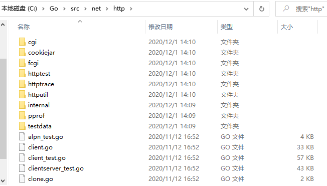
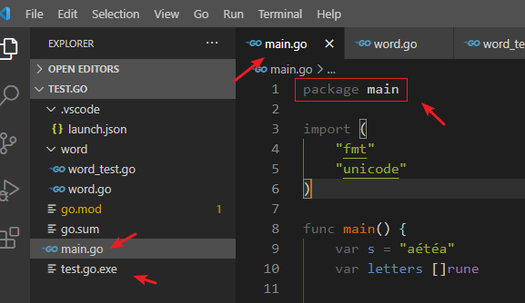

如何把代码组织成包，以及如何操作这些包？

在 Go 语言里，**包是个非常重要的概念**。其设计理念是使用包来**封装不同语义单元的功能**。这样做，能够更好地复用代码，并对每个包内的数据的使用有更好的控制。

所有 Go 语言的程序都会组织若干组文件，**每组文件被称为一个包**。这样每个包的代码都可以作为很小的**复用单元**，被其他项目引用。下面看看标准库中的 http 包是怎么利用包的特性组织功能的：

这些目录将实现 HTTP 服务器、客户端、测试工具和性能调试工具的相关代码**拆分**成**功能清晰的、小的功能单元**。

每个包都可以**单独导入和使用**，以便开发者可以根据自己的需要导入特定功能。

所有的 .go 文件，除了空行和注释，都应该在**第一行声明自己所属的包**。每个包都在一个单独的目录里，不能把多个包放到同一个目录中，也不能把同一个包的文件分拆到多个不同目录中。这意味着，**同一个目录下的所有 .go 文件必须声明同一个包名**。

给包命名的惯例是使用包所在目录的名字。这让用户在导入包的时候，就能清晰地知道包名。`net/http` 包，在 http 目录下的所有文件都属于 http 包。但并需要所有包的名字都与别的包不同，因为**导入包时是使用全路径的**，所以可以区分同名的不同包。一般情况下，包被导入后会使用包名作为默认的名字，不过这个导入后的名字可以修改。这个特性在需要导**入不同目录的同名包时**很有用。

在 Go 语言中，命名为 main 的包==具有特殊的含义==。Go 语言的编译程序会试图把这个名字的包编译为二进制可执行文件。所有用 Go 语言编译的可执行程序都**必须**有一个名叫 main 的包。当编译器发现某个包的名字为 main 时，也一定会发现名为 main() 的函数，否则不会创建可执行文件。main() 函数是程序的入口，如果没有这个函数，程序就没有办法开始执行。程序编译时，会使用声明 main 包的代码所在的目录的**目录名**作为二进制可执行文件的文件名。

比如 `test.go` 项目，在该目录下有 `main.go` 文件，该文件声明的包为：`package main`

编译器编译完成后生成的可执行文件名为 `test.go.exe`，其中 `test.go` 为工程目录名。

现在已经把代码组织到包里了，那如何导入这个包，以便可以**访问包内的代码**？import 语句告诉编译器到磁盘指定的位置查找想要导入的包，**导入包需要使用关键字** import。

~~~go
import(
"fmt"
    "strings"
)
~~~

编译器会使用 Go 环境变量设置的路径，通过引入的**相对路径**来查找磁盘上的包。标准库中的包会在**安装 Go 的位置（GOROOT）**找到。Go 开发者创建的包会在 GOPATH **环境变量**指定的目录里查找。GOPATH 指定的这些目录就是**开发者的个人开发工作空间**。

~~~go
...
set GOOS=windows
set GOPATH=C:\Users\Developer\go
set GOPRIVATE=
set GOPROXY=https://goproxy.io,direct
set GOROOT=c:\go
set GOSUMDB=sum.golang.org
set GOTMPDIR=
set GOTOOLDIR=c:\go\pkg\tool\windows_amd64
set GCCGO=gccgo
set AR=ar
set CC=gcc
...
~~~

一旦编译器找到一个满足 import 语句的包，就停止进一步查找。编译器**查找的顺序**依次是：Go 的安装目录，顺序查找 GOPATH 变量列出的目录。

（==远程导入==）现代软件开发都支持使用**分布式版本控制系统**来分享代码，比如 GitHub 等。Go 语言的==工具链==本身就支持从这些网站及类似网站获取源代码。Go 工具链会使用**导入路径**确定需要获取的代码在网络的什么地方。

用**导入路径**编译程序时，比如 `import "github.com/spf13/viper"`，go build 命令会使用 GOPATH 的设置，在磁盘上搜索这个包。而这个导入路径代表一个 URL，指向 GitHub 上的代码仓库。

~~~go
C:\Users\Developer\sample>go get github.com/spf13/viper
go: downloading github.com/spf13/viper v1.7.1
go: github.com/spf13/viper upgrade => v1.7.1
go: downloading github.com/spf13/afero v1.1.2
go: downloading github.com/spf13/jwalterweatherman v1.0.0
go: downloading github.com/fsnotify/fsnotify v1.4.7
go: downloading github.com/hashicorp/hcl v1.0.0
go: downloading gopkg.in/ini.v1 v1.51.0
go: downloading github.com/spf13/pflag v1.0.3
go: downloading github.com/mitchellh/mapstructure v1.1.2
go: downloading github.com/pelletier/go-toml v1.2.0
go: downloading github.com/spf13/cast v1.3.0
go: downloading gopkg.in/yaml.v2 v2.2.4
go: downloading golang.org/x/sys v0.0.0-20190624142023-c5567b49c5d0
go: downloading github.com/magiconair/properties v1.8.1
go: downloading golang.org/x/text v0.3.2
go: downloading github.com/subosito/gotenv v1.2.0
~~~

如果路径包含 URL，可以使用 Go 工具链从 DVCS 获取包，并把包的源代码保存在 GOPATH 指向的路径里与 URL 匹配的目录里。这个获取过程使用 go get 命令完成。go get 具有递归特性，会扫描某个包的源码树，获取能找到的所有依赖包。

如果要导入的多个包具有相同的名字，比如 `network/convert` 和 `file/convert`。这种情况下，重名的包可以通过==命名导入==来导入。命名导入是指，在 import 语句给出的包路径的左侧定义一个名字，将导入的包命名为新名字。

~~~go
package main

import(
    "fmt"
    myfmt "mylib/fmt"
)

func main(){
    fmt.Println("Standard Library")
    myfmt.Println("mylib/fmt")
}
~~~

有时，用户可能需要导入一个包，但是不需要引用这个包的标识符。在这种情况下，可以使用==空白标识符==_来**重命名这个导入**。

每个包可以包含任意多个 ==`init` 函数==，这些函数都会在程序执行开始的时候被调用。**所有**被编译器发现的 `init` 函数都会安排**在 main 函数之前执行**。`init` 函数用在设置包、初始化变量或者其他要在程序运行前优先完成的引导工作。比如下述 PostgreSQL 数据库驱动程序的初始化：

~~~go
package main

import(
"database/sql"
    // _ "github.com/goinaction/code/chapter3/dbdriver/postgres"
)

func init(){
    sql.Register("postgres", new(PostgresDriver))
}
~~~

在 Go 平台下有哪些==小工具==可以使用？

~~~go
C:\Users\Developer\sample>go
Go is a tool for managing Go source code.

Usage:

        go <command> [arguments]

The commands are:

        bug         start a bug report
        build       compile packages and dependencies
        clean       remove object files and cached files
        doc         show documentation for package or symbol
        env         print Go environment information
        fix         update packages to use new APIs
        fmt         gofmt (reformat) package sources
        generate    generate Go files by processing source
        get         add dependencies to current module and install them
        install     compile and install packages and dependencies
        list        list packages or modules
        mod         module maintenance
        run         compile and run Go program
        test        test packages
        tool        run specified go tool
        version     print Go version
        vet         report likely mistakes in packages

Use "go help <command>" for more information about a command.

Additional help topics:

        buildconstraint build constraints
        buildmode       build modes
        c               calling between Go and C
        cache           build and test caching
        environment     environment variables
        filetype        file types
        go.mod          the go.mod file
        gopath          GOPATH environment variable
        gopath-get      legacy GOPATH go get
        goproxy         module proxy protocol
        importpath      import path syntax
        modules         modules, module versions, and more
        module-get      module-aware go get
        module-auth     module authentication using go.sum
        module-private  module configuration for non-public modules
        packages        package lists and patterns
        testflag        testing flags
        testfunc        testing functions

Use "go help <topic>" for more information about that topic.
~~~

（==以分享为目的创建代码库==）现代开发者不会一个人单打独斗，而 Go 工具为合作提供了支持。Go 的工具链中，包的概念没有被限制在本地开发环境中，而是做了扩展，从而支持现代合作方式。

使用 go get 的时候，开发人员指定了要导入包的全路径。这意味着在创建想要分享的代码库的时候，**包名应该就是代码库的名字**，而且包的源代码应该位于代码库目录结构的**根目录**。

（==依赖管理==）**推荐使用依赖管理工具来管理依赖！**依赖管理工具比如：`godep`、`vender`、`gopkg.in` 工具，`gopkg.in` 能帮助开发人员发布自己的包的多个版本。Go 语言开发平台已经有一些工具以可重复使用的方式提供了==管理、构建和测试 Go 代码的能力==。

# Go SDK 自带包

现在随便一个小程序的实现都可能包含超过 10000 个函数，然而作者一般只需要考虑其中很小的一部分和做很少的设计，因为**绝大部分代码都是由他人编写的**，它们通过类似包或模块的方式被重用。

Go 语言有超过 100 个标准包，标准库为大多数的程序提供了必要的基础构建。在 Go 的社区，有很多成熟的包被设计、共享、重用和改进，目前互联网上已经发布了非常多的 Go 语言开源包，它们可以通过 `http://godoc.org` 检索。在本章，我们将演示如何使用已有的包和创建新的包。

~~~go
PS C:\Users\Developer\test.go> go list std
archive/tar
archive/zip
bufio
bytes
compress/bzip2
compress/flate
compress/gzip
compress/lzw
compress/zlib
container/heap
container/list
container/ring
context
crypto
crypto/aes
crypto/cipher
crypto/des
crypto/dsa
crypto/ecdsa
crypto/ed25519
crypto/ed25519/internal/edwards25519
crypto/elliptic
crypto/hmac
crypto/internal/randutil
crypto/internal/subtle
crypto/md5
crypto/rand
crypto/rc4
crypto/rsa
crypto/sha1
crypto/sha256
crypto/sha512
crypto/subtle
crypto/tls
crypto/x509
crypto/x509/pkix
database/sql
database/sql/driver
debug/dwarf
debug/elf
debug/gosym
debug/macho
debug/pe
debug/plan9obj
encoding
encoding/ascii85
encoding/asn1
encoding/base32
encoding/base64
encoding/binary
encoding/csv
encoding/gob
encoding/hex
encoding/json
encoding/pem
encoding/xml
errors
expvar
flag
fmt
go/ast
go/build
go/constant
go/doc
go/format
go/importer
go/internal/gccgoimporter
go/internal/gcimporter
go/internal/srcimporter
go/parser
go/printer
go/scanner
go/token
go/types
hash
hash/adler32
hash/crc32
hash/crc64
hash/fnv
hash/maphash
html
html/template
image
image/color
image/color/palette
image/draw
image/gif
image/internal/imageutil
image/jpeg
image/png
index/suffixarray
internal/bytealg
internal/cfg
internal/cpu
internal/fmtsort
internal/goroot
internal/goversion
internal/lazyregexp
internal/lazytemplate
internal/nettrace
internal/obscuretestdata
internal/oserror
internal/poll
internal/profile
internal/race
internal/reflectlite
internal/singleflight
internal/syscall/execenv
internal/syscall/windows
internal/syscall/windows/registry
internal/syscall/windows/sysdll
internal/testenv
internal/testlog
internal/trace
internal/unsafeheader
internal/xcoff
io
io/ioutil
log
log/syslog
math
math/big
math/bits
math/cmplx
math/rand
mime
mime/multipart
mime/quotedprintable
net
net/http
net/http/cgi
net/http/cookiejar
net/http/fcgi
net/http/httptest
net/http/httptrace
net/http/httputil
net/http/internal
net/http/pprof
net/internal/socktest
net/mail
net/rpc
net/rpc/jsonrpc
net/smtp
net/textproto
net/url
os
os/exec
os/signal
os/user
path
path/filepath
plugin
reflect
regexp
regexp/syntax
runtime
runtime/cgo
runtime/debug
runtime/internal/atomic
runtime/internal/math
runtime/internal/sys
runtime/pprof
runtime/race
runtime/trace
sort
strconv
strings
sync
sync/atomic
syscall
testing
testing/internal/testdeps
testing/iotest
testing/quick
text/scanner
text/tabwriter
text/template
text/template/parse
time
time/tzdata
unicode
unicode/utf16
unicode/utf8
unsafe
vendor/golang.org/x/crypto/chacha20
vendor/golang.org/x/crypto/chacha20poly1305
vendor/golang.org/x/crypto/cryptobyte
vendor/golang.org/x/crypto/cryptobyte/asn1
vendor/golang.org/x/crypto/curve25519
vendor/golang.org/x/crypto/hkdf
vendor/golang.org/x/crypto/internal/subtle
vendor/golang.org/x/crypto/poly1305
vendor/golang.org/x/net/dns/dnsmessage
vendor/golang.org/x/net/http/httpguts
vendor/golang.org/x/net/http/httpproxy
vendor/golang.org/x/net/http2/hpack
vendor/golang.org/x/net/idna
vendor/golang.org/x/net/nettest
vendor/golang.org/x/sys/cpu
vendor/golang.org/x/text/secure/bidirule
vendor/golang.org/x/text/transform
vendor/golang.org/x/text/unicode/bidi
vendor/golang.org/x/text/unicode/norm
~~~

Go 还**自带了工具箱**，里面有很多用来**简化工作区**和**包管理的小工具**。在本书开始的时候，我们已经见识过如何使用工具箱自带的工具来下载、构建和运行我们的演示程序了。在本章，我们将看看==这些工具的基本设计理论和尝试更多的功能==，例如打印工作区中包的文档和查询相关的元数据等。

# 包简介

**任何包系统设计的目的都是为了简化大型程序的设计和维护工作**，通过将一组相关的特性放进一个独立的单元以便于理解和更新，在每个单元更新的同时保持和程序中其他单元的相对独立性。这种模块化的特性允许每个包可以**被其他的不同项目共享和重用**，在项目范围内，甚至全球范围统一的发布和复用。

每个包一般都定义了一个**不同的名字空间**用于**它内部的**每个标识符的访问。每个名字空间关联到一个特定的包，让我们给类型、函数等选择简短明了的名字，这样可以在使用它们的时候减少和其他部分名字的冲突。

每个包还通过控制包内名字的可见性和是否导出来实现封装特性。通过限制包成员的可见性并隐藏包 API 的具体实现，将允许包的维护者在不影响外部包用户的前提下调整包的内部实现。通过限制包内变量的可见性，还可以强制用户通过某些特定函数来访问和更新内部变量，这样可以保证内部变量的一致性和并发时的互斥约束。

当我们修改了一个源文件，我们必须重新编译该源文件对应的包和所有依赖该包的其他包。即使是从头构建，Go 语言编译器的编译速度也明显快于其他编译语言。Go 语言的闪电般的编译速度主要得益于三个语言特性：

1. 所有导入的包必须在每个文件的开头显式声明，这样的话编译器就没有必要读取和分析整个源文件来判断包的依赖关系；
2. 禁止包的**环状依赖**，因为没有循环依赖，包的依赖关系形成一个有向无环图，每个包可以被独立编译，而且很可能是被并发编译；
3. 编译后包的目标文件不仅仅记录包本身的导出信息，目标文件同时还记录了包的依赖关系。因此，在编译一个包的时候，编译器只需要读取每个直接导入包的目标文件，而不需要遍历所有依赖的文件。

# 导入路径

每个包是由一个全局唯一的字符串所标识的==导入路径==定义。出现在 import 语句中的导入路径也是字符串：

~~~go
import (
	"fmt"
    "math/rand"
    "encoding/json"
    
    "golang.org/x/net/html"
    "github.com/go-sql-driver/mysql"
)
~~~

Go 语言的规范并没有指明包的导入路径字符串的具体含义，**导入路径的具体含义是由构建工具来解释的**。在本章，我们将深入讨论 ==Go 语言工具箱==的功能，包括大家经常使用的构建测试等功能。当然，也有第三方扩展的工具箱存在。例如，Google 公司内部的 Go 语言码农，他们就使用内部的多语言构建系统（Google 公司使用的是类似 `Bazel` 的构建系统，支持多种编程语言，目前该构建系统还不能完全支持 Windows 环境），用不同的规则来处理包名字和定位包，用不同的规则来处理单元测试等等，因为这样可以更紧密适配他们内部的环境。

如果你计划分享或发布包，那么导入路径最好是全球唯一的。为了避免冲突，所有非标准库包的导入路径建议以所在组织的互联网域名为前缀；而且这样也有利于包的检索。例如，上面的 import 语句导入了 Go 团队维护的 HTML 解析器和一个流行的第三方维护的 MySQL 驱动。

# 包声明

在每个 Go 语言源文件的开头都必须有==包声明语句==。包声明语句的主要目的是确定当前包被其它包导入时默认的标识符（也称为包名）。

例如，`math/rand` 包的每个源文件的开头都包含 `package rand` 包声明语句，所以**当你导入这个包**，你就可以用 `rand.Int`、`rand.Float64` 类似的方式**访问包的成员**：

~~~go
package main

import (
	"fmt"
    "math/rand"
)

func main(){
    fmt.Println(rand.Int())
}
~~~

通常来说，默认的包名就是包导入路径名的最后一段，因此即使两个包的导入路径不同，它们依然可能有一个相同的包名。例如，`math/rand` 包和 `crypto/rand` 包的包名都是 `rand`。稍后我们将看到**如何同时导入两个有相同包名的包**。

关于“默认包名一般采用导入路径名的最后一段”的约定也有 3 种**例外情况**：

1. 包对应一个可执行程序，也就是 main 包，这时候 main 包本身的导入路径是无关紧要的。名字为 main 的包是给 go build 构建命令一个信息，这个包编译完之后必须调用连接器生成一个可执行程序。
2. 包所在的目录中可能有一些文件名是以 `_test.go` 为后缀的 Go 源文件（前面必须有其他的字符，因为以 `_` 或 `.` 开头的源文件会被构建工具忽略），并且这些源文件声明的包名也是以 `_test` 为后缀名的。这种目录可以包含两种包：一种是普通包，另一种则是测试的外部扩展包。所有以 `_test` 为后缀包名的测试外部扩展包都**由 `go test` 命令独立编译**，**普通包和测试的外部扩展包是项目独立的**。测试的外部扩展包一般用来避免测试代码中的循环导入依赖。
3. 一些依赖版本号的管理工具会在导入路径后追加版本号信息，例如 `gopkg.in/yaml.v2`。这种情况下包的名字并不包含版本号后缀，而是 `yaml`。

# 导入声明

可以在一个 Go 语言源文件包声明语句之后，其它非导入声明语句之前，包含零到多个导入包声明语句。每个导入声明可以单独指定一个导入路径，也可以通过圆括号同时导入多个导入路径。下面两个导入形式是等价的，但是第二种形式更为常见：

~~~go
import "fmt"
import "os"

import (
	"fmt"
    "os"
)
~~~

导入的包之间可以通过添加空行来分组；通常将来自不同组织的包独立分组。

