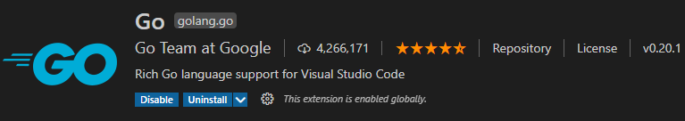
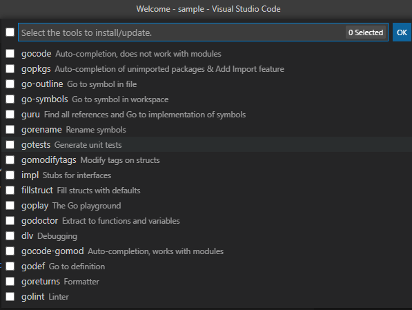
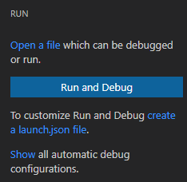
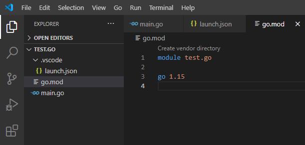

一直在纠结 Go 开发使用的 IDE，到底是使用 VS Code 还是使用 IntelliJ IDEA，至此不再纠结了，先上手干一番！

这篇文章叙述的是关于『如何在 VS Code 开发工具下开发 Go 应用程序』，其重点是：VS Code 的使用和配置。简单地尝下鲜，大体步骤如下：

1. 安装 Go 及设置环境；
2. 安装 VS Code；
3. 安装 VS Code 中开发 Go 应用程序的插件：Go for Visual Studio Code，或者称为 Go 扩展程序；
4. 项目尝鲜。

# 安装插件：Go for Visual Studio Code

VS Code 中的插件：Go for Visual Studio Code 由 Google 出品：提供 VS Code 中开发 Go 应用程序的支持！

该插件会在 2021 年初提供 gopls（the Go Language Server）——Go 官方的语言服务器（基于 VS Code 提出的  Language Protocol 实现的），提供类似：智能提示、代码格式化、代码分析等功能。设置 `go.useLanguageServer:true` 切换到语言服务器，**默认情况下，Go 插件会提示安装 gopls（目前正处于 Alpha 状态）**。

> Use the Go language server “gopls” from Google for powering language features like code navigation, completion, refactoring, formatting & diagnostics.

**启动 VS Code 中的 `Command Palette`** ，使用**快捷键**：Ctrl + Shift + P，运行 `Go: Locate Configured Go Tools` 指令，在界面下部分的 `OUTPUT` 部分会看到当前开发设备中 Go **安装信息**：

~~~go
Checking configured tools....
GOBIN: undefined
toolsGopath: 
gopath: C:\Users\Developer\go
GOROOT: 
PATH: C:\Program Files (x86)\NetSarang\Xftp 6\;C:\WINDOWS\system32;C:\WINDOWS;C:\WINDOWS\System32\Wbem;C:\WINDOWS\System32\WindowsPowerShell\v1.0\;C:\WINDOWS\System32\OpenSSH\;C:\Program Files\Microsoft SQL Server\110\Tools\Binn\;E:\Java\jdk1.8.0_144\bin;E:\Java\jdk1.8.0_144\jre\bin;e:\Git\cmd;E:\Android\StudioSDK\platform-tools;E:\Android\StudioSDK\tools;E:\Android\StudioSDK\build-tools\28.0.2;E:\Program Files\nodejs\;E:\Program Files\wkhtmltopdf\bin;C:\Program Files (x86)\Google\Chrome\Application;C:\Users\Developer\AppData\Local\Programs\Python\Python37\Scripts\phantomjs-2.1.1-windows\bin;E:\TortoiseGit\bin;C:\Program Files (x86)\Pandoc\;E:\Android\StudioSDK\ndk-bundle;C:\Go\bin;C:\Program Files\MySQL\MySQL Shell 8.0\bin\;C:\Users\Developer\AppData\Local\Microsoft\WindowsApps;C:\Users\Developer\AppData\Roaming\npm;e:\JetBrains\PyCharm2018.3.3\bin;E:\apache-maven-3.6.1\bin;E:\Program Files\mingw-w64\x86_64-8.1.0-win32-seh-rt_v6-rev0\mingw64\bin;E:\SQLite;E:\apache-maven-3.6.3\bin;C:\Program Files (x86)\WinRAR;C:\Users\Developer\go\bin;C:\Program Files\Vim\vim82;C:\Program Files\MySQL\MySQL Server 8.0\bin;;E:\Microsoft VS Code\bin

   gocode: gocode not installed
   gopkgs: gopkgs not installed
   go-outline: go-outline not installed
   go-symbols: go-symbols not installed
   guru: guru not installed
   gorename: gorename not installed
   gotests: gotests not installed
   gomodifytags: gomodifytags not installed
   impl: impl not installed
   fillstruct: fillstruct not installed
   goplay: goplay not installed
   godoctor: godoctor not installed
   dlv: dlv not installed
   gocode-gomod: gocode-gomod not installed
   godef: godef not installed
   goreturns: goreturns not installed
   golint: golint not installed

go env
Workspace Folder (no folder): undefined
	set GO111MODULE=on
	set GOARCH=amd64
	set GOBIN=C:\Users\Developer\go\bin
	set GOCACHE=C:\Users\Developer\AppData\Local\go-build
	set GOENV=C:\Users\Developer\AppData\Roaming\go\env
	set GOEXE=.exe
	set GOFLAGS=
	set GOHOSTARCH=amd64
	set GOHOSTOS=windows
	set GOINSECURE=
	set GOMODCACHE=C:\Users\Developer\go\pkg\mod
	set GONOPROXY=
	set GONOSUMDB=
	set GOOS=windows
	set GOPATH=C:\Users\Developer\go
	set GOPRIVATE=
	set GOPROXY=https://goproxy.io,direct
	set GOROOT=c:\go
	set GOSUMDB=sum.golang.org
	set GOTMPDIR=
	set GOTOOLDIR=c:\go\pkg\tool\windows_amd64
	set GCCGO=gccgo
	set AR=ar
	set CC=gcc
	set CXX=g++
	set CGO_ENABLED=1
	set GOMOD=NUL
	set CGO_CFLAGS=-g -O2
	set CGO_CPPFLAGS=
	set CGO_CXXFLAGS=-g -O2
	set CGO_FFLAGS=-g -O2
	set CGO_LDFLAGS=-g -O2
	set PKG_CONFIG=pkg-config
	set GOGCCFLAGS=-m64 -mthreads -fmessage-length=0 -fdebug-prefix-map=C:\Users\DEVELO~1\AppData\Local\Temp\go-build984074326=/tmp/go-build -gno-record-gcc-switches
~~~

Go 插件的正确运行依赖于：==GOPATH 和 Modules==（Modules 从 go 1.16 开始成为了新的==标准==）。

（激活 Go 扩展程序）为了激活Go扩展程序，可以打开任意包含 Go 代码的目录或者工作空间。此时，会在 IDE 的右下角看到 `Analysis Tools Missing` 的信息提示。**Go 扩展程序依赖于一组命令行工具，该工具必须单独安装**。可以使用 `Go: Install/Update Tools` 指令在 `Command Palette` 中查看。如果在执行 `Go: Install/Update Tools` 时，出现未找到的 Error，则需要卸载并重新安装 Go 扩展程序。

快捷键：Ctrl + Shift + P，键入 `Go: Install/Update Tools` 指令可看到如下输出：

可以全选并安装：

~~~go
Tools environment: GOPATH=C:\Users\Developer\go, GOBIN=C:\Users\Developer\go\bin
Installing 17 tools at the configured GOBIN: C:\Users\Developer\go\bin in module mode.
  gocode
  gopkgs
  go-outline
  go-symbols
  guru
  gorename
  gotests
  gomodifytags
  impl
  fillstruct
  goplay
  godoctor
  dlv
  gocode-gomod
  godef
  goreturns
  golint

Installing github.com/mdempsky/gocode (C:\Users\Developer\go\bin\gocode.exe) SUCCEEDED
Installing github.com/uudashr/gopkgs/v2/cmd/gopkgs (C:\Users\Developer\go\bin\gopkgs.exe) SUCCEEDED
Installing github.com/ramya-rao-a/go-outline (C:\Users\Developer\go\bin\go-outline.exe) SUCCEEDED
Installing github.com/acroca/go-symbols (C:\Users\Developer\go\bin\go-symbols.exe) SUCCEEDED
Installing golang.org/x/tools/cmd/guru (C:\Users\Developer\go\bin\guru.exe) SUCCEEDED
Installing golang.org/x/tools/cmd/gorename (C:\Users\Developer\go\bin\gorename.exe) SUCCEEDED
Installing github.com/cweill/gotests/... (C:\Users\Developer\go\bin\gotests.exe) SUCCEEDED
Installing github.com/fatih/gomodifytags (C:\Users\Developer\go\bin\gomodifytags.exe) SUCCEEDED
Installing github.com/josharian/impl (C:\Users\Developer\go\bin\impl.exe) SUCCEEDED
Installing github.com/davidrjenni/reftools/cmd/fillstruct (C:\Users\Developer\go\bin\fillstruct.exe) SUCCEEDED
Installing github.com/haya14busa/goplay/cmd/goplay (C:\Users\Developer\go\bin\goplay.exe) SUCCEEDED
Installing github.com/godoctor/godoctor (C:\Users\Developer\go\bin\godoctor.exe) SUCCEEDED
Installing github.com/go-delve/delve/cmd/dlv (C:\Users\Developer\go\bin\dlv.exe) SUCCEEDED
Installing github.com/stamblerre/gocode (gocode-gomod) SUCCEEDED
Installing github.com/rogpeppe/godef (C:\Users\Developer\go\bin\godef.exe) SUCCEEDED
Installing github.com/sqs/goreturns (C:\Users\Developer\go\bin\goreturns.exe) SUCCEEDED
Installing golang.org/x/lint/golint (C:\Users\Developer\go\bin\golint.exe) SUCCEEDED

All tools successfully installed. You are ready to Go :).
~~~

后续会持续看到安装的进度。

**Go 扩展插件的另一个重要依赖是 Module**，该概念为 Go 构建大多数工具和功能的方式增加了很多复杂性。此扩展的部分（但不是全部）功能已更新，可以与 Go Module 一起使用。在 Module 模式下，Go 扩展插件功能可能会变慢。通常，如果正在使用 Go Module，建议使用 gopls（官方的 Go 语言服务器）。**Go Module 的存在，是官方强推的，为了替代 GOPATH 而诞生的一个 Go 语言依赖库管理器**。

==如果使用的是 [gopls](https://github.com/golang/vscode-go/blob/master/docs/gopls.md)，上述提及的工具都不需要用到==。那如果是使用 `gopls` 怎么安装呢？

~~~go
Tools environment: GOPATH=C:\Users\Developer\go, GOBIN=C:\Users\Developer\go\bin
Installing 1 tool at the configured GOBIN: C:\Users\Developer\go\bin in module mode.
  gopls
...
~~~

也就说，使用了 `gopls` 后，所有的由上述命令行工具提供的诸如：智能提示、代码格式化、代码分析等功能都由 `gopls` 提供。

# 项目尝鲜

无所谓在本地的哪个目录创建工程目录，比如随意的创建的 `test.go` 目录，并在其中创建了 `main.go` 文件：

~~~go
package main

import (
	"fmt"
)

func main() {
	fmt.Println("Hello, World!")
}
~~~

紧接着是运行上述 `main.go` 程序，在 Tab 栏中找到 `RUN`，并运行 `Start Debugging`，有如下提示：

按照提示：自定义 Run 和 Debug 功能，需要创建 `launch.json` 文件，点击该蓝色字体会在工程目录下自动创建 `.vscode` 目录，并在其下创建 `launch.json` 文件：

~~~json
{
    // Use IntelliSense to learn about possible attributes.
    // Hover to view descriptions of existing attributes.
    // For more information, visit: https://go.microsoft.com/fwlink/?linkid=830387
    "version": "0.2.0",
    "configurations": []
}
~~~

可在 `configurations` 中参数配置，配置程序运行过程中的参数，比如：

~~~go
{
    // Use IntelliSense to learn about possible attributes.
    // Hover to view descriptions of existing attributes.
    // For more information, visit: https://go.microsoft.com/fwlink/?linkid=830387
    "version": "0.2.0",
    "configurations": [
        {
            "name": "Launch Package",
            "type": "go",
            "request": "launch",
            "mode": "debug",
            "program": "${workspaceFolder}"
        }
    ]
}
~~~

再次运行程序，会在 `DEBUG CONSOLE` 有如下提示：

~~~go
go: cannot find main module; see 'go help modules'
exit status 1
Process exiting with code: 1
~~~

类似于这样的提示：`cannot find module providing package test.go: working directory is not part of a module`，需要在当前工作目录下执行 `go mod init test.go`。执行完成后，上述代码就能正常运行了！

# VS Code

左侧侧边栏的项目依次是：

1. 文件资源管理器：Ctrl + Shift + E
2. 跨文件搜索：Ctrl + Shift + F
3. 源代码管理：Ctrl + Shift + G
4. 启动和调试：Ctrl + Shift + D
5. 管理扩展：Ctrl + Shift + X，比如安装 Go 扩展插件，让 VS Code 支持 Go 程序开发。

VS Code 退出全屏快捷键：F11（Windows 平台下）

我们在项目中为什么需要使用 IDE？不使用 IDE 的情况下编辑、编译程序，并运行程序得到正确的结果？

实际上可以看到，在 IDE 中编译程序，仍然是使用了 go 提供的编译工具完成的，不同的是 IDE 提供了各种编辑程序的便利性，比如关键字高亮，debug 程序的便捷性等，这些便捷性能提高编程的效率。

所以，==不要“神化” IDE，仅仅只是一个工具而已，用 Vim 或者记事本同样能写出代码==。

对于 IDE 的功能要求，主要有：

* **语法高亮**是必不可少的功能，这也是为什么每个开发工具都提供**配置文件**来实现**自定义配置**的原因。
* 拥有较好的项目**文件纵览和导航**能力，可以同时编辑多个源文件并设置书签，能够匹配括号，**能够跳转到某个函数或类型的定义部分**。
* 完美的**查找和替换**功能，替换之前最好还能预览结果。
* 当有编译错误时，双击错误提示可以跳转到发生错误的位置。
* **跨平台**，能够在 Linux、Mac OS X 和 Windows 下工作，这样就可以专注于一个开发环境。
* 能够通过**插件架构**来轻易**扩展和替换某个功能**。
* 拥有**断点**、检查变量值、单步执行、逐过程执行标识库中代码的能力。
* 能够方便地存取最近使用过的文件或项目。
* 拥有对包、类型、变量、函数和方法的智能**代码补全**的功能。
* 能够方便地在不同的 Go 环境之间切换。
* 针对一些特定的项目有**项目模板**，如：Web 应用，App Engine 项目，从而能够更快地开始开发工作。

VS Code **使用 JSON 格式的配置文件**进行所有功能和特性的配置，同时还可以通过扩展程序为编辑器实现编程语言高亮、参数提示、编译、调试、文档生成等各种功能。