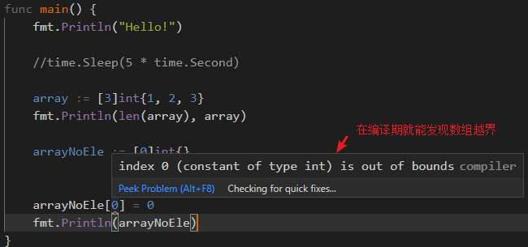

> 重新理解数组，其含义在于：理解数组的底层实现，以及特殊的数组使用示例。

（make 语法）`arr := make([3]int)` 这种创建数组的语法是**不可用的**，这可能是值类型和引用类型的区别！`invalid argument: cannot make [3]int; type must be slice, map, or channel`

（容量为 0 的数组）在定义数组时，是**可以定义容量为 0 的数组**，比如下述：

如果一旦向该较特殊数组中填入元素时，会直接在 IDE 中提示“数组越界”！

（`:=range` 数组遍历）在数组的遍历中，其遍历得到的内容如下：

~~~go
...
type Currency int

const (
	USD Currency = iota
	EUR
	GBP
	RMB
)

func main() {
	symbol := [...]string{USD: "$", EUR: "€", GBP: "￡", RMB: "¥"}
	fmt.Println(symbol)

	for i, v := range symbol {
		// symbol[0] = $
		fmt.Printf("symbol[%d] = %s\n", i, v)
	}

	for i := range symbol {
		// value = 0
		fmt.Printf("value = %d\n", i)
	}
}
~~~

也就是说 `:= range` 迭代遍历语法中，如果该操作符左侧有 2 个变量，则分别得到的是数组中的元素索引和元素值；如果只有 1 个变量，则仅能得到元素索引值。

（相同类型数组的赋值操作）在 Go 语言中，数组类型是一个比较特殊的类型，其类型包括 2 个部分：元素类型和容量。只有上述 2 个部分完全相同，才是相同类型的数组，才能够相互赋值。

~~~go
package main

import (
	"fmt"
)

func main() {
	// 声明第一个包含 5 个元素的字符串数组
	var value1 [5]string
	// 声明第二个包含 5 个元素的字符串数组，同时用颜色字符串初始化
	var value2 = [5]string{"red", "red", "red", "red", "red"}

	// 把 value2 的值复制到 value1
	value1 = value2

	// [red red red red red] [red red red red red]
	fmt.Println(value1, value2)
    
	// 0xc000040050, 0xc000040050
	fmt.Printf("%p, %p\n", &value1, &value1[0])
	// 0xc0000400a0, 0xc0000400a0
	fmt.Printf("%p, %p\n", &value2, &value2[0])

	value1[0] = "blue"
	// [blue red red red red] [red red red red red]
	fmt.Println(value1, value2)
}
~~~

**数组的赋值操作，实质上，就是数组元素的复制**。即将一个数组中的元素，完全复制到另一个数组中。操作完成后，两个数组之间没有任何关系。由此引出的问题是：**函数中将数组作为其形参时，数组参数传递过程中会降低性能**，而且在函数内部对数组的修改并不会反映到源数组中。由此可得出结论：数组是值类型，而不是引用类型。

上面示例程序中，通过数组变量 value1 和 value2 的地址不相等，以及数组首元素地址可以得出：**相互赋值的两个数组变量之间是没有任何关系的**！

**获取数组元素的地址**：

~~~go
package main

import "fmt"

func main() {
	value := [3]int{1, 2, 3}
	printAddr(value)

	test(value)
	fmt.Println(value)
}

func test(tmp [3]int) {
	tmp[0] = 0
	fmt.Println(tmp)

	printAddr(tmp)
}

func printAddr(value [3]int) {
	for index := 0; index < len(value); index++ {
		fmt.Printf("index= %d; addr= %p.\n", index, &value[index])
	}
}
~~~

数组就像是内存中连续分配的一段内存空间，这段内存空间可以分成一个个小的区间，每个小区间就是数组中的一个元素。因此，`&value[index]` 就是每个元素的地址！