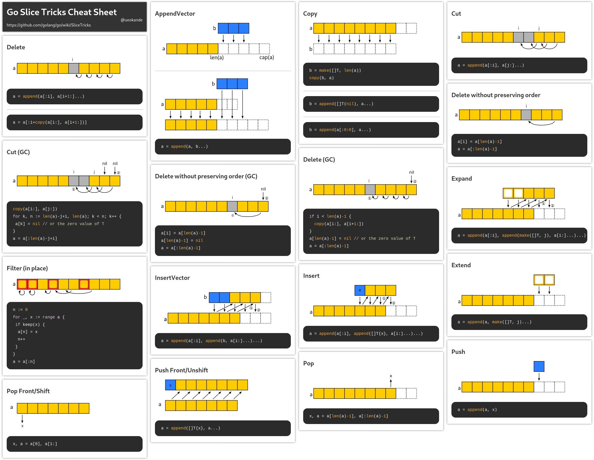

Slice 是一个很小的对象，对底层数组进行了抽象，包含有 3 个字段的数据结构：**底层数组、长度和容量**。




==**slice 类型有其特殊性**==：

1. 在 Go 语言中，slice 是引用类型；
2. slice 底层是 struct，在函数中，将 slice 作为参数值传递时，却体现出了 struct 的特性。

用下面的例子很容易验证：

~~~go
func main() {
	slice := make([]string, 0, 2)
	slice = append(slice, "1")
	fmt.Printf("before: %v, %p, %p, %d, %d.\n", slice, slice, &slice, cap(slice), len(slice))

	testSlice(slice)

	fmt.Printf("after: %v, %p, %p, %d, %d.\n", slice, slice, &slice, cap(slice), len(slice))
}

func testSlice(slice []string) {
	if slice == nil {
		return
	}

	slice = append(slice, "2")
	fmt.Printf("in function: %v, %p, %p, %d, %d.\n", slice, slice, &slice, cap(slice), len(slice))
}

before: [1], 0xc0000044c0, 0xc0000044a0, 2, 1.
in function: [1 2], 0xc0000044c0, 0xc000004540, 2, 2.
after: [1], 0xc0000044c0, 0xc0000044a0, 2, 1.
~~~

`in function: [1 2], 0xc000098440, 2, 2.` 在 `testSlice` 函数中，确实传递进去的是相同的地址值：`0xc0000044c0`。这个地址值，实际上是底层数组的地址，这就是体现 slice 引用类型的特征。虽然如此，但是 `&slice` 的值却发生了改变，也就是说进行了值的拷贝，这部分体现出的是 struct 的值拷贝特征！

`./src/runtime/slice.go` 文件中包含了对 slice 数据结构的定义：

~~~go
type slice struct {
	array unsafe.Pointer // 底层数组指针
	len   int
	cap   int
}
~~~

==切片变量的定义，初始化及底层原理==：

~~~go
var buf []byte

type Stu struct {
	addr *Stu
	buf  []byte
}

// 0x0, []（stu.buf变量的内容）
fmt.Printf("%p, %v\n", stu.buf, stu.buf)

buf = nil
~~~

对于 `[]byte` 切片类型，为什么使用 `%p` 输出 `buf` 值时，得到了 0x0 的结果？表示什么含义？切片类型的底层原理是什么？


Slice 结构中包含有一个地址值，该地址值是底层数组的指针。如果将 Slice 类型看作是一个结构体，在函数赋值时会发生值拷贝（因为是引用类型，可以直接看作是传引用），成员中的指针字段会增加一个引用变量，也就是说 `newSlice` 也会指向相同的底层数组。

==空切片和 nil 值==：在使用字面量声明切片时，有两种特殊情况，一是**空切片**；二**是 nil 切片**。

~~~go
func main() {
	slice := []int8{}
	// [] 空切片，也就是不包含任何元素的切片
	fmt.Println(slice)
	// 0xc0000044c0(slice变量内存地址) 0xe364b8(底层数组地址)
	fmt.Printf("%p, %p\n", &slice, slice)

    // slice[0] = 1 panic: runtime error: index out of range [0] with length 0
	slice = append(slice, 1)
    // 0xc0000044c0 0xc000014150
	fmt.Printf("%p, %p\n", &slice, slice)
}

func testNil() {
	var sliceNil []int8
	// []
	fmt.Println(sliceNil)
	// 0xc000004560(slice变量内存地址), 0x0(底层数组地址，nil 没有指向任何底层内存地址)
	fmt.Printf("%p, %p\n", &sliceNil, sliceNil)
    // sliceNil[0] = 1 panic: runtime error: index out of range [0] with length 0
	if sliceNil == nil {
		fmt.Println("sliceNil is nil!")
	}
	sliceNil = append(sliceNil, 1)
    // 0xc000004560 0xc000014158
	fmt.Printf("%p, %p\n", &sliceNil, sliceNil)
}
~~~

对于空切片和 nil 切片，cap(slice) 和 `len(slice)` 均是 0，如果使用 `slice[0] = 1` 方式向 slice 中增加元素，会引发 `panic: runtime error: index out of range [0] with length 0`。这是两者共同点！

同时使用 `fmt.Printf("%p, %p\n", &slice, slice)` 输出变量和底层数组地址时，我们发现 nil 切片底层数组地址是 0x0，也就是说**没有指向任何内存地址，相当于是没有做初始化**。

另外，我们发现 `slice = append(slice, 1)` 执行后，`%p` 格式输出的 `slice` 发生了改变。如果指向的底层数组地址发生了改变，也就和原来的切片不再关联了：

~~~go
func main() {
	slice := []int8{0, 1, 2, 3, 4}

	newSlice := append([]int8{}, slice...) // ... 运算符来访辅助解析切片
	newSlice[0] = 66

	fmt.Println(slice, newSlice)
}
~~~

用这种方式让 slice 和 `newSlice` 脱离关联关系！

不管是空切片还是 nil 切片，都可以通过 append 函数向 slice 中增加元素（原因是，append 方法会重新分配内存）。但如果是从值为 nil 的 slice 中取值或者是赋值时，就会引发 panic。

Slice 类型的**==赋值问题==**：

~~~go
func main() {
	funTest()
}

func funTest() {
	defer func() {
		if p := recover(); p != nil {
			fmt.Printf("%v", p)
		}
	}()

	slice := make([]string, 0, 2)
	// slice = append(slice, "1")
	slice[0] = "1" // runtime error: index out of range [0] with length 0

	fmt.Println(slice)
}
~~~

上述赋值操作会引发 `runtime error` 其含义为：`index out of range [0] with length 0`，也就是说一种**溢出错误**。相当于对于数组而言，定义了 `var array int[1]` 如果访问了 `array[1]` 就会引发这样的错误！

因此对 Slice 类型的 length 字段的含义有了更深层次的理解：**可以访问到的切片元素位置索引！**也就是说**==能够范围 `[0, len(slice))` 这些位置的元素==**，其访问方式和数组一样。对于上述这种情况，就只能使用 `append()` 方式向 Slice 中添加元素。

==Slice 类型及其地址==输出：

~~~go
func main() {
	// int8 也就是8位，1个字节；int32 也就是32位，也就是 4 字节
	slice1 := []int8{1, 2, 3, 4, 5}
	// 0xc000014125 0xc000014126
	fmt.Printf("%p, %p\n", &slice1[0], &slice1[1])

	slice2 := slice1[2:]
	// 0xc000014125, 0xc000014127
	fmt.Printf("%p, %p\n", slice1, slice2)

	ele := slice1[0]
	// int8
	fmt.Printf("%T\n", ele)
    
    fmt.Println(len(slice1), cap(slice1), len(slice2), cap(slice2))
}
~~~

从上面的示例程序可看出，内存地址的编排规则：0xc000014125 0xc000014126 是两个相邻的内存地址，每个内存地址存放的是一个 `int8` 类型的值，也就是说**一个内存地址能存放 1 个字节内容**。另外 `%p` 输出 slice 变量值时，实际得到的就是底层数组元素的内存地址。另外程序中的 `int` 类型，**==默认被编译器解析==**成了 `int64` 类型。

另外对切片进行再次切片时，`newSlice` 的底层元素和 slice 是共同的，也就是**复用了底层数组元素**。正是因为共享底层数组，更改其中一个切片时，其他对底层数组的引用的切片也会受到影响。

Slice 是围绕==动态数组的概念==构建的，可以按需自动增长和缩小。用下面这个例子展示==动态==的概念：

~~~go
package main

import "fmt"

func main() {
	s1 := []int{1, 2}
	s2 := s1
	fmt.Printf("%p, %p\n", s1, s2)

	s2 = append(s2, 3)
	fmt.Printf("%p, %p\n", s1, s2)
	fmt.Println(s1, s2, len(s2), cap(s2))

	ss(s1)
	ss(s2)
	fmt.Println(s1, s2)
}

func ss(x []int) {
	fmt.Printf("in func ss, before append:%p\n", x)
	x = append(x, 0)
	fmt.Printf("in func ss, after append:%p\n", x)
	for a := range x {
		x[a]++
	}
}
~~~

运行的结果如下：**使用 `%p` 输出 slice 的值，相当于是获取底层数组的首地址**。

~~~go
API server listening at: 127.0.0.1:34531
0xc000014090, 0xc000014090  // 说明 Slice 是引用类型
0xc000014090, 0xc000010480  // Slice 增长后，会重新开辟内存空间，并更新引用
[1 2] [1 2 3] 3 4
in func ss, before append:0xc000014090  // 同 s1
in func ss, after append:0xc0000104a0   // 在 ss 中扩容，导致内存重新分配，x 获取到了新的内存地址
in func ss, before append:0xc000010480  // 同 s2
in func ss, after append:0xc000010480
[1 2] [2 3 4]
Process exiting with code: 0
~~~

`s2 = append(s2, 3)` 一旦通过了 Slice 扩展，底层的数组结构就会发生改变，即**重新开辟内存空间并复制源数据**。同理，在 `ss` 函数中，`s1` 通过 Slice 扩展，导致修改不再对源数据产生影响，而 `s2` 却能持续产生影响。==**这是一道很经典的 Slice 测试题！**==

（Slice 变量间的==赋值操作==）Slice 变量间的赋值操作，实际是引用的赋值，即底层引用了相同的数组对象。这一点和数组是有很大差别的！

~~~go
package main

import "fmt"

func main() {
	func main() {
	// 创建 slice 时，其语法和数组类似
	init := []int{10, 1, 2, 3}
	// SIGN slice 底层到底是怎么实现的？[10 1 2 3], []int, 0xc000010460, 0xc000010460
	fmt.Printf("init slice:%d, %T, %p, %p\n", init, init, init, &init[0])
	// 0xc0000044c0
	fmt.Printf("%p\n", &init)
}
~~~

Slice 是引用类型，`%p` 格式输出 `init` 得到的是底层数组的地址，`&init[0]` 实际上是取切片首元素并获取其地址。上述地址是一样的，符合逻辑！

`fmt.Printf("%p\n", &init)` 这种输出形式，实际上是输出变量 `init` 的内存地址，当然是和底层数组的地址不一样，这也符合逻辑！

可使用 `%p` 的格式输出 `init` 和 `&init` 得到不同的结果：前者是底层数组元素的地址，后者则是 `init` 变量的内存地址。这可能也是**值类型和引用类型的区别之一**，值类型的变量是**无法使用** `%p` 格式输出地址的，而只能输出 `&p` 变量的内存地址。**IDE 会直接提示类型匹配的错误信息**。

Slice 中包含的 3 个字段的数据结构：**底层数组、长度（切片能够访问的元素个数）和容量（允许增长到的元素个数）**。需要指出的是：

1. Slice 能够访问到的底层数组的首个元素，并不一定就是源数组的首个元素；
2. 长度是指 Slice 能够访问到的元素个数，不允许超过其容量；
3. 容量，指从首个元素到最后一个元素间元素的个数。

~~~go
func main() {
    ...
    
   	r := make([]int, 4)
	fmt.Printf("init slice:%d, %T, %p, %p\n", r, r, r, &r[0])

	// 获取 init 和 r 变量的内存地址，变量不同其内存地址肯定也不同
	fmt.Printf("%p\n", &r)

	r = init
	fmt.Println(r)
	fmt.Printf("init slice:%d, %T, %p, %p\n", r, r, r, &r[0]) // [10 1 2 3], []int, 0xc000010460, 0xc000010460
}
~~~

如果直接使用 `r = init` 会的到什么结果？相当于是 r 直接指向了原先 `init` 的底层数组。

Slice 变量==作为函数参数的赋值==，可使用下述示例说明：

~~~go
package main

import "fmt"

func main() {
	slice := []int{1, 2, 3, 4, 5}
    // 0xc00000a4e0, 0xc0000044c0
	fmt.Printf("%p, %p\n", slice, &slice)
	modify(slice)
	fmt.Println(slice)  // [1 10 3 4 5] 其结果确实发生了改变！
}

func modify(slice []int) {
    // 0xc00000a4e0, 0xc000004520
	fmt.Printf("%p, %p\n", slice, &slice)
	slice[1] = 10
}
~~~

用这种方式打印更清晰：`fmt.Printf("%p, %p\n", slice, &slice)`，前者输出的是底层数组地址，后者输出的是 slice 变量的内存地址。我们可以发现 modify 函数中 slice 和 main 是一致的，确实传递了值。但这个值实际是引用类型值，也即是说指向了相同的底层数组。

（Slice `:=range` ==迭代遍历==）如果仅有 1 个变量在 `:=` 操作符左侧，得到的是元素位置索引：

~~~go
package main

import "fmt"

func main() {
	...

	for i, v := range r {
		fmt.Printf("%d, %d\n", i, v)
	}

	for v := range r {
		fmt.Printf("%d\n", v)
	}
}
~~~

如果是 2 个变量在 `:=` 操作符左侧，得到的依次是元素位置索引和元素值。

==**Slice 的 make 定义**==时，各个参数的区别：

~~~go
func main() {
	slice := make([]int, 0, 5)
	slice = append(slice, 1)

    fmt.Printf("cap(slice) = %d, len(slice) = %d\n", cap(slice), len(slice)) // cap(slice) = 5, len(slice) = 1

	sliceOther := make([]int, 3)
	// cap(sliceOther) = 3, len(sliceOther) = 3
	fmt.Printf("cap(sliceOther) = %d, len(sliceOther) = %d\n", cap(sliceOther), len(sliceOther))

	sliceOther = append(sliceOther, 1)
	// cap(sliceOther) = 6, len(sliceOther) = 4
	fmt.Printf("cap(sliceOther) = %d, len(sliceOther) = %d\n", cap(sliceOther), len(sliceOther))
}
~~~

对于 `make([]int, 0, 5)` 这种定义方式，append() 调用后，会直接在 `len(slice)` 位置添加元素，进而使 `len(slice)` 值变为 1；对于 `make([]int, 3)` 这种定义方式，`cap(sliceOther) = 3, len(sliceOther) = 3` 两者相等，append() 调用后会直接在 `len(slice)` 位置添加元素。

也就是说 `append()` 方法**会在 `len(slice)` 位置添加元素**。

==slice 中 len(slice) 的含义==：

```go
func main() {
	a := make([]int, 0, 3)

    b := append(a, 1) // 在切片 a 的首位置增加元素 1，并将值赋给 b，潜在的已经新创建了另一个切片，而且 len(b) 值为 1
    _ = append(a, 2) // len(a) 的值始终是没改变的，但是底层数组首元素值改变了

	fmt.Println(b)
}

PS C:\Users\Developer\Server.test> go run main.go
[2]
```

slice 的类型，有 3 个特征：len、cap、底层的数组。对于底层的数组来说，slice 实际上就是一扇窗户，这个窗户是有 start 和宽度的。宽度就对应的是 len(slice) 这个属性。


# 解读材料

Go Web 编程：[slice](https://learnku.com/docs/build-web-application-with-golang/022-go-foundation/3160)


