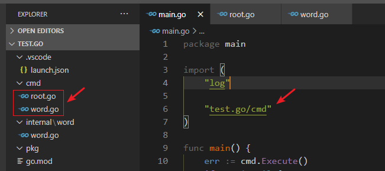

==关于 `init()` 执行顺序==，做一个简单的测试程序：

~~~go
package main

import (
	"flag"
	"fmt"
)

func init() {
	fmt.Println("init") // run second
}

var name = getName()

func getName() string {
	fmt.Println("getName") // run first
	return "ant"
}

func main() {
	var species = flag.String("species", "gopher", "the species we are studying") // run third
	flag.Parse()

	fmt.Printf("%s\n", *species)
}
~~~

全局变量的声明和初始化是在 main 函数之外的，比如上述示例程序

1.  `name` 的初始化需要调用 `getName()`；
2. `init` 方法，最后执行；
3. main。

==一个错误引发的思考==：在 `cmd` 包下的 `root.go` 和 `word.go` 文件中都有 `init()`，如果在 `main.go` 文件中导入了 `test.go/cmd` 则就自动执行该包下所有的 `.go` 文件中的 `init()`：

