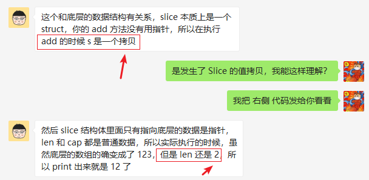

在理解方法时提到了：“在 Go 语言里，我们可以为一些简单的数值、字符串、Slice、Map 来定义一些附加行为，类似于对命名类型定义方法。”

如果此处定义==**命名类型**== `type TT []string` 将会发生什么？要知道 `[]string` 本身是**==指针类型==**的！

~~~go
type TT []string

func (tt TT) modify() {
	tt = append(tt, "3")
	fmt.Printf("modify: %v, %p, %v, %v\n", tt, tt, cap(tt), len(tt)) // modify: [1 2 3], 0xc0000400a0, 5, 3
}

func testNormal() {
	tt := make(TT, 0, 5)
	// tt := []string{}

	tt = append(tt, "1")
	tt = append(tt, "2")
	fmt.Printf("%v, %T, %p\n", tt, tt, tt) // [1 2], main.TT, 0xc0000400a0

	tt.modify()
	fmt.Printf("%v, %T, %v, %v\n", tt, tt, cap(tt), len(tt)) // [1 2], main.TT, 5, 2
}
~~~

从上面的示例程序的输出可以看出：虽然 `modify()` 方法中的 `tt` 和 `testNormal()` 函数中的 `tt` 底层指向了相同的数组结构，但在调用方法时是**==发生了一次 Slice 拷贝的==**。也就是说两个 `tt` 实际上是不同的 Slice 对象了，从 `cap(tt), len(tt)` 的输出是可以看出来的。

因此，在方法的定义中，**==如果方法的接收者是命名类型（非命名类型的指针），实际会发生一次值的拷贝==**。

~~~go
func (tt *TT) modifyPtr() {
	*tt = append(*tt, "3")

	// modifyPtr: [1 2 3], 0xc0000044e0, 0xc0000400a0, 5, 3
	fmt.Printf("modifyPtr: %v, %p, %p, %v, %v\n", *tt, tt, *tt, cap(*tt), len(*tt))
}

func testPtr() {
	tt := make(TT, 0, 5)
	// tt := []string{}

	tt = append(tt, "1")
	tt = append(tt, "2")
	fmt.Printf("%v, %T, %p, %p\n", tt, tt, &tt, tt) // [1 2], main.TT, 0xc0000044e0, 0xc0000400a0

	fmt.Println("<----modifyPtr---->")
	tt.modifyPtr()
	fmt.Printf("%v, %T, %p, %p\n", tt, tt, &tt, tt) // [1 2 3], main.TT, 0xc0000044e0, 0xc0000400a0
}
~~~

那如果是方法接收者是指针类型？从上面的输出来看，`modifyPtr()` 方法中操作的仍然是 `testPtr()` 中的 `tt` 变量。

因此，在方法的定义中，如果方法的接收者是命名类型的指针，在方法中对类型实例进行修改，实际上就是对原对象的修改。

与之相关的问题，解释如下程序的结果：

~~~go
type slices []int

func (s slices) addEle(value int) {
	s = append(s, value)
	// [1 2 3]
	fmt.Println(s)
}

func main() {
	tmp := make(slices, 0, 3)
	tmp = append(tmp, 1)
	tmp = append(tmp, 2)
	fmt.Println("origin tmp:", tmp)

	tmp.addEle(3)
	// [1 2]
	fmt.Println("addEle tmp:", tmp)
}
~~~

**==这里感谢来自大疆科技的 `lailin306755605`！==**

那如果是下面的测试程序，则会得到预期结果：

~~~go
type MapSlices map[string][]string

func main() {
	var tmp MapSlices = MapSlices{"lang": {"en"}}
	fmt.Printf("%v, %p\n", tmp, tmp)  // map[lang:[en]], 0xc0000b87b0

	tmp.Add("item", "1")
	fmt.Println(tmp)                  // map[item:[1] lang:[en]]
}

// Add add key-value to Map
func (v MapSlices) Add(key, value string) {
	fmt.Printf("%v, %p\n", v, v)      // map[lang:[en]], 0xc0000b87b0

	// v[key] 相当于是 update Map 的 key-value 对
	v[key] = append(v[key], value)
}
~~~

上述的区别仅仅在于命名类型的不同，前者是 `[]string`，后者是 `map[string][]string`，==**为什么有这么大的区别？**==`Slice` 和 `Map` 底层数据的不同，造成了上面的区别。

与之对比的程序可以是这样的：

~~~go
package main

import "fmt"

func main() {
	slice := []int{1, 2, 3, 4, 5}
    // 0xc00000a4e0, 0xc0000044c0
	fmt.Printf("%p, %p\n", slice, &slice)
	modify(slice)
	fmt.Println(slice)  // [1 10 3 4 5] 其结果确实发生了改变！
}

func modify(slice []int) {
    // 0xc00000a4e0, 0xc000004520
	fmt.Printf("%p, %p\n", slice, &slice)
	slice[1] = 10
}
~~~

Slice 本质上是一个结构体，包含有指向底层数组结构的指针，这个指针和 `modify` 发生拷贝的指针都是指向相同的底层数组，因此是可以同时改变的。

