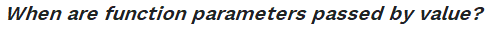
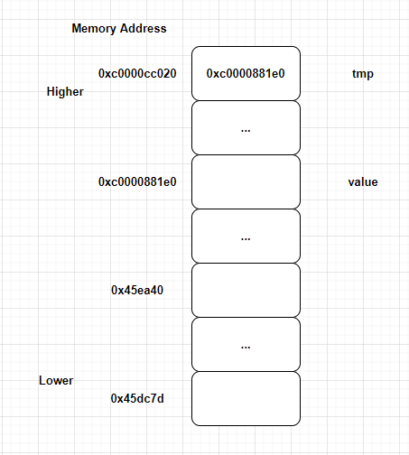

在 Go 官方的 FAQ 中有这样一个讨论：

As in all languages in the C family, everything in Go is passed by value. That is, a function always gets a copy of the thing being passed, as if there were an assignment statement assigning the value to the parameter. For instance, passing an int value to a function makes a copy of the int, and passing a pointer value makes a copy of the pointer, but not the data it points to. (See a later section for a discussion of how this affects method receivers.)

和 C 系编程语言类似，Go 语言中只有“值传递”。就是说，函数从调用方那里获得了值的**副本**，就好像有一个**赋值语句**将值复制给了参数。比如：传递的是 int 类型值时，函数会获得 int 类型值的副本；若是指针类型值，则获得的是指针值的副本，而不是指针指向的内存地址中存放的值。

Map and slice values behave like pointers: they are descriptors that contain pointers to the underlying map or slice data. Copying a map or slice value doesn't copy the data it points to. Copying an interface value makes a copy of the thing stored in the interface value. If the interface value holds a struct, copying the interface value makes a copy of the struct. If the interface value holds a pointer, copying the interface value makes a copy of the pointer, but again not the data it points to.

**map 和 slice 类型值在使用时，和指针类型值很像**：map 和 slice 更像是包含有指向底层 map 或 slice 数据指针的描述符。拷贝一个 map 或 slice 类型值时，并不会复制一份其指向的数据（底层的数据）。拷贝一个接口类型值，会复制一份接口变量中保存的值——动态值；如果接口值中保存的是一个结构体值，此时会得到一个结构体值的副本；如果接口值中保存了一个指针值，相应的会得到指针值的副本，并不会拷贝一份该指针指向的内存地址保存的值。

通过阅读上面的 FAQ 内容，我的一个疑问是：**如何验证得到的是值副本？**

用 Go 中的编程实例去验证看看：

~~~go
package main

import (
	"fmt"
	"reflect"
	"unsafe"
)

func main() {
	value := "Hello, Gopher!"

	p := (*reflect.StringHeader)(unsafe.Pointer(&value))
	hdr := unsafe.Pointer(p.Data)
	// ❶
	fmt.Printf("Data Addr:%p; Variable Addr:%p.\n", hdr, &value)

	convertTo(&value)

	// ❹
	fmt.Println("converTo:", value)
	p = (*reflect.StringHeader)(unsafe.Pointer(&value))
	hdr = unsafe.Pointer(p.Data)
	// ❺
	fmt.Printf("Data Addr:%p.\n", hdr)
}

func convertTo(tmp *string) {
	// ❷
	fmt.Printf("Variable Addr:%p; Pointer To:%p.\n", &tmp, tmp)

	p := (*reflect.StringHeader)(unsafe.Pointer(tmp))
	hdr := unsafe.Pointer(p.Data)

	// ❸
	fmt.Printf("Data Addr:%p.\n", hdr)

	*tmp = "Hello, Programmer!"
}
PS G:\Go\SyntaxTest> go run main.go
Data Addr:0x45dc7d; Variable Addr:0xc0000881e0.
Variable Addr:0xc0000cc020; Pointer To:0xc0000881e0.
Data Addr:0x45dc7d.
converTo: Hello, Programmer!
Data Addr:0x45ea40.
~~~

程序的输出结果依次是：

1. tmp 变量的类型是：`*string`，该变量保存的值就是 value 变量的内存地址，即 tmp 指针变量指向的是 value 变量；
2. value 变量的类型是 string，实际上 runtime 中其类型是 StringHeader，包含有一个指向底层数据的指针；
3. 代码中的 hdr 变量的值就是底层数据的内存地址。我们创建的 2 个不同字符串其底层数据的地址是不同，比如 `Hello, Gopher!` 首字节地址是 `0x45dc7d`，`Hello, Programmer!` 首字节地址是 `0x45ea40`。

在调用 `convertTo(tmp *string)` 时，函数获得的是 value **变量地址**的**副本**，也就是**做了一次地址的拷贝**。因此，修改 `*tmp` 的值，实际上就是修改了 value 变量的值。相应的，最后输出的是改变后的 `Hello, Programmer!`。

~~~go
// StringHeader is the runtime representation of a string.
// It cannot be used safely or portably and its representation may
// change in a later release.
// Moreover, the Data field is not sufficient to guarantee the data
// it references will not be garbage collected, so programs must keep
// a separate, correctly typed pointer to the underlying data.
type StringHeader struct {
	Data uintptr
	Len  int
}
~~~

每个 string 类型变量，运行期的内存分布是一个结构体，分别是：

* 一个字符串存储字节数组的指针（地址）；
* 字节长度。

**反向验证**，修改程序为：`convertTo(tmp string)`，相应传入的是 value **值**的**副本**。在 convertTo 函数中，创建了一个结构体副本，tmp 变量 StringHeader.Data 域的值仍然是 `Hello, Gopher!` 字符串的地址，但是经过一次赋值，将其值修改为了 `Hello, Programmer!` 的地址。**tmp 变量的 StringHeader.Data 被修改了，指向了新创建的字符串的内存地址（可以看做是一次性赋值）**。但问题在于本次是一次值的拷贝，得到的是结构体的副本，原值 value 并没有因此而改变，所以得到的输出结果仍然会是：`Hello, Gopher!`。

我们再来看看 slice：

~~~go
// SliceHeader is the runtime representation of a slice.
// It cannot be used safely or portably and its representation may
// change in a later release.
// Moreover, the Data field is not sufficient to guarantee the data
// it references will not be garbage collected, so programs must keep
// a separate, correctly typed pointer to the underlying data.
type SliceHeader struct {
	Data uintptr
	Len  int
	Cap  int
}
~~~

和 string 类型一样，runtime 期 slice 的实际类型是 SliceHeader 类型，其中 Data 的值就是底层存入数据的内存块首地址。用下述代码可得到 Data 的值：

~~~go
func main() {
	value := []int{1, 2, 3, 4}
    
	p := (*reflect.SliceHeader)(unsafe.Pointer(&value))
	hdr := unsafe.Pointer(p.Data)
	fmt.Printf("Data Addr:%p; Variable Addr:%p, Value:%p.\n", hdr, &value, value)
}
PS G:\Go\SyntaxTest> go run main.go
Data Addr:0xc000012400; Variable Addr:0xc0000044a0, Pointer:0xc000012400.
~~~

一个很神奇的现象出现了：value 的值竟然是可以直接以 `%p` 的形式输出的，其输出的结果和 hdr 值相同！要知道如果是 string 类型值，会直接提示：`Printf format %p has arg value of wrong type string`。而且我们得到了这样的结果：**以 `%p` 的形式输出的结果，就是 SliceHeader Data 内存块的首地址**。

我们试着运行相类似的代码：

~~~go
package main

import (
	"fmt"
	"reflect"
	"unsafe"
)

func main() {
	value := []int{1, 2, 3, 4}

	p := (*reflect.SliceHeader)(unsafe.Pointer(&value))
	hdr := unsafe.Pointer(p.Data)
	// ❶
	fmt.Printf("Data Addr:%p; Variable Addr:%p, Pointer:%p.\n", hdr, &value, value)

	convertTo(value)

	// ❹
	fmt.Println("converTo:", value)
	p = (*reflect.SliceHeader)(unsafe.Pointer(&value))
	hdr = unsafe.Pointer(p.Data)
	// ❺
	fmt.Printf("Data Addr:%p.\n", hdr)
}

func convertTo(tmp []int) {
	// ❷
	fmt.Printf("Variable Addr:%p; Pointer To:%p.\n", &tmp, tmp)

	p := (*reflect.SliceHeader)(unsafe.Pointer(&tmp))
	hdr := unsafe.Pointer(p.Data)

	// ❸
	fmt.Printf("Data Addr:%p.\n", hdr)

	tmp[0] = 0
}
PS G:\Go\SyntaxTest> go run main.go
Data Addr:0xc000012400; Variable Addr:0xc0000044a0, Pointer:0xc000012400.
Variable Addr:0xc000004500; Pointer To:0xc000012400.
Data Addr:0xc000012400.
converTo: [0 2 3 4]
Data Addr:0xc000012400.
~~~

从 `0xc000012400` 的打印结果来看，很明显 main 中的 value 变量和 convertTo 中的 tmp 变量底层引用了相同的数组内容，即 `0xc000012400` 内存地址处的数组。很自然的，如果使用该地址修改了数组元素，比如 `tmp[0] = 0`，肯定也会反馈到引用相同内存段的变量，比如此处的 value。

因此，我们通过 slice 类型值在函数中的传递，也验证了 Go 中确实是传递了值的副本。**虽然 slice 传递的是 struct 的值，但其结构体中包含了一个指针，由此达到了修改原值的效果！**

> 大家一定要注意，实际是一个 struct 值的副本。其中还包括 Len 和 Cap，如果改变了 Len 和 Cap，原值是无法跟着改变的！

类似的，修改上述程序的值：`value := map[int]string{1: "1", 2: "2"}`，经过在 convertTo 函数中的修改，得到了相同的结论。

所以，通过本篇我们得到如下结论：

* 在 Go 中，变量的赋值、传递，实际上都是拷贝了变量的值。如果是值类型，则拷贝值；如果是指针类型，则拷贝指针值。
* string 类型的值和 slice、map 在 Go 的使用是不同的。具体是因为 runtime 期，与之对应的实际类型的结构是不同的。

来点“小甜点”尝尝：一个典型的**传引用**实例

~~~java
package com.szIdeaComm.Viper;

public class Test {

    public static void main(String[] args) {
        Person person = new Person("A", 18);
        convertTo(person);

        // Person{name='B', age=18}
        System.out.println(person.toString());
    }

    private static void convertTo(Person person){
        person.setName("B");
    }

    public static class Person {
        private String name;
        private int age;

        public Person(String name, int age) {
            this.name = name;
            this.age = age;
        }

        public void setName(String name){
            this.name = name;
        }

        @Override
        public String toString() {
            return "Person{" + "name='" + name + '\'' + ", age=" + age + '}';
        }
    }
}
~~~

