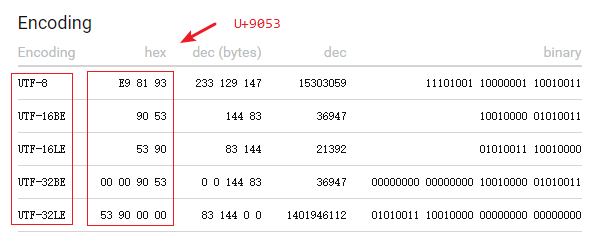

> 业务逻辑还不能流畅写出来，去分析源代码干啥！好好熟练掌握 Go 标准库。
>
> **掌握技能**一般分为 3 个步骤：
>
> 1. 模仿；
> 2. 变化：在各种变化的场景中，解决遇到的问题和难题，由此达到锻炼技能的目的；
> 3. 创新。
>
> 再比如，此前看到关于如何掌握技能的方法，大致经历的过程是：**过、抄、仿、改、调、看、练（重复上面的步骤）、创（独立解决问题）、悟**。实际上仍然可以将上面的 9 个字归纳为：**模仿、变化、创新、领悟**这 4 个阶段。
>
> 另外看到知乎上关于练习 API 有这样的看法：『记住 API 能够提供的功能和用法即可：打一个不是特别恰当的比方，当你在一个城市里面行走的时候，即使是你自己的老家，到达某个目的地的路线，你不可能也没必要去记住共有几条路线可以到达，每条路线具体有多少公里，每走多少米应该改变方向，但是你知道问路和看路牌，就如同查 API 文档一样，你基本**知道大概的方向**。**即使你到了一个陌生的城市（API），只要道路的规划和你所在的城市是一致的，你很容易依靠路牌找到方向**。具体类的方法不清楚，**多查就好**。**API Reference 是用来查阅的，而不是用来记住的！**』

Go 的 bytes 包，其功能是处理 `[]byte` 类型实例的相关函数；其功能和 strings 包类似，可以做类比（analogous）。

# 1 ToLower

`func ToLower(s []byte) []byte`：将 Unicode 字母转化为对应的小写形式。如下是一个很常规的英文大写字母转化为小写字母：

~~~go
func TestToLower(t *testing.T) {
	value := "MiChoi"
	fmt.Printf("%q.\n", bytes.ToLower([]byte(value)))
	fmt.Printf("%q.\n", bytes.ToLower([]byte("没有大小写的 Unicode 码")))
}
"michoi".
"没有大小写的 unicode 码".
~~~

`func ToLowerSpecial(c unicode.SpecialCase, s []byte) []byte`：将 s 看作是 UTF-8-encoded 字节切片，按照指定的**映射表**（也就是 unicode.SpecialCase）做转换。

~~~go
func TestToLowerSpecial(t *testing.T) {
	str := []byte("AHOJ VÝVOJÁRİ GOLANG")
	totitle := bytes.ToLowerSpecial(unicode.AzeriCase, str)
	fmt.Println("Original : " + string(str))
	fmt.Println("ToLower : " + string(totitle))
}
Original : AHOJ VÝVOJÁRİ GOLANG
ToLower : ahoj vývojári golang
~~~

在 Go 中使用最多的是 unicode.AzeriCase 和 unicode.TurkishCase，实际上两者是相同的 unicode.SpecialCase 实例。

# 2 ToTitle

`func ToTitle(s []byte) []byte`：将 s 视作为 UTF-8-encoded 的字节切片，ToTitle 将 Unicode 字母转化为对应的 Title 格式。暂时可以认为，Title 形式就是类似标题的大写格式。

~~~go
func TestToTitle(t *testing.T) {
	fmt.Printf("%s\n", bytes.ToTitle([]byte("loud noises")))
	fmt.Printf("%s\n", bytes.ToTitle([]byte("хлеб")))
}
LOUD NOISES
ХЛЕБ
~~~

`func ToTitleSpecial(c unicode.SpecialCase, s []byte) []byte`：根据指定 unicode.SpecialCase，将其转化为对应的 Title 格式。

~~~go
func TestToTitleSpecial(t *testing.T) {
	str := []byte("ahoj vývojári golang")
	totitle := bytes.ToTitleSpecial(unicode.AzeriCase, str)
	fmt.Println("Original : " + string(str))
	fmt.Println("ToTitle : " + string(totitle))
}
Original : ahoj vývojári golang
ToTitle : AHOJ VÝVOJÁRİ GOLANG
~~~

# 3 ToUpper

`func ToUpper(s []byte) []byte` 和 `func ToUpperSpecial(c unicode.SpecialCase, s []byte) []byte`，同上功能，不同的是将其转化为大写格式：

~~~go
func TestToUpper(t *testing.T) {
	fmt.Printf("%s\n", bytes.ToUpper([]byte("Gopher")))

	str := []byte("ahoj vývojári golang")
	totitle := bytes.ToUpperSpecial(unicode.AzeriCase, str)
	fmt.Println("Original : " + string(str))
	fmt.Println("ToUpper : " + string(totitle))
}
GOPHER
Original : ahoj vývojári golang
ToUpper : AHOJ VÝVOJÁRİ GOLANG
~~~

ToTitle 和 ToUpper 的区别是什么？

~~~go
func TestDiffUpperAndTitle(t *testing.T) {
	str := "dz"
	fmt.Printf("%q\n", bytes.ToTitle([]byte(str)))
	fmt.Printf("%q\n", bytes.ToUpper([]byte(str)))

	fmt.Printf("%s\n", bytes.ToUpper([]byte("Gopher")))
	fmt.Printf("%s\n", bytes.ToTitle([]byte("Gopher")))
}
"Dz"
"DZ"
GOPHER
GOPHER
~~~

大多数情况下，ToTitle 和 ToUpper 是相同的，但对于少数一些字符来说，还是有差异的。

# 4 ToValidUTF8

`func ToValidUTF8(s, replacement []byte) []byte`：将 s 中的每一个非 Unicode byte 替换成指定 replacement（此处是 []byte 类型）：

~~~go
func TestToValidUTF8(t *testing.T) {
	value := "Geeks\xc5Geeks\n"
	fmt.Println(value)

	origin := []byte(value)
	fmt.Printf("%q\n", origin)

	// Invalid UTF-8 '\xc5' replaced by 'For'
	dst := bytes.ToValidUTF8(origin, []byte(""))
	fmt.Printf("%q\n", dst)
}
Geeks�Geeks

"Geeks\xc5Geeks\n"
"GeeksGeeks\n"
~~~

那从 `ToValidUTF8` 这个函数，我知道了 Unicode 对应的字节值是有范围的，**并非每一个字节值都是一个 Unicode 编码值**。在 Go 中的默认编码格式是 UTF-8，也就是说，一个字符的 Unicode 码值，会转化为 UTF-8 格式进行存储和表示。

> [Basic Latin — ✔️ ❤️ ★ Unicode Character Table (unicode-table.com)](https://unicode-table.com/en/) Unicode 码查询工具

问题如下：

在 Go 中如何表示一个 Unicode 码值？是 U+000A 吗？

~~~go
func TestToValidUTF8(t *testing.T) {
	var a rune = '\u0061'
	fmt.Printf("%q, %#U\n", a, a)
    
    fmt.Printf("%#U\n", '道')
}
U+9053 '道'
'a', U+0061 'a'.
~~~

可以看到字符 a 的 Unicode 值是 U+0061，对应 `道` 这个中文字符的 Unicode 值是 U+9053，各种编码方式对应的值如下：

使用一个 rune 类型变量存放 `\u0061` 这个 Unicode 值，实际上是占用了 4 个字节。

那 Unicode 码值具体的范围是什么？

~~~go
0xxxxxxx                             runes 0-127    (ASCII)
110xxxxx 10xxxxxx                    128-2047       (values <128 unused)
1110xxxx 10xxxxxx 10xxxxxx           2048-65535     (values <2048 unused)
11110xxx 10xxxxxx 10xxxxxx 10xxxxxx  65536-0x10ffff (other values unused)
~~~

上述列表中**左侧**表示的是（UTF-8 编码格式的）底层字节数组的存储内容，**右侧部分表示的是 Unicode code point 值**；对于 U+00110000(0x110000) 这个就是一个非法的 Unicode code point 值，超出了最大的可表示范围：65536-0x10ffff。在 [Unicode - Unicode Character Table (unicode-table.com)](https://unicode-table.com/en/blocks/) 中，按照类型的不同，将 Unicode 码值分成不同的部分，其表示的 Unicode 值和字符类型是：

1. 0000—007F：[Basic Latin](https://unicode-table.com/en/blocks/basic-latin/)
2. 0080—00FF：[Latin-1 Supplement](https://unicode-table.com/en/blocks/latin-1-supplement/)
3. ...
4. F0000—FFFFF：[Supplementary Private Use Area-A](https://unicode-table.com/en/blocks/supplementary-private-use-area-a/)
5. 100000—10FFFF：[Supplementary Private Use Area-B](https://unicode-table.com/en/blocks/supplementary-private-use-area-b/)

那为什么认为 `value := "Geeks\xc5Geeks\n"` 中的 `\xc5` 不是一个 Unicode 值？

~~~go
func TestUnicodeUTF(t *testing.T) {
	code := '\u00c5' // rune 类型
	fmt.Printf("%T, %q, %#U\n", code, code, code)
	code = '\xc5' // rune 类型
	fmt.Printf("%T, %q, %#U\n", code, code, code)

	// rune --> []byte
	fmt.Printf("%0x\n", code)

	fmt.Println(utf8.ValidRune(code))

	fmt.Println(utf8.Valid([]byte("\xc5")))
}
int32, 'Å', U+00C5 'Å'
int32, 'Å', U+00C5 'Å'
c5
true
false
~~~

比如上面例子中的 `\xc5` 这个十六进制值，对应的 Unicode 值是 197。虽然值是 197 的 Unicode 是存在的，如果是使用 rune 类型（4 个字节），自然就对应的是 `Å` 这个 Unicode 字符；但如果是 `[]byte("\xc5")`，其长度就只有一个字节，无法表示任何一个 Unicode 字符。

要知道最短的 1 个字节的 Unicode 字符就是：ASCII 码，其范围是：`runes 0-127 (ASCII)`。

因此，在 Go 中，想要表达一个 Uicode 字符，有 2 种方式：

1. `var a = '\u0061'`
2. `var value = '\xc5'`

一定要记住，其类型一定是 rune 才能真正表示一个 Unicode 字符！

