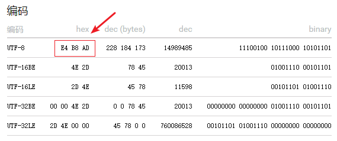

Go 的 bytes 包，其功能是处理 `[]byte` 类型实例的相关函数；其功能和 strings 包类似，可以做类比（analogous）。

> 在测试函数或方法时，或者是做单元测试时，一定要特别注意**边界情况**的计算过程。

本篇我们来看看 ContainXxx 和 EqualXxx 相关的方法：

# 1 ContainXxx

`func Contains(b, subslice []byte) bool`：判断 b 中是否**整体包含** subslice。如果包含，则返回 true。和之前分析的 IndexXxx 不同，Contains 仅判断是否包含 subslice，而不会返回对应的位置索引。

~~~go
package gobytes

import (
	"bytes"
	"fmt"
	"testing"
)

func TestContains(t *testing.T) {
	value := "Michoi"
	contains := bytes.Contains([]byte(value), []byte("Mi"))
	fmt.Printf("%v\n", contains)

	value = "seefood"
	contains = bytes.Contains([]byte(value), []byte("bar"))
	fmt.Printf("%v\n", contains)

	value = ""
	contains = bytes.Contains([]byte(value), []byte(""))
	fmt.Printf("%v\n", contains)

	value = "Michoi"
	contains = bytes.Contains(nil, []byte(""))
	fmt.Printf("%v\n", contains)

	contains = bytes.Contains(nil, nil)
	fmt.Printf("%v\n", contains)
}
true
false
true
true
true
~~~

`func ContainsAny(b []byte, chars string) bool`：判断 chars 中**任意的一个** `UTF-8-encoded code points` 是否存在于 b 中。

~~~go
func TestContainsAny(t *testing.T) {
	value := "Michoi"
	contains := bytes.ContainsAny([]byte(value), "abo")
	fmt.Printf("%v\n", contains)

	fmt.Println(bytes.ContainsAny([]byte("I like seafood."), "fÄo!"))
	fmt.Println(bytes.ContainsAny([]byte("I like seafood."), "去是伟大的."))
	fmt.Println(bytes.ContainsAny([]byte("I like seafood."), ""))
	fmt.Println(bytes.ContainsAny([]byte(""), ""))

	fmt.Println(bytes.ContainsAny(nil, ""))
}
true
true
true
false
false
false
~~~

`func ContainsRune(b []byte, r rune) bool`：判断 `UTF-8-encoded` 的字节序列 b 中，是否存在指定的 rune 值。

~~~go
func TestContainsRune(t *testing.T) {
	slice := []byte{0x00, 0xE4, 0xB8, 0xAD, 0xff}
	fmt.Println(bytes.ContainsRune(slice, '中'))

	fmt.Println(bytes.ContainsRune([]byte("I like seafood."), 'f'))
	fmt.Println(bytes.ContainsRune([]byte("I like seafood."), 'ö'))
	fmt.Println(bytes.ContainsRune([]byte("去是伟大的!"), '大'))
	fmt.Println(bytes.ContainsRune([]byte("去是伟大的!"), '!'))
	fmt.Println(bytes.ContainsRune([]byte(""), '@'))
}
true
true
false
true
true
false
~~~

比如上面的 Unicode 字符——中——对应的 Unicode 码值是 U+4E2D，UTF-8 编码值是：

由此构造出 b 的值是：`[]byte{0x00, 0xE4, 0xB8, 0xAD, 0xff}`，其中就包括了该字符的 UTF-8 编码值。

# 2 EqualXxx

`func Equal(a, b []byte) bool`：判断 a 和 b 的长度是否相同，并且包含了相同的字节序列。如果入参是 nil，等同于空的字节切片值。

~~~go
func TestEqual(t *testing.T) {
	fmt.Println(bytes.Equal([]byte(""), []byte("")))
	fmt.Println(bytes.Equal(nil, []byte("")))
	fmt.Println(bytes.Equal([]byte(""), nil))

	fmt.Println(bytes.Equal([]byte("Michoi"), []byte("michoi")))
	fmt.Println(bytes.Equal([]byte("Go"), []byte("Go")))
	fmt.Println(bytes.Equal([]byte("Go"), []byte("C++")))
}
true
true
true
false
true
false
~~~

`func EqualFold(s, t []byte) bool`：将 s 和 t 看作是 UTF-8 字符串，函数判断在忽略大小写的情况下，s 和 t 是否相同。

~~~go
func TestEqualFold(t *testing.T) {
	s := []byte{0xFF}
	tt := []byte{0xff}
	fmt.Println(bytes.EqualFold(s, tt))
    
	fmt.Println(bytes.EqualFold([]byte("Go"), []byte("go")))
}
true
true
~~~
