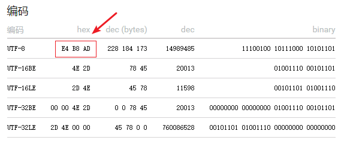
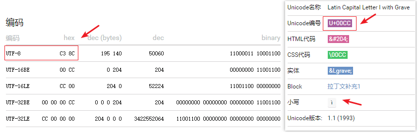

本篇文章会对如下问题做论述：

* rune 类型，Go 中所有的字符都是经过 UTF-8 格式编码的，引入了 rune 类型后，可以方便地访问每一个 UTF-8 编码后的 Unicode 字符；
* []byte 和 string 类型的底层结构；
* string 类型的不可变性；
* []byte 和 string 类型的相互转换。

先来看一个简单的示例程序：

~~~go
func TestString(t *testing.T) {
	value := "中"
	fmt.Printf("%T, len(value)=%d\n", value, len(value))
	bytesSlice := []byte("中")
	fmt.Printf("%T, len(bytesSlice)=%d\n", bytesSlice, len(bytesSlice))

	values := "中\xcc"
	fmt.Printf("%T, len(value)=%d, %q\n", values, len(values), values)

	a := '中'
	b := 'b'
	c := byte('c') // 显式设置为 byte 类型
	fmt.Printf("%T, %q\n", a, a)
	fmt.Printf("%T, %q\n", b, b)
	fmt.Printf("%T, %q\n", c, c)
}
string, len(value)=3
[]uint8, len(bytesSlice)=3
string, len(value)=4, "中\xcc"
int32, '中'
int32, 'b'
uint8, 'c'
~~~

我们知道，**在 Go 中，所有字符编码格式都是 UTF-8 的**，比如上面示例代码中的 value：

中文汉字 `中` 的 Unicode 值是 U+4E2D，对应的 UTF-8 编码值是：`0xE4 0xB8 0xAD`。将其转化成 []byte 时，占用了 3 个字节。`values := "中\xcc"` 其含义是在原先中文的末尾**增加一个字节值** `\xcc`。

# 1 rune 类型

在 Go 中所有的字符都是经过 UTF-8 格式编码的，引入了 rune 类型后，可以方便地访问每一个 UTF-8 后的 Unicode 字符；

~~~go
func TestRuneSlice(t *testing.T) {
	value := "中国加油！\xcc"
	runes := []rune(value)
	for index, ele := range runes {
		fmt.Printf("%d --> %q; ", index, ele)
	}
	fmt.Println()

	bytesEle := []byte(value)
	for i, element := range bytesEle {
		fmt.Printf("%d --> %q; ", i, element)
	}
	fmt.Println()
}
0 --> '中'; 1 --> '国'; 2 --> '加'; 3 --> '油'; 4 --> '！'; 5 --> '�';
0 --> 'ä'; 1 --> '¸'; 2 --> '\u00ad'; 3 --> 'å'; 4 --> '\u009b'; 5 --> '½'; 6 --> 'å'; 7 --> '\u008a'; 8 --> '\u00a0'; 9 --> 'æ'; 10 --> '²'; 11 --> '¹'; 12 --> 'ï'; 13 --> '¼'; 14 --> '\u0081'; 15 --> 'Ì';

~~~

string 类型值，不仅可以转化成 []byte，而且可以转化为 []rune！

**很有意思的是**，如果我们人为地在 value 后面新增一个字节的内容 `\xcc`，也就是一个十六进制的值。将 value 分别转化为 []rune 和 []byte：

1. 转化为 []rune 时（将 value 底层的字节数组，转化为 []rune），**单字节的 `\xcc` 并不能对应到任何一个 Unicode 码值的 UTF-8 编码结果**，
2. 转化为 []byte 时（将 value 底层的字节数组，转化为 []byte），使用 `%q` 的格式输出 `\xcc` 时（单个字节值），Go 认为当前输出的是 Unicode 码值是 U+00CC 的字符，也就是 `Ì`。

在将 value 底层的字节数组转化为 []rune 时，相对于转化成 []byte 增加了一个过程：**会在遍历 value 的字节数组时，判断是否构成了一个 Unicode 的 UTF-8 编码结果**。如果是，那么输出成为一个 rune 类型值；反之，则输出一个 `utf8.RuneError` 的值（`\uFFFD` the "error" Rune or "Unicode replacement character"），也就是上面输出为 `�` 的值。

相关 fmt 输出格式（**整数占位符**）的知识点：

| 占位符 |                      说明                      |         举例         |  输出  |
| :----: | :--------------------------------------------: | :------------------: | :----: |
|   %b   |                   二进制表示                   |   Printf("%b", 5)    |  101   |
|   %c   |          相应Unicode码点所表示的字符           | Printf("%c", 0x4E2D) |   中   |
|   %d   |                   十进制表示                   |  Printf("%d", 0x12)  |   18   |
|   %o   |                   八进制表示                   |   Printf("%d", 10)   |   12   |
|   %q   | 单引号围绕的字符字面值，由Go语法安全地**转义** | Printf("%q", 0x4E2D) |  '中'  |
|   %x   |        十六进制表示，字母形式为小写 a-f        |   Printf("%x", 13)   |   d    |
|   %X   |        十六进制表示，字母形式为大写 A-F        |   Printf("%x", 13)   |   D    |
|   %U   |      Unicode格式：U+1234，等同于 "U+%04X"      | Printf("%U", 0x4E2D) | U+4E2D |

更有意思的是，如果是 `value := "中国加油！\xc3\x8c"`，那么转化成 []rune 时，会输出 `0 --> '中'; 1 --> '国'; 2 --> '加'; 3 --> '油'; 4 --> '！'; 5 --> 'Ì';` 也就是说得到了一个 UTF-8 编码的 Unicode 值。

但是，对于 `\u00ad`、`\u009b`、`\u008a`、`\u00a0` 以及 `\u0081` 值没有打印出对应的符号，是因为它们都是**非字符型的 Unicode 字符**，比如：控制字符等。

我们来看看到底**如何表示一个 rune 值**：

~~~go
func TestRuneNormal(t *testing.T) {
	fmt.Printf("%q\n", 0x4E2D)
	fmt.Printf("%q\n", '\u4E2D')
	fmt.Printf("%q\n", '\U00004E2D')

	fmt.Printf("%q\n", '\u00cc')
	fmt.Printf("%q\n", '\xcc')
	fmt.Printf("%q\n", '\314')
	// fmt.Printf("%q\n", '\x4E2D') illegal \x 后跟随 2 个十六进制的数字
}
'中'
'中'
'中'
'Ì'
'Ì'
'Ì'
~~~

> 表示 rune 有 2 种不同形式，其一是**直接写出的字符**，其二是**对应的数值编码**，表示 Unicode code point 值。
>
> **在字符串字面值或者字符字面值中**，有 4 种方式**将整数值表示为数字常量**：\x 后跟随 2 个十六进制的数字；\u 后跟随 4 个十六进制的数字；\U 后跟随 8 个十六进制的数字；以及反斜线 \ 后跟随 3 个 8 进制的数字。上述这些情形中，字面值都是由相应基数中的数字表示的值。**对于 2 个十六进制的数值，以及 3 个八进制的数值，均不能超过 255**，只能表示 1 个字节的值。

最后来看看 rune 类型的真面目：

~~~go
// rune is an alias for int32 and is equivalent to int32 in all ways. It is
// used, by convention, to distinguish character values from integer values.
type rune = int32
~~~

rune 就是 4 个字节的数据类型。

# 2 底层结构

string：字符串类型

~~~go
// string is the set of all strings of 8-bit bytes, conventionally but not
// necessarily representing UTF-8-encoded text. A string may be empty, but
// not nil. Values of string type are immutable.
type string string

type stringStruct struct {
	str unsafe.Pointer
	len int
}
~~~

在注释中说明了，string 底层是一系列的表示 string 内容的 8-bit 的字节数组，但并不全都表示了 `UTF-8-encoded text`。就比如上述例子中的：`value := "中国加油！\xcc"`，其中 `\xcc` 这个字节就不能表示任何一个 UTF-8 格式的 Unicode 字符。

在注释中明确指出了：`Values of string type are immutable.` string 的值是**不可更改的**，相当于**这块内存区是只读的（不可写）**。

~~~go
func TestStringNormal(t *testing.T) {
	value := "中Michoi国"
	fmt.Printf("%q\n", value[0])

	for index, ele := range value {
		fmt.Printf("%d, %q\t", index, ele)
	}
	fmt.Println()
}
'ä'
0, '中' 3, 'M'  4, 'i'  5, 'c'  6, 'h'  7, 'o'  8, 'i'  9, '国'
~~~

`value[0]` 确实可以**获取到 value 底层字节数组的第 0 个字节值**，但是如果通过 range 的方式遍历 string 值时，**其方式则是 rune 类型的**，也就是说并不是按照字节顺序进行遍历。

[]byte：byte 的切片类型

~~~go
type slice struct {
	array unsafe.Pointer
	len   int
	cap   int
}
~~~

从结构体的定义来看，string 和 []byte 实际上相差并不是很大。

# 3 string 类型的不可变性

我们通过这个例子来看 string 的不可变性：

~~~go
func TestStringToSlice(t *testing.T) {
	value := "中Michoi国"
	slice := []byte(value)

	slice[3] = 'm'
	fmt.Println(value)

	origin := string(slice)
	fmt.Println(origin)

	slice[4] = 'I'
	fmt.Println(origin)
}
中Michoi国
中michoi国
中michoi国
~~~

**一个字符串是包含只读字节的数组，一旦创建，是不可变的**。相比之下，一个字节 `slice` 的元素则可以自由地修改。即便修改了 slice 的字节值，但是原先的 value 并没有发生任何改变。从概念上讲，一个 `[]byte(s)` 转换是**分配了一个新的字节数组用于保存字符串数据的拷贝**，然后引用这个底层的字节数组（slice）。编译器的优化可以避免在一些场景下分配和复制字符串数据，但总的来说需要确保在变量 `b` 被修改的情况下，原始的 `s` 字符串也不会改变。

将一个字节 `slice` 转换到字符串的 `string(b)` 操作则是**构造一个字符串拷贝**，以确保 `s2` 字符串是只读的。

# 4 []byte 和 string 类型的相互转换

一般情况下，可以使用这样的转化方式：

~~~go
func TestStringToSlice(t *testing.T) {
	value := "中Michoi国"
	slice := []byte(value) // string --> []byte

	slice[3] = 'm'
	fmt.Println(value)

	origin := string(slice) // []byte --> string
	fmt.Println(origin)

	slice[4] = 'I'
	fmt.Println(origin)
}
~~~

其他更加高效的方式，需要使用到 unsafe 包，这部分在**性能优化**中解答！
