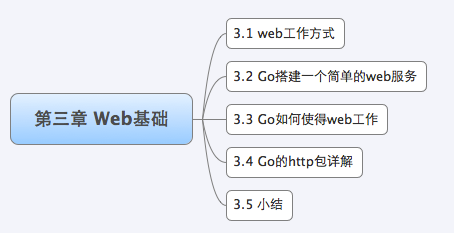
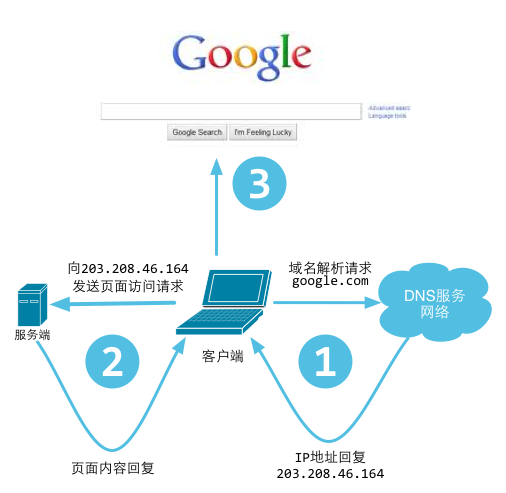
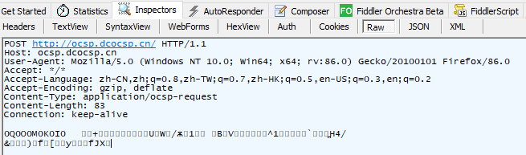
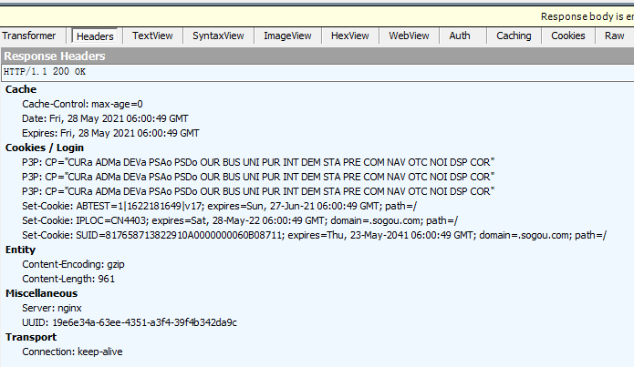
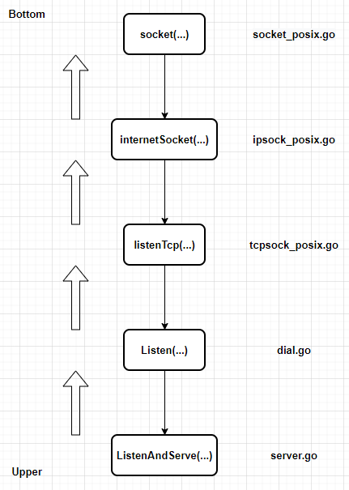
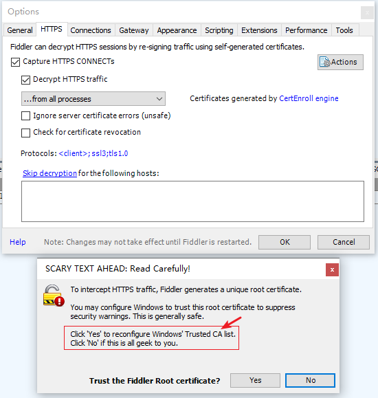

学习**基于 Web 的编程**可能正是你读本书的原因。

Go 目前已经拥有了**成熟的 HTTP 处理包**，这使得编写能做**任何事情**的**动态 Web 程序**易如反掌。在接下来的各章中将要介绍的内容，都是属于 **Web 编程的范畴**。

# 1 Web 工作方式

我们平时**浏览网页**的时候，会打开**浏览器**，输入**网址**后**按下回车键**，然后就会显示出你想要浏览的内容。在这个看似简单的用户行为背后，到底隐藏了些什么呢？

对于普通的上网过程，系统其实是这样做的：**浏览器**本身是一个**客户端**，当你输入 URL 的时候，首先浏览器会去请求 **DNS 服务器**，通过 DNS 获取相应的域名对应的 IP，然后通过 IP 地址找到 IP 对应的**服务器**后，要求建立 **TCP 连接**，等浏览器发送完 HTTP Request（请求）包后，服务器接收到请求包之后才开始处理请求包，服务器调用**自身服务**，返回 HTTP Response（响应）包；客户端收到来自服务器的响应后开始**渲染**这个 Response 包里的主体（body），等收到全部的内容随后断开与该服务器之间的 TCP 连接。**『用户访问一个 Web 站点的过程』**用下述图描述：

一个 **Web 服务器**也被称为 **HTTP 服务器**，它通过 **HTTP 协议**与**客户端**通信。这个**客户端**通常指的是 **Web 浏览器** (其实手机端客户端内部也是浏览器实现的)。也就是说，**整个过程是建立在 HTTP 通信的基础之上的**。

Web 服务器的工作原理可以简单地归纳为：

1. 客户端通过 **TCP/IP 协议**建立到服务器的 **TCP 连接**（HTTP通信协议是建立在 TCP/IP 之上的应用层协议）；
2. 客户端向服务器发送 HTTP 协议请求包，请求服务器里的资源文档；
3. 服务器向客户端发送 HTTP 协议应答包，如果请求的资源（**此处说的是：返回给 Client 的资源文件吗？**）包含有动态语言的内容，那么服务器会调用**动态语言的解释引擎**负责处理 “动态内容”，并将处理得到的数据返回给客户端；
4. **客户机与服务器断开（为什么是 Client 主动断开连接？）**。由客户端解释 HTML 文档，在客户端屏幕上渲染图形结果。

## 1.1 URL 和 DNS 解析

我们浏览网页都是通过 URL 访问的，那么 URL 到底是怎么样的呢？**URL (Uniform Resource Locator)** 是 “统一资源定位符” 的英文缩写，用于**描述一个网络上的资源**，基本格式如下：

~~~http
scheme://host[:port#]/path/.../[?query-string][#anchor]
scheme         指定底层使用的协议(例如：http, https, ftp)
host           HTTP 服务器的 IP 地址或者域名
port#          HTTP 服务器的默认端口是 80，这种情况下端口号可以省略。如果使用了别的端口，必须指明，例如 http://www.cnblogs.com:8080/
path           访问资源的路径
query-string   发送给 http 服务器的数据
anchor         锚
~~~

DNS (Domain Name System) 是 “域名系统” 的英文缩写，是一种组织成**域层次结构**的计算机和网络服务命名**系统**，它用于 TCP/IP 网络，它从事**将主机名或域名转换为实际 IP 地址**的工作。DNS 就是这样的一位 “翻译官”，它的**基本工作原理**可用下图来表示。

更详细的 DNS 解析过程如下：

1. 在浏览器中输入 www.qq.com 域名，操作系统会先检查自己**本地的 hosts 文件**是否有这个网址映射关系，如果有，就先调用这个 IP 地址映射，完成域名解析。
2. 如果 hosts 里没有这个域名的映射，则查找**本地 DNS 解析器缓存**，是否有这个网址映射关系，如果有，直接返回，完成域名解析。
3. 如果 hosts 与本地 DNS 解析器缓存都没有相应的网址映射关系，首先会找 TCP/IP 参数中设置的**首选 DNS 服务器**，在此我们叫它**本地 DNS 服务器**，**此服务器**收到查询时，如果要查询的域名，包含在本地配置区域资源中，则返回解析结果给客户机，完成域名解析，此解析具有权威性。
4. 如果要查询的域名，不由本地 DNS 服务器区域解析，但该服务器已缓存了此网址映射关系，则调用这个 IP 地址映射，完成域名解析，此解析不具有权威性。
5. 如果本地 DNS 服务器本地区域文件与缓存解析都失效，则根据本地 DNS 服务器的设置（是否设置转发器）进行查询，如果**未用转发模式**，本地 DNS 就把请求发至 **“根 DNS 服务器”**，“根 DNS 服务器” 收到请求后会判断这个<u>域名 (.com)</u> 是谁来授权管理，并会返回一个负责该**顶级域名服务器**的一个 IP。本地 DNS 服务器收到 IP 信息后，将会联系负责 .com 域的这台服务器。这台负责 .com 域的服务器收到请求后，如果自己无法解析，它就会找一个管理 .com 域的下一级 DNS 服务器地址 <u>(qq.com)</u> 给本地 DNS 服务器。当本地 DNS 服务器收到这个地址后，就会找 qq.com 域服务器，重复上面的动作，进行查询，直至找到 www.qq.com 主机。
6. 如果用的是**转发模式**，此 DNS 服务器就会把请求转发至上一级 DNS 服务器，由上一级服务器进行解析，上一级服务器如果不能解析，或找根 DNS 或把转请求转至上级，以此循环。不管是本地 DNS 服务器用是是转发，还是根提示，最后都是把结果返回给本地 DNS 服务器，由此 DNS 服务器再返回给客户机。

DNS 查询的整个流程：

所谓 **递归**查询过程 就是 **“查询的递交者” 更替**，而 **迭代**查询过程 则是 **“查询的递交者” 不变**。

> 在算法层面，迭代和递归的区别是什么？递归，一个特征在于：“递”出去，“归”回来；另一个特征是：“深度”不断加深，参考“树”结构；再一个是，递归有递推公式，类似于 `f(n) = f(n - 1) + f(n - 2)`，另外还有终止条件。也就是说，对象一直是在改变的。

举个例子来说，你想知道某个一起上法律课的女孩的电话，并且你偷偷拍了她的照片，回到寝室告诉一个很仗义的哥们儿，这个哥们儿二话没说，拍着胸脯告诉你，甭急，我替你查 (此处完成了一次递归查询，即，问询者的角色更替)。然后他拿着照片问了学院大四学长，学长告诉他，这姑娘是 xx 系的；然后这哥们儿马不停蹄又问了 xx 系的办公室主任助理同学，助理同学说是 xx 系 yy 班的，然后很仗义的哥们儿去 xx 系 yy 班的班长那里取到了该女孩儿电话。(此处完成若干次迭代查询，即，问询者角色不变，但反复更替问询对象) 最后，他把号码交到了你手里。完成整个查询过程。

通过上面的步骤，我们最后获取的是 IP 地址，也就是浏览器最后**发起请求**的时候**是基于 IP 来和服务器做信息交互的**。

## 1.2 HTTP 协议详解

**HTTP 协议是 Web 工作的核心**，所以要了解清楚 Web 的工作方式就需要详细地了解清楚 HTTP 是怎么样工作的。

HTTP 是一种让 Web 服务器与浏览器 (客户端) 通过 Internet 发送与接收数据的协议，它建立在 TCP 协议之上，一般采用 TCP 的 80 端口。它是**一个请求、响应协议** -- 客户端发出一个请求，服务器响应这个请求。在 HTTP 中，客户端总是通过建立一个连接与发送一个 HTTP 请求来发起一个**事务**。**服务器不能主动去与客户端联系，也不能给客户端发出一个回调连接**。客户端与服务器端都可以提前中断一个连接。例如，当浏览器下载一个文件时，你可以通过点击 “停止” 键来中断文件的下载，关闭与服务器的 HTTP 连接。

HTTP **协议是无状态的**，同一个客户端的这次请求和上次请求是没有对应关系，对 HTTP 服务器来说，它并**不知道这两个请求是否来自同一个客户端**。为了解决这个问题， Web 程序引入了 Cookie 机制来**维护连接的可持续状态**。

**HTTP 协议是建立在 TCP 协议之上的**，因此 TCP 攻击一样会影响 HTTP 的通讯，例如比较常见的一些攻击：SYN Flood 是当前最流行的 DoS（拒绝服务攻击）与 DdoS（分布式拒绝服务攻击）的方式之一，这是一种利用 TCP 协议缺陷，发送大量伪造的 TCP 连接请求，从而使得被攻击方资源耗尽（CPU 满负荷或内存不足）的攻击方式。

先来看看**【HTTP 请求包】**——**浏览器**信息：

~~~http
GET /domains/example/ HTTP/1.1      // 请求行: 请求方法 请求URI HTTP协议/协议版本
Host：www.iana.org
User-Agent：Mozilla/5.0 (Windows NT 6.1) AppleWebKit/537.4 (KHTML, like Gecko) Chrome/22.0.1229.94 Safari/537.4
Accept：text/html,application/xhtml+xml,application/xml;q=0.9,*/*;q=0.8  // 客户端能接收的 mine
Accept-Encoding：gzip,deflate,sdch       // 是否支持流压缩
Accept-Charset：UTF-8,*;q=0.5        // 客户端字符编码集
// 空行,用于分割请求头和消息体
// 消息体,请求资源参数,例如 POST 传递的参数
~~~

HTTP 请求包的第一行内容，叫做**请求行**。请求行由：请求方法、请求 URI、HTTP协议及其版本号组成。

HTTP 协议定义了很多**与服务器交互的请求方法**，最基本的有 4 种，分别是 GET, POST, PUT, DELETE。**一个 URL 地址用于描述一个网络上的资源**，而 HTTP 中的 GET, POST, PUT, DELETE 就对应着对这个资源的**查，增，改，删 4 个操作**。我们最常见的就是 GET 和 POST 了。GET 一般用于获取 / 查询资源信息，而 POST 一般用于更新资源信息。

我们看看 GET 和 POST 的区别:

1. 我们可以看到 GET 请求消息体为空，POST 请求带有**消息体**。
2. GET 提交的数据会放在 URL 之后，以 ? 分割 URL 和传输数据，参数之间以 & 相连，如 EditPosts.aspx?name=test1&id=123456。POST 方法是把提交的数据放在 HTTP 包的 body 中。
3. GET 提交的数据大小有限制（因为浏览器**对 URL 的长度有限制**，不同浏览器的限制不同），而 POST 方法提交的数据没有限制。
4. GET 方式提交数据，会带来安全问题，比如一个登录页面，通过 GET 方式提交数据时，用户名和密码将出现在 URL 上，如果页面可以被缓存或者其他人可以访问这台机器，就可以从**历史记录**获得该用户的账号和密码。

**【HTTP响应包】**——**服务器**信息：

我们再来看看 HTTP 的 response 包，结构如下：

~~~go
HTTP/1.1 200 OK                     // 状态行
Server: nginx/1.0.8                 // 服务器使用的 WEB 软件名及版本
Date: Tue, 30 Oct 2012 04:14:25 GMT     // 发送时间
Content-Type: text/html             // 服务器发送信息的类型
Transfer-Encoding: chunked          // 表示发送 HTTP 包是分段发的
Connection: keep-alive              // 保持连接状态
Content-Length: 90                  // 主体内容长度
// 空行 用来分割消息头和主体
<!DOCTYPE html PUBLIC "-//W3C//DTD XHTML 1.0 Transitional//EN"... // 消息体
~~~

Response 包中的第一行叫做**状态行**，由 HTTP 协议版本号， 状态码， 状态消息三部分组成。

状态码用来告诉 HTTP 客户端，HTTP 服务器是否产生了预期的 Response。HTTP/1.1 协议中定义了 5 类状态码， 状态码由三位数字组成，第一个数字定义了响应的类别：

* 1XX 提示信息 - 表示请求已被成功接收，继续处理
* 2XX 成功 - 表示请求已被成功接收，理解，接受
* 3XX 重定向 - 要完成请求必须进行更进一步的处理
* 4XX **客户端错误** - 请求有语法错误或请求无法实现
* 5XX **服务器端错误** - 服务器未能实现合法的请求

我们看下面这个图展示了详细的**返回信息**，左边可以看到有很多的资源返回码，200 是常用的，表示正常信息，302 表示跳转。response header 里面展示了详细的信息。访问一次网站的全部请求信息：

这个地方引入了一个疑惑：HTTP 协议是**无状态**的，但是在 HTTP 请求消息中带有 `Connection: keep-alive` 这样的信息，如何理解？

**无状态**是指协议**对于事务处理没有记忆能力**，**服务器不知道客户端是什么状态**。从另一方面将，打开一个服务器上的网页和你之前打开这个服务器上的网页之间没有任何联系。

HTTP 是一个**无状态的面向连接的协议**，无状态不代表 HTTP 不能保持 TCP 连接，更不能代表 HTTP 使用的是 UDP 协议（面向无连接）。从 HTTP/1.1 起，**默认都开启了 Keep-Alive 保持连接特性**，简单地说，当一个网页打开完成后，客户端和服务器之间用于传输 HTTP 数据的 TCP 连接不会关闭，如果客户端再次访问这个服务器上的网页，会继续使用这一条已经建立的 TCP 连接。

Keep-Alive 不会永久保持连接，它有一个保持时间，可以**在不同服务器软件（如 Apache）中设置这个时间**。

来看一个真实的网络请求实例：

上面这张图我们可以了解到整个的通讯过程，同时细心的读者是否注意到了一点，一个 URL 请求但是左边栏里面为什么会有那么多的**资源请求** (这些都是**静态文件**，**Go 对于静态文件有专门的处理方式**)。

这个就是**浏览器的一个功能**，第一次请求 URL，服务器端返回的是 HTML 页面，然后浏览器开始渲染 HTML：当解析到 HTML DOM 里面的图片连接，CSS 脚本和 JS 脚本的链接，浏览器就会自动发起一个请求静态资源的 HTTP 请求，获取相对应的静态资源，然后浏览器就会渲染出来，最终将所有资源整合、渲染，完整展现在我们面前的屏幕上。

网页优化方面有一项措施是减少 HTTP 请求次数，就是把尽量多的 CSS 和 JS 资源合并在一起，目的是尽量减少网页请求静态资源的次数，**提高网页加载速度，同时减缓服务器的压力**。

# 2 Go 搭建一个 Web 服务器

Web 是基于 HTTP 协议的**一个服务**，Go 语言里面提供了一个完善的 net/http 包，通过 http 包可以很方便的就**搭建起来一个可以运行的 Web 服务**。同时使用这个包能很简单地对 Web 的路由，静态文件，模版，Cookie 等数据进行设置和操作。

~~~go
package main

import (
	"fmt"
	"log"
	"net/http"
	"strings"
)

func main() {
	http.HandleFunc("/", sayHelloName)
	err := http.ListenAndServe(":9090", nil)
	if err != nil {
		log.Fatal("LisstenAndServer: ", err)
	}
}

func sayHelloName(w http.ResponseWriter, r *http.Request) {
	r.ParseForm()

	fmt.Println(r.Form)
	fmt.Println("path", r.URL.Path)
	fmt.Println("scheme", r.URL.Scheme)
	fmt.Println(r.Form["url_long"])

	for k, v := range r.Form {
		fmt.Println("key:", k)
		fmt.Println("val:", strings.Join(v, ""))
	}

	fmt.Fprintf(w, "Hello astaxie!")
}
~~~

上面这个代码，我们 build 之后，然后执行 web.exe, 这个时候其实**已经在 9090 端口监听 http 链接请求了**。在浏览器输入 `http://localhost:9090` 就可以看到浏览器页面输出了：`Hello astaxie!`

如果换一个地址，比如 `http://localhost:9090/?url_long=111&url_long=222`，服务端输出内容变成了如下内容：

~~~go
map[url_long:[111 222]]
path /
scheme
[111 222]
key: url_long
val: 111222
map[]
path /favicon.ico
scheme
[]
~~~

我们看到上面的代码，要编写一个 Web 服务器很简单，只要调用 HTTP 包的两个函数就可以了。

> 如果你以前是 PHP 程序员，那你也许就会问，我们的 Nginx、Apache 服务器不需要吗？Go 就是不需要这些，因为他**直接就监听 TCP 端口了**，做了 Nginx 做的事情，然后 sayHelloName 这个其实就是我们写的逻辑函数了，跟 PHP 里面的控制层（controller）函数类似。
>
> 如果你以前是 Python 程序员，那么你一定听说过 tornado，这个代码和他是不是很像，对，没错，Go 就是拥有类似 Python 这样动态语言的特性，写 Web 应用很方便。
>
> 如果你以前是 Ruby 程序员，会发现和 ROR 的 /script/server 启动有点类似。

我们看到 Go 通过简单的几行代码就已经运行起来一个 Web 服务了，而且这个 Web 服务内部有支持高并发的特性。

# 3 Go如何使 Web 工作

我们看到简单应用一个 net/http 包就快速地搭建了一个 Web 服务。那么 Go 在底层到底是怎么做的呢？万变不离其宗，Go 的 Web 服务工作也离不开 **Web 工作方式**。

Web 的工作方式中涉及的**服务器端的概念**：

* Request：用户请求的信息，用来解析用户的请求信息，包括 POST、GET、Cookie、URL 等信息；
* Response：服务器需要反馈给客户端的信息；
* Conn：用户的每次请求链接；
* Handler：处理请求和生成返回信息的处理逻辑。

下图是 Go 实现 Web 服务的**工作模式**的流程图：

整个执行流程分步骤如下：

1. 创建 Listen Socket, 监听指定的端口，等待客户端请求到来；
2. Listen Socket 接受客户端的请求，得到 Client Socket，接下来通过 Client Socket 与客户端通信；
3. 处理客户端的请求，首先从 Client Socket 读取 HTTP 请求的协议头，如果是 POST 方法，还可能要读取客户端提交的数据，然后交给相应的 handler 处理请求，handler 处理完毕准备好客户端需要的数据，通过 Client Socket 写给客户端。

这整个的过程里面我们只要了解清楚下面三个问题，也就知道 Go 是如何让 Web 运行起来了

* 如何监听端口？
* 如何接收客户端请求？
* 如何分配 handler？

前面小节的代码里面我们可以看到，Go 是通过一个函数 ListenAndServe 来处理这些事情的，这个底层其实这样处理的：初始化一个 server 对象，然后调用了 net.Listen("tcp", addr)，也就是**底层用 TCP 协议搭建了一个服务**，然后监控我们设置的端口。

具体到代码层面，是这样实现的：

~~~go
// ListenAndServe listens on the TCP network address srv.Addr and then
// calls Serve to handle requests on incoming connections.
// Accepted connections are configured to enable TCP keep-alives.
//
// If srv.Addr is blank, ":http" is used.
//
// ListenAndServe always returns a non-nil error. After Shutdown or Close,
// the returned error is ErrServerClosed.
func (srv *Server) ListenAndServe() error {
	if srv.shuttingDown() {
		return ErrServerClosed
	}
	addr := srv.Addr
	if addr == "" {
		addr = ":http"
	}
    // 监听指定的端口（此处用 addr 表示），返回的 net.Listener 就是建立的监听服务
	ln, err := net.Listen("tcp", addr)
	if err != nil {
		return err
	}
	return srv.Serve(ln)
}
~~~

获得监听服务后，紧接着就开始服务于该**监听服务**：

~~~go
// Serve accepts incoming connections on the Listener l, creating a
// new service goroutine for each. The service goroutines read requests and
// then call srv.Handler to reply to them.
//
// HTTP/2 support is only enabled if the Listener returns *tls.Conn
// connections and they were configured with "h2" in the TLS
// Config.NextProtos.
//
// Serve always returns a non-nil error and closes l.
// After Shutdown or Close, the returned error is ErrServerClosed.
func (srv *Server) Serve(l net.Listener) error {
	if fn := testHookServerServe; fn != nil {
		fn(srv, l) // call hook with unwrapped listener
	}

	origListener := l
	l = &onceCloseListener{Listener: l}
	defer l.Close()

	if err := srv.setupHTTP2_Serve(); err != nil {
		return err
	}

	if !srv.trackListener(&l, true) {
		return ErrServerClosed
	}
	defer srv.trackListener(&l, false)

	baseCtx := context.Background()
	if srv.BaseContext != nil {
		baseCtx = srv.BaseContext(origListener)
		if baseCtx == nil {
			panic("BaseContext returned a nil context")
		}
	}

	var tempDelay time.Duration // how long to sleep on accept failure

	ctx := context.WithValue(baseCtx, ServerContextKey, srv)
	for {
        // 由 net.Listener --> net.Conn 接收请求，也就是产生了一次 Client 到 Server 的链接请求
		rw, err := l.Accept()
		if err != nil {
			select {
			case <-srv.getDoneChan():
				return ErrServerClosed
			default:
			}
			if ne, ok := err.(net.Error); ok && ne.Temporary() {
				if tempDelay == 0 {
					tempDelay = 5 * time.Millisecond
				} else {
					tempDelay *= 2
				}
				if max := 1 * time.Second; tempDelay > max {
					tempDelay = max
				}
				srv.logf("http: Accept error: %v; retrying in %v", err, tempDelay)
				time.Sleep(tempDelay)
				continue
			}
			return err
		}
		connCtx := ctx
		if cc := srv.ConnContext; cc != nil {
			connCtx = cc(connCtx, rw)
			if connCtx == nil {
				panic("ConnContext returned nil")
			}
		}
		tempDelay = 0
		c := srv.newConn(rw)
		c.setState(c.rwc, StateNew) // before Serve can return
		go c.serve(connCtx)
	}
}
~~~

监控之后如何接收客户端的请求呢？上面代码执行监控端口之后，调用了 `srv.Serve(net.Listener)` 函数，这个函数就是处理接收客户端的请求信息。这个函数里面起了一个 for{}，首先通过 Listener **接收请求（Accept）**，其次创建一个 Conn，最后单独开了一个 goroutine，把这个请求的数据当做参数扔给这个 conn 去服务：`go c.serve()`。这个就是高并发体现了，用户的每一次请求都是在一个新的 goroutine 去服务，相互不影响。

那么如何具体分配到相应的函数来处理请求呢？conn 首先会解析 `request:c.readRequest()`，然后获取相应的 handler:handler := c.server.Handler，也就是我们刚才在调用函数 ListenAndServe 时候的第二个参数，我们前面例子传递的是 nil，也就是为空，那么默认获取 handler = DefaultServeMux, 那么这个变量用来做什么的呢？对，这个变量就是一个路由器，它用来匹配 URL 跳转到其相应的 handle 函数，那么这个我们有设置过吗？有，我们调用的代码里面第一句不是调用了 http.HandleFunc("/", sayhelloName) 嘛。这个作用就是注册了请求 / 的路由规则，当请求 URI 为 "/"，路由就会转到函数 sayhelloName，DefaultServeMux 会调用 ServeHTTP 方法，这个方法内部其实就是调用 sayhelloName 本身，最后通过写入 response 的信息反馈到客户端。

~~~go
// Serve a new connection.
func (c *conn) serve(ctx context.Context) {
	...

	// HTTP/1.x from here on.

	ctx, cancelCtx := context.WithCancel(ctx)
	c.cancelCtx = cancelCtx
	defer cancelCtx()

	c.r = &connReader{conn: c}
	c.bufr = newBufioReader(c.r)
	c.bufw = newBufioWriterSize(checkConnErrorWriter{c}, 4<<10)

	for {
		w, err := c.readRequest(ctx)
		if c.r.remain != c.server.initialReadLimitSize() {
			// If we read any bytes off the wire, we're active.
			c.setState(c.rwc, StateActive)
		}
		...

		// HTTP cannot have multiple simultaneous active requests.[*]
		// Until the server replies to this request, it can't read another,
		// so we might as well run the handler in this goroutine.
		// [*] Not strictly true: HTTP pipelining. We could let them all process
		// in parallel even if their responses need to be serialized.
		// But we're not going to implement HTTP pipelining because it
		// was never deployed in the wild and the answer is HTTP/2.
		serverHandler{c.server}.ServeHTTP(w, w.req)
		w.cancelCtx()
		if c.hijacked() {
			return
		}
		w.finishRequest()
		if !w.shouldReuseConnection() {
			if w.requestBodyLimitHit || w.closedRequestBodyEarly() {
				c.closeWriteAndWait()
			}
			return
		}
		c.setState(c.rwc, StateIdle)
		c.curReq.Store((*response)(nil))

		if !w.conn.server.doKeepAlives() {
			// We're in shutdown mode. We might've replied
			// to the user without "Connection: close" and
			// they might think they can send another
			// request, but such is life with HTTP/1.1.
			return
		}

		if d := c.server.idleTimeout(); d != 0 {
			c.rwc.SetReadDeadline(time.Now().Add(d))
			if _, err := c.bufr.Peek(4); err != nil {
				return
			}
		}
		c.rwc.SetReadDeadline(time.Time{})
	}
}
~~~

整个过程可描述成：

至此我们的三个问题已经全部得到了解答！

# 4 Go的 net、net/http 包详解

详细地解剖一下 net、net/http 包，看它到底是怎样实现整个过程的。Go 的 net、net/http 包有两个核心功能：Conn、ServeMux。

与我们一般编写的 http 服务器不同，Go 为了实现高并发和高性能，**使用了 goroutines 来处理 Conn 的读写事件**，这样每个请求都能保持独立，相互不会阻塞，可以高效的响应网络事件。这是 Go 高效的保证。

Go 在等待客户端请求里面是这样写的：

~~~go
// Serve accepts incoming connections on the Listener l, creating a
// new service goroutine for each. The service goroutines read requests and
// then call srv.Handler to reply to them.
//
// HTTP/2 support is only enabled if the Listener returns *tls.Conn
// connections and they were configured with "h2" in the TLS
// Config.NextProtos.
//
// Serve always returns a non-nil error and closes l.
// After Shutdown or Close, the returned error is ErrServerClosed.
func (srv *Server) Serve(l net.Listener) error {
	...

	var tempDelay time.Duration // how long to sleep on accept failure

	ctx := context.WithValue(baseCtx, ServerContextKey, srv)
	for {
        // 由 net.Listener --> net.Conn 接收请求，也就是产生了一次 Client 到 Server 的链接请求
		rw, err := l.Accept()
		...
		tempDelay = 0
		c := srv.newConn(rw)
		c.setState(c.rwc, StateNew) // before Serve can return
		go c.serve(connCtx)
	}
}
~~~

这里我们可以看到客户端的每次请求都会创建一个 net.Conn，这个 net.Conn 里面保存了**该次请求的信息**，然后再传递到对应的 handler，该 handler 中便可以读取到相应的 header 信息，这样保证了每个请求的独立性。

我们前面小节讲述 `conn.server` 的时候，其实内部是调用了 http 包**默认的路由器**，通过路由器把本次请求的信息传递到了**后端的处理函数**。那么这个路由器是怎么实现的呢？

~~~~go
// DefaultServeMux is the default ServeMux used by Serve.
var DefaultServeMux = &defaultServeMux

var defaultServeMux ServeMux

type ServeMux struct {
	mu    sync.RWMutex
	m     map[string]muxEntry
	es    []muxEntry // slice of entries sorted from longest to shortest.
	hosts bool       // whether any patterns contain hostnames
}

type muxEntry struct {
	h       Handler
	pattern string
}

// HandleFunc registers the handler function for the given pattern
// in the DefaultServeMux.
// The documentation for ServeMux explains how patterns are matched.
func HandleFunc(pattern string, handler func(ResponseWriter, *Request)) {
	DefaultServeMux.HandleFunc(pattern, handler)
}

// HandleFunc registers the handler function for the given pattern.
func (mux *ServeMux) HandleFunc(pattern string, handler func(ResponseWriter, *Request)) {
	if handler == nil {
		panic("http: nil handler")
	}
	mux.Handle(pattern, HandlerFunc(handler))
}

// Handle registers the handler for the given pattern.
// If a handler already exists for pattern, Handle panics.
func (mux *ServeMux) Handle(pattern string, handler Handler) {
	mux.mu.Lock()
	defer mux.mu.Unlock()

	if pattern == "" {
		panic("http: invalid pattern")
	}
	if handler == nil {
		panic("http: nil handler")
	}
	if _, exist := mux.m[pattern]; exist {
		panic("http: multiple registrations for " + pattern)
	}

	if mux.m == nil {
		mux.m = make(map[string]muxEntry)
	}
	e := muxEntry{h: handler, pattern: pattern}
	mux.m[pattern] = e
	if pattern[len(pattern)-1] == '/' {
		mux.es = appendSorted(mux.es, e)
	}

	if pattern[0] != '/' {
		mux.hosts = true
	}
}
~~~~

这整个过程，实际上是将一个 `func(ResponseWriter, *Request)` 函数值设置到默认的 `DefaultServeMux` 中。另外要注意的是：`Handle(pattern string, handler Handler)` 方法中的参数是 Handler 类型的，实际传参是 `HandlerFunc(handler)`。也就是说，`HandlerFunc` 实现了 Handler 接口：

~~~go
// ServeHTTP calls f(w, r).
func (f HandlerFunc) ServeHTTP(w ResponseWriter, r *Request) {
	f(w, r)
}
~~~

在调用 ServerHTTP 的时候，实际上调用的是 `f(w, r)`，其中这个函数就是我们传入的函数类型 `func(ResponseWriter, *Request)` 的实例。

那具体是怎么分发的呢？在接收到 Client 的请求后，会创建 net.Conn 实例，并创建 goroutine 去处理 Request：

~~~go
func (sh serverHandler) ServeHTTP(rw ResponseWriter, req *Request) {
	handler := sh.srv.Handler
	if handler == nil {
		handler = DefaultServeMux
	}
	if req.RequestURI == "*" && req.Method == "OPTIONS" {
		handler = globalOptionsHandler{}
	}
	handler.ServeHTTP(rw, req)
}
~~~

如果本次请求的 URI 是 `*`，而且其请求方法是 `OPTIONS`，那么就是用 globalOptionsHander{} 实例，对应的 ServeHTTP 处理如下：

~~~go
func (globalOptionsHandler) ServeHTTP(w ResponseWriter, r *Request) {
	w.Header().Set("Content-Length", "0")
	if r.ContentLength != 0 {
		// Read up to 4KB of OPTIONS body (as mentioned in the
		// spec as being reserved for future use), but anything
		// over that is considered a waste of server resources
		// (or an attack) and we abort and close the connection,
		// courtesy of MaxBytesReader's EOF behavior.
		mb := MaxBytesReader(w, r.Body, 4<<10)
		io.Copy(ioutil.Discard, mb)
	}
}
~~~

否则，使用默认的 `DefaultServeMux`：

~~~go
// ServeHTTP dispatches the request to the handler whose
// pattern most closely matches the request URL.
func (mux *ServeMux) ServeHTTP(w ResponseWriter, r *Request) {
	if r.RequestURI == "*" {
		if r.ProtoAtLeast(1, 1) {
			w.Header().Set("Connection", "close")
		}
		w.WriteHeader(StatusBadRequest)
		return
	}
    
    // 找到与 Request 匹配的 Handler
	h, _ := mux.Handler(r)
	
    h.ServeHTTP(w, r)
}

// Handler returns the handler to use for the given request,
// consulting r.Method, r.Host, and r.URL.Path. It always returns
// a non-nil handler. If the path is not in its canonical form, the
// handler will be an internally-generated handler that redirects
// to the canonical path. If the host contains a port, it is ignored
// when matching handlers.
//
// The path and host are used unchanged for CONNECT requests.
//
// Handler also returns the registered pattern that matches the
// request or, in the case of internally-generated redirects,
// the pattern that will match after following the redirect.
//
// If there is no registered handler that applies to the request,
// Handler returns a ``page not found'' handler and an empty pattern.
func (mux *ServeMux) Handler(r *Request) (h Handler, pattern string) {
	// CONNECT requests are not canonicalized.
	if r.Method == "CONNECT" {
		// If r.URL.Path is /tree and its handler is not registered,
		// the /tree -> /tree/ redirect applies to CONNECT requests
		// but the path canonicalization does not.
		if u, ok := mux.redirectToPathSlash(r.URL.Host, r.URL.Path, r.URL); ok {
			return RedirectHandler(u.String(), StatusMovedPermanently), u.Path
		}

		return mux.handler(r.Host, r.URL.Path)
	}

	// All other requests have any port stripped and path cleaned
	// before passing to mux.handler.
	host := stripHostPort(r.Host)
	path := cleanPath(r.URL.Path)

	// If the given path is /tree and its handler is not registered,
	// redirect for /tree/.
	if u, ok := mux.redirectToPathSlash(host, path, r.URL); ok {
		return RedirectHandler(u.String(), StatusMovedPermanently), u.Path
	}

	if path != r.URL.Path {
		_, pattern = mux.handler(host, path)
		url := *r.URL
		url.Path = path
		return RedirectHandler(url.String(), StatusMovedPermanently), pattern
	}

	return mux.handler(host, r.URL.Path)
}

// handler is the main implementation of Handler.
// The path is known to be in canonical form, except for CONNECT methods.
func (mux *ServeMux) handler(host, path string) (h Handler, pattern string) {
	mux.mu.RLock()
	defer mux.mu.RUnlock()

	// Host-specific pattern takes precedence over generic ones
	if mux.hosts {
		h, pattern = mux.match(host + path)
	}
	if h == nil {
		h, pattern = mux.match(path)
	}
	if h == nil {
		h, pattern = NotFoundHandler(), ""
	}
	return
}

// Find a handler on a handler map given a path string.
// Most-specific (longest) pattern wins.
func (mux *ServeMux) match(path string) (h Handler, pattern string) {
	// Check for exact match first.
	v, ok := mux.m[path]
	if ok {
		return v.h, v.pattern
	}

	// Check for longest valid match.  mux.es contains all patterns
	// that end in / sorted from longest to shortest.
	for _, e := range mux.es {
		if strings.HasPrefix(path, e.pattern) {
			return e.h, e.pattern
		}
	}
	return nil, ""
}
~~~

原来他是根据用户请求的 URL 和路由器里面存储的 map 去匹配的，当匹配到之后返回存储的 handler，调用这个 handler 的 ServeHTTP 接口就可以执行到相应的函数了。如果找到了 Handler，紧接着就是执行该接口的唯一方法：`h.ServeHTTP(w, r)`。

通过上面这个介绍，我们了解了整个路由过程，Go 其实支持外部实现的路由器 ListenAndServe 的第二个参数就是用以配置外部路由器的，它是一个 Handler 接口，即外部路由器只要实现了 Handler 接口就可以，我们可以在自己实现的路由器的 ServeHTTP 里面实现自定义路由功能。

我们自己实现一个简单的路由器：

~~~go
package main

import (
	"fmt"
	"log"
	"net/http"
)

type myMux struct {
}

func (myMux *myMux) ServeHTTP(w http.ResponseWriter, r *http.Request) {
	if r.URL.Path == "/" {
		sayHelloName(w, r)
		return
	}

	http.NotFound(w, r)
	return
}

func main() {
	err := http.ListenAndServe(":9090", &myMux{})
	if err != nil {
		log.Fatal("LisstenAndServer: ", err)
	}
}

func sayHelloName(w http.ResponseWriter, r *http.Request) {
	fmt.Fprintf(w, "Hello myroute!")
}
~~~

在浏览器中键入 `http://localhost:9090`，服务器返回到 Client 浏览器中渲染出：`Hello myroute!`

# 5 Go 代码的执行流程

通过对 http 包的分析之后，现在让我们来梳理一下整个代码的执行过程：

* 首先调用 Http.HandleFunc，其执行过程：

  按顺序做了几件事：

  1. 调用了 DefaultServeMux 的 HandleFunc；
  2. 调用了 DefaultServeMux 的 Handle；
  3. 往 DefaultServeMux 的 map [string] muxEntry 中增加对应的 handler 和路由规则。

* 其次调用 http.ListenAndServe (":9090", nil)

  按顺序做了几件事情：

  1. 实例化 Server；
  2. 调用 Server 的 ListenAndServe ()；
  3. 调用 net.Listen ("tcp", addr) 监听端口；
  4. 启动一个 for 循环，在循环体中 Accept 请求；
  5. 对每个请求实例化一个 Conn，并且开启一个 goroutine 为这个请求进行服务 go c.serve ()；
  6. 读取每个请求的内容 w, err := c.readRequest ()；
  7. **判断 handler 是否为空**，如果没有设置 handler（这个例子就没有设置 handler），handler 就设置为 DefaultServeMux；
  8. 调用 handler 的 ServeHttp；
  9. 在这个例子中，下面就进入到 DefaultServeMux.ServeHttp；
  10. 根据 request 选择 handler，并且进入到这个 handler 的 ServeHTTP；
  11. 选择 handler：
      * 判断是否有路由能满足这个 request（循环遍历 ServeMux 的 muxEntry）；
      * 如果有路由满足，调用这个路由 handler 的 ServeHTTP；
      * 如果没有路由满足，调用 NotFoundHandler 的 ServeHTTP。

# 6 一个有意思的实体

CA list：

这个受信任的 CA 列表是什么？

