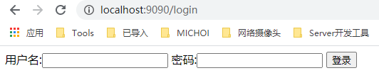
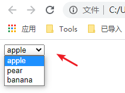
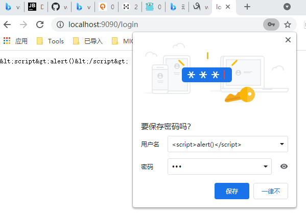
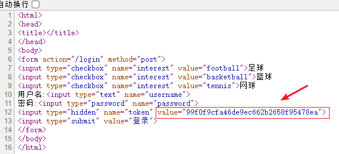

**表单**是我们平常编写 Web 应用常用的工具，通过表单我们可以方便的**让客户端和服务器进行数据的交互**。对于以前开发过 Web 的用户来说表单都非常熟悉，但是对于 C/C++ 程序员来说，这可能是一个有些陌生的东西，那么什么是表单呢？

**表单是一个包含表单元素的区域**。**表单元素**是允许用户在表单中（比如：文本域、下拉列表、单选框、复选框等等）**输入信息**的元素。

表单使用**表单标签**（\<form>）定义。

~~~html
<form>
...
input 元素
...
</form>
~~~

Go 里面对于 form 处理已经有很方便的方法了，在 Request 里面的有专门的 form 处理，可以很方便的整合到 Web 开发里面来。

# 1 处理表单的输入

先来看一个表单递交的例子，我们有如下的表单内容，命名成文件 `login.gtpl` (放入当前新建项目的目录里面)：

~~~html
<html>
<head>
<title></title>
</head>
<body>
<form action="/login" method="post">
    用户名:<input type="text" name="username">
    密码:<input type="password" name="password">
    <input type="submit" value="登录">
</form>
</body>
</html>
~~~

上面递交表单到服务器的 `/login` 路由，当用户输入信息点击登录之后，会跳转到服务器的路由 `login` 里面，我们首先要**判断这个是什么方式传递过来**，POST 还是 GET 呢？如果是 POST 方法，则对应的就是提交数据到该路由。

http 包里面有一个很简单的方式就可以获取，我们在前面 web 的例子的基础上来看看怎么处理 login 页面的 form 数据：

~~~go
func login(w http.ResponseWriter, r *http.Request) {
	fmt.Println("method:", r.Method) // 获取请求的方法

	if r.Method == "GET" {
		t, _ := template.ParseFiles("login.gtpl")
		t.Execute(w, nil)
	} else {
		err := r.ParseForm() // 解析 url 传递的参数，对于 POST 则解析响应包的主体 request body
		if err != nil {
			log.Fatal("ParseForm:", err)
		}
        // 请求的是登录数据，那么只需登录的逻辑判断
		fmt.Println("username:", r.Form["username"])
		fmt.Println("passwrod:", r.Form["password"])
	}
}
~~~

通过上面的代码我们可以看出获取请求方法是通过 `r.Method` 来完成的，这是个字符串类型的变量，返回 GET, POST, PUT 等 method 信息。

login 函数中我们根据 `r.Method` 来判断是**显示登录界面**还是**处理登录逻辑**。当 GET 方式请求时显示登录界面，其他方式请求时则处理登录逻辑，如查询数据库、验证登录信息等。

默认情况下，Handler 里面是不会自动解析 form 的，必须显式地调用 `r.ParseForm()` 后，你才能对这个表单数据进行操作。

`r.Form` 里面**包含**了**所有请求的参数**，比如 URL 中 query-string、POST 的数据、PUT 的数据，所以当你在 URL 中的 query-string 字段和 POST 冲突时，会保存成一个 slice，里面存储了多个值，Go 官方文档中说在接下来的版本里面将会把 POST、GET 这些数据分离开来。现在我们修改一下 `login.gtpl` 里面 form 的 action 值 http://127.0.0.1:9090/login 修改为 http://127.0.0.1:9090/login?username=astaxie，再次测试，服务器的输出 username 是不是一个 slice。服务器端的输出如下：

~~~go
method: POST
username: [zhangfeng astaxie]
passwrod: [111]
~~~

`request.Form` 是一个 url.Values 类型，里面存储的是对应的类似 `key=value` 的信息，下面展示了可以对 form 数据进行的一些操作：

~~~go
url := url.Values{}
url.Set("name", "Ava")
url.Add("friend", "Jess")
url.Add("friend", "sarah")

fmt.Println(url.Get("friend")) // Jess
fmt.Println(url["friend"]) // [Jess sarah]
~~~

Request 本身也提供了 FormValue () 函数来获取用户提交的参数。如 r.Form ["username"] 也可写成 r.FormValue ("username")。调用 r.FormValue 时会自动调用 r.ParseForm，所以不必提前调用。r.FormValue 只会返回同名参数中的**第一个**，若参数不存在则返回**空字符串**。

~~~go
// FormValue returns the first value for the named component of the query.
// POST and PUT body parameters take precedence over URL query string values.
// FormValue calls ParseMultipartForm and ParseForm if necessary and ignores
// any errors returned by these functions.
// If key is not present, FormValue returns the empty string.
// To access multiple values of the same key, call ParseForm and
// then inspect Request.Form directly.
func (r *Request) FormValue(key string) string {
	if r.Form == nil {
		r.ParseMultipartForm(defaultMaxMemory)
	}
	if vs := r.Form[key]; len(vs) > 0 {
		return vs[0]
	}
	return ""
}
~~~

# 2 验证表单的输入

开发 Web 的一个**原则**就是，**不能信任用户输入的任何信息**，所以验证和过滤用户的输入信息就变得非常重要，我们经常会在微博、新闻中听到某某网站被入侵了，存在什么漏洞，这些大多是因为网站对于用户输入的信息没有做严格的验证引起的，所以为了编写出安全可靠的 Web 程序，验证表单输入的意义重大。

我们平常编写 Web 应用主要有两方面的数据验证，一个是在**页面端**的 js **验证** (目前在这方面有很多的插件库，比如 ValidationJS 插件)，一个是在**服务器端**的**验证**，我们这小节讲解的是如何在服务器端验证。

服务端的验证的逻辑，就是通过 `*http.Request` 提交到后端服务器的变量值做**类型的校验**，以及**根据业务逻辑对值做合理性验证**，包括：必填字段、数字、中文、英文、电子邮件地址、手机号码、下拉菜单、单选按钮、复选框、日期和时间、身份证号码等。

在 Go 中判断输入内容的方式主要有 2 种，分别是采用适合的普通逻辑做判断，或者是**正则表达式**做判断！

## 2.1 必填字段

你想要确保从一个表单元素中得到一个值，例如前面小节里面的用户名，我们如何处理呢？Go 有一个内置函数 `len` 可以**获取字符串的长度**，这样我们就可以通过 len 来获取数据的长度，例如：

~~~go
if len(r.Form["username"][0])==0{
    // 为空的处理
}
~~~

r.Form 对不同类型的表单元素的**留空**有不同的处理， 对于**空文本框**、**空文本区域**以及**文件上传**，元素的值为空值，而如果是**未选中的复选框和单选按钮**，则根本不会在 r.Form 中产生相应条目，如果我们用上面例子中的方式去获取数据时程序就会报错。所以我们需要通过 r.Form.Get() 来获取值，因为如果字段不存在，通过该方式获取的是空值。但是通过 r.Form.Get() 只能获取单个的值，如果是 map 的值，必须通过上面的方式来获取。

## 2.2 数字

你想要确保一个表单输入框中获取的只能是数字，例如，你想通过表单获取某个人的具体年龄是 50 岁还是 10 岁，而不是像 “一把年纪了” 或 “年轻着呢” 这种描述：

如果我们是判断正整数，那么我们先转化成 int 类型，然后进行处理：

~~~go
getint,err := strconv.Atoi(r.Form.Get("age"))
if err != nil{
    // 数字转化出错了，那么可能就不是数字
}

// 接下来就可以判断这个数字的大小范围了
if getint > 100 {
    // 太大了
}
~~~

还有一种方式就是正则匹配的方式：

~~~go
if m, _ := regexp.MatchString("^[0-9]+$", r.Form.Get("age")); !m {
    return false
}
~~~

对于性能要求很高的用户来说，这是一个老生常谈的问题了，他们认为应该尽量避免使用正则表达式，因为**使用正则表达式的速度会比较慢**。但是在目前机器性能那么强劲的情况下，对于这种简单的**正则表达式**效率和**类型转换函数**是没有什么差别的。如果你对正则表达式很熟悉，而且你在其它语言中也在使用它，那么在 Go 里面使用正则表达式将是一个便利的方式。

## 2.3 中文

有时候我们想通过表单元素获取一个用户的中文名字，但是又为了保证获取的是正确的中文，我们需要进行验证，而不是用户随便的一些输入。对于中文我们目前有两种方式来验证，可以使用 unicode 包提供的 `func Is(rangeTab *RangeTable, r rune) bool` 来验证，也可以使用正则方式来验证，这里使用最简单的正则方式，如下代码所示

~~~go
if m, _ := regexp.MatchString("^\\p{Han}+$", r.Form.Get("realname")); !m {
    return false
}
~~~

## 2.4 英文

我们期望通过表单元素获取一个英文值，例如我们想知道一个用户的英文名，应该是 astaxie，而不是 asta 谢。我们可以很简单的通过正则验证数据：

~~~go
if m, _ := regexp.MatchString("^[a-zA-Z]+$", r.Form.Get("engname")); !m {
    return false
}
~~~

## 2.5 电子邮件

你想知道用户输入的一个 Email 地址是否正确，通过如下这个方式可以验证：

~~~go
if m, _ := regexp.MatchString(`^([\w\.\_]{2,10})@(\w{1,})\.([a-z]{2,4})$`, r.Form.Get("email")); !m {
    fmt.Println("no")
} else {
    fmt.Println("yes")
}
~~~

## 2.6 手机号码

你想要判断用户输入的手机号码是否正确，通过正则也可以验证：

~~~go
if m, _ := regexp.MatchString(`^(1[3|4|5|8][0-9]\d{4,8})$`, r.Form.Get("mobile")); !m {
    return false
}
~~~

## 2.7 下拉菜单

如果我们想要判断表单里面 `<select>` 元素生成的下拉菜单中是否有被选中的项目。有些时候黑客可能会伪造这个下拉菜单不存在的值发送给你，那么如何判断这个值是否是我们预设的值呢？

我们的 select 可能是这样的一些元素：

~~~html
<select name="fruit">
<option value="apple">apple</option>
<option value="pear">pear</option>
<option value="banana">banana</option>
</select>
~~~

那么我们可以这样来验证：

~~~go
func login(w http.ResponseWriter, r *http.Request) {
	fmt.Println("method:", r.Method)

	if r.Method == "GET" {
		t, _ := template.ParseFiles("login.gtpl")
		t.Execute(w, nil)
	} else {
		err := r.ParseForm()

        ...

		slice := []string{"apple", "pear", "banana"}
		v := r.Form.Get("fruit")
		for _, item := range slice {
			if v == item {
				fmt.Println("Shoot!")
			}
		}
	}
}
~~~

## 2.8 单选按钮

如果我们想要判断 radio 按钮是否有一个被选中了，我们页面的输出可能就是一个男、女性别的选择，但是也可能一个 15 岁大的无聊小孩，一手拿着 http 协议的书，另一只手通过 telnet 客户端向你的程序在发送请求呢，你设定的性别男值是 1，女是 2，他给你发送一个 3，你的程序会出现异常吗？因此我们也需要像下拉菜单的判断方式类似，判断我们获取的值是我们预设的值，而不是额外的值。

~~~html
<input type="radio" name="gender" value="1">男
<input type="radio" name="gender" value="2">女
~~~

那我们也可以类似下拉菜单的做法一样：

~~~go
slice:=[]string{"1","2"}

for _, v := range slice {
    if v == r.Form.Get("gender") {
        return true
    }
}
return false
~~~

## 2.9 复选框

有一项选择兴趣的复选框，你想确定用户选中的和你提供给用户选择的是同一个类型的数据：

~~~go
<input type="checkbox" name="interest" value="football">足球
<input type="checkbox" name="interest" value="basketball">篮球
<input type="checkbox" name="interest" value="tennis">网球
~~~

对于复选框我们的验证和单选有点不一样，因为接收到的数据是一个 slice：

~~~go
slice:=[]string{"football","basketball","tennis"}
a:=Slice_diff(r.Form["interest"],slice)
if a == nil{
    return true
}

return false
~~~

上面这个函数 `Slice_diff` 包含在[开源库](https://github.com/astaxie/beeku)里面 (操作 slice 和 map 的库)。

## 2.10 日期和时间

你想确定用户填写的日期或时间是否有效。例如：用户在日程表中安排 8 月份的第 45 天开会，或者提供未来的某个时间作为生日。

Go 里面提供了一个 time 的处理包，我们可以把用户的输入年月日转化成相应的时间，然后进行逻辑判断：

~~~go
t := time.Date(2009, time.November, 10, 23, 0, 0, 0, time.Local)
fmt.Printf("Go launched at %s\n", t.Local())
~~~

获取 time 之后我们就可以进行很多时间函数的操作。具体的判断就根据自己的需求调整。

## 2.11 身份证号码

如果我们想验证表单输入的是否是身份证，通过正则也可以方便的验证，但是身份证有 15 位和 18 位，我们两个都需要验证：

~~~go
// 验证 15 位身份证，15 位的是全部数字
if m, _ := regexp.MatchString(`^(\d{15})$`, r.Form.Get("usercard")); !m {
    return false
}

// 验证 18 位身份证，18 位前 17 位为数字，最后一位是校验位，可能为数字或字符 X。
if m, _ := regexp.MatchString(`^(\d{17})([0-9]|X)$`, r.Form.Get("usercard")); !m {
    return false
}
~~~

上面列出了我们一些常用的服务器端的**表单元素验证**，希望通过这个引导入门，能够让你对 Go 的数据验证有所了解，特别是 Go 里面的正则处理。

# 3 预防跨站脚本

现在的网站包含大量的**动态内容**以提高用户体验，比过去要复杂得多。所谓**动态内容，就是根据用户环境和需要，Web 应用程序能够输出相应的内容**。动态站点会受到一种名为 “跨站脚本攻击”（Cross Site Scripting, 安全专家们通常将其缩写成 XSS）的威胁，而静态站点则完全不受其影响。

> XSS 的重点不在于跨站点，而在于脚本的执行。那么 XSS 的原理是：**恶意攻击者在 web 页面中会插入一些恶意的 script 代码**。当用户浏览该页面的时候，那么嵌入到 web 页面中script代码会执行，因此会达到恶意攻击用户的目的。那么 XSS 攻击最主要有如下分类：反射型、存储型、及 `DOM-based` 型。 反射性和 `DOM-baseed` 型可以归类为非持久性XSS攻击。存储型可以归类为持久性XSS攻击。
>
> 问题在于攻击者是如何插入恶意的 script 代码的？
>
> * **反射型**：攻击者通过电子邮件等方式将包含注入脚本的恶意链接发送给受害者，当受害者点击该链接的时候，注入脚本被传输到目标服务器上，然后服务器将注入脚本 "反射"到受害者的浏览器上，从而浏览器就执行了该脚本。常见的反射型 XSS 是**恶意链接**。
> * **存储型**：主要是将恶意代码上传或存储到服务器中，下次只要受害者浏览包含此恶意代码的页面就会执行恶意代码。比如我现在做了一个博客网站，然后攻击者在上面发布了一篇文章，内容是如下：`` 如果我没有对该文章进行任何处理的话，直接存入到数据库中，那么下一次当其他用户访问该文章的时候，服务器会从数据库中读取后然后响应给客户端，那么浏览器就会执行这段脚本，然后攻击者就会获取到用户的cookie，然后会把cookie发送到攻击者的服务器上了。

攻击者通常会在**有漏洞的程序**中插入 JavaScript、VBScript、 ActiveX 或 Flash 以欺骗用户。一旦得手，他们可以盗取用户帐户信息，修改用户设置，盗取 / 污染 cookie 和植入恶意广告等。

对 XSS 最佳的防护应该结合以下两种方法：一是**验证所有输入数据**，有效检测攻击 (这个我们前面小节已经有过介绍)；另一个是**对所有输出数据进行适当的处理**，以防止任何已成功注入的脚本在浏览器端运行。

那么 Go 里面是怎么做这个**有效防护**的呢？Go 的 html/template 里面带有下面几个函数可以帮你转义：

* `func HTMLEscape (w io.Writer, b [] byte)` // 把 b 进行**转义**之后写到 w
* `func HTMLEscapeString (s string) string` // **转义** s 之后返回结果字符串
* `func HTMLEscaper (args ...interface {}) string` // 支持多个参数一起**转义**，返回结果字符串

将原先的示例程序做如下修改：

~~~go
func login(w http.ResponseWriter, r *http.Request) {
	fmt.Println("method:", r.Method)

	if r.Method == "GET" {
		t, _ := template.ParseFiles("login.gtpl")
		t.Execute(w, nil)
	} else {
		err := r.ParseForm()
		if err != nil {
			log.Fatal("ParseForm:", err)
		}
		fmt.Println("username:", template.HTMLEscapeString(r.Form.Get("username")))
		fmt.Println("passwrod:", template.HTMLEscapeString(r.Form.Get("password")))

		template.HTMLEscape(w, []byte(r.Form.Get("username")))
	}
}
~~~

如果我们输入的 username 是 ``, 那么我们可以在浏览器上面看到输出如下所示：

也就是得到了如下的**转义信息**：`&lt;script&gt;alert()&lt;/script&gt;`

Go 的 html/template 包默认帮你**过滤了 html 标签**，但是有时候你只想要输出这个 `` 看起来正常的信息，该怎么处理？请使用 text/template。请看下面的例子：

~~~go
func login(w http.ResponseWriter, r *http.Request) {
	fmt.Println("method:", r.Method)

	if r.Method == "GET" {
		t, _ := template.ParseFiles("login.gtpl")
		t.Execute(w, nil)
	} else {
		err := r.ParseForm()
		if err != nil {
			log.Fatal("ParseForm:", err)
		}
		fmt.Println("username:", template.HTMLEscapeString(r.Form.Get("username")))
		fmt.Println("passwrod:", template.HTMLEscapeString(r.Form.Get("password")))

		t, err := template.New("foo").Parse(`{{define "T"}}Hello, {{.}}!{{end}}`)
		err = t.ExecuteTemplate(w, "T", "")
		// Hello, !
	}
}
~~~

输出的结果就是 `Hello, !`，也就是其结果**不会再被转义**。

上面表述的意思就是说：

1. Go 的 html/template 包可以用来**转义**用户的输入信息，比如将 `` 转义成：`&lt;script&gt;alert()&lt;/script&gt;`
2. 当然，还可以按照指定的 template 输出文本，这就是 `text/template` 的作用。

# 4 防止多次递交表单

不知道你是否曾经看到过一个论坛或者博客，在一个帖子或者文章后面出现多条重复的记录，这些大多数是因为用户重复递交了留言的表单引起的。由于种种原因，用户经常会重复递交表单。通常这只是**鼠标的误操作**，如**双击了递交按钮**，也可能是为了编辑或者再次核对填写过的信息，点击了浏览器的后退按钮，然后又再次点击了递交按钮而不是浏览器的前进按钮。当然，也可能是**故意的** —— 比如，**在某项在线调查或者博彩活动中重复投票**。那我们**如何有效的防止用户多次递交相同的表单呢？**

解决方案是在表单中添加一个带有**唯一值的隐藏字段**。在验证表单时，先检查带有该唯一值的表单是否已经递交过了。如果是，拒绝再次递交；如果不是，则处理表单进行逻辑处理。另外，如果是采用了 Ajax 模式递交表单的话，当表单递交后，通过 `javascript` 来禁用表单的递交按钮。

~~~html
<input type="checkbox" name="interest" value="football">足球
<input type="checkbox" name="interest" value="basketball">篮球
<input type="checkbox" name="interest" value="tennis">网球    
用户名:<input type="text" name="username">
密码:<input type="password" name="password">
<input type="hidden" name="token" value="{{.}}">
<input type="submit" value="登录">
~~~

我们在模版里面增加了一个隐藏字段 token，这个值我们通过 MD5 (时间戳) 来获取唯一值，然后我们**把这个值存储到服务器端** (session 来控制，我们将在第六章讲解如何保存)，以方便**表单提交时比对判定**。

~~~go
var allToken map[string]bool = map[string]bool{}

func login(w http.ResponseWriter, r *http.Request) {
	fmt.Println("method:", r.Method)

	if r.Method == "GET" {
		curtime := time.Now().Unix()
		h := md5.New()
		io.WriteString(h, strconv.FormatInt(curtime, 10))
		token := fmt.Sprintf("%x", h.Sum(nil))

		t, _ := template.ParseFiles("login.gtpl")
		t.Execute(w, token)

		// 服务端保存 token，为POST时做校验
		allToken[token] = false
	} else {
		err := r.ParseForm()
		if err != nil {
			log.Fatal("ParseForm:", err)
		}

		token := r.Form.Get("token")
		if token != "" {
			// 验证 Token 的合法性
			if value, exists := allToken[token]; !exists {
				fmt.Println("非法Token!")
			} else {
				if value {
					fmt.Println("已经提交！不能重复提交")
				} else {
					allToken[token] = true

					fmt.Println("username:", template.HTMLEscapeString(r.Form.Get("username")))
					fmt.Println("passwrod:", template.HTMLEscapeString(r.Form.Get("password")))

					t, _ := template.New("foo").Parse(`{{define "T"}}Hello, {{.}}!{{end}}`)
					err = t.ExecuteTemplate(w, "T", "")
					// Hello, !
				}
			}
		} else {
			// 不存在 Token 报错
			panic(errors.New("Token is nil!"))
		}
	}
}
~~~

在 GET 请求返回给 Client 的 HTML 页面中，已经带有了 token 信息：

这个值就是通过 `t.Execute(w, token)` 写到 Client 端的页面上的！

我们看到 token 已经有输出值，你可以不断的刷新，可以看到这个值在不断的变化。这样就保证了每次显示 form 表单的时候都是唯一的，用户递交的表单保持了唯一性。

我们的解决方案可以防止非恶意的攻击，并能使恶意用户暂时不知所措，然后，它却不能排除所有的欺骗性的动机，对此类情况还需要更复杂的工作。

# 5 处理文件上传

你想处理一个由用户上传的文件，比如你正在建设一个类似 Instagram 的网站，你需要存储用户拍摄的照片。这种需求该如何实现呢？

要使表单能够上传文件，首先第一步就是要添加 form 的 `enctype` 属性，`enctype` 属性有如下三种情况：

~~~html
application/x-www-form-urlencoded   表示在发送前编码所有字符（默认）
multipart/form-data   不对字符编码。在使用包含文件上传控件的表单时，必须使用该值。
text/plain    空格转换为 "+" 加号，但不对特殊字符编码。
~~~

新创建的 form 表单文件，命名为 upload.gtpl：s

在服务器端，增加 handlerFunc：

~~~go
func upload(w http.ResponseWriter, r *http.Request) {
	if r.Method == "GET" {
		curtime := time.Now().Unix()
		h := md5.New()
		io.WriteString(h, strconv.FormatInt(curtime, 10))
		token := fmt.Sprintf("%x", h.Sum(nil))

		t, _ := template.ParseFiles("upload.gtpl")
		t.Execute(w, token)
	} else {
		r.ParseMultipartForm(32 << 20)
		// 32MB
		fmt.Printf("maxMemory size:%d(字节).\n", 32<<20)

		file, handler, err := r.FormFile("uploadfile")
		if err != nil {
			fmt.Println(err)
			return
		}
		defer file.Close()

		fmt.Fprintf(w, "%v", handler.Header)
        // 假设 ./uploadfiles/ 目录已存在
		f, err := os.OpenFile("./uploadfiles/"+handler.Filename, os.O_WRONLY|os.O_CREATE, 0666)
		if err != nil {
			fmt.Println(err)
			return
		}
		defer f.Close()

		io.Copy(f, file)
	}
}
~~~

通过上面的代码可以看到，处理文件上传我们需要调用 `r.ParseMultipartForm`，里面的参数表示 maxMemory，调用 `ParseMultipartForm` 之后，上传的文件存储在 `maxMemory` 大小的内存里面，如果文件大小超过了 maxMemory，那么剩下的部分将存储在系统的临时文件中。我们可以通过 r.FormFile 获取上面的文件句柄，然后实例中使用了 io.Copy 来存储文件。上述代码设置的 maxMemory 值为 32MB，也就是将 Client 上传的文件存放在 32MB 的内存空间中。

获取其他非文件字段信息的时候就不需要调用 `r.ParseForm`，因为在需要的时候 Go 自动会去调用。而且 `ParseMultipartForm` 调用一次之后，后面再次调用不会再有效果。

通过上面的实例我们可以看到我们上传文件主要三步处理：

1. 表单中增加 enctype="multipart/form-data"；
2. 服务端调用 r.ParseMultipartForm, 把上传的文件存储在内存和临时文件中；
3. 使用 r.FormFile 获取文件句柄，然后对文件进行存储等处理。

文件 handler 是 multipart.FileHeader, 里面存储了如下结构信息：

~~~go
// A FileHeader describes a file part of a multipart request.
type FileHeader struct {
	Filename string
	Header   textproto.MIMEHeader
	Size     int64

	content []byte
	tmpfile string
}

// A MIMEHeader represents a MIME-style header mapping
// keys to sets of values.
type MIMEHeader map[string][]string
~~~

我们通过上面的实例代码打印出来上传文件的信息如下：

~~~go
map[Content-Disposition:[form-data; name="uploadfile"; filename="test.sh"] Content-Type:[text/x-sh]]
~~~

我们上面的例子演示了如何通过表单上传文件，然后在服务器端处理文件，其实 **Go 支持模拟客户端表单功能支持文件上传**，详细用法请看如下示例：

~~~go
package main

import (
	"bytes"
	"fmt"
	"io"
	"io/ioutil"
	"mime/multipart"
	"net/http"
	"os"
)

func main() {
	target_url := "http://localhost:9090/upload"
	filename := "./YoudaoDictSetup.exe"
	postFile(filename, target_url)
}

func postFile(filename string, targetUrl string) error {
	bodyBuf := &bytes.Buffer{}
	bodyWriter := multipart.NewWriter(bodyBuf)

	fileWriter, err := bodyWriter.CreateFormFile("uploadfile", filename)
	if err != nil {
		fmt.Println("error writing to buffer!")
		return err
	}

	fh, err := os.Open(filename)
	if err != nil {
		fmt.Println("error open file!")
		return err
	}
	defer fh.Close()

	_, err = io.Copy(fileWriter, fh)
	if err != nil {
		fmt.Println("error io.Copy!")
		return err
	}

	contentType := bodyWriter.FormDataContentType()
	bodyWriter.Close()

	resp, err := http.Post(targetUrl, contentType, bodyBuf)
	if err != nil {
		fmt.Println("http.Post error!")
		return err
	}
	defer resp.Body.Close()

	respBody, err := ioutil.ReadAll(resp.Body)
	if err != nil {
		return err
	}

	fmt.Println(resp.Status, string(respBody))
	return nil
}
~~~

`./YoudaoDictSetup.exe` 保存在当前程序的根目录下，服务端返回的内容：

~~~go
200 OK map[Content-Disposition:[form-data; name="uploadfile"; filename="./YoudaoDictSetup.exe"] Content-Type:[application/octet-stream]]
~~~

上面的例子详细展示了**客户端如何向服务器上传一个文件**的例子，客户端通过 multipart.Writer 把文件的文本流写入一个缓存中，然后调用 http 的 Post 方法把缓存传到服务器。

# 6 小结

这一章里面我们学习了 Go 如何处理表单信息，我们通过用户登录、上传文件的例子展示了 Go 处理 form 表单信息及上传文件的手段。但是在处理表单过程中我们需要验证用户输入的信息，考虑到网站安全的重要性，数据过滤就显得相当重要了，因此后面的章节中专门写了一个小节来讲解了不同方面的数据过滤，顺带讲一下 Go 对字符串的**正则处理**。

通过这一章能够让你了解**客户端和服务器端是如何进行数据上的交互**：

* 客户端将数据传递给服务器系统，其中客户端分为不同类型：浏览器、移动端 App、Go 语言写的客户端等，但基本逻辑是一致的；
* 服务器接收数据，同时又把处理结果反馈给客户端。

