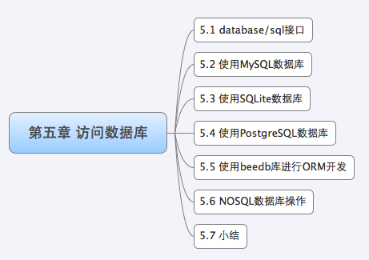
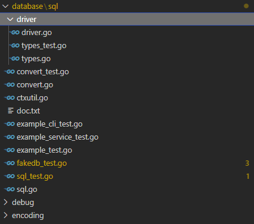
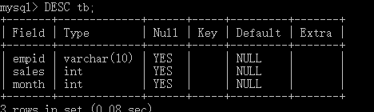

对许多 Web 应用程序而言，**数据库都是其核心所在**。数据库几乎可以用来存储你想查询和修改的任何信息，比如用户信息、产品目录或者新闻列表等。

Go 没有内置的驱动支持任何的数据库，但是 Go 定义了 `database/sql` 接口，**用户可以基于驱动接口开发相应数据库的驱动**，5.1 小节里面介绍 Go 设计的一些驱动，介绍 Go 是如何设计数据库驱动接口的。5.2 至 5.4 小节介绍目前使用的比较多的一些关系型数据驱动以及如何使用，5.5 小节介绍我自己开发一个 ORM 库，基于 `database/sql` 标准接口开发的，可以兼容几乎所有支持 `database/sql` 的数据库驱动，可以方便的使用 Go style 来进行数据库操作。

目前 NOSQL 已经成为 Web 开发的一个潮流，很多应用采用了 NOSQL 作为数据库，而不是以前的缓存，5.6 小节将介绍 MongoDB 和 Redis 两种 NOSQL 数据库。

关于数据库操作相关文档和工具：

1. 详细关于 Go 数据库操作的范式，参考 [Go Database/SQL Tutorial](http://go-database-sql.org/overview.html)
2. [SQLite Administrator](http://sqliteadmin.orbmu2k.de/)

# 1 `database/sql` 接口

`database/sql` 包必须和 SQL 驱动程序一起使用！

Go 设计的 `database/sql` 接口，**用户可根据这些接口设计自己的数据库驱动程序**。比如：MySQL 数据库驱动、SQLite 数据库驱动、PostgreSQL 数据库驱动、NoSQL 数据库驱动。

Go 与 PHP 不同的地方是 Go 官方没有提供数据库驱动，而是**为开发数据库驱动定义了一些标准接口**，开发者可以根据定义的接口来开发相应的数据库驱动，这样做有一个好处，**只要是按照标准接口开发的代码， 以后需要迁移数据库时，不需要任何修改**。那么 Go 都定义了哪些标准接口呢？让我们来详细的分析一下。

> Go 相关的数据库驱动是什么实现的，和 Go 语言提供的 `database/sql` 接口之间是什么关系？

database/sql 是 database/sql/driver 包中定义接口的更高阶的使用方法，也就是 database/sql/driver 是基础接口！

## 1.1 sql.Register

这个存在于 database/sql 的函数是用来注册数据库驱动的，当第三方开发者开发数据库驱动时，都会实现 init 函数，在 init 里面会调用这个 Register(name string, driver driver.Driver) 完成本驱动的注册。

我们来看一下 mymysql、sqlite3 的**驱动**里面都是怎么调用的：

~~~go
// https://github.com/mattn/go-sqlite3 驱动
func init() {
    sql.Register("sqlite3", &SQLiteDriver{})
}

// https://github.com/mikespook/mymysql 驱动
// Driver automatically registered in database/sql
var d = Driver{proto: "tcp", raddr: "127.0.0.1:3306"}
func init() {
    Register("SET NAMES utf8")
    sql.Register("mymysql", &d)
}
~~~

我们看到第三方数据库驱动都是通过调用这个函数来注册自己的数据库驱动名称以及相应的 driver 实现。在 database/sql 内部通过一个 map 来存储用户定义的相应驱动：

~~~go
var (
	driversMu sync.RWMutex
	drivers   = make(map[string]driver.Driver)
)

// Register makes a database driver available by the provided name.
// If Register is called twice with the same name or if driver is nil,
// it panics.
func Register(name string, driver driver.Driver) {
	driversMu.Lock()
	defer driversMu.Unlock()
	if driver == nil {
		panic("sql: Register driver is nil")
	}
	if _, dup := drivers[name]; dup {
		panic("sql: Register called twice for driver " + name)
	}
	drivers[name] = driver
}
~~~

因此通过 database/sql 的注册函数可以同时注册多个数据库驱动，只要不重复。

在我们使用 database/sql 接口和第三方库的时候经常看到如下：

~~~go
import (
    "database/sql"
    _ "github.com/mattn/go-sqlite3"
)
~~~

新手都会被这个 _ 所迷惑，其实这个就是 Go 设计的巧妙之处，我们在变量赋值的时候经常看到这个符号，它是用来忽略变量赋值的占位符，那么包引入用到这个符号也是相似的作用，这儿使用 _ 的意思是引入后面的包名而不直接使用这个包中定义的函数，变量等资源。

我们在 2.3 节流程和函数一节中介绍过 init 函数的初始化过程，包在引入的时候会自动调用包的 init 函数以完成对包的初始化。因此，我们引入上面的数据库驱动包之后会自动去调用 init 函数，然后在 init 函数里面注册这个数据库驱动，这样我们就可以在接下来的代码中直接使用这个数据库驱动了。

## 1.2 driver.Driver

Driver 是一个**数据库驱动的接口**，方法返回的是一个数据库的 Conn 接口：

~~~go
// Driver is the interface that must be implemented by a database
// driver.
//
// Database drivers may implement DriverContext for access
// to contexts and to parse the name only once for a pool of connections,
// instead of once per connection.
type Driver interface {
	// Open returns a new connection to the database.
	// The name is a string in a driver-specific format.
	//
	// Open may return a cached connection (one previously
	// closed), but doing so is unnecessary; the sql package
	// maintains a pool of idle connections for efficient re-use.
	//
	// The returned connection is only used by one goroutine at a
	// time.
	Open(name string) (Conn, error)
}
~~~

返回的 Conn 只能用来进行一次 goroutine 的操作，也就是说不能把这个 Conn 应用于 Go 的多个 goroutine 里面。如下代码会出现错误：

~~~go
...
go goroutineA (Conn)  // 执行查询操作
go goroutineB (Conn)  // 执行插入操作
...
~~~

> The returned connection is only used by one goroutine at a time. 是不支持并发吗？还是有什么其他意思？
>
> 对于 `driver.Conn` 最佳实践是什么？

上面这样的代码可能会使 Go 不知道某个操作究竟是由哪个 goroutine 发起的，从而导致数据混乱，比如可能会把 `goroutineA` 里面执行的查询操作的结果返回给 `goroutineB` 从而使 B 错误地把此结果当成自己执行的插入数据。

第三方驱动都会定义这个函数，它会解析 name 参数来获取相关数据库的连接信息，解析完成后，它将使用此信息来初始化一个 Conn 并返回它。

## 1.3 driver.Conn

Conn 是一个数据库连接的接口定义，他定义了一系列方法，这个 Conn 只能应用在**一个 goroutine 里面**，不能使用在多个 goroutine 里面，详情请参考上面的说明。

~~~go
// Conn is a connection to a database. It is not used concurrently
// by multiple goroutines.
//
// Conn is assumed to be stateful.
type Conn interface {
	// Prepare returns a prepared statement, bound to this connection.
	Prepare(query string) (Stmt, error)

	// Close invalidates and potentially stops any current
	// prepared statements and transactions, marking this
	// connection as no longer in use.
	//
	// Because the sql package maintains a free pool of
	// connections and only calls Close when there's a surplus of
	// idle connections, it shouldn't be necessary for drivers to
	// do their own connection caching.
	//
	// Drivers must ensure all network calls made by Close
	// do not block indefinitely (e.g. apply a timeout).
	Close() error

	// Begin starts and returns a new transaction.
	//
	// Deprecated: Drivers should implement ConnBeginTx instead (or additionally).
	Begin() (Tx, error)
}
~~~

1. Prepare 函数返回与当前连接相关的执行 Sql 语句的准备状态，可以进行查询、删除等操作。
2. Close 函数关闭当前的连接，执行释放连接拥有的资源等清理工作。因为**驱动实现**了 database/sql 里面建议的 conn pool，所以你不用再去实现缓存 conn 之类的，这样会容易引起问题。
3. Begin 函数返回一个代表事务处理的 Tx，通过它你可以进行查询，更新等操作，或者对事务进行回滚、递交。

## 1.4 driver.Stmt

Stmt 是一种准备好的状态，**和 Conn 相关联**，而且只能应用于一个 goroutine 中，不能应用于多个 goroutine：

~~~go
// Stmt is a prepared statement. It is bound to a Conn and not
// used by multiple goroutines concurrently.
type Stmt interface {
	// Close closes the statement.
	//
	// As of Go 1.1, a Stmt will not be closed if it's in use
	// by any queries.
	//
	// Drivers must ensure all network calls made by Close
	// do not block indefinitely (e.g. apply a timeout).
	Close() error

	// NumInput returns the number of placeholder parameters.
	//
	// If NumInput returns >= 0, the sql package will sanity check
	// argument counts from callers and return errors to the caller
	// before the statement's Exec or Query methods are called.
	//
	// NumInput may also return -1, if the driver doesn't know
	// its number of placeholders. In that case, the sql package
	// will not sanity check Exec or Query argument counts.
	NumInput() int

	// Exec executes a query that doesn't return rows, such
	// as an INSERT or UPDATE.
	//
	// Deprecated: Drivers should implement StmtExecContext instead (or additionally).
	Exec(args []Value) (Result, error)

	// Query executes a query that may return rows, such as a
	// SELECT.
	//
	// Deprecated: Drivers should implement StmtQueryContext instead (or additionally).
	Query(args []Value) (Rows, error)
}
~~~

1. Close 函数关闭当前的链接状态，但是如果当前正在执行 query，query 还是有效返回 rows 数据；
2. NumInput 函数返回当前预留参数的个数，当返回 >=0 时数据库驱动就会智能检查调用者的参数。当数据库驱动包不知道预留参数的时候，返回 -1；
3. Exec 函数执行 Prepare 准备好的 sql，传入参数执行 update/insert 等操作，返回 Result 数据；
4. Query 函数执行 Prepare 准备好的 sql，传入需要的参数执行 select 操作，返回 Rows 结果集。

## 1.5 driver.Tx

事务处理一般就两个过程，**递交**或者**回滚**。数据库驱动里面也只需要实现这两个函数就可以：

~~~go
// Tx is a transaction.
type Tx interface {
	Commit() error
	Rollback() error
}
~~~

这两个函数一个用来递交一个事务，一个用来回滚事务。

## 1.6 driver.Execer

driver.Execer 是一个 Conn 可选择实现的接口：

~~~go
// Execer is an optional interface that may be implemented by a Conn.
//
// If a Conn implements neither ExecerContext nor Execer,
// the sql package's DB.Exec will first prepare a query, execute the statement,
// and then close the statement.
//
// Exec may return ErrSkip.
//
// Deprecated: Drivers should implement ExecerContext instead.
type Execer interface {
	Exec(query string, args []Value) (Result, error)
}
~~~

如果这个接口没有定义，那么在调用 `DB.Exec`，就会首先调用 Prepare 返回 Stmt，然后执行 Stmt 的 Exec，然后关闭 Stmt。

## 1.7 driver.Result

这个是执行 Update/Insert 等操作返回的结果接口定义：

~~~go
// Result is the result of a query execution.
type Result interface {
	// LastInsertId returns the database's auto-generated ID
	// after, for example, an INSERT into a table with primary
	// key.
	LastInsertId() (int64, error)

	// RowsAffected returns the number of rows affected by the
	// query.
	RowsAffected() (int64, error)
}
~~~

1. `LastInsertId` 函数返回由数据库执行插入操作得到的自增 ID 号。
2. `RowsAffected` 函数返回 query 操作影响的数据条目数。

## 1.8 driver.Rows

Rows 是执行查询返回的结果集接口定义：

~~~go
// Rows is an iterator over an executed query's results.
type Rows interface {
	// Columns returns the names of the columns. The number of
	// columns of the result is inferred from the length of the
	// slice. If a particular column name isn't known, an empty
	// string should be returned for that entry.
	Columns() []string

	// Close closes the rows iterator.
	Close() error

	// Next is called to populate the next row of data into
	// the provided slice. The provided slice will be the same
	// size as the Columns() are wide.
	//
	// Next should return io.EOF when there are no more rows.
	//
	// The dest should not be written to outside of Next. Care
	// should be taken when closing Rows not to modify
	// a buffer held in dest.
	Next(dest []Value) error
}
~~~

1. Columns 函数返回查询数据库表的字段信息，这个返回的 slice 和 sql 查询的字段一一对应，而不是返回整个表的所有字段。
2. Close 函数用来关闭 Rows **迭代器**。
3. Next 函数用来返回下一条数据，把数据赋值给 dest。dest 里面的元素必须是 `driver.Value` 的值除了 string，返回的数据里面所有的 string 都必须要转换成 [] byte。如果最后没数据了，Next 函数最后返回 `io.EOF`

## 1.9 driver.RowsAffected

RowsAffected 其实就是一个 int64 的别名，但是他实现了 Result 接口，用来底层实现 Result 的表示方式：

~~~go
// RowsAffected implements Result for an INSERT or UPDATE operation
// which mutates a number of rows.
type RowsAffected int64

func (RowsAffected) LastInsertId() (int64, error) {
	return 0, errors.New("LastInsertId is not supported by this driver")
}

func (v RowsAffected) RowsAffected() (int64, error) {
	return int64(v), nil
}
~~~

## 1.10 driver.Value

Value 其实就是一个空接口，他可以容纳任何的数据。drive 的 Value 是驱动必须能够操作的 Value，Value 要么是 nil，要么是下面的任意一种：

~~~go
// Value is a value that drivers must be able to handle.
// It is either nil, a type handled by a database driver's NamedValueChecker
// interface, or an instance of one of these types:
//
//   int64
//   float64
//   bool
//   []byte
//   string
//   time.Time
//
// If the driver supports cursors, a returned Value may also implement the Rows interface
// in this package. This is used, for example, when a user selects a cursor
// such as "select cursor(select * from my_table) from dual". If the Rows
// from the select is closed, the cursor Rows will also be closed.
type Value interface{}
~~~

## 1.11 driver.ValueConverter

ValueConverter 接口定义了如何把一个普通的值转化成 `driver.Value` 的接口：

~~~go
// ValueConverter is the interface providing the ConvertValue method.
//
// Various implementations of ValueConverter are provided by the
// driver package to provide consistent implementations of conversions
// between drivers. The ValueConverters have several uses:
//
//  * converting from the Value types as provided by the sql package
//    into a database table's specific column type and making sure it
//    fits, such as making sure a particular int64 fits in a
//    table's uint16 column.
//
//  * converting a value as given from the database into one of the
//    driver Value types.
//
//  * by the sql package, for converting from a driver's Value type
//    to a user's type in a scan.
type ValueConverter interface {
	// ConvertValue converts a value to a driver Value.
	ConvertValue(v interface{}) (Value, error)
}
~~~

在开发的数据库驱动包里面实现这个接口的函数在很多地方会使用到，这个 ValueConverter 有很多好处：

* 转化 `driver.Value` 到数据库表相应的字段，例如 int64 的数据如何转化成数据库表 uint16 字段；
* 把数据库查询结果转化成 `driver.Value` 值；
* 在 scan 函数里面如何把 `driver.Value` 值转化成用户定义的值。

## 1.12 driver.Valuer

Valuer 接口定义了返回一个 `driver.Value` 的方式：

~~~go
// Valuer is the interface providing the Value method.
//
// Types implementing Valuer interface are able to convert
// themselves to a driver Value.
type Valuer interface {
	// Value returns a driver Value.
	// Value must not panic.
	Value() (Value, error)
}
~~~

很多类型都实现了这个 Value 方法，用来自身与 `driver.Value` 的转化。

通过上面的讲解，你应该对于驱动的开发有了一个基本的了解，一个驱动只要实现了这些接口就能完成增删查改等基本操作了，剩下的就是与相应的数据库进行数据交互等细节问题了，在此不再赘述。

## 1.13 database/sql

database/sql 在 database/sql/driver 提供的接口基础上定义了一些**更高阶的方法**，用以简化数据库操作，同时内部还建议性地实现一个 conn pool。

~~~go
// ErrNoRows is returned by Scan when QueryRow doesn't return a
// row. In such a case, QueryRow returns a placeholder *Row value that
// defers this error until a Scan.
var ErrNoRows = errors.New("sql: no rows in result set")

// DB is a database handle representing a pool of zero or more
// underlying connections. It's safe for concurrent use by multiple
// goroutines.
//
// The sql package creates and frees connections automatically; it
// also maintains a free pool of idle connections. If the database has
// a concept of per-connection state, such state can be reliably observed
// within a transaction (Tx) or connection (Conn). Once DB.Begin is called, the
// returned Tx is bound to a single connection. Once Commit or
// Rollback is called on the transaction, that transaction's
// connection is returned to DB's idle connection pool. The pool size
// can be controlled with SetMaxIdleConns.
type DB struct {
	// Atomic access only. At top of struct to prevent mis-alignment
	// on 32-bit platforms. Of type time.Duration.
	waitDuration int64 // Total time waited for new connections.

	connector driver.Connector
	// numClosed is an atomic counter which represents a total number of
	// closed connections. Stmt.openStmt checks it before cleaning closed
	// connections in Stmt.css.
	numClosed uint64

	mu           sync.Mutex // protects following fields
	freeConn     []*driverConn
	connRequests map[uint64]chan connRequest
	nextRequest  uint64 // Next key to use in connRequests.
	numOpen      int    // number of opened and pending open connections
	// Used to signal the need for new connections
	// a goroutine running connectionOpener() reads on this chan and
	// maybeOpenNewConnections sends on the chan (one send per needed connection)
	// It is closed during db.Close(). The close tells the connectionOpener
	// goroutine to exit.
	openerCh          chan struct{}
	closed            bool
	dep               map[finalCloser]depSet
	lastPut           map[*driverConn]string // stacktrace of last conn's put; debug only
	maxIdleCount      int                    // zero means defaultMaxIdleConns; negative means 0
	maxOpen           int                    // <= 0 means unlimited
	maxLifetime       time.Duration          // maximum amount of time a connection may be reused
	maxIdleTime       time.Duration          // maximum amount of time a connection may be idle before being closed
	cleanerCh         chan struct{}
	waitCount         int64 // Total number of connections waited for.
	maxIdleClosed     int64 // Total number of connections closed due to idle count.
	maxIdleTimeClosed int64 // Total number of connections closed due to idle time.
	maxLifetimeClosed int64 // Total number of connections closed due to max connection lifetime limit.

	stop func() // stop cancels the connection opener and the session resetter.
}

// Open opens a database specified by its database driver name and a
// driver-specific data source name, usually consisting of at least a
// database name and connection information.
//
// Most users will open a database via a driver-specific connection
// helper function that returns a *DB. No database drivers are included
// in the Go standard library. See https://golang.org/s/sqldrivers for
// a list of third-party drivers.
//
// Open may just validate its arguments without creating a connection
// to the database. To verify that the data source name is valid, call
// Ping.
//
// The returned DB is safe for concurrent use by multiple goroutines
// and maintains its own pool of idle connections. Thus, the Open
// function should be called just once. It is rarely necessary to
// close a DB.
func Open(driverName, dataSourceName string) (*DB, error) {
	driversMu.RLock()
	driveri, ok := drivers[driverName]
	driversMu.RUnlock()
	if !ok {
		return nil, fmt.Errorf("sql: unknown driver %q (forgotten import?)", driverName)
	}

	if driverCtx, ok := driveri.(driver.DriverContext); ok {
		connector, err := driverCtx.OpenConnector(dataSourceName)
		if err != nil {
			return nil, err
		}
		return OpenDB(connector), nil
	}

	return OpenDB(dsnConnector{dsn: dataSourceName, driver: driveri}), nil
}
~~~

我们可以看到 Open 函数返回的是 DB 对象，里面有一个 freeConn，它就是那个**简易的连接池**。它的实现相当简单或者说简陋，就是当执行 `db.prepare -> db.prepareDC` 的时候会 `defer dc.releaseConn`，然后调用 `db.putConn`，也就是把这个连接放入连接池，每次调用 `db.conn` 的时候会先判断 freeConn 的长度是否大于 0，大于 0 说明有可以复用的 conn，直接拿出来用就是了，如果不大于 0，则创建一个 conn，然后再返回之。

## 1.14 类型映射到 SQL 实体

这些封装的接口、结构体分别代表了什么含义？

#  2 使用 MySQL 数据库

目前 Internet 上流行的网站构架方式是 LAMP，其中的 M 即 MySQL, 作为数据库，MySQL 以免费、开源、使用方便为优势成为了很多 Web 开发的后端数据库存储引擎。

## 2.1 驱动程序

Go 中支持 MySQL 的驱动目前比较多，有如下几种，有些是支持 database/sql 标准，而有些是采用了自己的实现接口，常用的有如下几种：

* `github.com/go-sql-driver/mysql` 支持 database/sql，全部采用 go 写。
* `github.com/ziutek/mymysql` 支持 database/sql，也支持自定义的接口，全部采用 go 写。
* `github.com/Philio/GoMySQL` 不支持 database/sql，自定义接口，全部采用 go 写。

接下来的例子我主要以第一个驱动为例 (我目前项目中也是采用它来驱动)，也推荐大家采用它，主要理由：

* 这个驱动比较新，维护的比较好；
* 完全支持 database/sql 接口；
* 支持 keepalive，保持长连接，虽然 星星 fork 的 mymysql 也支持 keepalive，但不是线程安全的，这个从底层就支持了 keepalive。

## 2.2 示例程序

安装 MySQL 后，做了一系列的测试数据，比如：

~~~go
package main

import (
	"database/sql"
	"fmt"

	_ "github.com/go-sql-driver/mysql"
)

func checkErr(err error) {
	if err != nil {
		panic(err)
	}
}

func main() {
	// DSN 格式：username:password@protocol(address)/dbname?param=value
	db, err := sql.Open("mysql", "root:root@/db1?charset=utf8")
	checkErr(err)

	rows, err := db.Query("SELECT * FROM tb")
	checkErr(err)
	for rows.Next() {
		var empid string
		var sales int
		var month int
		err = rows.Scan(&empid, &sales, &month)
		checkErr(err)
		fmt.Printf("empid:%s, sales:%d, month:%d.\n", empid, sales, month)
	}

	db.Close()
}
~~~

对应安装的 MySQL 驱动程序：

~~~go
PS G:\michoi\Go\go_developer_roadmap\ProgrammingLanguage\Go Web编程\goweb> go run main.go
go: finding module for package github.com/go-sql-driver/mysql
go: downloading github.com/go-sql-driver/mysql v1.6.0
go: found github.com/go-sql-driver/mysql in github.com/go-sql-driver/mysql v1.6.0
~~~

通过上面的代码我们可以看出，Go 操作 MySQL 数据库是很方便的。

关键的几个函数我解释一下：`sql.Open()` 函数用来打开一个注册过的数据库驱动，go-sql-driver 中注册了 MySQL 这个数据库驱动，第二个参数是 DSN (Data Source Name)，它是 go-sql-driver 定义的一些数据库链接和配置信息。它支持如下格式：

~~~go
user@unix(/path/to/socket)/dbname?charset=utf8
user:password@tcp(localhost:5555)/dbname?charset=utf8
user:password@/dbname
user:password@tcp([de:ad:be:ef::ca:fe]:80)/dbname
~~~

`db.Prepare()` 函数用来返回准备要执行的 sql 操作，然后返回准备完毕的执行状态；`stmt.Exec()` 函数用来执行 `stmt` 准备好的 SQL 语句。`db.Query()` 函数用来直接执行 Sql 返回 Rows 结果。

我们可以看到我们传入的参数都是 =? 对应的数据，这样做的方式可以一定程度上防止 SQL 注入。

# 3 使用 SQLite 数据库

SQLite 是一个开源的嵌入式关系数据库，实现**自包容**、**零配置**、**支持事务**的 SQL 数据库**引擎**。其特点是高度便携、使用方便、结构紧凑、高效、可靠。 与其他数据库管理系统不同，SQLite 的安装和运行非常简单，在大多数情况下，只要确保 SQLite 的二进制文件存在即可**开始创建、连接和使用数据库**。如果您正在寻找一个嵌入式数据库项目或解决方案，SQLite 是绝对值得考虑。SQLite 可以是说开源的 Access。

## 3.1 驱动程序

Go 支持 `sqlite` 的驱动也比较多，但是好多都是不支持 database/sql 接口的：

* `github.com/mattn/go-sqlite3` 支持 database/sql 接口，基于 cgo (关于 cgo 的知识请参看官方文档或者本书后面的章节) 写的；
* `github.com/feyeleanor/gosqlite3` 不支持 database/sql 接口，基于 cgo 写的；
* `github.com/phf/go-sqlite3` 不支持 database/sql 接口，基于 cgo 写的。

目前支持 database/sql 的 SQLite 数据库驱动只有第一个，我目前也是采用它来开发项目的。

**在项目开发中，采用 Go 的 sql 标准接口有利于以后出现更好的驱动的时候做迁移**。

## 3.2 示例程序

下面来看看 Go 程序是如何操作数据库表的：

~~~go
package main

import (
	"database/sql"
	"fmt"

	_ "github.com/mattn/go-sqlite3"
)

func main() {
	db, err := sql.Open("sqlite3", "./katyusha.db")
	if err != nil {
		fmt.Println("error:", err)
		return
	}
    ...
}

// Open opens a database specified by its database driver name and a
// driver-specific data source name, usually consisting of at least a
// database name and connection information.
//
// Most users will open a database via a driver-specific connection
// helper function that returns a *DB. No database drivers are included
// in the Go standard library. See https://golang.org/s/sqldrivers for
// a list of third-party drivers.
//
// Open may just validate its arguments without creating a connection
// to the database. To verify that the data source name is valid, call
// Ping.
//
// The returned DB is safe for concurrent use by multiple goroutines
// and maintains its own pool of idle connections. Thus, the Open
// function should be called just once. It is rarely necessary to
// close a DB.
func Open(driverName, dataSourceName string) (*DB, error) {
	driversMu.RLock()
    // 导入 SQLite3 驱动程序时，会调用 Register(name string, driver driver.Driver)，向 drivers 增加 driver.Driver 对象
	driveri, ok := drivers[driverName]
	driversMu.RUnlock()
	if !ok {
		return nil, fmt.Errorf("sql: unknown driver %q (forgotten import?)", driverName)
	}

	if driverCtx, ok := driveri.(driver.DriverContext); ok {
		connector, err := driverCtx.OpenConnector(dataSourceName)
		if err != nil {
			return nil, err
		}
		return OpenDB(connector), nil
	}

	return OpenDB(dsnConnector{dsn: dataSourceName, driver: driveri}), nil
}

// Register makes a database driver available by the provided name.
// If Register is called twice with the same name or if driver is nil,
// it panics.
func Register(name string, driver driver.Driver) {
	driversMu.Lock()
	defer driversMu.Unlock()
	if driver == nil {
		panic("sql: Register driver is nil")
	}
	if _, dup := drivers[name]; dup {
		panic("sql: Register called twice for driver " + name)
	}
	drivers[name] = driver
}
~~~

在导入的驱动项目中，`sqlite3.go` 中定义了如下的方法：

~~~go
...
func init() {
	sql.Register("sqlite3", &SQLiteDriver{})
}

// Version returns SQLite library version information.
func Version() (libVersion string, libVersionNumber int, sourceID string) {
	libVersion = C.GoString(C.sqlite3_libversion())
	libVersionNumber = int(C.sqlite3_libversion_number())
	sourceID = C.GoString(C.sqlite3_sourceid())
	return libVersion, libVersionNumber, sourceID
}
...
~~~

也就是说，在导入 SQLite3 驱动程序时，就为当前应用程序在进程上下文中注册了名为 `sqlite3` 的驱动实例。

在 Go 中使用 SQLite3 的基本步骤：

1. 导入驱动程序；
2. 打开数据库文件，获取 `*sql.DB` 对象；
3. 使用 `*sql.DB` 对象操作数据库中的表。

**查询数据库**指定表的数据：

~~~go
...
rows, err := db.Query("SELECT * FROM COMPANY")
if err != nil {
	fmt.Println("error:", err)
	return
}
// 必须要调用一次 rows.Next() 以便能够调用 rows.Scan 获取到记录
for rows.Next() {
	var id int
	var name string
	var age int
	var address string
	var salary float32
	err = rows.Scan(&id, &name, &age, &address, &salary)
	if err != nil {
		fmt.Println("error:", err)
		return
	}
	fmt.Printf("id:%d, name:%s, age:%d, address:%s, salary:%v.\n", id, name, age, address, salary)
}
...
~~~

**增加**记录：

~~~go
...
stmt, err := db.Prepare("INSERT INTO COMPANY VALUES (?, ?, ?, ?, ?)")
res, err := stmt.Exec(3, "Katyusha", 28, "Shenzhen", 35000.00)
id, err := res.LastInsertId()
fmt.Printf("LastInsertId:%d.\n", id)
...

var lastInsertId int
rows := db.QueryRow("INSERT INTO COMPANY VALUES (?, ?, ?, ?, ?) RETURNING ID;", 3, "Katyusha", 28, "Shenzhen", 35000.00)
rows.Scan(&lastInsertId)
fmt.Printf("LastInsertId:%d.\n", lastInsertId)
~~~

**删除**记录：

~~~go
// DELETE
stmt, err = db.Prepare("DELETE FROM COMPANY WHERE ID = ?")
res, err = stmt.Exec(id)
id, err = res.LastInsertId()
rawsAffected, err = res.RowsAffected()
fmt.Printf("LastInsertId:%d; rawsAffected:%d.\n", id, rawsAffected)
~~~

**修改**记录：

~~~go
// UPDATE
stmt, err = db.Prepare("UPDATE COMPANY SET salary = ? WHERE ID = ?")
res, err = stmt.Exec(50000.0, id)
id, err = res.LastInsertId()
rawsAffected, err := res.RowsAffected()
fmt.Printf("LastInsertId:%d; rawsAffected:%d.\n", id, rawsAffected)
~~~

# 4 使用 PostgreSQL 数据库

PostgreSQL 是一个自由的对象 - 关系数据库服务器 (数据库管理系统)，它在灵活的 BSD - 风格许可证下发行。它提供了相对其他开放源代码数据库系统 (比如 MySQL 和 Firebird)，和对专有系统比如 Oracle、Sybase、IBM 的 DB2 和 Microsoft SQL Server 的一种选择。

PostgreSQL 和 MySQL 比较，它更加庞大一点，因为它是用来**替代 Oracle 而设计的**。所以在企业应用中采用 PostgreSQL 是**一个明智的选择**。

MySQL 被 Oracle 收购之后正在逐步的封闭（自 MySQL 5.5.31 以后的所有版本将不再遵循 GPL 协议），鉴于此，**将来我们也许会选择 PostgreSQL 而不是 MySQL 作为项目的后端数据库**。

## 4.1 驱动程序

Go 实现的支持 PostgreSQL 的驱动也很多，因为国外很多人在开发中使用了这个数据库。

* `github.com/lib/pq` 支持 database/sql 驱动，纯 Go 写的
* `github.com/jbarham/gopgsqldriver` 支持 database/sql 驱动，纯 Go 写的
* `github.com/lxn/go-pgsql` 支持 database/sql 驱动，纯 Go 写的

在下面的示例中我采用了第一个驱动，因为它目前使用的人最多，在 GitHub 上也比较活跃。

## 4.2 示例程序

PostgreSQL 数据库的使用和 MySQL/SQLite 大致类似，但也有细微的差异，注意这些差异部分就行了。

# 5 使用 Beego ORM 库进行 ORM 开发

Beego ORM 是我开发的一个 Go 进行 ORM 操作的库，它采用了 Go style 方式对数据库进行操作，实现了 struct 到数据表记录的映射。Beego ORM 是一个十分轻量级的 Go ORM 框架，开发这个库的本意降低复杂的 ORM 学习曲线，尽可能在 ORM 的运行效率和功能之间寻求一个平衡，Beego ORM 是目前开源的 Go ORM 框架中实现比较完整的一个库，而且运行效率相当不错，功能也基本能满足需求。

Beego ORM 是支持 database/sql 标准接口的 ORM 库，所以理论上来说，只要**数据库驱动**支持 database/sql 接口就可以无缝的接入 Beego ORM。目前我测试过的驱动包括下面几个：

* `Mysql: github/go-mysql-driver/mysql`
* `PostgreSQL: github.com/lib/pq`
* `SQLite: github.com/mattn/go-sqlite3`
* `Mysql: github.com/ziutek/mymysql/godrv`

## 5.1 ORM 和数据库驱动的区别

正如 ORM 的名字表示的含义：Object Rational Mapping，也就是对象关系映射，也就是说，在使用时，直接可以通过面向对象编程的方式实现数据库的 CRUD。

## 5.2 ORM 的使用

当前使用 Beego 的版本是：`downloading github.com/astaxie/beego v1.12.3`

~~~go
package main

import (
	"fmt"

	"github.com/astaxie/beego/orm"
	_ "github.com/mattn/go-sqlite3"
)

type Company struct {
	Id      int
	Name    string
	Age     int
	Address string
	Salary  float32
}

func init() {
	orm.RegisterDriver("sqlite3", orm.DRSqlite)
	orm.RegisterDataBase("default", "sqlite3", "./katyusha.db", 30)
	orm.RegisterModel(new(Company))
}

func main() {
	dbOrm := orm.NewOrm()

	query := dbOrm.QueryTable("company")
	var data []*Company
	query.All(&data)

	for _, company := range data {
		fmt.Printf("#%d: %s, %d, %s, %v.\n", company.Id, company.Name, company.Age, company.Address, company.Salary)
	}
}
~~~

和使用 SQL 相关驱动程序来说，最大的区别在于：直接使用 `QueryTable` 方法就可以获取到 Table 的数据，而不用写 SQL 语句。

# 6 NOSQL 数据库操作

NoSQL (Not Only SQL)，指的是**非关系型的数据库**。随着 Web 2.0 的兴起，传统的关系数据库在应付 Web 2.0 网站，特别是**超大规模和高并发**的 SNS 类型的 Web 2.0 纯动态网站已经显得力不从心，暴露了很多难以克服的问题，而非关系型的数据库则由于其本身的特点得到了非常迅速的发展。

而 Go 语言作为 21 世纪的 C 语言，对 NoSQL 的支持也是很好，目前流行的 NOSQL 主要有 Redis、MongoDB、Cassandra 和 MemBase 等。这些数据库都有**高性能、高并发读写**等特点，目前已经广泛应用于各种应用中。我接下来主要讲解一下 Redis 和 MongoDB 的操作。

## 6.1 Redis

Redis 是一个 key-value 存储系统。和 Memcached 类似，它支持存储的 value 类型相对更多，包括 string (字符串)、list (链表)、set (集合 ) 和 zset (有序集合)。目前应用 Redis 最广泛的应该是新浪微博平台，其次还有 Facebook 收购的图片社交网站 Instagram。以及其他一些有名的互联网企业。

Go 目前支持 Redis 的驱动有如下：

* `github.com/gomodule/redigo (推荐)`
* `github.com/go-redis/redis`
* `github.com/hoisie/redis`
* `github.com/alphazero/Go-Redis`
* `github.com/simonz05/godis`

我以 redigo 驱动为例来演示如何进行数据的操作：

## 6.2 MongoDB

MongoDB 是一个高性能、开源、无模式的**文档型数据库**，是一个介于关系数据库和非关系数据库之间的产品，是非关系数据库当中功能最丰富，最像关系数据库的。MongoDB 支持的数据结构非常松散，采用的是类似 JSON 的 BJSON 格式来存储数据，因此**可以存储比较复杂的数据类型**。Mongo 最大的特点是其支持的查询语言非常强大，其语法有点类似于面向对象的查询语言，几乎可以实现类似关系数据库单表查询的绝大部分功能，而且还支持对数据建立索引。

下图展示了 MySQL 和 MongoDB 之间的对应关系，我们可以看出来非常的方便，但是 MongoDB 的性能非常好：

目前 Go 支持 MongoDB 最好的驱动就是 [mgo](http://labix.org/mgo)，这个驱动目前最有可能成为官方的 pkg。

## 6.3 示例程序

# 7 小结

这一章我们讲解了 Go 如何设计 database/sql 接口，然后介绍了各种第三方关系型数据库驱动的使用。接着介绍了 beedb，一种基于关系型数据库的 ORM 库，如何对数据库进行简单的操作。最后介绍了 NoSQL 的一些知识，目前 Go 对于 NoSQL 支持还是不错，因为 Go 作为 21 世纪的 C 语言，那么对于 21 世纪的数据库也是支持的相当好。

通过这一章的学习，我们学会了如何操作各种数据库，那么就解决了我们数据存储的问题，这是 Web 里面最重要的一部分，所以希望大家能够深入的去了解 database/sql 的设计思想。

