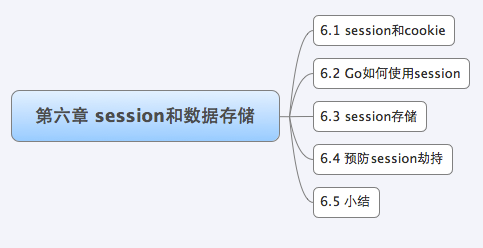
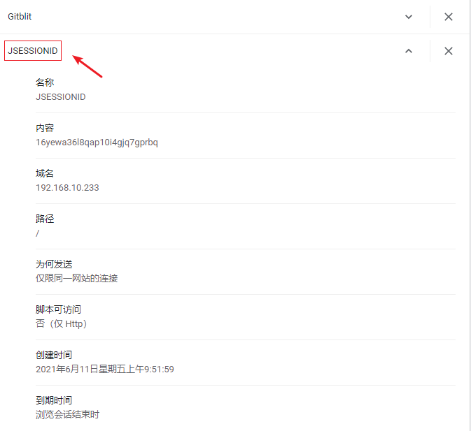
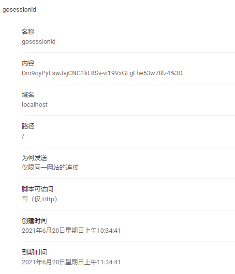

Web 开发中一个很重要的议题就是**如何做好用户的整个浏览过程的控制**，因为 HTTP 协议是无状态的，所以用户的每一次请求都是无状态的，我们不知道在整个 Web 操作过程中**哪些连接与该用户有关**，我们应该如何来解决这个问题呢？Web 里面经典的解决方案是 Cookie 和 Session。

Cookie 机制是一种客户端机制，把用户数据保存在客户端，而 Session 机制是一种服务器端的机制，服务器使用一种类似于**散列表**的结构来保存信息，**每一个网站访客都会被分配给一个唯一的标志符**，即 sessionID，它的存放形式无非两种：要么经过 URL 传递，要么保存在客户端的 Cookies 里。当然，你也可以将 Session 保存到数据库里，这样会更安全，但效率方面会有所下降。

# 1 Session 和 Cookie

Session 和 cookie 是网站浏览中较为常见的两个概念，也是比较难以辨析的两个概念，但它们在浏览需要认证的服务页面以及页面统计中却相当关键。我们先来了解一下 Session 和 cookie 怎么来的？考虑这样一个问题：**如何抓取一个访问受限的网页？**如新浪微博好友的主页，个人微博页面等。

显然，通过浏览器，我们可以手动输入用户名和密码来访问页面，而所谓的 “抓取”，其实就是使用程序来模拟完成同样的工作，因此我们需要**了解 “登陆” 过程中到底发生了什么**。

当用户来到微博登陆页面，输入用户名和密码之后点击 “登录” 后浏览器将**认证信息** POST 给远端的服务器，服务器执行验证逻辑。如果验证通过，则浏览器会跳转到登录用户的微博首页，**在登录成功后，服务器如何验证我们对其他受限制页面的访问呢？**因为 HTTP 协议是无状态的，所以很显然服务器不可能知道我们已经在上一次的 HTTP 请求中通过了验证。当然，最简单的解决方案就是所有的请求里面都带上用户名和密码，这样虽然可行，但大大加重了服务器的负担（对于每个 request 都需要到数据库验证），也大大降低了用户体验 (每个页面都需要重新输入用户名密码，每个页面都带有登录表单)。既然直接在请求中带上用户名与密码不可行，那么就只有在服务器或客户端保存一些类似的**可以代表身份的信息**了，所以就有了 cookie 与 Session。

cookie，简而言之就是在本地计算机保存一些用户操作的历史信息（当然包括登录信息），并在用户再次访问该站点时浏览器通过 HTTP 协议将**本地（Client） cookie 内容**发送给服务器，从而完成**验证**，或继续上一步操作。

**一句话讲述什么是 Cookie？**是某些网站为了辨别用户身份，进行 Session 跟踪而存储在用户本地终端上的数据（通常经过加密），由 Client 暂时或永久保存的信息。比如 Chrome 浏览器的 Cookie 数据存放在：`C:\Users\Developer\AppData\Local\Google\Chrome\User Data\Default` 下，以 SQLite 数据库的形式存储名为：`Cookies`，其中定义了 cookies 表：

~~~sqlite
CREATE TABLE cookies(
creation_utc INTEGER NOT NULL,
host_key TEXT NOT NULL,
name TEXT NOT NULL,
value TEXT NOT NULL,
path TEXT NOT NULL,
expires_utc INTEGER NOT NULL,
is_secure INTEGER NOT NULL,
is_httponly INTEGER NOT NULL,
last_access_utc INTEGER NOT NULL,
has_expires INTEGER NOT NULL DEFAULT 1,
is_persistent INTEGER NOT NULL DEFAULT 1,
priority INTEGER NOT NULL DEFAULT 1,
encrypted_value BLOB DEFAULT '',
samesite INTEGER NOT NULL DEFAULT -1, 
source_scheme INTEGER NOT NULL DEFAULT 0, 
source_port INTEGER NOT NULL DEFAULT -1, 
is_same_party INTEGER NOT NULL DEFAULT 0,
UNIQUE (host_key, name, path));
~~~

Session，简而言之就是**在服务器上保存用户操作的历史信息**。服务器使用 sessionID 来标识 Session，sessionID 由服务器负责产生，保证随机性与唯一性，相当于一个随机密钥，避免在握手或传输中暴露用户真实密码。但该方式下，仍然需要将发送请求的客户端与 Session 进行对应，所以可以借助 cookie 机制来获取客户端的标识（即 sessionID），也可以通过 GET 方式将 sessionID 提交给服务器。

Cookie 是**由浏览器维持的**，存储在**客户端**的**一小段文本信息**，伴随着用户请求和页面在 Web 服务器和浏览器之间传递。用户每次访问站点时，Web 应用程序（Server）都可以读取 cookie 包含的信息。浏览器设置里面有 cookie 隐私数据选项，打开它，可以看到很多已访问网站的 cookies，如下图所示：

cookie 是有时间限制的，根据生命期不同分成两种：会话 cookie 和持久 cookie

* 如果不设置过期时间，则表示这个 cookie 的生命周期为从创建到浏览器关闭为止，只要关闭浏览器窗口，cookie 就消失了。这种生命期为浏览会话期的 cookie 被称为会话 cookie。会话 cookie 一般不保存在硬盘上而是**保存在内存里**。

* 如果设置了过期时间 (`setMaxAge (606024)`)，浏览器就会把 cookie 保存**到硬盘上**，关闭后再次打开浏览器，这些 cookie 依然有效直到超过设定的过期时间。存储在硬盘上的 cookie 可以在不同的浏览器进程间共享，比如两个 IE 窗口。而对于保存在内存的 cookie，不同的浏览器有不同的处理方式。

Go 语言中通过 `net/http` 包中的 `SetCookie` 来设置：

~~~go
// SetCookie adds a Set-Cookie header to the provided ResponseWriter's headers.
// The provided cookie must have a valid Name. Invalid cookies may be
// silently dropped.
func SetCookie(w ResponseWriter, cookie *Cookie) {
	if v := cookie.String(); v != "" {
		w.Header().Add("Set-Cookie", v)
	}
}
~~~

w 表示需要写入的 response，cookie 是一个 struct，让我们来看一下 cookie 对象是怎么样的：

~~~go
// A Cookie represents an HTTP cookie as sent in the Set-Cookie header of an
// HTTP response or the Cookie header of an HTTP request.
//
// See https://tools.ietf.org/html/rfc6265 for details.
type Cookie struct {
	Name  string
	Value string

	Path       string    // optional
	Domain     string    // optional
	Expires    time.Time // optional
	RawExpires string    // for reading cookies only

	// MaxAge=0 means no 'Max-Age' attribute specified.
	// MaxAge<0 means delete cookie now, equivalently 'Max-Age: 0'
	// MaxAge>0 means Max-Age attribute present and given in seconds
	MaxAge   int
	Secure   bool
	HttpOnly bool
	SameSite SameSite
	Raw      string
	Unparsed []string // Raw text of unparsed attribute-value pairs
}
~~~

我们来看一个例子：如何设置 Cookie

~~~go
expiration := time.Now()
expiration = expiration.AddDate(1, 0, 0)
cookie := http.Cookie{
	Name:    "username",
	Value:   "astaxie",
	Expires: expiration,
}
http.SetCookie(w, &cookie)
~~~

上面的例子演示了如何设置 cookie 数据，这里演示一下如何读取 cookie：

~~~go
cookie, _ := request.Cookie("username")
fmt.Fprint(w, cookie)
~~~

Session，中文经常翻译为**会话**，其本来的含义是指**有始有终的一系列动作 / 消息**，比如打电话是从拿起电话拨号到挂断电话这中间的一系列过程可以称之为一个 Session。然而当 Session 一词与网络协议相关联时，它又往往隐含了 **“面向连接” 和 / 或 “保持状态” 这样两个含义**。Session 在 Web 开发环境下的语义又有了新的扩展，它的含义是指一类**用来在客户端与服务器端之间保持状态的解决方案**。有时候 Session 也用来指这种解决方案的存储结构。

Session 机制是一种**服务器端的机制**，服务器使用一种类似于**散列表的结构** (也可能就是使用散列表) 来保存信息。但程序需要为某个客户端的请求创建一个 Session 的时候，服务器首先检查这个客户端的请求里是否包含了一个 Session 标识－称为 sessionID，如果已经包含一个 sessionID 则说明以前已经为此客户创建过 Session，服务器就按照 sessionID 把这个 Session 检索出来使用 (如果检索不到，可能会新建一个，这种情况可能出现在服务端已经删除了该用户对应的 Session 对象，但用户人为地在请求的 URL 后面附加上一个 JSession 的参数)。如果客户请求不包含 sessionID，则为此客户创建一个 Session 并且同时生成一个与此 Session 相关联的 sessionID，这个 sessionID 将在本次响应中返回给客户端保存。

Session 机制本身并不复杂，然而其实现和配置上的灵活性却使得具体情况复杂多变。这也要求我们不能把仅仅某一次的经验或者某一个浏览器，服务器的经验当作普遍适用的。

如上文所述，Session 和 cookie 的目的相同，都是为了克服 http 协议无状态的缺陷，但完成的方法不同。Session 通过 cookie，在客户端保存 sessionID，而将用户的其他会话消息保存在服务端的 Session 对象中，与此相对的，cookie 需要将所有信息都保存在客户端。因此 cookie 存在着一定的安全隐患，例如本地 cookie 中保存的用户名密码被破译，或 cookie 被其他网站收集。

# 2 Go 如何使用 Session

通过上一小节的介绍，我们知道 Session 是在服务器端实现的一种用户和服务器之间认证的解决方案，目前 Go 标准包没有为 Session 提供任何支持，动手来实现 go 版本的 Session **管理和创建**。

## 2.1 Session 创建过程

Session 的基本原理是由服务器**为每个会话维护一份信息数据**，客户端和服务端依靠一个全局唯一的标识来访问这份数据，以达到交互的目的。当用户访问 Web 应用时，服务端程序会**随需要**创建 Session，这个过程可以概括为三个步骤：

* 生成全局唯一标识符（sessionID）；
* 开辟数据存储空间。一般会在内存中创建相应的数据结构，但这种情况下，系统一旦掉电，所有的会话数据就会丢失，如果是电子商务类网站，这将造成严重的后果。所以为了解决这类问题，你可以将**会话数据**写到文件里或存储在数据库中，当然这样会增加 I/O 开销，但是它可以实现某种程度的 Session 持久化，也更有利于 Session 的共享；
* 将 sessionID 发送给客户端。

以上三个步骤中，最关键的是如何发送这个 Session 的唯一标识这一步上。考虑到 HTTP 协议的定义，**（Client 接收到的 Response）数据无非可以放到请求行、头域或 Body 里**，所以一般来说会有两种常用的方式：Cookie 和 URL 重写。

1. Cookie：服务端通过设置 Set-cookie 头就可以将 Session 的标识符传送到客户端，而客户端此后的每一次请求都会带上这个标识符，另外一般包含 Session 信息的 cookie 会将失效时间设置为 0 (会话 cookie)，即浏览器进程有效时间。至于浏览器怎么处理这个 0，每个浏览器都有自己的方案，但差别都不会太大 (一般体现在新建浏览器窗口的时候)；
2. URL 重写：所谓 URL 重写，就是在**返回给用户的页面**里的**所有的 URL** 后面追加 Session 标识符，这样用户在收到响应之后，无论点击响应页面里的哪个链接或提交表单，都会自动带上 Session 标识符，从而就实现了会话的保持。虽然这种做法比较麻烦，但是，如果客户端禁用了 cookie 的话，此种方案将会是首选。

## 2.2 Session 管理设计

通过上面 Session 创建过程的讲解，读者应该对 Session 有了一个大体的认识，但是具体到**动态页面技术**里面，又是怎么实现 Session 的呢？下面我们将结合 Session 的**生命周期**（Lifecycle），来实现 go 语言版本的 Session 管理。

我们知道 Session 管理涉及到如下几个因素：

* 全局 Session 管理器
* 保证 sessionID 的全局唯一性
* 为每个客户关联一个 Session
* Session 的存储 (可以存储到内存、文件、数据库等)
* Session 过期处理

接下来我将讲解一下我关于 Session 管理的整个设计思路以及相应的 go 代码示例。

### 2.2.1 Session 管理器

定义一个全局的 Session 管理器：

~~~go
type Manager struct {
	cookieName  string
	lock        sync.Mutex
	provider    Provider
	maxLifeTime int64
}

var providers = make(map[string]Provider)

func NewManager(providerName, cookieName string, maxLifeTime int64) (*Manager, error) {
	provider, ok := providers[providerName]
	if !ok {
		return nil, fmt.Errorf("session: unknown provide %q (forgotten import?)", providerName)
	}
	return &Manager{
		provider:    provider,
		cookieName:  cookieName,
		maxLifeTime: maxLifeTime,
	}, nil
}
~~~

Go 实现整个的流程应该也是这样的，在 main 包中创建一个全局的 Session 管理器：

~~~go
import "opensource.com/goweb/session"

var globalSession *session.Manager

func init() {
	globalSession, _ = session.NewManager("memory", "gosessionid", 3600)
}
~~~

我们知道 Session 是保存在服务器端的数据，它可以以任何的方式存储，比如存储在**内存、数据库或者文件**中。因此我们抽象出一个 Provider 接口，用以**表征 Session 管理器底层存储结构**：

~~~go
type Provider interface {
	SessionInit(sid string) (Session, error)
	SessionRead(sid string) (Session, error)
	SessionUpdate(sid string) error
	SessionDestory(sid string) error
	SessionGC(maxLifeTime int64)
}
~~~

各个方法表示的含义是：

* `SessionInit` 函数实现 Session 的初始化，操作成功则返回此新的 Session 实例；
* `SessionRead` 函数返回 `sid` 所代表的 Session 实例，如果不存在，那么将以 `sid` 为参数调用 `SessionInit` 函数创建并返回一个新的 Session 实例；
* `SessionDestroy` 函数用来销毁 `sid` 对应的 Session 实例；
* `SessionGC` 根据 `maxLifeTime` 来删除过期的数据。

那么 Session 接口需要实现什么样的功能呢？有过 Web 开发经验的读者知道，对 Session 的处理基本就设置值、读取值、删除值以及获取当前 sessionID 这四个操作，所以我们的 Session 接口也就实现这四个操作：

~~~go
type Session interface {
	Set(key, value interface{}) error
	Get(key interface{}) interface{}
	Delete(key interface{}) error
	SessionID() string
}
~~~

以上设计思路来源于 `database/sql/driver`，先定义好接口，然后具体的存储 Session 的结构实现相应的接口并注册后，相应功能这样就可以使用了，以下是用来**随需注册**存储 Session 的结构的 Register 函数的实现：

~~~go
func Register(name string, provider Provider) {
	if provider == nil {
		panic("session: Register provider is nil")
	}
	if _, dup := providers[name]; dup {
		panic("session: Register called twice for provider " + name)
	}
	providers[name] = provider
}
~~~

### 2.2.2 全局唯一的 sessionID

Session ID 是用来识别访问 Web 应用的每一个用户，因此必须保证它是全局唯一的（GUID），下面代码展示了如何满足这一需求：

~~~go
func (m *Manager) sessionId() string {
	b := make([]byte, 32)
	if _, err := rand.Read(b); err != nil {
		return ""
	}
	return base64.URLEncoding.EncodeToString(b)
}
~~~

### 2.2.3 Session 的创建

我们需要为每个来访用户分配或获取与他相关连的 Session，以便后面根据 Session 信息来**验证操作**。`SessionStart` 这个函数就是用来检测是否已经有某个 Session 与当前来访用户发生了关联，如果没有则创建之：

~~~go
func (m *Manager) SessionStart(w http.ResponseWriter, r *http.Request) (session Session) {
	m.lock.Lock()
	defer m.lock.Unlock()
	cookie, err := r.Cookie(m.cookieName)
	if err != nil || cookie.Value == "" {
		sid := m.sessionId()
		// 命名返回值
		session, _ = m.provider.SessionInit(sid)
		cookie := http.Cookie{
			Name:     m.cookieName,
			Value:    url.QueryEscape(sid),
			Path:     "/",
			HttpOnly: true,
			MaxAge:   int(m.maxLifeTime),
		}
		http.SetCookie(w, &cookie)
	} else {
		sid, _ := url.QueryUnescape(cookie.Value)
		// 命名返回值
		session, _ = m.provider.SessionRead(sid)
	}
	return
}
~~~

我们用前面 login 操作来演示 Session 的运用：

~~~go
func login(w http.ResponseWriter, r *http.Request) {
	sess := globalSession.SessionStart(w, r)
	r.ParseForm()
	if r.Method == "GET" {
		t, _ := template.ParseFiles("login.gtpl")
		w.Header().Set("Content-Type", "text/html")
		t.Execute(w, sess.Get("username"))
	} else {
		sess.Set("username", r.Form["username"])
		http.Redirect(w, r, "/", 302)
	}
}
~~~

如果是 POST 请求，则会将提交到 Server 的表单内容，比如 username 值存储到 Session 中；同时，下次 GET 请求时，会将 Session 中存储的 username 值返回给 Client。

### 2.2.4 操作值：设置、读取和删除

`SessionStart` 函数返回的是一个满足 Session 接口的变量，那么我们该如何用他来对 Session 数据进行操作呢？

上面的例子中的代码 `session.Get("uid")` 已经展示了基本的读取数据的操作，现在我们再来看一下详细的操作：

~~~go
func count(w http.ResponseWriter, r *http.Request) {
	sess := globalSession.SessionStart(w, r)
	createTime := sess.Get("createtime")
	if createTime == nil {
		// Session 中 createtime 值单位为 秒
		sess.Set("createtime", time.Now().Unix())
	} else if (createTime.(int64) + 3600) < time.Now().Unix() {
		globalSession.SessionDestory(w, r)
		sess = globalSession.SessionStart(w, r)
	}
	ct := sess.Get("countnum")
	if ct == nil {
		sess.Set("countnum", 1)
	} else {
		sess.Set("countnum", (ct.(int) + 1))
	}

	t, _ := template.ParseFiles("count.gtpl")
	w.Header().Set("Content-Type", "text/html")
	t.Execute(w, sess.Get("countnum"))
}
~~~

因为 Session 有过期的概念，所以我们定义了 GC 操作，当访问过期时间满足 GC 的触发条件后将会引起 GC，但是当我们进行了任意一个 session 操作，都会对 Session 实体进行更新，都会触发对最后访问时间的修改，这样当 GC 的时候就不会误删除还在使用的 Session 实体。

### 2.2.5 Session 重置

我们知道，Web 应用中有用户退出这个操作，那么当用户退出应用的时候，我们需要对该用户的 session 数据进行销毁操作，上面的代码已经演示了如何使用 session 重置操作，下面这个函数就是实现了这个功能：

~~~go
func (m *Manager) SessionDestory(w http.ResponseWriter, r *http.Request) {
	cookie, err := r.Cookie(m.cookieName)
	if err != nil || cookie.Value == "" {
		return
	} else {
		m.lock.Lock()
		defer m.lock.Unlock()

		// Client --> Cookie --> sessionID
		m.provider.SessionDestory(cookie.Value)
		expiration := time.Now()
		cookie := http.Cookie{
			Name:     m.cookieName,
			Path:     "/",
			HttpOnly: true,
			Expires:  expiration,
			MaxAge:   -1,
		}
		http.SetCookie(w, &cookie)
	}
}
~~~

### 2.2.6 Session 销毁

我们来看一下 Session 管理器如何来管理销毁，只要我们在 Main 启动的时候启动：

~~~go
func init() {
    go globalSessions.GC()
}

func (m *Manager) GC() {
	m.lock.Lock()
	defer m.lock.Unlock()

	m.provider.SessionGC(m.maxLifeTime)
	time.AfterFunc(time.Duration(m.maxLifeTime), func() { m.GC() })
}
~~~

# 3 Session 存储

上一节我们介绍了 Session 管理器的实现原理，定义了存储 session 的接口，这小节我们将示例一个基于内存的 session 存储接口的实现，其他的存储方式，读者可以自行参考示例来实现，内存的实现请看下面的例子代码：

~~~go
package session

import (
	"container/list"
	"fmt"
	"strconv"
	"sync"
	"time"
)

var pInstance = &ProviderInstance{
	list: list.New(),
}

func init() {
	fmt.Println("session init() in store.go")

	pInstance.sessions = make(map[string]*list.Element, 0)
	// --> manager.go Register(name string, provider Provider)
	Register("memory", pInstance)
}

type ProviderInstance struct {
	lock     sync.Mutex
	sessions map[string]*list.Element
	list     *list.List // a doubly linked list.
}

func (ps *ProviderInstance) SessionInit(sid string) (Session, error) {
	ps.lock.Lock()
	defer ps.lock.Unlock()

	// sid --> map[interface{}]interface{}
	v := make(map[interface{}]interface{}, 0)
	newSess := &SessionElement{
		sid:          sid,
		timeAccessed: time.Now(),
		value:        v,
	}
	element := ps.list.PushFront(newSess)
	ps.sessions[sid] = element
	return newSess, nil
}

func (ps *ProviderInstance) SessionRead(sid string) (Session, error) {
	if listElement, ok := ps.sessions[sid]; ok {
		// sessionElement 为 *list.Element 类型
		return listElement.Value.(*SessionElement), nil
	} else {
		newSess, err := ps.SessionInit(sid)
		return newSess, err
	}
}

func (ps *ProviderInstance) SessionUpdate(sid string) error {
	ps.lock.Lock()
	defer ps.lock.Unlock()
	if element, ok := ps.sessions[sid]; ok {
		element.Value.(*SessionElement).timeAccessed = time.Now()
		// 更新了访问时间后，为什么 MoveToFront？ps.list 的队头节点是最新访问的 Session，队列末尾是最早访问的 Session
		ps.list.MoveToFront(element)
		return nil
	}
	return nil
}

func (ps *ProviderInstance) SessionDestory(sid string) error {
	if listElement, ok := ps.sessions[sid]; ok {
		delete(ps.sessions, sid)
		ps.list.Remove(listElement)
		return nil
	}
	return nil
}

func (ps *ProviderInstance) SessionGC(maxLifeTime int64) {
	ps.lock.Lock()
	defer ps.lock.Unlock()

	// Time 类型格式化为：2006.01.02 15:04:05
	fmt.Printf("Current: %s, maxLifeTime: %d.\n", time.Now().Format("2006.01.02 15:04:05"), maxLifeTime)

	for {
		// 为什么从 ps.list 的最后一个元素开始遍历？是最早访问的 Session
		element := ps.list.Back()
		if element == nil {
			break
		}
		// maxLifeTime 就是生命期的含义，将 Time 类型转化为了单位为秒的 int64 数值
		if (element.Value.(*SessionElement).timeAccessed.Unix() + maxLifeTime) < time.Now().Unix() {
			ps.list.Remove(element)
			delete(ps.sessions, element.Value.(*SessionElement).sid)
		} else {
			// 如果最早访问的 Session 仍在生命期，则退出遍历
			break
		}
	}
}

func (ps *ProviderInstance) print() {
	fmt.Printf("Count Session:%s.\n", strconv.Itoa(ps.list.Len()))
	index := 1
	for e := ps.list.Front(); e != nil; e = e.Next() {
		fmt.Printf("id: %d; timeAccessed: %s.\n", index, e.Value.(*SessionElement).timeAccessed)
		index++
	}
}

type SessionElement struct {
	sid          string
	timeAccessed time.Time // Session 最后访问的时间
	value        map[interface{}]interface{}
}

func (se *SessionElement) Set(key, value interface{}) error {
	se.value[key] = value
	pInstance.SessionUpdate(se.sid)
	return nil
}

func (se *SessionElement) Get(key interface{}) interface{} {
	pInstance.SessionUpdate(se.sid)
	if v, ok := se.value[key]; ok {
		return v
	} else {
		return nil
	}
}

func (se *SessionElement) Delete(key interface{}) error {
	delete(se.value, key)
	pInstance.SessionUpdate(se.sid)
	return nil
}

func (se *SessionElement) SessionID() string {
	return se.sid
}

func (se *SessionElement) String() string {
	return "sid:" + se.sid + "; timeAccessed:" + se.timeAccessed.Format("2006.01.02 15:04:05")
}
~~~

# 4 Session 劫持

session 劫持是一种广泛存在的比较严重的安全威胁，在 session 技术中，客户端和服务端通过 session 的标识符来维护会话， 但这个标识符很容易就能被嗅探到，从而被其他人利用。它是中间人攻击的一种类型。

本节将通过一个实例来演示会话劫持，希望通过这个实例，能让读者更好地理解 session 的本质：

~~~go
func main() {
	http.HandleFunc("/", count)
	err := http.ListenAndServe(":9090", nil)
	if err != nil {
		log.Fatal("ListenAndServe:", err)
	}
}

func count(w http.ResponseWriter, r *http.Request) {
	r.ParseForm()

	fmt.Printf("path:%s.\n", r.URL.Path)

	if r.URL.Path == "/" {
		sess := globalSession.SessionStart(w, r)
		createTime := sess.Get("createtime")
		if createTime == nil {
			// Session 中 createtime 值单位为 秒
			sess.Set("createtime", time.Now().Unix())
		} else if (createTime.(int64) + 3600) < time.Now().Unix() {
			globalSession.SessionDestory(w, r)
			sess = globalSession.SessionStart(w, r)
		}
		ct := sess.Get("countnum")
		if ct == nil {
			sess.Set("countnum", 1)
		} else {
			sess.Set("countnum", (ct.(int) + 1))
		}

		t, _ := template.ParseFiles("count.gtpl")
		w.Header().Set("Content-Type", "text/html")
		t.Execute(w, sess.Get("countnum"))
	}
}
~~~

特别注意此处：在构建一个简单的 Server 时，如果从浏览器访问该服务， count 会被调用 2 次。其原因是，另外请求了一个 `/favicon.ico` 地址。

然后我们在浏览器里面刷新可以看到 Count 的数值在持续增加。随着刷新，数字将不断增长，当数字显示为 6 的时候，打开浏览器 (以 chrome 为例）的 cookie 管理器，可以看到类似如下的信息：

下面这个步骤最为关键：打开另一个浏览器 (这里我打开了 Firefox 浏览器), 复制 chrome 地址栏里的地址到新打开的浏览器的地址栏中。然后打开 Firefox 的 cookie 模拟插件，新建一个 cookie，把按上图中 cookie 内容原样在 Firefox 中重建一份。重新刷新浏览器，你就可以看到神奇的事情。

可以看到虽然换了浏览器，但是我们却获得了 sessionID，然后模拟了 cookie 存储的过程。这个例子是在同一台计算机上做的，不过即使换用两台来做，其结果仍然一样。此时如果交替点击两个浏览器里的链接你会发现它们其实操纵的是同一个计数器。不必惊讶，此处 Firefox 盗用了 chrome 和 Server 之间的维持会话的钥匙，即 `gosessionid`，这是一种类型的 “会话劫持”。在 Server 看来，它从 http 请求中得到了一个 `gosessionid`，由于 HTTP 协议的无状态性，它无法得知这个 `gosessionid` 是从 chrome 那里 “劫持” 来的，它依然会去查找对应的 session，并执行相关计算。与此同时 chrome 也无法得知自己保持的会话已经被 “劫持”。

通过上面 session 劫持的简单演示可以了解到 session 一旦被其他人劫持，就非常危险，劫持者可以假装成被劫持者进行很多非法操作。那么如何有效的**防止 session 劫持**呢？**有 2 个方面的方法**：

其中一个解决方案就是 sessionID 的值只允许 cookie 设置，而不是通过 URL 重置方式设置，同时设置 cookie 的 httponly 为 true, 这个属性是设置是否可通过客户端脚本访问这个设置的 cookie，第一这个可以防止这个 cookie 被 XSS 读取从而引起 session 劫持，第二 cookie 设置不会像 URL 重置方式那么容易获取 sessionID。

第二步就是在每个请求里面加上 token，实现类似前面章节里面讲的防止 form 重复递交类似的功能，我们在每个请求里面加上一个隐藏的 token，然后每次验证这个 token，从而保证用户的请求都是唯一性。

~~~go
saveToken := sess.Get("token")

if r.Form.Get("token") == "" {
	fmt.Println("创建 token")
	h := md5.New()
	salt := "!..."
	io.WriteString(h, salt+time.Now().String())
	token := fmt.Sprintf("%x", h.Sum(nil))
	sess.Set("token", token)
} else if r.Form.Get("token") != saveToken.(string) {
	// 提示登录
	fmt.Println("非法请求！")
	return
}

t.Execute(w, sess.Get("countnum"))
~~~

还有一个解决方案就是，我们给 Session 额外设置一个创建时间的值，一旦过了一定的时间，我们销毁这个 sessionID，重新生成新的 session，这样可以一定程度上防止 session 劫持的问题：

~~~go
createTime := sess.Get("createtime")
if createTime == nil {
	// Session 中 createtime 值单位为 秒
	sess.Set("createtime", time.Now().Unix())
} else if (createTime.(int64) + 60) < time.Now().Unix() {
	globalSession.SessionDestory(w, r)
	sess = globalSession.SessionStart(w, r)
}
~~~

session 启动后，我们设置了一个值，用于记录生成 sessionID 的时间。通过判断每次请求是否过期 (这里设置了 60 秒) 定期生成新的 ID，这样使得攻击者获取有效 sessionID 的机会大大降低。

上面两个手段的组合可以在实践中消除 session 劫持的风险，一方面，由于 sessionID 频繁改变，使攻击者难有机会获取有效的 sessionID；另一方面，因为 sessionID 只能在 cookie 中传递，然后设置了 `httponly`，所以基于 URL 攻击的可能性为零，同时被 XSS 获取 sessionID 也不可能。最后，由于我们还设置了 `MaxAge = 0`，这样就相当于 session cookie 不会留在浏览器的历史记录里面。

