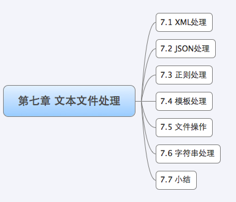

 Web 开发中对于**文本处理**是非常重要的一部分，我们往往需要对**输出或者输入的内容**进行处理，这里的文本包括**字符串、数字、`Json`、XML 等等**。Go 语言作为一门高性能的语言，对这些文本的处理都有官方的标准库来支持。而且在你使用中你会发现 Go 标准库的一些设计相当的巧妙，而且对于使用者来说也很方便就能处理这些文本。本章我们将通过四个小节的介绍，让用户对 Go 语言处理文本有一个很好的认识。

**XML** 是目前很多标准接口的**交互语言**，很多时候和一些 Java 编写的 Web Server 进行交互都是基于 XML 标准进行交互，在处理 XML 文本时发现它太复杂了，现在很多互联网企业对外的 API 大多数采用了 **JSON** 格式，这种格式描述简单，但是又能很好的表达意思。**正则**是一个让人又爱又恨的工具，它处理文本的能力非常强大，我们在前面表单验证里面已经有所领略它的强大。Web 开发中一个很重要的部分就是 MVC 分离，在 Go 语言的 Web 开发中 V 有一个专门的包来支持 template。

绍了一些文本处理的工具，包括 XML、JSON、正则和模板技术：

* XML 和 JSON 是**数据交互的工具**，通过 XML 和 JSON 你可以表达各种含义；
* 通过正则你可以处理文本 (搜索、替换、截取)；
* 通过模板技术你可以（以某种具体的格式）展现这些数据给用户。

这些都是你开发 Web 应用过程中需要用到的技术，通过这个小节的介绍你能够了解**如何处理文本、展现文本**。

# 1 XML

XML 作为**一种数据交换和信息传递的格式**已经十分普及。而随着 Web 服务日益广泛的应用，现在 XML 在日常的开发工作中也扮演了愈发重要的角色。这一小节， 我们将就 Go 语言标准包中的 XML 相关处理的包进行介绍。这个小节不会涉及 XML 规范相关的内容（如需了解相关知识请参考其他文献），而是介绍**如何用 Go 语言来编解码 XML 文件**相关的知识。

假如你是一名运维人员，你为你所管理的所有服务器生成了如下内容的 xml 的配置文件：

~~~xml
<?xml version="1.0" encoding="utf-8"?>
<servers version="1">
    <server>
        <serverName>Shanghai_VPN</serverName>
        <serverIP>127.0.0.1</serverIP>
    </server>
    <server>
        <serverName>Beijing_VPN</serverName>
        <serverIP>127.0.0.2</serverIP>
    </server>
</servers>
~~~

上面的 XML 文档描述了**两个服务器的信息**，包含了服务器名和服务器的 IP 信息，接下来的 Go 例子以此 XML 描述的信息进行操作。

## 1.1 解析 XML

如何解析如上这个 XML 文件呢？ 我们可以通过 xml 包的 `Unmarshal` 函数来达到我们的目的：

~~~go
func Unmarshal(data []byte, v interface{}) error
~~~

data 接收的是 XML 数据流，v 是需要输出的结构，定义为 interface，也就是可以把 XML 转换为任意的格式。我们这里主要介绍 struct 的转换，因为 struct 和 XML 都有类似树结构的特征：

~~~go
package text

import (
	"encoding/xml"
	"fmt"
	"io/ioutil"
	"os"
)

type RecurlyServer struct {
	XMLName     xml.Name `xml:"servers"`
	Version     string   `xml:"version,attr"`
	Svs         []server `xml:"server"`
	Description string   `xml:",innerxml"`
}

type server struct {
	XMLName    xml.Name `xml:"server"`
	ServerName string   `xml:"serverName"`
	ServerIp   string   `xml:"serverIP"`
}

func getXMLInfo() {
	file, err := os.OpenFile("./server.xml", 0, os.FileMode(os.O_CREATE))
	if err != nil {
		fmt.Printf("error: %v", err)
		return
	}
	defer file.Close()

	data, err := ioutil.ReadAll(file)
	if err != nil {
		fmt.Printf("error: %v", err)
		return
	}

	v := RecurlyServer{}
	err = xml.Unmarshal(data, &v)
	if err != nil {
		fmt.Printf("error: %v", err)
		return
	}

	fmt.Println(v)
}
~~~

XML 本质上是**一种树形的数据格式**，而我们可以定义**与之匹配的 go 语言的 struct 类型**，然后通过 `xml.Unmarshal` 来将 XML 文件中的数据解析成对应的 struct 对象。如上例子输出如下数据：

~~~go
{{ servers} 1 [{{ server} Shanghai_VPN 127.0.0.1} {{ server} Beijing_VPN 127.0.0.2}] }
~~~

与之对应的 XML 文件内容是：

~~~xml
<?xml version="1.0" encoding="utf-8"?>
<servers version="1">
    <server>
        <serverName>Shanghai_VPN</serverName>
        <serverIP>127.0.0.1</serverIP>
    </server>
    <server>
        <serverName>Beijing_VPN</serverName>
        <serverIP>127.0.0.2</serverIP>
    </server>
</servers>
~~~

上面的例子中，将 xml 文件解析成对应的 struct 对象是通过 `xml.Unmarshal` 来完成的，这个过程是如何实现的？可以看到我们的 struct 定义后面多了一些类似于 `xml:"serverName"` 这样的内容，这个是 struct 的一个特性，它们被称为 `struct tag`，它们是用来**辅助反射**的。我们来看一下 `Unmarshal` 的定义：

~~~go
func Unmarshal(data []byte, v interface{}) error
~~~

我们看到函数定义了两个参数，第一个是 XML 数据流，第二个是**存储的对应类型**，目前支持 struct、slice 和 string，XML 包内部**采用了反射来进行数据的映射**，所以 v 里面的字段**必须是导出的**。`Unmarshal` 解析的时候 XML 元素和字段怎么对应起来的呢？这是有一个优先级读取流程的，首先会读取 `struct tag`，如果没有，那么就会对应字段名。必须注意一点的是解析的时候 tag、字段名、XML 元素都是大小写敏感的，所以必须一一对应字段。

Go 语言的反射机制，可以利用这些 tag 信息来将来自 XML 文件中的数据反射成对应的 struct 对象，关于反射如何利用 struct tag 的更多内容请参阅 reflect 中的相关内容。

解析 XML 到 struct 的时候遵循如下的规则：

* 如果 struct 的一个字段是 string 或者 `[]byte` 类型且它的 tag 含有 ",innerxml"，`Unmarshal` 将会将此字段所对应的元素内所有内嵌的原始 xml 累加到此字段上，如上面例子 Description 定义。最后的输出是：

  ~~~go
  PS G:\michoi\Go\go_developer_roadmap\ProgrammingLanguage\Go Web编程\goweb\text> go test -v
  === RUN   TestGetXMLInfo
  {{ servers} 1 [{{ server} Shanghai_VPN 127.0.0.1} {{ server} Beijing_VPN 127.0.0.2}]
      <server>
          <serverName>Shanghai_VPN</serverName>
          <serverIP>127.0.0.1</serverIP>
      </server>
      <server>
          <serverName>Beijing_VPN</serverName>
          <serverIP>127.0.0.2</serverIP>
      </server>
  }
  --- PASS: TestGetXMLInfo (0.00s)
  PASS
  ok      opensource.com/goweb/text       0.487s
  ~~~

* 如果 struct 中有一个叫做 `XMLName`，且类型为 `xml.Name` 字段，那么在解析的时候就会保存这个 element 的名字到该字段，如上面例子中的 servers。

* 如果某个 struct 字段的 tag 定义中含有 XML 结构中 element 的名称，那么解析的时候就会把相应的 element 值赋值给该字段，如上 serverName 和 serverIP 定义。

* 如果某个 struct 字段的 tag 定义了中含有 ",attr"，那么解析的时候就会将该结构所对应的 element 的与字段同名的属性的值赋值给该字段，如上 version 定义。

* 如果某个 struct 字段的 tag 定义形如 "a>b>c", 则解析的时候，会将 xml 结构 a 下面的 b 下面的 c 元素的值赋值给该字段。

* 如果某个 struct 字段的 tag 定义了 "-", 那么不会为该字段解析匹配任何 xml 数据。

* 如果 struct 字段后面的 tag 定义了 ",any"，如果他的子元素在不满足其他的规则的时候就会匹配到这个字段。

* 如果某个 XML 元素包含一条或者多条注释，那么这些注释将被累加到第一个 tag 含有 ",comments" 的字段上，这个字段的类型可能是 [] byte 或 string, 如果没有这样的字段存在，那么注释将会被抛弃。

上面详细讲述了如何定义 struct 的 tag。 只要设置对了 tag，那么 XML 解析就如上面示例般简单，tag 和 XML 的 element 是一一对应的关系，如上所示，我们还可以通过 slice 来表示多个同级元素。

**为了正确解析，go 语言的 xml 包要求 struct 定义中的所有字段必须是可导出的（即首字母大写）**。

## 1.2 生成 XML 格式文件

假若我们不是要解析如上所示的 XML 文件，而是生成它，那么在 go 语言中又该如何实现呢？ xml 包中提供了 Marshal 和 `MarshalIndent` 两个函数，来满足我们的需求。这两个函数主要的区别是第二个函数会**增加前缀和缩进**，函数的定义如下所示：

~~~go
func Marshal(v interface{}) ([]byte, error)
func MarshalIndent(v interface{}, prefix, indent string) ([]byte, error)
~~~

两个函数第一个参数是用来生成 XML 的结构定义类型数据，都是返回生成的 XML 数据流。

下面我们来看一下如何输出如上的 XML：

~~~go
func setXMLInfo() {
	type server struct {
		ServerName string `xml:"serverName"`
		ServerIp   string `xml:"serverIP"`
	}
	type RecurlyServer struct {
		XMLName xml.Name `xml:"servers"`
		Version string   `xml:"version,attr"`
		Svs     []server `xml:"server"`
	}

	v := &RecurlyServer{
		Version: "1",
	}

	v.Svs = append(v.Svs, server{"Shanghai_VPN", "127.0.0.1"})
	v.Svs = append(v.Svs, server{"Beijing_VPN", "127.0.0.2"})

	output, err := xml.MarshalIndent(v, "  ", "	")
	if err != nil {
		fmt.Printf("err: %v.\n", err)
	}

	os.Stdout.Write([]byte(xml.Header))
	os.Stdout.Write(output)
}
~~~

和我们之前定义的文件的格式一模一样，之所以会有 `os.Stdout.Write([]byte(xml.Header))` 这句代码的出现，是因为 `xml.MarshalIndent` 或者 `xml.Marshal` 输出的信息都是不带 XML 头的，为了生成正确的 xml 文件，我们使用了 xml 包预定义的 Header 变量。

我们看到 Marshal 函数接收的参数 v 是 interface {} 类型的，即它可以接受任意类型的参数，那么 xml 包，根据什么规则来生成相应的 XML 文件呢？

* 如果 v 是 array 或者 slice，那么输出每一个元素，类似 value；
* 如果 v 是指针，那么会 Marshal 指针指向的内容，如果指针为空，什么都不输出；
* 如果 v 是 interface，那么就处理 interface 所包含的数据；
* 如果 v 是其他数据类型，就会输出这个数据类型所拥有的字段信息。

生成的 XML 文件中的 element 的名字又是根据什么决定的呢？元素名按照如下优先级从 struct 中获取：

* 如果 v 是 struct，XMLName 的 tag 中定义的名称；
* 类型为 xml.Name 的名叫 XMLName 的字段的值；
* 通过 struct 中字段的 tag 来获取；
* 通过 struct 的字段名用来获取；
* marshall 的类型名称。

我们应如何设置 struct 中字段的 tag 信息以控制最终 xml 文件的生成呢？

* XMLName 不会被输出
* tag 中含有 "-" 的字段不会输出
* tag 中含有 "name,attr"，会以 name 作为属性名，字段值作为值输出为这个 XML 元素的属性，如上 
* version 字段所描述
* tag 中含有 ",attr"，会以这个 struct 的字段名作为属性名输出为 XML 元素的属性，类似上一条，只是这个 name 默认是字段名了。
* tag 中含有 ",chardata"，输出为 xml 的 character data 而非 element。
* tag 中含有 ",innerxml"，将会被原样输出，而不会进行常规的编码过程
* tag 中含有 ",comment"，将被当作 xml 注释来输出，而不会进行常规的编码过程，字段值中不能含有 "--" 字符串
* tag 中含有 "omitempty", 如果该字段的值为空值那么该字段就不会被输出到 XML，空值包括：false、0、nil 指针或 nil 接口，任何长度为 0 的 array, slice, map 或者 string
* tag 中含有 "a>b>c"，那么就会循环输出三个元素 a 包含 b，b 包含 c，例如如下代码就会输出

上面我们介绍了如何使用 Go 语言的 xml 包来**编 / 解码 XML 文件**，**重要的一点是对 XML 的所有操作都是通过 struct tag 来实现的**，所以学会对 struct tag 的运用变得非常重要，在文章中我们简要的列举了如何定义 tag。更多内容或 tag 定义请参看相应的官方资料。

# 2 JSON

JSON（`Javascript Object Notation`）是**一种轻量级的数据交换语言**，以文字为基础，具有自我描述性且易于让人阅读。尽管 JSON 是 JavaScript 的一个子集，但 JSON 是独立于语言的文本格式，并且采用了类似于 C 语言家族的一些习惯。JSON 与 XML 最大的不同在于 XML 是一个完整的标记语言，而 JSON 不是。JSON 由于比 XML 更小、更快，更易解析，以及浏览器的内建快速解析支持，使得其**更适用于网络数据传输领域**。目前我们看到很多的开放平台，基本上都是采用了 JSON 作为他们的**数据交互的接口**。既然 JSON 在 Web 开发中如此重要，那么 Go 语言对 JSON 支持的怎么样呢？Go 语言的标准库已经非常好的支持了 JSON，可以很容易的对 JSON 数据进行编、解码的工作。

前一小节的运维的例子用 json 文件来表示，结果描述如下：

~~~json
{
    "servers": [
        {
            "serverName": "Shanghai_VPN", 
            "serverIP": "127.0.0.1"
        }, 
        {
            "serverName": "Beijing_VPN", 
            "serverIP": "127.0.0.2"
        }
    ]
}
~~~

本小节余下的内容将以此 JSON 数据为基础，来介绍 go 语言的 json 包对 JSON 数据的编 / 解码。

## 2.1 解析

假如有了上面的 JSON 串，那么我们如何来解析这个 JSON 串呢？Go 的 JSON 包中有如下函数：

~~~go
func Unmarshal(data []byte, v interface{}) error
~~~

通过这个函数我们就可以实现解析的目的，详细的解析例子请看如下代码：

~~~go
package text

import (
	"encoding/json"
	"fmt"
	"io/ioutil"
	"os"
)

type Server struct {
	ServerName string `json:"serverName"`
	ServerIp   string `json:"serverIp"`
}

type ServerSlice struct {
	Servers []Server `json:"servers"`
}

func getJSONInfo() {
	file, err := os.OpenFile("./server.json", 0, os.FileMode(os.O_CREATE))
	if err != nil {
		fmt.Printf("error: %v", err)
		return
	}
	defer file.Close()

	data, err := ioutil.ReadAll(file)
	if err != nil {
		fmt.Printf("error: %v", err)
		return
	}

	var s ServerSlice
	json.Unmarshal(data, &s)
	fmt.Println(s)
}
~~~

在上面的示例代码中，我们首先定义了与 `json` 数据对应的结构体，数组对应 slice，字段名对应 json 里面的 KEY，**在解析的时候，如何将 json 数据与 struct 字段相匹配呢？**例如 JSON 的 key 是 Foo，那么怎么找对应的字段呢？

* 首先查找 tag 含有 `Foo` 的**可导出**的 struct 字段 (首字母大写)；
* 其次查找字段名是 `Foo` 的**导出**字段；
* 最后查找类似 `FOO` 或者 `FoO` 这样的除了首字母之外其他大小写不敏感的**导出**字段。

聪明的你一定注意到了这一点：**能够被赋值的字段必须是可导出字段 (即首字母大写）**。同时 JSON 解析的时候只会解析能找得到的字段，找不到的字段会被忽略，这样的一个好处是：当你接收到一个很大的 JSON 数据结构而你却只想获取其中的部分数据的时候，你只需将你想要的数据对应的字段名大写，即可轻松解决这个问题。

上面那种解析方式是在我们知晓被解析的 JSON 数据的结构的前提下采取的方案，如果我们**不知道被解析的数据的格式**，又应该如何来解析呢？我们知道 interface {} 可以用来存储任意数据类型的对象，这种数据结构正好用于存储解析的未知结构的 json 数据的结果。JSON 包中采用 map [string] interface {} 和 [] interface {} 结构来存储任意的 JSON 对象和数组。Go 类型和 JSON 类型的对应关系如下：

* bool 代表 JSON booleans,
* float64 代表 JSON numbers,
* string 代表 JSON strings,
* nil 代表 JSON null.

现在我们假设有如下的 JSON 数据：

~~~go
b := []byte(`{"Name":"Wednesday","Age":6,"Parents":["Gomez","Morticia"]}`)
~~~

如果在我们不知道他的结构的情况下，我们把他解析到 interface {} 里面：

~~~go
func getJSONInfoUsingInterface() {
	b := []byte(`{"Name":"Wednesday","Age":6,"Parents":["Gomez","Morticia"]}`)

	var f interface{}
	err := json.Unmarshal(b, &f)
	if err != nil {
		fmt.Printf("err: %v", err)
	}
    // map[Age:6 Name:Wednesday Parents:[Gomez Morticia]]
	fmt.Println(f)
}
~~~

这个时候 f 里面存储了一个 map 类型，他们的 key 是 string，值存储在空的 interface {} 里，类似下面的结构：

~~~go
f = map[string]interface{}{
    "Name": "Wednesday",
    "Age":  6,
    "Parents": []interface{}{
        "Gomez",
        "Morticia",
    },
}
~~~

那么如何来访问这些数据呢？通过断言的方式：

~~~go
func getJSONInfoUsingInterface() {
	b := []byte(`{"Name":"Wednesday","Age":6,"Parents":["Gomez","Morticia"]}`)

	var f interface{}
	err := json.Unmarshal(b, &f)
	if err != nil {
		fmt.Printf("err: %v", err)
	}
	fmt.Println(f)

	content := f.(map[string]interface{})
	for key, value := range content {
		switch vv := value.(type) {
		case string:
			fmt.Println(key, "is string", vv)
		case int:
			fmt.Println(key, "is int", vv)
		case float64:
			fmt.Println(key, "is float64", vv)
		case []interface{}:
			fmt.Println(key, "is an array:")
			for i, u := range vv {
				fmt.Println(i, u)
			}
		default:
			fmt.Println(key, "is of a type I don't know how to handle")
		}
	}
}
~~~

通过上面的示例可以看到，通过 interface {} 与 type assert 的配合，我们就可以解析未知结构的 JSON 数了。

上面这个是官方提供的解决方案，其实很多时候我们通过类型断言，操作起来不是很方便，目前 bitly 公司开源了一个叫做 simplejson 的包，在处理未知结构体的 JSON 时相当方便，详细例子如下所示：

## 2.2 生成 JSON 文件

我们开发很多应用的时候，最后都是要输出 JSON 数据串，那么如何来处理呢？JSON 包里面通过 `Marshal` 函数来处理，函数定义如下：

~~~go
func Marshal(v interface{}) ([]byte, error)
~~~

假设我们还是需要生成上面的服务器列表信息，那么如何来处理呢？请看下面的例子：

~~~go
func setJSONInfo() {
	type Server struct {
		ServerName string
		ServerIP   string
	}

	type ServerSlice struct {
		Servers []Server
	}

	var s ServerSlice
	s.Servers = append(s.Servers, Server{ServerName: "Shanghai_VPN", ServerIP: "127.0.0.1"})
	s.Servers = append(s.Servers, Server{ServerName: "Beijing_VPN", ServerIP: "127.0.0.2"})
	b, err := json.Marshal(s)
	if err != nil {
		fmt.Println("json err:", err)
	}
	fmt.Println(string(b))
}
~~~

输出如下内容：

~~~go
{"Servers":[{"ServerName":"Shanghai_VPN","ServerIP":"127.0.0.1"},{"ServerName":"Beijing_VPN","ServerIP":"127.0.0.2"}]}
~~~

我们看到上面的输出字段名的首字母都是大写的，如果你想用小写的首字母怎么办呢？把结构体的字段名改成首字母小写的？JSON 输出的时候必须注意，**只有导出的字段才会被输出**，如果修改字段名，那么就会发现什么都不会输出，所以必须通过 struct tag 定义来实现：

~~~go
type Server struct {
    ServerName string `json:"serverName"`
    ServerIP   string `json:"serverIP"`
}

type Serverslice struct {
    Servers []Server `json:"servers"`
}
~~~

通过修改上面的结构体定义，输出的 JSON 串就和我们最开始定义的 JSON 串保持一致了。

针对 JSON 的输出，我们在定义 struct tag 的时候需要注意的几点是:

* 字段的 tag 是 "-"，那么这个字段不会输出到 JSON；
* tag 中带有自定义名称，那么这个自定义名称会出现在 JSON 的字段名中，例如上面例子中 serverName；
* tag 中如果带有 "omitempty" 选项，那么如果该字段值为空，就不会输出到 JSON 串中；
* 如果字段类型是 bool, string, int, int64 等，而 tag 中带有 ",string" 选项，那么这个字段在输出到 JSON 的时候会把该字段对应的值转换成 JSON 字符串。

Marshal 函数只有在转换成功的时候才会返回数据，在转换的过程中我们需要注意几点：

* JSON 对象只支持 string 作为 key，所以要编码一个 map，那么必须是 map [string] T 这种类型 (T 是 Go 语言中任意的类型)；
* Channel, complex 和 function 是不能被编码成 JSON 的；
* 嵌套的数据是不能编码的，不然会让 JSON 编码进入死循环；
* 指针在编码的时候会输出指针指向的内容，而空指针会输出 null。

# 3 正则处理

正则表达式是一种进行**模式匹配**和**文本操纵**的复杂而又强大的工具。虽然正则表达式比纯粹的文本匹配效率低，但是它却更灵活。按照它的语法规则，随需构造出的匹配模式就能够从原始文本中筛选出几乎任何你想要得到的字符组合。如果你在 Web 开发中需要从一些文本数据源中获取数据，那么你只需要按照它的语法规则，随需构造出正确的模式字符串就能够从原数据源提取出有意义的文本信息。

**Go 语言通过 `regexp` 标准包为正则表达式提供了官方支持**，如果你已经使用过其他编程语言提供的正则相关功能，那么你应该对 Go 语言版本的不会太陌生，但是它们之间也有一些小的差异，因为 Go 实现的是 RE2 标准，除了 \C，详细的语法描述参考：http://code.google.com/p/re2/wiki/Syntax

其实字符串处理我们可以使用 strings 包来进行搜索 (Contains、Index)、替换 (Replace) 和解析 (Split、Join) 等操作，但是这些都是简单的字符串操作，他们的搜索都是大小写敏感，而且固定的字符串，如果我们需要匹配可变的那种就没办法实现了，当然如果 strings 包能解决你的问题，那么就尽量使用它来解决。因为他们足够简单、而且性能和可读性都会比正则好。

如果你还记得，在前面表单验证的小节里，我们已经接触过正则处理，在那里我们利用了它来验证输入的信息是否满足某些预设的条件。在使用中需要注意的一点就是：**所有的字符都是 UTF-8 编码的**。接下来让我们更加深入的来学习 Go 语言的 `regexp` 包相关知识吧。

## 3.1 通过正则表达式判断是否匹配

`regexp` 包中含有三个函数用来**判断是否匹配**，如果匹配返回 true，否则返回 false：

~~~go
func Match(pattern string, b []byte) (matched bool, error error)
func MatchReader(pattern string, r io.RuneReader) (matched bool, error error)
func MatchString(pattern string, s string) (matched bool, error error)
~~~

上面的三个函数实现了同一个功能，就是判断 pattern 是否和输入源匹配，匹配的话就返回 true，如果解析正则出错则返回 error。三个函数的输入源分别是 byte slice、`RuneReader` 和 string。

如果要验证一个输入是不是 IP 地址，那么如何来判断呢？请看如下实现：

~~~go
func IsIP(ip string) {
	if m, _ := regexp.MatchString("^[0-9]{1,3}\\.[0-9]{1,3}\\.[0-9]{1,3}\\.[0-9]{1,3}$", ip); !m {
		fmt.Println("false")
	}
	fmt.Println("true")
}
~~~

可以看到，`regexp` 的 pattern 和我们平常使用的正则一模一样。

## 3.2 通过正则表达式获取内容

Match 模式只能用来对字符串的判断，而无法截取字符串的一部分、过滤字符串、或者提取出符合条件的一批字符串。如果想要满足这些需求，那就需要使用正则表达式的复杂模式。

我们经常需要一些爬虫程序，下面就以爬虫为例来说明如何使用正则来过滤或截取抓取到的数据：

~~~go
func handleValues() {
	resp, err := http.Get("http://www.baidu.com")
	if err != nil {
		fmt.Println("http get error.")
	}
	defer resp.Body.Close()
	body, err := ioutil.ReadAll(resp.Body)
	if err != nil {
		fmt.Println("http read error")
		return
	}

	src := string(body)

	// 将 HTML 标签全转换成小写
	re, _ := regexp.Compile("\\<[\\S\\s]+?\\>")
	src = re.ReplaceAllStringFunc(src, strings.ToLower)

	// 去除 STYLE
	re, _ = regexp.Compile("\\<style[\\S\\s]+?\\</style\\>")
	src = re.ReplaceAllString(src, "")

	// 去除 SCRIPT
	re, _ = regexp.Compile("\\<script[\\S\\s]+?\\</script\\>")
	src = re.ReplaceAllString(src, "")

	// 去除所有尖括号内的 HTML 代码，并换成换行符
	re, _ = regexp.Compile("\\<[\\S\\s]+?\\>")
	src = re.ReplaceAllString(src, "\n")

	// 去除连续的换行符
	re, _ = regexp.Compile("\\s{2,}")
	src = re.ReplaceAllString(src, "\n")

	fmt.Println(strings.TrimSpace(src))
}
~~~

从这个示例可以看出，使用复杂的正则首先是 Compile，它会解析正则表达式是否合法，如果正确，那么就会返回**一个 `Regexp` 实例**，然后就可以利用返回的 Regexp 在任意的字符串上面执行需要的操作。

解析正则表达式的有如下几个方法：

~~~go
func Compile(expr string) (*Regexp, error)
func CompilePOSIX(expr string) (*Regexp, error)
func MustCompile(str string) *Regexp
func MustCompilePOSIX(str string) *Regexp
~~~

`CompilePOSIX` 和 Compile 的不同点在于 POSIX 必须使用 POSIX 语法，它使用最左最长方式搜索，而 Compile 是采用的则只采用最左方式搜索 (例如 [a-z]{2,4} 这样一个正则表达式，应用于 "aa09aaa88aaaa" 这个文本串时，`CompilePOSIX` 返回了 aaaa，而 Compile 的返回的是 aa)。前缀有 Must 的函数表示，在解析正则语法的时候，如果匹配模式串不满足正确的语法则直接 panic，而不加 Must 的则只是返回错误。

在了解了如何新建一个 Regexp 之后，我们再来看一下这个 struct 提供了哪些方法来辅助我们操作字符串，首先我们来看下面这些用来搜索的函数：

~~~go
func (re *Regexp) Find(b []byte) []byte
func (re *Regexp) FindAll(b []byte, n int) [][]byte
func (re *Regexp) FindAllIndex(b []byte, n int) [][]int
func (re *Regexp) FindAllString(s string, n int) []string
func (re *Regexp) FindAllStringIndex(s string, n int) [][]int
func (re *Regexp) FindAllStringSubmatch(s string, n int) [][]string
func (re *Regexp) FindAllStringSubmatchIndex(s string, n int) [][]int
func (re *Regexp) FindAllSubmatch(b []byte, n int) [][][]byte
func (re *Regexp) FindAllSubmatchIndex(b []byte, n int) [][]int
func (re *Regexp) FindIndex(b []byte) (loc []int)
func (re *Regexp) FindReaderIndex(r io.RuneReader) (loc []int)
func (re *Regexp) FindReaderSubmatchIndex(r io.RuneReader) []int
func (re *Regexp) FindString(s string) string
func (re *Regexp) FindStringIndex(s string) (loc []int)
func (re *Regexp) FindStringSubmatch(s string) []string
func (re *Regexp) FindStringSubmatchIndex(s string) []int
func (re *Regexp) FindSubmatch(b []byte) [][]byte
func (re *Regexp) FindSubmatchIndex(b []byte) []int
~~~

上面这 18 个函数我们根据输入源 (byte slice、string 和 `io.RuneReader`) 不同还可以继续简化成如下几个，其他的只是输入源不一样，其他功能基本是一样的：

~~~go
func (re *Regexp) Find(b []byte) []byte
func (re *Regexp) FindAll(b []byte, n int) [][]byte
func (re *Regexp) FindAllIndex(b []byte, n int) [][]int
func (re *Regexp) FindAllSubmatch(b []byte, n int) [][][]byte
func (re *Regexp) FindAllSubmatchIndex(b []byte, n int) [][]int
func (re *Regexp) FindIndex(b []byte) (loc []int)
func (re *Regexp) FindSubmatch(b []byte) [][]byte
func (re *Regexp) FindSubmatchIndex(b []byte) []int
~~~

对于这些函数的使用我们来看下面这个例子：

~~~go
func regexpTest() {
	a := "I am learning Go language"

	re, _ := regexp.Compile("[a-z]{2,4}")

	// 查找符合正则的第一个
	one := re.Find([]byte(a))
	// Find: am
	fmt.Println("Find:", string(one))

	// 查找符合正则的所有 slice, n 小于 0 表示返回全部符合的字符串，不然就是返回指定的长度
	all := re.FindAll([]byte(a), -1)
	// FindAll:[am lear ning lang uage].
	fmt.Printf("FindAll:%s.\n", all)

	// 查找符合条件的 index 位置, 开始位置和结束位置
	index := re.FindIndex([]byte(a))
	fmt.Println("FindIndex", index)

	// 查找符合条件的所有的 index 位置，n 同上
	allindex := re.FindAllIndex([]byte(a), -1)
	fmt.Println("FindAllIndex", allindex)

	re2, _ := regexp.Compile("am(.*)lang(.*)")

	// 查找 Submatch, 返回数组，第一个元素是匹配的全部元素，第二个元素是第一个 () 里面的，第三个是第二个 () 里面的
	// 下面的输出第一个元素是 "am learning Go language"
	// 第二个元素是 " learning Go "，注意包含空格的输出
	// 第三个元素是 "uage"
	submatch := re2.FindSubmatch([]byte(a))
	fmt.Printf("FindSubmatch:%s\n", submatch)
	for _, v := range submatch {
		fmt.Println(string(v))
	}

	// 定义和上面的 FindIndex 一样
	submatchindex := re2.FindSubmatchIndex([]byte(a))
	fmt.Println(submatchindex)

	// FindAllSubmatch, 查找所有符合条件的子匹配
	submatchall := re2.FindAllSubmatch([]byte(a), -1)
	fmt.Printf("submatchall:%s\n", submatchall)

	// FindAllSubmatchIndex, 查找所有字匹配的 index
	submatchallindex := re2.FindAllSubmatchIndex([]byte(a), -1)
	fmt.Println(submatchallindex)
}
~~~

前面介绍过匹配函数，Regexp 也定义了三个函数，它们和同名的外部函数功能一模一样，其实外部函数就是调用了这 Regexp 的三个函数来实现的：

~~~go
func (re *Regexp) Match(b []byte) bool
func (re *Regexp) MatchReader(r io.RuneReader) bool
func (re *Regexp) MatchString(s string) bool
~~~

接下里让我们来了解替换函数是怎么操作的？

~~~go
func (re *Regexp) ReplaceAll(src, repl []byte) []byte
func (re *Regexp) ReplaceAllFunc(src []byte, repl func([]byte) []byte) []byte
func (re *Regexp) ReplaceAllLiteral(src, repl []byte) []byte
func (re *Regexp) ReplaceAllLiteralString(src, repl string) string
func (re *Regexp) ReplaceAllString(src, repl string) string
func (re *Regexp) ReplaceAllStringFunc(src string, repl func(string) string) string
~~~

这些替换函数我们在上面的抓网页的例子有详细应用示例，

接下来我们看一下 Expand 的解释：

~~~go
func (re *Regexp) Expand(dst []byte, template []byte, src []byte, match []int) []byte
func (re *Regexp) ExpandString(dst []byte, template string, src string, match []int) []byte
~~~

至此我们已经全部介绍完 Go 语言的 `regexp` 包，通过对它的主要函数**介绍及演示**，相信大家应该能够通过 Go 语言的正则包进行一些基本的正则的操作了。

# 4 Template

你一定听说过一种叫做 MVC 的设计模式，Model 处理数据，View 展现结果，Controller 控制用户的请求，至于 View 层的处理，在很多动态语言里面都是通过在**静态 HTML 中插入动态语言生成的数据**，例如 JSP 中通过插入 `<%=....=%>`，PHP 中通过插入 `<?php.....?>` 来实现的。

通过下面这个图可以说明**模板的机制**：

Web 应用反馈给客户端的信息中的大部分内容是静态的、不变的，而另外少部分是根据**用户的请求**来动态生成的，例如要显示用户的访问记录列表。用户之间只有记录数据是不同的，而**列表的样式则是固定的**，此时**采用模板可以复用很多静态代码**。

在 Go 语言中，我们使用 template 包来进行模板处理，使用类似 Parse、ParseFile、Execute 等方法从文件或者字符串加载模板，然后执行类似上面图片展示的模板的 merge 操作。请看下面的例子：

~~~go
func handler(w http.ResponseWriter, r *http.Request){
    t := template.New("some template")
    t, _ = t.ParseFiles("tmpl/welcome.html")
    user := GetUser()
    t.Execute(w, user) // 执行模板的 merge 操作
}
~~~

通过上面的例子我们可以看到 Go 语言的模板操作非常的简单方便，和其他语言的模板处理类似，都是先获取数据，然后渲染数据。为了演示和测试代码的方便，我们在接下来的例子中采用如下格式的代码：

* 使用 Parse 代替 ParseFiles，因为 Parse 可以直接测试一个字符串，而不需要额外的文件；
* 不使用 handler 来写演示代码，而是每个测试一个 main，方便测试；
* 使用 os.Stdout 代替 http.ResponseWriter，因为 os.Stdout 实现了 io.Writer 接口。

上面我们演示了如何解析并渲染模板，接下来让我们来更加详细的了解如何把数据渲染出来。一个模板都是应用在一个 Go 的对象之上，Go 对象的字段如何插入到模板中呢？

Go 语言的模板通过 {{}} 来包含需要在渲染时被替换的字段，{{.}} 表示当前的对象，这和 Java 或者 C++ 中的 this 类似，如果要访问当前对象的字段通过 {{.FieldName}}，但是需要注意一点：**这个字段必须是导出的** (字段首字母必须是大写的)，否则在渲染的时候就会报错，请看下面的这个例子：

通过上面对模板的详细介绍，我们了解了**如何把动态数据与模板融合**：如何输出循环数据、如何自定义函数、如何嵌套模板等等。通过模板技术的应用，我们可以完成 MVC 模式中 V 的处理，接下来的章节我们将介绍如何来处理 M 和 C。

# 5 文件操作

在任何计算机设备中，文件是都是必须的对象，而在 Web 编程中，文件的操作一直是 Web 程序员经常遇到的问题，文件操作在 Web 应用中是必须的，非常有用的，我们经常遇到生成文件目录，文件 (夹) 编辑等操作，现在我把 Go 中的这些操作做一详细总结并实例示范如何使用。

## 5.1 目录操作

文件操作的大多数函数都是在 `os` 包里面，下面列举了几个目录操作的：

* `func Mkdir(name string, perm FileMode) error`

  根据指定的名称、权限新建目录。默认情况下，是在进程的当前根目录。

* `func MkdirAll(path string, perm FileMode) error`

  根据指定的 path、perm 新建目录，包括新建父目录。例如：`astaxie/test1/test2s`

* `func MkdirTemp(dir, pattern string) (string, error)`

  创建临时目录。

* `func Remove(name string) error`

  删除文件或者是（空的）目录。此处如果目录中包含有子文件或子目录，或报错。

* `func RemoveAll(path string) error`

  删除路径下的所有内容。

下面是演示代码：

~~~go
package dir

import (
	"fmt"
	"os"
)

func document() {
	os.Mkdir("astaxie", 0777)
	os.MkdirAll("astaxie/test1/teste2", 0777)
	err := os.Remove("astaxie")
	if err != nil {
        // remove astaxie: The directory is not empty.
		fmt.Println(err)
	}

	os.RemoveAll("astaxie")
}
~~~

在上述第 11 行中删除目录时，当前 `astaxie` 目录不为空，此时该操作会出错。除非，该删除的目录本身为空。

## 5.2 文件操作

文件操作又分为：

* 建立与打开文件；
* 写文件；
* 读文件；
* 删除文件。

### 5.2.1 新建和打开文件

新建文件可以通过如下两个方法：

* `func Create(name string) (*File, error)`

  根据提供的文件名创建新的文件，返回一个文件对象，默认权限是 0666 的文件，返回的文件对象是可读写的。

* `  func NewFile(fd uintptr, name string) *File`

  根据文件描述符创建相应的文件，返回一个文件对象。

通过如下两个方法来打开文件：

* `    func Open(name string) (*File, error)`

  该方法打开一个名称为 name 的文件，但是是只读方式，内部实现其实调用了 `OpenFile`。

* `func OpenFile(name string, flag int, perm FileMode) (*File, error)`

  打开名称为 name 的文件，flag 是打开的方式，只读、读写等，perm 是权限。

### 5.2.2 写文件

写文件函数，包括：

* `func (f *File) Write(b []byte) (n int, err error)`

  写入 byte 类型的值到文件。

* `func (f *File) WriteAt(b []byte, off int64) (n int, err error)`

  在指定位置开始写入 byte 类型的值。

* `func (f *File) WriteString(s string) (n int, err error)`

  写入 string 实例到文件。

### 5.2.3 读文件

读文件函数，包括：

* `func (f *File) Read(b []byte) (n int, err error)`

  读取数据到 b 中。

* `func (f *File) ReadAt(b []byte, off int64) (n int, err error)`

  从 off 开始读取数据到 b 中。

### 5.2.4 删除文件

和删除目录相同。

# 6 字符串处理

字符串在我们平常的 Web 开发中经常用到，包括用户的输入，数据库读取的数据等，我们经常需要对字符串进行**分割、连接、转换**等操作，本小节将通过 Go 标准库中的 strings 和 `strconv` 两个包中的函数来讲解如何进行有效快速的操作。

## 6.1 字符串操作

下面这些函数来自于 strings 包，这里介绍一些我平常经常用到的函数，更详细的请参考官方的文档。

* `func Contains(s, substr string) bool`

  字符串 s 中是否包含 `substr`，返回 bool 值。

* `func Join(a []string, sep string) string`

  字符串链接，把 slice 通过 `sep` 连接起来。

* `func Index(s, sep string) int`

  在字符串 s 中查找 `sep` 所在的位置，返回位置值，找不到则返回 -1。
  
* `func Repeat(s string, count int) string`

  重复 s 字符串 count 次，最后返回重复的字符串。

* `func Replace(s, old, new string, n int) string`

  在 s 字符串中，把 old 字符串替换为 new 字符串，n 表示替换的次数，小于 0 表示全部替换。

* `func Split(s, sep string) []string`

  把 s 字符串按照 `sep` 分割，返回 slice。

* `func Trim(s string, cutset string) string`

  在 s 字符串的头部和尾部去除 `cutset` 指定的字符串。

* `func Fields(s string) []string`

  去除 s 字符串的空格符，并且按照空格分割返回 slice。

## 6.2 字符串转换

字符串转化的函数在 `strconv` 中，如下也只是列出一些常用的：

* Append 系列函数将整数等转换为字符串后，添加到现有的字节数组中

  ~~~go
  func AppendBool(dst []byte, b bool) []byte
  func AppendFloat(dst []byte, f float64, fmt byte, prec, bitSize int) []byte
  func AppendInt(dst []byte, i int64, base int) []byte
  func AppendQuote(dst []byte, s string) []byte
  func AppendQuoteRune(dst []byte, r rune) []byte
  func AppendQuoteRuneToASCII(dst []byte, r rune) []byte
  func AppendQuoteRuneToGraphic(dst []byte, r rune) []byte
  func AppendQuoteToASCII(dst []byte, s string) []byte
  func AppendQuoteToGraphic(dst []byte, s string) []byte
  func AppendUint(dst []byte, i uint64, base int) []byte
  ~~~

* Format 系列函数把其他类型的转换为字符串

  ~~~go
  func FormatBool(b bool) string
  func FormatComplex(c complex128, fmt byte, prec, bitSize int) string
  func FormatFloat(f float64, fmt byte, prec, bitSize int) string
  func FormatInt(i int64, base int) string
  func FormatUint(i uint64, base int) string
  ~~~

* Parse 系列函数把字符串转换为其他类型

  ~~~go
  func ParseBool(str string) (bool, error)
  func ParseComplex(s string, bitSize int) (complex128, error)
  func ParseFloat(s string, bitSize int) (float64, error)
  func ParseInt(s string, base int, bitSize int) (i int64, err error)
  func ParseUint(s string, base int, bitSize int) (uint64, error)
  ~~~

  
