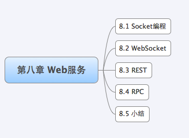
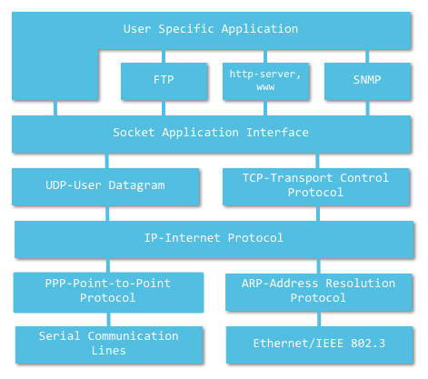
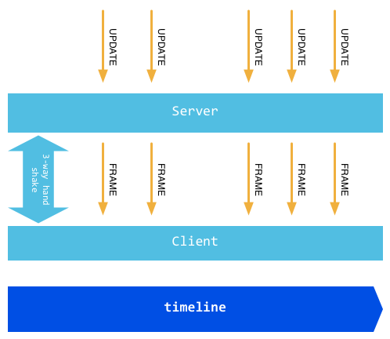
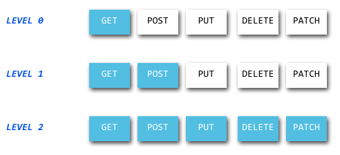
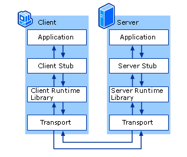

Web 服务可以让你在 HTTP 协议的基础上通过 XML 或者 JSON 来交换信息。如果你想知道上海的天气预报、中国石油的股价或者淘宝商家的一个商品信息，你可以编写一段简短的代码，通过抓取这些信息然后通过标准的接口开放出来，就如同你调用一个本地函数并返回一个值。

> Web 服务，HTTP 是**基础**，XML 和 JSON 文件是**手段**、**方式**、**媒介**，交换信息是**最终目的**。

**Web 服务背后的关键在于平台的无关性**，你可以运行你的服务在 Linux 系统，可以与其他 Windows 的 asp.net 程序交互，同样的，也可以通过同一个接口和运行在 FreeBSD 上面的 JSP 无障碍地通信。

目前主流的有如下几种 Web 服务：REST、SOAP。

* REST （Representational State Transfer，简称 REST）请求是很直观的，因为 REST 是基于 HTTP 协议的一个补充，他的每一次请求都是一个 HTTP 请求，然后根据不同的 method 来处理不同的逻辑，很多 Web 开发者都熟悉 HTTP 协议，所以学习 REST 是一件比较容易的事情。REST 即**表述性状态传递**，是**一种针对网络应用的设计和开发方式**，可以降低开发的复杂性，提高系统的可伸缩性。

* SOAP 是 W3C **在跨网络信息传递和远程计算机函数调用方面的一个标准**。但是 SOAP 非常复杂，其完整的规范篇幅很长，而且内容仍然在增加。Go 语言是以简单著称，所以我们不会介绍 SOAP 这样复杂的东西。而 Go 语言提供了一种天生性能很不错，开发起来很方便的 RPC 机制。

Go 语言是 21 世纪的 C 语言，我们追求的是**性能、简单**，所以我们将介绍如何使用 Socket 编程，很多游戏服务都是采用 Socket 来编写服务端，因为 HTTP 协议相对而言比较耗费性能，让我们看看 Go 语言如何来 Socket 编程。目前随着 HTML5 的发展，WebSocket 也逐渐的成为很多页游公司接下来开发的一些手段，我们将讲解 Go 语言如何编写 WebSocket 的代码。

Go 中的网络编程和其他语言的网络编程是一样的，HTTP 是建立在 Socket 基础之上的：

* Socket 中有对应的 TCP 和 UDP 通信；
* HTTP 的基础是 TCP 通信，有 GET/POST/PUT/DELETE/UPDATE 方式，**是对底层 Socket 通信的封装**。

这一章我们介绍了目前流行的几种主要的**网络应用开发方式**，第一小节介绍了网络编程中的基础：Socket 编程，因为现在网络正在朝云的方向快速进化，作为这一技术演进的基石的的 Socket 知识，作为开发者的你，是必须要掌握的。第二小节介绍了正愈发流行的 HTML5 中一个重要的特性 WebSocket，通过它，服务器可以实现主动的 push 消息，以简化以前 ajax 轮询的模式。第三小节介绍了 REST 编写模式，这种模式特别适合来开发网络应用 API，目前移动应用的快速发展，我觉得将来会是一个潮流。第四小节介绍了 Go 实现的 RPC 相关知识，对于上面四种开发方式，Go 都已经提供了良好的支持，net 包及其子包，是所有涉及到网络编程的工具的所在地。如果你想更加深入的了解相关实现细节，可以尝试阅读这个包下面的源码。

# 1 Socket 编程

在很多**底层网络应用开发者**的眼里**一切编程都是 Socket**，话虽然有点夸张，但却也几乎如此了，现在的网络编程几乎都是用 Socket 来编程。你想过这些情景么？我们每天打开浏览器浏览网页时，浏览器进程怎么和 **Web 服务器**进行通信的呢？当你用 QQ 聊天时，QQ 进程怎么和**服务器**或者是你的好友所在的 QQ 进程进行通信的呢？当你打开 PPstream 观看视频时，PPstream 进程如何与**视频服务器**进行通信的呢？ 如此种种，都是靠 Socket 来进行通信的，以一斑窥全豹，可见 Socket 编程在现代编程中占据了多么重要的地位。

通过对 TCP 和 UDP Socket 编程的描述和实现，可见 Go 已经**完备地支持了 Socket 编程**，而且使用起来相当的方便，Go 提供了**很多函数**，通过这些函数可以很容易就编写出**高性能的 Socket 应用**。

## 1.1 什么是 Socket

Socket 起源于 Unix，而 Unix 基本哲学之一就是 “一切皆文件”，都可以用 “打开 open –> 读写 write/read –> 关闭 close” **模式**来操作。Socket 就是该模式的一个实现，网络的 Socket 数据传输是一种特殊的 I/O，Socket 也是**一种文件描述符**。Socket 也具有一个类似于打开文件的函数调用：Socket ()，该函数返回一个整型的 Socket **描述符**，随后的连接建立、数据传输等操作都是通过该 Socket 实现的。

常用的 Socket 类型有两种：**流式** Socket（SOCK_STREAM）和**数据报式** Socket（SOCK_DGRAM）。流式是一种**面向连接**的 Socket，对应于面向连接的 TCP 服务应用；数据报式 Socket 是一种无连接的 Socket，对应于无连接的 UDP 服务应用。

## 1.2 Socket 如何通信

网络中的进程之间如何通过 Socket 通信呢？首要解决的问题是**如何唯一标识一个进程**，否则通信无从谈起！在本地可以通过进程 PID 来唯一标识一个进程，但是在网络中这是行不通的。其实 TCP/IP 协议族已经帮我们解决了这个问题，**网络层**的 “IP 地址” 可以唯一标识网络中的主机，而**传输层**的 “协议 + 端口” 可以唯一标识主机中的应用程序（进程）。这样利用**三元组（ip 地址，协议，端口）**就可以**标识网络的进程**了，网络中需要互相通信的进程，就可以利用这个标志在他们之间进行交互。

> 为什么通过三元组 IP 地址、协议、端口就可以标识网络的进程？

请看下面这个 TCP/IP 协议结构图：

使用 TCP/IP 协议的应用程序通常采用应用编程接口：UNIX BSD 的套接字（Socket）和 UNIX System V 的 TLI（已经被淘汰），来实现网络进程之间的通信。就目前而言，**几乎所有的应用程序都是采用 Socket**，而现在又是网络时代，**网络中进程通信是无处不在**，这就是为什么说 “一切皆 Socket”。

## 1.2 Socket 基础知识

通过上面的介绍我们知道 Socket 有两种：TCP Socket 和 UDP Socket，TCP 和 UDP 是协议，而要确定一个进程的需要三元组，需要 IP 地址和端口。

目前的全球因特网所采用的协议族是 TCP/IP 协议。IP 是 TCP/IP 协议中**网络层**的协议，是 TCP/IP 协议族的核心协议。目前主要采用的 IP 协议的版本号是 4 (简称为 IPv4)，发展至今已经使用了 30 多年。

IPv4 的地址位数为 32 位，也就是最多有 2 的 32 次方的网络设备可以联到 Internet 上。近十年来由于互联网的蓬勃发展，IP 位址的需求量愈来愈大，使得 IP 位址的发放愈趋紧张，前一段时间，据报道 IPV4 的地址已经发放完毕，我们公司目前很多服务器的 IP 都是一个宝贵的资源。

IPv4 地址格式类似这样：`127.0.0.1`；`172.122.121.111`。

IPv6 是下一版本的互联网协议，也可以说是下一代互联网的协议，它是为了解决 IPv4 在实施过程中遇到的各种问题而被提出的，IPv6 采用 128 位地址长度，几乎可以不受限制地提供地址。按保守方法估算 IPv6 实际可分配的地址，整个地球的每平方米面积上仍可分配 1000 多个地址。在 IPv6 的设计过程中除了一劳永逸地解决了地址短缺问题以外，还考虑了在 IPv4 中解决不好的其它问题，主要有端到端 IP 连接、服务质量（QoS）、安全性、多播、移动性、即插即用等。

IPv6 地址格式类似这样：`2002:c0e8:82e7:0:0:0:c0e8:82e7`。

在 Go 的 `net` 包中定义了很多类型、函数和方法用来网络编程，其中 IP 的定义如下：

~~~go
// IP address lengths (bytes).
const (
	IPv4len = 4
	IPv6len = 16
)

// An IP is a single IP address, a slice of bytes.
// Functions in this package accept either 4-byte (IPv4)
// or 16-byte (IPv6) slices as input.
//
// Note that in this documentation, referring to an
// IP address as an IPv4 address or an IPv6 address
// is a semantic property of the address, not just the
// length of the byte slice: a 16-byte slice can still
// be an IPv4 address.
type IP []byte
~~~

在 `net` 包中有很多函数来操作 IP，但是其中比较有用的也就几个，其中 `ParseIP(s string) IP` 函数会把一个 IPv4 或者 IPv6 的地址转化成 IP 类型。

## 1.3 TCP Socket

当我们知道如何通过网络端口访问一个服务时，那么我们能够做什么呢？作为客户端来说，我们可以通过向远端某台机器的的某个网络端口发送一个请求，然后得到**在机器的此端口上监听的服务**反馈的信息。作为服务端，我们需要把服务绑定到某个指定端口，并且在此端口上监听，当有客户端来访问时能够读取信息并且写入反馈信息。

在 Go 语言的 net 包中有一个类型 `TCPConn`，这个类型可以用来作为客户端和服务器端交互的通道，他有两个主要的函数：

~~~go
// TCPConn is an implementation of the Conn interface for TCP network
// connections.
type TCPConn struct {
	conn
}

type conn struct {
	fd *netFD
}

// Conn is a generic stream-oriented network connection.
//
// Multiple goroutines may invoke methods on a Conn simultaneously.
type Conn interface {
	// Read reads data from the connection.
	// Read can be made to time out and return an error after a fixed
	// time limit; see SetDeadline and SetReadDeadline.
	Read(b []byte) (n int, err error)

	// Write writes data to the connection.
	// Write can be made to time out and return an error after a fixed
	// time limit; see SetDeadline and SetWriteDeadline.
	Write(b []byte) (n int, err error)

	// Close closes the connection.
	// Any blocked Read or Write operations will be unblocked and return errors.
	Close() error

	// LocalAddr returns the local network address.
	LocalAddr() Addr

	// RemoteAddr returns the remote network address.
	RemoteAddr() Addr

	// SetDeadline sets the read and write deadlines associated
	// with the connection. It is equivalent to calling both
	// SetReadDeadline and SetWriteDeadline.
	//
	// A deadline is an absolute time after which I/O operations
	// fail instead of blocking. The deadline applies to all future
	// and pending I/O, not just the immediately following call to
	// Read or Write. After a deadline has been exceeded, the
	// connection can be refreshed by setting a deadline in the future.
	//
	// If the deadline is exceeded a call to Read or Write or to other
	// I/O methods will return an error that wraps os.ErrDeadlineExceeded.
	// This can be tested using errors.Is(err, os.ErrDeadlineExceeded).
	// The error's Timeout method will return true, but note that there
	// are other possible errors for which the Timeout method will
	// return true even if the deadline has not been exceeded.
	//
	// An idle timeout can be implemented by repeatedly extending
	// the deadline after successful Read or Write calls.
	//
	// A zero value for t means I/O operations will not time out.
	SetDeadline(t time.Time) error

	// SetReadDeadline sets the deadline for future Read calls
	// and any currently-blocked Read call.
	// A zero value for t means Read will not time out.
	SetReadDeadline(t time.Time) error

	// SetWriteDeadline sets the deadline for future Write calls
	// and any currently-blocked Write call.
	// Even if write times out, it may return n > 0, indicating that
	// some of the data was successfully written.
	// A zero value for t means Write will not time out.
	SetWriteDeadline(t time.Time) error
}
~~~

`TCPConn` 可以用上述 Write 和 Read 方法在客户端和服务器端来读写数据。

还有我们需要知道一个 `TCPAddr` 类型，他表示一个 TCP 的地址信息，他的定义如下：

~~~go
// TCPAddr represents the address of a TCP end point.
type TCPAddr struct {
	IP   IP
	Port int
	Zone string // IPv6 scoped addressing zone
}
~~~

在 Go 语言中通过 `ResolveTCPAddr` 获取一个 `TCPAddr`：

~~~go
// ResolveTCPAddr returns an address of TCP end point.
//
// The network must be a TCP network name.
//
// If the host in the address parameter is not a literal IP address or
// the port is not a literal port number, ResolveTCPAddr resolves the
// address to an address of TCP end point.
// Otherwise, it parses the address as a pair of literal IP address
// and port number.
// The address parameter can use a host name, but this is not
// recommended, because it will return at most one of the host name's
// IP addresses.
//
// See func Dial for a description of the network and address
// parameters.
func ResolveTCPAddr(network, address string) (*TCPAddr, error) {
	switch network {
	case "tcp", "tcp4", "tcp6":
	case "": // a hint wildcard for Go 1.0 undocumented behavior
		network = "tcp"
	default:
		return nil, UnknownNetworkError(network)
	}
	addrs, err := DefaultResolver.internetAddrList(context.Background(), network, address)
	if err != nil {
		return nil, err
	}
	return addrs.forResolve(network, address).(*TCPAddr), nil
}
~~~

其中：

* network 参数是 tcp4、tcp6 或者 tcp 中的任意一个，分别表示 TCP（IPv4-only）/ TCP（IPv6-only）或者 TCP（IPv4、IPv6 的任意一个）；
* addr 表示域名或者 IP 地址，例如：www.google.com:80 或者 `127.0.0.1:22`。

Go 语言中通过 net 包中的 `DialTCP` 函数来建立一个 TCP 连接，并返回一个 `TCPConn` 类型的对象，当连接建立时服务器端也创建一个同类型的对象，此时客户端和服务器段通过各自拥有的 `TCPConn` 对象来进行数据交换。一般而言，客户端通过 `TCPConn` 对象将请求信息发送到服务器端，读取服务器端响应的信息。服务器端读取并解析来自客户端的请求，并返回应答信息，这个连接只有当任一端关闭了连接之后才失效，不然这连接可以一直在使用。建立连接的函数定义如下：

~~~go
// DialTCP acts like Dial for TCP networks.
//
// The network must be a TCP network name; see func Dial for details.
//
// If laddr is nil, a local address is automatically chosen.
// If the IP field of raddr is nil or an unspecified IP address, the
// local system is assumed.
func DialTCP(network string, laddr, raddr *TCPAddr) (*TCPConn, error)
~~~

其中：

* network 参数是 tcp4、tcp6 或者 tcp 中的任意一个，分别表示 TCP（IPv4-only）/ TCP（IPv6-only）或者 TCP（IPv4、IPv6 的任意一个）；
* laddr 表示本地地址，一般设置为 nil；
* raddr 表示远程的服务地址。

接下来我们写一个简单的例子，模拟一个基于 HTTP 协议的客户端请求去连接一个 Web 服务端。我们要写一个简单的 http 请求头，格式类似如下：

~~~go
"HEAD / HTTP/1.0\r\n\r\n"
~~~

从服务端接收到的响应信息格式可能如下：

~~~go
HTTP/1.0 200 OK
ETag: "-9985996"
Last-Modified: Thu, 25 Mar 2010 17:51:10 GMT
Content-Length: 18074
Connection: close
Date: Sat, 28 Aug 2010 00:43:48 GMT
Server: lighttpd/1.4.23
~~~

我们的客户端代码如下所示：

~~~go
func main() {
	if len(os.Args) != 2 {
		fmt.Fprintf(os.Stderr, "Usage: %s host:port ", os.Args[0])
		os.Exit(1)
	}

	service := os.Args[1]
	tcpAddr, err := net.ResolveTCPAddr("tcp4", service)
	checkError(err)

	conn, err := net.DialTCP("tcp", nil, tcpAddr)
	checkError(err)

	_, err = conn.Write([]byte("HEAD / HTTP1.0\r\n\r\n"))
	checkError(err)

	result, err := ioutil.ReadAll(conn)
	checkError(err)

	fmt.Println(string(result))
	os.Exit(0)
}
~~~

通过上面的代码我们可以看出：首先程序将用户的输入作为参数 service 传入 net.ResolveTCPAddr 获取一个 tcpAddr, 然后把 tcpAddr 传入 DialTCP 后创建了一个 TCP 连接 conn，通过 conn 来发送请求信息，最后通过 ioutil.ReadAll 从 conn 中读取全部的文本，也就是服务端响应反馈的信息。上述 Client 对指定的 `www.cn.bing.com` 网站进行访问，获得的结果是：

~~~go
service: 204.79.197.200:80

HTTP/1.1 400 Bad Request
Content-Length: 311
Content-Type: text/html; charset=us-ascii
Date: Mon, 21 Jun 2021 13:09:14 GMT
Connection: close
~~~

上面我们编写了一个 TCP 的客户端程序，也可以通过 net 包来创建一个服务器端程序，在服务器端我们需要绑定服务到指定的非激活端口，并监听此端口，当有客户端请求到达的时候可以接收到来自客户端连接的请求。net 包中有相应功能的函数，函数定义如下：

~~~go
func ListenTCP(network string, laddr *TCPAddr) (*TCPListener, error)
func (l *TCPListener) Accept() (Conn, error)
~~~

参数说明同 DialTCP 的参数一样。下面我们实现一个简单的时间同步服务，监听 7777 端口：

~~~go
func main() {
	service := ":7777"
	tcpAddr, err := net.ResolveTCPAddr("tcp4", service)
	checkError(err)

	listener, err := net.ListenTCP("tcp", tcpAddr)
	checkError(err)

	for {
		conn, err := listener.Accept()
		if err != nil {
			continue
		}

		daytime := time.Now().String()
		conn.Write([]byte(daytime))
		conn.Close()
	}
}

func checkError(err error) {
	if err != nil {
		fmt.Fprintf(os.Stderr, "Fatal error: %s", err.Error())
		os.Exit(1)
	}
}
~~~

上面的服务跑起来之后，它将会一直在那里等待，直到有新的客户端请求到达。当有新的客户端请求到达并同意接受 Accept 该请求的时候他会反馈当前的时间信息。值得注意的是，在代码中 for 循环里，当有错误发生时，直接 continue 而不是退出，是因为在服务器端跑代码的时候，**当有错误发生的情况下最好是由服务端记录错误**，然后当前**连接的客户端直接报错而退出**，从而**不会影响到当前服务端运行的整个服务**。

对应的 Client 端代码：

~~~go
package main

import (
	"fmt"
	"io/ioutil"
	"net"
	"os"
)

func main() {
	tcpAddr, err := net.ResolveTCPAddr("tcp4", "127.0.0.1:7777")
	checkError(err)

	conn, err := net.DialTCP("tcp", nil, tcpAddr)
	checkError(err)
	defer conn.Close()

	result, err := ioutil.ReadAll(conn)
	checkError(err)
	fmt.Println(string(result))
}

func checkError(err error) {
	if err != nil {
		fmt.Fprintf(os.Stderr, "Fatal error: %s", err.Error())
		os.Exit(1)
	}
}
~~~

有的朋友可能要问：这个服务端没有**处理客户端实际请求的内容**。如果我们需要通过从客户端发送不同的请求来获取不同的时间格式，而且需要一个长连接，该怎么做呢？请看：

~~~go
func main() {
	// Server
	service := ":7777"
	tcpAddr, err := net.ResolveTCPAddr("tcp4", service)
	checkError(err)

	listener, err := net.ListenTCP("tcp", tcpAddr)
	checkError(err)

	for {
		conn, err := listener.Accept()
		if err != nil {
			continue
		}

		go handleClient(conn)
	}
}

func handleClient(conn net.Conn) {
	conn.SetReadDeadline(time.Now().Add(2 * time.Minute))
	request := make([]byte, 128)
	defer conn.Close()

	for {
        // 持续接收 Client 端发送的数据
		wr := bufio.NewReadWriter(bufio.NewReader(conn), bufio.NewWriter(conn))
		read_len, err := wr.Read(request)
		if err != nil {
			fmt.Fprintf(os.Stderr, "Fatal error: %s", err.Error())
			break
		}
		fmt.Printf("read len: %d.\n", read_len)

		requestStr := strings.TrimSpace(string(request[:read_len])) + "\n"
		fmt.Println("requestStr:", requestStr)

		if read_len == 0 {
			break
		} else if requestStr == "timestamp" {
			daytime := strconv.FormatInt(time.Now().Unix(), 10)
			wr.Write([]byte(daytime))
		} else {
			daytime := time.Now().String()
			conn.Write([]byte(daytime))
		}

		wr.Flush()
		fmt.Println("Server Write Over!")

		request = make([]byte, 128)
	}
}
~~~

在上面这个例子中，我们使用 conn.Read() 不断读取客户端发来的请求。由于我们需要保持与客户端的长连接，所以不能在读取完一次请求后就关闭连接。由于 conn.SetReadDeadline() 设置了超时，**当一定时间内客户端无请求发送，conn 便会自动关闭**，下面的 for 循环即会因为连接已关闭而跳出。需要注意的是，request 在创建时需要指定一个最大长度以防止 flood attack；每次读取到请求处理完毕后，需要清理 request，因为 conn.Read() 会将新读取到的内容 append 到原内容之后。

> 遇到一个很难以接受的问题：Client 发送给 Server 后，需要等待接收反馈，但是 Client 端迟迟未接收到，体验不好！
>
> 也就是说，问题可以这样描述：**如何将已经写到 net.Conn 的数据快速反馈到对端，而不是一直到 Close() 调用或者是 Timeout 后才反馈到对端**。
>
> 出现这个问题的原因是：Client 在接收 Server 的反馈时，使用了 `ioutil.ReadAll(conn)`，只有当检测到 Stream 的结束标志时，才会反馈。因此，解决办法是：**Server 端如果发送结束，则在 Stream 的末尾继续写入 EOF 标志即可**。

Client 端代码如下：

~~~go
package main

import (
	"fmt"
	"io/ioutil"
	"net"
	"os"
)

func main() {
	// Client
	tcpAddr, err := net.ResolveTCPAddr("tcp4", "127.0.0.1:7777")
	checkError(err)

	conn, err := net.DialTCP("tcp", nil, tcpAddr)
	checkError(err)
	defer conn.Close()

	write_len, err := conn.Write([]byte("timeStamp"))
	checkError(err)
	fmt.Printf("write len:%d.\n", write_len)

	result, err := ioutil.ReadAll(conn)
	checkError(err)
	fmt.Println(string(result))
}

func checkError(err error) {
	if err != nil {
		fmt.Fprintf(os.Stderr, "Fatal error: %s", err.Error())
		os.Exit(1)
	}
}
~~~

TCP 有很多**连接控制**函数，我们平常用到比较多的有如下几个函数：

~~~go
func DialTimeout(net, addr string, timeout time.Duration) (Conn, error)
~~~

设置建立连接的超时时间，客户端和服务器端都适用，当超过设置时间时，连接自动关闭。

~~~go
func (c *TCPConn) SetReadDeadline(t time.Time) error
func (c *TCPConn) SetWriteDeadline(t time.Time) error
~~~

用来设置**写入 / 读取**一个连接的超时时间。当超过设置时间时，连接自动关闭。

~~~go
func (c *TCPConn) SetKeepAlive(keepalive bool) os.Error
~~~

设置 `keepAlive` 属性，是**操作系统层**在 TCP 上没有数据和 ACK 的时候，会间隔性的发送 keepalive 包，操作系统可以通过该包来判断一个 TCP 连接是否已经断开，在 windows 上默认 2 个小时没有收到数据和 keepalive 包的时候认为 TCP 连接已经断开，这个功能和我们通常在应用层加的**心跳包**的功能类似。

一个需要提出的问题：

~~~go
// ReadAll reads from r until an error or EOF and returns the data it read.
// A successful call returns err == nil, not err == EOF. Because ReadAll is
// defined to read from src until EOF, it does not treat an EOF from Read
// as an error to be reported.
func ReadAll(r io.Reader) ([]byte, error) {
	return readAll(r, bytes.MinRead)
}
~~~

从注释中可得知：只有当 io.Reader 出现 EOF 标志时，才会返回对应的内容。因此，在 Client 使用这个方法读取是不合适的。

## 1.4 UDP Socket

Go 语言包中处理 UDP Socket 和 TCP Socket 不同的地方就是在服务器端处理多个客户端请求数据包的方式不同，UDP **缺少**了对客户端连接请求的 **Accept 函数**。其他基本几乎一模一样，只有 TCP 换成了 UDP 而已。UDP 的几个主要函数如下所示：

~~~go
func ResolveUDPAddr(net, addr string) (*UDPAddr, os.Error)
func DialUDP(net string, laddr, raddr *UDPAddr) (c *UDPConn, err os.Error)
func ListenUDP(net string, laddr *UDPAddr) (c *UDPConn, err os.Error)
func (c *UDPConn) ReadFromUDP(b []byte) (n int, addr *UDPAddr, err os.Error)
func (c *UDPConn) WriteToUDP(b []byte, addr *UDPAddr) (n int, err os.Error)
~~~

一个 UDP 的客户端代码如下所示，我们可以看到不同的就是 TCP 换成了 UDP 而已：

~~~go
package main

import (
	"fmt"
	"net"
	"os"
)

func main() {
	// Client
	udpAddr, err := net.ResolveUDPAddr("udp4", "127.0.0.1:7777")
	checkError(err)

	conn, err := net.DialUDP("udp", nil, udpAddr)
	checkError(err)
	defer conn.Close()

	write_len, err := conn.Write([]byte("timeStamp"))
	checkError(err)
	fmt.Printf("write len:%d.\n", write_len)

	fmt.Println("Waiting for Reading!")
	var buf [512]byte
	n, err := conn.Read(buf[0:])
	fmt.Println("Read OVER!")
	checkError(err)

	fmt.Println(string(buf[0:n]))
	os.Exit(0)
}

func checkError(err error) {
	if err != nil {
		fmt.Fprintf(os.Stderr, "Fatal error: %s", err.Error())
		os.Exit(1)
	}
}
~~~

服务端代码如下：

~~~go
func main() {
	// Server
	service := ":7777"
	udpAddr, err := net.ResolveUDPAddr("udp4", service)
	checkError(err)
	fmt.Println(udpAddr)

	conn, err := net.ListenUDP("udp", udpAddr)
	checkError(err)

	handleClient(conn)
}

func handleClient(conn *net.UDPConn) {
	defer conn.Close()

	var buf [512]byte
	_, addr, err := conn.ReadFromUDP(buf[0:])
	if err != nil {
		return
	}
	daytime := time.Now().String()
	conn.WriteToUDP([]byte(daytime), addr)
}
~~~

# 2 WebSocket

WebSocket 是 HTML5 的重要特性，它**实现了基于浏览器的远程 Socket**，它使浏览器和服务器可以进行**全双工通信**，许多浏览器（Firefox、Google Chrome 和 Safari）都已对此做了支持。

> WebSocket 是一种在单个 TCP 连接上进行全双工通信的**协议**。WebSocket API 被 W3C 定为标准。
>
> WebSocket 使得客户端和服务器之间的数据交换变得更加简单，**允许服务端主动向客户端推送数据**。在 WebSocket API 中，浏览器和服务器只需要完成一次握手，两者之间就直接可以创建**持久性**的连接，并进行**双向**数据传输。

在 WebSocket 出现之前，为了实现**即时通信**，采用的技术都是 “轮询”，即在特定的时间间隔内，由浏览器对服务器发出 HTTP Request，服务器在收到请求后，返回最新的数据给浏览器刷新，“轮询” 使得浏览器需要对服务器不断发出请求，这样会占用大量带宽。

> WebSocket 是独立的、创建在 TCP 上的协议。WebSocket 通过 HTTP/1.1 协议的 101 状态码进行握手。

WebSocket 采用了一些特殊的报头，使得浏览器和服务器只需要做一个握手的动作，就可以在浏览器和服务器之间建立一条**连接通道**。且此连接会保持在活动状态，你可以使用 JavaScript 来向连接写入或从中接收数据，就像在使用一个常规的 TCP Socket 一样。它解决了 Web 实时化的问题，相比传统 HTTP 有如下好处：

* 一个 Web 客户端只建立一个 TCP 连接；
* WebSocket 服务端可以推送 (push) 数据到 web 客户端；
* 有更加轻量级的头，减少数据传送量。

WebSocket URL 的起始输入是 `ws://` 或是 `wss://`（在 SSL 上）。下图展示了 WebSocket 的通信过程，一个带有特定报头的 HTTP 握手被发送到了服务器端，接着在服务器端或是客户端就可以通过 JavaScript 来使用某种套接口（Socket），这一套接口可被用来通过事件句柄异步地接收数据：

## 2.1 WebSocket 的原理

WebSocket 的**协议**颇为简单，在第一次 handshake 通过以后，连接便建立成功，其后的通讯数据都是以 ”\x00″ 开头，以 ”\xFF” 结尾。

在客户端，这个是透明的，**WebSocket 组件**会自动将原始数据 “掐头去尾”。

浏览器发出 WebSocket 连接请求，然后服务器发出回应，然后连接建立成功，这个过程通常称为 “握手” (handshaking)。请看下面的请求和反馈信息：

在请求中的 "Sec-WebSocket-Key" 是随机的，对于整天跟编码打交道的程序员，一眼就可以看出来：这个是一个经过 base64 编码后的数据。服务器端接收到这个请求之后需要把这个字符串连接上一个固定的字符串：

~~~go
258EAFA5-E914-47DA-95CA-C5AB0DC85B11
~~~

即：`f7cb4ezEAl6C3wRaU6JORA==` 连接上那一串固定字符串，生成一个这样的字符串：

~~~go
f7cb4ezEAl6C3wRaU6JORA==258EAFA5-E914-47DA-95CA-C5AB0DC85B11
~~~

对该字符串先用 sha1 安全**散列**算法计算出二进制的值，然后用 base64 对其进行编码，即可以得到握手后的字符串：

~~~go
rE91AJhfC+6JdVcVXOGJEADEJdQ=
~~~

将之作为响应头 `Sec-WebSocket-Accept` 的值反馈给客户端。

## 2.2 Go 实现 WebSocket

Go 语言标准包里面**没有提供对 WebSocket 的支持**，但是在由官方维护的 go.net 子包中有对这个的支持，你可以通过如下的命令获取该包：

~~~go
go get golang.org/x/net/websocket
~~~

WebSocket 分为客户端和服务端，接下来我们将实现一个简单的例子：用户输入信息，客户端通过 WebSocket 将信息发送给服务器端，服务器端收到信息之后主动 Push 信息到客户端，然后客户端将输出其收到的信息，客户端的代码如下：

~~~html
<html>
<head></head>
<body>
    
    <h1>WebSocket Echo Test</h1>
    <form>
        

            Message: <input id="message" type="text" value="Hello, world!">
        

    </form>
    <button onclick="send();">Send Message</button>
</body>
</html>
~~~

可以看到客户端 JS，很容易的就通过 WebSocket 函数建立了一个与服务器的连接 sock，当握手成功后，会触发 WebScoket 对象的 onopen 事件，告诉客户端连接已经成功建立。客户端一共绑定了四个事件。

* onopen 建立连接后触发；
* onmessage 收到消息后触发；
* onerror 发生错误时触发；
* onclose 关闭连接时触发。

我们服务器端的实现如下：

~~~go
func main() {
	http.Handle("/", websocket.Handler(Echo))
	if err := http.ListenAndServe(":1234", nil); err != nil {
		log.Fatal("ListenAndServe:", err)
	}
}

func Echo(ws *websocket.Conn) {
	var err error
	for {
		var replay string

		if err = websocket.Message.Receive(ws, &replay); err != nil {
			fmt.Println("Can't receive")
			break
		}
		fmt.Println("Received back from client: " + replay)

		msg := "Received: " + replay
		fmt.Println("Sendint to Client: ", msg)

		if err = websocket.Message.Send(ws, msg); err != nil {
			fmt.Println("Can't send")
			break
		}
	}
}
~~~

当客户端将用户输入的信息 Send 之后，服务器端通过 Receive 接收到了相应信息，然后通过 Send 发送了应答信息。

通过上面的例子我们看到客户端和服务器端实现 WebSocket 非常的方便，Go 的源码 net 分支中已经实现了这个的协议，我们可以直接拿来用，目前随着 HTML5 的发展，**我想未来 WebSocket 会是 Web 开发的一个重点**，我们需要储备这方面的知识。

# 3 REST

RESTful，是目前最为流行的一种互联网软件架构。因为它结构清晰、符合标准、易于理解、扩展方便，所以正得到越来越多网站的采用。本小节我们将来学习它到底是一种什么样的架构？以及在 Go 里面如何来实现它。

REST 是一种架构风格，汲取了 WWW 的成功经验：**无状态，以资源为中心，充分利用 HTTP 协议和 URI 协议，提供统一的接口定义，使得它作为一种设计 Web 服务的方法而变得流行**。在某种意义上，通过强调 URI 和 HTTP 等早期 Internet 标准，REST 是对大型应用程序服务器时代之前的 Web 方式的回归。目前 Go 对于 REST 的支持还是很简单的，通过实现自定义的**路由规则**，我们就可以为不同的 method 实现不同的 handle，这样就实现了 REST 的架构。

## 3.1 什么是 REST

EST (`REpresentational State Transfer`) 这个概念，首次出现是在 2000 年 Roy Thomas Fielding（他 是 HTTP 规范的主要编写者之一）的博士论文中，它指的是一组架构约束条件和原则。满足这些**约束条件和原则**的应用程序或设计就是 RESTful 的。

要理解什么是 REST，我们需要理解下面几个概念：

* **资源**

  REST 是 "表现层状态转化"，其实它省略了主语。"表现层" 其实指的是 "资源" 的 "表现层"。

  那么什么是资源呢？就是我们平常上网访问的一张图片、一个文档、一个视频等。这些资源我们通过 URI 来定位，也就是一个 URI 表示一个资源。

* **表现层**

  资源是做一个具体的实体信息，他可以有多种的**展现方式**。而把实体展现出来就是表现层，例如一个 txt 文本信息，他可以输出成 html、json、xml 等格式，一个图片他可以 jpg、png 等方式展现，这个就是表现层的意思。

  URI 确定一个资源，但是如何确定它的具体表现形式呢？应该在 HTTP 请求的头信息中用 Accept 和 Content-Type 字段指定，这两个字段才是对 "表现层" 的描述。

* **状态转化**

  **访问一个网站，就代表了客户端和服务器的一个互动过程**。在这个过程中，肯定涉及到**数据和状态的变化**。**而 HTTP 协议是无状态的**，那么这些状态肯定保存在服务器端，所以如果客户端想要通知服务器端改变数据和状态的变化，肯定要通过某种方式来通知它。

  **客户端能通知服务器端的手段，只能是 HTTP 协议**。具体来说，就是 HTTP 协议里面，四个表示操作方式的动词：GET、POST、PUT、DELETE。它们分别对应四种基本操作：GET 用来获取资源，POST 用来新建资源（也可以用于更新资源），PUT 用来更新资源，DELETE 用来删除资源。

综合上面的解释，我们总结一下什么是 RESTful 架构：

1. 每一个 URI 代表一种资源；
2. 客户端和服务器之间，传递这种资源的**某种表现层**；
3. 客户端通过四个 HTTP 动词，对服务器端资源进行操作，实现 "表现层状态转化"。

Web 应用要满足 REST 最重要的原则是：**客户端和服务器之间的交互在请求之间是无状态的**，即从客户端到服务器的每个请求都必须包含理解请求所必需的信息。如果服务器在请求之间的任何时间点重启，客户端不会得到通知。此外此请求可以由任何可用服务器回答，这十分适合云计算之类的环境。因为是无状态的，所以客户端可以缓存数据以改进性能。

另一个重要的 REST 原则是**系统分层**，这表示组件无法了解除了与它直接交互的层次以外的组件。通过将系统知识限制在单个层，可以限制整个系统的复杂性，从而促进了底层的独立性。下图即是 REST 的架构图：

当 REST 架构的约束条件作为一个整体应用时，将生成一个可以扩展到大量客户端的应用程序。它还降低了客户端和服务器之间的交互延迟。统一界面简化了整个系统架构，改进了子系统之间交互的可见性。REST 简化了客户端和服务器的实现，而且对于使用 REST 开发的应用程序更加容易扩展。下图展示了 REST 的扩展性：

## 3.2 RESTful 的实现

Go 没有为 REST 提供直接支持，但是因为 RESTful 是基于 HTTP 协议实现的，所以我们可以利用 net/http 包来自己实现，当然需要针对 REST 做一些改造，REST 是**根据不同的 method 来处理相应的资源**，目前已经存在的很多自称是 REST 的应用，其实并没有真正的实现 REST，我暂且把这些应用根据实现的 method 分成几个级别，请看下图：

上图展示了我们目前实现 REST 的三个 level，我们在应用开发的时候也不一定全部按照 RESTful 的规则全部实现他的方式，因为有些时候完全按照 RESTful 的方式未必是可行的，RESTful 服务充分利用每一个 HTTP 方法，包括 DELETE 和 PUT。可有时，HTTP 客户端只能发出 GET 和 POST 请求：

* HTML 标准只能通过链接和表单支持 `GET` 和 `POST`。在没有 Ajax 支持的网页浏览器中不能发出 `PUT` 或 `DELETE` 命令；
* 有些**防火墙**会**挡住** HTTP PUT 和 DELETE 请求，要**绕过这个限制**，客户端需要把实际的 PUT 和 DELETE 请求通过 POST **请求穿透**过来。RESTful 服务则要负责在收到的 POST 请求中找到原始的 HTTP 方法并还原。

我们现在可以通过 POST 里面增加隐藏字段 _method 这种方式可以来模拟 PUT、DELETE 等方式，但是服务器端需要做转换。我现在的项目里面就按照这种方式来做的 REST 接口。当然 Go 语言里面完全按照 RESTful 来实现是很容易的，我们通过下面的例子来说明**如何实现 RESTful 的应用设计**：

~~~go
func main() {
	router := httprouter.New()

	// GET --> Index
	router.GET("/", Index)

	// GET --> Hello
	router.GET("/hello/:name", Hello)

	// GET -->getUser
	router.GET("/user/:uid", getUser)

	// POST --> addUser
	router.POST("/adduser/:uid", addUser)

	// DELETE --> deleteUser
	router.DELETE("/deluser/:uid", deleteUser)

	// PUT --> modifyUser
	router.PUT("/moduser/:uid", modifyUser)

	err := http.ListenAndServe(":8080", router)
	if err != nil {
		log.Fatal(err)
	}
}

func Index(w http.ResponseWriter, r *http.Request, _ httprouter.Params) {
	fmt.Fprint(w, "Welcome!\n")
}

func Hello(w http.ResponseWriter, r *http.Request, ps httprouter.Params) {
	fmt.Fprintf(w, "Hello, %s\n", ps.ByName("name"))
}

func getUser(w http.ResponseWriter, r *http.Request, ps httprouter.Params) {
	uid := ps.ByName("uid")
	fmt.Fprintf(w, "you are get user %s", uid)
}

func addUser(w http.ResponseWriter, r *http.Request, ps httprouter.Params) {
	uid := ps.ByName("uid")
	fmt.Fprintf(w, "you are add user %s", uid)
}

func deleteUser(w http.ResponseWriter, r *http.Request, ps httprouter.Params) {
	uid := ps.ByName("uid")
	fmt.Fprintf(w, "you are delete user %s", uid)
}

func modifyUser(w http.ResponseWriter, r *http.Request, ps httprouter.Params) {
	uid := ps.ByName("uid")
	fmt.Fprintf(w, "you are modify user %s", uid)
}
~~~

对于上述的 GET 请求，直接使用浏览器就能验证 Server 的响应结果。而对于 POST、DELETE、PUT 请求，需要构造 HTTP 请求动作才能验证，比如：

~~~go
package main

import (
	"fmt"
	"io/ioutil"
	"net/http"
	"net/url"
	"os"
)

func main() {
    // 验证 router.POST("/adduser/:uid", addUser)
	targetUrl := "http://localhost:8080/adduser/uid"
	payload := strings.NewReader("uid=astaxie")

	req, _ := http.NewRequest("POST", targetUrl, payload)

	// resp, err := http.PostForm(targetUrl, url.Values{"uid": {"astaxie"}})
	resp, err := http.DefaultClient.Do(req)
	checkError(err)

	defer resp.Body.Close()

	fmt.Printf("响应状态 %s.\n", resp.Status)

	defer resp.Body.Close()

	body, err := ioutil.ReadAll(resp.Body)
	checkError(err)

	content := string(body)
	fmt.Println("response:", content)
}

func checkError(err error) {
	if err != nil {
		fmt.Fprintf(os.Stderr, "Fatal error: %s", err.Error())
		os.Exit(1)
	}
}
~~~

把 `http.NewRequest("POST", targetUrl, payload)` 中对应的 Method 替换成：PUT、DELETE 就能变更对应的请求方式。

# 4 RPC

前面几个小节我们介绍了如何基于 Socket 和 HTTP 来编写网络应用，通过学习我们了解了 Socket 和 HTTP 采用的是类似 "信息交换" 模式，即客户端发送一条信息到服务端，然后 (一般来说) 服务器端都会返回一定的信息以表示响应。**客户端和服务端之间约定了交互信息的格式，以便双方都能够解析交互所产生的信息**。但是很多独立的应用并没有采用这种模式，而是采用**类似常规的函数调用的方式**来完成想要的功能。

RPC（Remote Procedure Call Protocol）—— **远程过程调用协议**，是一种**通过网络从远程计算机程序上请求服务，而不需要了解底层网络技术的协议**。它假定某些传输协议的存在，如 TCP 或 UDP，以便为通信程序之间携带信息数据。通过它可以**使函数调用模式网络化**，客户端就像调用本地函数一样，把这些参数打包之后通过网络传递到服务端，服务端解包到处理过程中执行，然后执行的结果反馈给客户端。**在 OSI 网络通信模型中，RPC 跨越了传输层和应用层**。RPC 使得开发包括网络分布式多程序在内的应用程序更加容易。

Go 已经提供了对 RPC 的良好支持，通过上面 HTTP、TCP、JSON RPC 的实现，我们就可以很方便的开发很多分布式的 Web 应用，我想作为读者的你已经领会到这一点。但遗憾的是目前 Go 尚未提供对 SOAP RPC 的支持，欣慰的是现在已经有第三方的开源实现了。

## 4.1 RPC 工作原理

RPC 是一个计算机通信协议，该协议允许运行于一台计算机的程序调用另一台计算机的子程序，**而程序员无需额外地为这个交互作用编程**。

> “无需额外地威这个交互作用编程”的含义是什么？如何实现的？

RPC 是一个分布式计算的 CS 例子，它简单而又广受欢迎。RPC 总是由 Client 对 Server 发出一个执行若干过程的请求，并附带上 Client 提供的参数，与此同时 Server 的执行结果将返回给 Client 端。由于存在各式各样的变体和细节差异，对应地派生了**各式远程过程调用协议**，而且它们**并不互相兼容**。为了允许**不同的客户端**均能访问服务器，许多标准化的 RPC 系统应运而生了。其中大部分采用接口描述语言（Interface Description Language，IDL），方便**跨平台**的远程过程调用。

RPC 工作流程图：

从上图可以看出：RPC 本身是 Client-Server模型，也是一种 request-response 协议。有些实现扩展了远程调用的模型，实现了双向的服务调用，但是不管怎样，调用过程还是由一个客户端发起，服务器端提供响应，基本模型没有变化。运行时，**一次客户机对服务器的 RPC 调用**，其内部操作大致有如下步骤：

1. Client调用 Client stub，这是一次本地过程调用；
2. Client stub 将参数打包成一个消息，然后发送这个消息。打包过程也叫做 Marshalling；
3. Client 所在的系统将消息发送给 Server；
4. Server 的的系统将收到的包传给 Server stub；
5. Server stub 解包得到参数。 解包也被称作 unmarshalling；
6. 最后 Server stub 调用服务过程，返回结果按照相反的步骤传给 Client。

RPC只是描绘了 Client 与 Server 之间的**点对点调用流程**，包括 stub、通信、RPC 消息解析等部分，在实际应用中，还需要考虑服务的高可用、负载均衡等问题，所以产品级的 RPC 框架除了点对点的 RPC 协议的具体实现外，还应包括**服务的发现与注销**、提供服务的多台 Server 的**负载均衡**、**服务的高可用**等更多的功能。 目前的 RPC 框架大致有两种不同的侧重方向，一种偏重于**服务治理**，另一种偏重于跨语言调用。

## 4.2 Go RPC

Go 标准包中已经提供了对 RPC 的支持，而且支持**三个级别的 RPC**：TCP、HTTP、JSONRPC。但 Go 的 RPC 包是独一无二的 RPC，它和传统的 RPC 系统不同，它**只支持 Go 开发的服务器与客户端之间的交互，因为在内部，它们采用了 Gob 来编码**。

Go RPC 的函数只有符合下面的条件才能被远程访问，不然会被忽略，详细的要求如下：

* 函数必须是导出的 (首字母大写)；
* 必须有两个导出类型的参数：第一个参数是接收的参数，第二个参数是返回给客户端的参数，第二个参数必须是指针类型的；
* 函数还要有一个返回值 error。

举个例子，正确的 RPC 函数格式如下：

~~~go
func (t *T) MethodName(argType T1, replyType *T2) error
~~~

T、T1 和 T2 类型必须能被 `encoding/gob` 包编解码。

任何的 RPC 都需要通过网络来传递数据，Go RPC 可以利用 HTTP 和 TCP 来传递数据，利用 HTTP 的好处是可以直接复用 `net/http` 里面的一些函数。详细的例子请看下面的实现。

### 4.2.1 HTTP RPC

HTTP 的**服务端**代码实现如下：

~~~go
package main

import (
	"errors"
	"fmt"
	"net/http"
	"net/rpc"
)

func main() {
	arith := new(Arith)
	rpc.Register(arith)
	rpc.HandleHTTP()

	err := http.ListenAndServe(":1234", nil)
	if err != nil {
		fmt.Println(err.Error())
	}
}

type Args struct {
	A, B int
}

type Quotient struct {
	Quo, Rem int
}

type Arith int

func (t *Arith) Multiple(args *Args, reply *int) error {
	*reply = args.A * args.B
	return nil
}

func (t *Arith) Divide(args *Args, quo *Quotient) error {
	if args.B == 0 {
		return errors.New("divide by zero")
	}
	quo.Quo = args.A / args.B
	quo.Rem = args.A % args.B
	return nil
}
~~~

通过上面的例子可以看到，我们注册了一个 Arith 的 RPC 服务，然后通过 rpc.HandleHTTP 函数**把该服务注册到了 HTTP 协议上**，然后我们就可以利用 http 的方式来传递数据了。

请看下面的**客户端**代码：

~~~go
type Args struct {
	A, B int
}

type Quotient struct {
	Quo, Rem int
}

func main() {
	serverAddr := "127.0.0.1:1234"
	client, err := rpc.DialHTTP("tcp", serverAddr)
	checkErr(err)

	args := Args{17, 8}
	var reply int
	err = client.Call("Arith.Multiple", args, &reply)
	checkErr(err)
	fmt.Printf("Arith: %d*%d = %d\n", args.A, args.B, reply)

	var quot Quotient
	err = client.Call("Arith.Divide", args, &quot)
	checkErr(err)
	fmt.Printf("Arith: %d / %d = %d...%d\n", args.A, args.B, quot.Quo, quot.Rem)
}

func checkErr(err error) {
	if err != nil {
		log.Fatal("arith error:", err)
	}
}
~~~

我们把上面的服务端和客户端的代码分别编译，然后先把服务端开启，然后开启客户端，输入代码，就会输出如下信息：

~~~go
PS G:\michoi\Go\go_developer_roadmap\ProgrammingLanguage\Go Web编程\goweb> go run main.go
Arith: 17*8 = 136
Arith: 17 / 8 = 2...1
~~~

通过上面的调用可以看到参数和返回值是我们定义的 struct 类型，在服务端我们把它们当做调用函数的参数的类型，在客户端作为 client.Call 的第 2，3 两个参数的类型。**客户端最重要的就是这个 Call 函数**，它有 3 个参数，第 1 个要调用的函数的名字，第 2 个是要传递的参数，第 3 个要返回的参数 (注意是指针类型)，通过上面的代码例子我们可以发现，**使用 Go 的 RPC 实现相当的简单、方便**。

### 4.2.2 TCP RPC

上面我们实现了基于 HTTP 协议的 RPC，接下来我们要实现基于 TCP 协议的 RPC，服务端的实现代码如下所示：

~~~go
type Args struct {
	A, B int
}

type Quotient struct {
	Quo, Rem int
}

func main() {
	serverAddr := "127.0.0.1:1234"
	client, err := rpc.Dial("tcp", serverAddr)
	checkErr(err)

	args := Args{17, 8}
	var reply int
	err = client.Call("Arith.Multiple", args, &reply)
	checkErr(err)
	fmt.Printf("Arith: %d*%d = %d\n", args.A, args.B, reply)

	var quot Quotient
	err = client.Call("Arith.Divide", args, &quot)
	checkErr(err)
	fmt.Printf("Arith: %d / %d = %d...%d\n", args.A, args.B, quot.Quo, quot.Rem)
}

func checkErr(err error) {
	if err != nil {
		log.Fatal("arith error:", err)
	}
}
~~~

上面这个代码和 http 的服务器相比，不同在于：**在此处我们采用了 TCP 协议**，然后需要自己控制连接，当有客户端连接上来后，我们需要把这个连接交给 RPC 来处理。

如果你留心了，你会发现这它是一个阻塞型的单用户的程序，如果想要实现多并发，那么可以使用 goroutine 来实现，我们前面在 socket 小节的时候已经介绍过如何处理 goroutine。

下面展现了 TCP 实现的 RPC 客户端：

~~~go
type Args struct {
	A, B int
}

type Quotient struct {
	Quo, Rem int
}

func main() {
	serverAddr := "127.0.0.1:1234"
	client, err := rpc.Dial("tcp", serverAddr)
	checkErr(err)

	args := Args{17, 8}
	var reply int
	err = client.Call("Arith.Multiple", args, &reply)
	checkErr(err)
	fmt.Printf("Arith: %d*%d = %d\n", args.A, args.B, reply)

	var quot Quotient
	err = client.Call("Arith.Divide", args, &quot)
	checkErr(err)
	fmt.Printf("Arith: %d / %d = %d...%d\n", args.A, args.B, quot.Quo, quot.Rem)
}

func checkErr(err error) {
	if err != nil {
		log.Fatal("arith error:", err)
	}
}
~~~

这个客户端代码和 http 的客户端代码对比，唯一的区别一个是 DialHTTP，一个是 Dial (tcp)，其他处理一模一样。

### 4.2.3 JSON RPC

JSON RPC 是**数据编码**采用了 JSON，而不是 gob 编码，其他和上面介绍的 RPC 概念一模一样，下面我们来演示一下，如何使用 Go 提供的 `json-rpc` 标准包，请看服务端代码的实现：

~~~go
package main

import (
	"errors"
	"fmt"
	"net"
	"net/rpc"
	"net/rpc/jsonrpc"
	"os"
)

func main() {
	arith := new(Arith)
	rpc.Register(arith)

	tcpAddr, err := net.ResolveTCPAddr("tcp", ":1234")
	checkError(err)

	listener, err := net.ListenTCP("tcp", tcpAddr)
	checkError(err)

	for {
		conn, err := listener.Accept()
		if err != nil {
			fmt.Println("err:", err.Error())
			continue
		}

		// rpc.ServeConn(conn)
		jsonrpc.ServeConn(conn)
	}
}

type Args struct {
	A, B int
}

type Quotient struct {
	Quo, Rem int
}

type Arith int

func (t *Arith) Multiple(args *Args, reply *int) error {
	*reply = args.A * args.B
	return nil
}

func (t *Arith) Divide(args *Args, quo *Quotient) error {
	if args.B == 0 {
		return errors.New("divide by zero")
	}
	quo.Quo = args.A / args.B
	quo.Rem = args.A % args.B
	return nil
}

func checkError(err error) {
	if err != nil {
		fmt.Println("Fatal error ", err.Error())
		os.Exit(1)
	}
}
~~~

和基于 TCP 的 RPC 唯一的区别是，替换成了 `jsonrpc.ServeConn(conn)`，可以看出 `json-rpc` 是基于 TCP 协议实现的，目前它还不支持 HTTP 方式。

