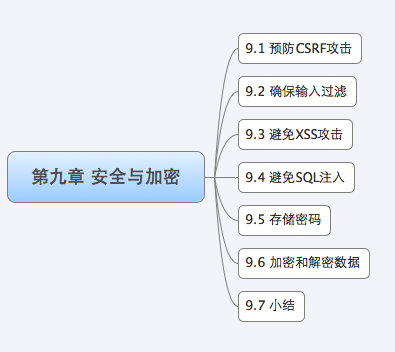
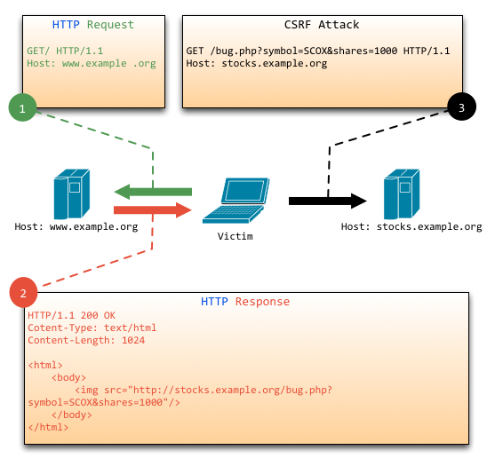

无论是**开发 Web 应用的开发者**还是企图**利用 Web 应用漏洞的攻击者**，对于 Web 程序安全这个话题都给予了越来越多的关注。特别是最近 CSDN 密码泄露事件，更是让我们对 **Web 安全**这个话题更加重视，所有人都谈密码色变，都开始检测自己的系统是否存在漏洞。那么我们作为一名 Go 程序的开发者，一定也需要知道我们的应用程序随时会成为众多攻击者的目标，并提前做好防范的准备。

很多 Web 应用程序中的安全问题都是由于**轻信了第三方提供的数据造成的**。比如对于用户的输入数据，在对其进行验证之前都应该将其视为不安全的数据。如果直接把这些不安全的数据输出到客户端，就可能造成**跨站脚本攻击** (XSS) 的问题。如果把不安全的数据用于数据库查询，那么就可能造成 **SQL 注入**问题，我们将会在 9.3、9.4 小节介绍如何避免这些问题。

在使用第三方提供的数据，包括用户提供的数据时，首先检验这些数据的合法性非常重要，这个过程叫做**过滤**，我们将在 9.2 小节介绍如何保证对所有输入的数据进行过滤处理。

**过滤输入**和**转义输出**并不能解决所有的安全问题，我们将会在 9.1 讲解的 CSRF 攻击，会导致受骗者发送攻击者指定的请求从而造成一些破坏。

与安全加密相关的，能够增强我们的 Web 应用程序的强大手段就是加密，CSDN 泄密事件就是因为密码保存的是明文，使得攻击拿手库之后就可以直接实施一些破坏行为了。不过，和其他工具一样，加密手段也必须运用得当。我们将在 9.5 小节介绍如何存储密码，如何让密码存储的安全。

加密的本质就是**扰乱数据**，某些不可恢复的数据扰乱我们称为单向加密或者散列算法。另外还有一种双向加密方式，也就是可以对加密后的数据进行解密。我们将会在 9.6 小节介绍如何实现这种双向加密方式。

编写这一章的目的是希望读者能够在意识里面加强安全概念，在编写 Web 应用的时候多留心一点，以使我们编写的 Web 应用能远离黑客们的攻击。Go 语言在支持防攻击方面已经提供大量的工具包，我们可以充分的利用这些包来做出一个安全的 Web 应用。

# 1 预防 CSRF 攻击

CSRF（Cross-site request forgery），中文名称：**跨站请求伪造**，也被称为：one click attack/session riding，缩写为：CSRF/XSRF。

那么 CSRF 到底能够干嘛呢？你可以这样简单的理解：**攻击者可以盗用你的登陆信息，以你的身份模拟发送各种请求**。攻击者只要借助少许的社会工程学的诡计，例如通过 QQ 等聊天软件发送的链接 (有些还伪装成短域名，用户无法分辨)，攻击者就能迫使 Web 应用的用户去执行攻击者预设的操作。例如，当用户登录网络银行去查看其存款余额，在他没有退出时，就点击了一个 QQ 好友发来的链接，那么该用户银行帐户中的资金就有可能被转移到攻击者指定的帐户中。

所以遇到 CSRF 攻击时，将对终端用户的数据和操作指令构成严重的威胁；当受攻击的终端用户具有管理员帐户的时候，CSRF 攻击将危及整个 Web 应用程序。

跨站请求伪造，即 CSRF，是一种非常危险的 Web 安全威胁，它被 Web 安全界称为 “沉睡的巨人”，其威胁程度由此 “美誉” 便可见一斑。本小节不仅对跨站请求伪造本身进行了简单介绍，还详细说明造成这种漏洞的原因所在，然后以此提了一些防范该攻击的建议，希望对读者编写安全的 Web 应用能够有所启发。

## 1.1 CSRF 的原理

下图简单阐述了 CSRF 攻击的思想：

从上图可以看出，要完成一次 CSRF 攻击，**受害者**必须依次完成两个步骤 ：

* 登录受信任网站 A，**并在本地生成 Cookie**；
* 在不退出 A 的情况下，危险地访问网站 B。

看到这里，读者也许会问：“如果我不满足以上两个条件中的任意一个，就不会受到 CSRF 的攻击”。是的，确实如此，但你不能保证以下情况不会发生：

* 你不能保证你登录了一个网站后，不再打开一个 tab 页面并访问另外的网站，特别现在浏览器都是支持多 tab 的；
* 你不能保证你关闭浏览器了后，你本地的 Cookie 立刻过期，你上次的会话已经结束；
* 上图中所谓的攻击网站，可能是一个存在其他漏洞的可信任的经常被人访问的网站。

因此对于用户来说很难避免在登陆一个网站之后不点击一些链接进行其他操作，所以随时可能成为 CSRF 的受害者。

CSRF 攻击主要是因为 Web 的**隐式身份验证机制**，Web 的身份验证机制虽然可以保证一个请求是来自于某个用户的浏览器，但却无法保证该请求是用户批准发送的。

## 1.2 如何预防 CSRF

通过上面的介绍，读者是否觉得这种攻击很恐怖，意识到恐怖是个好事情，这样会促使你接着往下看**如何改进和防止类似的漏洞出现**。

CSRF 的防御可以从服务端和客户端两方面着手，防御效果是从服务端着手效果比较好，现在**一般的 CSRF 防御也都在服务端**进行。

服务端的预防 CSRF 攻击的方式方法有多种，但思想上都是差不多的，主要从以下 2 个方面入手：

*  正确使用 GET , POST 和 Cookie；
* 在非 GET 请求中增加伪随机数。

我们上一章介绍过 REST 方式的 Web 应用，一般而言，普通的 Web 应用都是以 GET、POST 为主，还有一种请求是 Cookie 方式。我们一般都是按照如下方式设计应用：

* GET 常用在查看、列举、展示等不需要改变资源属性的时候；
* POST 常用在下达订单、改变一个资源的属性或者做其他一些事情。

接下来我就以 Go 语言来举例说明，**如何限制对资源的访问方法**：

~~~go
mux.Get("/user/:uid", getuser)
mux.Post("/user/:uid", modifyuser)
~~~

这样处理后，因为我们限定了**修改**只能使用 POST，当 GET 方式请求时就拒绝响应，所以上面图示中 GET 方式的 CSRF 攻击就可以防止了，但这样就能全部解决问题了吗？当然不是，因为 POST 也是可以模拟的。

因此我们需要实施第二步，在非 GET 方式的请求中增加随机数，这个大概有三种方式来进行：

* 为每个用户生成一个唯一的 cookie token，所有表单都包含同一个伪随机值，这种方案最简单，因为攻击者不能获得第三方的 Cookie (理论上)，所以表单中的数据也就构造失败，但是由于用户的 Cookie 很容易由于**网站的 XSS 漏洞**而被盗取，所以这个方案必须要在没有 XSS 的情况下才安全。
* 每个请求使用验证码，这个方案是完美的，因为要多次输入验证码，所以用户友好性很差，所以不适合实际运用。
* 不同的表单包含一个不同的伪随机值，我们在 4.4 小节介绍 “如何防止表单多次递交” 时介绍过此方案，复用相关代码，实现如下。

生成随机数 token：

~~~go
h := md5.New()
io.WriteString(h, strconv.FormatInt(crutime, 10))
io.WriteString(h, "ganraomaxxxxxxxxx")
token := fmt.Sprintf("%x", h.Sum(nil))

t, _ := template.ParseFiles("login.gtpl")
t.Execute(w, token)
~~~

输出 token：

~~~html
<input type="hidden" name="token" value="{{.}}">
~~~

Client 访问 Server，做 token 验证：

~~~go
r.ParseForm()
token := r.Form.Get("token")
if token != "" {
    // 验证 token 的合法性
} else {
    // 不存在 token 报错
}
~~~

这样基本就实现了安全的 POST，但是也许你会说如果破解了 token 的算法呢，按照理论上是，但是实际上破解是基本不可能的，因为有人曾计算过，暴力破解该串大概需要 2 的 11 次方时间。

# 2 确保输入过滤

过滤用户数据是 Web 应用安全的基础。它是验证数据合法性的过程。通过对所有的输入数据进行过滤，可以避免恶意数据在程序中被误信或误用。大多数 Web 应用的漏洞都是因为没有对用户输入的数据进行恰当过滤所引起的。

我们介绍的过滤数据分成三个步骤：

1. 识别数据，搞清楚需要过滤的数据来自于哪里；
2. 过滤数据，弄明白我们需要什么样的数据；
3. 区分已过滤及被污染数据，如果存在攻击数据那么保证过滤之后可以让我们使用更安全的数据。

## 2.1 识别数据

“识别数据” 作为第一步是因为在你不知道 **“数据是什么，它来自于哪里”** 的前提下，你也就不能正确地过滤它。这里的数据是指所有源自非代码内部提供的数据。例如：所有**来自客户端的数据**，但客户端并不是唯一的外部数据源，**数据库**和**第三方提供的接口数据**等也可以是**外部数据源**。

由用户输入的数据我们通过 Go 非常容易识别，Go 通过 r.ParseForm 之后，把用户 POST 和 GET 的数据全部放在了 r.Form 里面。其它的输入要难识别得多，例如，r.Header 中的很多元素是由客户端所操纵的。常常很难确认其中的哪些元素组成了输入，所以，最好的方法是把里面所有的数据都看成是用户输入。(例如 r.Header.Get("Accept-Charset") 这样的也看做是用户输入，虽然这些大多数是浏览器操纵的)。

数据过滤在 Web 安全中起到一个基石的作用，大多数的安全问题都是由于没有过滤数据和验证数据引起的，例如前面小节的 CSRF 攻击，以及接下来将要介绍的 XSS 攻击、SQL 注入等都是没有认真地过滤数据引起的，因此我们需要特别重视这部分的内容。

## 2.2 过滤数据

在知道数据来源之后，就可以过滤它了。**过滤**是一个有点正式的术语，它在平时表述中有很多同义词，如**验证**、**清洁**及**净化**。尽管这些术语表面意义不同，但它们都是指的同一个处理：**防止非法数据进入你的应用**。

过滤数据有很多种方法，其中有一些安全性较差。最好的方法是把过滤看成是一个检查的过程，在你使用数据之前都检查一下看它们是否是符合合法数据的要求。而且**不要试图好心地去纠正非法数据，而要让用户按你制定的规则去输入数据**。历史证明了试图纠正非法数据往往会导致安全漏洞。这里举个例子：“最近建设银行系统升级之后，如果密码后面两位是 0，只要输入前面四位就能登录系统”，这是一个非常严重的漏洞。

过滤数据主要采用如下一些库来操作：

1. strconv 包下面的字符串转化相关函数，因为从 Request 中的 r.Form 返回的是字符串，而有些时候我们需要将之转化成整 / 浮点数，Atoi、ParseBool、ParseFloat、ParseInt 等函数就可以派上用场了。
2. string 包下面的一些过滤函数 Trim、ToLower、ToTitle 等函数，能够帮助我们按照指定的格式获取信息。
3. regexp 包用来处理一些复杂的需求，例如判定输入是否是 Email、生日之类。

过滤数据除了检查验证之外，在特殊时候，还可以采用白名单。即假定你正在检查的数据都是非法的，除非能证明它是合法的。使用这个方法，如果出现错误，只会导致把合法的数据当成是非法的，而不会是相反，尽管我们不想犯任何错误，但这样总比把非法数据当成合法数据要安全得多。

## 2.3 区分过滤数据

如果完成了上面的两步，数据过滤的工作就基本完成了，但是在编写 Web 应用的时候我们还需要区分已过滤和被污染数据，因为这样可以保证过滤数据的完整性，而不影响输入的数据。我们约定把所有经过过滤的数据放入一个叫全局的 Map 变量中 (CleanMap)。这时需要用两个重要的步骤来防止被污染数据的注入：

* 每个请求都要初始化 CleanMap 为一个空 Map；
* 加入检查及阻止来自外部数据源的变量命名为 CleanMap。

接下来，让我们通过一个例子来巩固这些概念，请看下面这个表单：

~~~html
<form action="/whoami" method="POST">
    我是谁:
    <select name="name">
        <option value="astaxie">astaxie</option>
        <option value="herry">herry</option>
        <option value="marry">marry</option>
    </select>
    <input type="submit" />
</form>
~~~

在处理这个表单的编程逻辑中，非常容易犯的错误是认为只能提交三个选择中的一个。其实攻击者可以模拟 POST 操作，递交 `name=attack` 这样的数据，所以在此时我们需要做类似白名单的处理：

~~~go
r.ParseForm()
name := r.Form.Get("name")
CleanMap := make(map[string]interface{}, 0)
if name == "astaxie" || name == "herry" || name == "marry" {
    CleanMap["name"] = name
}
~~~

上面代码中我们初始化了一个 CleanMap 的变量，当判断获取的 name 是 astaxie、herry、marry 三个中的一个之后，我们把数据存储到了 CleanMap 之中，这样就可以确保 CleanMap ["name"] 中的数据是合法的，从而在代码的其它部分使用它。当然我们还可以在 else 部分增加非法数据的处理，一种可能是再次显示表单并提示错误。但是不要试图为了友好而输出被污染的数据。

上面的方法对于过滤一组已知的合法值的数据很有效，但是对于过滤有一组已知合法字符组成的数据时就没有什么帮助。例如，你可能需要一个用户名只能由字母及数字组成：

~~~go
r.ParseForm()
username := r.Form.Get("username")
CleanMap := make(map[string]interface{}, 0)
if ok, _ := regexp.MatchString("^[a-zA-Z0-9]+$", username); ok {
    CleanMap["username"] = username
}
~~~

# 3 避免 XSS 攻击

随着互联网技术的发展，现在的 Web 应用都含有大量的**动态内容**以提高用户体验。**所谓动态内容，就是应用程序能够根据用户环境和用户请求，输出相应的内容**。动态站点会受到一种名为 “跨站脚本攻击”（Cross Site Scripting, 安全专家们通常将其缩写成 XSS）的威胁，而静态站点则完全不受其影响。

XSS 漏洞是相当有危害的，在开发 Web 应用的时候，一定要记住过滤数据，特别是在输出到客户端之前，这是现在行之有效的防止 XSS 的手段。

## 3.1 什么是 XSS

XSS 攻击：跨站脚本攻击 (Cross-Site Scripting)，为了不和层叠样式表 (Cascading Style Sheets, CSS) 的缩写混淆，故将跨站脚本攻击缩写为 XSS。XSS 是**一种常见的 Web 安全漏洞**，它允许攻击者将恶意代码植入到提供给其它用户使用的页面中。不同于大多数攻击 (一般只涉及攻击者和受害者)，XSS 涉及到三方，即攻击者、客户端与 Web 应用。**XSS 的攻击目标是为了盗取存储在客户端的 cookie 或者其他网站用于识别客户端身份的敏感信息**。一旦获取到合法用户的信息后，攻击者甚至可以假冒合法用户与网站进行交互。

XSS 通常可以分为两大类：

1. 一类是**存储型 XSS**，主要出现在让用户输入数据，供其他浏览此页的用户进行查看的地方，包括留言、评论、博客日志和各类表单等。应用程序从数据库中查询数据，在页面中显示出来，攻击者在相关页面输入恶意的脚本数据后，用户浏览此类页面时就可能受到攻击。这个流程简单可以描述为：恶意用户的 Html 输入 Web 程序 -> 进入数据库 -> Web 程序 -> 用户浏览器。
2. 另一类是**反射型 XSS**，主要做法是将脚本代码加入 URL 地址的请求参数里，请求参数进入程序后在页面直接输出，用户点击类似的恶意链接就可能受到攻击。

XSS 目前主要的手段和目的如下：

* 盗用 cookie，获取敏感信息。
* 利用植入 Flash，通过 crossdomain 权限设置进一步获取更高权限；或者利用 Java 等得到类似的操作。
* 利用 iframe、frame、XMLHttpRequest 或上述 Flash 等方式，以（被攻击者）用户的身份执行一些管理动作，或执行一些如：发微博、加好友、发私信等常规操作，前段时间新浪微博就遭遇过一次 XSS。
* 利用可被攻击的域受到其他域信任的特点，以受信任来源的身份请求一些平时不允许的操作，如进行不当的投票活动。
* 在访问量极大的一些页面上的 XSS 可以攻击一些小型网站，实现 DDoS 攻击的效果。

## 3.2 XSS 原理

Web 应用未对用户提交请求的数据做充分的检查过滤，允许用户在提交的数据中掺入 HTML 代码 (最主要的是 “>”、“<”)，并将未经转义的恶意代码输出到第三方用户的浏览器解释执行，是导致 XSS 漏洞的产生原因。

接下来以**反射性 XSS** 举例说明 XSS 的过程：现在有一个网站，根据参数输出用户的名称，例如访问 url：`http://127.0.0.1/?name=astaxie`，就会在浏览器输出如下信息：

~~~html
hello astaxie
~~~

如果我们传递这样的 `url：http://127.0.0.1/?name=`， 这时你就会发现浏览器跳出一个弹出框，这说明站点已经存在了 XSS 漏洞。那么恶意用户是如何盗取 Cookie 的呢？与上类似，如下这样的 `url：http://127.0.0.1/?name=`，这样就可以把当前的 cookie 发送到指定的站点：www.xxx.com。你也许会说，这样的 URL 一看就有问题，怎么会有人点击！是的，这类的 URL 会让人怀疑，但如果使用短网址服务将之缩短，你还看得出来么？攻击者将缩短过后的 url 通过某些途径传播开来，不明真相的用户一旦点击了这样的 url，相应 cookie 数据就会被发送事先设定好的站点，这样子就盗得了用户的 cookie 信息，然后就可以利用 `Websleuth` 之类的工具来检查是否能盗取那个用户的账户。

## 3.3 如何预防 XSS

答案很简单，**坚决不要相信用户的任何输入**，并过滤掉输入中的所有特殊字符。这样就能消灭绝大部分的 XSS 攻击。

目前防御 XSS 主要有如下几种方式：

1. 过滤特殊字符；

   避免 XSS 的方法之一主要是将用户所提供的内容进行过滤，Go 语言提供了 HTML 的过滤函数：text/template 包下面的 HTMLEscapeString、JSEscapeString 等函数。

2. 使用 HTTP 头指定类型：`w.Header().Set("Content-Type","text/javascript")` 这样就可以让浏览器解析 JavaScript 代码，而不会是 html 输出。

# 4 避免 SQL 注入

SQL 注入攻击（SQL Injection），简称注入攻击，是 Web 开发中最常见的一种安全漏洞。可以用它来从数据库获取敏感信息，或者利用数据库的特性执行添加用户，导出文件等一系列恶意操作，甚至有可能获取数据库乃至系统用户最高权限。

而造成 SQL 注入的原因是因为程序没有有效过滤用户的输入，使攻击者成功地向服务器提交恶意的 SQL 查询代码，程序在接收后错误的将攻击者的输入作为查询语句的一部分执行，导致原始的查询逻辑被改变，额外的执行了攻击者精心构造的恶意代码。

SQL 注入是危害相当大的安全漏洞。所以对于我们平常编写的 Web 应用，应该对于每一个小细节都要非常重视，**细节决定命运，生活如此**，编写 Web 应用也是这样。

## 4.1 SQL 注入示例

很多 Web 开发者没有意识到 SQL 查询是可以被篡改的，从而把 SQL 查询当作可信任的命令。殊不知，SQL 查询是可以绕开访问控制，从而绕过身份验证和权限检查的。更有甚者，有可能通过 SQL 查询去运行主机系统级的命令。

下面将通过一些真实的例子来详细讲解 SQL 注入的方式。

考虑以下简单的登录表单：

~~~html
<form action="/login" method="POST">

Username: <input type="text" name="username" />

Password: <input type="password" name="password" />

<input type="submit" value="登陆" />

</form>
~~~

我们的处理里面的 SQL 可能是这样的：

~~~go
username:=r.Form.Get("username")
password:=r.Form.Get("password")
sql:="SELECT * FROM user WHERE username='"+username+"' AND password='"+password+"'"
~~~

如果用户的输入的用户名如下，密码任意：

~~~go
myuser' or 'foo' = 'foo' --
~~~

那么我们的 SQL 变成了如下所示：

~~~sql
SELECT * FROM user WHERE username='myuser' or 'foo' = 'foo' --'' AND password='xxx'
~~~

在 SQL 里面 -- 是注释标记，所以查询语句会在此中断。这就让攻击者在不知道任何合法用户名和密码的情况下成功登录了。

对于 MSSQL 还有更加危险的一种 SQL 注入，就是控制系统，下面这个可怕的例子将演示如何在某些版本的 MSSQL 数据库上执行系统命令：

~~~go
sql:="SELECT * FROM products WHERE name LIKE '%"+prod+"%'"
Db.Exec(sql)
~~~

如果攻击提交 `a%' exec master..xp_cmdshell 'net user test testpass /ADD' --` 作为变量 prod 的值，那么 sql 将会变成：

~~~sql
SELECT * FROM products WHERE name LIKE '%a%' exec master..xp_cmdshell 'net user test testpass /ADD'--%'
~~~

MSSQL 服务器会执行这条 SQL 语句，包括它后面那个用于向系统添加新用户的命令。如果这个程序是以 sa 运行而 MSSQLSERVER 服务又有足够的权限的话，攻击者就可以获得一个系统帐号来访问主机了。

虽然以上的例子是针对某一特定的数据库系统的，但是这并不代表不能对其它数据库系统实施类似的攻击。针对这种安全漏洞，只要使用不同方法，各种数据库都有可能遭殃。

## 4.2 如何预防 SQL 注入

也许你会说攻击者要知道数据库结构的信息才能实施 SQL 注入攻击。确实如此，但没人能保证攻击者一定拿不到这些信息，一旦他们拿到了，数据库就存在泄露的危险。如果你在用开放源代码的软件包来访问数据库，比如论坛程序，攻击者就很容易得到相关的代码。如果这些代码设计不良的话，风险就更大了。目前 Discuz、phpwind、phpcms 等这些流行的开源程序都有被 SQL 注入攻击的先例。

这些攻击总是发生在安全性不高的代码上。所以，**永远不要信任外界输入的数据**，特别是来自于用户的数据，包括选择框、表单隐藏域和 cookie。就如上面的第一个例子那样，就算是正常的查询也有可能造成灾难。

SQL 注入攻击的危害这么大，那么该如何来防治呢？下面这些建议或许对防治 SQL 注入有一定的帮助：

1. 严格限制 Web 应用的数据库的操作权限，**给此用户提供仅仅能够满足其工作的最低权限**，从而最大限度的减少注入攻击对数据库的危害。
2. 检查输入的数据是否具有所期望的数据格式，严格限制变量的类型，例如使用 regexp 包进行一些匹配处理，或者使用 strconv 包对字符串转化成其他基本类型的数据进行判断。
3. 对进入数据库的特殊字符（'"\ 尖括号 &*; 等）进行转义处理，或编码转换。Go 的 text/template 包里面的 HTMLEscapeString 函数可以对字符串进行转义处理。
4. 所有的查询语句建议使用数据库提供的参数化查询接口，参数化的语句使用参数而不是将用户输入变量嵌入到 SQL 语句中，即不要直接拼接 SQL 语句。例如使用 database/sql 里面的查询函数 Prepare 和 Query，或者 Exec(query string, args ...interface{})。
5. 在应用发布之前建议使用专业的 SQL 注入检测工具进行检测，以及时修补被发现的 SQL 注入漏洞。网上有很多这方面的开源工具，例如 sqlmap、SQLninja 等。
6. 避免网站打印出 SQL 错误信息，比如类型错误、字段不匹配等，把代码里的 SQL 语句暴露出来，以防止攻击者利用这些错误信息进行 SQL 注入。

# 5 存储密码

过去一段时间以来，许多的网站遭遇用户密码数据泄露事件，这其中包括顶级的互联网企业 – Linkedin, 国内诸如 CSDN，该事件横扫整个国内互联网，随后又爆出多玩游戏 800 万用户资料被泄露，另有传言人人网、开心网、天涯社区、世纪佳缘、百合网等社区都有可能成为黑客下一个目标。层出不穷的类似事件给用户的网上生活造成巨大的影响，人人自危，因为人们往往习惯在不同网站使用相同的密码，所以一家 “暴库”，全部遭殃。

那么我们作为一个 Web 应用开发者，在选择**密码存储方案**时，容易掉入哪些陷阱，以及如何避免这些陷阱？

## 5.1 普通方案

目前用的最多的密码存储方案是**将明文密码做单向哈希后存储**，单向哈希算法有一个特征：无法通过哈希后的摘要 (digest) 恢复原始数据，这也是 “单向” 二字的来源。常用的单向哈希算法包括 SHA-256, SHA-1, MD5 等。

Go 语言对这三种加密算法的实现如下所示：

~~~go
package main

import (
	"crypto/md5"
	"crypto/sha1"
	"crypto/sha256"
	"fmt"
	"io"
)

func main() {
	password := "123456"

	h := sha256.New()
	io.WriteString(h, password)
	fmt.Printf("%d, % x\n", len(h.Sum(nil)), h.Sum(nil))

	h = sha1.New()
	io.WriteString(h, password)
	fmt.Printf("%d, % x\n", len(h.Sum(nil)), h.Sum(nil))

	h = md5.New()
	io.WriteString(h, password)
	fmt.Printf("%d, % x\n", len(h.Sum(nil)), h.Sum(nil))
}

32, 8d 96 9e ef 6e ca d3 c2 9a 3a 62 92 80 e6 86 cf 0c 3f 5d 5a 86 af f3 ca 12 02 0c 92 3a dc 6c 92
20, 7c 4a 8d 09 ca 37 62 af 61 e5 95 20 94 3d c2 64 94 f8 94 1b
16, e1 0a dc 39 49 ba 59 ab be 56 e0 57 f2 0f 88 3e
~~~

单向哈希有两个特性：

1. 同一个密码进行单向哈希，得到的总是唯一确定的摘要。
2. 计算速度快。随着技术进步，一秒钟能够完成数十亿次单向哈希计算。

结合上面两个特点，考虑到多数人所使用的密码为常见的组合，攻击者可以将所有密码的常见组合进行单向哈希（加密算法），得到一个摘要组合，然后与数据库中的摘要进行比对即可获得对应的密码。这个摘要组合也被称为 rainbow table **彩虹表**，这种行为也称为**撞库**。

因此通过单向加密之后存储的数据，和明文存储没有多大区别。因此，一旦网站的数据库泄露，所有用户的密码本身就大白于天下。

## 5.2 进阶方案

通过上面介绍我们知道黑客可以用 rainbow table 来破解哈希后的密码，很大程度上是因为加密时使用的**哈希算法是公开的**。**如果黑客不知道加密的哈希算法是什么，那他也就无从下手了**。

一个直接的解决办法是，自己设计一个哈希算法。然而，一个好的哈希算法是很难设计的 —— 既要避免碰撞，又不能有明显的规律，做到这两点要比想象中的要困难很多。因此实际应用中更多的是利用已有的哈希算法进行多次哈希。

但是单纯的多次哈希，依然阻挡不住黑客。两次 MD5、三次 MD5 之类的方法，我们能想到，黑客自然也能想到。特别是对于一些开源代码，这样哈希更是相当于直接把算法告诉了黑客。

**没有攻不破的盾，但也没有折不断的矛**。现在安全性比较好的网站，都会用**一种叫做 “加盐” 的方式来存储密码，**也就是常说的 “salt”。他们通常的做法是，先将用户输入的密码进行一次 MD5（或其它哈希算法）加密；将得到的 MD5 值前后加上一些只有管理员自己知道的随机串，再进行一次 MD5 加密。这个随机串中可以包括某些固定的串，也可以包括用户名（用来保证每个用户加密使用的密钥都不一样）：

~~~go
package main

import (
	"crypto/md5"
	"fmt"
	"io"
)

func main() {
	password := "123456"

	h := md5.New()
	io.WriteString(h, password)

	pfmd5 := fmt.Sprintf("%x", h.Sum(nil))
	fmt.Println(pfmd5)

	salt1 := "@#$%"
	salt2 := "^&*()"

	io.WriteString(h, salt1)
	io.WriteString(h, "userName")
	io.WriteString(h, salt2)
	io.WriteString(h, pfmd5)

	last := fmt.Sprintf("%x", h.Sum(nil))
	fmt.Println(last)
}

e10adc3949ba59abbe56e057f20f883e
acbfd544214bedae71f99bae39c89c6b
~~~

## 5.3 专家方案

上面的进阶方案在几年前也许是足够安全的方案，因为攻击者没有足够的资源建立这么多的 rainbow table。 但是，时至今日，因为并行计算能力的提升，这种攻击已经完全可行。

怎么解决这个问题呢？只要时间与资源允许，没有破译不了的密码，所以方案是：故意增加密码计算所需耗费的资源和时间，使得任何人都不可获得足够的资源建立所需的 rainbow table。

这类方案有一个特点，算法中都有个因子，用于指明计算密码摘要所需要的资源和时间，也就是计算强度。计算强度越大，攻击者建立 rainbow table 越困难，以至于不可继续。

这里推荐 scrypt 方案，scrypt 是由著名的 FreeBSD 黑客 Colin Percival 为他的备份服务 `Tarsnap` 开发的。

目前 Go 语言里面支持的库 code.google.com/p/go/source/browse?... (无法使用)。

看到这里，如果你产生了危机感，那么就行动起来：

1. 如果你是普通用户，那么我们建议**使用 LastPass 进行密码存储和生成**，对不同的网站使用不同的密码；
2. 如果你是开发人员， 那么我们强烈建议你采用专家方案进行密码存储。

# 6 加密和解密过程

前面小节介绍了如何存储密码，但是有的时候，我们想**把一些敏感数据加密后存储起来**，在将来的某个时候，随需将它们解密出来，此时我们应该在选用对称加密算法来满足我们的需求。

这小节介绍了几种加解密的算法，在开发 Web 应用的时候可以根据需求采用不同的方式进行加解密，一般的应用可以采用 base64 算法，更加高级的话可以采用 AES 或者 DES 算法。

## 6.1 base64 加解密

如果 Web 应用足够简单，数据的安全性没有那么严格的要求，那么可以采用一种比较简单的加解密方法是 base64，这种方式实现起来比较简单，Go 语言的 base64 包已经很好的支持了这个，请看下面的例子：

~~~go
package main

import (
	"encoding/base64"
	"fmt"
)

func base64Encode(src []byte) []byte {
	return []byte(base64.StdEncoding.EncodeToString(src))
}

func base64Decode(src []byte) ([]byte, error) {
	return base64.StdEncoding.DecodeString(string(src))
}

func main() {
	password := "123456"

	decodeByte := base64Encode([]byte(password))
	fmt.Printf("%x\n", decodeByte)

	origin, err := base64Decode(decodeByte)
	if err != nil {
		fmt.Println(err.Error())
	}

	if password != string(origin) {
		fmt.Println("Error!")
	}

	fmt.Println(string(origin))
}
~~~

## 6.2 高级加解密

Go 语言的 crypto 里面支持对称加密的高级加解密包有：

* crypto/aes 包：AES (Advanced Encryption Standard)，又称 Rijndael 加密法，是美国联邦政府采用的一种区块加密标准。
* crypto/des 包：DES (Data Encryption Standard)，是一种**对称加密标**准，是目前使用最广泛的密钥系统，特别是在保护金融数据的安全中。曾是美国联邦政府的加密标准，但现已被 AES 所替代。

因为这两种算法使用方法类似，所以在此，我们仅用 AES 包为例来讲解它们的使用，请看下面的例子：

~~~go
package main

import (
	"crypto/aes"
	"crypto/cipher"
	"fmt"
	"os"
)

var commonIV = []byte{
	0x00, 0x01, 0x02, 0x03,
	0x04, 0x05, 0x06, 0x07,
	0x08, 0x09, 0x0a, 0x0b,
	0x0c, 0x0d, 0x0e, 0x0f,
}

func main() {
	password := "123456"
	plainText := []byte(password)

	keyText := "astaxie12798国jzmknm.ahkjklj中"
	fmt.Println("len(key)=", len(keyText))
	// cipher.Block 实例，创建加密算法
	c, err := aes.NewCipher([]byte(keyText))
	if err != nil {
		// Error: NewCipher(6 bytes) = crypto/aes: invalid key size 6
		fmt.Printf("Error: NewCipher(%d bytes) = %s\n", len(keyText), err)
		os.Exit(-1)
	}

	// 加密字符串
	cfb := cipher.NewCFBEncrypter(c, commonIV)
	cipherText := make([]byte, len(plainText))
	cfb.XORKeyStream(cipherText, plainText)
	fmt.Printf("%s===>%s\n", plainText, cipherText)

	cfbdec := cipher.NewCFBDecrypter(c, commonIV)
	plaintextCopy := make([]byte, len(plainText))
	cfbdec.XORKeyStream(plaintextCopy, cipherText)
	fmt.Printf("%s===>%s\n", cipherText, plaintextCopy)
}
len(key)= 32
123456===>H�?�,
H�?�,===>123456
~~~

上面通过调用函数 aes.NewCipher (参数 key 必须是 16、24 或者 32 位的 [] byte，分别对应 AES-128, AES-192 或 AES-256 算法), 返回了一个 cipher.Block 接口，这个接口实现了三个功能：

~~~go
// A Block represents an implementation of block cipher
// using a given key. It provides the capability to encrypt
// or decrypt individual blocks. The mode implementations
// extend that capability to streams of blocks.
type Block interface {
	// BlockSize returns the cipher's block size.
	BlockSize() int

	// Encrypt encrypts the first block in src into dst.
	// Dst and src must overlap entirely or not at all.
	Encrypt(dst, src []byte)

	// Decrypt decrypts the first block in src into dst.
	// Dst and src must overlap entirely or not at all.
	Decrypt(dst, src []byte)
}
~~~

这三个函数实现了加解密操作，详细的操作请看上面的例子。

