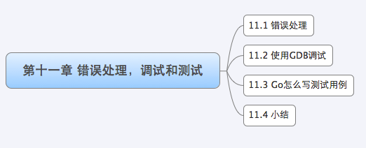

我们经常会看到很多程序员大部分的 "编程" 时间都花费在检查 bug 和修复 bug 上。无论你是在编写修改代码还是重构系统，几乎都是花费大量的时间在进行故障排除和测试，外界都觉得我们程序员是**设计师**，**能够把一个系统从无做到有，是一项很伟大的工作，而且是相当有趣的工作**，但事实上我们每天都是**徘徊在排错、调试、测试**之间。当然如果你有**良好的习惯和技术方案**来直面这些问题，那么你就有可能将排错时间减到最少，而尽可能的将时间花费在更有价值的事情上。

但是遗憾的是很多程序员不愿意在错误处理、调试和测试能力上下工夫，导致后面应用上线之后查找错误、定位问题花费更多的时间。所以我们在设计应用之前就做好**错误处理规划、测试用例**等，那么将来修改代码、升级系统都将变得简单。

开发 Web 应用过程中，错误自然难免，那么如何更好的找到错误原因，解决问题呢？1 小节将介绍 Go 语言中如何处理错误，如何设计自己的包、函数的错误处理，2 小节将介绍如何使用 GDB 来调试我们的程序，动态运行情况下各种变量信息，运行情况的监控和调试。3 小节将对 Go 语言中的单元测试进行深入的探讨，并示例如何来编写单元测试，Go 的单元测试规则规范如何定义，以保证以后升级修改运行相应的测试代码就可以进行最小化的测试。

长期以来，**培养良好的调试、测试习惯一直是很多程序员逃避的事情**，所以现在你不要再逃避了，就从你现在的项目开发，从学习 Go Web 开发开始养成良好的习惯。

# 1 错误处理

Go 语言主要的设计准则是：简洁、明白。

* **简洁**是指语法和 C 类似，相当的简单；
* **明白**是指任何语句都是很明显的，不含有任何隐含的东西。

在错误处理方案的设计中也贯彻了这一思想。我们知道在 C 语言里面是通过返回 -1 或者 NULL 之类的信息来表示错误，但是对于使用者来说，不查看相应的 API 说明文档，根本搞不清楚这个返回值究竟代表什么意思，比如：返回 0 是成功，还是失败，而 Go 定义了一个叫做 error 的类型，来显式表达错误。在使用时，通过把返回的 error 变量与 nil 的比较，来判定操作是否成功。例如 `os.Open` 函数在打开文件失败时将返回一个不为 nil 的 error 变量：

~~~go
func Open(name string) (file *File, err error)
~~~

下面这个例子通过调用 `os.Open` 打开一个文件，如果出现错误，那么就会调用 `log.Fatal` 来输出错误信息：

~~~go
f, err := os.Open("filename.ext")
if err != nil {
    log.Fatal(err)
}
~~~

类似于 `os.Open` 函数，标准包中**所有可能出错**的 API 都会返回一个 error 变量，以方便错误处理，这个小节将详细地介绍 error 类型的设计，和讨论开发 Web 应用中如何更好地处理 error。

## 1.1 Error 类型

error 类型是一个接口类型，这是它的定义：

~~~go
type error interface {
    Error() string
}
~~~

error 是一个内置的接口类型，我们可以在 `/builtin/` 包下面找到相应的定义。而我们在很多内部包里面用到的 error 是 errors 包下面的实现的私有结构 `errorString`：

~~~go
// Copyright 2011 The Go Authors. All rights reserved.
// Use of this source code is governed by a BSD-style
// license that can be found in the LICENSE file.

// Package errors implements functions to manipulate errors.
//
// The New function creates errors whose only content is a text message.
//
// The Unwrap, Is and As functions work on errors that may wrap other errors.
// An error wraps another error if its type has the method
//
//	Unwrap() error
//
// If e.Unwrap() returns a non-nil error w, then we say that e wraps w.
//
// Unwrap unpacks wrapped errors. If its argument's type has an
// Unwrap method, it calls the method once. Otherwise, it returns nil.
//
// A simple way to create wrapped errors is to call fmt.Errorf and apply the %w verb
// to the error argument:
//
//	errors.Unwrap(fmt.Errorf("... %w ...", ..., err, ...))
//
// returns err.
//
// Is unwraps its first argument sequentially looking for an error that matches the
// second. It reports whether it finds a match. It should be used in preference to
// simple equality checks:
//
//	if errors.Is(err, os.ErrExist)
//
// is preferable to
//
//	if err == os.ErrExist
//
// because the former will succeed if err wraps os.ErrExist.
//
// As unwraps its first argument sequentially looking for an error that can be
// assigned to its second argument, which must be a pointer. If it succeeds, it
// performs the assignment and returns true. Otherwise, it returns false. The form
//
//	var perr *os.PathError
//	if errors.As(err, &perr) {
//		fmt.Println(perr.Path)
//	}
//
// is preferable to
//
//	if perr, ok := err.(*os.PathError); ok {
//		fmt.Println(perr.Path)
//	}
//
// because the former will succeed if err wraps an *os.PathError.
package errors

// errorString is a trivial implementation of error.
type errorString struct {
	s string
}

func (e *errorString) Error() string {
	return e.s
}

~~~

你可以通过 `errors.New` 把一个字符串转化为 `errorString`，以得到一个满足接口 error 的对象，其内部实现如下：

~~~go
// New returns an error that formats as the given text.
// Each call to New returns a distinct error value even if the text is identical.
func New(text string) error {
	return &errorString{text}
}
~~~

下面这个例子演示了如何使用 `errors.New`：

~~~go
func Sqrt(f float64) (float64, error) {
    if f < 0 {
        return 0, errors.New("math: square root of negative number")
    }
    // implementation
}
~~~

在下面的例子中，我们在调用 Sqrt 的时候传递的一个负数，然后就得到了 non-nil 的 error 对象，将此对象与 nil 比较，结果为 true，所以 `fmt.Println` (fmt 包在处理 error 时会调用 Error 方法) 被调用，以输出错误，请看下面调用的示例代码：

~~~go
f, err := Sqrt(-1)
if err != nil {
    fmt.Println(err)
}   
~~~

## 1.2 自定义 Error

通过上面的介绍我们知道 error 是一个 interface，所以在实现自己的包的时候，通过定义实现此接口的结构，我们就可以实现自己的错误定义，请看来自 json 包的示例：

~~~go
type SyntaxError struct {
    msg    string // 错误描述
    Offset int64  // 错误发生的位置
}

func (e *SyntaxError) Error() string { return e.msg }
~~~

Offset 字段在调用 Error 的时候不会被打印，但是我们可以通过类型断言获取错误类型，然后可以打印相应的错误信息，请看下面的例子:

~~~go
if err := dec.Decode(&val); err != nil {
    if serr, ok := err.(*json.SyntaxError); ok {
        line, col := findLine(f, serr.Offset)
        return fmt.Errorf("%s:%d:%d: %v", f.Name(), line, col, err)
    }
    return err
}
~~~

需要注意的是，函数返回自定义错误时，**返回值推荐设置为 error 类型，而非自定义错误类型**，特别需要注意的是**不应预声明自定义错误类型的变量**。例如：

~~~go

func Decode() *SyntaxError { // 错误，将可能导致上层调用者 err!=nil 的判断永远为 true。
    var err *SyntaxError     // 预声明错误变量
    if 出错条件 {
        err = &SyntaxError{}
    }
    return err               // 错误，err 永远等于非 nil，导致上层调用者 err!=nil 的判断始终为 true
}
~~~

上面例子简单的演示了如何自定义 Error 类型。但是如果我们还需要**更复杂的错误处理**呢？此时，我们来参考一下 net 包采用的方法：

~~~go
package net

type Error interface {
    error
    Timeout() bool   // Is the error a timeout?
    Temporary() bool // Is the error temporary?
}
~~~

在调用的地方，通过类型断言 err 是不是 net.Error, 来**细化错误的处理**，例如下面的例子，如果一个网络发生临时性错误，那么将会 sleep 1 秒之后重试：

~~~go
if nerr, ok := err.(net.Error); ok && nerr.Temporary() {
    time.Sleep(1e9)
    continue
}
if err != nil {
    log.Fatal(err)
}
~~~

## 1.3 错误处理

Go 在错误处理上采用了与 C 类似的检查返回值的方式，而不是其他多数主流语言采用的异常方式，这造成了代码编写上的一个很大的缺点：错误处理代码的冗余，对于这种情况是我们通过复用检测函数来减少类似的代码。

请看下面这个例子代码：

~~~go

func init() {
    http.HandleFunc("/view", viewRecord)
}

func viewRecord(w http.ResponseWriter, r *http.Request) {
    c := appengine.NewContext(r)
    key := datastore.NewKey(c, "Record", r.FormValue("id"), 0, nil)
    record := new(Record)
    // 获取数据
    if err := datastore.Get(c, key, record); err != nil {
        http.Error(w, err.Error(), 500)
        return
    }
    // 模板展示
    if err := viewTemplate.Execute(w, record); err != nil {
        http.Error(w, err.Error(), 500)
    }
}
~~~

上面的例子中**获取数据**和**模板展示**调用时都有检测错误，当有错误发生时，**调用了统一的处理函数** http.Error，返回给客户端 500 错误码，并显示相应的错误数据。但是当越来越多的 HandleFunc 加入之后，这样的错误处理逻辑代码就会越来越多，其实我们可以通过**自定义路由器**来缩减代码 (实现的思路可以参考第三章的 HTTP 详解)。

~~~go
type appHandler func(http.ResponseWriter, *http.Request) error

func (fn appHandler) ServeHTTP(w http.ResponseWriter, r *http.Request) {
    if err := fn(w, r); err != nil {
        http.Error(w, err.Error(), 500)
    }
}
~~~

上面我们定义了自定义的路由器，然后我们可以通过如下方式来注册函数：

~~~go
func init() {
    http.Handle("/view", appHandler(viewRecord))
}
~~~

当请求 /view 的时候我们的逻辑处理可以变成如下代码，和第一种实现方式相比较已经简单了很多：

~~~go
func viewRecord(w http.ResponseWriter, r *http.Request) error {
    c := appengine.NewContext(r)
    key := datastore.NewKey(c, "Record", r.FormValue("id"), 0, nil)
    record := new(Record)
    if err := datastore.Get(c, key, record); err != nil {
        return err
    }
    return viewTemplate.Execute(w, record)
}
~~~

上面的例子错误处理的时候所有的错误返回给用户的都是 500 错误码，然后打印出来相应的错误代码，其实我们可以把这个错误信息定义的更加友好，调试的时候也方便定位问题，我们可以自定义返回的错误类型：

~~~go
type appError struct {
    Error   error
    Message string
    Code    int
}
~~~

这样我们的自定义路由器可以改成如下方式：

~~~go
type appHandler func(http.ResponseWriter, *http.Request) *appError

func (fn appHandler) ServeHTTP(w http.ResponseWriter, r *http.Request) {
    if e := fn(w, r); e != nil { // e is *appError, not os.Error.
        c := appengine.NewContext(r)
        c.Errorf("%v", e.Error)
        http.Error(w, e.Message, e.Code)
    }
}
~~~

这样修改完自定义错误之后，我们的逻辑处理可以改成如下方式：

~~~go
func viewRecord(w http.ResponseWriter, r *http.Request) *appError {
    c := appengine.NewContext(r)
    key := datastore.NewKey(c, "Record", r.FormValue("id"), 0, nil)
    record := new(Record)
    if err := datastore.Get(c, key, record); err != nil {
        return &appError{err, "Record not found", 404}
    }
    if err := viewTemplate.Execute(w, record); err != nil {
        return &appError{err, "Can't display record", 500}
    }
    return nil
}
~~~

如上所示，在我们访问 view 的时候可以根据不同的情况获取不同的错误码和错误信息，虽然这个和第一个版本的代码量差不多，但是这个显示的错误更加明显，提示的错误信息更加友好，扩展性也比第一个更好。

在程序设计中，**容错**是**相当重要的一部分工作**，在 Go 中它是通过错误处理来实现的，error 虽然只是一个接口，但是其变化却可以有很多，我们可以根据自己的需求来实现不同的处理，最后介绍的错误处理方案，希望能给大家在如何设计更好 Web 错误处理方案上带来一点思路。

# 2 使用 GDB 调试

开发程序过程中调试代码是开发者经常要做的一件事情，Go 语言不像 PHP、Python 等动态语言，**只要修改不需要编译就可以直接输出，而且可以动态的在运行环境下打印数据**。当然 Go 语言也可以通过 Println 之类的打印数据来调试，但是每次都需要重新编译，这是一件相当麻烦的事情。我们知道在 Python 中有 pdb/ipdb 之类的工具调试，Javascript 也有类似工具，这些工具都能够动态地显示变量信息，单步调试等。不过庆幸的是 Go 也有类似的工具支持：GDB。Go 内部已经内置支持了 GDB，所以，我们**可以通过 GDB 来进行调试**，那么本小节就来介绍一下如何通过 GDB 来调试 Go 程序。

## 2.1 GDB 调试简介

GDB 是 FSF (自由软件基金会) 发布的**一个强大的类 UNIX 系统下的程序调试工具**。使用 GDB 可以做如下事情：

1. 启动程序，可以按照开发者的自定义要求运行程序。
2. 可让**被调试的程序**在开发者设定的调置的断点处停住。（断点可以是条件表达式）
3. 当程序被停住时，可以检查此时程序中所发生的事。
4. 动态地改变当前程序的执行环境。

目前支持调试 Go 程序的 GDB 版本必须大于 7.1。

编译 Go 程序的时候需要注意以下几点：

1. 传递参数 -ldflags "-s"，忽略 debug 的打印信息
2. 传递 -gcflags "-N -l" 参数，这样可以忽略 Go 内部做的一些优化，聚合变量和函数等优化，这样对于 GDB 调试来说非常困难，所以在编译的时候加入这两个参数避免这些优化。

## 2.2 GDB 常用命令

GDB 的一些常用命令如下所示：

* list：简写命令 `l`，用来显示源代码，默认显示十行代码，后面可以带上参数显示的具体行，例如：`list 15`，显示十行代码，其中第 15 行在显示的十行里面的中间。
* break：简写命令 `b`, 用来设置断点，后面跟上参数设置断点的行数，例如 `b 10` 在第十行设置断点。
* delete：简写命令 `d`, 用来删除断点，后面跟上断点设置的序号，这个序号可以通过 `info breakpoints` 获取相应的设置的断点序号。
* backtrace：简写命令 `bt`, 用来打印执行的代码过程，如下所示：
* info：用来显示信息，后面有几种参数，我们常用的有如下几种：
  * `info locals`：显示当前执行的程序中的变量值；
  * `info breakpoints`：显示当前设置的断点列表；
  * `info goroutines`：显示当前执行的 goroutine 列表，带 * 的表示当前执行的。
* print：简写命令 `p`，用来打印变量或者其他信息，后面跟上需要打印的变量名，当然还有一些很有用的函数 $len () 和 $cap ()，用来返回当前 string、slices 或者 maps 的长度和容量。
* whatis：用来显示当前变量的类型，后面跟上变量名，例如 `whatis msg`, 显示如下：`type = struct string`
* next：简写命令 `n`, 用来单步调试，跳到下一步，当有断点之后，可以输入 `n` 跳转到下一步继续执行
* continue：简称命令 `c`，用来跳出当前断点处，后面可以跟参数 N，跳过多少次断点
* set variable：该命令用来改变运行过程中的变量值，格式如：`set variable <var>=<value>`

## 2.3 调试过程

我们通过下面这个代码来演示如何通过 GDB 来调试 Go 程序，下面是将要演示的代码：

~~~go
package main

import (
	"fmt"
	"time"
)

func main() {
	msg := "Starting main"
	fmt.Println(msg)

	bus := make(chan int)
	msg = "starting a gofunc"

	go counting(bus)
	for count := range bus {
		fmt.Println("count:", count)
	}
}

func counting(c chan<- int) {
	for i := 0; i < 10; i++ {
		time.Sleep(2 * time.Second)
		c <- i
	}
	close(c)
}
~~~

编译文件，生成可执行文件 gdbfile：

~~~go
go build -gcflags "-N -l" main.go
~~~

通过 gdb 命令启动调试，启动之后首先看看这个程序是不是可以运行起来，只要输入 `run` 命令回车后程序就开始运行，程序正常的话可以看到程序输出如下，和我们在命令行直接执行程序输出是一样的：

~~~go
PS G:\michoi\Go\go_developer_roadmap\ProgrammingLanguage\Go Language Specification\SyntaxTest> gdb main
GNU gdb (GDB) 8.1
Copyright (C) 2018 Free Software Foundation, Inc.
License GPLv3+: GNU GPL version 3 or later <http://gnu.org/licenses/gpl.html>
This is free software: you are free to change and redistribute it.
There is NO WARRANTY, to the extent permitted by law.  Type "show copying"
and "show warranty" for details.
This GDB was configured as "x86_64-w64-mingw32".
Type "show configuration" for configuration details.
For bug reporting instructions, please see:
<http://www.gnu.org/software/gdb/bugs/>.
Find the GDB manual and other documentation resources online at:
<http://www.gnu.org/software/gdb/documentation/>.
For help, type "help".
Type "apropos word" to search for commands related to "word"...
Reading symbols from main...done.
warning: File "c:\go\src\runtime\runtime-gdb.py" auto-loading has been declined by your `auto-load safe-path' set to "$debugdir:$datadir/auto-load".
To enable execution of this file add
        add-auto-load-safe-path c:\go\src\runtime\runtime-gdb.py
line to your configuration file "$HOME/.gdbinit".
To completely disable this security protection add
        set auto-load safe-path /
line to your configuration file "$HOME/.gdbinit".
---Type <return> to continue, or q <return> to quit---run
For more information about this security protection see the
"Auto-loading safe path" section in the GDB manual.  E.g., run from the shell:
        info "(gdb)Auto-loading safe path"
(gdb) run
Starting program: G:\michoi\Go\go_developer_roadmap\ProgrammingLanguage\Go Language Specification\SyntaxTest\main.exe 
[New Thread 19164.0x1dd4]
[New Thread 19164.0x2768]
[New Thread 19164.0x13c]
[New Thread 19164.0x5344]
[New Thread 19164.0x479c]
[New Thread 19164.0x33dc]
[New Thread 19164.0x4904]
[New Thread 19164.0x4fb4]
Starting main
count: 0
count: 1
count: 2
count: 3
count: 4
count: 5
count: 6
count: 7
count: 8
count: 9
[Thread 19164.0x4904 exited with code 0]
[Thread 19164.0x33dc exited with code 0]
[Thread 19164.0x479c exited with code 0]
[Thread 19164.0x5344 exited with code 0]
[Thread 19164.0x13c exited with code 0]
[Thread 19164.0x2768 exited with code 0]
[Inferior 1 (process 19164) exited normally]
~~~

这种调试方式，可能并不好用，后续再深入！

# 3 Go 怎么写测试用例

开发程序其中**很重要的一点是测试**：我们如何保证代码的质量，如何保证每个函数是可运行，运行结果是正确的，又如何保证写出来的代码性能是好的。

我们知道**单元测试**的重点在于发现程序设计或实现的逻辑错误，使问题及早暴露，便于问题的定位解决，而**性能测试**的重点在于发现程序设计上的一些问题，让线上的程序能够在高并发的情况下还能保持稳定。本小节将带着这一连串的问题来讲解 Go 语言中如何来实现单元测试和性能测试。

Go 语言中自带有**一个轻量级的测试框架 testing 和自带的 go test 命令来实现单元测试和性能测试**，testing 框架和其他语言中的测试框架类似，你可以基于这个框架写针对相应函数的测试用例，也可以基于该框架写相应的压力测试用例，那么接下来让我们一一来看一下怎么写。

另外建议安装 gotests 插件自动生成测试代码：

## 3.1 如何编写测试用例

由于 go test 命令只能在一个相应的目录下执行所有文件，所以我们接下来新建一个项目目录 gotest，这样我们所有的代码和测试代码都在这个目录下。

接下来我们在该目录下面创建两个文件：gotest.go 和 gotest_test.go

~~~go
package gotest

import (
	"errors"
)

func Division(a, b float64) (float64, error) {
	if b == 0 {
		return 0, errors.New("除数不能为0")
	}

	return a / b, nil
}
~~~

gotest_test.go: 这是我们的单元测试文件，但是记住下面的这些原则：

* 文件名必须是 _test.go 结尾的，这样在执行 go test 的时候才会执行到相应的代码
* 你必须 import testing 这个包
* 所有的测试用例函数必须是 Test 开头
* 测试用例会按照源代码中写的顺序依次执行
* 测试函数 TestXxx() 的参数是 testing.T，我们可以使用该类型来记录错误或者是测试状态
* 测试格式：func TestXxx (t *testing.T), Xxx 部分可以为任意的字母数字的组合，但是首字母不能是小写字母 [a-z]，例如 Testintdiv 是错误的函数名。
* 函数中通过调用 testing.T 的 Error, Errorf, FailNow, Fatal, FatalIf 方法，**说明测试不通过，调用 Log 方法用来记录测试的信息**。

下面是我们的测试用例的代码：

~~~go
package gotest

import (
	"testing"
)

func Test_Division_1(t *testing.T) {
	if i, e := Division(6, 2); i != 3 || e != nil { //try a unit test on function
		t.Error("除法函数测试没通过") // 如果不是如预期的那么就报错
	} else {
		t.Log("第一个测试通过了") // 记录一些你期望记录的信息
	}
}

func Test_Division_2(t *testing.T) {
	t.Error("就是不通过")
}
~~~

## 3.2 如何编写压力测试

压力测试用来检测**函数 (方法）的性能**，和编写单元功能测试的方法类似，此处不再赘述，但需要注意以下几点：

* 压力测试用例必须遵循如下格式，其中 XXX 可以是任意字母数字的组合，但是首字母不能是小写字母
* go test 不会默认执行压力测试的函数，如果要执行压力测试需要带上参数 -test.bench，语法: -test.bench="test_name_regex", 例如 go test -test.bench=".*" 表示测试全部的压力测试函数
* 在压力测试用例中，请记得在循环体内使用 `testing.B.N`, 以使测试可以正常的运行
* 文件名也必须以 `_test.go` 结尾

通过上面对单元测试和压力测试的学习，我们可以看到 testing 包很轻量，编写单元测试和压力测试用例非常简单，配合内置的 go test 命令就可以非常方便的进行测试，这样在我们每次修改完代码，执行一下 go test 就可以简单的完成**回归测试**了。

