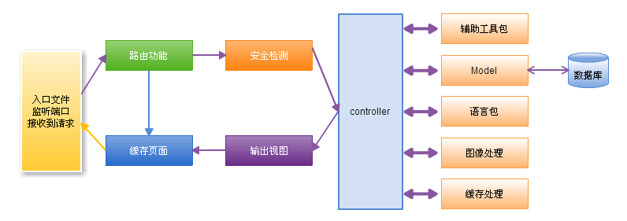
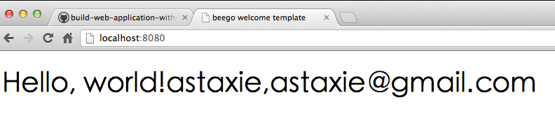

前面十二章介绍了如何通过 Go 来开发 Web 应用，介绍了很多基础知识、开发工具和开发技巧，那么我们这一章通过这些知识来**实现一个简易的 Web 框架**。通过 Go 语言来实现一个完整的框架设计，这框架中主要内容有：

* Web 框架的结构规划，例如采用 MVC 模式来进行开发，程序的执行流程设计等内容；
* 框架的第一个功能：路由，如何让访问的 URL 映射到相应的处理逻辑；
* 处理逻辑，如何设计一个公共的 controller，对象继承之后处理函数中如何处理 response 和 request；
* 框架的一些辅助功能，例如日志处理、配置信息等；
* 如何基于 Web 框架实现一个博客，包括博文的发表、修改、删除、显示列表等操作。

通过这么一个完整的项目例子，我期望能够让读者了解如何开发 Web 应用，如何搭建自己的目录结构，如何实现路由，如何实现 MVC 模式等各方面的开发内容。在框架盛行的今天，MVC 也不再是神话。经常听到很多程序员讨论**哪个框架好，哪个框架不好**， 其实**框架只是工具**，没有好与不好，只有适合与不适合，**适合自己的就是最好的**，所以教会大家自己动手写框架，那么不同的需求都可以用自己的思路去实现。

# 1 项目规划

**做任何事情都需要做好规划**，那么我们在**开发博客系统**之前，同样需要做好项目的规划，如何设置目录结构，如何理解整个项目的流程图，当我们理解了应用的执行过程，那么接下来的设计编码就会变得相对容易了。

## 1.1 应用程序流程图

博客系统是基于模型 - 视图 - 控制器这一设计模式的。MVC 是一种将应用程序的逻辑层和表现层进行分离（或者是**前后端分离**）的结构方式。在实践中，由于**表现层从 Go 中分离了出来，所以它允许你的网页中只包含很少的脚本**。

* 模型 (Model) 代表**数据结构（相当于是数据的中心）**。通常来说，模型类将包含**取出、插入、更新数据库资料**等这些功能。
* 视图 (View) 是展示给用户的信息的结构及样式。一个视图通常是一个网页，但是在 Go 中，一个视图也可以是一个页面片段，如页头、页尾。它还可以是一个 RSS 页面，或其它类型的 “页面”，Go 实现的 template 包已经很好的实现了 View 层中的部分功能。
* 控制器 (Controller) 是模型、视图以及其他任何处理 HTTP 请求所必须的资源之间的**中介**，并生成网页。

下图显示了项目设计中框架的数据流是如何贯穿整个系统：

上述数据流程图可这样理解：

1. main.go 作为应用入口，初始化一些运行博客所需要的基本资源、配置信息、监听端口；
2. 路由功能检查 HTTP 请求，根据 URL 以及 method 来确定谁 **(控制层)** 来处理请求的转发资源；
3. 如果缓存文件存在，它将绕过通常的流程执行，被直接发送给浏览器；
4. 安全检测：应用程序控制器调用之前，HTTP 请求和任一用户提交的数据将被过滤；
5. 控制器装载模型、核心库、辅助函数，以及任何处理特定请求所需的其它资源，控制器主要**负责处理业务逻辑**；
6. 输出视图层中渲染好的即将发送到 Web 浏览器中的内容。如果开启缓存，视图首先被缓存，将用于以后的常规请求，也就是对应步骤 3，能起到快速响应的作用。

## 1.2 目录结构

根据上面的应用程序流程设计，博客的目录结构设计如下：

~~~go
|——main.go         入口文件
|——conf            配置文件和处理模块
|——controllers     控制器入口
|——models          数据库处理模块
|——utils           辅助函数库
|——static          静态文件目录
|——views           视图库
~~~

## 1.3 框架设计

为了实现博客的快速搭建，打算基于上面的流程设计开发**一个最小化的框架**，框架包括路由功能、支持 REST 的控制器、自动化的模板渲染，日志系统、配置管理等。

## 2 自定义路由器设计

HTTP 路由组件负责将 HTTP 请求交到对应的函数处理 (或者是一个 struct 的方法)，如前面小节所描述的结构图，路由在框架中相当于**一个事件处理器**，而这个事件包括：

* 用户请求的路径 (path) (例如: /user/123,/article/123)，当然还有查询串信息 (例如 `?id=11`)
* HTTP 的请求方法 (method) (GET、POST、PUT、DELETE、PATCH 等)

路由器就是根据**用户请求的事件信息**转发到相应的**处理函数（控制层）**。

## 2.1 默认的路由实现

此前介绍 Go 的 http 包的详解，里面介绍了 Go 的 http 包如何设计和实现路由，这里继续以一个例子来说明：

~~~go
package main

import (
	"fmt"
	"html"
	"log"
	"net/http"
)

func main() {
	http.HandleFunc("/foo", func(rw http.ResponseWriter, r *http.Request) {
		method := r.Method
		fmt.Println("method:", method)
	})

	http.HandleFunc("/bar", barHandle)

	log.Println(http.ListenAndServe(":8080", nil))
}

func barHandle(rw http.ResponseWriter, r *http.Request) {
	fmt.Fprintf(rw, "Hello, %q.\n", html.EscapeString(r.URL.Path))
}
~~~

上面的例子调用了 http 默认的 DefaultServeMux 来添加路由，需要提供两个参数，第一个参数是希望用户访问此资源的 URL 路径 (保存在 r.URL.Path)，第二参数是即将要执行的函数，以提供用户访问的资源。路由的思路主要集中在两点：

1. 添加路由信息
2. 根据用户请求转发到要执行的函数

Go 默认的路由添加是通过函数 `http.Handle` 和 `http.HandleFunc` 等来添加，底层都是调用了 `DefaultServeMux.Handle(pattern string, handler Handler)`, 这个函数会把路由信息存储在一个 map 信息中 `map[string]muxEntry`，这就解决了上面说的第一点。

Go 监听端口，然后接收到 tcp 连接会扔给 Handler 来处理，上面的例子默认 nil 即为 http.DefaultServeMux，通过 DefaultServeMux.ServeHTTP 函数来进行调度，遍历之前存储的 map 路由信息，和用户访问的 URL 进行**匹配**，以**查询对应注册的处理函数**，这样就实现了上面所说的第二点。

~~~go
for k, v := range mux.m {
    if !pathMatch(k, path) {
        continue
    }
    if h == nil || len(k) > n {
        n = len(k)
        h = v.h
    }
}
~~~

## 2.2 Beego 框架路由实现

目前几乎所有的 Web 应用路由实现都是**基于 http 默认的路由器**，但是 Go 自带的路由器有几个限制：

* 不支持参数设定，例如 `/user/:uid` 这种**泛类型匹配**；
* 无法很好的支持 REST 模式，无法限制访问的方法，例如上面的例子中，用户访问 /foo，可以用 GET、POST、DELETE、HEAD 等方式访问；
* 一般网站的路由规则太多了，编写繁琐。我前面自己开发了一个 API 应用，路由规则有三十几条，这种路由多了之后其实可以进一步简化，通过 struct 的方法进行一种简化。

beego 框架的路由器基于上面的几点限制考虑设计了一种 REST 方式的路由实现，路由设计也是基于上面 Go 默认设计的两点来考虑：存储路由和转发路由。

### 2.2.1 存储路由

针对前面所说的限制点，我们首先要解决参数支持就需要用到正则，第二和第三点我们通过一种变通的方法来解决，REST 的方法对应到 struct 的方法中去，然后路由到 struct 而不是函数，这样在转发路由的时候就可以根据 method 来执行不同的方法。

根据上面的思路，我们设计了两个数据类型 controllerInfo (保存路径和对应的 struct，这里是一个 reflect.Type 类型) 和 ControllerRegistor (routers 是一个 slice 用来保存用户添加的路由信息，以及 beego 框架的应用信息)。

~~~go
type ControllerInfo struct {
    regex          *regexp.Regexp
    params         map[int]string
    controllerType reflect.Type
}

type ControllerRegistor struct {
    routers     []*controllerInfo
    Application *App
}
~~~

ControllerRegistor 对外的接口函数有：

~~~go
func (p *ControllerRegistor) Add(pattern string, c ControllerInterface)
~~~

详细的实现如下：

~~~go
func (p *ControllerRegistor) Add(pattern string, c ControllerInterface) {
    parts := strings.Split(pattern, "/")

    j := 0
    params := make(map[int]string)
    for i, part := range parts {
        if strings.HasPrefix(part, ":") {
            expr := "([^/]+)"

            // a user may choose to override the defult expression
            // similar to expressjs: ‘/user/:id([0-9]+)’

            if index := strings.Index(part, "("); index != -1 {
                expr = part[index:]
                part = part[:index]
            }
            params[j] = part
            parts[i] = expr
            j++
        }
    }

    // recreate the url pattern, with parameters replaced
    // by regular expressions. then compile the regex

    pattern = strings.Join(parts, "/")
    regex, regexErr := regexp.Compile(pattern)
    if regexErr != nil {
        // TODO add error handling here to avoid panic
        panic(regexErr)
        return
    }

    // now create the Route
    t := reflect.Indirect(reflect.ValueOf(c)).Type()
    route := &controllerInfo{}
    route.regex = regex
    route.params = params
    route.controllerType = t

    p.routers = append(p.routers, route)
}
~~~

### 2.2.2 静态路由实现

上面我们实现的动态路由的实现，Go 的 http 包默认支持**静态文件处理** FileServer，由于我们实现了自定义的路由器，那么静态文件也需要自己设定，beego 的静态文件夹路径保存在全局变量 StaticDir 中，StaticDir 是一个 map 类型，实现如下：

~~~go
func (app *App) SetStaticPath(url string, path string) *App {
    StaticDir[url] = path
    return app
}
~~~

应用中设置静态路径可以使用如下方式实现：

~~~go
beego.SetStaticPath("/img","/static/img")
~~~

### 2.2.3 转发路由

转发路由是基于 ControllerRegistor 里的路由信息来进行转发的，详细的实现如下代码所示：

~~~go
// AutoRoute
func (p *ControllerRegistor) ServeHTTP(w http.ResponseWriter, r *http.Request) {
    defer func() {
        if err := recover(); err != nil {
            if !RecoverPanic {
                // go back to panic
                panic(err)
            } else {
                Critical("Handler crashed with error", err)
                for i := 1; ; i += 1 {
                    _, file, line, ok := runtime.Caller(i)
                    if !ok {
                        break
                    }
                    Critical(file, line)
                }
            }
        }
    }()
    var started bool
    for prefix, staticDir := range StaticDir {
        if strings.HasPrefix(r.URL.Path, prefix) {
            file := staticDir + r.URL.Path[len(prefix):]
            http.ServeFile(w, r, file)
            started = true
            return
        }
    }
    requestPath := r.URL.Path

    //find a matching Route
    for _, route := range p.routers {
        // check if Route pattern matches url
        if !route.regex.MatchString(requestPath) {
            continue
        }

        // get submatches (params)
        matches := route.regex.FindStringSubmatch(requestPath)

        // double check that the Route matches the URL pattern.
        if len(matches[0]) != len(requestPath) {
            continue
        }

        params := make(map[string]string)
        if len(route.params) > 0 {
            // add url parameters to the query param map
            values := r.URL.Query()
            for i, match := range matches[1:] {
                values.Add(route.params[i], match)
                params[route.params[i]] = match
            }

            // reassemble query params and add to RawQuery
            r.URL.RawQuery = url.Values(values).Encode() + "&" + r.URL.RawQuery
            // r.URL.RawQuery = url.Values(values).Encode()
        }
        // Invoke the request handler
        vc := reflect.New(route.controllerType)
        init := vc.MethodByName("Init")
        in := make([]reflect.Value, 2)
        ct := &Context{ResponseWriter: w, Request: r, Params: params}
        in[0] = reflect.ValueOf(ct)
        in[1] = reflect.ValueOf(route.controllerType.Name())
        init.Call(in)
        in = make([]reflect.Value, 0)
        method := vc.MethodByName("Prepare")
        method.Call(in)
        if r.Method == "GET" {
            method = vc.MethodByName("Get")
            method.Call(in)
        } else if r.Method == "POST" {
            method = vc.MethodByName("Post")
            method.Call(in)
        } else if r.Method == "HEAD" {
            method = vc.MethodByName("Head")
            method.Call(in)
        } else if r.Method == "DELETE" {
            method = vc.MethodByName("Delete")
            method.Call(in)
        } else if r.Method == "PUT" {
            method = vc.MethodByName("Put")
            method.Call(in)
        } else if r.Method == "PATCH" {
            method = vc.MethodByName("Patch")
            method.Call(in)
        } else if r.Method == "OPTIONS" {
            method = vc.MethodByName("Options")
            method.Call(in)
        }
        
        if AutoRender {
            method = vc.MethodByName("Render")
            method.Call(in)
        }
        
        method = vc.MethodByName("Finish")
        method.Call(in)
        started = true
        break
    }

    // if no matches to url, throw a not found exception
    if started == false {
        http.NotFound(w, r)
    }
}
~~~

### 2.2.4 使用入门

基于这样的路由设计之后就可以解决前面所说的三个限制点，使用的方式如下所示：

基本的使用注册路由：

~~~go
beego.BeeApp.RegisterController("/", &controllers.MainController{})
~~~

参数注册：

~~~go
beego.BeeApp.RegisterController("/:param", &controllers.UserController{})
~~~

正则匹配：

~~~go
beego.BeeApp.RegisterController("/users/:uid([0-9]+)", &controllers.UserController{})
~~~

# 3 Controller 的设计

传统的 MVC 框架大多数是基于 Action 设计的后缀式映射，然而，现在 Web 流行 REST 风格的架构。尽管使用 Filter 或者 rewrite 能够通过 URL 重写实现 REST 风格的 URL，但是为什么不直接设计一个全新的 REST 风格的 MVC 框架呢？本小节就是基于这种思路来讲述如何从头设计一个基于 REST 风格的 MVC 框架中的 controller，最大限度地简化 Web 应用的开发，甚至编写一行代码就可以实现 “Hello, world”。

## 3.1 Controller 的作用

MVC 设计模式是目前 Web 应用开发中最常见的架构模式，通过分离 Model（模型）、View（视图）和 Controller（控制器），可以更容易实现易于扩展的用户界面 (UI)：

* Model 指后台返回的数据；
* View 指**需要渲染的页面**，通常是模板页面，**渲染后的内容通常是 HTML**；
* Controller 指 Web 开发人员编写的处理不同 URL 的控制器。

如前面小节讲述的**路由就是 URL 请求转发到控制器的过程**，controller 在整个的 MVC 框架中起到了一个核心的作用，负责处理业务逻辑，因此控制器是整个框架中必不可少的一部分，Model 和 View 对于有些业务需求是可以不写的，例如没有数据处理的逻辑处理，没有页面输出的 302 调整之类的就不需要 Model 和 View，但是 controller 这一环节是必不可少的。

## 3.2 Beego 的 REST 设计

前面小节介绍了路由实现了注册 struct 的功能，而 struct 中实现了 REST 方式，因此我们需要设计一个用于逻辑处理 controller 的基类，这里主要设计了两个类型，一个 struct、一个 interface：

~~~go
type Controller struct {
    Ct        *Context
    Tpl       *template.Template
    Data      map[interface{}]interface{}
    ChildName string
    TplNames  string
    Layout    []string
    TplExt    string
}

type ControllerInterface interface {
    Init(ct *Context, cn string)    // 初始化上下文和子类名称
    Prepare()                       // 开始执行之前的一些处理
    Get()                           // method=GET 的处理
    Post()                          // method=POST 的处理
    Delete()                        // method=DELETE 的处理
    Put()                           // method=PUT 的处理
    Head()                          // method=HEAD 的处理
    Patch()                         // method=PATCH 的处理
    Options()                       // method=OPTIONS 的处理
    Finish()                        // 执行完成之后的处理        
    Render() error                  // 执行完 method 对应的方法之后渲染页面
}
~~~

那么前面介绍的路由 add 函数的时候是定义了 ControllerInterface 类型，因此，只要我们实现这个接口就可以，所以我们的基类 Controller 实现如下的方法：

~~~~go
func (c *Controller) Init(ct *Context, cn string) {
    c.Data = make(map[interface{}]interface{})
    c.Layout = make([]string, 0)
    c.TplNames = ""
    c.ChildName = cn
    c.Ct = ct
    c.TplExt = "tpl"
}

func (c *Controller) Prepare() {

}

func (c *Controller) Finish() {

}

func (c *Controller) Get() {
    http.Error(c.Ct.ResponseWriter, "Method Not Allowed", 405)
}

func (c *Controller) Post() {
    http.Error(c.Ct.ResponseWriter, "Method Not Allowed", 405)
}

func (c *Controller) Delete() {
    http.Error(c.Ct.ResponseWriter, "Method Not Allowed", 405)
}

func (c *Controller) Put() {
    http.Error(c.Ct.ResponseWriter, "Method Not Allowed", 405)
}

func (c *Controller) Head() {
    http.Error(c.Ct.ResponseWriter, "Method Not Allowed", 405)
}

func (c *Controller) Patch() {
    http.Error(c.Ct.ResponseWriter, "Method Not Allowed", 405)
}

func (c *Controller) Options() {
    http.Error(c.Ct.ResponseWriter, "Method Not Allowed", 405)
}

func (c *Controller) Render() error {
    if len(c.Layout) > 0 {
        var filenames []string
        for _, file := range c.Layout {
            filenames = append(filenames, path.Join(ViewsPath, file))
        }
        t, err := template.ParseFiles(filenames...)
        if err != nil {
            Trace("template ParseFiles err:", err)
        }
        err = t.ExecuteTemplate(c.Ct.ResponseWriter, c.TplNames, c.Data)
        if err != nil {
            Trace("template Execute err:", err)
        }
    } else {
        if c.TplNames == "" {
            c.TplNames = c.ChildName + "/" + c.Ct.Request.Method + "." + c.TplExt
        }
        t, err := template.ParseFiles(path.Join(ViewsPath, c.TplNames))
        if err != nil {
            Trace("template ParseFiles err:", err)
        }
        err = t.Execute(c.Ct.ResponseWriter, c.Data)
        if err != nil {
            Trace("template Execute err:", err)
        }
    }
    return nil
}

func (c *Controller) Redirect(url string, code int) {
    c.Ct.Redirect(code, url)
}
~~~~

上面的 controller 基类已经实现了接口定义的函数，通过路由根据 url 执行相应的 controller 的原则，会**依次执行**如下：

1. Init()：初始化；
2. Prepare()：执行之前的初始化，每个继承的子类可以来实现该函数；
3. method()：根据不同的 method 执行不同的函数：GET、POST、PUT、HEAD等，子类来实现这些函数，如果没实现，那么默认都是403；
4. Render()：可选，根据全局变量 AutoRender 来判断是否执行；
5. Finish()：执行完之后执行的操作，每个继承的子类可以来实现该函数。

## 3.3 应用指南

上面 beego 框架中完成了 controller 基类的设计，那么我们在我们的应用中可以这样来设计我们的方法：

~~~go

package controllers

import (
    "github.com/astaxie/beego"
)

type MainController struct {
    beego.Controller
}

func (this *MainController) Get() {
    this.Data["Username"] = "astaxie"
    this.Data["Email"] = "astaxie@gmail.com"
    this.TplNames = "index.tpl"
}
~~~

上面的方式我们实现了子类 MainController，实现了 Get 方法，那么如果用户通过其他的方式 (POST/HEAD 等) 来访问该资源都将返回 405，而如果是 Get 来访问，因为我们设置了 AutoRender=true，那么在执行完 Get 方法之后会自动执行 Render 函数，就会显示如下界面：

index.tpl 的代码如下所示，我们可以看到数据的设置和显示都是相当的简单方便：

~~~html
<!DOCTYPE html>
<html>
  <head>
    <title>beego welcome template</title>
  </head>
  <body>
    <h1>Hello, world!{{.Username}},{{.Email}}</h1>
  </body>
</html>
~~~

# 4 日志和配置设计

> 本章节有 2 个关键点：**日志模块**的设计和**配置模块**的设计。

前面已经介绍过日志在我们程序开发中起着很重要的作用，通过**日志**我们可以**记录我们的调试信息**，当初介绍过一个日志系统 seelog，根据不同的 level 输出不同的日志，这个对于程序开发和程序部署来说至关重要。我们可以**在程序开发中设置 level 低一点，部署的时候把 level 设置高**，这样我们开发中的调试信息可以屏蔽掉。

**配置模块**对于应用部署牵涉到服务器不同的一些配置信息非常有用，例如一些数据库配置信息、监听端口、监听地址等都是可以通过配置文件来配置，这样我们的应用程序就具有很强的灵活性，可以通过配置文件的配置部署在不同的机器上，可以连接不同的数据库之类的。

## 4.1 日志设计

beego 的日志设计部署思路来自于 seelog，根据不同的 level 来记录日志，但是 beego 设计的日志系统比较轻量级，采用了**系统的 log.Logger 接口**，默认输出到 os.Stdout，用户可以实现这个接口然后通过 beego.SetLogger 设置自定义的输出，详细的实现如下所示：

~~~go
// Log levels to control the logging output.
const (
    LevelTrace = iota
    LevelDebug
    LevelInfo
    LevelWarning
    LevelError
    LevelCritical
)

// logLevel controls the global log level used by the logger.
var level = LevelTrace

// LogLevel returns the global log level and can be used in
// own implementations of the logger interface.
func Level() int {
    return level
}

// SetLogLevel sets the global log level used by the simple
// logger.
func SetLevel(l int) {
    level = l
}
~~~

上面这一段实现了日志系统的**日志分级（也就是说，App 中输出 `io.Writer` 的日志是分等级的）**，默认的级别是 Trace，用户通过 SetLevel 可以设置不同的分级（分等级的设计目的是：**根据部署场景的不同，可以输出不同等级的日志，以此达到日志屏蔽、过滤的作用**）。

~~~go
// logger references the used application logger.
var BeeLogger = log.New(os.Stdout, "", log.Ldate|log.Ltime)

// SetLogger sets a new logger.
func SetLogger(l *log.Logger) {
    BeeLogger = l
}

// Trace logs a message at trace level.
func Trace(v ...interface{}) {
    if level <= LevelTrace {
        BeeLogger.Printf("[T] %v\n", v)
    }
}

// Debug logs a message at debug level.
func Debug(v ...interface{}) {
    if level <= LevelDebug {
        BeeLogger.Printf("[D] %v\n", v)
    }
}

// Info logs a message at info level.
func Info(v ...interface{}) {
    if level <= LevelInfo {
        BeeLogger.Printf("[I] %v\n", v)
    }
}

// Warning logs a message at warning level.
func Warn(v ...interface{}) {
    if level <= LevelWarning {
        BeeLogger.Printf("[W] %v\n", v)
    }
}

// Error logs a message at error level.
func Error(v ...interface{}) {
    if level <= LevelError {
        BeeLogger.Printf("[E] %v\n", v)
    }
}

// Critical logs a message at critical level.
func Critical(v ...interface{}) {
    if level <= LevelCritical {
        BeeLogger.Printf("[C] %v\n", v)
    }
}
~~~

上面这一段代码默认初始化了一个 BeeLogger 对象，默认输出到 os.Stdout，用户可以通过 beego.SetLogger 来设置实现了 logger 的接口输出。这里面实现了六个函数：

* **Trace，一般的记录信息**，举例如下：
  * "Entered parse function validation block"
  * "Validation: entered second 'if'"
  * "Dictionary 'Dict' is empty. Using default value"
* **Debug，调试信息**，举例如下：
  * "Web page requested: somesite.com Params='...'"
  * "Response generated. Response size: 10000. Sending."
  * "New file received. Type:PNG Size:20000"
* **Info，打印信息**，举例如下：
  * "Web server restarted"
  * "Hourly statistics: Requested pages: 12345 Errors: 123 ..."
  * "Service paused. Waiting for 'resume' call"
* **Warn，警告信息**，举例如下：
  * "Cache corrupted for file='test.file'. Reading from back-end"
  * "Database 192.168.0.7/DB not responding. Using backup 192.168.0.8/DB"
  * "No response from statistics server. Statistics not sent"
* **Error，错误信息**，举例如下：
  * "Internal error. Cannot process request #12345 Error:...."
  * "Cannot perform login: credentials DB not responding"
* **Critical，致命错误**，举例如下：
  * "Critical panic received: .... Shutting down"
  * "Fatal error: ... App is shutting down to prevent data corruption or loss"

可以看到每个函数里面都有对 level 的判断，所以如果我们在部署的时候设置了 level=LevelWarning，那么 Trace、Debug、Info 这三个函数都不会有任何的输出，以此类推。比如一个很简单的输出：

~~~go
Trace("I", "am", "a", "Gopher!")

-->

2021/06/30 16:23:15 [T] [I am a Gopher!]
~~~

## 4.2 配置设计

配置信息的解析，beego 实现了一个 key=value 的配置文件读取，类似 ini 配置文件的格式，就是一个文件解析的过程，然后把解析的数据保存到 map 中，最后在调用的时候通过几个 string、int 之类的函数调用返回相应的值，具体的实现请看下面：

首先定义了一些 ini 配置文件的一些**全局性常量** ：

~~~go
var (
    bComment = []byte{'#'}
    bEmpty   = []byte{}
    bEqual   = []byte{'='}
    bDQuote  = []byte{'"'}
)
~~~

定义了配置文件的格式：

~~~go
// A Config represents the configuration.
type Config struct {
    filename string
    comment  map[int][]string  // id: []{comment, key...}; id 1 is for main comment.
    data     map[string]string // key: value
    offset   map[string]int64  // key: offset; for editing.
    sync.RWMutex
}
~~~

定义了解析文件的函数，解析文件的过程是打开文件，然后一行一行的读取，解析注释、空行和 key=value 数据：

~~~go
// ParseFile creates a new Config and parses the file configuration from the
// named file.
func LoadConfig(name string) (*Config, error) {
    file, err := os.Open(name)
    if err != nil {
        return nil, err
    }

    cfg := &Config{
        file.Name(),
        make(map[int][]string),
        make(map[string]string),
        make(map[string]int64),
        sync.RWMutex{},
    }
    cfg.Lock()
    defer cfg.Unlock()
    defer file.Close()

    var comment bytes.Buffer
    buf := bufio.NewReader(file)

    for nComment, off := 0, int64(1); ; {
        line, _, err := buf.ReadLine()
        if err == io.EOF {
            break
        }
        if bytes.Equal(line, bEmpty) {
            continue
        }

        off += int64(len(line))

        if bytes.HasPrefix(line, bComment) {
            line = bytes.TrimLeft(line, "#")
            line = bytes.TrimLeftFunc(line, unicode.IsSpace)
            comment.Write(line)
            comment.WriteByte('\n')
            continue
        }
        if comment.Len() != 0 {
            cfg.comment[nComment] = []string{comment.String()}
            comment.Reset()
            nComment++
        }

        val := bytes.SplitN(line, bEqual, 2)
        if bytes.HasPrefix(val[1], bDQuote) {
            val[1] = bytes.Trim(val[1], `"`)
        }

        key := strings.TrimSpace(string(val[0]))
        cfg.comment[nComment-1] = append(cfg.comment[nComment-1], key)
        cfg.data[key] = strings.TrimSpace(string(val[1]))
        cfg.offset[key] = off
    }
    return cfg, nil
}
~~~

下面实现了一些读取配置文件的函数，返回的值确定为 bool、int、float64 或 string：

~~~go
// Bool returns the boolean value for a given key.
func (c *Config) Bool(key string) (bool, error) {
    return strconv.ParseBool(c.data[key])
}

// Int returns the integer value for a given key.
func (c *Config) Int(key string) (int, error) {
    return strconv.Atoi(c.data[key])
}

// Float returns the float value for a given key.
func (c *Config) Float(key string) (float64, error) {
    return strconv.ParseFloat(c.data[key], 64)
}

// String returns the string value for a given key.
func (c *Config) String(key string) string {
    return c.data[key]
}
~~~

# 5 实现博客的增删改查

前面介绍了 beego 框架实现的整体构思以及部分实现的伪代码，这小节介绍通过 beego 建立一个博客系统，包括博客浏览、添加、修改、删除等操作。

## 5.1 博客目录

博客目录如下所示：

~~~go
.
├── controllers
│   ├── delete.go
│   ├── edit.go
│   ├── index.go
│   ├── new.go
│   └── view.go
├── main.go
├── models
│   └── model.go
└── views
    ├── edit.tpl
    ├── index.tpl
    ├── layout.tpl
    ├── new.tpl
    └── view.tpl
~~~

## 5.2 博客路由

博客主要的路由规则如下所示：

~~~go
// 显示博客首页
beego.Router("/", &controllers.IndexController{})
// 查看博客详细信息
beego.Router("/view/:id([0-9]+)", &controllers.ViewController{})
// 新建博客博文
beego.Router("/new", &controllers.NewController{})
// 删除博文
beego.Router("/delete/:id([0-9]+)", &controllers.DeleteController{})
// 编辑博文
beego.Router("/edit/:id([0-9]+)", &controllers.EditController{})
~~~

## 5.3 数据库结构

数据库设计最简单的博客信息：

~~~sql
CREATE TABLE entries (
    id INT AUTO_INCREMENT,
    title TEXT,
    content TEXT,
    created DATETIME,
    primary key (id)
);
~~~

## 5.4 Controller

IndexController：

~~~go
type IndexController struct {
    beego.Controller
}

func (this *IndexController) Get() {
    this.Data["blogs"] = models.GetAll()
    this.Layout = "layout.tpl"
    this.TplName = "index.tpl"
}

~~~

ViewController：

~~~go
type ViewController struct {
    beego.Controller
}

func (this *ViewController) Get() {
    id, _ := strconv.Atoi(this.Ctx.Input.Params()[":id"])
    this.Data["Post"] = models.GetBlog(id)
    this.Layout = "layout.tpl"
    this.TplName = "view.tpl"
}
~~~

NewController：

~~~go
type NewController struct {
    beego.Controller
}

func (this *NewController) Get() {
    this.Layout = "layout.tpl"
    this.TplName = "new.tpl"
}

func (this *NewController) Post() {
    inputs := this.Input()
    var blog models.Blog
    blog.Title = inputs.Get("title")
    blog.Content = inputs.Get("content")
    blog.Created = time.Now()
    models.SaveBlog(blog)
    this.Ctx.Redirect(302, "/")
}       
~~~

EditController：

~~~go
type EditController struct {
    beego.Controller
}

func (this *EditController) Get() {
    id, _ := strconv.Atoi(this.Ctx.Input.Params()[":id"])
    this.Data["Post"] = models.GetBlog(id)
    this.Layout = "layout.tpl"
    this.TplName = "edit.tpl"
}

func (this *EditController) Post() {
    inputs := this.Input()
    var blog models.Blog
    blog.Id, _ = strconv.Atoi(inputs.Get("id"))
    blog.Title = inputs.Get("title")
    blog.Content = inputs.Get("content")
    blog.Created = time.Now()
    models.SaveBlog(blog)
    this.Ctx.Redirect(302, "/")
}
~~~

DeleteController：

~~~go
type DeleteController struct {
    beego.Controller
}

func (this *DeleteController) Get() {
    id, _ := strconv.Atoi(this.Ctx.Input.Params()[":id"])
    blog := models.GetBlog(id)
    this.Data["Post"] = blog
    models.DelBlog(blog)
    this.Ctx.Redirect(302, "/")
}
~~~

## 5.5 Model

~~~go
package models

import (
    "database/sql"
    "github.com/astaxie/beedb"
    _ "github.com/ziutek/mymysql/godrv"
    "time"
)

type Blog struct {
    Id      int `PK`
    Title   string
    Content string
    Created time.Time
}

func GetLink() beedb.Model {
    db, err := sql.Open("mymysql", "blog/astaxie/123456")
    if err != nil {
        panic(err)
    }
    orm := beedb.New(db)
    return orm
}

func GetAll() (blogs []Blog) {
    db := GetLink()
    db.FindAll(&blogs)
    return
}

func GetBlog(id int) (blog Blog) {
    db := GetLink()
    db.Where("id=?", id).Find(&blog)
    return
}

func SaveBlog(blog Blog) (bg Blog) {
    db := GetLink()
    db.Save(&blog)
    return bg
}

func DelBlog(blog Blog) {
    db := GetLink()
    db.Delete(&blog)
    return
}
~~~

## 5.6 View

对应有各种类型的 View：

* layout.tpl
* index.tpl
* view.tpl
* new.tpl
* edit.tpl