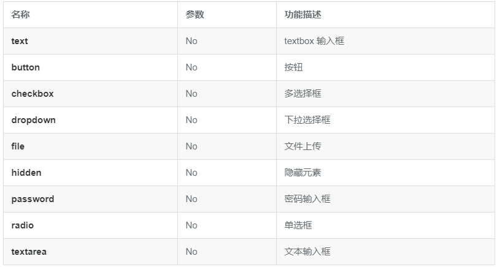
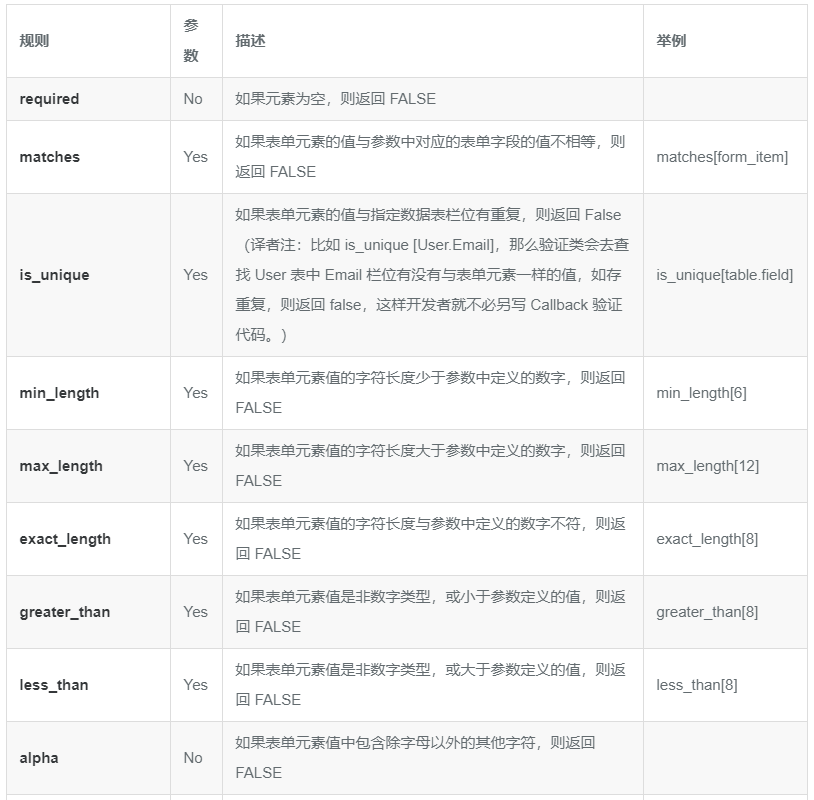
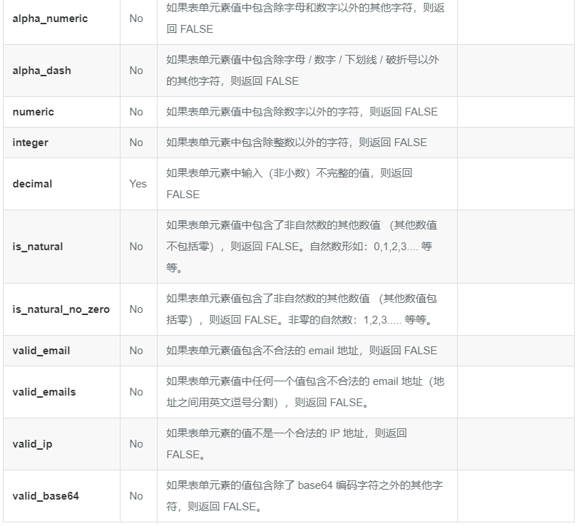

第十三章介绍了如何开发一个 Web 框架，通过介绍 MVC、路由、日志处理、配置处理完成了一个基本的框架系统，但是一个好的框架需要一些方便的辅助工具来快速的开发 Web，那么我们这一章将就如何提供一些**快速开发 Web 的工具**进行介绍:

* 如何处理静态文件，如何利用现有的 twitter 开源的 bootstrap 进行快速的开发美观的站点；
* 如何利用前面介绍的 session 来进行用户登录处理；
* 如何方便的输出表单、这些表单如何进行数据验证，以及如何快速的结合 model 进行数据的增删改操作；
* 如何进行一些用户认证，包括 http basic 认证、http digest 认证；
* 如何利用前面介绍的 i18n 支持多语言的应用开发；
* 如何集成 Go 的 pprof 包用于性能调试。

通过本章的扩展，beego 框架将具有快速开发 Web 的特性，最后我们将讲解如何利用这些扩展的特性扩展开发第十三章开发的博客系统，通过**开发一个完整、美观的博客系统**让读者了解 beego 开发带给你的快速。

# 1 静态文件支持

我们在前面已经讲过如何处理静态文件，这小节我们详细的介绍如何在 beego 里面设置和使用静态文件。通过再介绍一个 twitter 开源的 html、css 框架 bootstrap，无需大量的设计工作就能够让你快速地建立一个漂亮的站点。

## 1.1 Beego 静态文件实现和设置

Go 的 net/http 包中提供了**静态文件的服务**，`ServeFile` 和 `FileServer` 等函数。beego 的静态文件处理就是基于这一层处理的，具体的实现如下所示：

~~~go
// static file server
for prefix, staticDir := range StaticDir {
    if strings.HasPrefix(r.URL.Path, prefix) {
        file := staticDir + r.URL.Path[len(prefix):]
        http.ServeFile(w, r, file)
        w.started = true
        return
    }
}
~~~

StaticDir 里面保存的是相应的 url 对应到**静态文件所在的目录**，因此在处理 URL 请求的时候只需要判断对应的请求地址是否包含静态处理开头的 url，如果包含的话就采用 http.ServeFile 提供服务。比如：

~~~go
beego.StaticDir["/asset"] = "/static"
~~~

那么请求 url 如 `http://www.beego.me/asset/bootstrap.css` 就会请求 `/static/bootstrap.css` 来提供反馈给客户端。

## 1.2 Bootstrap 集成

Bootstrap 是 Twitter 推出的一个开源的用于前端开发的工具包。对于开发者来说，Bootstrap 是快速开发 Web 应用程序的最佳前端工具包。它是一个 CSS 和 HTML 的集合，它使用了最新的 HTML5 标准，给你的 Web 开发提供了时尚的版式，表单，按钮，表格，网格系统等等。

* **组件**：Bootstrap 中包含了丰富的 Web 组件，根据这些组件，可以快速的搭建一个漂亮、功能完备的网站。其中包括以下组件：下拉菜单、按钮组、按钮下拉菜单、导航、导航条、面包屑、分页、排版、缩略图、警告对话框、进度条、媒体对象等
* **Javascript 插件**：Bootstrap 自带了 13 个 jQuery 插件，这些插件为 Bootstrap 中的组件赋予了 “生命”。其中包括：模式对话框、标签页、滚动条、弹出框等。
* **定制自己的框架代码**：可以对 Bootstra p 中所有的 CSS 变量进行修改，依据自己的需求裁剪代码。

接下来我们利用 bootstrap 集成到 beego 框架里面来，快速的建立一个漂亮的站点。

# 2 Session 支持

beego 框架基于 sessionManager 实现了方便的 session 处理功能。

# 3 表单验证

在 Web 开发中对于这样的一个流程可能很眼熟：

* 打开一个网页显示出表单；
* 用户填写并提交了表单；
* 如果用户提交了一些无效的信息，或者可能漏掉了一个必填项，表单将会连同用户的数据和错误问题的描述信息返回；
* 用户再次填写，继续上一步过程，直到提交了一个有效的表单。

在接收端，脚本必须：

* 检查用户递交的表单数据；
* 验证数据是否为正确的类型、合适的标准。例如，如果一个用户名被提交，它必须被验证是否只包含了允许的字符。它必须有一个最小长度，不能超过最大长度。用户名不能与已存在的他人用户名重复，甚至是一个保留字等；
* 过滤数据并清理不安全字符，保证逻辑处理中接收的数据是安全的；
* 如果需要，预格式化数据（数据需要清除空白或者经过 HTML 编码等等）；
* 准备好数据，插入数据库。

尽管上面的过程并不是很复杂，但是通常情况下需要编写很多代码，而且为了显示错误信息，在网页中经常要使用多种不同的控制结构。创建表单验证虽简单，实施起来实在枯燥无味。

对于开发者来说，一般开发过程都是相当复杂，而且**大多是在重复一样的工作**。假设一个场景项目中忽然需要增加一个表单数据，那么局部代码的整个流程都需要修改。我们知道 Go 里面 struct 是常用的一个数据结构，因此 beego 的 form 采用了 struct 来处理表单信息。

首先定义一个开发 Web 应用时相对应的 struct，一个字段对应一个 form 元素，通过 struct 的 tag 来定义相应的元素信息和验证信息，如下所示：

~~~go
type User struct{
    Username    string  `form:text,valid:required`
    Nickname    string  `form:text,valid:required`
    Age         int     `form:text,valid:required|numeric`
    Email       string  `form:text,valid:required|valid_email`
    Introduce   string  `form:textarea`
}
~~~

定义好 struct 之后接下来在 controller 中这样操作：

~~~go
func (this *AddController) Get() {
    this.Data["form"] = beego.Form(&User{})
    this.Layout = "admin/layout.html"
    this.TplNames = "admin/add.tpl"
}       
~~~

在模板中这样显示表单：

~~~go
<h1>New Blog Post</h1>
<form action="" method="post">
{{.form.render()}}
</form>
~~~

上面我们定义好了整个的第一步，从 struct 到显示表单的过程，接下来就是用户填写信息，服务器端接收数据然后验证，最后插入数据库。

~~~go
func (this *AddController) Post() {
    var user User
    form := this.GetInput(&user)
    if !form.Validates() {
        return
    }
    models.UserInsert(&user)
    this.Ctx.Redirect(302, "/admin/index")
}       
~~~

下表列出了常见的表单元素信息：

以下列表将列出可被使用的原生规则：

# 4 用户认证

在开发 Web 应用过程中，用户认证是开发者经常遇到的问题，**用户登录、注册、登出等操作**，而一般认证也分为三个方面的认证

* HTTP Basic 和 HTTP Digest 认证；

* 第三方集成认证：QQ、微博、豆瓣、OPENID、google、github、facebook 和 twitter 等；

  对于这种第三方集成认证的验证，可以是拿到对应账户信息，比如昵称、头像等个人资料。

* 自定义的用户登录、注册、登出，一般都是基于 session、cookie 认证。

beego 目前没有针对这三种方式进行任何形式的集成，但是可以充分的利用第三方开源库来实现上面的三种方式的用户认证，不过后续 beego 会对前面两种认证逐步集成。

# 5 多语言支持

可以使用第三方库库实现国际化和本地化支持。

# 6 pprof 支持

Go 语言有一个非常棒的设计就是标准库里面带有代码的**性能监控工具**，在两个地方有包：

* `net/http/pprof`
* `runtime/pprof`

其实 net/http/pprof 中只是使用 runtime/pprof 包来进行封装了一下，并在 http 端口上暴露出来。
