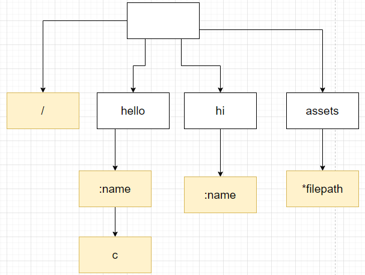

> Web 框架，即 Web 服务端的脚手架，使用 net.http 包下的封装类实现，参考：gee-web，其最终都是以 Gin 为原型

Web 框架引发的**疑惑**：

1. 既然是一个 Web 框架，那有哪几部分组成？
2. Gin、Beego 等 Web 框架的组成是怎样的？其基本功能有哪些？
3. 一个 HTTP 请求经历了哪几个步骤？
4. 一个基本的后端服务程序的组织架构是怎样的？硬件层面包括哪些内容？涉及到哪些服务？这个部分可以和毛剑的极客时间课程联系起来。
5. HTTP 请求的方式、方法有哪些？

# Web 框架雏形

先来一波**烧脑的思考题**：

1. 如何创建一个 Server，并接收 Client 的 HTTP request？

   解答：参考 [02_使用3种思路构建Web服务器](./02_使用3种思路构建Web服务器.md)
   
2. Server 接收到 HTTP 请求后，**经历了哪些步骤**后 Request 得到了处理？比如如何**匹配** URL 的？

3. Server 是如何**并发**接收大量的 Client 端 HTTP Request 的？如何测量 Server 的 QPS？

Go 语言标准库 net/http 封装了 **HTTP 网络编程**的基础接口，该包可用于封装一个 Web 框架（**Gin 使用的就是该标准库**）。在不知道 Gin 怎样实现 Web 框架 时，认为 Gin 肯定做了大量的工作，但实际上仍然是在标准库的基础上实现的。

**如何创建一个 Server，并接收 Client 的 HTTP Request**？为了探求这个问题的答案，参考标准库中的 net/http 包的使用：

~~~go
package main

import (
	"fmt"
	"log"
	"net/http"
)

func main() {
	http.HandleFunc("/", indexHandleFunc)
	http.HandleFunc("/hello", helloHandlFunc)

	log.Fatal(http.ListenAndServe(":9999", nil))
}

func indexHandleFunc(w http.ResponseWriter, req *http.Request) {
	fmt.Fprintf(w, req.RequestURI)
}

func helloHandlFunc(w http.ResponseWriter, req *http.Request) {
	for key, value := range req.Header { // req.Header map[string][]string
		fmt.Fprintf(w, "key:%s, value:%s\n", key, value)
	}
}
~~~

`http.ListenAndServe` 实现 HTTP 服务器的启动，同时**持续接收** Client 的 HTTP 请求（对每一个 HTTP 请求创建了 goroutine，并在其中处理请求、反馈处理结果）。

Server 端接收到 HTTP 请求后（Accept），创建 goroutine 并对这个 Request 做具体的处理。此处“具体的处理”就包括依据 HTTP Request 的 URI 在 DefaultServeMux 中查找已注册的 pattern（**路由**） 和 handler，若找到，则执行对应的 handler，否则直接返回：`404 page not found`

~~~go
// HandleFunc registers the handler function for the given pattern
// in the DefaultServeMux.
// The documentation for ServeMux explains how patterns are matched.
func HandleFunc(pattern string, handler func(ResponseWriter, *Request)) {
	DefaultServeMux.HandleFunc(pattern, handler)
}
~~~

对于 `/` 这个 path，可以匹配很多个 URI，比如：`/hello`（如果没有注册对应的 `/hello` 的 HandleFunc 时） 等。

~~~shell
C:\Users\Administrator>curl http://localhost:9999/hello
User-AgentAccept
C:\Users\Administrator>curl http://localhost:9999/hello
key:User-Agent, value:[curl/7.55.1]
key:Accept, value:[*/*]

C:\Users\Administrator>curl http://localhost:9999/helloo
/helloo
~~~

main 函数的最后 `http.ListenAndServer` 执行时，启动了 Web 服务，监听的端口是 `:9999`，第二个参数表示处理所有 HTTP 请求的 Handler 实例。

~~~go
// ListenAndServe listens on the TCP network address addr and then calls
// Serve with handler to handle requests on incoming connections.
// Accepted connections are configured to enable TCP keep-alives.
//
// The handler is typically nil, in which case the DefaultServeMux is used.
//
// ListenAndServe always returns a non-nil error.
func ListenAndServe(addr string, handler Handler) error {
	server := &Server{Addr: addr, Handler: handler}
	return server.ListenAndServe()
}

type Handler interface {
	ServeHTTP(ResponseWriter, *Request)
}
~~~

第二个参数一般是 nil，默认使用的是 DefaultServeMux 实例。

这第二个参数是**基于 net/http 标准库实现 Web 框架的入口**！只要传入实现了 Handler 这个接口的实例，所有的 HTTP Request 都会被该实例处理。

那接下来实现这个接口定制 HTTP Request 的处理：

~~~go
package main

import (
	"fmt"
	"log"
	"net/http"
)

func main() {
	engine := &Engine{}
	log.Fatal(http.ListenAndServe(":9999", engine))
}

type Engine struct{}

func (engine *Engine) ServeHTTP(w http.ResponseWriter, req *http.Request) {
	path := req.URL.Path // 获取到对应的URL，并依据URL匹配到HandleFunc
	switch path {
	case "/": // 内容就是HandleFunc
		fmt.Fprintf(w, req.RequestURI)
	case "/hello":
		for key, value := range req.Header { // req.Header map[string][]string
			fmt.Fprintf(w, "key:%s, value:%s\n", key, value)
		}
	default:
		fmt.Fprintf(w, "404 page not found")
	}
}
~~~

在 `ServeHTTP(w http.ResponseWriter, req *http.Request)` 这个方法声明中，`http.Request` 类型包含了本次 HTTP Request 的所有信息，包括请求地址、Header 和 Body 等。而 `http.ResponseWriter` 用于构造请求的响应。

在传入 engine 后，我们实现了将所有 HTTP 请求转向了我们自己的处理逻辑：

~~~go
func (sh serverHandler) ServeHTTP(rw ResponseWriter, req *Request) {
    // 此处可以自定义 handler，如果为空，则使用 DefaultServeMux
	handler := sh.srv.Handler
	if handler == nil {
		handler = DefaultServeMux
	}
	if req.RequestURI == "*" && req.Method == "OPTIONS" {
		handler = globalOptionsHandler{}
	}
    // 调用逻辑❼
    // 获取 ServeMux，并处理 Request
	handler.ServeHTTP(rw, req)
}
~~~

这个步骤的目的在于：**拦截**了所有的 HTTP Request，让其拥有的**统一的入口**。也就是说，HTTP Request 最先会到达这个方法，我可以在此处自定义路由映射规则，添加一些日志、校验、拦截等逻辑。

那接下来构造这个框架，这个框架以 Engine 为主功能类型，需要实现的功能有：

* 创建 Engine 实例
* 统一 HTTP Request 的入口
* 可添加 path - HandleRequest 处理，并实现根据 URL 匹配到对应的 HandleFunc

实现的框架如下：

~~~go
package gee

import (
	"fmt"
	"log"
	"net/http"
)

type Engine struct {
	router map[string]HandleFunc
}

func New() *Engine {
	return &Engine{router: make(map[string]HandleFunc)}
}

func (engine *Engine) Run(addr string) error {
    // 传入了 *Engine 实例，会在其中调用其实现的 ServeHTTP 方法
	return http.ListenAndServe(addr, engine)
}

func (engine *Engine) GET(path string, handler HandleFunc) {
	engine.addRoute("GET", path, handler)
}

func (engine *Engine) POST(path string, handler HandleFunc) {
	engine.addRoute("POST", path, handler)
}

func (engine *Engine) addRoute(method, pattern string, handler HandleFunc) {
	key := method + "-" + pattern
	log.Printf("Route %4s - %s", method, pattern)
	engine.router[key] = handler
}

func (engine *Engine) ServeHTTP(w http.ResponseWriter, req *http.Request) {
	log.Printf("Receive: %4s - %s", req.Method, req.URL.Path) // 不需要在 format 的结尾增加 newline

	key := req.Method + "-" + req.URL.Path
	if handler, ok := engine.router[key]; ok {
		handler(w, req)
	} else {
		fmt.Fprintf(w, "404 page not found")
	}
}

type HandleFunc func(w http.ResponseWriter, req *http.Request)

~~~

使用 goweb 框架后，实现 Server 代码变得精简了：

~~~go
package main

import (
	"fmt"
	"goweb/gee"
	"net/http"
)

func main() {
	engine := gee.New()

	engine.GET("/", func(w http.ResponseWriter, req *http.Request) {
		fmt.Fprintf(w, req.RequestURI)
	})

	engine.GET("/hello", func(w http.ResponseWriter, req *http.Request) {
		for key, value := range req.Header { // req.Header map[string][]string
			fmt.Fprintf(w, "key:%s, value:%s\n", key, value)
		}
	})

	engine.Run(":9999")
}
~~~

重点来分析**首个框架版本**的实现：

1. HandleFunc 类型来自 net/http 标准库，让用户定义**路由**映射的**处理方法**（HandleFunc 封装）。
2. Engine 中封装了一个**路由表**，其类型是 `map[string]HandlFunc` 类型的值，其中 string 的构成是：`Method-URL`，比如 `GET-/`、`GET-/hello` 等。针对相同的路由（URL），如果请求方法不同，可以有不同的处理方法。
3. Engine 中实现的 `ServeHTTP(w http.ResponseWriter, req *http.Request)` 的作用就是解析出请求的 URL，并在路由表中查找对应的 HandleFunc，若找到则处理，反之则反馈 `404 page not found`。

测试用例：

~~~shell
C:\Users\Administrator>curl http://localhost:9999/
/
C:\Users\Administrator>curl http://localhost:9999/hello
key:User-Agent, value:[curl/7.55.1]
key:Accept, value:[*/*]

C:\Users\Administrator>curl http://localhost:9999/world
404 page not found
~~~

到目前为止， Go Web 框架的原型已经出来的，但是上述框架代码**并没有实现比标准库更强大的能力**（但仍实现了**路由注册表**，提供了用户**注册静态路由**的方法，包装了启动服务的函数），这就是我们后续要做的事情。

# 设计 Context 上下文

先来一波**烧脑的思考题**：

1. HTTP 的 Response 如何构建，是如何反馈给 Client 端的？
2. Response 的类型有哪些？JSON、HTML 等。作为一个 Web 框架，是否可以使用提取公共的代码组成方法，方便用户使用？
3. HTTP Request 中的参数是如何被解析的？

在初版的框架代码中，Engine 结构体定义中包含了**路由表**的实例，要知道路由表在整个 Web 框架中是很关键的一个实例，是否可以抽取出来形成独立的文件？这样也符合**“单一职责原则”（在类型设计时）**。接下来我们从 Engine 的源代码入手，抽取出 router.go 文件：

~~~go
package gee

import (
	"fmt"
	"log"
	"net/http"
)

type router struct {
	handlers map[string]HandleFunc
}

func newRouter() *router {
	return &router{handlers: make(map[string]HandleFunc)}
}

func (router *router) addRoute(method, pattern string, handler HandleFunc) {
	log.Printf("Route %4s - %s", method, pattern)
	key := method + "-" + pattern
	router.handlers[key] = handler
}

func (router *router) handle(w http.ResponseWriter, req *http.Request) {
	log.Printf("Receive: %4s - %s", req.Method, req.URL.Path)
	key := req.Method + "-" + req.URL.Path
	if handler, ok := router.handlers[key]; ok {
		handler(w, req)
	} else {
		fmt.Fprintf(w, "404 page not found")
	}
}
~~~

抽取出了 router.go 后，还需要对使用 router 的地方做**重构**：

~~~go
package gee

import (
	"net/http"
)

type Engine struct {
	router *router // 此处并没有内嵌 router 结构体，而使用了 *router 字段承接一个实例
}

func New() *Engine {
	return &Engine{router: newRouter()} // 重构
}

func (engine *Engine) Run(addr string) error {
	return http.ListenAndServe(addr, engine)
}

func (engine *Engine) GET(path string, handler HandleFunc) {
	engine.addRoute("GET", path, handler)
}

func (engine *Engine) POST(path string, handler HandleFunc) {
	engine.addRoute("POST", path, handler)
}

func (engine *Engine) ServeHTTP(w http.ResponseWriter, req *http.Request) {
	engine.router.handle(w, req) // 重构
}

func (engine *Engine) addRoute(method, pattern string, handler HandleFunc) {
	engine.router.addRoute(method, pattern, handler) // 重构
}

type HandleFunc func(w http.ResponseWriter, req *http.Request)
~~~

重构后，获得了一个单独的 router.go 文件，专门用于处理路由表相关的逻辑，符合**“单一职责原则”**。而且后续还可以在 router.go 中做更加重要的路由匹配策略（**动态路由**），让路由表的性能更加高效（**功能**、**性能**、**智能**）。

接下来，将目光聚焦到 Response 上：Server 接收到 *http.Request，经过一系列的处理，最终总是需要反馈给 Client 消息的，也就是构造响应 http.ResponseWriter。而上述这两个标准库封装的功能**粒度太细**，用户在使用时难免会感受到繁琐，比如：

~~~go
package main

import (
	"encoding/json"
	"fmt"
	"goweb/gee"
	"net/http"
)

func main() {
	engine := gee.New()

	engine.GET("/", func(w http.ResponseWriter, req *http.Request) {
		fmt.Fprintf(w, req.RequestURI)
	})

	engine.GET("/hello", func(w http.ResponseWriter, req *http.Request) {
		obj := map[string]interface{}{
			"name":     "geektutu",
			"password": 1234,
		}
        // 输出到 http.ResponseWriter 的流程和 http.Error 中的类似
		w.Header().Set("Content-Type", "application/json")
		w.WriteHeader(http.StatusOK)
		encoder := json.NewEncoder(w)
		if err := encoder.Encode(obj); err != nil {
			http.Error(w, err.Error(), http.StatusInternalServerError)
		}
	})

	engine.Run(":9999")
}

// Error replies to the request with the specified error message and HTTP code.
// It does not otherwise end the request; the caller should ensure no further
// writes are done to w.
// The error message should be plain text.
func Error(w ResponseWriter, error string, code int) {
	w.Header().Set("Content-Type", "text/plain; charset=utf-8")
	w.Header().Set("X-Content-Type-Options", "nosniff")
	w.WriteHeader(code)
	fmt.Fprintln(w, error)
}
~~~

请求的构造是：**请求行、请求头和请求体**。对应响应也是这样的结构：**响应行、响应头和响应体**。构造一个完整的响应，需要考虑：StatusCode、Header 和 Body 部分，基本上每一次构造都需要考虑这些因素。如果不进行封装，那么框架的用户将需要写大量的冗余代码。

> HTTP 的 Request 和 Response 的构成：起始行，首部（Header 部分）和主体，3 个部分组成。

封装构造 http.ResponseWriter 的响应内容时，**功能封装到哪里呢？**是 Enginer 中？还是其他什么地方？此处，引入一个新的实体 Context（此 Context 和 context.Context 没有关系），将**每次请求**的 *http.Request 和 http.ResponseWriter 封装到 Context 类型实体中：

~~~go
package gee

import (
	"encoding/json"
	"fmt"
	"net/http"
)

type Context struct {
	Writer  http.ResponseWriter
	Request *http.Request

	Path   string
	Method string

	StatusCode int
}

func newContext(w http.ResponseWriter, req *http.Request) *Context {
	return &Context{
		Writer:  w,
		Request: req,
		Path:    req.URL.Path,
		Method:  req.Method,
	}
}

func (ctx *Context) String(statusCode int, format string, values ...interface{}) {
	ctx.SetHeader("Content-Type", "text/plain")
	ctx.SetStatus(statusCode)
	ctx.Writer.Write([]byte(fmt.Sprintf(format, values...)))
}

func (ctx *Context) JSON(statusCode int, obj interface{}) {
	ctx.SetHeader("Content-Type", "application/json")
	ctx.SetStatus(statusCode)
	encoder := json.NewEncoder(ctx.Writer)
	if err := encoder.Encode(obj); err != nil {
		http.Error(ctx.Writer, err.Error(), http.StatusInternalServerError)
	}
}

func (ctx *Context) HTML(statusCode int, html string) {
	ctx.SetHeader("Content-Type", "text/html")
	ctx.SetStatus(statusCode)
	ctx.Writer.Write([]byte(html))
}

func (ctx *Context) Data(statusCode int, data []byte) {
	ctx.SetStatus(statusCode)
	ctx.Writer.Write(data)
}

func (ctx *Context) SetHeader(key, value string) {
	ctx.Writer.Header().Set(key, value)
}

func (ctx *Context) SetStatus(statusCode int) {
    ctx.StatusCode = statusCode
	ctx.Writer.WriteHeader(statusCode)
}
~~~

我们构建起来了 Context 结构体类型，并在其上创建了对应的方法：封装了以 JSON、XML、String、Data 格式输出的 http.ResponseWriter 方法，方便用户直接调用。

**每一次** HTTP 的 Request 都会**创建一个 Context 类型实例**，而且符合 HTTP **和状态无关**的特征。因此，还需要重构 gee.go 和 router.go 文件：

~~~go
package gee

import (
	"net/http"
)

type HandleFunc func(ctx *Context) // 重构

type Engine struct {
	router *router
}

func New() *Engine {
	return &Engine{router: newRouter()}
}

func (engine *Engine) Run(addr string) error {
	return http.ListenAndServe(addr, engine)
}

func (engine *Engine) GET(path string, handler HandleFunc) {
	engine.addRoute("GET", path, handler)
}

func (engine *Engine) POST(path string, handler HandleFunc) {
	engine.addRoute("POST", path, handler)
}

func (engine *Engine) ServeHTTP(w http.ResponseWriter, req *http.Request) {
	ctx := newContext(w, req) // 重构，在此处创建 Context 类型实体，每一次都是一个和当次 Request 直接相关的 Context 类型实例
	engine.router.handle(ctx) // 重构
}

func (engine *Engine) addRoute(method, pattern string, handler HandleFunc) {
	engine.router.addRoute(method, pattern, handler)
}
~~~

以及更重要的：

~~~go
package gee

import (
	"fmt"
	"log"
)

type router struct {
	handlers map[string]HandleFunc
}

func newRouter() *router {
	return &router{handlers: make(map[string]HandleFunc)}
}

func (router *router) addRoute(method, pattern string, handler HandleFunc) {
	log.Printf("Route %4s - %s", method, pattern)
	key := method + "-" + pattern
	router.handlers[key] = handler
}

func (router *router) handle(ctx *Context) { // 重构
	log.Printf("Receive: %4s - %s", ctx.Method, ctx.Path)
	key := ctx.Method + "-" + ctx.Path
	if handler, ok := router.handlers[key]; ok {
		handler(ctx) // 重构
	} else {
		fmt.Fprintf(ctx.Writer, "404 page not found")
	}
}
~~~

接下来，把目光聚焦到 HTTP Request 上，让 Context 具备有**解析 URL 中参数**的能力：

~~~go
func (ctx *Context) PostForm(key string) string {
	return ctx.Request.FormValue(key)
}

func (ctx *Context) Query(key string) string {
	return ctx.Request.URL.Query().Get(key) // Query是从URL中查询
}
~~~

另外还在 context.go 中新增一个**自定义类型**：

~~~go
type H map[string]interface{}
~~~

现在来看，整个代码已经很**清晰**了，模块的组成部分**各司其职**。

下面看看封装后，**框架的应用**情况：

~~~go
package main

import (
	"goweb/gee"
	"net/http"
)

func main() {
	engine := gee.New()

	engine.GET("/", func(ctx *gee.Context) {
		ctx.HTML(http.StatusOK, "<h1>Hello Gee<h1>")
	})

	engine.GET("/json", func(ctx *gee.Context) {
		obj := gee.H{
			"name":     "geektutu",
			"password": 1234,
		}
		ctx.JSON(http.StatusOK, obj)
	})

	engine.POST("/postform", func(ctx *gee.Context) { // 必须是 POST 请求，才能解析出 PostForm 内容
		ctx.JSON(http.StatusOK, gee.H{
			"name":     ctx.PostForm("name"),
			"password": ctx.PostForm("password"),
		})
		// example: curl "http://localhost:9999/postform" -X POST -d 'password=1&name=1'
	})

	engine.GET("/query", func(ctx *gee.Context) {
		username := ctx.Query("username")
		ctx.String(http.StatusOK, "Hello, %s!", username)
		// example: curl "http://localhost:9999/query?username=Michoi"
	})

	engine.Run(":9999")
}
~~~

特别注意，Windows 平台上使用 cmd 做 curl 网络请求：

~~~shell
curl "http://localhost:9999/postform" -X POST -d 'password=1&name=1'
~~~

**执行异常**，无法得到正确的请求结果！但是在 git 终端却**工作正常**。

# 路由表 Router

下来一波烧脑的疑惑：

1. 标准库 net/http 中路由表是如何创建的，如何匹配路由获得对应的 HandlerFunc？
2. 路由表是否可自定义，以此获得**更高的路由查找效率**？
3. 如何去实现**动态路由**？比如去实现既能匹配 `/hello/a` 也能匹配 `/hello/b` 的路由。

先来解答一个疑惑：在使用默认的 DefaultServeMux 时，为什么注册了 `/` 的 GET HandlerFunc，但是如果请求的是 `/anything` 时，对应执行了 `/` 的 HandleFunc？

这个疑惑涉及到 net/http 中**路由表的创建**，以及对应**路由匹配的逻辑**，也就是分为上面 2 个部分。解答如下：

~~~go
type ServeMux struct {
	mu    sync.RWMutex
	m     map[string]muxEntry
	es    []muxEntry // slice of entries sorted from longest to shortest.
	hosts bool       // whether any patterns contain hostnames
}

type muxEntry struct {
	h       Handler
	pattern string
}

// Handle registers the handler for the given pattern.
// If a handler already exists for pattern, Handle panics.
func (mux *ServeMux) Handle(pattern string, handler Handler) { // 路由表的创建
	mux.mu.Lock()
	defer mux.mu.Unlock()

	if pattern == "" {
		panic("http: invalid pattern")
	}
	if handler == nil {
		panic("http: nil handler")
	}
	if _, exist := mux.m[pattern]; exist { // 进入到 ServeMux 的 path，对应就是pattern
		panic("http: multiple registrations for " + pattern)
	}

	if mux.m == nil {
		mux.m = make(map[string]muxEntry)
	}
    e := muxEntry{h: handler, pattern: pattern} 
    mux.m[pattern] = e // mux.m: pattern - (pattern, handler) 的map结构
	if pattern[len(pattern)-1] == '/' { // 特殊的，以 '/' 结尾的pattern，添加到 mux.es 中
		mux.es = appendSorted(mux.es, e)
	}

	if pattern[0] != '/' {
		mux.hosts = true
	}
}

func appendSorted(es []muxEntry, e muxEntry) []muxEntry {
	n := len(es)
	i := sort.Search(n, func(i int) bool {
        // slice of entries sorted from longest to shortest.
		return len(es[i].pattern) < len(e.pattern)
	})
	if i == n {
		return append(es, e)
	}
    
	// we now know that i points at where we want to insert
	es = append(es, muxEntry{}) // try to grow the slice in place, any entry works.
	copy(es[i+1:], es[i:])      // Move shorter entries down
	es[i] = e
	return es
}
~~~

匹配路由的过程是这样的：

~~~go
// ServeHTTP dispatches the request to the handler whose
// pattern most closely matches the request URL.
func (mux *ServeMux) ServeHTTP(w ResponseWriter, r *Request) {
	if r.RequestURI == "*" {
		if r.ProtoAtLeast(1, 1) {
			w.Header().Set("Connection", "close")
		}
		w.WriteHeader(StatusBadRequest)
		return
	}
	h, _ := mux.Handler(r) // 寻找 HandlerFunc，相当于是入口
	h.ServeHTTP(w, r)
}

func (mux *ServeMux) Handler(r *Request) (h Handler, pattern string) {
    ...
	return mux.handler(host, r.URL.Path)
}

func (mux *ServeMux) handler(host, path string) (h Handler, pattern string) {
	mux.mu.RLock()
	defer mux.mu.RUnlock()

	// Host-specific pattern takes precedence over generic ones
	if mux.hosts {
		h, pattern = mux.match(host + path)
	}
	if h == nil {
		h, pattern = mux.match(path)
	}
	if h == nil {
		h, pattern = NotFoundHandler(), ""
	}
	return
}

// Find a handler on a handler map given a path string.
// Most-specific (longest) pattern wins.
func (mux *ServeMux) match(path string) (h Handler, pattern string) {
	// Check for exact match first. 在 map[string]muxEntry 中作精确查找
	v, ok := mux.m[path]
	if ok {
		return v.h, v.pattern
	}

	// Check for longest valid match.  mux.es contains all patterns
	// that end in / sorted from longest to shortest.
	for _, e := range mux.es {
		if strings.HasPrefix(path, e.pattern) { // 判断 path 是否具有 e.pattern 的前缀
			return e.h, e.pattern
		}
	}
	return nil, ""
}
~~~

net/http 标注库中的**路由匹配**核心逻辑是这样的：

1. 在 `mux.m[path]` 中作 path 的精确匹配，若查找到则返回；
2. 紧接着，在 `mux.es` 中查找，其排列顺序是 `mux.es[index].pattern` 从长到短依次排列的，且 pattern 的结尾是 `/` 字符。如果 path 具有某个 pattern 前缀，则表示匹配上了，并返回 handler；
3. 否则，返回 `404 page not found`

> 在注册阶段，path 进到进到标准库中是 pattern；在路由匹配阶段，path 就是路由——`r.URL.Path`。

举个例子：

~~~go
func main() {
	http.HandleFunc("/", indexHandleFunc)

	http.HandleFunc("/hel/", helloHandleFunc)

	log.Fatal(http.ListenAndServe(":9999", nil))
}
~~~

当请求：`curl http://localhost:9999/hel/hello` 会执行 helloHandleFunc，请求 `curl http://localhost:9999/hello` 会访问 indexHandleFunc。

另外，在上面标准库 net/http 的路由匹配时，是一种**静态路由匹配**，也就是说必须已注册的 pattern-handler。那如何实现**更灵活**的**动态路由**呢？

> 所谓**动态路由**，即一条路由规则可以**匹配某一类型**而**非某一条固定的路由**。例如`/hello/:name`，可以匹配`/hello/geektutu`、`hello/jack`等。

那接下来，要去**创建更高效率的路由匹配策略**，其中就包括寻找**适合当前问题场景**的**数据结构**：

动态路由有很多种实现方式，支持的规则、性能等有很大的差异。实现动态路由最常用的数据结构，被称为**前缀树**(Trie树)。看到名字你大概也能知道前缀树长啥样了：**每一个节点的所有的子节点都拥有相同的前缀**。这种结构非常适用于路由匹配：

- /:lang/doc
- /:lang/tutorial
- /:lang/intro
- /about
- /p/blog
- /p/related

HTTP请求的路径恰好是**由`/`分隔的多段**构成的，因此，**每一段**可以作为**前缀树的一个节点**。我们通过树结构查询，如果**中间某一层的节点**都**不满足条件**，那么就说明**没有匹配到的路由**，查询结束。

创建的动态路由需具备如下功能：

* **参数匹配`:`**。例如 `/p/:lang/doc`，可以匹配 `/p/c/doc` 和 `/p/go/doc`。
* **通配`*`**。例如 `/static/*filepath`，可以匹配`/static/fav.ico`，也可以匹配`/static/js/jQuery.js`，这种模式常用于**静态服务器**，能够**递归**地匹配子路径。

下面把注意力放在：**如何实现前缀树**，考虑如下**疑惑**：

1. 前缀树是一个**树状结构**；
2. 随着注册路由的增多，前缀树的每一个节点下，还会**新增多个节点**；
3. 前缀树的节点可能会包含**一个 wild 字符**，此时这个节点称之为包含**通配符**的节点；
4. 作为一个前缀树，如果拿到了前缀树的 rootNode，就相当于可以遍历整个前缀树；
5. 需要为 HTTP 请求的每一种方法 GET、POST 等分别构建一棵前缀树；
6. 在路由匹配时，如何判断一个路由 path 已在前缀树中获得对应的匹配？

首先设计树节点上应该存储的信息量：

~~~go
// node constructor of router trie tree
type node struct {
	pattern  string  // 完整匹配路径
	part     string  // 当前节点的匹配内容
	children []*node // 每个节点下的子节点
	isWild   bool    // 是否包含通配符（* 和 :）
}
~~~

关于前缀树的数据结构，本身前缀树就是在二叉树的基础上构造出的适合特定场景的数据结构。应用在 HTTP 路由匹配中，每一个节点内容是 pattern 中使用 `/` 分割的部分。因此，再次体会到了：**特定的应用场景，需要构造出特定的数据结构，应用在其上的是最恰当合适的算法**。由此，相对于当个字符的 Trie 树，路由匹配中构建的 Trie 树的各个节点是 pattern 中使用 `/` 分割的部分。

前缀树的构建和匹配，都是**一层一层**地经过**匹配**得到结果。path 和 node 匹配的逻辑：

~~~go
// matchChild matches children of node to find match one
func (n *node) matchChild(path string) *node {
	for _, ele := range n.children {
		if ele.part == path || ele.isWild {
			return ele
		}
	}
	return nil
}

// matchChildren matches all children, and return all nodes
func (n *node) matchChildren(path string) []*node {
	nodes := make([]*node, 0)
	for _, ele := range n.children {
		if ele.part == path || ele.isWild {
			nodes = append(nodes, ele)
		}
	}
	return nodes
}
~~~

比如前缀树中已注册了 `/p/:lang/doc` 的路由，在查找 `/p/go/doc` 时的过程是这样的：第一层精确匹配到了 `p`，第二层模糊匹配到了 `:lang`，对应设置参数 `[lang]=go`，再执行后续匹配。其中包含 `: / *` 通配符的 part 节点，其 isWild 值设置为 true。

作为一个前缀树——数据结构——其最关键的步骤就是**构建**和**查找**：

~~~go
// insert trie tree node with pattern
func (n *node) insert(pattern string, parts []string, height int) {
	//TEST CASE: /p/:name/join [p, :name, join] 0
	if len(parts) == height {
		n.pattern = pattern
		return
	}

	// TDD
	// 0 --> p
	// 1 --> :name
	// 2 --> join

	//FIXME /p/:name/join /p/:time/sell
	//FIXME /p/:name /p/michoi
	part := parts[height]
	child := n.matchChild(part)
	if child == nil {
		// :name *filepath 存入 node.part
		child = &node{part: part, isWild: part[0] == ':' || part[0] == '*'}
		n.children = append(n.children, child)
	}
	child.insert(pattern, parts, height+1)
    // 解题思路可以用代码实现，而且方法有多种
}

func (n *node) search(parts []string, height int) *node {
	// just for * only once
	if len(parts) == height || strings.HasPrefix(n.part, "*") {
		if n.pattern == "" {
			// middle path of route，并不是一个路由
			return nil
		}
		return n
	}

	part := parts[height]
	child := n.matchChildren(part)
	// children 为 []*node，是否存在多个匹配情况
	for _, item := range child {
		result := item.search(parts, height+1)
		if child != nil {
			return result
		}
	}
	return nil
}
~~~

在构建前缀树的过程中，递归查找每一层的节点，如果没有匹配到当前节点的 part，则新建一个节点。只有到 len(parts) 的最后才能为节点的 pattern 赋值当前的 pattern，中间所有创建的节点的 pattern 都应该设置为空字符串。因此，在路由匹配时，如果在最后的一次匹配中，发现节点的 pattern 为空字符，则说明路由前缀树中是没有注册该路由的。

路由的**基本数据结构**已经构建出来了，接下来需要将数据结构及其功能封装到 Router 中：

~~~go
type router struct {
	roots    map[string]*node      // roots key eg. roots["GET"] roots["POST"]
	handlers map[string]HandleFunc // handlers key eg. handlers["GET-/p/:name/join"] handlers["POST-/p/:name"]
}

func newRouter() *router {
	return &router{
		roots:    make(map[string]*node),
		handlers: make(map[string]HandleFunc),
	}
}
~~~

作为一个 router，类型中包括了需要为每一种 HTTP method 构建的**路由前缀树**，roots 就是这些树的**数据结构**。比如 `roots["GET"]` 就是 GET 方法前缀树的根节点 `*node`。

向路由前缀树中**添加路由**：

~~~go
func parsePattern(pattern string) []string {
	// "/p/:name/join" --> [ ,p,:name,join] len() = 4
	parts := strings.Split(pattern, "/")
	vs := make([]string, 0)
	for _, item := range parts {
		if item != "" { // filte ""; for ""
			vs = append(vs, item)
			if item[0] == '*' { // only for * just once
				break // pattern:/p/*name/* --> [p, *name]
			}
		}
	}
	return vs
}

func (router *router) addRoute(method, pattern string, handler HandleFunc) {
	log.Printf("Route %4s - %s", method, pattern)
	if pattern == "" {
		panic("router pattern is empty path")
	}

	parts := parsePattern(pattern)

	if _, ok := router.roots[method]; !ok {
		router.roots[method] = &node{} // 每棵树的根节点都是空的
	}
	// insert(pattern string, parts []string, height int)
	router.roots[method].insert(pattern, parts, 0)

	key := method + "-" + pattern
	router.handlers[key] = handler
}
~~~

在路由前缀树中**查找** path 对应的 pattern：

~~~go
func (router *router) getRoute(method, path string) (*node, map[string]string) {
	root, ok := router.roots[method]
	if !ok {
		return nil, nil
	}

	// coding 锻炼写代码的逻辑，第一步做什么，第二步做什么...... Input/Output 分别是什么
	// read code 掌握代码背后的设计（思路和艺术），为什么这么设计，如果是我，我该如何设计
	parts := parsePattern(path)
	node := root.search(parts, 0)
	if node != nil {
		params := make(map[string]string)
        // 路由匹配到后，才会去解析对应的 URL 参数
		for index, item := range parsePattern(node.pattern) {
			if item[0] == ':' {
				params[item[1:]] = parts[index]
			}
			if item[0] == '*' && len(item) > 1 {
				params[item[1:]] = strings.Join(parts[index:], "/")
			}
		}
		return node, params
	}

	return nil, nil
}
~~~

另外，在查询路由时，已经解析得到了对应的 URL 参数。在 Context 中增加了 Params 字段，用于保存参数：

~~~go
type Context struct {
	Writer  http.ResponseWriter
	Request *http.Request

	Path   string
	Method string

	Params map[string]string

	StatusCode int
}

func (ctx *Context) Param(key string) (value string, ok bool) {
	value, ok = ctx.Params[key]
	return
}

func (router *router) handle(ctx *Context) {
	log.Printf("Receive: %4s - %s", ctx.Method, ctx.Path)
	if node, params := router.getRoute(ctx.Method, ctx.Path); node != nil {
		key := ctx.Method + "-" + node.pattern
		ctx.Params = params
		router.handlers[key](ctx)
	} else {
		ctx.String(http.StatusNotFound, "404 page not found, Path:%s", ctx.Path)
	}
}
~~~

对 router 这个模块功能做单元测试：

~~~go
package gee

import (
	"fmt"
	"reflect"
	"testing"
)

func TestParsePattern(t *testing.T) {
	ok := reflect.DeepEqual(parsePattern("/p/:name"), []string{"p", ":name"})
	ok = ok && reflect.DeepEqual(parsePattern("/p/*"), []string{"p", "*"})
	// parsePattern only for * just once
	ok = ok && reflect.DeepEqual(parsePattern("/p/*name/*"), []string{"p", "*name"})

	if !ok {
		t.Fatal("test parsePattern failed")
	}
}

func initTrieTree() *router {
	router := newRouter()

	// addRoute(method, pattern string, handler HandleFunc)
	router.addRoute("GET", "/", nil)
	router.addRoute("GET", "/hello/:name", nil)
	router.addRoute("GET", "/hello/b/c", nil)
	router.addRoute("GET", "/hi/:name", nil)
	router.addRoute("GET", "/assets/*filepath", nil)
	return router
}

func TestGetRoute(t *testing.T) {
	router := initTrieTree()

	path := "/hello/geektutu"
	// getRoute(method, path string) (*node, map[string]string)
	node, params := router.getRoute("GET", path)

	if node == nil {
		t.Fatal("there is a router for /hello/geektutu")
	}
	if node.pattern != "/hello/:name" {
		t.Fatal("pattern should be /hello/:name")
	}
	if params["name"] != "geektutu" {
		t.Fatal("param should be equal to 'geektutu'")
	}
	fmt.Printf("Path:%s, found: %s, params: %s\n", path, node.pattern, params["name"])
}

func TestGetRouteWithWildStar(t *testing.T) {
	router := initTrieTree()
	path := "/assets/file1.txt"
	node, params := router.getRoute("GET", path)
	ok := node.pattern == "/assets/*filepath"
	if !ok {
		t.Fatalf("Path: %s, pattern should be %s\n", path, "/assets/*filepath")
	}
	ok = params["filepath"] == "file1.txt"
	if !ok {
		t.Fatalf("Path:%s, params should be %s\n", path, "file1.txt")
	}
	fmt.Printf("Path:%s, found: %s, params: %s\n", path, node.pattern, params["filepath"])

	path = "/assets/dir/404.css"
	node, params = router.getRoute("GET", path)
	ok = node.pattern == "/assets/*filepath"
	if !ok {
		t.Fatalf("Path: %s, pattern should be %s\n", path, "/assets/*filepath")
	}
	ok = params["filepath"] == "dir/404.css"
	if !ok {
		t.Fatalf("Path:%s, params should be %s\n", path, "dir/404.css")
	}
	fmt.Printf("Path:%s, found: %s, params: %s\n", path, node.pattern, params["filepath"])
}
~~~

单元测试中构造的路由前缀树：

注册了 `/hello/:name` 和 `/hello/a/c`，下面来拿看看**路由匹配实例**：

1. HTTP GET `/hello/a`：对应的 pattern 是 `/hello/:name`
2. HTTP GET `/hello/a/c`：对应的 pattern 是 `/hello/a/c`，此时没有 name 参数

完成上面所有的内容后，下面看看用户如何使用：

~~~go
package main

import (
	"goweb/gee"
	"net/http"
)

func main() {
	engine := gee.New()

	...

	engine.GET("/hello/:name", func(ctx *gee.Context) {
		ctx.String(http.StatusOK, "hello %s, you're at %s\n", ctx.Param("name"), ctx.Path)
	})
	engine.GET("/hello", func(ctx *gee.Context) {
		ctx.String(http.StatusOK, "hello %s, you're at %s\n", ctx.Query("name"), ctx.Path)
	})
	engine.GET("/assets/*filepath", func(ctx *gee.Context) {
		ctx.JSON(http.StatusOK, gee.H{"filepath": ctx.Param("filepath")})
	})

	engine.Run(":9999")
}
~~~

# 路由分组

先来一波烧脑的疑惑：

1. 路由分组的概念是什么？
2. 为什么需要路由分组？
3. 路由分组和中间件有什么关系？
4. 如何实现路由分组？可以先想象一下路由分组应该是怎样实现的？如何让分组路由的使用尽可能简洁？

软件设计中的**概念**，比如某个模型等，很多都是来自现实的使用场景，也就是**需求**。比如：路由分组，或分组路由。如果没有路由分组，我们就需要针对每一个路由分别进行控制。但是真实的业务场景种，往往**某一个组路由**需要**相似的处理**。例如：

* 以 `/post` 开头的路由**匿名**可访问。
* 以 `/admin` 开头的路由**需要鉴权**。
* 以 `/api` 开头的路由是 RESTful 接口，可以对接第三方平台，需要三方平台鉴权。

大部分情况下的路由分组，是以**相同的前缀**来区分的。因此，下面将要实现的分组控制也是以前缀来区分，并且支持分组的**嵌套**。另外还要考虑**中间件**在分组上的作用，比如 `/admin` 分组，可以应用鉴权中间件。

那考虑将路由分组做一个**模型**来实现，也就对应一个**类型**。下面就需要考虑这个类型需要**具备的属性**，另外 RouterGroup 对象还需要有访问 router 的能力，为了方便，可以在 RouterGroup 中，保存一个指针，指向 Engine：

~~~go
type (
	Engine struct {
		*RouterGroup                // 内嵌*RouterGroup，*Engin类型具有*RouterGroup的所有方法
		groups       []*RouterGroup // 所有的路由分组
		router       *router
	}

	RouterGroup struct {
		engine     *Engine
		prefix     string
		parent     *RouterGroup // struct中不能定义相同类型的字段
		middleware []HandleFunc // middleware处理
	}
)
~~~

也就是将 Engine 作为了**最顶层的分组**，而且所有的 RouterGroup 都使用相同的 Engine 实例。

~~~go
func New() *Engine {
	engine := &Engine{router: newRouter()}
	engine.RouterGroup = &RouterGroup{engine: engine}
	engine.groups = []*RouterGroup{engine.RouterGroup}
	return engine
}

func (group *RouterGroup) Group(prefix string) *RouterGroup {
	// 所有的 RouterGroup 共享同一个*Engine
	engine := group.engine
	newGroup := &RouterGroup{
		engine: engine,
		prefix: group.prefix + prefix,
		parent: group,
	}
	group.engine.groups = append(group.engine.groups, newGroup)
	return newGroup
}
~~~

紧接着将 Engine 的方法**重构**成 RouterGroup 的方法：

~~~go
func (group *RouterGroup) GET(path string, handler HandleFunc) {
	group.addRoute("GET", path, handler)
}

func (group *RouterGroup) POST(path string, handler HandleFunc) {
	group.addRoute("POST", path, handler)
}

func (group *RouterGroup) addRoute(method, component string, handler HandleFunc) {
	pattern := group.prefix + component // 拼接 group.prefixe 和 component
	log.Printf("component: %s, pattern: %s\n", component, pattern)
	group.engine.router.addRoute(method, pattern, handler)
}
~~~

下面来看看用户的使用情况：

~~~go
package main

import (
	"goweb/gee"
	"net/http"
)

func main() {
	engine := gee.New()
	...
	helloGroup := engine.NewRouterGroup("/v1")
	{
		// 获得一个 RouterGroup 后，直接使用该类型注册 pattern
		helloGroup.GET("/:name", func(ctx *gee.Context) {
			ctx.String(http.StatusOK, "hello %s, you're at %s\n", ctx.Param("name"), ctx.Path)
		})
		helloGroup.GET("/geektutu/join", func(ctx *gee.Context) {
			ctx.String(http.StatusOK, "hello %s, you're at %s\n", ctx.Query("name"), ctx.Path)
		})
	}

	v2 := engine.NewRouterGroup("/v2")
	{
		v2.GET("/", func(ctx *gee.Context) {
			ctx.String(http.StatusOK, "you're at %s\n", ctx.Path)
		})
		v2.GET("/help", func(ctx *gee.Context) {
			ctx.String(http.StatusOK, "you're at %s\n", ctx.Path)
		})
	}

	engine.Run(":9999")
}
~~~

关于路由分组，主要是一种代码封装上的升级，让一组路由共享相同的前缀，比如 `v1`、`v2` 等。

# 中间件

烧脑的疑惑：

1. 中间件是什么？为什么存在中间件这个概念？
2. 如何在 Web 框架中实现中间件？
3. 中间件如何触发执行？如何实现对中间件执行顺序的控制？

**中间件**是**非业务的技术类组件**，Web 框架本身就是在 net/http 标准库的基础上做的开发模型设计，类似于在一个稳固的地基上设计出了一套模型，这套模型可以帮助工程师设计出各种各样的应用程序，而且功能强大、效率高。框架在设计中间件功能时，要考虑将这个功能安装（设计）到哪个实体上去，也就是如何嵌入到框架中：参考 Gin 框架，插入点是框架接受到请求初始化 Context 对象后，允许用户使用自己定义的中间件做一些额外的处理。

另外，中间件是作用在 RouterGroup 上的，而不是单条路由上。如果仅仅只是作用在单条路由是，其作用范围、作用力就大大减弱了：

~~~go
type (
	Engine struct {
		*RouterGroup                // 内嵌*RouterGroup，*Engin类型具有*RouterGroup的所有方法
		groups       []*RouterGroup // 所有的路由分组
		router       *router
	}

	RouterGroup struct {
		engine     *Engine
		prefix     string
		parent     *RouterGroup // struct中不能定义相同类型的字段
		middleware []HandleFunc // middleware处理
	}
)

func New() *Engine {
	engine := &Engine{router: newRouter()}
	engine.RouterGroup = &RouterGroup{engine: engine}
	engine.groups = []*RouterGroup{engine.RouterGroup}
	return engine
}

func (group *RouterGroup) Group(prefix string) *RouterGroup {
	// 所有的 RouterGroup 共享同一个*Engine
	engine := group.engine
	newGroup := &RouterGroup{
		engine: engine,
		prefix: group.prefix + prefix,
		parent: group,
	}
	group.engine.groups = append(group.engine.groups, newGroup)
	return newGroup
}

func (group *RouterGroup) Use(middleware ...HandleFunc) {
	group.middleware = append(group.middleware, middleware...)
}
~~~

在 RouterGroup 上设置中间件，简单地通过前缀匹配添加到局部变量中：

~~~go
func (engine *Engine) ServeHTTP(w http.ResponseWriter, req *http.Request) {
	var middlewares []HandleFunc
	for _, group := range engine.groups {
		if strings.HasPrefix(req.URL.Path, group.prefix) {
			middlewares = append(middlewares, group.middleware...)
		}
	}
	ctx := newContext(w, req)
	ctx.handlers = middlewares
	engine.router.handle(ctx)
}
~~~

相应要修改的是 Context：

~~~go
type Context struct {
	Writer  http.ResponseWriter
	Request *http.Request

	Path   string
	Method string

	Params map[string]string

	handlers []HandleFunc // middleware
	index    int

	StatusCode int
}

func newContext(w http.ResponseWriter, req *http.Request) *Context {
	return &Context{
		Writer:  w,
		Request: req,
		Path:    req.URL.Path,
		Method:  req.Method,
		index:   -1,
	}
}

func (ctx *Context) Next() {
	ctx.index++
	s := len(ctx.handlers)
	// 每调用一次 Next() 都对应一个 for 循环
	for ; ctx.index < s; ctx.index++ {
		ctx.handlers[ctx.index](ctx) // 若在此处继续调用 Next() 相当于在此处扩展开
	}
}
~~~

Context 中的 index 字段，标记当前正在执行的 HandleFunc 的索引。在执行中间件时：

~~~go
func (router *router) handle(ctx *Context) {
	log.Printf("Receive: %4s - %s", ctx.Method, ctx.Path)
	if node, params := router.getRoute(ctx.Method, ctx.Path); node != nil {
		key := ctx.Method + "-" + node.pattern
		ctx.Params = params
		// 将注册的 HandleFunc 添加到 Context 中
		ctx.handlers = append(ctx.handlers, router.handlers[key])
	} else {
		// 添加异常处理的 HandleFunc
		ctx.handlers = append(ctx.handlers, func(ctx *Context) {
			ctx.String(http.StatusNotFound, "404 page not found, Path:%s", ctx.Path)
		})
	}
	ctx.Next()
}
~~~

按照 RouterGroup 使用的中间件顺序，以及 pattern 中的 HandleFunc，依次添加到 Context 的 middleware 中，从调用 ctx.Next() 开始顺次执行。

~~~go
...
v3 := engine.Group("/v3")
{
    v3.Use(gee.Logger())
    v3.GET("/logger", func(ctx *gee.Context) {
        ctx.String(http.StatusOK, "logger!\n")
    })
}
...
~~~

# 服务端渲染

Web 框架如何支持服务端渲染的场景？前端直接拿到服务端反馈的数据，直接就可以渲染？什么是**前后端分离**？

让 Web 框架支持静态文件的访问，也就是说，HTTP 请求的是服务器的某个静态文件，那么需要**文件服务器**功能的支持：

~~~go
func (group *RouterGroup) createStaticHandler(relativePath string, fs http.FileSystem) HandleFunc {
	absolutePath := path.Join(group.prefix, relativePath)
	fileServer := http.StripPrefix(absolutePath, http.FileServer(fs))
	return func(ctx *Context) {
		file := ctx.Param("filepath")
		if _, err := fs.Open(file); err != nil {
			ctx.SetStatus(http.StatusNotFound)
			return
		}
		fileServer.ServeHTTP(ctx.Writer, ctx.Request) // 将文件内容输出到 ctx.Writer
	}
}

func (group *RouterGroup) Static(relativePath string, root string) {
	handler := group.createStaticHandler(relativePath, http.Dir(root))
	urlPattern := path.Join(relativePath, "/*filepath")
	group.GET(urlPattern, handler)
}
~~~

也就是将 HTTP 请求的 URL 和服务器的某个路径对应起来：

~~~go
...
// 或者本地的其他目录
engine.Static("/assets", "./static")
...
~~~

路径是 `./static` 就是本地的文件服务器路径，访问的 file 就是其中的某个文件。

另外一个就是 HTML 模板渲染，Go 语言内置了 2 个 text/template 和 html/template 模板标准库，后者对 HTML 文件的渲染提供了支持，包括普通变量渲染、列表渲染和对象渲染等。

~~~go
type Engine struct {
    *RouterGroup                // 内嵌*RouterGroup，*Engin类型具有*RouterGroup的所有方法
    groups       []*RouterGroup // 所有的路由分组
    router       *router

    htmlTemplates *template.Template // for html render
    funcMap       template.FuncMap
}
~~~

新增的 `*template.Template` 用户家在模板，`template.FuncMap` 用于自定义模板渲染函数。

紧接着为 `*Engine` 新增模板渲染方法：

~~~go
func (engine *Engine) SetFuncMap(funcMap template.FuncMap) {
	engine.funcMap = funcMap
}

func (engine *Engine) LoadHTMlGlob(pattern string) {
	engine.htmlTemplates = template.Must(template.New("").Funcs(engine.funcMap).ParseGlob(pattern))
}
~~~

实现模板渲染：

~~~go
func (ctx *Context) HTML(statusCode int, name string, data interface{}) {
	ctx.SetHeader("Content-Type", "text/html")
	ctx.SetStatus(statusCode)
	if err := ctx.engine.htmlTemplates.ExecuteTemplate(ctx.Writer, name, data); err != nil {
		ctx.Fail(http.StatusInternalServerError, err.Error())
	}
}
~~~

HTML 文件的渲染：

~~~go
package main

import (
	"fmt"
	"goweb/gee"
	"html/template"
	"net/http"
	"time"
)

func main() {
	engine := gee.New()

	...

	// 或者本地的其他目录
	engine.Static("/assets", "./static")
	engine.SetFuncMap(template.FuncMap{
		"FormatAsDate": FormatAsDate,
	})
	engine.LoadHTMlGlob("templates/*")

	type Student struct {
		Name string
		Age  int8
	}
	stu1 := &Student{
		Name: "Geektutu",
		Age:  20,
	}
	stu2 := &Student{
		Name: "Jack Ma",
		Age:  22,
	}
	engine.GET("/", func(ctx *gee.Context) {
		ctx.HTML(http.StatusOK, "css.tmpl", nil)
	})

	engine.GET("/students", func(ctx *gee.Context) {
		ctx.HTML(http.StatusOK, "arr.tmpl", gee.H{
			"title":  "gee",
			"stuArr": [2]*Student{stu1, stu2},
		})
	})

	engine.GET("/date", func(ctx *gee.Context) {
		ctx.HTML(http.StatusOK, "custom_func.tmpl", gee.H{
			"title": "geektutu",
			"now":   time.Date(2019, 8, 27, 0, 0, 0, 0, time.UTC),
		})
	})

	engine.Run(":9999")
}

func FormatAsDate(t time.Time) string {
	year, month, day := t.Date()
	return fmt.Sprintf("%d-%02d-%02d", year, month, day)
}
~~~

# 错误处理

在框架中考虑集成错误处理功能，主要目的有：

* 出现异常、错误后，特别是会导致服务器宕机的 panic，是**不被允许的**。出现这种情况后，需要能够**自行恢复**；
* 出现错误的地方，开发人员要能够获得足够**清晰的日志信息**，**帮助排查问题**。

Go 和错误处理相关的关键词：error、panic、recovery，弄清楚在 Go 中的基本特点和用法：

~~~go
package main

import "fmt"

func main() {
	fmt.Println("hello")
	panic("a panic!") // find a panic!
	fmt.Println("over")
}
~~~

人为地，设置一个 panic，程序输出日志：

~~~go
ant@MacBook-Pro geeWeb % go run test.go
hello
panic: a panic!

goroutine 1 [running]:
main.main()
        /Users/ant/Documents/ProgrammingLanguage/Go/Programming/geeWeb/test.go:7 +0x95
exit status 2
~~~

从输出日志可看出这个：`over` 这个关键词并没有打印，也就是说，整个程序的执行在第7行终止，不再继续执行了。

紧接着，加入 defer 关键词：

~~~go
package main

import "fmt"

func main() {
	defer func() {
		fmt.Println("a defered function")
	}()
	fmt.Println("hello")
	panic("a panic!")
	fmt.Println("over")
}
~~~

当然，被 defer 的 function 必须是在 panic 之前执行。否则，不可能被执行到。

上述程序输出日志：

~~~go
ant@MacBook-Pro geeWeb % go run test.go
hello
a defered function
panic: a panic!

goroutine 1 [running]:
main.main()
        /Users/ant/Documents/ProgrammingLanguage/Go/Programming/geeWeb/test.go:10 +0xb7
exit status 2
~~~

也就是说，被 defer 的函数在出现 panic 后被执行了。defer 的用法，**应用在函数**中，一般关键词后会跟上一个函数实例的调用。defer 后的函数实例调用，会在何时被触发执行？**在 defer 所属的函数执行结束后（或者可以扩展到当前所在的 goroutine）**，被 defer 的函数实例就会触发调用。如果存在多个 defer 函数实例，其执行的顺序符合栈数据结构：FILO——先入后出。

Go 语言中的 recover 机制，类似于 Java 中的 try...catch...——能够捕获出现的 Exception：

~~~go
package main

import "fmt"

func main() {
	defer func() {
		fmt.Println("a defered function")
	}()
	fmt.Println("hello")
	testRecover() // 调用会出现 panic 的函数
	fmt.Println("over")
}

func testRecover() {
	defer func() {
		fmt.Println("a defered function")
		if err := recover(); err != nil {
			fmt.Println("recover!")
		}
	}()

	fmt.Println("tesetRecover")
	panic("panic") // 模拟一个 panic
}
~~~

使用 defer...recover...机制，在出现 panic 的函数中，处理这个 panic。也就是说，这个 panic 已经被处理了，不会被外层的 main 函数知道。程序输出日志：

~~~go
ant@MacBook-Pro geeWeb % go run test.go
hello
tesetRecover
a defered function
recover!
over
a defered function
~~~

main 中的第11行结果被打印，说明程序并没有因为 panic 而终止执行。这就是我们**要找（使用）使用的机制**——能够在出现 panic 的地方恢复！

再来看另一个程序：

~~~go
package main

import "fmt"

func main() {
	defer func() {
		fmt.Println("a defered function")
		if err := recover(); err != nil {
			fmt.Println("recover!")
		}
	}()
	fmt.Println("hello")
	testRecover()
	fmt.Println("over")
}

func testRecover() {
	defer func() {
		fmt.Println("a panic!")
	}()

	fmt.Println("tesetRecover")
	panic("panic") // 模拟出现 panic
}
~~~

出现 panic 的地方是 testRecover 函数，但是并没有在 testRecover 函数中 recover。也就是说，这个 panic 会被外层的 main 获取到，毕竟是在 main 中调用了 testRecover，栈帧出栈时会让 main 知道存在 panic 未被处理。

程序输出：

~~~go
ant@MacBook-Pro geeWeb % go run test.go
hello
tesetRecover
a panic!
a defered function
recover!
~~~

可以看到第14行并没有输出，程序在第13行终止执行。这种 defer...recover...并不是需要使用的机制。

**对于一个 Web 框架来说，错误处理机制是非常必要的**。可能是框架本身没有完备的测试，导致在某些情况下出现空指针异常等情况。下面我们来模拟出现线上 panic 的情况：

~~~go
package main

import (
	"fmt"
	"goweb/gee"
	"html/template"
	"net/http"
	"time"
)

func main() {
	engine := gee.New()

	engine.GET("/json", func(ctx *gee.Context) {
		obj := gee.H{
			"name":     "geektutu",
			"password": "1234",
		}
		array := []int{1, 2, 3}
		array[3] = 4 // 模拟出现 panic 的情况
		ctx.JSON(http.StatusOK, obj)
	})
    ...
}
~~~

浏览器请求 `http://localhost:9999/json` 会引发程序 panic：

~~~go
2021/09/28 09:06:48 http: panic serving [::1]:61618: runtime error: index out of range [3] with length 3
goroutine 36 [running]:
net/http.(*conn).serve.func1(0xc0001c00a0)
        /usr/local/go/src/net/http/server.go:1801 +0x147
panic(0x1392e40, 0xc0000c2940)
        /usr/local/go/src/runtime/panic.go:975 +0x47a
main.main.func1(0xc0001042a0)
        /Users/ant/Documents/ProgrammingLanguage/Go/Programming/geeWeb/main.go:20 +0x105
goweb/gee.(*Context).Next(0xc0001042a0)
        /Users/ant/Documents/ProgrammingLanguage/Go/Programming/geeWeb/gee/context.go:43 +0x3e
goweb/gee.(*router).handle(0xc000098ce0, 0xc0001042a0)
        /Users/ant/Documents/ProgrammingLanguage/Go/Programming/geeWeb/gee/router.go:93 +0x17e
goweb/gee.(*Engine).ServeHTTP(0xc0000ce2c0, 0x142a5c0, 0xc000116620, 0xc0001ca100)
        /Users/ant/Documents/ProgrammingLanguage/Go/Programming/geeWeb/gee/gee.go:105 +0x2f4
net/http.serverHandler.ServeHTTP(0xc000116000, 0x142a5c0, 0xc000116620, 0xc0001ca100)
        /usr/local/go/src/net/http/server.go:2843 +0xa3
net/http.(*conn).serve(0xc0001c00a0, 0x142af00, 0xc000194100)
        /usr/local/go/src/net/http/server.go:1925 +0x8ad
created by net/http.(*Server).Serve
        /usr/local/go/src/net/http/server.go:2969 +0x36c
~~~

当时程序并没有因此而宕机，因为 net/http 标准库是存在对 panic 的 recover 机制的：

~~~go
// Serve a new connection.
func (c *conn) serve(ctx context.Context) {
	c.remoteAddr = c.rwc.RemoteAddr().String()
	ctx = context.WithValue(ctx, LocalAddrContextKey, c.rwc.LocalAddr())
    
    // HandleFunc最终会将 panic 抛到此处被 recover！
	defer func() {
		if err := recover(); err != nil && err != ErrAbortHandler {
			const size = 64 << 10
			buf := make([]byte, size)
			buf = buf[:runtime.Stack(buf, false)]
			c.server.logf("http: panic serving %v: %v\n%s", c.remoteAddr, err, buf)
		}
		if !c.hijacked() {
			c.close()
			c.setState(c.rwc, StateClosed)
		}
	}()

	if tlsConn, ok := c.rwc.(*tls.Conn); ok {
        ...
    }
    ...
}
~~~

从程序的运行情况来看，`goroutine 36 [running]:` 也仅仅只是当前运行的 goroutine 出现的问题，而不会引起其他 goroutine 出现问题。也就是说，Server 仍然能够正常接受 HTTP Request！

> This page isn’t working 这是这个出现 panic 的接口在浏览器端的结果。

反之，**如果这个 panic 没有被 recover，就会导致整个进程崩溃，也就造成了服务的宕机**。

~~~go
package main

import (
	"fmt"
	"time"
)

func main() {

	// 测试 panic 的 recover 机制，是对 goroutine 有效的
	// 也就是说，如果一个 goroutine 中出现 panic，不会导致系统整体崩溃

	ch := make(chan int)
	go func() {
		defer func() {
			if err := recover(); err != nil {
				fmt.Println(err)
			}
		}()
		fmt.Println("panic goroutine start!")
		// a panic goroutine
		time.Sleep(3 * time.Second)
		panic("a panic") // 出现 panic 后，当前函数的后续部分就不会再执行
	}()

	go func() {
		fmt.Println("normal goroutine start!")
		time.Sleep(5 * time.Second)
		ch <- 0
	}()

	<-ch
	fmt.Println("over")
}

func testRecover() {
	defer func() {
		fmt.Println("a panic!")
	}()

	fmt.Println("tesetRecover")
	panic("panic") // 模拟出现 panic
}
~~~

在模拟 panic 的进程中，使用 defer...recover... 机制处理 panic，并没有影响到其他 goroutine 的执行。

在 Web 框架中添加简单的错误处理机制，想要达到的目标是：

* 在错误发生时，向用户返回 Internal Server Error，也就是说，让用户看到的是一个正常的请求结果；
* 在出现 panic 时，后端日志需要打印出详细的日志信息，方便问题定位。

把这个错误处理机制当作是一个**中间件**：

~~~go
package gee

import (
	"fmt"
	"log"
	"net/http"
	"runtime"
	"strings"
)

func Recover() HandleFunc {
	return func(ctx *Context) {
		defer func() { // 第三层结构
			if err := recover(); err != nil {
				message := fmt.Sprintf("%s", err)
				log.Printf("%s\n\n", trace(message))
				ctx.Fail(http.StatusInternalServerError, "Internal Server Error")
			}
		}()
        ctx.Next() // 此处的 ctx.Next() 必须调用，否则导致 panic 无法被 recover
	}
}

// trace get caller information
func trace(message string) string { // 第二层结构
	var pcs [32]uintptr
	n := runtime.Callers(3, pcs[:]) // 第一层结构

	var str strings.Builder
	str.WriteString(message + "\nTraceback:")

	for _, pc := range pcs[:n] {
		fn := runtime.FuncForPC(pc) // get call function information
		file, line := fn.FileLine(pc)
		str.WriteString(fmt.Sprintf("\n\t%s:%d", file, line)) // file and line information
	}
	return str.String()
}
~~~

在 `trace()` 中，调用了 `runtime.Callers(3, pcs[:])`，Callers 用来返回调用栈的程序计数器, 第 0 个 Caller 是 Callers 本身，第 1 个是上一层 trace，第 2 个是再上一层的 `defer func`。因此，为了日志简洁一点，我们跳过了前 3 个 Caller。接下来，通过 `runtime.FuncForPC(pc)` 获取对应的**函数**，在通过 `fn.FileLine(pc)` 获取到调用该**函数的文件名和行号**，打印在日志中。

使用包含有异常处理的 Web 框架如下：

~~~go
func Default() *Engine {
	engine := New()
	engine.Use(Logger(), Recover()) // 增加 Default 函数，默认使用了 Logger 和 Recover 中间件
	return engine
}
~~~

模拟 Server 中出现 panic：

~~~go
func main() {
	engine := gee.Default()

	engine.GET("/json", func(ctx *gee.Context) {
		obj := gee.H{
			"name":     "geektutu",
			"password": "1234",
		}
		array := []int{1, 2, 3}
		array[3] = 4
		ctx.JSON(http.StatusOK, obj)
	})
    ...
}
~~~

捕获到的 Trace 信息：

~~~go
2021/09/28 10:28:29 Receive:  GET - /json
2021/09/28 10:28:29 runtime error: index out of range [3] with length 3
Traceback:
        /usr/local/go/src/runtime/panic.go:969
        /usr/local/go/src/runtime/panic.go:88
        /Users/ant/Documents/ProgrammingLanguage/Go/Programming/geeWeb/main.go:20
        /Users/ant/Documents/ProgrammingLanguage/Go/Programming/geeWeb/gee/context.go:42
        /Users/ant/Documents/ProgrammingLanguage/Go/Programming/geeWeb/gee/recover.go:21
        /Users/ant/Documents/ProgrammingLanguage/Go/Programming/geeWeb/gee/context.go:42
        /Users/ant/Documents/ProgrammingLanguage/Go/Programming/geeWeb/gee/logger.go:14
        /Users/ant/Documents/ProgrammingLanguage/Go/Programming/geeWeb/gee/context.go:42
        /Users/ant/Documents/ProgrammingLanguage/Go/Programming/geeWeb/gee/router.go:94
        /Users/ant/Documents/ProgrammingLanguage/Go/Programming/geeWeb/gee/gee.go:112
        /usr/local/go/src/net/http/server.go:2844
        /usr/local/go/src/net/http/server.go:1926
        /usr/local/go/src/runtime/asm_amd64.s:1375

2021/09/28 10:28:29 [500], /json, 198.319µs
~~~

# 总结

在 Web 开发中，开发人员经常需要使用**特定框架**来进行开发与维护，而开源的框架 Gin 是 Go 语言中最流行的 Web 框架，**其 API 调用方便，性能优越**，在 Web 开发中占有非常重要的位置。

基于 Gin 框架进行 Web 开发，既可以享受到**框架封装后带来的好处**，而 Gin 框架又因为是**轻量级框架**，可以非常方便地根据实际需要进行**二次开发与整合**，例如加入**日志**，**链路追踪**，**流量控制**等功能，因此成为很多公司进行 Web 开发时选型的首选。像 Bilibili 开源的一套 Go 微服务框架 Kratos 就采用 Gin 框架进行了二次开发，加入日志、Bug追踪、 gRPC 等功能，其自家站点也采用类似的架构进行开发。

> Go 应用项目中，日志、链路追踪、流量控制、gRPC 等都是一个个小的主题。

[GitChat专栏：Gin框架入门实战](https://gitchat.csdn.net/column/5dab061e7d66831b22aa0b44)：

* Web 开发基础回顾
* Go 语言 Web 路由器解析
* Gin 框架中 Go 语言编译标签
* Gin 框架原理与路由
* Gin 框架实践与运行
* 中间件
* 中间开发与功能选项模式
* 表单与参数输入处理
* 参数自动绑定到结构体
* 输出响应与渲染
* 模板渲染与静态资源打包
* Gin 框架与 gRPC 整合调用
* Gin 框架下**跨域资源共享**
* Gin 框架下防范**跨站请求伪造**
* Gin 框架下**安全开发**事项

