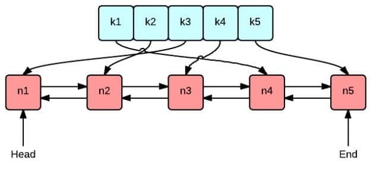

第一次请求时将一些**耗时操作的结果**暂存（存），以后遇到**相同的请求**（比较），（取）直接**返回暂存的数据**。整个过程涉及到 3 个方面动作：存、比较和取。

在计算机系统中，缓存无处不在。比如我们访问一个网页，网页和引用的 JS/CSS 等静态文件，根据不同的策略，会缓存在**浏览器本地**或是 **CDN 服务器**，那在第二次访问的时候，就会觉得网页加载的速度快了不少。再比如，微博的点赞数量，不可能每个客户端的每次访问，都从数据库中查找所有点赞的记录再做统计，**数据库的操作是很耗时的**，难以支持这么大的流量。所以，一般点赞这类数据是缓存在 Redis 服务器集群中的。

> 浏览器，是属于本地运行的服务；CDN 服务器则是对应服务端的设备服务。

商业世界里，现金为王；架构世界里，缓存为王！

**缓存**中最简单的莫过于**存储在内存中**的键值对缓存了。键值对，在 Go 中称之为 map。那直接创建一个 map，每次有新数据就往 map 中插入，这样做有什么问题？

1. **内存不够了怎么办？**

   向 map 中插入数据，特别是在考虑 map 底层数据结构时，插入数据多了后由于 Hash 碰撞，导致性能急剧下降。那就删除几条数据，是随机删除呢？还是按照时间顺序删除？有没有其他更好的缓冲淘汰策略呢？不同**数据访问频率**是不一样的，优先删除访问频率低的数据是不是更好？**数据的访问频率**可能随着时间变化，那优先删除**最近最少访问**的数据可能是一个更好的选择。

2. **并发写入冲突了怎么办？**

   **对缓存的访问，一般不可能是串行的**。map 是没有并发保护的，应对并发的场景需要加锁。

3. **单机性能不够怎么办？**

   单台计算机的资源是有限的，**计算、存储（指内存）**等都是有限的。

   随着业务量和访问量的增加，单台机器很容易遇到瓶颈。如果**利用多台计算机的资源**，**并行处理**提高性能就要缓存应用能够**支持分布式**，这称为**水平扩展**。与水平扩展相对应的是**垂直扩展**，即通过**增加单个节点的计算、存储、带宽**等，来提高系统的性能，硬件的成本和性能并非呈线性关系，大部分情况下，分布式系统是一个更优的选择。

4. 等等

设计一个**分布式缓存系统**，需要考虑资源控制、淘汰策略、并发、分布式节点通信等各个方面的问题。而且，**针对不同的应用场景，还需要在不同的特性之间权衡**，例如，是否需要支持缓存更新？还是假定缓存在淘汰之前是不允许改变的。不同的权衡对应着不同的实现。接下来的内容是**模仿 [groupcache](https://github.com/golang/groupcache) 的实现**，裁剪了部分功能。但总体实现上，还是与 groupcache 非常接近的。支持特性有：

- 单机缓存和基于 HTTP 的分布式缓存
- 最近最少访问(Least Recently Used, LRU) 缓存策略
- 使用 Go 锁机制防止缓存击穿
- 使用一致性哈希选择节点，实现负载均衡
- 使用 protobuf 优化节点间二进制通信
- ...

接下来，我们就开始设计和实现一个**分布式缓存系统**！

# 1 LRU 缓存淘汰策略

分布式缓存系统中的**所有缓存都存储在内存中**（如果不是存在内存中，那就不能称之为缓存），内存是有限的，由此不可能无限制地添加数据。

假定我们设置缓存能够使用的内存大小为 N，那么在添加了某一条缓存记录之后，占用内存超过了 N（阈值），这个时候就需要从缓存中移除一条或多条数据了。那问题在于移除谁呢？我们肯定希望尽可能移除“没用”的数据，那**如何判定数据“有用”或“没用”呢**？

> 也就是，使用量化关系，将每个数据的特征进行量化，通过比较量化后的值，达到判定数据“有用”的目的。

* **First In First Out**

  意为：**先进先出**，也就是淘汰最早添加的记录。FIFO 认为，最早添加的记录，其不再被使用的可能性比刚添加的可能性大。这种算法的实现非常简单：创建一个队列，新增记录（**判断何时需要新增记录，比如先在缓存中查找，但未找到**）添加到队尾，每次内存不够时，淘汰队首（仅考虑的是记录被添加进来的时间）。但是很多场景下，部分记录虽然是最早添加但也最常被访问，而不得不因为待的时间太长而**被淘汰**。这类数据会被频繁地添加进缓存，又被淘汰出去，导致**缓存命中率**降低。

* **Least Frequently Used**

  最少使用，也就是淘汰缓存中给**访问频率最低的记录**。**LFU 认为，如果数据过去被访问多次，那么将来被访问的频率也更高**。LFU 的实现需要维护一个按照访问次数排序的队列，每次访问，访问次数加1，队列重新排列，淘汰时选择访问次数最少的即可。LFU 算法的命中率是比较高的，但缺点也非常明显，**维护每个记录的访问次数**，对内存的消耗是很高的；另外，如果数据的**访问模式**发生变化，LFU 需要较长的时间去适应，也就是说 LFU 算法受历史数据的影响比较大。例如某个数据历史上访问次数**奇高**，但在某个时间点之后几乎不再被访问，但应为历史访问次数过高，而迟迟不能被淘汰。

* **Least Recently Used**

  最近最少使用，相对于仅考虑时间因素的 FIFO 和仅考虑访问频率的 LFU，LRU 算法可以认为是**相对平衡的一种淘汰算法**。**LRU 认为，如果数据最近被访问过，那么将来被访问的概率也会更高**。

  LRU 算法的实现非常简单，维护一个队列，如果某条记录被访问了，则移动到队尾。那么队首则是最近最少访问的数据，淘汰该条记录即可。

我要去实现的是这样的数据结构：

这张图很好地表示了 LRU 算法**最核心的 2 个数据结构**：

- 绿色的是字典(map)，存储键和值的映射关系。这样根据某个键(key)查找对应的值(value)的复杂是`O(1)`，在字典中插入一条记录的复杂度也是`O(1)`。
- 红色的是双向链表(double linked list)实现的队列。将所有的值放到双向链表中，这样，当访问到某个值时，将其移动到队尾的复杂度是`O(1)`，在队尾新增一条记录以及删除一条记录的复杂度均为`O(1)`。

首先要构造数据结构：

~~~go
type Cache struct {
	maxBytes  int64                         // Cache最大能容纳字节数
	nbytes    int64                         // 当前已装载容量
	ll        *list.List                    // Cache数据结构中双端链表
	cache     map[string]*list.Element      // key-value map，用于找到指定key对应的 *list.Element
	onRemoved func(key string, value Value) // Callback 机制
}
~~~

其中 `Cache.cache` 是为了依据 key 在 `Cache.ll` 中找到对应的节点。

接下来实现 Cache 的功能：

~~~go
type entry struct {
	key   string
	value Value
}

type Value interface {
	Len() int
}

func New(maxBytes int64, onRemoved func(key string, value Value)) *Cache {
	return &Cache{
		maxBytes:  maxBytes,
		ll:        list.New(),
		cache:     make(map[string]*list.Element),
		onRemoved: onRemoved,
	}
}

func (c *Cache) Add(key string, value Value) {
	if ele, ok := c.cache[key]; ok { // ele 类型：*list.Element
		// update the exists Element
		c.ll.MoveToFront(ele)
		kv := ele.Value.(*entry) // ele.Value 类型：*entry
		c.nbytes += int64(value.Len()) - int64(kv.value.Len())
		kv.value = value
	} else {
		// add a new Element
		newNode := c.ll.PushFront(&entry{key, value})
		c.cache[key] = newNode
		c.nbytes += int64(len(key) + value.Len())
	}
	for c.maxBytes != 0 && c.nbytes > c.maxBytes {
		c.RemoveOldest()
	}
}

func (c *Cache) Get(key string) (value Value, ok bool) {
	if ele, ok := c.cache[key]; ok {
		// Cache最前端是最近一次访问的节点，末尾是最早访问的节点
		c.ll.MoveToFront(ele)
		kv := ele.Value.(*entry) // ele.Value 类型：*entry
		return kv.value, true    // 如果直接写成 return 返回的 ok 值为 false
	}
	return
}

func (c *Cache) RemoveOldest() {
	ele := c.ll.Back()
	if ele != nil {
		kv := ele.Value.(*entry)
		delete(c.cache, kv.key)
		c.ll.Remove(ele)
		c.nbytes -= (int64(len(kv.key)) + int64(kv.value.Len()))
		if c.onRemoved != nil {
			c.onRemoved(kv.key, kv.value)
		}
	}
}

func (c *Cache) Len() int64 {
	return int64(c.ll.Len())
}
~~~

使用了标准库中原生的 `list.List`——一种双端队列数据结构，其中每个节点的数据结构是 `list.Element`，其中元素中存放的值 Value 在上述 Cache 中是：entry 类型，是一种 `key-value` 值。

对应的测试代码：

~~~go
package lru

import (
	"reflect"
	"testing"
)

type String string

func (s String) Len() int {
	return len(s)
}

func TestGet(t *testing.T) {
	lru := New(int64(0), nil)
	lru.Add("key1", String("1234"))

	if v, ok := lru.Get("key1"); !ok || string(v.(String)) != "1234" {
		t.Log(ok, string(v.(String)))
		t.Fatal("cache hit key1=1234 failed")
	}
	if _, ok := lru.Get("key2"); ok {
		t.Fatal("cache miss key2 failed")
	}
}

func TestRemoveoldest(t *testing.T) {
	k1, k2, k3 := "key1", "key2", "key3"
	v1, v2, v3 := "value1", "value2", "value3"

	cap := len(k1 + k2 + v1 + v2)
	lru := New(int64(cap), nil)
	lru.Add(k1, String(v1))
	lru.Add(k2, String(v2))
	lru.Add(k3, String(v3))

	if _, ok := lru.Get("key1"); ok || lru.Len() != 2 {
		t.Fatal("Removeoldest key1 failed")
	}
}

func TestOnEvicted(t *testing.T) {
	keys := make([]string, 0)
	callback := func(key string, value Value) {
		keys = append(keys, key)
	}

	lru := New(int64(10), callback)
	lru.Add("key1", String("123456"))
	lru.Add("k2", String("k2"))
	lru.Add("k3", String("k3"))
	lru.Add("k4", String("k4"))

	expect := []string{"key1", "k2"}

	t.Log(keys)
	if !reflect.DeepEqual(expect, keys) {
		t.Fatalf("call onRemoved failed, expect keys equals to %s", expect)
	}
}
~~~

# 2 单机并发缓存

想要了解并发，可以从简单的例子出发：

~~~go
package main

import (
	"fmt"
	"time"
)

func main() {
	set := make(map[int]bool)

	for i := 0; i < 10; i++ {
		go func() {
			if _, ok := set[100]; !ok {
				fmt.Println("100")
				set[100] = true
			}
		}()
	}

	time.Sleep(1 * time.Second)
}
~~~

这段程序的核心数据变量是：set，是一个 `map[int]bool`。我们知道在 Go 中的 map 是不支持并发访问的，这段程序的输出有很多中形式，可能打印了 4 个 100，也可能打印了很多个，还有可能直接 crash——`fatal error: concurrent map read and map write`！

多个 goroutine **同时读写同一个变量**，在并发度较高的情况下，会发生**冲突**。确保一次只有一个 goroutine 可以访问该变量以避免冲突，这称之为`互斥`，互斥锁可以解决这个问题。

> sync.Mutex 是一个互斥锁，可以由**不同的** goroutine 加锁和解锁。

`sync.Mutex` 是 Go 语言标准库提供的一个互斥锁，当一个 goroutine 获得了这个锁的拥有权后，其它**请求锁**的 goroutine 就会阻塞在 `Lock()` 方法的调用上，直到调用 `Unlock()` 锁被释放。

经过 sync.Mutex 改造后的代码如下：

~~~go
package main

import (
	"fmt"
	"sync"
	"time"
)

func main() {
	set := make(map[int]bool)

	var lock sync.Mutex

	for i := 0; i < 10; i++ {
		go func() {
			lock.Lock()
			defer lock.Unlock()
			if _, ok := set[100]; !ok {
				fmt.Println("100")
				set[100] = true
			}
		}()
	}

	time.Sleep(1 * time.Second)
}
~~~

相同的数字只会被打印一次。当一个 goroutine 调用了 `Lock()` 方法时，**其他 goroutine 调用 `Lock()` 时会被阻塞**，直到 `Unlock()` 调用将锁释放。因此被包裹部分的代码就能够避免冲突，实现互斥。

# 3 HTTP 服务端

# 4 一致性哈希 Hash

# 5 分布式节点

# 6 防止缓存击穿

# 7 使用 Protobuf 通信