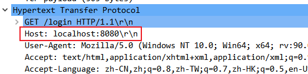

Go 中的标准库 strings，用于处理 UTF-8 编码的字符串，可将 strings 包当作是**一个（UTF-8编码格式的）字符串**处理工具箱。

本篇我们来介绍 strings 包下有关 IndexXxx 和 LastIndexXxx 的函数。

~~~go
func IndexByte(s string, c byte) int
~~~

将 s 视为 UTF-8 编码的字符串，IndexByte 函数返回 s 字符数组中首次匹配字符 c 的位置索引值，**如果不存在，则返回 -1**。示例程序：

~~~go
package main

import (
	"fmt"
	"strings"
)

func main() {
	fmt.Println(strings.IndexByte("golang", 'g'))
	fmt.Println(strings.IndexByte("gophers", 'h'))
	fmt.Println(strings.IndexByte("golang", 'x'))
}
~~~

在 net/http/server.go 下也使用该标准函数：

~~~go
// stripHostPort returns h without any trailing ":<port>".
func stripHostPort(h string) string {
	// If no port on host, return unchanged
	if strings.IndexByte(h, ':') == -1 {
		return h
	}
	host, _, err := net.SplitHostPort(h)
	if err != nil {
		return h // on error, return unchanged
	}
	return host
}
~~~

在 HTTP 通信中，一般 Host 的值：

上述函数的作用就是将 Host 的值：`localhost:8080\r\n`，剥离出端口号，其返回值是：localhost。
